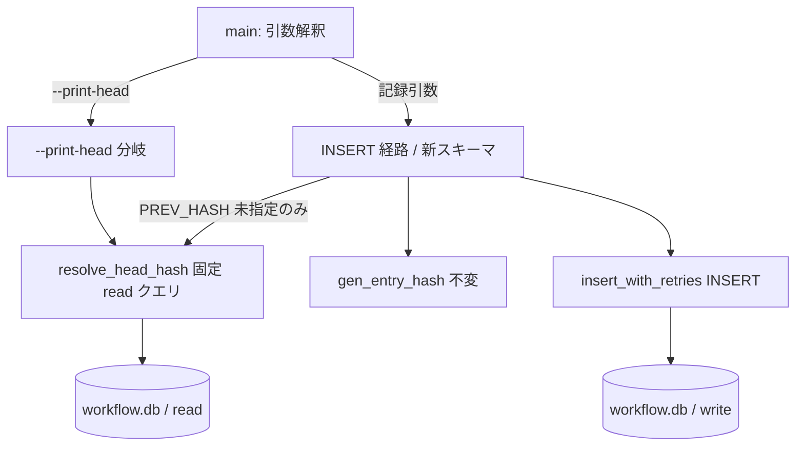
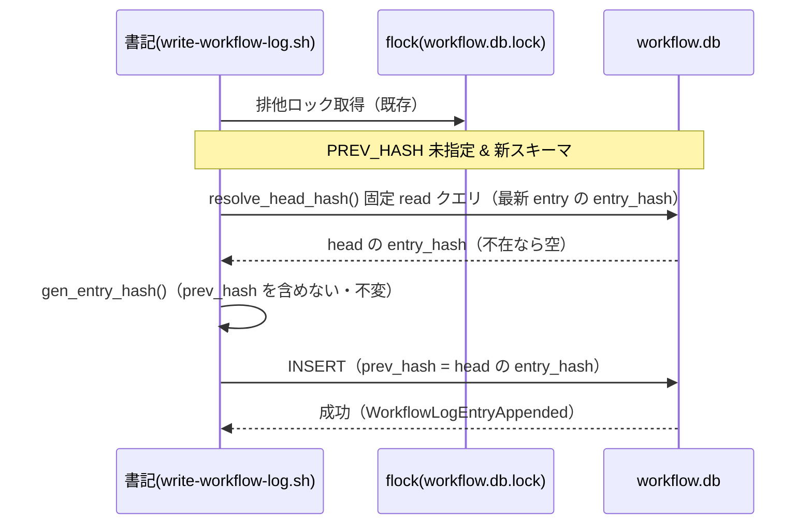
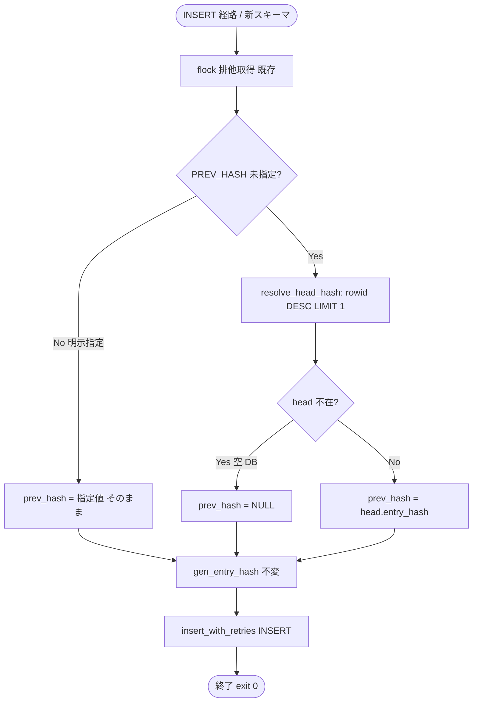
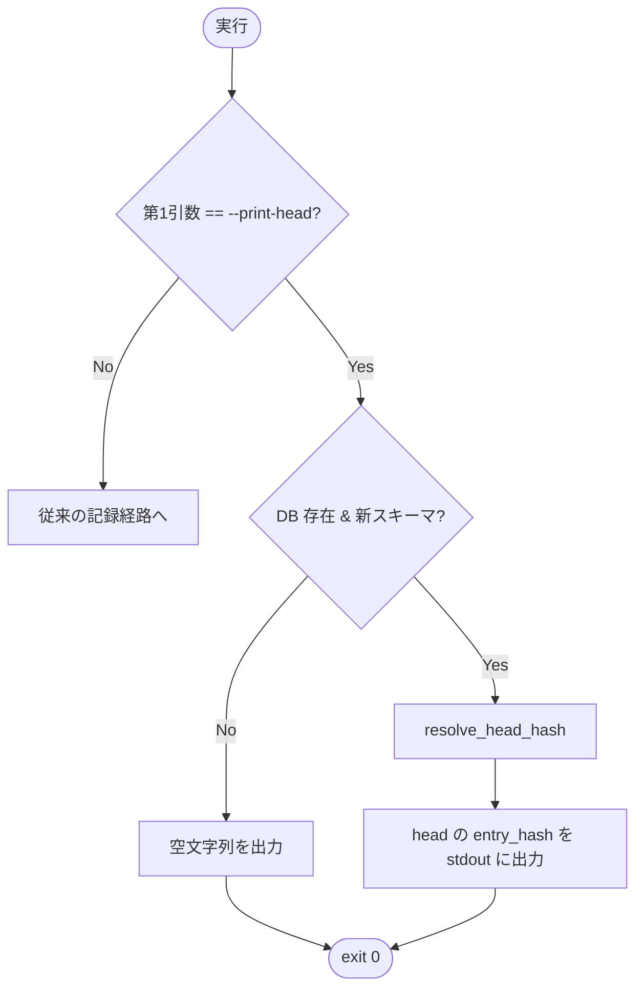

# 設計書: 台帳 write-workflow-log の prev_hash 自動連結

**プロジェクト名**: 台帳 write-workflow-log の prev_hash 自動連結（DB head 自動取得）
**作成日**: 2026 年 06 月 14 日
**最終更新**: 2026 年 06 月 14 日

> **重要**: **このドキュメントは常に更新**: 設計の変更や追加があった場合は、即座にこのドキュメントを更新してください。ドキュメントは「生きているドキュメント」として扱い、実装内容と常に同期させます。
>
> **凡例**: 本書では既存スキーマ・スクリプトの確認済み事実を**【事実】**、本設計での判断を**【判断】**で区別する。
>
> **用語**: [.agents/CONCEPTS.md §用語規約](../../../../../.agents/CONCEPTS.md#用語規約) を参照。

---

## 1. 設計概要

**参照**: 設計方針・原則は [.agents/spec/01\_設計原則.md](../../../../../.agents/spec/01_設計原則.md) を先に参照した。

### 1.1 設計方針

`write-workflow-log.sh` 内に閉じた最小変更で、書記が PREV_HASH 未指定でも記録直前に DB head（最新 entry の `entry_hash`）を自動取得して連結し、同一ロジックを read 専用サブコマンド（`--print-head`）でも共有する。既存スキーマ・CHECK 制約・`entry_hash` 計算・引数 I/F は一切変更しない。

### 1.2 設計原則（本プロジェクトで適用するもの）

- **UNIX哲学**: head 取得は「最新 entry 1 行を取る単一 SELECT」だけを行う小さな関数に閉じる。`--print-head` はその結果を標準出力に出す「1 つのことをうまくやる」サブコマンドとする。
- **単一責務**: 「最新 entry（head）の決定」を 1 つの関数（`resolve_head_hash`（仮称））に集約し、自動連結経路と `--print-head` 経路がこれを共有する（00 §3.4 保守性）。head 決定ロジックを 2 か所に重複させない。
- **CQRS**: 状態取得（head の Query = `--print-head` / 自動連結時の head SELECT）と状態変更（INSERT = Command）を関数レベルで分離する。Query は read 専用・固定クエリで副作用を持たない。
- **AIフレンドリー設計**: 既存スクリプト 1 ファイル内に小さな関数を 1 つ追加し、分岐は最小に保つ。意図が分かる関数名・サブコマンド名（`--print-head`）を用いる。

---

## 2. アーキテクチャ設計

### 2.1 責務・境界・参照関係

#### 2.1.1 責務一覧

| コンポーネント | 責務（1 文） |
| -------------- | ------------ |
| `resolve_head_hash`（新規・head 決定関数） | DB の現 head（最新 entry の `entry_hash`）を固定の read クエリで 1 行取得して返し、head 不在時は空文字列を返す。 |
| `--print-head` 分岐（新規・read サブコマンド） | 引数解釈の最初で `--print-head` を判定し、`resolve_head_hash` の結果を標準出力に出して exit 0 する（INSERT 経路に進まない）。 |
| 自動連結ロジック（既存 INSERT 経路への差し込み） | PREV_HASH 未指定かつ新スキーマのとき、flock 取得後・INSERT 直前に `resolve_head_hash` を呼び `prev_hash` に用いる。明示指定時は呼ばない。 |
| `gen_entry_hash`（既存・不変） | entry の内容から `entry_hash` を計算する。**prev_hash を入力に含めない**（変更しない）。 |
| INSERT 実行（既存・`insert_with_retries`） | 1 行 INSERT を flock 排他・SQLITE_BUSY リトライ付きで実行する（変更しない）。 |

#### 2.1.2 境界

- **入力**: 既存の記録 I/F（位置引数 `command summary dod_met ts_utc [issue_path] [changed_files]` ＋環境変数群、任意の `PREV_HASH`）。新規の read I/F（`--print-head` フラグ。位置引数なし）。
- **出力**: 記録 I/F は従来どおり workflow.db への 1 行 INSERT と exit code。read I/F は標準出力に head の `entry_hash`（または head 不在時は空文字列）と exit 0。
- **他責務との境界（本 issue の範囲外）**:
  - 過去に途切れたチェーンの遡及修復（00 §5）。
  - `entry_hash` アルゴリズム・audit 側の prev_hash 検証ロジック（01 §5、00 §5）。
  - スキーマ自体の変更（カラム追加・CHECK 変更）。本設計は**既存スキーマのまま**実現する。

#### 2.1.3 参照関係

- `main 引数解釈` → `--print-head 分岐` → `resolve_head_hash`（read のみで終了）
- `main 引数解釈` → `INSERT 経路（新スキーマ）` → （PREV_HASH 未指定時のみ）`resolve_head_hash` → `gen_entry_hash` → `insert_with_retries`
- `resolve_head_hash` → `sqlite3`（固定 read クエリ 1 本のみ）
- 循環参照なし。`resolve_head_hash` は他へ依存せず（sqlite3 read のみ）、上位（read 経路・INSERT 経路）が片方向に参照する。

### 2.2 システムアーキテクチャ

**参照**: [.agents/spec/](../../../../../.agents/spec/)（[00_spec概要.md](../../../../../.agents/spec/00_spec概要.md)、[01\_設計原則.md](../../../../../.agents/spec/01_設計原則.md)、[06\_設計判断の優先順位.md](../../../../../.agents/spec/06_設計判断の優先順位.md)）を参照した。

- **採用パターン**: 単一スクリプト内の関数分割（CQRS の関数レベル適用 + 単一責務）。新規プロセス・新規ファイルを追加しない。
- **根拠**: 既存の経路一本化（書記ラッパー 1 本）を壊さない最小変更が最優先（06 設計判断の優先順位／UNIX 哲学「シンプルに保つ」）。head 決定を 1 関数に集約することで自動連結と read 経路の整合を構造的に保証する。

#### 2.2.1 CQRS（Command/Query 分離）

- **Command**: `INSERT INTO workflow_log ...`（状態変更）。`insert_with_retries` で実行（既存・不変）。
- **Query**: `resolve_head_hash`（状態取得）。read 専用・固定クエリで現 head の `entry_hash` を返す。`--print-head` はこの Query のみを公開する。

#### 2.2.2 アーキテクチャ図



### 2.3 コンポーネント構成

**境界・単一責務**: 変更は `.agents/scripts/write-workflow-log.sh` の 1 ファイルに閉じる（Infrastructure 層相当）。

- **read 経路（Query）**: `--print-head` フラグ判定 → `resolve_head_hash` → 標準出力。**AGENT_ROLE=scribe ガードの扱いは §3.2.4 の判断に従う。**
- **head 決定（共有 Query）**: `resolve_head_hash` 1 関数。自動連結・`--print-head` の唯一の head 取得経路。
- **write 経路（Command）**: 既存 INSERT 経路に「PREV_HASH 未指定時の自動連結」だけを差し込む。`gen_entry_hash`・CHECK・引数 I/F は不変。

### 2.4 データフロー

発行する状態変化（事実）: `WorkflowLogEntryAppended`（1 行 INSERT 成功）。read 経路は状態を変えないためイベントを発行しない。

**自動連結の記録フロー（PREV_HASH 未指定）**:



---

## 3. 機能設計

### 3.1 機能 1: DB head 自動取得・自動連結（head 決定キー）

#### 3.1.1 概要

PREV_HASH 未指定時、記録直前に DB head の `entry_hash` を取得し `prev_hash` に連結する。中核論点は **head（最新 entry）を一意に決める順序キー**である。

#### 3.1.2 head 決定キーの検討と採用

【事実】01 §2.3 ビジネスルールでは「`created_at`/`ts_utc` の最大」を例示したが、`ts_utc` は呼び出し側が渡す任意文字列で、本リポの既存 entry には UTC 形式（`...Z`）と JST 形式（`+0900`）が混在する。文字列比較では `+0900`（数字）と `Z`（英字）の辞書順が時刻順と一致せず、`MAX(ts_utc)` は head を誤決定し得る。`created_at` は `date -u +"%Y-%m-%dT%H:%M:%SZ"`（秒精度・UTC）だが、同一秒に複数 entry があると一意に定まらない。

【事実】`workflow_log` は `entry_id TEXT PRIMARY KEY` で定義され、`INTEGER PRIMARY KEY` でも `WITHOUT ROWID` でもない（schema.sql で確認）。したがって SQLite の暗黙 `rowid` が存在し、**INSERT 順に単調増加**する。本書記ラッパーは「1 回 1 行 INSERT のみ」「flock 排他」で書き込みを一本化しているため、rowid の増加順 = チェーンの追記順と一致する。

【判断】**head 決定キーに暗黙 `rowid` を採用する。** head 取得クエリは次の固定クエリとする。

```sql
SELECT entry_hash FROM workflow_log ORDER BY rowid DESC LIMIT 1;
```

採用案と代替案の比較:

| 案 | 一意性 | 後方互換 | 変更量 | 並行整合 | 採否 |
| --- | --- | --- | --- | --- | --- |
| **暗黙 rowid（採用）** | INSERT 順で単調・一意 | スキーマ変更なし・既存 DB そのまま動く | 最小（SELECT 1 本） | flock 取得後の再取得で担保 | **採用** |
| `MAX(ts_utc)` | 形式混在で順序破綻・同値あり | 変更なし | 小 | 同上 | 不採用（誤決定リスク） |
| `created_at` 正規化 | 同一秒で非一意 | 変更なし | 中（正規化処理） | 同上 | 不採用（一意性不足） |
| 連番列追加（`seq INTEGER`） | 一意 | **スキーマ変更が必要**・旧 DB 移行が要る | 大 | 同上 | 不採用（00 §3.3 非破壊に反する） |

【判断】rowid は「最後に物理 INSERT された行」を指し、本ラッパーの追記専用・排他書き込みの前提下では論理的な head と一致する。UPDATE/DELETE を行わない（schema.md §運用「INSERT のみ」）ため rowid の歯抜け・再利用も発生しない。

#### 3.1.3 処理フロー



#### 3.1.4 入力・出力

- **入力**: 既存記録引数 ＋ 環境変数 `PREV_HASH`（任意）。
- **出力**: `prev_hash` 列に「明示指定値」「head の entry_hash（自動連結）」「NULL（head 不在）」のいずれかが入った 1 行 INSERT。

#### 3.1.5 エラーハンドリング

- `resolve_head_hash` の SELECT が失敗（DB ロック等）した場合は、既存の INSERT と同様の扱い（read は flock 取得後・PRAGMA busy_timeout 設定後に実行するため通常は成功）。head が 0 行なら空文字列を返し `prev_hash=NULL` として扱う（異常終了しない）。
- 旧スキーマ（`entry_id` 無し）DB では自動連結を行わず従来挙動を維持する（§3.3）。

### 3.2 機能 2: sanctioned な head 読出し（`--print-head`）

#### 3.2.1 概要

書記以外も `sqlite3` を直接実行せず現 head の `entry_hash` を確認できる read 専用サブコマンドを提供する。

#### 3.2.2 処理フロー



#### 3.2.3 入力・出力

- **入力**: `write-workflow-log.sh --print-head`（位置引数なし）。
- **出力**: 現 head の `entry_hash` を標準出力に 1 行。head 不在（空 DB・DB 未作成・旧スキーマ）では空文字列（末尾改行のみ）。**いずれも exit 0**（01 ユースケース2 シナリオ2）。
- 任意 SQL は受け付けない（固定 read クエリのみ。00 §3.2／01 §3.2）。

#### 3.2.4 設計判断（read 経路の AGENT_ROLE ガード）

【事実】現行スクリプトは冒頭（15 行）で `AGENT_ROLE != scribe` なら exit 1 する。これは「書記以外は書き込めない」ためのガードである。

【判断】`--print-head` は read 専用で状態を変えないため、**`--print-head` 分岐は `AGENT_ROLE` ガードより前に評価し、書記以外でも実行可能とする**。これにより「書記以外（監査・運用者）が経路一本化を破らず head を確認できる」という 00 効果3／01 ユースケース2 の意図を満たす。書き込み経路（INSERT）の scribe 限定は一切緩めない。**実装は §3.2.2 のとおり、引数解釈の最初に `--print-head` を判定して read して exit する。**

#### 3.2.5 エラーハンドリング

- DB ファイルが存在しない／`workflow_log` が無い／旧スキーマ → 空文字列・exit 0（head 不在）。
- 不正な追加引数が付いた場合は使用法を stderr に出し非ゼロで終了してよい（01 §3.3 ユーザビリティ）。**ただし正規の `--print-head` 単独実行は必ず exit 0。**

### 3.3 機能 3: 並行整合・後方互換・旧スキーマ

#### 3.3.1 並行整合（head 再取得）

【事実】現行スクリプトは 202-205 行で flock 排他を取得してから INSERT する。

【判断】`resolve_head_hash` による head 取得を **flock 取得後・INSERT 直前**に置く（01 §2.3／ユースケース3）。これにより、別セッションの書記がロック解放直前に追記した entry も自セッションのロック取得後の SELECT で見え、真の head に連結できる（直前 entry を飛ばさない）。flock 不可環境では SQLITE_BUSY リトライに依存する（既存方針）。

#### 3.3.2 後方互換（PREV_HASH 明示指定）

【判断】自動連結は **PREV_HASH が空（未指定）のとき限定**。明示指定時は `resolve_head_hash` を呼ばず、既存の `NULLIF('$E_PH','')` でその値を記録する（00 SC-04／01 シナリオ3）。判定は既存変数 `PREV_HASH` の空判定で行い、引数 I/F は変えない。

#### 3.3.3 旧スキーマ互換

【事実】現行スクリプトは `entry_id` カラムの有無で新旧スキーマを分岐（244-248 行）し、旧スキーマでは prev_hash/entry_hash を持たない INSERT を行う。

【判断】自動連結・`--print-head` の head 取得はいずれも **新スキーマ（`entry_id` あり）のときのみ**有効とする。旧スキーマ DB では従来挙動を維持し、`--print-head` は空文字列・exit 0 を返す（00 §3.3／01 ストーリー3）。

---

## 4. データ設計

### 4.1 データモデル

【事実】本設計は **スキーマを一切変更しない**。`workflow_log` の既存カラム・CHECK・索引をそのまま用いる。`prev_hash`（TEXT NULL）・`entry_hash`（TEXT NOT NULL）・暗黙 `rowid`（`entry_id TEXT PRIMARY KEY` のため存在）を利用する。

#### テーブル一覧

| テーブル名 | 説明 | 主キー |
| ---------- | ---- | ------ |
| workflow_log | 書記の実行証跡（チェーン型）。本 issue で構造は変更しない。 | entry_id（TEXT）＋暗黙 rowid |

#### テーブル詳細（本 issue が関与する列のみ）

##### workflow_log（抜粋・既存定義のまま）

| カラム名 | 型 | NULL | デフォルト | 説明 | 備考 |
| -------- | -- | ---- | ---------- | ---- | ---- |
| entry_id | TEXT | NO | - | レコード一意識別子（UUID） | PK・暗黙 rowid を伴う |
| prev_hash | TEXT | YES | NULL | 直前 entry の entry_hash。**本 issue で未指定時に自動連結** | 値の決定方法のみ変更・列定義は不変 |
| entry_hash | TEXT | NO | - | 当該 entry のハッシュ（`gen_entry_hash`） | 計算入力は不変（prev_hash 非含有） |
| (rowid) | INTEGER | NO | 自動 | SQLite 暗黙の行 ID。INSERT 順に単調増加 | **head 決定キーとして使用（読み取りのみ）** |

### 4.2 データ構造

- **head の表現**: `entry_hash` 文字列、または head 不在を表す空文字列。`resolve_head_hash` の戻り値はこの 2 値のみ。
- prev_hash は INSERT 値としてのみ扱い、`gen_entry_hash` の入力には含めない（01 §2.3／00 §4.1）。

---

## 5. API 設計

### 5.1 API 一覧

| エンドポイント（CLI I/F） | メソッド | 説明 |
| ------------------------- | -------- | ---- |
| `write-workflow-log.sh command summary dod_met ts_utc [issue_path] [changed_files]` | 記録（Command） | 既存。`PREV_HASH` 未指定時に自動連結（後方互換） |
| `write-workflow-log.sh --print-head` | head 読出し（Query） | 新規。現 head の entry_hash を stdout に返す |
| `resolve_head_hash`（内部関数） | head 取得（Query） | 新規。固定 read クエリで head の entry_hash／空を返す |

### 5.2 API 詳細

#### API1: 記録 I/F（既存・自動連結を追加）

- **I/F**: `AGENT_ROLE=scribe write-workflow-log.sh command summary dod_met ts_utc [issue_path] [changed_files]`、環境変数 `PREV_HASH` 任意。
- **入力**: 既存引数・環境変数。`PREV_HASH` が空なら自動連結対象。
- **出力**: 1 行 INSERT（`prev_hash` = 明示値／head の entry_hash／NULL）。exit 0 で成功。
- **契約違反の扱い**: 既存どおり（AGENT_ROLE≠scribe→exit 1、command 許可リスト外→exit 1、DOCUMENT_ID 空→exit 1 等）。本変更で新たな失敗条件は追加しない。

#### API2: head 読出し I/F（新規）

- **I/F**: `write-workflow-log.sh --print-head`。
- **入力**: `--print-head` フラグのみ（位置引数なし）。
- **出力**: 現 head の `entry_hash`（1 行）／head 不在時は空文字列。常に exit 0。
- **契約**: 固定 read クエリのみ。任意 SQL 不可。書き込みなし。AGENT_ROLE ガードの前で評価（§3.2.4）。

#### API3: `resolve_head_hash`（内部・共有）

- **入力**: なし（DB パスはスクリプト内固定変数 `WF_DB`）。
- **出力**: head の `entry_hash` または空文字列。
- **責務**: `SELECT entry_hash FROM workflow_log ORDER BY rowid DESC LIMIT 1;` の単一 read。新スキーマ・DB 存在を前提に、不在時は空を返す。

---

## 6. テスト戦略

テスト戦略の**観点の定義**は [RULES.md のテスト戦略必須要件](../../../../../.agents/RULES.md#テスト戦略必須要件) を、**BDD 形式の定義**は [TEST_BDD_FORMAT.md](../../../../../.agents/TEST_BDD_FORMAT.md) を参照する。

**テスト隔離（必須・本リポ最優先ルール）**: テストは [.agents-project/自己拡張ワークフロー.md](../../../../../.agents-project/自己拡張ワークフロー.md) §テストの tmp 隔離 に従い、**`mktemp -d` の一時ディレクトリに作った一時 DB**（または `git archive HEAD | tar -x` のクリーン環境）で実施する。**本リポの `.workflow/workflow.db` を使用・変更してはならない。** schema.sql を一時 DB に流して検証し、終了後に一時環境を片付ける。

### 6.1 対象ごとのテスト割り当て

| 対象 | 単体 | 結合/API | E2E | クリティカル観点 | バリデーション観点 | 未達理由/補足 |
| ---- | ---- | -------- | --- | ---------------- | ------------------ | ------------- |
| `resolve_head_hash`（head 決定） | ○ | ○ | × | 連続2件で head=直前 entry_hash（SC-01） | head 不在=空（SC-02/03） | E2E はスクリプト I/F 経由（結合）でカバー |
| 自動連結（INSERT 経路） | × | ○ | ○ | 2件目 prev_hash=1件目 entry_hash／中間 NULL なし（SC-01） | 空 DB 初回 prev_hash=NULL・exit0（SC-02） | bash スクリプトのためスクリプト実行で検証 |
| `--print-head`（read 経路） | × | ○ | ○ | head の entry_hash を stdout（SC-03） | 空 DB は空・exit0（SC-03） | sqlite3 直接実行なしで head 取得 |
| 後方互換（PREV_HASH 明示） | × | ○ | ○ | 明示値が prev_hash に記録・上書きなし（SC-04） | - | 自動取得値で上書きしないこと |
| 非破壊（CHECK/entry_hash/scribe） | × | ○ | × | gen_entry_hash 不変・CHECK 維持（SC-05） | AGENT_ROLE≠scribe で書込拒否維持 | read 経路は scribe 不要（§3.2.4）だが INSERT は scribe 限定維持 |
| 並行整合（flock 後 head 再取得） | × | ○ | × | ロック後再取得で真の head に連結（01 UC3） | - | 逐次2件で再取得が直前 entry を指すことで担保 |

### 6.2 監査・レビューでの確認（証跡）

本設計書 §6.1 の割当表と 03\_実装計画のタスク別テスト観点・BDD が揃っていること、01 の SC-01〜05 とテストケースが対応していることを監査で確認する。本フェーズは設計のみで、実テスト・コード変更は後続 implement-feature で行う（00 §5／01 §5）。

---

## 7. UI 設計

該当なし（CLI ツールのみ。GUI 画面は無い）。`--print-head` の出力仕様は §3.2.3／§5.2 を参照。

---

## 8. セキュリティ設計

### 8.1 認証・認可

- **書き込み（INSERT）**: 既存どおり `AGENT_ROLE=scribe` 限定・`actor_role='scribe'` CHECK を維持する（緩めない）。
- **読み出し（`--print-head`）**: read 専用・固定クエリのため scribe を要求しない（§3.2.4）。任意 SQL 実行経路は新設しない（00 §3.2／01 §3.2）。

### 8.2 データ保護

- `entry_hash` 計算入力・CHECK 制約・DB パス固定（`.workflow/workflow.db`）を変更しない。改ざん検知の連鎖性を「prev_hash 自動連結」で強化する。

---

## 9. 非機能要件への対応

### 9.1 パフォーマンス

- head 取得は `ORDER BY rowid DESC LIMIT 1` の単一 SELECT 1 回のみ（rowid は PK 索引相当で高速）。記録 1 回あたりの追加クエリは 1 回まで（00 §3.1／01 §3.1）。

### 9.2 可用性

- 空 DB・head 不在・旧スキーマでも異常終了せず、自動連結は NULL、`--print-head` は空文字列・exit 0（01 §3.4）。SQLITE_BUSY は既存リトライ（最大 5 回・100ms）に従う。

---

## 10. 参考資料

### プロジェクトドキュメント

- [`01_要件定義.md`](./01_要件定義.md) - 要件定義
- `.agents/scripts/write-workflow-log.sh`（PREV_HASH 受け取り 143 行・INSERT 351 行・`gen_entry_hash` 62-65 行・flock 202-205 行・新旧スキーマ分岐 244-248 行）
- `.agents/ledger/schema.sql`（`workflow_log` の正本。`entry_id TEXT PRIMARY KEY`＝暗黙 rowid 利用可）
- `.agents/ledger/schema.md`（prev_hash/entry_hash の意味・運用一本化）

### その他の参考資料

- `.agents-project/自己拡張ワークフロー.md`（テストの tmp 隔離・issue 配置）

---

## 11. 前のステップ

- **前**: [`01_要件定義.md`](./01_要件定義.md) - 要件定義フェーズ

---

## 12. 次のステップ

- **次**: [`03_実装計画.md`](./03_実装計画.md) - 実装計画フェーズ
