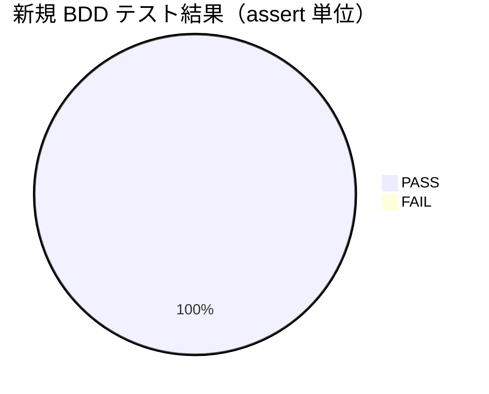

# レビュー書: 台帳 write-workflow-log の prev_hash 自動連結

**プロジェクト名**: 台帳 write-workflow-log の prev_hash 自動連結（DB head 自動取得）
**作成日**: 2026 年 06 月 14 日
**最終更新**: 2026 年 06 月 14 日

> **重要**: **このドキュメントは常に更新**: レビューで発見した問題点や改善提案、対応内容などがあった場合は、即座に更新する。
>
> **用語**: [.agents/CONCEPTS.md §用語規約](../../../../../.agents/CONCEPTS.md#用語規約) を参照。
>
> **必須**: レビュー実施時は [`.agents/REVIEW_RULE.md`](../../../../../.agents/REVIEW_RULE.md) を参照した。**レビュー深度: standard**（既存スクリプト 1 ファイル内の最小変更・改ざん検知価値に直結のため）。

---

## 1. レビュー概要

### 1.1 レビュー目的（必須）

実装内容の確認・品質保証（prev_hash 自動連結の実効性とテスト再実行による検証、既存制約の非破壊を確認する）。

### 1.2 レビュー対象（必須）

- **実装範囲**: `.agents/scripts/write-workflow-log.sh` の prev_hash 自動連結（`resolve_head_hash` 追加・`--print-head` read 経路・PREV_HASH 未指定時の自動連結）と、新規 BDD テスト `.agents/scripts/test/test-write-workflow-log-prevhash.sh`。
- **レビュー期間**: 2026-06-14 ～ 2026-06-14
- **レビュー担当者**: auditor / scribe（サブエージェント・verify-and-close）

---

## 2. 実装内容の確認

### 2.1 実装完了タスク（または Issue）

| タスク名 | 実装内容 | 実装日 | 担当者 | ステータス |
| -------- | -------- | ------ | ------ | ---------- |
| T1 `resolve_head_hash` | `SELECT entry_hash FROM workflow_log ORDER BY rowid DESC LIMIT 1` の固定 read クエリで head を返す共有 Query 関数を追加。DB 未存在・旧スキーマ・0 件は空文字列。 | 2026-06-14 | 実装者 | 完了 |
| T2 `--print-head` | 引数解釈の最初（AGENT_ROLE ガードより前）で判定し head を stdout に出して exit 0。余分引数は Usage・exit 1。 | 2026-06-14 | 実装者 | 完了 |
| T3 自動連結 | 新スキーマかつ PREV_HASH 未指定時、flock 取得後・INSERT 直前に `resolve_head_hash` を呼び連結。明示指定は非上書き。 | 2026-06-14 | 実装者 | 完了 |
| T4 tmp 隔離テスト | SC-01〜05 を `mktemp -d` 一時 DB で検証する BDD テストを新規作成。本番 DB 非破壊を自己検証。 | 2026-06-14 | 実装者 | 完了 |

### 2.2 実装内容の詳細

#### タスク 1〜3: `write-workflow-log.sh` 改修

- **変更ファイル**: `.agents/scripts/write-workflow-log.sh`
- **実装方法**: git diff で確認した変更点は次の通りで、設計（02 §3）と一致する。
  - `WF_DB`（DB パス固定）の定義をスクリプト冒頭へ前倒し（read 経路でも使うため）。INSERT 経路と同一の固定パスのまま（引数・環境変数で上書き不可）。
  - `resolve_head_hash`: `[[ -f "$WF_DB" ]]` / `command -v sqlite3` / `entry_id` カラム有無を順にガードし、新スキーマかつ DB 存在時のみ固定クエリ `SELECT entry_hash ... ORDER BY rowid DESC LIMIT 1` を実行。head 不在・旧スキーマ・DB 未存在は空文字列（`return 0`）。read 専用・副作用なし。
  - `--print-head`: `set -euo pipefail` 直後・AGENT_ROLE ガードより前に `[[ "${1:-}" == "--print-head" ]]` を評価（02 §3.2.4 の判断どおり）。余分引数があれば Usage を stderr に出し exit 1。正規単独実行は `resolve_head_hash` の結果を出して exit 0。
  - 自動連結（383 行 INSERT 直前・369 行）: `if [[ -z "${PREV_HASH//[[:space:]]/}" ]]; then PREV_HASH="$(resolve_head_hash)"; fi`。これは flock 取得（231 行）・mkdir・DB 作成・新スキーマ判定の後にあり、**flock 取得後・INSERT 直前**という設計要件（02 §3.3.1）を満たす。head 不在時は空のまま `NULLIF('$E_PH','')` で NULL になる。
- **確認事項（非破壊）**:
  - `gen_entry_hash` の呼び出し引数（373 行）は変更前と同一で、`prev_hash` を計算入力に含めない（SC-05）。
  - `actor_role='scribe'` ガード（45 行）・CHECK 制約・command 許可リスト・schema.sql は未変更。
  - 旧スキーマ分岐（`HAS_NEW_SCHEMA` 空時）は自動連結を通らず従来挙動を維持。

#### タスク 4: 新規 BDD テスト

- **変更ファイル**: `.agents/scripts/test/test-write-workflow-log-prevhash.sh`（新規）
- **実装方法**: 全シナリオを `mktemp -d` 一時 DB／`PROJECT_ROOT` を tmp に向けて実行。冒頭・末尾で本番 DB（`.workflow/workflow.db`）の行数・mtime を計測し非破壊を自己検証する。schema.sql は read のみ。

---

## 3. テスト結果の確認

### 3.1 単体テスト（新規 BDD・tmp 隔離で再実行）

#### テスト実行結果（必須: 数値で記載）

- **実行日**: 2026-06-14
- **テストファイル数**: 1（`test-write-workflow-log-prevhash.sh`）
- **テストケース（assert）数**: 16
- **成功**: 16
- **失敗**: 0
- **スキップ**: 0
- **evidence_source**: `test_output`（本レビューで `bash .agents/scripts/test/test-write-workflow-log-prevhash.sh` を tmp 隔離のまま再実行。EXIT=0、PASS=16 FAIL=0）

#### (A)〜(E) の自分による独立再現（一時 DB・SELECT 実測。evidence_source: test_output）

レビュアー自身が `mktemp -d` の一時 DB で (A)〜(E) を再現し、実測値を確認した（本番 DB は使用しない）。

| 観点 | 再現結果（実測） | 判定 |
| ---- | ---------------- | ---- |
| **(A) 連続2件で連結** | 1 件目 `entry_hash = 922e8bf2…278687`、2 件目 `prev_hash = 922e8bf2…278687` で **一致**。中間 NULL entry 数 = 0。 | OK（CHAIN OK） |
| **(B) 空 DB 初回 NULL** | 初回 entry の `prev_hash = NULL`、exit 0。 | OK |
| **(C) --print-head** | DB head と `--print-head` 出力（`5523bc57…42e6`）が一致、exit 0、AGENT_ROLE 未設定（scribe 不要）で取得可。空 DB では出力が空文字列・exit 0。 | OK |
| **(D) 明示 PREV_HASH 非上書き** | `PREV_HASH=explicit-fixed-hash` 指定時、記録された `prev_hash = explicit-fixed-hash`（head 自動取得で上書きされない）。 | OK |
| **(E) scribe 限定 / CHECK** | `AGENT_ROLE=other` の記録は exit 1 で拒否。`actor_role='intruder'` の直接 INSERT は CHECK 違反（`CHECK constraint failed: actor_role = 'scribe' (19)`）で拒否され行数 0。 | OK |

- **(A) の核心実測**: 連続 2 件で「2 件目 prev_hash = 1 件目 entry_hash」を SELECT で実測一致（`922e8bf2…278687`）。自動連結が実効化していることを確認。
- **bash -n 構文チェック**: `write-workflow-log.sh` / `test-write-workflow-log-prevhash.sh` ともに OK。

### 3.2 統合テスト（自動連結 ↔ --print-head 整合）

- 連続 2 件記録後、`--print-head` の出力と DB 直読みの head が一致（テスト T3 consistency が PASS）。自動連結時の head 取得と read 経路が同一 Query（`resolve_head_hash`）であることを確認。

### 3.3 E2E テスト（回帰）

- **既存 e2e（`e2e-install-uninstall.sh`）**: 再実行し **PASS=88 FAIL=0**、EXIT=0。本変更による install/uninstall・enforcement 配線への回帰なし。
- **evidence_source**: `test_output`

---

## 4. コードレビュー

### 4.1 コード品質

- **構文（bash -n）**: エラー 0 / 警告 0（両ファイル OK）
- **フォーマット**: 問題なし（既存スタイルに整合。コメントは設計セクション参照付き）

#### コードレビュー観点

| 観点 | 確認内容 | 結果 | コメント |
| ---- | -------- | ---- | -------- |
| 可読性 | 関数名 `resolve_head_hash`・`--print-head` が意図を表し、分岐は最小 | OK | UNIX 哲学・AI フレンドリー設計に整合 |
| 保守性 | head 決定を 1 関数に集約し自動連結と read 経路で共有（重複なし） | OK | 02 §2.1 単一責務を満たす |
| パフォーマンス | head 取得は `ORDER BY rowid DESC LIMIT 1` の単一 SELECT 1 回のみ | OK | 記録あたり追加クエリ 1 回（00 §3.1） |
| セキュリティ | read 経路は固定クエリのみで任意 SQL 不可。INSERT の scribe 限定は不変 | OK | 経路一本化を維持（00 §3.2） |

### 4.2 指摘事項

#### 指摘 1: テストファイルの `ユースケース:` 粒度（軽微・情報）

- **重要度**: 低
- **指摘内容**: TEST_BDD_FORMAT §0 はテストのまとまり単位に `ユースケース:` を求める。本テストは bash のフラットなスクリプトで、ファイル冒頭（4 行目）に `# ユースケース（このテストファイル全体）:` を 1 つ置き、3 つの論理ユースケース（自動連結 / sanctioned head 読出し / 非破壊）を 1 ファイルで束ねている。各テスト関数には `# シナリオ:` と `# Given/When/Then:` が揃っている（シナリオ 11・GWT 各 10、`record` ヘルパ等を除く全テスト関数に付与）。
- **対応状況**: 完了（許容）
- **対応方法**: bash の単一ファイルテストハーネスとしては、ファイル単位のユースケース doc コメント＋各テストのシナリオ＋GWT で BDD 形式の趣旨を満たすと判断。ブロッカーではない。将来 T1/T2/T3 を `describe` 相当のセクションに分けるなら、セクション単位のユースケースに分割するとさらに望ましい（推奨・任意）。

---

## 5. ドキュメントの確認

### 5.1 ドキュメント更新状況

| ドキュメント | 更新状況 | 確認者 | 確認日 |
| ------------ | -------- | ------ | ------ |
| [`00_要求定義.md`](./00_要求定義.md) | 更新済み（SC-01〜05 定義） | auditor | 2026-06-14 |
| [`01_要件定義.md`](./01_要件定義.md) | 更新済み（BDD・受け入れ基準） | auditor | 2026-06-14 |
| [`02_設計.md`](./02_設計.md) | 更新済み（rowid head 決定・--print-head・flock 後再取得） | auditor | 2026-06-14 |
| [`03_実装計画.md`](./03_実装計画.md) | 更新済み（T1〜T4・BDD・tmp 隔離） | auditor | 2026-06-14 |

### 5.2 ドキュメントの整合性

- **実装と設計の整合性**: 整合している（rowid head・--print-head の前置・flock 後 head 再取得・gen_entry_hash 不変が実装と一致）。
- **要件と実装の整合性**: 整合している（SC-01〜05 すべてテストで検証され PASS）。
- **コメント**: コード内コメントが 02 の該当セクション（§3.2.4・§3.3.1）を参照しトレーサビリティが高い。

---

## 受け入れ基準（SC）×検証方法×結果（map-coverage）

| 基準 | 検証方法 | 結果 |
| ---- | -------- | ---- |
| SC-01 連続2件で連結・中間 NULL なし | (A) 一時 DB 実測（prev_hash=前 entry_hash 一致／NULL 数=0）＋テスト T3 chain | 通過（CHAIN OK） |
| SC-02 空 DB 初回 prev_hash=NULL・exit0 | (B) 一時 DB 実測（NULL・exit 0）＋テスト T3 first_null | 通過 |
| SC-03 --print-head が head／空・exit0 | (C) 一時 DB 実測（head 一致／空 DB 空・exit 0）＋テスト T1・T2 | 通過 |
| SC-04 明示 PREV_HASH 非上書き | (D) 一時 DB 実測（explicit-fixed-hash のまま）＋テスト T3 explicit | 通過 |
| SC-05 CHECK・entry_hash・scribe 非破壊 | (E) 一時 DB 実測（scribe 拒否・CHECK 拒否）＋gen_entry_hash 引数不変を diff 確認＋e2e 88/0 | 通過 |
| 並行整合（01 UC3） | flock(231 行) → head 再取得(369 行) → INSERT(383 行) の順序を diff で確認（逐次 2 件で再取得が直前 entry を指す） | 通過 |

未達・要対応: なし。必須成果物（00/01/02/03）の必須セクション欠落なし。04 を本レビューで作成。

---

## docs 更新

- 要否: 不要
- 対象: なし
- 理由: 既存スクリプトの内部実装（prev_hash の値決定方法）の改善であり、スキーマ・公開 I/F の後方互換を保つ。schema.md の prev_hash/entry_hash の意味・運用方針は変わらないため、システム仕様書（docs/）への影響なし。

---

## 9. 設計・境界の確認

### 9.1 設計の確認

- **設計原則の準拠**: spec/01 設計原則・UNIX 哲学（「1 つのことをうまくやる」head 取得関数）・単一責務・CQRS（read=Query／INSERT=Command の関数分離）に準拠。
- **ディレクトリ構成**: 変更は `.agents/scripts/` の 1 ファイルに閉じ、テストは `.agents/scripts/test/` に配置（既存 e2e と同階層）。spec/02 に整合。
- **命名規則**: `resolve_head_hash`・`--print-head` は意図が明確。issue 配置は `.agents-project/自己拡張ワークフロー.md` の `docs/maintainer/workflow/<ts>_<title>/` に整合。

### 9.2 境界・依存の確認

- **責務の境界**: head 決定は `resolve_head_hash` 1 か所に集約。自動連結経路・read 経路が片方向に参照し循環なし（02 §2.1.3）。
- **依存関係**: `resolve_head_hash` は sqlite3 read のみに依存。`gen_entry_hash`・`insert_with_retries`・CHECK・引数 I/F へ影響を与えない。
- **指摘・推奨**: ブロッカーなし。§4.2 指摘 1（BDD ユースケース粒度）は軽微・任意。

### 9.3 重要判断の根拠（evidence_source）

| 判断内容 | evidence_source | 備考 |
| -------- | --------------- | ---- |
| 自動連結が実効化（SC-01 連結成立） | test_output | (A) 一時 DB 実測で prev_hash=前 entry_hash 一致・テスト T3 chain PASS |
| 既存制約の非破壊（SC-05） | existing_code / test_output | git diff で gen_entry_hash 引数・CHECK・scribe ガード不変を確認＋e2e 88/0 |
| flock 後 head 再取得（並行整合） | existing_code | diff で flock(231)→resolve(369)→INSERT(383) の順序を確認 |
| read 経路の scribe 非要求の妥当性 | existing_code / test_output | --print-head が AGENT_ROLE ガード前・read 専用固定クエリ。(C) で AGENT_ROLE 未設定でも取得確認 |
| 既存 e2e の回帰なし | test_output | e2e-install-uninstall.sh PASS=88 FAIL=0 |

inference_only のみに依存する重要判断はない。全重要判断に test_output または existing_code の外部根拠を付与した。

---

## 10. 課題と改善点

### 10.1 発見された課題

- **課題 1**: 本タスク以前に途切れたチェーン（過去 entry の prev_hash=NULL）の遡及修復は本 issue 対象外（00 §5）。
  - **影響範囲**: 過去 entry のみ。今後の記録は自動連結で連鎖する。
  - **対応方法**: 別 issue で検討（本 issue では非対象）。

### 10.2 改善提案

- **改善 1**: 将来テストを T1/T2/T3 セクションごとに `ユースケース:` を分割すると BDD 形式の粒度が一段向上する（任意・非ブロッカー）。
  - **効果**: 監査時のユースケース対応の可読性向上。

---

## 11. システム仕様書の更新

### 11.1 システム仕様書の確認結果

- **実装した機能**: prev_hash 自動連結（DB head 自動取得）、`--print-head` sanctioned read 経路。
- **実装した API**: CLI I/F `write-workflow-log.sh --print-head`（新規・read）、記録 I/F は後方互換のまま自動連結を追加。
- **実装したデータ構造**: 変更なし（既存 `workflow_log` をそのまま使用）。

### 11.2 システム仕様書の更新状況

- 更新が必要な項目: なし（公開仕様・スキーマ不変のため）。

---

## 12. レビュー結果

### 12.1 総合評価

- **実装品質**: 良好（設計どおりの最小変更・gen_entry_hash/CHECK/scribe 非破壊を diff と実測で確認）。
- **テスト品質**: 良好（新規 BDD 16/0 PASS・(A)〜(E) を独立に一時 DB で再現・e2e 88/0 回帰なし・本番 DB 非破壊を実測）。
- **ドキュメント品質**: 良好（00/01/02/03 整合・コードコメントの設計トレーサビリティ高）。
- **総合評価**: **承認可（approve）**。ブロッカーなし。軽微指摘 1 件（任意）。

### 12.2 承認状況

- **レビュー承認者**: auditor / scribe（verify-and-close サブエージェント）
- **承認日**: 2026-06-14
- **承認コメント**: SC-01〜05 すべて通過。prev_hash 自動連結が tmp 隔離の実測で実効化を確認。本番 DB 非破壊（before=after=24 行・head 不変）。e2e 回帰なし。orchestrator によるコミット/PR は別途。

---

## 13. 参考資料

- [`00_要求定義.md`](./00_要求定義.md) / [`01_要件定義.md`](./01_要件定義.md) / [`02_設計.md`](./02_設計.md) / [`03_実装計画.md`](./03_実装計画.md)
- `.agents/scripts/write-workflow-log.sh` / `.agents/scripts/test/test-write-workflow-log-prevhash.sh`
- `.agents/scripts/test/e2e-install-uninstall.sh`（回帰）
- `.agents/REVIEW_RULE.md` / `.agents/TEST_BDD_FORMAT.md` / `.agents/workflow/PHASES.md`（監査観点）

---

## 14. 前のステップ

- **前**: [`03_実装計画.md`](./03_実装計画.md) - 実装計画フェーズ

---

## 15. 次のステップ

- 外部設定は不要。orchestrator が write-workflow-log で本レビューを記録（自動連結に委ねて CHAIN を確認）し、必要に応じてコミット/PR を実施する。
