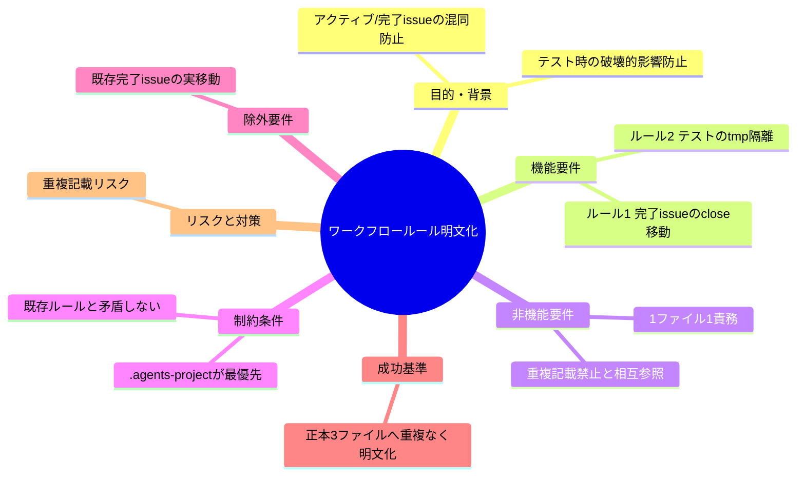

# 要求定義書: ワークフロールール明文化（close 運用と tmp テスト隔離）

**プロジェクト名**: ワークフロールール明文化（close 運用と tmp テスト隔離）
**作成日**: 2026 年 06 月 14 日
**最終更新**: 2026 年 06 月 14 日

> **重要**:
>
> - 要求定義書は、プロジェクトの全体像を把握するためのものです。詳細は要件定義以降で記載します。
> - **このドキュメントは常に更新**: 要求の変更や追加があった場合は即座に更新してください。
>
> **用語**: [.agents/CONCEPTS.md §用語規約](../../../../../.agents/CONCEPTS.md#用語規約) を参照。

---

## 要求定義の全体像

**注意**: マインドマップは全体像把握用。主要セクション名程度に留める。

---

## 1. 目的・背景

### 1.1 目的（必須）

2 つのワークフロールール（close 運用と tmp テスト隔離）を正本へ重複なく明文化する。

### 1.2 背景

- **現状の課題**:
  - 完了 issue とアクティブ issue が同階層に混在し、進行中の対象が把握しづらい。
  - テスト/検証をいきなり本リポへ実行すると破壊的影響・生成物との混同が起きる。

- **必要性**:
  - 完了の分離（close 移動）をルール化し、トリガー条件を厳密に定義する必要がある。
  - 検証は隔離環境（mktemp -d）で行うことを明文化し守らせる必要がある。

### 1.3 期待される効果（必須: 1 件以上）

- **効果 1**: トップレベル完了 issue を `close/` に移動する運用が正本に定義され、判定可能になる。
- **効果 2**: テスト/検証は tmp 隔離が原則であることが正本に定義され、本リポの破壊が防止される。

---

## 2. 機能要件

### 2.1 既存機能の維持（該当する場合）

- verify-and-close の完了定義（04_review 作成＋書記記録）、memo/書記運用、1 ファイル 1 責務は維持する。

### 2.2 新規機能要件

- **ルール1**: 完了したトップレベル issue を `close/` ディレクトリに移動する（サブ issue 単独完了では移動しない）。宣言は CORE、手順詳細は PHASES、自己拡張固有の配置先は .agents-project に記載。
- **ルール2**: テスト/検証は `mktemp -d` で隔離環境を作って行い、いきなり自己インストール・本番ファイルへ実行しない。.agents-project に明記し、汎用方針を RULES に簡潔に反映。

---

## 3. 非機能要件

### 3.1 パフォーマンス

- 特になし（ドキュメント変更のみ）。

### 3.2 セキュリティ

- 検証時に本リポの `.agents/.claude/.cursor/.workflow/workflow.db` を破壊しないこと。

### 3.3 互換性

- 既存の PHASES 完了定義・verify-and-close 必須・memo/書記運用と矛盾しないこと。

### 3.4 保守性

- 1 ファイル 1 責務・重複記載禁止。重複は相互参照で解決する。

---

## 4. 制約条件

### 4.1 技術的制約

- Markdown のみの変更。コード変更は伴わない（`bash -n` 等は対象外）。

### 4.2 既存システムとの互換性

- CORE / LOAD_POLICY / PHASES / RULES / IO_CONTRACT、implement-feature.md を守る。

### 4.3 移行期間・スケジュール

- 即時。本 implement-feature 内で完結（書記は verify-and-close で別途）。

---

## 5. 除外要件

- 現時点で完了済みのトップレベル issue は無いため、close への実移動は行わない（ルール明文化のみ）。

---

## 6. 成功基準（必須: 1 件以上）

- ルール1（close 運用・トリガー条件・配置先・完了判定接続）が CORE.md / PHASES.md / .agents-project/自己拡張ワークフロー.md に重複なく明文化されている（○/×）。
- ルール2（tmp 隔離テスト）が .agents-project/自己拡張ワークフロー.md（＋ RULES.md の簡潔反映）に明文化されている（○/×）。
- 相互参照先がすべて実在する（リンク整合）（○/×）。

---

## 7. リスクと対策

### 7.1 技術的リスク

- **リスク**: 同じ内容を複数ファイルに重複記載する。
  - **対策**: 宣言（CORE）・手順詳細（PHASES）・自己拡張固有（.agents-project）に責務分割し相互参照で接続する。

### 7.2 スケジュールリスク

- **リスク**: 既存完了定義と矛盾する記述を入れる。
  - **対策**: PHASES の完了定義（verify-and-close 完了）に接続する形でのみ追記する。

---

## 8. 参考資料

### プロジェクトドキュメント

- [.agents/boot/CORE.md](../../../../../.agents/boot/CORE.md)
- [.agents/workflow/PHASES.md](../../../../../.agents/workflow/PHASES.md)
- [.agents-project/自己拡張ワークフロー.md](../../../../../.agents-project/自己拡張ワークフロー.md)

### その他の参考資料

- ユーザー指示（2 ルールの原文）

---

## 9. 次のステップ

この要求定義書の承認後、実装（ルール本文の各正本ファイルへの追記）を行い、verify-and-close で監査・書記を行う。
