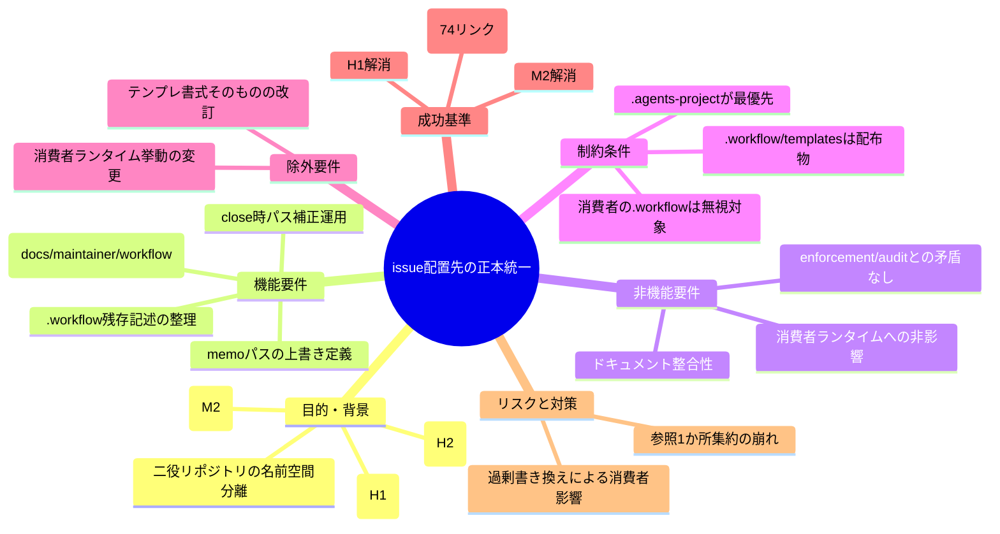
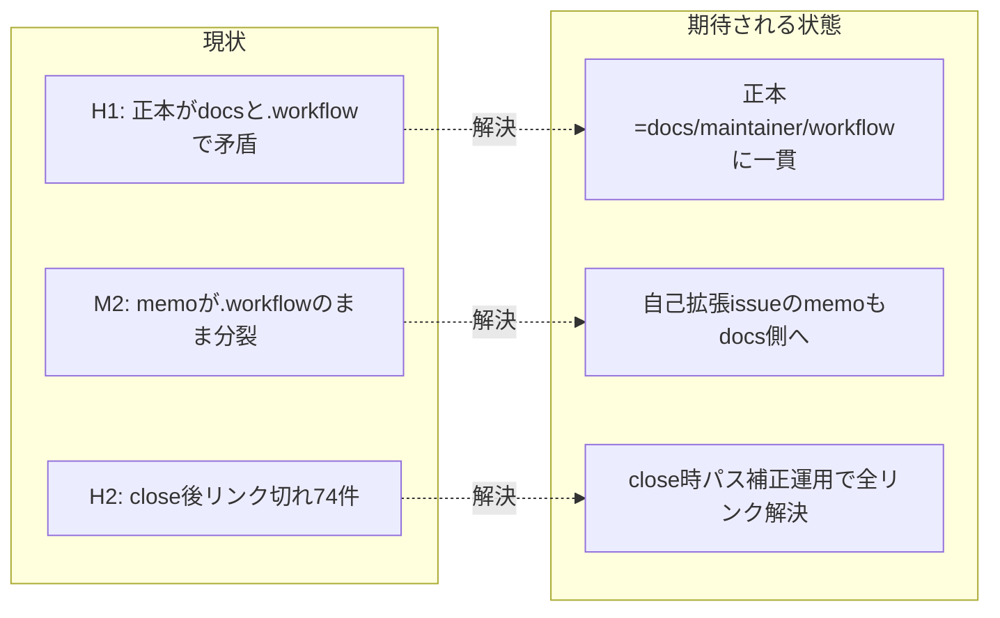

# 要求定義書: issue 配置先の正本統一（.workflow→docs/maintainer/workflow 移行の不整合是正）

**プロジェクト名**: issue 配置先の正本統一（.workflow→docs/maintainer/workflow 移行の不整合是正）  
**作成日**: 2026 年 06 月 14 日  
**最終更新**: 2026 年 06 月 14 日

> **重要**:
>
> - 要求定義書は、プロジェクトの全体像を把握するためのものです。詳細な技術仕様や実装方法は要件定義書以降で記載します。必要最低限の情報に収めることを心掛けてください。
> - **このドキュメントは常に更新**: 要求の変更や追加があった場合は、即座にこのドキュメントを更新してください。ドキュメントは「生きているドキュメント」として扱い、実装内容と常に同期させます。
> - **必須項目**: 以下の「必須」と明記した項目は空欄・抽象語のみで提出しないこと。判定可能な形で記入すること。
>
> **用語**: [.agents/CONCEPTS.md §用語規約](../../../../../.agents/CONCEPTS.md#用語規約) を参照。

---

## 要求定義の全体像

**注意**:

- マインドマップは全体像を把握するためのものです。主要なセクション名程度に留め、詳細は記載しないでください。

---

## 1. 目的・背景

### 1.1 目的（必須）

本リポの issue 配置先の正本を docs/maintainer/workflow に統一し記述矛盾を解消する。

### 1.2 背景

本リポジトリは「パッケージの正本（配布物）」と「自己拡張する消費者（ドッグフーディング）」の二役を兼ねる（`.agents-project/自己拡張ワークフロー.md`:3）。両者で git の扱いが逆になるため、`.workflow/`（消費者ランタイム生成物・`.gitignore` 対象）と `docs/maintainer/workflow/`（自己拡張 issue・git 追跡）の名前空間分離が `.agents-project/自己拡張ワークフロー.md`:39-48 で定義済みである。しかし配布物側のドキュメント記述がこの分離に追従しきれておらず、以下の不整合が残っている。

- **現状の課題**:
  - **H1（記述の自己矛盾）**: `CLAUDE.md`:18 は「本リポの単一 issue / サブ issue の正は `docs/maintainer/workflow/...`（`.workflow/` ではない）」と明記する一方、直後の `CLAUDE.md`:19 は「単一 issue は `.workflow/<timestamp>_<title>/` に作成する」と相反する記述を残している。さらに `.agents/workflow/PHASES.md`:34 をはじめ `run_command.md`・`requirement-discovery.md` 等、配布物側の多数（実測で `.agents/` 配下 22 ファイル＋`CLAUDE.md`）が `.workflow/{issue}/` / `.workflow/<timestamp>` を作成先前提のまま残している。
  - **M2（上書き定義の欠落）**: memo の配置が `.agents/skills/agent/run_command.md`:57 と `.agents/workflow/TEMPLATES.md`:12-13 で `.workflow/{issue}/memo/` のまま定義されている。`.agents-project/自己拡張ワークフロー.md` は issue 本体（`docs/maintainer/workflow/`）と close 先の上書きは定義するが、memo パスの上書きが無い。このため自己拡張 issue 本体は git 追跡される `docs/maintainer/workflow/` に置かれる一方、その memo は `.gitignore` 対象の `.workflow/` に分裂して記録が失われる恐れがある。
  - **H2（close 移動時のリンク切れ）**: `docs/maintainer/workflow/close/<issue>/` 配下の 00〜04 から `.agents/` 等のリポジトリルート配下へ向かう相対リンクが、深さ不足で解決不能になっている。実測では `../../../../`（4 階層上）の記述が **74 件**あるが、`close/<issue>/` はリポジトリルートから 5 階層下（docs / maintainer / workflow / close / <issue>）にあるため、正しくは `../../../../../`（**5 階層上**）が必要で、現状は **1 階層分不足**している。close 移動時にこのパス補正を行う運用が存在しない。

- **必要性**:
  - 記述矛盾を残すと、サブエージェント／保守者が issue や memo を `.workflow/` 側に作成し、`.gitignore` により自己拡張の開発記録が消失する（配布物汚染・記録喪失）。
  - close 後のドキュメントから必読ルール（CONCEPTS / RULES 等）へ辿れず、レビュー・監査時の参照経路が壊れる。

### 1.3 期待される効果（必須: 1 件以上）

- **効果 1**: 配布物ドキュメント上で「単一 issue / サブ issue / memo の作成先が docs/maintainer/workflow 側で一貫している」ことが grep で確認できる（`.workflow/{issue}` 系の作成先記述が、消費者ランタイムを指す文脈以外に残っていない、と○/×判定可能）。
- **効果 2**: close 済み issue 配下のドキュメントから `.agents/` 等への相対リンクが全件解決できる（リンクチェックで未解決 0 件、と○/×判定可能）。
- **効果 3**: memo の配置先が自己拡張 issue では git 追跡対象（`docs/maintainer/workflow/`）に統一され、issue 本体と memo が同一名前空間に置かれる。

**現状と期待される状態の比較**:

---

## 2. 機能要件

### 2.1 既存機能の維持（該当する場合）

- 消費者ランタイムにおける `.workflow/<issue>/`・`.workflow/workflow.db*` 生成挙動（配布パッケージとしての標準フロー）は変更しない。これらを指すドキュメント記述は「消費者ランタイム生成物」を指す文脈として維持する。
- `.workflow/templates/`（配布物のテンプレート正本）の位置と役割は維持する。

### 2.2 新規機能要件

- 配布物ドキュメント（`CLAUDE.md`・`.agents/` 配下）における **issue / サブ issue / memo の作成先記述を、「消費者ランタイム＝`.workflow/`」「本リポ自己拡張＝`docs/maintainer/workflow/`」の名前空間分離が一貫して読み取れる形**に整理する。少なくとも `CLAUDE.md`:18-19 の自己矛盾を解消する。
- `.agents-project/自己拡張ワークフロー.md` に **memo パスの上書き定義**を追加し、自己拡張 issue の memo を `docs/maintainer/workflow/` 側に置くことを正本化する。
- **close 移動時のパス補正運用**を、上書き定義側（`.agents-project/`）に明文化する。既存の close 配下 74 件の不足リンクの是正方針を要件として定める（実装範囲は 03 で確定）。

---

## 3. 非機能要件

### 3.1 パフォーマンス

- 本変更はドキュメント・ルール記述の是正であり、ランタイム性能要件はない。

### 3.2 セキュリティ

- 特段のセキュリティ要件はない。外部サービスへの書き込み・大量削除等の高リスク操作を伴わない。

### 3.3 互換性

- 配布パッケージとして利用する消費者プロジェクト（`.workflow/` をランタイムに使う）の挙動・記述意味を壊さないこと。記述の整理は「自己拡張＝docs」「消費者＝.workflow」の役割分担を明示する方向に限る。

### 3.4 保守性

- 記述の正本は 1 か所に集約する（重複再定義を増やさない）。上書きは `.agents-project/` に集約し、配布物側はその参照で整合させる。

---

## 4. 制約条件

### 4.1 技術的制約

- 正本・最優先は `.agents-project/`（`.agents/`・`CLAUDE.md` の標準フローより優先。`.agents-project/自己拡張ワークフロー.md`:5）。同名・同目的は `.agents-project` を採用する。

### 4.2 既存システムとの互換性

- ルート `.gitignore` の名前空間分離（`.workflow/<issue>` を無視・`docs/maintainer/workflow/` を追跡）を前提とする。これに反する配置を要求しない。
- 委譲 I/F（`run_command.md`）・enforcement / audit（`.agents/enforcement/ci/audit.sh` 等）が参照するパス前提と矛盾を生じさせない。memo / issue フォルダのプレフィックス取得規約（`TZ=Asia/Tokyo date +%Y%m%d_%H%M%S`）は維持する。

### 4.3 移行期間・スケジュール

- 単発の是正タスク。段階移行は不要。既存 close 配下の不足リンクは本 issue 内で是正方針を確定する。

---

## 5. 除外要件

- 消費者ランタイム（配布先プロジェクト）における `.workflow/` 生成挙動そのものの変更。
- テンプレート（00〜04）の書式・セクション構成そのものの改訂。
- workflow.db のスキーマ変更や台帳運用の変更。

---

## 6. 成功基準（必須: 1 件以上）

- **H1 解消**: `CLAUDE.md`:18-19 の自己矛盾が解消され、配布物ドキュメントから「本リポの単一 issue / サブ issue の作成先＝`docs/maintainer/workflow/`」が一意に読み取れる（矛盾記述 0 件、○/×判定可能）。
- **M2 解消**: `.agents-project/自己拡張ワークフロー.md` に memo パスの上書き定義が追加され、自己拡張 issue の memo が `docs/maintainer/workflow/` 側に統一される（上書き定義の有無で○/×判定可能）。
- **H2 解消**: `docs/maintainer/workflow/close/<issue>/` 配下から `.agents/` 等への相対リンクが全件解決する（不足リンク 74 件→未解決 0 件。リンクチェックで○/×判定可能）。かつ、close 移動時のパス補正運用が `.agents-project/` に明文化されている。
- **回帰なし**: 消費者ランタイムを指す `.workflow/` 記述は意味を保ったまま残る（enforcement / audit が FAIL しない）。

---

## 7. リスクと対策

### 7.1 技術的リスク

- **リスク**: 配布物側の `.workflow/{issue}` 記述を機械的に一括置換すると、消費者ランタイムを指す正当な記述まで壊し、配布パッケージの意味を損なう。
  - **対策**: 置換は「本リポの作成先を指す文脈」に限定する。各 file:line を 02/03 で精査し、消費者ランタイム文脈は維持・自己拡張文脈は `.agents-project/` への参照で上書きする方針を取る。
- **リスク**: H2 のリンク補正で誤った階層数を当てると再びリンク切れになる（タスク当初の「2 階層不足」は実測では 1 階層不足）。
  - **対策**: 実測に基づき `close/<issue>/` は 5 階層上（`../../../../../`）が正と確定済み。是正後にリンクチェックで全件解決を検証する。

### 7.2 スケジュールリスク

- **リスク**: 影響ファイルが多数（`.agents/` 配下 22＋`CLAUDE.md`、close 74 リンク）で、是正漏れが残る。
  - **対策**: 02/03 で対象を列挙し、grep ベースの検証（作成先記述・リンク解決）を完了条件に組み込む。

---

## 8. 参考資料

### プロジェクトドキュメント

- [.agents-project/自己拡張ワークフロー.md](../../../../../.agents-project/自己拡張ワークフロー.md) - 名前空間分離・上書き定義の正本（最優先）
- [CLAUDE.md](../../../../../CLAUDE.md):18-19 - H1 の自己矛盾箇所
- [.agents/workflow/PHASES.md](../../../../../.agents/workflow/PHASES.md):34 - 残存 `.workflow/<timestamp>` 記述
- [.agents/skills/agent/run_command.md](../../../../../.agents/skills/agent/run_command.md):57 / [.agents/workflow/TEMPLATES.md](../../../../../.agents/workflow/TEMPLATES.md):12-13 - M2 の memo パス

### その他の参考資料

- 設計判断の優先順位（[.agents/spec/06_設計判断の優先順位.md](../../../../../.agents/spec/06_設計判断の優先順位.md)）: 仕様との整合性・docs と実装の不整合を放置しない。
- spec 概要（[.agents/spec/00_spec概要.md](../../../../../.agents/spec/00_spec概要.md)）

---

## 9. 次のステップ

この要求定義書の承認後、以下のドキュメントを作成します：

- **次**: [`01_要件定義.md`](./01_要件定義.md) - 要件定義フェーズ
