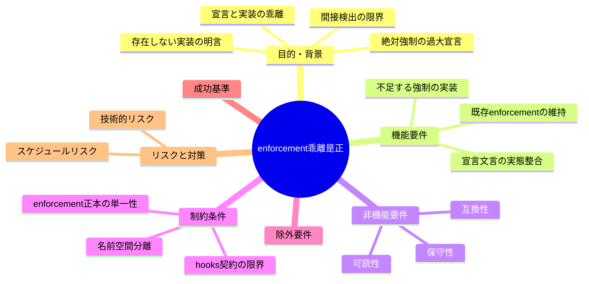
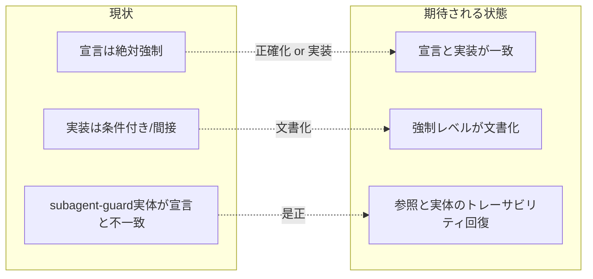

# 要求定義書: enforcement の宣言と実装の乖離是正

**プロジェクト名**: enforcement の宣言と実装の乖離是正
**作成日**: 2026 年 06 月 14 日
**最終更新**: 2026 年 06 月 14 日

> **重要**:
>
> - 要求定義書は、プロジェクトの全体像を把握するためのものです。詳細な技術仕様や実装方法は要件定義書以降で記載します。必要最低限の情報に収めることを心掛けてください。
> - **このドキュメントは常に更新**: 要求の変更や追加があった場合は、即座にこのドキュメントを更新してください。ドキュメントは「生きているドキュメント」として扱い、実装内容と常に同期させます。
> - **必須項目**: 以下の「必須」と明記した項目は空欄・抽象語のみで提出しないこと。判定可能な形で記入すること。
>
> **用語**: [.agents/CONCEPTS.md §用語規約](../../../../../.agents/CONCEPTS.md#用語規約) を参照。

---

## 要求定義の全体像

**注意**:

- マインドマップは全体像を把握するためのものです。主要なセクション名程度に留め、詳細は記載しません。

---

## 1. 目的・背景

### 1.1 目的（必須）

enforcement の宣言（絶対強制）と実装（条件付き・間接検出）の乖離を解消する。

### 1.2 背景

enforcement は「逸脱できないようにする」ことを目的とし、README で複数の項目を「絶対強制」「例外なく拒否」「subagent-guard で検出」と宣言している。しかし実ファイルを確認すると、宣言の強さに実装が追いついていない箇所がある。宣言と実装の乖離は「強制されているはず」という誤った安心を生み、運用者・AI 双方が実際には素通りできる経路を見落とす原因になる。

- **現状の課題**:
  - **#5（書記実行）の乖離**: README §絶対強制は write-workflow-log の実行を強制すると読めるが、`audit.sh` の検出（[.agents/enforcement/ci/audit.sh:232-245](../../../../../.agents/enforcement/ci/audit.sh) check 3、[同:341-356](../../../../../.agents/enforcement/ci/audit.sh) check 9）は「04_review.md の存在」と「workflow_log の該当行の存在」による**間接検出**にとどまり、skill chain の実行順序（書記が chain の最終 step として実行されたか）は監査対象外。
  - **#25（メイン直接作業）の乖離**: `audit.sh` の `check_25_main_did_real_work`（[.agents/enforcement/ci/audit.sh:519-534 付近](../../../../../.agents/enforcement/ci/audit.sh)）は「成果物変更があるのに workflow_log の該当 command 行が 0 件」という判定で、**変更者（orchestrator か sub か）を区別できない**。1 件でもログがあれば PASS するため、別ロール偽装・コミット分割で検出漏れする。README:187 は #25 を「絶対強制・必ず FAIL」と宣言。
  - **PreToolUse exit の乖離**: README:13・135-136 は orchestrator の Write/Edit/Shell 等を「例外なく拒否」「必ず exit 1（実機 exit 2）」と宣言するが、`PreToolUse.sh`（[.agents/enforcement/claude/PreToolUse.sh:76-96・117-144](../../../../../.agents/enforcement/claude/PreToolUse.sh)）は **stdin JSON または env で `AGENT_ROLE=orchestrator` が渡る環境限定**で reject する。渡されない場合は `ROLE=unknown` となり案内のみ exit 0。README 自身も §Layer2・「Runtime reject が効く条件」では「渡されない場合は案内のみ exit 0」と限界を記しており、**README 内部で「例外なく拒否」と「条件付き」の表現が併存**している。
  - **#22–#24（自立進行・高リスク確認）の乖離**: README:77・142-143・159 は #22–#24 を「subagent-guard または runtime で検出する」と明言するが、実装である [.workflow/templates/github/scripts/subagent-guard.sh](../../../../../.workflow/templates/github/scripts/subagent-guard.sh) はログ frontmatter 禁止・logs/ 廃止・内部参照禁止の 3 点のみを検査し、**#22–#24 を一切実装していない**。さらに README/SETUP/DESIGN は実装ファイルへのパス参照を持たず（`.agents/` 配下から `templates/github` への参照は 0 件）、subagent-guard 実体は git 追跡されるが `.workflow/templates/` 配下（消費者ランタイム生成物の名前空間）に置かれており、enforcement 正本（`.agents/enforcement/`）とのトレーサビリティが切れている。

- **必要性**:
  - 「強制されている」という宣言を信じて運用すると、実際には素通りできる経路を見落とし、enforcement の信頼性そのものが損なわれる。
  - 宣言と実装の不一致は spec §設計原則「docs と実装の不整合を放置してはならない」に直接違反する。

### 1.3 期待される効果（必須: 1 件以上）

- **効果 1**: enforcement の各宣言文言について、対応する実装の所在（ファイル:行）と強制レベル（runtime reject / CI FAIL / 案内のみ / 未実装）が一意に判定できる状態になる。
- **効果 2**: 「絶対強制」と宣言する項目が、実装でも該当環境で必ず拒否または FAIL する（または、達成不能な強制レベルは宣言を実態に合わせて正確化する）状態になる。
- **効果 3**: subagent-guard の参照（README/SETUP/DESIGN）と実体ファイルのトレーサビリティが回復し、#22–#24 の検出有無が文書と実装で一致する。

**現状と期待される状態の比較**:

---

## 2. 機能要件

### 2.1 既存機能の維持（該当する場合）

- 既存の audit.sh の各チェック（#1–#29）・PreToolUse.sh の reject 経路・write-workflow-log.sh のラッパー強制・名前空間分離（`.agents/` 正本 / `.workflow/` ランタイム）は維持する。後方互換（DB 不採用環境・非 git ツリーでの SKIP 挙動）を壊さない。

### 2.2 新規機能要件

本 issue は乖離ごとに方針 (A)/(B) を選択する。最終確定は設計フェーズだが、00/01 では両方針を比較し推奨を示す。

- **(A) 文言を実態に合わせて正確化する**: README の「絶対強制」「例外なく拒否」「subagent-guard で検出」等の表現を、実際の強制レベル（条件付き runtime reject＋CI 補完、間接検出、未実装等）に合わせて書き換える。各宣言に「どの層で・どの条件下で効くか」を明示する。
  - 利点: 低コスト・低リスク。spec「可読性」「docs と実装の整合」を満たす。
  - 欠点: 実際の強制力は上がらない。
- **(B) 不足する強制を実装する**: subagent-guard を `.agents/enforcement/` 正本に位置づけ #22–#24 を実装する、#25 を変更者識別可能な判定に強化する、PreToolUse のロール伝達を確実化する等。
  - 利点: 宣言どおりの強制力が得られる。
  - 欠点: 高コスト。hooks 契約の物理限界（README:36「PreToolUse は完全物理強制ではない」）により完全強制は不可能な項目がある。

**推奨（00/01 段階）**: **(A) を全乖離に適用しベースラインとする＋(B) を実現可能な範囲で組み合わせる**。理由は、(1) hooks の物理限界により一部は実装しても完全強制にできず、宣言を正確化する以外に整合させる手段がない（PreToolUse exit・#5 順序・#25 変更者識別の一部）、(2) docs と実装の不整合放置は spec 違反であり、まず文言を実態に合わせることで乖離を即座に解消できる、(3) subagent-guard のトレーサビリティ回復と #22–#24 実装は (B) で着手できる範囲がある、ため。各乖離への (A)/(B) 割り当ては設計フェーズで確定する。

---

## 3. 非機能要件

### 3.1 パフォーマンス

- audit.sh / subagent-guard の追加チェックは PR/push 時の実行を著しく遅延させない（既存チェックと同等オーダー）。

### 3.2 セキュリティ

- 強制の追加・正確化により、orchestrator が成果物を直接編集・偽装する経路を新たに広げない。

### 3.3 互換性

- DB 不採用環境・非 git ツリー・`docs/maintainer/workflow` 不在の汎用消費者で、既存の SKIP/後方互換挙動を壊さない。
- 名前空間分離（パッケージ正本 vs 消費者ランタイム生成物）の役割分担を壊さない。

### 3.4 保守性

- 宣言（README）と実装（audit.sh / PreToolUse.sh / subagent-guard.sh）の対応が一意にたどれる（各失敗条件 # に対し「実装の所在」が明記される）。

---

## 4. 制約条件

### 4.1 技術的制約

- enforcement の正本は `.agents/enforcement/` に一本化する（README 冒頭）。実装の所在もここから一意にたどれること。
- PreToolUse はツール名・対象パス・コマンド・ロールの範囲でのみ reject 可能（README:36-38）。`bash -c "..."` 内部等は完全検出不能という物理限界を前提とする。

### 4.2 既存システムとの互換性

- `.agents-project/自己拡張ワークフロー.md` の名前空間分離（`.agents/` 追跡・配布物 / `.workflow/` 無視・ランタイム）を維持する。subagent-guard の配置・参照を見直す場合もこの役割分担と整合させる。

### 4.3 移行期間・スケジュール

- 単一 issue として 00→01→（設計）→（実装計画）→（実装）→（レビュー）の標準フローで進める。本 issue では 00/01 まで作成する。

---

## 5. 除外要件

- /clear 境界・別セッション引継ぎの質・fresh サブ収束保証（README:81 で CI 非強制・人手監査と明記）は本 issue の機械強制対象外。
- enforcement が扱う各 capability の品質（設計品質・テスト十分性・レビュー品質。README §矯正しないもの）は対象外。
- workflow.db のスキーマ大改修は対象外（既存スキーマ・既存 SKIP 挙動の範囲で整合させる）。

---

## 6. 成功基準（必須: 1 件以上）

- **SC-1**: README の「絶対強制」「例外なく拒否」「subagent-guard で検出」と記す各宣言に対し、対応する実装の所在（ファイル:行）と強制レベル（runtime reject／CI FAIL／案内のみ／未実装のいずれか）が文書上で一意に対応づけられている（○/×: 全宣言に対応表または注記が存在するか）。
- **SC-2**: #5・#25・PreToolUse exit・#22–#24 の 4 件について、(A) 正確化／(B) 実装のいずれを採ったかが記録され、採用結果として「宣言と実装が一致している（乖離が解消または文書化されている）」ことが確認できる（○/×: 4 件すべてに方針と解消状態の記載があるか）。
- **SC-3**: subagent-guard の README/SETUP/DESIGN 参照から実体ファイルへのパスがたどれる、または #22–#24 の検出有無が文書と実装で一致する（○/×: 参照と実体のトレーサビリティが回復しているか）。
- **SC-4**: 既存の audit.sh / PreToolUse.sh のテスト（[.agents/scripts/test/](../../../../../.agents/scripts/test/) 等）がすべて通過し、DB 不採用・非 git ツリー等の後方互換挙動が維持されている（○/×: テストが全通過するか）。

---

## 7. リスクと対策

### 7.1 技術的リスク

- **リスク**: (B) で強制を追加した結果、ロールが渡らない環境やコミット分割の正常運用まで誤って FAIL/reject する（過剰ブロック）。
  - **対策**: 違反確証がない場合は reject しない保守的方針（PreToolUse の BR-4／案内のみ exit 0）を踏襲し、確証可能な範囲に限定する。完全強制が不能な項目は (A) で正確化する。
- **リスク**: subagent-guard の配置変更が名前空間分離（配布物 vs ランタイム）の役割を崩す。
  - **対策**: 設計フェーズで `.agents-project/自己拡張ワークフロー.md` の役割分担表と照合し、正本配置と展開先を整理してから移設する。

### 7.2 スケジュールリスク

- **リスク**: (B) の実装範囲を広げすぎて 1 issue で完結しない。
  - **対策**: (A) を全乖離のベースラインとし、(B) は実現可能な範囲に絞る。残りは追跡サブ issue 化する。

---

## 8. 参考資料

### プロジェクトドキュメント

- [.agents/enforcement/README.md](../../../../../.agents/enforcement/README.md) - 強制の正本・失敗条件と差し戻し
- [.agents/enforcement/ci/audit.sh](../../../../../.agents/enforcement/ci/audit.sh) - CI 監査の実装
- [.agents/enforcement/claude/PreToolUse.sh](../../../../../.agents/enforcement/claude/PreToolUse.sh) - runtime reject の実装
- [.workflow/templates/github/scripts/subagent-guard.sh](../../../../../.workflow/templates/github/scripts/subagent-guard.sh) - subagent-guard の実体
- [.agents/spec/01_設計原則.md](../../../../../.agents/spec/01_設計原則.md), [.agents/spec/06_設計判断の優先順位.md](../../../../../.agents/spec/06_設計判断の優先順位.md)

### その他の参考資料

- [.agents-project/自己拡張ワークフロー.md](../../../../../.agents-project/自己拡張ワークフロー.md) - 名前空間分離・作成場所の上書き

---

## 9. 次のステップ

この要求定義書の承認後、以下のドキュメントを作成します：

- **次**: [`01_要件定義.md`](./01_要件定義.md) - 要件定義フェーズ
