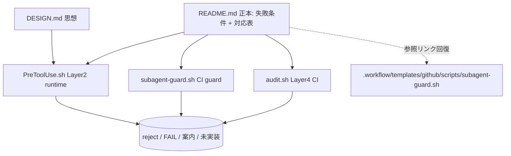
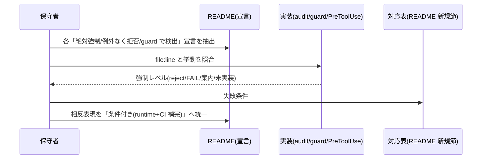

# 設計書: enforcement の宣言と実装の乖離是正

**プロジェクト名**: enforcement の宣言と実装の乖離是正
**作成日**: 2026 年 06 月 14 日
**最終更新**: 2026 年 06 月 14 日

> **重要**: **このドキュメントは常に更新**: 設計の変更や追加があった場合は、即座にこのドキュメントを更新してください。ドキュメントは「生きているドキュメント」として扱い、実装内容と常に同期させます。
>
> **用語**: [.agents/CONCEPTS.md §用語規約](../../../../../.agents/CONCEPTS.md#用語規約) を参照。

---

## 1. 設計概要

**必須**: 設計方針・原則は [.agents/spec/01\_設計原則.md](../../../../../.agents/spec/01_設計原則.md) を先に参照した上で、本プロジェクトに適用するものを選び記載する。

### 1.1 設計方針

宣言（README/DESIGN）と実装（audit.sh / PreToolUse.sh / subagent-guard.sh）の乖離を、(A) 文言の実態整合化をベースラインとし、(B) 実現可能な範囲で強制を追加する、の二本立てで解消する。hooks の物理限界で完全強制できない項目は (A) で「条件付き／CI 補完／未実装」と正確化し、確証可能な範囲のみ (B) で実装する。既存挙動・後方互換（DB 不採用・非 git ツリー・`docs/maintainer/workflow` 不在）を一切壊さない。

### 1.2 設計原則（本プロジェクトで適用するもの）

- **単一責務**: 各失敗条件 # に対し「正本の宣言（README）」「実装の所在（どのスクリプトのどの関数）」「強制レベル」を 1 対 1 で対応づける。1 つの宣言を複数の実装が曖昧に分担する状態を避ける。
- **明確な境界**: runtime（PreToolUse, Layer2）/ CI（audit.sh, Layer4）/ guard（subagent-guard.sh）の 3 実装の責務境界を明示する。enforcement 正本は `.agents/enforcement/` に一本化し、subagent-guard 実体（`.workflow/templates/github/scripts/`）への参照リンクで境界を越えたトレーサビリティを確保する。
- **AIフレンドリー設計**（[01\_設計原則 §AIフレンドリー設計](../../../../../.agents/spec/01_設計原則.md#aiフレンドリー設計)）: 「絶対強制」等の抽象語を、判定可能な「どの層で・どの条件下で reject/FAIL するか」へ具体化し、運用者・AI が誤解しない記述にする。spec §設計原則「docs と実装の不整合を放置しない」を最優先で満たす。

---

## 2. アーキテクチャ設計

### 2.1 責務・境界・参照関係

#### 2.1.1 責務一覧

| コンポーネント | 責務（1 文） |
| -------------------- | -------------------- |
| `enforcement/README.md` | 強制の正本。失敗条件 #1–#29 を定義し、各条件に「実装の所在」「強制レベル」を一意に対応づける（本 issue で対応表を追加）。 |
| `enforcement/DESIGN.md` | 4 層強制の思想と「何を検知するか」の仕様を定義する。exit コード等の実態をスクリプトと一致させる。 |
| `enforcement/claude/PreToolUse.sh` | Layer2 runtime reject。ROLE が渡る環境で orchestrator の Write/Edit/Shell 等を **exit 2** で拒否し、渡らない環境では案内のみ exit 0。 |
| `enforcement/ci/audit.sh` | Layer4 CI 監査。#1–#21・#25–#29 を事後検知し FAIL（exit 1）させる。#22–#24 は実装しない。 |
| `.workflow/templates/github/scripts/subagent-guard.sh` | CI guard。ログ frontmatter 禁止・logs/ 廃止・内部参照禁止の 3 点を検知する。#22–#24 は実装しない（本 issue で文書を実態化）。 |
| `enforcement/SUBAGENT_GUARD.md`（新規・任意） または README/SETUP/DESIGN への参照リンク追記 | subagent-guard 実体（`.workflow/templates/github/scripts/subagent-guard.sh`）への正本からのトレーサビリティを回復する。 |

#### 2.1.2 境界

- **入力**: 既存の README/DESIGN/SETUP（宣言）と 3 スクリプト（実装）の現状。Git 差分範囲（audit/guard）。stdin JSON・env・ROLE（PreToolUse）。
- **出力**: (A) 実態整合化された README/DESIGN/SETUP（対応表・正確化された文言）、(B) 追加・強化された実装（subagent-guard 参照回復、必要なら #25 補助検知、audit 自己テスト）。
- **他責務との境界**: workflow.db スキーマの大改修は範囲外。/clear 境界・別セッション引継ぎ・fresh サブ収束は CI 非強制（人手監査）であり対象外。設計品質・テスト十分性等の capability 品質は対象外。

#### 2.1.3 参照関係

- README（正本・判定ルール）→ audit.sh / subagent-guard.sh（同一ルールを参照して実装）。
- README/SETUP/DESIGN →（本 issue で追加）→ `.workflow/templates/github/scripts/subagent-guard.sh`（実体へのパス参照）。
- audit.sh / subagent-guard.sh → README §失敗条件と差し戻し（コメントで参照済み・維持）。
- 循環参照は持たない。`.agents/`（正本・git 追跡）と `.workflow/templates/`（配布テンプレ・git 追跡）の名前空間境界は維持し、参照リンクのみで越境する（実体の移設はしない＝7.1 リスク回避）。

### 2.2 システムアーキテクチャ

**採用パターン**: ドキュメント駆動の「宣言＝実装＝検証」整合パターン（spec §設計原則「docs と実装の不整合を放置しない」「単一責務」に基づく）。新規アーキテクチャは導入せず、既存 4 層（Layer1–4）の責務境界を明確化し、宣言と実装の対応を一意化する。

- **根拠**: spec 06 設計判断の優先順位に従い「既存構造の維持・後方互換」を最優先とする。新機構ではなく既存スクリプトの正確化＋限定的補強で乖離を閉じる。

#### 2.2.1 CQRS（Command/Query 分離）

該当なし（状態変更を伴う新 API は導入しない）。

#### 2.2.2 アーキテクチャ図（本プロジェクトの構成）

### 2.3 コンポーネント構成

3 実装（runtime / CI audit / CI guard）の境界はそのまま維持する。本 issue が触るのは主に「正本ドキュメント（README/DESIGN/SETUP）」と、(B) 範囲で「subagent-guard 参照回復」「audit.sh の #25 補助検知（実装可能なら）」「audit.sh 自己テストの新設」である。各ファイルは単一責務（README=宣言、audit=CI 検知、guard=PR/Push 検知、PreToolUse=runtime 検知）を維持する。

### 2.4 データフロー

イベント駆動は該当なし。以下は「宣言→実装→強制レベル」の対応づけフローを示す。

---

## 3. 機能設計

各乖離への **(A)/(B) 確定割り当て**を以下に定義する。確定根拠は 00/01 の推奨方針（(A) ベースライン＋(B) 実現可能範囲）と hooks 物理限界に基づく。

### 3.1 機能 1: #5（書記実行）の乖離 — 確定: **(A) 正確化**

#### 3.1.1 概要

書記（write-workflow-log）の実行は、audit.sh の check 3（[audit.sh:232-247](../../../../../.agents/enforcement/ci/audit.sh)）と check 9（[audit.sh:341-358](../../../../../.agents/enforcement/ci/audit.sh)）で「04_review.md の存在」「workflow_log 該当行の存在」による**存在ベースの間接検出**にとどまり、skill chain の最終 step として実行された順序は監査しない。

#### 3.1.2 処理フロー

- README §失敗条件 #5・§「矯正するもの」の書記関連記述に、「強制レベル＝CI による存在ベースの間接検出（chain 順序は監査対象外）」と注記する。「強制する」と読める表現を「書記ログの存在で事後検知する」に正確化する。
- **(B) を採らない根拠**: skill chain の実行順序は workflow.db のログ存在からは復元できず（chain 内の step 順序を記録するスキーマがない＝スキーマ大改修は範囲外）、PreToolUse でも chain 順序は観測不能。実装で順序強制する手段が現スキーマ・現契約に存在しないため (A) で正確化する。

#### 3.1.3 入力・出力

- 入力: README の #5 関連記述、audit.sh check 3 / check 9。
- 出力: 「間接検出（存在ベース）」と明記された README 文言、対応表の #5 行。

#### 3.1.4 エラーハンドリング

文言修正のみ。スクリプト挙動は不変＝後方互換に影響なし。

### 3.2 機能 2: #25（メイン直接作業）の乖離 — 確定: **(A) 正確化 ＋ (B) 限定補助**

#### 3.2.1 概要

`check_25_main_did_real_work`（[audit.sh:521-535](../../../../../.agents/enforcement/ci/audit.sh)）は「成果物変更があるのに implement/design/verify/review/create-pr ログが 0 件」で FAIL する判定で、**変更者（orchestrator か sub か）を区別できず**、ログが 1 件でもあれば PASS する。README:14・187 は #25 を「絶対強制・必ず FAIL」と宣言。

#### 3.2.2 処理フロー

- **(A)**: README #25・§絶対強制の「必ず FAIL」を、「成果物変更に対応する委譲・証跡が皆無のときに FAIL する間接検出。変更者の同一性までは識別しない（runtime PreToolUse の orchestrator reject ＋ actor_role=scribe / delegated_by_role=orchestrator 監査［#12/#13］で補完）」と正確化する。
- **(B) 限定補助（実装可能な範囲のみ）**: 既存の #12（actor_role=scribe のみ）・#13（delegated_by_role=orchestrator のみ）が新スキーマ時にロール偽装を狭める役割を果たすことを README の #25 行から相互参照させ、「#25 は #12/#13 と併せて変更者ロールの逸脱を狭める」と整合させる。**新規スキーマ追加・コミット分割検出は範囲外**（スキーマ大改修・偽陰性容認の保守的方針）。
- **(B) を全面採用しない根拠**: git の変更者は author/committer メタデータであり、AI ロール（orchestrator/sub）とは対応しない。コミット分割・別ロール偽装の完全検出は現契約で不能。確証なき FAIL は過剰ブロック（7.1 リスク）になるため保守的に倒す。

#### 3.2.3 入力・出力

- 入力: README #25 行、audit.sh check_25 / #12 / #13。
- 出力: 「間接検出＋#12/#13 補完／変更者同一性は未識別」と正確化された README、対応表の #25 行。

#### 3.2.4 エラーハンドリング

audit.sh の判定ロジックは変更しない（誤 FAIL を増やさない）。README の相互参照追記のみ。後方互換維持。

### 3.3 機能 3: PreToolUse exit の乖離 — 確定: **(A) 正確化**（exit コード表記の是正を含む）

#### 3.3.1 概要

2 つの乖離がある。
1. **exit コード表記のズレ（新発見）**: README:13「exit 1」、README:25「exit 1」、README:135「必ず exit 1（実機 exit 2）」、DESIGN.md:15「exit 1」と記すが、実装 [PreToolUse.sh:8・28](../../../../../.agents/enforcement/claude/PreToolUse.sh) は **exit 2**（実機 Claude Code hooks の block 契約）で統一済み。文書が古い表記を残している。
2. **ロール条件の併存**: README:11-13「例外なく必ず exit ... 拒否する」と README:25「渡されない場合は案内のみ exit 0」が相反。実装は [PreToolUse.sh:83](../../../../../.agents/enforcement/claude/PreToolUse.sh)（`ROLE=...:-unknown`）・[同:127-143](../../../../../.agents/enforcement/claude/PreToolUse.sh) のとおり **ROLE=orchestrator が渡る環境限定**で reject。

#### 3.3.2 処理フロー

- **(A-1)**: README/DESIGN の「exit 1」表記を「exit 2（block）」に統一する（実機契約・実装と一致させる）。「実機 exit 2」という二重表記も「exit 2」へ単純化する。
- **(A-2)**: README:11-13 の「例外なく必ず拒否」を、「**ロール（AGENT_ROLE/stdin JSON）が渡る環境では必ず exit 2 で拒否する。渡らない環境では案内のみ exit 0 とし、CI（audit.sh #25 等）で事後補完する**」という条件付き表現へ統一する。README §Layer2・§Runtime reject 条件と矛盾しない一貫表現にする。
- **(B) を採らない根拠**: ロール伝達はプラットフォーム（Claude Code hooks 契約）依存であり、enforcement 側からロール伝達を「確実化」する手段はない。00/01 のとおり物理限界で完全強制不能＝(A) で正確化する以外に整合手段がない。

#### 3.3.3 入力・出力

- 入力: README:11-13/25/29/135、DESIGN.md:15、PreToolUse.sh:8/28/83/127-143。
- 出力: exit 2 へ統一・条件付き表現へ統一された README/DESIGN、対応表の PreToolUse 行（強制レベル＝runtime reject(条件付き)＋CI 補完）。

#### 3.3.4 エラーハンドリング

スクリプト挙動は不変。文言のみ修正＝後方互換に影響なし。

### 3.4 機能 4: #22–#24・subagent-guard トレーサビリティ — 確定: **(B) 参照回復 ＋ (A) 未実装の正確化**

#### 3.4.1 概要

2 つの問題がある。
1. **トレーサビリティ断絶（(B) で回復）**: `.agents/` 配下（README/SETUP/DESIGN）から実体 `.workflow/templates/github/scripts/subagent-guard.sh` への**パス参照が 0 件**（grep 確認済み。SETUP:212・DESIGN:45・README は名前のみ言及し、ファイルパスを持たない）。
2. **#22–#24 未実装（(A) で正確化）**: subagent-guard.sh は [subagent-guard.sh:21-54](../../../../../.workflow/templates/github/scripts/subagent-guard.sh) のとおり (1) ログ frontmatter 禁止 (2) logs/ 廃止 (3) 内部参照禁止 の 3 点のみ検査し、**#22–#24（自立進行ルール違反・高リスク確認省略）を一切実装していない**。README:142-143 は #22–#24 を「subagent-guard または runtime で検出」と明言。

#### 3.4.2 処理フロー

- **(B) 参照回復**: README §失敗条件冒頭・§配置するファイル一覧・SETUP §採用チェック・DESIGN §参照 に、実体パス `.workflow/templates/github/scripts/subagent-guard.sh` を明記する。subagent-guard.sh が検査する 3 失敗条件（#6 内部参照／ログ frontmatter／logs/ 廃止）と README 失敗条件の対応も明記し、「subagent-guard が検査するのは #6 相当＋ログ規約のみ」を一意化する。実体の移設はしない（名前空間境界維持）。
- **(A) #22–#24 の正確化**: README:142-143 の「#22–#24 は subagent-guard または runtime で検出する」を、実態に合わせ **「#22–#24 は現状 subagent-guard では実装していない。runtime（AI の自律判断・人手監査）に委ねる CI 非強制項目である」**へ正確化する。#22–#24 は「自立進行ルール違反（過度な許可確認／指示文案だけ返す）」「高リスク確認省略」であり、いずれも AI の意思決定・対話文脈に属し、ツール名・パス・コマンド・ロールの範囲（hooks 物理限界）でも git 差分（CI）でも機械検出が不能であることを根拠として明記する。
- **(B) #22–#24 を実装しない根拠**: 検出対象が「ユーザーへの許可確認の有無」「指示文案だけ返したか」「高リスク前の明示確認の有無」であり、これらは成果物・git 差分・ツールメタデータに痕跡を残さない。subagent-guard（git 差分ベース）・audit.sh（git＋DB ベース）・PreToolUse（ツールメタデータベース）のいずれの観測面にも乗らないため実装不能。よって (A) で「CI 非強制・runtime/人手監査」と正確化する（除外要件と整合）。

#### 3.4.3 入力・出力

- 入力: README:77/142-143/155/159/236、SETUP:212、DESIGN:45、subagent-guard.sh:21-54。
- 出力: 実体パスへの参照を持つ README/SETUP/DESIGN（SC-3 充足）、#22–#24 を「未実装・CI 非強制」と正確化した README、対応表の #22–#24 行。

#### 3.4.4 エラーハンドリング

subagent-guard.sh / audit.sh の挙動は変更しない（#22–#24 を新規実装しない＝過剰ブロックを生まない）。文言・参照追記のみ。後方互換維持。

### 3.5 機能 5: 失敗条件→実装→強制レベル 対応表（SC-1 充足の中核）

#### 3.5.1 概要

README §失敗条件と差し戻し に、各失敗条件 # に「実装の所在（ファイル:関数/行）」「強制レベル（runtime reject / CI FAIL / 案内のみ / 未実装）」を対応づける**新規節（対応表）**を追加する。

#### 3.5.2 処理フロー（対応表の確定内容）

| # | 実装の所在 | 強制レベル |
|---|------------|------------|
| #1 必須参照 | audit.sh §2（必須ファイル存在で代用） | CI FAIL（間接） |
| #3 04 未更新 | audit.sh check 3 | CI FAIL |
| #5 書記未実行 | audit.sh check 3 / check 9 | CI FAIL（存在ベース間接・順序は未監査） |
| #6 内部参照禁止 | audit.sh §6 ＋ subagent-guard.sh §3 | CI FAIL |
| #8–#11 DB 品質/整合 | audit.sh §8–§11 | CI FAIL（sqlite3/DB 不在は SKIP） |
| #12–#19 因果・順序 | audit.sh check_*（新スキーマ時） | CI FAIL（旧スキーマは SKIP） |
| #20/#20+ document_id | audit.sh check_document_id_linked | CI FAIL（DB/列不在は SKIP） |
| #25 メイン直接作業 | audit.sh check_25 ＋ #12/#13 補完 | CI FAIL（間接・変更者同一性は未識別） |
| #26 コメント外部参照 | audit.sh check_code_comment_external_ref | CI FAIL（src 不在は無検出） |
| #27 04 両リスト | audit.sh check_review_dual_lists | CI FAIL（非 git は SKIP） |
| #28 誤配置 | audit.sh check_issue_doc_in_gitignored_path | CI FAIL（非 git は SKIP） |
| #29 実装前 04 | audit.sh check_review_before_implement | CI FAIL（DB 不採用は SKIP） |
| orchestrator Write/Edit/Shell 拒否 | PreToolUse.sh:117-193 | runtime reject(条件付き)＋CI 補完 |
| ログ frontmatter / logs/ 廃止 | subagent-guard.sh §1/§2 | CI FAIL |
| #22 自立進行(許可確認) | （未実装） | 未実装・runtime/人手監査 |
| #23 自立進行(指示文案だけ) | （未実装） | 未実装・runtime/人手監査 |
| #24 高リスク確認省略 | （未実装） | 未実装・runtime/人手監査 |

#### 3.5.3 入力・出力

- 入力: README 失敗条件 #1–#29、3 スクリプトの関数名（上表）。
- 出力: README に追加された対応表（SC-1）。

#### 3.5.4 エラーハンドリング

文書追加のみ。

---

## 4. データ設計

新規データモデル・テーブルは導入しない。workflow.db スキーマ（actor_role / delegated_by_role / parent_entry_id / changed_files_json / document_id / issue_path 等）は既存を前提とし変更しない（01 §4.2・除外要件）。

---

## 5. API 設計

新規 API は導入しない。PreToolUse.sh の入力契約（stdin JSON の tool_name / tool_input.command / tool_input.file_path、env 後方互換、AGENT_ROLE）は変更しない（01 §4.1）。

---

## 6. テスト戦略

テスト戦略の観点定義は [RULES.md §テスト戦略必須要件](../../../../../.agents/RULES.md#テスト戦略必須要件)、BDD 形式は [TEST_BDD_FORMAT.md](../../../../../.agents/TEST_BDD_FORMAT.md) を参照。本節は対象ごとの割当のみ記載する。

### 6.1 対象ごとのテスト割り当て

| 対象 | 単体 | 結合/API | E2E | クリティカル観点 | バリデーション観点 | 未達理由/補足 |
| ---- | ---- | -------- | --- | ---------------- | ------------------ | ------------- |
| README/DESIGN/SETUP 文言整合（A 群） | × | × | × | 「絶対強制/例外なく」の相反表現・exit 1 誤記が残っていないこと（grep 検証） | exit 2 表記・条件付き表現・対応表の存在 | 文書のため単体テスト対象外。grep ベースの整合検証で代替（§6.2） |
| subagent-guard 参照回復（B） | × | × | × | `.agents/` から実体パスへの参照が grep で 1 件以上ヒット | 参照先パスが実在 | 文書のため grep 検証で代替 |
| audit.sh（#25 相互参照は文言のみ・挙動不変） | ○ | × | × | audit.sh 自己テストが PASS。既存挙動が不変 | DB 不採用・非 git で SKIP 維持 | 新規 audit 自己テストを追加（タスク4） |
| PreToolUse.sh（挙動不変の確認） | ○ | × | × | 既存 test-pretooluse-hook.sh が全 PASS（exit 2 含む） | ロール未伝達時 exit 0 維持 | 既存テスト再実行（回帰）。挙動は変更しない |

### 6.2 監査・レビューでの確認（証跡）

- 本設計 §6.1 の割当と 03 のタスク別テスト観点・BDD が揃っていることを確認する。
- 文書整合は grep ベースの検証（「exit 1」が README/DESIGN の PreToolUse 文脈に残存しない／「例外なく必ず exit 2 で拒否する」単独表現が条件節なしで残らない／対応表セクションが存在する／subagent-guard 実体パスが `.agents/` から参照される）を 04_review で証跡化する。
- audit.sh / PreToolUse.sh のテストは verify-and-close 時に再実行し結果を 04_review に記載する。後方互換（DB 非採用・非 git ツリーで SKIP）が維持されていることを確認する。

---

## 7. UI 設計

該当なし（CLI/スクリプト・ドキュメントのみ）。

---

## 8. セキュリティ設計

### 8.1 認証・認可

該当なし。

### 8.2 データ保護

orchestrator の成果物直接編集・偽装経路を新たに広げない（01 §3.2）。本 issue は文言正確化と参照回復が主で、強制を緩めない。workflow.db への書き込みは write-workflow-log.sh 経由のみという既存制約を維持する。

---

## 9. 非機能要件への対応

### 9.1 パフォーマンス

audit.sh / subagent-guard への新規重処理は追加しない（#22–#24 を実装しない＝走査コスト増なし）。実行時間は現状維持。

### 9.2 可用性

ロール未伝達環境・DB 不採用環境でも enforcement 全体が落ちず、案内 exit 0 / SKIP に degrade する fail-safe を維持する（PreToolUse の `set +e`・各 check の SKIP 分岐は不変）。

---

## 10. 参考資料

### プロジェクトドキュメント

- [`01_要件定義.md`](./01_要件定義.md) - 要件定義
- [`00_要求定義.md`](./00_要求定義.md) - 要求定義

### その他の参考資料

- [.agents/enforcement/README.md](../../../../../.agents/enforcement/README.md)、[.agents/enforcement/DESIGN.md](../../../../../.agents/enforcement/DESIGN.md)
- [.agents/enforcement/ci/audit.sh](../../../../../.agents/enforcement/ci/audit.sh)、[.agents/enforcement/claude/PreToolUse.sh](../../../../../.agents/enforcement/claude/PreToolUse.sh)
- [.workflow/templates/github/scripts/subagent-guard.sh](../../../../../.workflow/templates/github/scripts/subagent-guard.sh)
- [.agents-project/自己拡張ワークフロー.md](../../../../../.agents-project/自己拡張ワークフロー.md)（名前空間分離）

---

## 11. 前のステップ

この設計書は、以下のドキュメントを基に作成されています：

- **前**: [`01_要件定義.md`](./01_要件定義.md) - 要件定義フェーズ

---

## 12. 次のステップ

この設計書の承認後、以下のドキュメントを作成します：

- **次**: [`03_実装計画.md`](./03_実装計画.md) - 実装計画フェーズ
