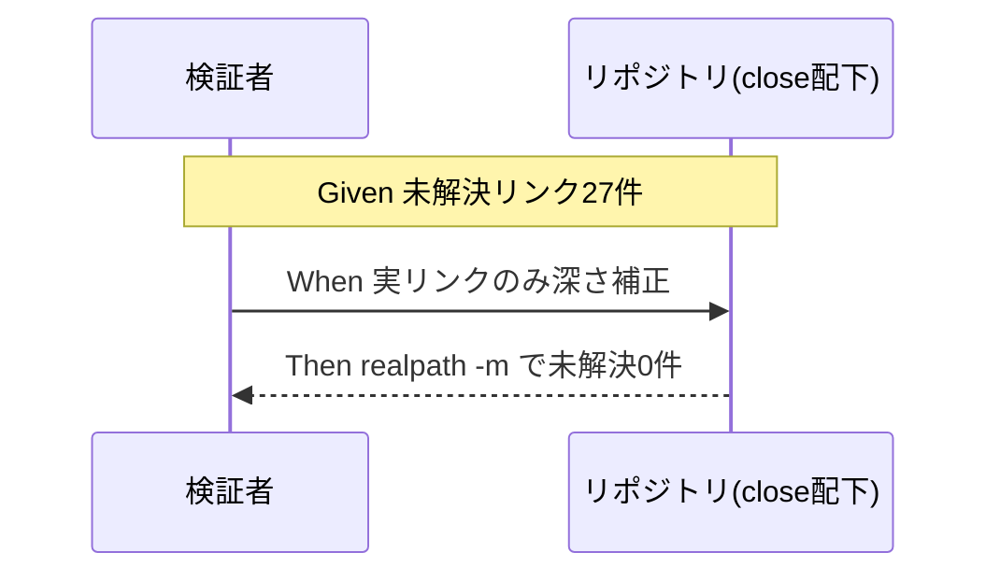
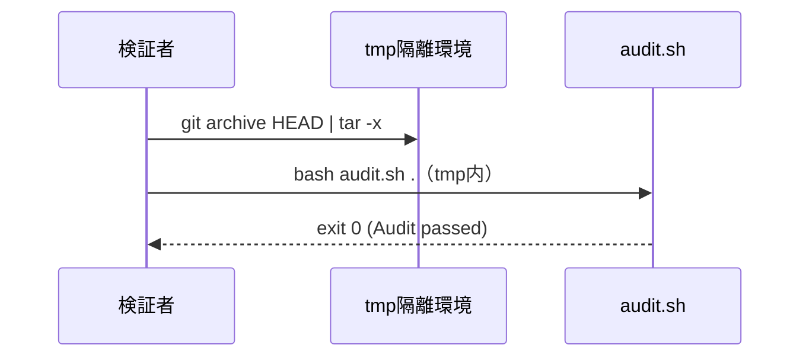

# 要件定義書: 既存 close 配下の健全化（リンク切れ一括補正＋162712 整合不良）

**プロジェクト名**: 既存 close 配下の健全化  
**作成日**: 2026 年 06 月 15 日  
**最終更新**: 2026 年 06 月 15 日

> **重要**: **このドキュメントは常に更新**: 要件の変更や追加があった場合は、即座にこのドキュメントを更新してください。
>
> **用語**: [.agents/CONCEPTS.md §用語規約](../../../../../.agents/CONCEPTS.md#用語規約) を参照。

---

## 1. 概要

### 1.1 システム概要

本リポジトリは「パッケージ正本」かつ「自己拡張する消費者」の二役を兼ね、完了した自己拡張 issue を `docs/maintainer/workflow/close/<issue>/` に**証跡として不変保存**する。本要件は、close 配下に残存する 2 種の不整合を、証跡本文を改変せずに解消し、リポ全体 audit を exit 0 に戻すための要件を定義する。

- **問題1**: close 配下の相対 markdown リンクのうち実測 **27 件**が未解決（前回補正のスコープ外 = 別系統）。
- **問題2**: close 配下の構造により、リポ全体 audit が in-progress 前提チェック（#2b・#7）と DB 由来チェック（#17・#20）で exit 1 になっている。

### 1.2 用語集

| 用語 | 説明 |
| ---- | ---- |
| close 配下 | `docs/maintainer/workflow/close/<issue>/`。完了 issue の不変証跡置き場 |
| 別系統リンク切れ | 前回 issue が補正した 4→5 階層 74 件以外の、未解決相対リンク（3 階層・1 階層パターン等） |
| in-progress 前提チェック | 進行中 issue を対象に設計された audit チェック（#2b 90_issues 要求・#7 TODO/FIXME 検出 等） |
| 証跡不変原則 | PHASES.md:78「close 後も証跡（04_review・workflow.db ログ）はそのまま残す・書き換え/削除しない」 |
| 方針(a)/(b) | (a) 不足成果物補完／(b) audit を close/ に in-progress チェック非適用。00 §2.3 参照 |
| tmp 隔離 | `mktemp -d` ＋ `git archive HEAD` で本リポ非破壊に検証する手順 |

---

## 2. 機能要件

### 2.1 ユーザーストーリー

#### ストーリー 1: close 配下の別系統リンク切れ一括補正

- **As a** 保守者（自己拡張 issue の読者）
- **I want to** close 配下の成果物から参照される `.agents/` 等への相対リンクをすべて辿れるようにしたい
- **So that** 完了済みの開発記録を正しく相互参照でき、保守記録の価値が維持される

**受け入れ基準**:

- `grep -rEon '\]\((\.\./)+[^)]+\)' docs/maintainer/workflow/close/` ＋ `realpath -m` 実測で未解決が **0 件**（SC-1）。
- 補正は**実 markdown リンクの相対深さのみ**。バッククォート内・文章中の `../` 言及は改変しない。
- P1-a（3→5 階層・20 件）・P1-b（1→2 階層・5 件）は実在の妥当な補正先へ補正する。P1-c（解決先不在・2 件）は設計で「補正対象外（証跡不変原則）」か「妥当な補正先がある場合のみ補正」を確定し、SC-1 の「未解決 0」定義に反映する。

#### ストーリー 2: リポ全体 audit を exit 0 に戻す（問題2）

- **As a** CI / self-enforce の運用者
- **I want to** `bash .agents/enforcement/ci/audit.sh .` が PASS（exit 0）を返す状態
- **So that** 「緑 = 正常」の前提が回復し、新規の本物の違反を埋もれさせない

**受け入れ基準**:

- tmp 隔離環境で audit が **exit 0**（SC-2）。
- #2b（90_issues 不在 FAIL: `docs/maintainer/workflow/close` 自体）が解消される。
- #7（TODO/FIXME 残存 FAIL: 162712 の証跡本文中の語）が解消される。
- exit 0 を阻害する #17/#20 等の DB 由来 ERROR の扱いが設計で確定され、SC-2 を満たす。

#### ストーリー 3: 証跡を改変せず健全化し再発を防止する

- **As a** ルール保守者
- **I want to** close 証跡の本文を一切書き換えずに不整合を解消したい
- **So that** PHASES.md:78 の不変原則を守りつつ、以後の close でも同種不整合が再発しない

**受け入れ基準**:

- close 配下の 04_review・memo・workflow.db ログの**証跡本文が未改変**（SC-3。リンク深さの実補正を除く）。
- 推奨方針 (b)（audit を close/ に in-progress チェック非適用）の妥当性が設計で確定され、close 移動手順（自己拡張ワークフロー.md）と整合する。
- 汎用消費者（close 不在・`.workflow` のみ）で audit 挙動が従来と同一（SC-4・後方互換）。

### 2.2 BDD ユースケース

#### ユースケース 1: close 配下リンク補正の検証

リンク補正後、close 配下の全相対リンクが解決することを実測で確認する。

**シナリオ 1: 別系統リンクがすべて解決する**

```gherkin
Feature: close 配下の別系統リンク切れ一括補正
  Scenario: 補正後に未解決リンクが残らない
    Given close 配下に実測 27 件の未解決相対リンクがある
    And 各リンクの実 markdown リンクのみを補正対象とする
    When P1-a を 3→5 階層、P1-b を 1→2 階層へ補正する
    And P1-c の扱いを設計確定の方針に従って処理する
    Then realpath -m 実測で close 配下の未解決相対リンクは 0 件になる
    And バッククォート内・文章中の ../ 言及は改変されていない
```

**処理フロー**:



**シナリオ 2: 証跡本文を改変していない**

```gherkin
Feature: 証跡不変原則の遵守
  Scenario: リンク深さ補正以外で本文が変わらない
    Given close 配下の 04_review・memo に証跡本文がある
    When リンク補正と方針確定に伴う変更を適用する
    Then 04_review・memo・workflow.db ログの本文は実リンク補正を除き未改変である
```

#### ユースケース 2: リポ全体 audit の exit 0 回復

**シナリオ 1: tmp 隔離で audit が PASS する**

```gherkin
Feature: リポ全体 audit を exit 0 に戻す
  Scenario: 隔離環境で audit が PASS
    Given audit が #2b/#7/#17/#20 由来で exit 1 になっている
    When 推奨方針(b)（close/ への in-progress チェック非適用）等を設計確定どおり適用する
    And mktemp -d ＋ git archive HEAD でクリーン展開する
    When bash .agents/enforcement/ci/audit.sh . を実行する
    Then 終了コードは 0（PASS）である
```

**処理フロー**:



**シナリオ 2: 汎用消費者の後方互換**

```gherkin
Feature: 後方互換の維持
  Scenario: close を持たない消費者で挙動不変
    Given close ディレクトリが存在しない .workflow のみの消費者リポ
    When audit を実行する
    Then close/ 除外ロジックは作用せず、従来と同一の判定結果になる
```

### 2.3 ビジネスルール

- **証跡不変が最優先**: close 配下の 04_review・workflow.db ログ・memo 本文を書き換え・削除しない（PHASES.md:78）。リンク補正は実 markdown リンクの相対深さのみ。
- **リンク補正の対象限定**: バッククォート内・文章中の `../` 言及は改変しない（自己拡張ワークフロー.md §close 移動時の相対リンク補正と同一原則）。
- **close/ 除外は close 実在時のみ作用**: 汎用消費者の後方互換を壊さない。

---

## 3. 非機能要件

### 3.1 パフォーマンス要件

- audit 実行時間を有意に悪化させない（スコープ調整中心のため影響軽微）。

### 3.2 セキュリティ要件

- 外部アクセス・秘匿情報なし。検証は tmp 隔離でローカル完結。

### 3.3 ユーザビリティ要件

- 補正・除外の根拠（PHASES.md:78、#29 の close 除外前例）がコメント/ドキュメントから辿れること。

### 3.4 可用性要件

- 補正・除外は冪等であること（再実行しても結果が変わらない）。

---

## 4. 外部インターフェース要件

### 4.1 API 要件

- 公開 API の追加・変更なし。`audit.sh` の入力 I/F（`PROJECT_ROOT`・`WORKFLOW_DIRS` 等の環境変数）は維持する。

### 4.2 データ形式要件

- markdown リンク記法 `](相対パス)` の深さのみを補正する。frontmatter・本文の他要素は変更しない。

---

## 5. 制約事項

- **close 証跡の不変原則**（PHASES.md:78）を最優先制約とする。
- **検証は tmp 隔離**（`mktemp -d` ＋ `git archive HEAD | tar -x`）。本リポの `.agents/` `.workflow/` `workflow.db` を破壊しない（自己拡張ワークフロー.md §テストの tmp 隔離）。
- workflow.db のスキーマ変更・再生成はスコープ外（除外要件）。#20/#17 への対応は設計でスコープ確定するが原則 DB は触らない。
- 単一 issue として完結（サブ issue を作らないため 90_issues.md は本 issue では不要）。

---

## 6. 参考資料

### プロジェクトドキュメント

- [`00_要求定義.md`](./00_要求定義.md) - 要求定義
- [.agents-project/自己拡張ワークフロー.md](../../../../../.agents-project/自己拡張ワークフロー.md) - close 移動時の相対リンク補正・tmp 隔離
- [.agents/workflow/PHASES.md](../../../../../.agents/workflow/PHASES.md) - 証跡不変原則（:78）
- [.agents/enforcement/ci/audit.sh](../../../../../.agents/enforcement/ci/audit.sh) - #2b/#7/#17/#20/#29 判定
- [.agents/spec/06_設計判断の優先順位.md](../../../../../.agents/spec/06_設計判断の優先順位.md) - 設計判断の優先順位

### その他の参考資料

- 直近完了 issue「issue 配置先の正本統一」（4→5 階層 74 件補正。本 issue は別系統 27 件が対象）

---

## 7. 前のステップ

この要件定義書は、以下のドキュメントを基に作成されています：

- **前**: [`00_要求定義.md`](./00_要求定義.md) - 要求定義フェーズ

---

## 8. 次のステップ

この要件定義書の承認後、以下のドキュメントを作成します：

- **次**: [`02_設計.md`](./02_設計.md) - 設計フェーズ
