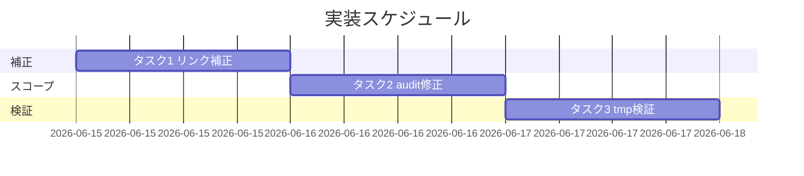
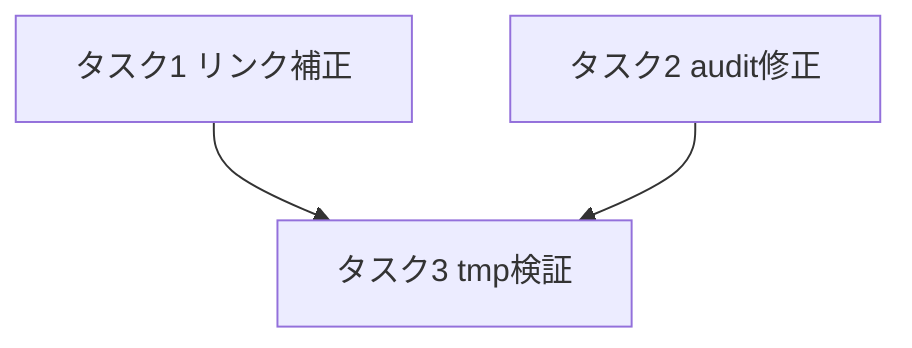

# 実装計画書: 既存 close 配下の健全化（リンク切れ一括補正＋audit close スコープ修正）

**プロジェクト名**: 既存 close 配下の健全化
**作成日**: 2026 年 06 月 15 日
**最終更新**: 2026 年 06 月 15 日

> **重要**: **このドキュメントは常に更新**: 実装計画の変更、進捗状況の更新、バグの記録などがあった場合は、即座にこのドキュメントを更新してください。
> **必須項目**: 「必須」と明記した欄は空欄・抽象語のみで提出しないこと。テスト観点・BDD 仕様は具体ケースを 1 件以上記載すること。
>
> **用語**: [.agents/CONCEPTS.md §用語規約](../../../../../.agents/CONCEPTS.md#用語規約) を参照。

---

## 1. 実装概要

### 1.1 実装方針（必須）

[02\_設計.md](./02_設計.md) に従い、(1) close 配下の実 markdown リンクの相対深さのみを補正し、(2) audit.sh の in-progress 前提チェック（#2b/#3/#7/#9/#17/#20）に `#29` と同型の `close/` 除外ガードを追加する。検証は tmp 隔離（`git archive HEAD | tar -x`）で行い、本リポの `.agents/` `.workflow/` `workflow.db` を破壊しない。証跡本文・workflow.db は不変とする。

### 1.2 実装順序（必須: 1 件以上）

1. タスク1: close 配下リンク補正（P1-a/b/c）
2. タスク2: audit.sh の close スコープ修正（#2b/#3/#7/#9/#17/#20）
3. タスク3: tmp 隔離での全件検証（SC-1〜SC-4）



---

## 2. タスク分解

**用語**: [.agents/CONCEPTS.md §用語規約](../../../../../.agents/CONCEPTS.md#用語規約) を参照。

**必須**: 各タスクには **「テスト観点」（2.x.3）** と **「単体テスト仕様（BDD）」（2.x.4）** を必ず記載する。観点の定義は **02\_設計 §6** および **RULES のテスト戦略・[TEST_BDD_FORMAT.md](../../../../../.agents/TEST_BDD_FORMAT.md)** を参照。

### 2.1 タスク 1: close 配下リンク補正（P1-a/b/c・27 件）

#### 2.1.1 概要（必須）

close 配下成果物の実 markdown リンクの相対深さのみを、解決可能な実在先へ補正する（証跡本文は不変）。

#### 2.1.2 実装内容（必須: 1 件以上）

- **P1-a（20 件・全件 `close/20260614_184756_台帳prev_hash自動連結/`）**: `](../../../` を `](../../../../../` に補正（00:1 / 01:1 / 02:9 / 03:7 / 04:2 件）。対象行は 02 §3.1.4 記載の実測 file:line（02:15,21,68×4,305×2,307 / 03:14,48,64,280,404,405,419 / 04:13,15 / 00:18 / 01:13）。
- **P1-b（5 件）**:
  - `close/20260614_124435_配布とパッケージ構成の再設計/00_要求定義.md:212`・`01_要件定義.md:462`: `](../README.md)` → `](../../README.md)`。
  - `close/20260614_183739_enforcement-runtime実効性是正/00_要求定義.md:218`・`01_要件定義.md:351`・`02_設計.md:361`: `](../../20260614_173500_multi-tool対応/00_要求定義.md)` → `](../../20260614_173500_multi-tool対応/00_要求定義.md)`。
- **P1-c（2 件・元から破損。意味を変えず是正）**:
  - `close/20260614_162712_コア取り込み候補調査/00_要求定義.md:280`: `[`00_システム理解.md`](../00_システム理解.md)` → 非リンクのインラインコード `` `00_システム理解.md` ``（条件付き雛形・実体不在のため宙吊りリンクのみ除去。文意不変）。
  - `close/20260614_162712_コア取り込み候補調査/memo/20260614_222618_第1波実装grep検証証跡.md:29`: `[RULES.md](../RULES.md)` → `[RULES.md](../../../../../.agents/RULES.md)`（本文が指す `.agents/RULES.md` へ是正）。
- 補正は実リンク `](...)` 形のみ。バッククォート内・文章中の `../` 言及は変更しない。

#### 2.1.3 テスト観点（必須）

**参照**: 観点の定義は [02\_設計 §6](./02_設計.md) および [RULES のテスト戦略・TEST_BDD_FORMAT](../../../../../.agents/RULES.md#テスト戦略必須要件) を参照。以下は本タスクの具体ケース。

##### 単体（本タスクの具体ケース・必須 1 件以上）

- P1-a: `close/.../台帳prev_hash自動連結/02_設計.md:15` の補正後リンクを `realpath -m` すると `.agents/CONCEPTS.md`（実在）を指す。
- P1-b: `close/.../配布とパッケージ構成の再設計/00_要求定義.md:212` の補正後が `docs/maintainer/workflow/README.md`（実在）を指す。
- P1-b: `close/.../enforcement-runtime実効性是正/00_要求定義.md:218` の補正後が `docs/maintainer/workflow/20260614_173500_multi-tool対応/00_要求定義.md`（実在）を指す。
- P1-c-2: memo:29 の補正後が `.agents/RULES.md`（実在）を指す。
- P1-c-1: 00:280 が非リンク化され、`\]\((\.\./)+...` の grep 検出対象から外れる。

##### 結合/API（本タスクの具体ケース・該当時は必須 1 件以上）

- 該当なし（API なし。リンク全体の結合検証はタスク3 の E2E に集約）。

##### E2E/受け入れ（本タスクの具体ケース・未達時は理由記載）

- `grep -rEon '\]\((\.\./)+[^)]+\)' docs/maintainer/workflow/close/` ＋ `realpath -m` の未解決が **0 件**（SC-1）。

##### バリデーション（該当する場合の具体ケース）

- `git diff` で変更行が実 markdown リンク `](...)` 行のみであり、バッククォート内・文章中の `../` を改変していない（SC-3）。

#### 2.1.4 単体テスト仕様（BDD）（必須）

**BDD 形式のテストケース（高レベル仕様）**:

```gherkin
Feature: close 配下の別系統リンク切れ一括補正
  Scenario: 補正後に未解決リンクが残らない
    Given close 配下に実測 27 件の未解決相対リンクがある
    And 各リンクの実 markdown リンクのみを補正対象とする
    When P1-a を 3→5 階層、P1-b を 1→2/2→3 階層へ補正する
    And P1-c-1 を非リンク化、P1-c-2 を .agents/RULES.md へ是正する
    Then realpath -m 実測で close 配下の未解決相対リンクは 0 件になる
    And バッククォート内・文章中の ../ 言及は改変されていない
```

**テストコード例（必須: インラインコメントで Given/When/Then を明記）**

```bash
# Given: close 配下の全相対リンクを抽出する前提
# When: 補正適用後に realpath -m で各リンク先の実在を判定する
# Then: 未解決が 0 件であること
fail=0
while IFS=: read -r f n link; do
  rel=$(printf '%s' "$link" | sed -E 's/^\]\(//; s/\).*$//; s/#.*$//')
  target=$(realpath -m "$(dirname "$f")/$rel")
  [ -e "$target" ] || { echo "UNRESOLVED: $f:$n -> $rel"; fail=1; }
done < <(grep -rEon '\]\((\.\./)+[^)]+\)' docs/maintainer/workflow/close/)
[ "$fail" -eq 0 ]   # Then: 未解決 0 件
```

#### 2.1.5 依存関係

- なし（タスク2 と独立に実施可能）。



#### 2.1.6 見積もり

- **工数**: 1.5h
- **優先度**: 高

### 2.2 タスク 2: audit.sh の close スコープ修正

#### 2.2.1 概要（必須）

in-progress 前提チェック（#2b/#3/#7/#9/#17/#20）を `close/` 配下に適用しないガードを `#29` と同型で追加する。

#### 2.2.2 実装内容（必須: 1 件以上）

- **#2b**（audit.sh:208–230 のループ本体先頭）: `[[ "$parent_issue_dir" == *"/close" || "$parent_issue_dir" == *"/close/"* ]] && continue`。
- **#7**（audit.sh:292–311 のループ本体）: `[[ "$f" == *"/close/"* ]] && continue`。
- **#3**（audit.sh:232–247）: DB から得た `issue_path` が `*/close/*` なら `continue`。
- **#9**（audit.sh:341–358）: close 配下 04 を `continue`（防御的）。
- **#20**（audit.sh:564–600 のループ本体先頭）: `[[ "$f" == *"/close/"* ]] && continue`。
- **#17**（audit.sh:469–480）: close 在籍 issue の verify-and-close 行を親検査から除外。bash で `find docs/maintainer/workflow/close -mindepth 1 -maxdepth 1 -type d` から close 在籍 issue 名集合を作り、#17 のカウントクエリ結果から当該 issue_path（basename 一致）を除外する。DB は読み取りのみ（02 §3.2.5）。
- 各ガードに `#29` 前例（audit.sh:747）を根拠とするコメントを 1 行付す（保守性）。

#### 2.2.3 テスト観点（必須）

**参照**: 観点の定義は [02\_設計 §6](./02_設計.md) および [RULES のテスト戦略・TEST_BDD_FORMAT](../../../../../.agents/RULES.md#テスト戦略必須要件) を参照。以下は本タスクの具体ケース。

##### 単体（本タスクの具体ケース・必須 1 件以上）

- #2b: `docs/maintainer/workflow/close` 自体に対する 90_issues FAIL が出ない。
- #7: 162712 の 04_review/memo（語としての TODO/FIXME）で FAIL が出ない。
- #20: close 配下成果物の document_id 未記録 ERROR が出ない。
- #17: close 在籍 issue の verify-and-close 親 ERROR が出ない。

##### 結合/API（本タスクの具体ケース・該当時は必須 1 件以上）

- audit.sh 全 check を連結実行（`bash audit.sh .`）し、close 由来の FAIL/ERROR が 0 になる。

##### E2E/受け入れ（本タスクの具体ケース・未達時は理由記載）

- tmp 隔離（commit 後の `git archive HEAD`）で `bash .agents/enforcement/ci/audit.sh .` が exit 0（SC-2）。

##### バリデーション（該当する場合の具体ケース）

- close を持たない疑似消費者（`close/` ディレクトリを削除した tmp）で audit の終了コード・出力が修正前と同一（SC-4 後方互換）。
- 非 git ツリー（`.git` を除いた tmp）で該当 check が SKIP のまま（既存挙動温存）。

#### 2.2.4 単体テスト仕様（BDD）（必須）

**BDD 形式のテストケース（高レベル仕様）**:

```gherkin
Feature: audit を close/ 配下に in-progress チェック非適用
  Scenario: close 在籍 issue で in-progress チェックが発火しない
    Given audit が #2b/#7/#17/#20 由来で exit 1 になっている
    When 各 check に close/ 除外ガードを追加する
    And mktemp -d ＋ git archive HEAD でクリーン展開する
    When bash .agents/enforcement/ci/audit.sh . を実行する
    Then 終了コードは 0（PASS）である

  Scenario: 後方互換（close 不在消費者）
    Given close ディレクトリが存在しない .workflow のみの消費者リポ
    When audit を実行する
    Then close/ 除外ロジックは作用せず従来と同一の判定結果になる
```

**テストコード例（必須: インラインコメントで Given/When/Then を明記）**

```bash
# Given: commit 済みの本リポを tmp にクリーン展開
TMP=$(mktemp -d); git archive HEAD | tar -x -C "$TMP"
# When: tmp 内で audit を実行
set +e; bash "$TMP/.agents/enforcement/ci/audit.sh" "$TMP"; code=$?; set -e
# Then: exit 0
[ "$code" -eq 0 ]
# Given(後方互換): close を持たない消費者を模擬
rm -rf "$TMP/docs/maintainer/workflow/close"
# When/Then: 終了コードが従来と同一（FAIL/ERROR が close 由来でないもののみに一致）
bash "$TMP/.agents/enforcement/ci/audit.sh" "$TMP"; echo "compat exit=$?"
rm -rf "$TMP"
```

#### 2.2.5 依存関係

- なし（タスク1 と独立。両者の成果がタスク3 に合流）。

#### 2.2.6 見積もり

- **工数**: 2h
- **優先度**: 高

### 2.3 タスク 3: tmp 隔離での全件検証（SC-1〜SC-4）

#### 2.3.1 概要（必須）

タスク1・2 の成果をコミットした状態を tmp に展開し、SC-1（未解決 0）・SC-2（audit exit 0）・SC-3（証跡不変）・SC-4（後方互換）を実測で確認する。

#### 2.3.2 実装内容（必須: 1 件以上）

- 作業ツリーで SC-1 のリンク実測（タスク1 直後）。
- タスク1・2 をコミットし、`mktemp -d` ＋ `git archive HEAD | tar -x` で展開、tmp 内で audit 実行（SC-2）。
- `git diff` で close 配下の変更が実リンク行のみであることを確認（SC-3）。workflow.db の行数・内容の before/after 不変を確認（SC-3）。
- tmp から `close/` を除去した疑似消費者で audit 終了コードが修正前と同一（SC-4）。

#### 2.3.3 テスト観点（必須）

##### 単体（本タスクの具体ケース・必須 1 件以上）

- SC-3: `git diff -- docs/maintainer/workflow/close/` の変更行が `](...)` を含む実リンク行のみ。

##### 結合/API（本タスクの具体ケース・該当時は必須 1 件以上）

- SC-2: tmp での audit 連結実行が exit 0。

##### E2E/受け入れ（本タスクの具体ケース・未達時は理由記載）

- SC-1＋SC-2＋SC-3＋SC-4 を一括検証スクリプトで通す。

##### バリデーション（該当する場合の具体ケース）

- SC-4: close 除去消費者で audit 終了コードが修正前ベースラインと一致。

#### 2.3.4 単体テスト仕様（BDD）（必須）

**BDD 形式のテストケース（高レベル仕様）**:

```gherkin
Feature: 健全化の総合検証
  Scenario: SC-1〜SC-4 を tmp 隔離で満たす
    Given タスク1・2 をコミット済み
    When git archive HEAD で tmp 展開し検証スクリプトを実行する
    Then リンク未解決0件・audit exit0・証跡本文不変・後方互換が全て満たされる
```

**テストコード例（必須: インラインコメントで Given/When/Then を明記）**

```bash
# Given: commit 済みを tmp に展開
TMP=$(mktemp -d); git archive HEAD | tar -x -C "$TMP"; cd "$TMP"
# When: SC-1 リンク実測 ＋ SC-2 audit
unresolved=$(grep -rEon '\]\((\.\./)+[^)]+\)' docs/maintainer/workflow/close/ \
  | while IFS=: read -r f n l; do r=$(echo "$l"|sed -E 's/^\]\(//;s/\).*//;s/#.*//'); \
    [ -e "$(realpath -m "$(dirname "$f")/$r")" ] || echo x; done | wc -l)
set +e; bash .agents/enforcement/ci/audit.sh . >/dev/null 2>&1; code=$?; set -e
# Then: 未解決0件 かつ audit exit0
[ "$unresolved" -eq 0 ] && [ "$code" -eq 0 ]
```

#### 2.3.5 依存関係

- タスク1・タスク2 完了に依存。

#### 2.3.6 見積もり

- **工数**: 1h
- **優先度**: 高

---

## テスト観点

- **問題1**: close 配下の全相対リンクが `realpath -m` で解決（SC-1・未解決 0 件）。実リンクのみ補正し本文不変（SC-3）。
- **問題2**: tmp 隔離でリポ全体 audit exit 0（SC-2）。close 不在消費者で従来と同一終了コード（SC-4 後方互換）。非 git/sqlite3 不在で該当 check が SKIP のまま。
- **証跡不変**: 04_review・memo・workflow.db 本文がリンク補正以外で未改変（SC-3）。
- 各タスクの §2.x.3 に具体ケースを記載済み。01 の BDD（ユースケース1/2）と各タスク BDD が対応する。

---

## 単体テスト

- リンク補正の各先（P1-a/b/c）の `realpath -m` 実在確認を単体ケースとする（§2.1.3）。
- audit close ガードの各 check（#2b/#3/#7/#9/#17/#20）が close 由来 FAIL/ERROR を出さないことを単体ケースとする（§2.2.3）。

---

## BDD

- §2.1.4（リンク補正）・§2.2.4（audit close 非適用＋後方互換）・§2.3.4（総合検証）の Gherkin を正とする。Given/When/Then 形式は [TEST_BDD_FORMAT.md](../../../../../.agents/TEST_BDD_FORMAT.md) に従う。

---

## 3. 実装スケジュール

### 3.1 マイルストーン

| マイルストーン | 期日 | 成果物 |
| -------------- | ---- | ------ |
| リンク補正完了 | T+1 | close 配下成果物（実リンク補正済み） |
| audit 修正完了 | T+1 | audit.sh（close ガード追加） |
| 総合検証完了 | T+2 | SC-1〜SC-4 通過の実測ログ |

### 3.2 実装フェーズ

#### フェーズ 1: 補正＋スコープ修正

- **期間**: 1 日
- **タスク**: タスク1・タスク2

#### フェーズ 2: 検証

- **期間**: 1 日
- **タスク**: タスク3

---

## 4. テスト計画

テスト観点・レベル・BDD 形式の定義は **02\_設計 §6** および **RULES のテスト戦略・TEST_BDD_FORMAT** を参照。各タスク §2.x.3 にタスクごとの具体ケース、§2.x.4 に BDD 仕様を記載済み。

### 4.1 テストの優先順位

- SC-2（audit exit 0）と SC-1（未解決 0）をクリティカルとし、tmp 隔離で必ず実測する。
- SC-4（後方互換）は影響範囲が広いため close 除去消費者での回帰検証に必ず含める。

---

## 5. リスク管理

### 5.1 実装リスク

- **リスク**: #17 の close 判定が記録時 issue_path（close 前パス）と現在パスの差で誤判定する。
  - **対策**: 02 §3.2.5 のとおり、現在 close 配下に実在する issue 名（basename）集合で除外する。安全側（誤 FAIL を出さない）に倒す。
- **リスク**: P1-c-1 の非リンク化が「リンクを消した」と見なされ証跡改変と誤解される。
  - **対策**: 元から解決不能な雛形条件リンク（実体が `.workflow/templates/` にのみ存在）であり、文意は不変であることを 04_review に明記。代替（templates 参照）が名前空間境界違反となる根拠も併記。
- **リスク**: 進行中 issue の #20 ERROR が SC-2 を阻害。
  - **対策**: 02 §6.2 のとおり SC-2 は commit 後の `git archive HEAD` tmp で評価し、未コミットの進行中差分に依存しない。

---

## 6. 参考資料

### プロジェクトドキュメント

- [`02_設計.md`](./02_設計.md) - 設計

### その他の参考資料

- #29（実装前 04）の `*/close/*` 除外（audit.sh:747）— 踏襲する前例

---

## 7. 前のステップ

この実装計画書は、以下のドキュメントを基に作成されています：

- **前**: [`02_設計.md`](./02_設計.md) - 設計フェーズ

---

## 8. 次のステップ

この実装計画書の承認後、以下のいずれかのステップに進みます：

- **プロジェクトが 1 つの issue（タスク）である場合**: 実装フェーズ（execution）に直接進む（本 issue はサブ issue 分割なし＝90_issues.md 不要）。

**用語**: [.agents/CONCEPTS.md §用語規約](../../../../../.agents/CONCEPTS.md#用語規約) を参照。
