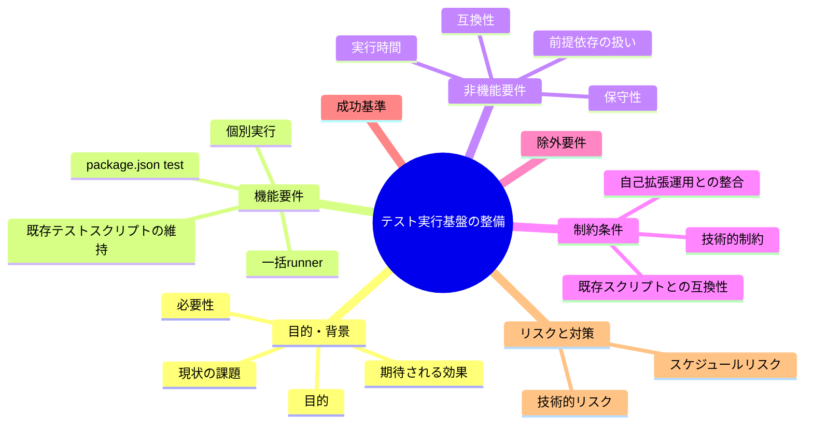
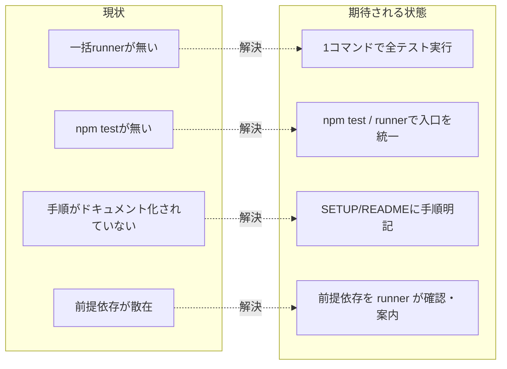

# 要求定義書: テスト実行基盤の整備（一括 runner と手順ドキュメント）

**プロジェクト名**: テスト実行基盤の整備（一括 runner と手順ドキュメント）
**作成日**: 2026 年 06 月 15 日
**最終更新**: 2026 年 06 月 15 日

> **重要**:
>
> - 要求定義書は、プロジェクトの全体像を把握するためのものです。詳細な技術仕様や実装方法は要件定義書以降で記載します。必要最低限の情報に収めることを心掛けてください。
> - **このドキュメントは常に更新**: 要求の変更や追加があった場合は、即座にこのドキュメントを更新してください。ドキュメントは「生きているドキュメント」として扱い、実装内容と常に同期させます。
> - **必須項目**: 以下の「必須」と明記した項目は空欄・抽象語のみで提出しないこと。判定可能な形（目的は1文・成功基準は○/×で判定できる記載等）で記入すること。
>
> **用語**: [.agents/CONCEPTS.md §用語規約](../../../../../.agents/CONCEPTS.md#用語規約) を参照。

---

## 要求定義の全体像

**注意**:

- マインドマップは全体像を把握するためのものです。主要なセクション名程度に留めます。

---

## 1. 目的・背景

### 1.1 目的（必須）

1 コマンドで全テストを実行できる入口と手順ドキュメントを整備する。

### 1.2 背景

- **現状の課題**:
  - Makefile も `npm test`（package.json の `test` スクリプト）も一括 runner も存在せず、テストを一括実行する入口が無い。`package.json` の scripts は `build:claude` のみ。
  - テストは CI（`.github/workflows/self-enforce.yml`）でまとめて走るか、4 本のスクリプト（`.agents/scripts/test/test-audit.sh`、`test-pretooluse-hook.sh`、`test-write-workflow-log-prevhash.sh`、`e2e-install-uninstall.sh`）を 1 本ずつ手で実行するしかない。
  - `.agents/SETUP.md` にテスト実行手順の記載が無く、開発者がローカルでテストをどう回すか分からない。
  - 前提依存（bash / git / node / tar / sqlite3）がスクリプトごとに異なるが、まとめて確認・案内する場所が無い。

- **必要性**:
  - 開発中（自己拡張・ドッグフーディング）に変更の妥当性を手元で素早く検証したいが、現状は CI 待ちか個別手実行に頼っており回しづらい。
  - CI は self-enforce.yml に検証ロジックを集約しているが、ローカルからは同等のテスト群を 1 コマンドで再現できない。

### 1.3 期待される効果（必須: 1 件以上）

- **効果 1**: 開発者が 1 コマンドで全テストを実行でき、すべて通れば exit 0・1 つでも失敗すれば非 0 で終了する（○/×で判定可能）。
- **効果 2**: 各テストの個別実行も引き続き可能で、結果が runner により集約表示される（成功/失敗の一覧が出る）。
- **効果 3**: `.agents/SETUP.md`（および README）にテスト実行手順と前提依存が明記され、新規開発者が手順を読めばローカルでテストを回せる。

**現状と期待される状態の比較**:

---

## 2. 機能要件

### 2.1 既存機能の維持（該当する場合）

- 既存の 4 本のテストスクリプト（`.agents/scripts/test/` 配下）はそのまま個別実行できる状態を維持する。各スクリプトの BDD コメント・tmp 隔離方針・終了コード仕様は変更しない。
- CI（`self-enforce.yml`）の検証内容との整合を保つ（runner は CI を置き換えるものではなく、ローカルから同種のテスト群を回せるようにする）。

### 2.2 新規機能要件

- **一括 runner**: 全テストを順に実行し結果を集約する入口（`.agents/scripts/test/run-all.sh` もしくは Makefile）。1 件でも失敗すれば非 0 で終了する。
- **package.json `test` スクリプト**: `npm test` で上記 runner を起動できるよう配線する。
- **個別実行の維持**: runner 経由でも、従来どおり個々のスクリプト直接実行でも回せる。
- **前提依存の扱い**: 必須依存（bash 等）の不足は明示エラー、任意依存（sqlite3 等）の不足は当該テストを SKIP として案内する（既存スクリプトの方針と整合）。
- **手順ドキュメント**: `.agents/SETUP.md`（および README）にテスト実行手順・個別実行方法・前提依存を明記する。

---

## 3. 非機能要件

### 3.1 パフォーマンス

- runner は不要な再ビルド・重複処理を避け、開発中に現実的な時間で完了すること（既存スクリプトの実行時間に runner のオーバーヘッドを大きく上乗せしない）。

### 3.2 セキュリティ

- テストは破壊的になりうる操作（install/uninstall/setup/build）を含むため、各スクリプトの tmp 隔離方針（`mktemp -d` ＋ `git archive HEAD`）を runner からの実行でも維持し、開発リポの `.agents/` `.claude/` `.cursor/` `.workflow/` `workflow.db` を変更・破壊しない。

### 3.3 互換性

- 既存スクリプトのインターフェース（実行方法・終了コード）を壊さない。CI（self-enforce.yml）からの呼び出しと矛盾しない。

### 3.4 保守性

- テストの追加・削除が runner の 1 箇所の変更で済むこと（テスト一覧の正本を 1 箇所に集約）。UNIX 哲学・単一責務（[.agents/spec/01_設計原則.md](../../../../../.agents/spec/01_設計原則.md)）に従い、runner は「全テストを実行し集約する」責務に限定する。

---

## 4. 制約条件

### 4.1 技術的制約

- 実行系の前提は bash。テストにより git / node / tar / sqlite3 を追加で要する（依存マトリクスは 01 で定義）。
- 検証ロジックを CI とローカルで二重化しない（self-enforce.yml の方針＝検証ロジックはスクリプトに集約）。runner は既存スクリプトを呼ぶラッパに徹し、テスト本体のロジックを再実装しない。

### 4.2 既存システムとの互換性

- `package.json` の既存 scripts（`build:claude`）・`bin`（`agents-md`）を壊さない。`test` スクリプトを追加するのみ。
- 配布物（npm pack / プラグイン）に余計なものを含めない。runner が配布物リーク検査（verify-npm-pack.sh）に影響しないこと。

### 4.3 移行期間・スケジュール

- 単一 issue として完結する小〜中規模変更（standard モード相当）。段階移行は不要。

---

## 5. 除外要件

- カバレッジ計測基盤（coverage の収集・閾値矯正）の新規導入は対象外。
- 新規テストケースの追加（テスト網羅率の向上そのもの）は対象外。既存 4 本を回せる入口の整備に限定する。
- CI（self-enforce.yml）の再設計・置き換えは対象外。
- 並列実行・テストフレームワーク（jest 等）の導入は対象外。

---

## 6. 成功基準（必須: 1 件以上）

- **SC-1**: 1 コマンド（`npm test` もしくは `bash .agents/scripts/test/run-all.sh`）で 4 本のテストがすべて実行され、結果が集約表示される（○/×で判定可能）。
- **SC-2**: いずれかのテストが失敗した場合、runner が非 0 で終了する（わざと失敗させて exit code != 0 を確認）。
- **SC-3**: すべて成功した場合、runner が exit 0 で終了する。
- **SC-4**: 個別実行（各スクリプトを直接 `bash` で実行）が従来どおり可能である。
- **SC-5**: `.agents/SETUP.md`（および README）にテスト実行手順・個別実行・前提依存（bash/git/node/tar/sqlite3）が記載されている。
- **SC-6**: 任意依存（sqlite3 等）が無い環境でも runner がクラッシュせず、当該テストを SKIP として案内し、残りを実行する。

---

## 7. リスクと対策

### 7.1 技術的リスク

- **リスク**: runner が tmp 隔離を経由せずテストを呼び、開発リポの本番ファイルを破壊する。
  - **対策**: runner は各スクリプトをそのまま呼ぶだけにし、隔離ロジックは既存スクリプト側に残す。runner 自身は開発リポに書き込まない。
- **リスク**: 検証ロジックを runner に再実装し、CI と二重管理になりズレる。
  - **対策**: runner はラッパに徹し、テスト本体は既存スクリプトに集約（single source of truth）。

### 7.2 スケジュールリスク

- **リスク**: 手順ドキュメントの記載漏れ・実体とのズレ。
  - **対策**: 受け入れ基準（SC-5）でドキュメント記載を必須化し、verify-and-close の監査で実体一致を確認する。

---

## 8. 参考資料

### プロジェクトドキュメント

- [.agents/SETUP.md](../../../../../.agents/SETUP.md) — 導入・セットアップ手順（テスト手順の追記先）
- [.agents/RULES.md](../../../../../.agents/RULES.md) §テスト戦略・§テスト隔離
- [.agents-project/自己拡張ワークフロー.md](../../../../../.agents-project/自己拡張ワークフロー.md) §テストの tmp 隔離
- [.agents/spec/01_設計原則.md](../../../../../.agents/spec/01_設計原則.md)、[.agents/spec/06_設計判断の優先順位.md](../../../../../.agents/spec/06_設計判断の優先順位.md)

### その他の参考資料

- `.github/workflows/self-enforce.yml`（CI の検証内容・前提ツール）
- `.agents/scripts/test/`（既存 4 本のテストスクリプト）

---

## 9. 次のステップ

この要求定義書の承認後、以下のドキュメントを作成します：

- **次**: [`01_要件定義.md`](./01_要件定義.md) - 要件定義フェーズ
