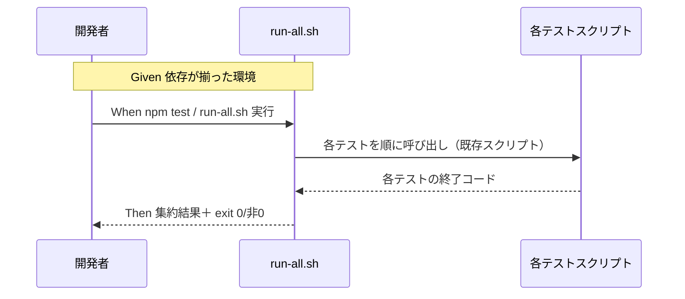

# 要件定義書: テスト実行基盤の整備（一括 runner と手順ドキュメント）

**プロジェクト名**: テスト実行基盤の整備（一括 runner と手順ドキュメント）
**作成日**: 2026 年 06 月 15 日
**最終更新**: 2026 年 06 月 15 日

> **重要**: **このドキュメントは常に更新**: 要件の変更や追加があった場合は、即座にこのドキュメントを更新してください。ドキュメントは「生きているドキュメント」として扱い、実装内容と常に同期させます。
>
> **用語**: [.agents/CONCEPTS.md §用語規約](../../../../../.agents/CONCEPTS.md#用語規約) を参照。

---

## 1. 概要

### 1.1 システム概要

本リポジトリの開発者（自己拡張・ドッグフーディングを行う保守者）が、ローカルで全テストを 1 コマンドで実行できる入口（一括 runner ＋ `npm test`）を整備し、実行手順・前提依存を `.agents/SETUP.md` および README に明記する。runner は既存の 4 本のテストスクリプトを順に呼び出し、結果を集約して、1 件でも失敗すれば非 0 で終了する。既存スクリプトの個別実行・tmp 隔離・終了コード仕様は維持する。

### 1.2 用語集

| 用語 | 説明 |
| -------- | ------ |
| 一括 runner | 全テストスクリプトを順に実行し結果を集約する入口（`.agents/scripts/test/run-all.sh` もしくは Makefile）。 |
| 個別実行 | 各テストスクリプトを直接 `bash` で 1 本ずつ実行すること。 |
| 必須依存 | 全テストの実行に最低限必要なツール（bash）。 |
| 任意依存 | 一部テストのみが要するツール（git / node / tar / sqlite3）。不足時は当該テストを SKIP。 |
| tmp 隔離 | `mktemp -d` ＋ `git archive HEAD` 等でクリーン環境を再現し、開発リポを破壊せず検証する方針。 |

#### 依存マトリクス（事実）

| テストスクリプト | 必須/任意の前提 |
|------------------|------------------|
| `test-audit.sh` | bash 必須。sqlite3 / git は任意（無くても SKIP として通る）。 |
| `test-pretooluse-hook.sh` | bash・git・tar 必須。jq は任意（無い系統も検証）。 |
| `test-write-workflow-log-prevhash.sh` | bash・sqlite3 必須。 |
| `e2e-install-uninstall.sh` | bash・git・node・tar 必須。sqlite3 があれば DB 検証も行う（無ければ DB 検証 SKIP）。 |

> 依存の正本は各スクリプト冒頭の「前提」記載。runner はこの差を踏まえ、任意依存不足は SKIP、必須依存不足は明示エラーとして案内する。

---

## 2. 機能要件

### 2.1 ユーザーストーリー

#### ストーリー 1: 1 コマンドで全テストを実行する

- **As a** 本リポジトリの開発者（保守者）
- **I want to** 1 コマンドで全テストを実行し結果をまとめて確認したい
- **So that** CI を待たず手元で変更の妥当性を素早く検証できる

**受け入れ基準**:

- `npm test` もしくは `bash .agents/scripts/test/run-all.sh` で 4 本がすべて実行される（00 §6 SC-1）。
- 実行結果が集約表示される（各テストの PASS / FAIL / SKIP が一覧で分かる）。
- すべて成功なら exit 0、1 件でも失敗なら非 0 で終了する（SC-2・SC-3）。

#### ストーリー 2: 個別にテストを実行する

- **As a** 本リポジトリの開発者
- **I want to** 特定のテストだけを直接実行したい
- **So that** デバッグ中に対象テストだけを素早く回せる

**受け入れ基準**:

- 各スクリプトを従来どおり `bash .agents/scripts/test/<name>.sh` で実行できる（SC-4）。
- runner の導入により既存スクリプトの実行方法・終了コードが変わらない。

#### ストーリー 3: 前提依存が分かり、不足しても破綻しない

- **As a** 環境構築途中の開発者
- **I want to** テストの前提依存を把握し、一部ツールが無くても runner が破綻しないでほしい
- **So that** 最小環境でも回せるテストを回し、不足は案内で気づける

**受け入れ基準**:

- 任意依存（sqlite3 等）が無い環境でも runner がクラッシュせず、当該テストを SKIP として案内し残りを実行する（SC-6）。
- 必須依存が無い場合は明示的なエラーメッセージを出す。

#### ストーリー 4: テスト実行手順がドキュメント化されている

- **As a** 新規参加の開発者
- **I want to** テストの実行方法・前提依存をドキュメントで知りたい
- **So that** 手順を読むだけでローカルでテストを回せる

**受け入れ基準**:

- `.agents/SETUP.md`（および README）に一括実行・個別実行・前提依存（bash/git/node/tar/sqlite3）が記載される（SC-5）。
- 記載内容が実体（runner・スクリプト・依存）と一致する（verify-and-close の監査で確認）。

### 2.2 BDD ユースケース

#### ユースケース 1: 一括 runner による全テスト実行

開発者が runner を起動し、全テストを実行して集約結果と終了コードを得る。

**シナリオ 1: 全テスト成功で exit 0**

```gherkin
Feature: 一括 runner による全テスト実行
  Scenario: 全テスト成功
    Given 必須・任意依存（bash/git/node/tar/sqlite3）がすべて揃った環境である
    When 開発者が `npm test`（または `bash .agents/scripts/test/run-all.sh`）を実行する
    Then 4 本のテストがすべて実行され
    And 各テストの結果（PASS/FAIL/SKIP）が集約表示され
    And runner は exit 0 で終了する
```

**シナリオ 2: 1 件でも失敗すると非 0 で終了**

```gherkin
Feature: 一括 runner による全テスト実行
  Scenario: いずれかのテストが失敗
    Given いずれかのテストが失敗する状態である
    When 開発者が runner を実行する
    Then 失敗したテストが集約結果に FAIL として表示され
    And runner は非 0 の終了コードで終了する
```

**処理フロー**:



#### ユースケース 2: 個別実行の維持

開発者が単一のテストスクリプトを直接実行する。

**シナリオ 1: 単一スクリプトの直接実行**

```gherkin
Feature: 個別実行の維持
  Scenario: 単一テストを直接実行
    Given 既存の 4 本のテストスクリプトが配置されている
    When 開発者が `bash .agents/scripts/test/test-audit.sh` を実行する
    Then 当該テストのみが従来どおり実行され
    And 実行方法・終了コードが runner 導入前と変わらない
```

#### ユースケース 3: 前提依存の扱い

任意依存が欠けた環境で runner を実行する。

**シナリオ 1: 任意依存（sqlite3）が無い環境**

```gherkin
Feature: 前提依存の扱い
  Scenario: 任意依存が無い環境
    Given sqlite3 が未インストールの環境である
    When 開発者が runner を実行する
    Then sqlite3 を要するテスト（または検証部分）が SKIP として案内され
    And runner はクラッシュせず残りのテストを実行する
```

**シナリオ 2: 必須依存が無い環境**

```gherkin
Feature: 前提依存の扱い
  Scenario: 必須依存が無い環境
    Given あるテストの必須依存（例: git・tar・node）が未インストールである
    When 開発者が runner を実行する
    Then 当該テストについて必須依存不足の明示エラーが案内され
    And runner は最終的に非 0 で終了する
```

#### ユースケース 4: tmp 隔離の維持（破壊禁止）

runner 経由でも開発リポを破壊しない。

**シナリオ 1: runner 実行後も開発リポが不変**

```gherkin
Feature: tmp 隔離の維持
  Scenario: 開発リポを破壊しない
    Given 破壊的になりうるテスト（e2e-install-uninstall 等）を含む
    When 開発者が runner を実行する
    Then 各テストは mktemp -d 等の隔離環境で実行され
    And 開発リポの .agents/ .claude/ .cursor/ .workflow/ workflow.db は変更されない
```

### 2.3 ビジネスルール

- runner はテスト本体のロジックを再実装せず、既存スクリプトを呼ぶラッパに徹する（検証ロジックの正本は既存スクリプト。CI とローカルで二重化しない）。
- テスト一覧の正本は 1 箇所（runner 内のテスト列挙）に集約し、追加・削除はそこを変更する。
- runner 自身は開発リポへ書き込まない。隔離は各スクリプトの責務に委ねる。

---

## 3. 非機能要件

### 3.1 パフォーマンス要件

- runner のオーバーヘッドは既存スクリプト実行時間に対し無視できる程度に抑える（重複ビルド・重複セットアップを行わない）。

### 3.2 セキュリティ要件

- 破壊的テストは tmp 隔離で実行し、開発リポの本番ファイル・証跡 DB を変更しない（00 §3.2・[.agents/RULES.md](../../../../../.agents/RULES.md) §テスト隔離）。

### 3.3 ユーザビリティ要件

- 集約結果は人が一目で PASS/FAIL/SKIP の件数と失敗テスト名を把握できる形式とする。
- 手順は SETUP/README から 1 ページで参照できる。

### 3.4 可用性要件

- 任意依存が欠ける最小環境でも runner は破綻せず、実行可能なテストを実行し SKIP を案内する。

---

## 4. 外部インターフェース要件

### 4.1 API 要件

- **入口（CLI）**: `npm test`（package.json の `test` スクリプト）、`bash .agents/scripts/test/run-all.sh`。
- **終了コード契約**: 全成功＝0、1 件以上失敗＝非 0。SKIP は失敗扱いにしない。

### 4.2 データ形式要件

- 標準出力に各テストの開始・結果（PASS/FAIL/SKIP）と末尾サマリ（合計・成功・失敗・SKIP 件数）を出力する。機械可読形式の規定は本 issue では設けない（標準出力の人間可読サマリで足りる）。

---

## 5. 制約事項

- 実行系の前提は bash。テストにより git / node / tar / sqlite3 を追加で要する（§1.2 依存マトリクス）。
- `package.json` の既存 scripts（`build:claude`）・`bin`（`agents-md`）を壊さず、`test` スクリプトを追加する。
- 配布物リーク検査（`verify-npm-pack.sh`）に影響しないこと（runner・追記が配布物に不要な漏れを生まない）。
- CI（`.github/workflows/self-enforce.yml`）の検証内容と矛盾しないこと。runner は CI を置き換えない。
- 自己拡張運用の作成場所・tmp 隔離ルール（[.agents-project/自己拡張ワークフロー.md](../../../../../.agents-project/自己拡張ワークフロー.md)）に従う。

---

## 6. 参考資料

### プロジェクトドキュメント

- [`00_要求定義.md`](./00_要求定義.md) - 要求定義
- [.agents/SETUP.md](../../../../../.agents/SETUP.md)、[.agents/RULES.md](../../../../../.agents/RULES.md) §テスト戦略・§テスト隔離

### その他の参考資料

- `.github/workflows/self-enforce.yml`（CI 検証内容・前提ツール）
- `.agents/scripts/test/`（既存 4 本のテストスクリプトと各冒頭の「前提」記載）
- [.agents/spec/01_設計原則.md](../../../../../.agents/spec/01_設計原則.md)（UNIX 哲学・単一責務）

---

## 7. 前のステップ

この要件定義書は、以下のドキュメントを基に作成されています：

- **前**: [`00_要求定義.md`](./00_要求定義.md) - 要求定義フェーズ

---

## 8. 次のステップ

この要件定義書の承認後、以下のドキュメントを作成します：

- **次**: [`02_設計.md`](./02_設計.md) - 設計フェーズ
