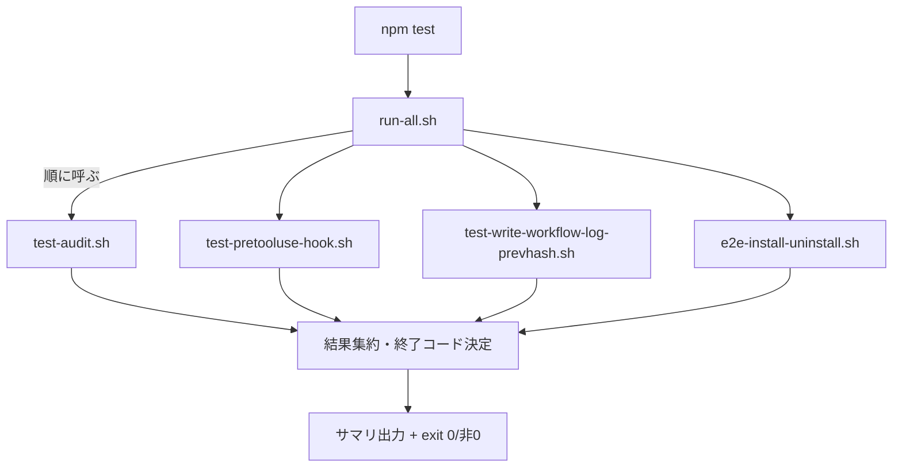
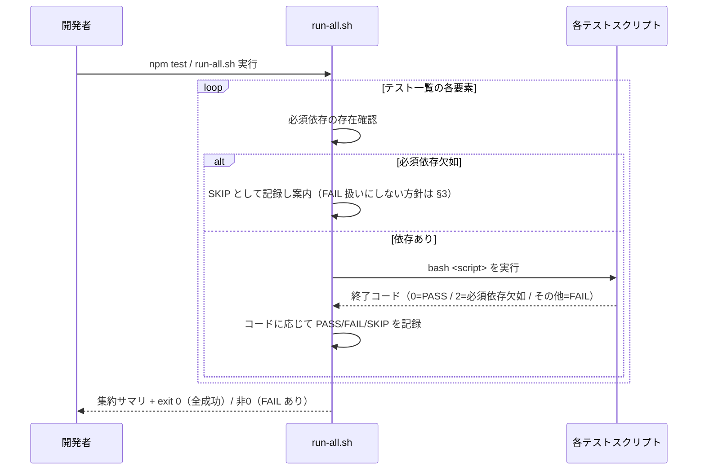
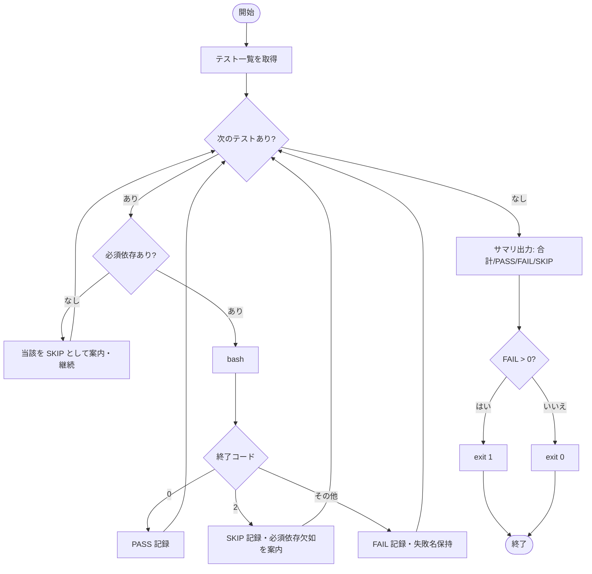

# 設計書: テスト実行基盤の整備（一括 runner と手順ドキュメント）

**プロジェクト名**: テスト実行基盤の整備（一括 runner と手順ドキュメント）  
**作成日**: 2026 年 06 月 15 日  
**最終更新**: 2026 年 06 月 15 日

> **重要**: **このドキュメントは常に更新**: 設計の変更や追加があった場合は、即座にこのドキュメントを更新してください。ドキュメントは「生きているドキュメント」として扱い、実装内容と常に同期させます。
>
> **用語**: [.agents/CONCEPTS.md §用語規約](../../../../../.agents/CONCEPTS.md#用語規約) を参照。

---

## 1. 設計概要

**必須**: 設計方針・原則は [.agents/spec/01\_設計原則.md](../../../../../.agents/spec/01_設計原則.md) を**先に参照**した上で、本プロジェクトに**適用するものを選び**記載すること。

### 1.1 設計方針

既存 4 本のテストスクリプトを**順に呼ぶだけのラッパ**として `run-all.sh` を新設し、検証ロジックを一切再実装せず（single source of truth＝各スクリプト）、結果集約・終了コード規約・SKIP 案内のみを responsibilities とする。手順ドキュメントは SETUP/README に runner の I/F と依存マトリクスを記載する。

### 1.2 設計原則（本プロジェクトで適用するもの）

- **UNIX哲学**: runner は「全テストを順に実行し結果を集約する」1 つのことだけを行う。各テストスクリプト（既存の小さな部品）を組み合わせる。新たなビルド・セットアップを runner 側で行わない。
- **単一責務**: runner はオーケストレーション（列挙・呼び出し・集約・終了コード決定・依存案内）のみを持ち、テスト本体のロジックは持たない。テスト一覧の正本は runner 内の 1 配列に集約。
- **明確な境界**: runner（呼び出し側）と各テストスクリプト（被呼び出し側）の境界を、終了コード（0=PASS / 2=必須依存欠如 / 0 以外=FAIL）と標準出力で定義する。tmp 隔離・破壊的操作は各スクリプトの責務に委ね、runner は開発リポへ書き込まない。
- **AIフレンドリー設計**: 単一の小さな bash スクリプト、明確な命名（`run-all.sh`）、テスト一覧という意図が分かるデータ構造に集約する。

> **AIフレンドリー設計**: [01\_設計原則 §AIフレンドリー設計](../../../../../.agents/spec/01_設計原則.md#aiフレンドリー設計)（小さなファイル・明確な責務・意図が分かる命名・深すぎないディレクトリ構造）に従い、runner は `.agents/scripts/test/` 配下の単一ファイルとする。

---

## 2. アーキテクチャ設計

### 2.1 責務・境界・参照関係

#### 2.1.1 責務一覧

| コンポーネント | 責務（1 文） |
| -------------- | ------------ |
| `run-all.sh`（新規） | テスト一覧を順に実行し、各終了コードを集約して PASS/FAIL/SKIP サマリを出力し、1 件でも FAIL なら非 0・全成功なら 0 で終了する。 |
| 既存 4 本のテストスクリプト | 各テスト本体（tmp 隔離・アサーション・終了コード）を担う。runner からも個別実行でも同一に振る舞う（変更しない）。 |
| `package.json` `test` スクリプト | `npm test` を `run-all.sh` の起動に配線する入口。 |
| `.agents/SETUP.md` / `README.md` | テスト実行手順（一括・個別）・前提依存マトリクス・SKIP 規約の文書化。 |
| `self-enforce.yml`（CI） | CI 上の検証入口。runner の I/F に整合させ、ロジック二重化を避ける（§3.3）。 |

#### 2.1.2 境界

- **入力**: runner には引数なしで起動（`bash .agents/scripts/test/run-all.sh` / `npm test`）。各テストの選択や並列化はスコープ外（00 §5 除外要件）。
- **出力**: 標準出力に各テストの開始・結果（PASS/FAIL/SKIP）と末尾サマリ（合計・成功・失敗・SKIP 件数・失敗テスト名）。終了コードで全体の成否を返す。
- **他責務との境界**: tmp 隔離・破壊的操作の安全性は**各テストスクリプトの責務**（runner は隔離ロジックを持たない）。カバレッジ計測・新規テストケース追加・並列実行・CI 再設計は本 issue の範囲外（後続のカバレッジ issue が runner の I/F に相乗りする前提でのみ I/F を規定する）。

#### 2.1.3 参照関係

- `npm test` → `run-all.sh` → 各テストスクリプト（`test-audit.sh`・`test-pretooluse-hook.sh`・`test-write-workflow-log-prevhash.sh`・`e2e-install-uninstall.sh`）。
- `self-enforce.yml`（E2E step）→ `e2e-install-uninstall.sh`（現状）。整合方針は §3.3。
- 依存の向きは runner → テストスクリプトの一方向のみ。循環参照なし。テストスクリプトは runner を参照しない（個別実行を維持するため）。

### 2.2 システムアーキテクチャ

**必須**: 設計判断は [.agents/spec/](../../../../../.agents/spec/)（[00_spec概要.md](../../../../../.agents/spec/00_spec概要.md)、[01\_設計原則.md](../../../../../.agents/spec/01_設計原則.md)、[06\_設計判断の優先順位.md](../../../../../.agents/spec/06_設計判断の優先順位.md)）を**先に**参照すること。

- **採用パターン**: パイプライン／オーケストレータ（ラッパ）パターン。runner は薄いオーケストレータとして既存部品を逐次呼び出す。
- **根拠**: [01\_設計原則 §UNIX哲学・§単一責務](../../../../../.agents/spec/01_設計原則.md)。検証ロジックの単一正本を既存スクリプトに保ち（二重化回避）、runner は組み合わせに徹する。

#### 2.2.1 CQRS（Command/Query 分離）

- 本 issue は状態変更を伴わない（runner は開発リポへ書き込まない）。CQRS は適用対象外。

#### 2.2.2 アーキテクチャ図（本プロジェクトの構成で記載）

### 2.3 コンポーネント構成

- **`run-all.sh`**（新規・`.agents/scripts/test/` 配下）: 単一責務のオーケストレータ。テスト一覧（配列）・必須依存判定・実行ループ・集約・サマリ出力・終了コード決定を内包する。テスト本体・隔離ロジックは持たない（既存スクリプトに委譲）。
- **既存 4 本**: 無変更。各冒頭「前提」記載が依存マトリクスの正本。
- **ドキュメント**: SETUP.md に「テスト実行」節を追加、README に動作確認からの参照を追加。

### 2.4 データフロー

runner は各テストスクリプトを子プロセスとして起動し、終了コードを受け取り、それを内部状態（PASS/FAIL/SKIP カウンタと失敗名リスト）に集約する。状態変更イベントは発行しない（runner は開発リポに書き込まない）。

---

## 3. 機能設計

### 3.1 機能 1: 一括 runner（run-all.sh）

#### 3.1.1 概要

テスト一覧を順に実行し、結果を集約して全体の成否を 1 つの終了コードで返す。

#### 3.1.2 処理フロー

#### 3.1.3 入力・出力

- **入力**: 引数なし。リポジトリルートで実行する想定（既存スクリプトと同じ呼び出し前提）。
- **出力**: 各テスト名と PASS/FAIL/SKIP、末尾サマリ（合計・PASS・FAIL・SKIP の件数と失敗テスト名）。終了コードは §5 終了コード契約に従う。

#### 3.1.4 エラーハンドリング

- 個別テストが 0 以外（≠2）で終了 → FAIL 記録、失敗名を保持し継続（途中中断しない＝全件の結果を集約する）。
- 個別テストが 2 で終了（既存スクリプトの「必須依存欠如」規約）または runner の事前依存チェックで必須依存不足を検出 → SKIP 記録＋当該テストの必須依存名を案内し継続（runner はクラッシュしない／SC-6）。
- runner 自身は `set -uo pipefail` を用いるが、個別テスト呼び出しは `if`/`||` でラップし、非 0 でも runner が即終了しないようにする（`set -e` 由来の中断を避ける）。

### 3.2 機能 2: package.json `test` 配線

#### 3.2.1 概要

`npm test` で runner を起動できるよう `scripts.test` を追加する（既存 `build:claude`・`bin` は不変）。

#### 3.2.2 入力・出力

- 入力: `npm test`。出力: runner の標準出力・終了コードがそのまま `npm` の終了コードに伝播する。

### 3.3 機能 3: CI とのロジック二重化回避

#### 3.3.1 概要

self-enforce.yml は「シェル構文・schema・差分ゼロ・npm pack・version 同期・E2E・audit」の 7 step で構成され、テスト本体ロジックは各スクリプト側に集約済み（コメントにも「CI とローカルで二重化しない」と明記）。本 issue の方針は次のいずれかとし、**ロジックの二重実装を新たに生まない**こと。

- **方針 A（推奨・最小変更）**: CI は現状の step 構成を維持しつつ、E2E step が呼ぶ `e2e-install-uninstall.sh` を runner（run-all.sh）が同じく呼ぶ形にし、テスト本体（スクリプト）を単一正本とする。CI の他 step（schema/pack/version/audit）はテストスクリプトとは別系統の検証であり、runner には含めない（重複しない）。
- **方針 B（任意・将来）**: CI の「unit テスト群」step を 1 つ追加し `bash .agents/scripts/test/run-all.sh` を呼ぶ。ただし既存 E2E step との二重実行を避けるため、E2E を runner 経由に一本化する（E2E step は runner に吸収）。本 issue では方針 A を既定とし、B は 03 で「採否を明記して選ぶ」タスクに含める。

> いずれの方針でも、**検証ロジックは各テストスクリプトに 1 本**（single source of truth）。runner も CI も「スクリプトを呼ぶだけ」に徹し、判定の再実装を行わない。

---

## 4. データ設計

本 issue は永続データ・テーブルを持たない（runner はステートレスで開発リポに書き込まない）。該当なし。

---

## 5. API 設計（runner の I/F 仕様）

> 本節は後続のカバレッジ issue が相乗りするため、**runner の呼び出し方・終了コード規約・SKIP 表現を正本として明記**する。

### 5.1 API 一覧

| エンドポイント（CLI） | 形式 | 説明 |
| --------------------- | ---- | ---- |
| `bash .agents/scripts/test/run-all.sh` | コマンド（引数なし） | 全テストを順に実行し集約する一括 runner。 |
| `npm test` | npm script | 上記 runner を起動する入口（`scripts.test` に配線）。 |
| `bash .agents/scripts/test/<name>.sh` | コマンド（引数なし） | 個別実行。従来どおり（runner 導入で変えない）。 |

### 5.2 API 詳細

#### API1: run-all.sh

- **呼び出し方**: `bash .agents/scripts/test/run-all.sh`（引数なし）。リポジトリルートで実行する想定。`npm test` 経由でも同一。
- **テスト一覧の正本**: runner 内に**順序付き配列 1 箇所**で列挙する（追加・削除はここのみ変更）。実行順は固定（`test-audit.sh` → `test-pretooluse-hook.sh` → `test-write-workflow-log-prevhash.sh` → `e2e-install-uninstall.sh`）。
- **終了コード契約（規約）**:

  | runner の終了コード | 意味 |
  | -- | ---- |
  | `0` | 全テストが PASS（または SKIP）で、FAIL が 0 件。SKIP は失敗扱いにしない。 |
  | `1` | 1 件以上のテストが FAIL（テストスクリプトが 0/2 以外を返した）。runner 全体の失敗を表す。 |

  - 個別テストスクリプトの終了コード解釈（runner 側の規約）:
    - `0` → **PASS**。
    - `2` → **SKIP**（既存スクリプトが「必須依存欠如」で使う規約。例: sqlite3/git/node/tar 不在時に `exit 2`）。
    - `0`/`2` 以外 → **FAIL**。
- **SKIP 表現（規約）**:
  - SKIP の発生源は 2 つ:
    1. **runner 事前チェック**: テスト一覧の各要素に「必須依存」を対応づけ（依存マトリクスに基づく）、不足時は当該を実行せず SKIP として案内（不足ツール名を出力）。
    2. **スクリプト内 SKIP**: テストが `exit 2`（必須依存欠如）を返した場合、runner は SKIP として記録。スクリプト内部の任意依存 SKIP（例: sqlite3 不在で DB 検証のみ SKIP）は当該スクリプトが `exit 0`（PASS）で返すため、runner からは PASS に見える（既存方針を尊重）。
  - SKIP は**標準出力に `[SKIP] <test 名>: <理由/不足依存>` 形式**で表示し、**終了コードには影響しない**（FAIL に数えない）。
  - 末尾サマリ: `合計=N PASS=p FAIL=f SKIP=s`（FAIL>0 のとき失敗テスト名を列挙）。
- **依存マトリクス（runner が参照する必須依存。正本は各スクリプト冒頭「前提」）**:

  | テスト | runner が事前確認する必須依存 |
  | ------ | ------------------------------- |
  | `test-audit.sh` | bash のみ（sqlite3/git はスクリプト内で任意 SKIP→PASS） |
  | `test-pretooluse-hook.sh` | bash・git・tar（jq はスクリプト内で任意系統検証） |
  | `test-write-workflow-log-prevhash.sh` | bash・sqlite3 |
  | `e2e-install-uninstall.sh` | bash・git・node・tar（sqlite3 はスクリプト内で任意 SKIP） |

- **非破壊契約**: runner は開発リポの `.agents/` `.claude/` `.cursor/` `.workflow/` `workflow.db` を読み書き・変更しない。隔離は各スクリプトの責務（02 §2.1.2）。
- **エラー**: 必須依存欠如は当該テスト SKIP（runner は継続・非クラッシュ）。FAIL があれば exit 1。

---

## 6. テスト戦略

テスト戦略の**観点の定義**は [RULES.md のテスト戦略必須要件](../../../../../.agents/RULES.md#テスト戦略必須要件) を、**BDD 形式の定義**は [TEST_BDD_FORMAT.md](../../../../../.agents/TEST_BDD_FORMAT.md) を参照すること。本ドキュメントでは**対象ごとのテスト割当**のみ記載する。

### 6.1 対象ごとのテスト割り当て

| 対象 | 単体 | 結合/API | E2E | クリティカル観点 | バリデーション観点 | 未達理由/補足 |
| ---- | ---- | -------- | --- | ---------------- | ------------------ | ------------- |
| `run-all.sh`（集約・終了コード） | ○ | ○ | × | 1 件 FAIL で非 0／全成功で 0／SKIP は非 0 にしない | 終了コード分類（0/2/その他）の境界 | runner 自体の単体は「擬似テスト（成功/失敗/exit2 を返す stub）」を tmp 隔離で実行し検証 |
| `run-all.sh`（SKIP 継続・依存案内） | ○ | × | × | 必須依存欠如時にクラッシュせず SKIP 案内し継続 | 不足ツール名の出力 | PATH から依存を除いた擬似環境で検証 |
| 個別実行の維持 | ○ | × | × | 各スクリプトを直接 bash 実行できる | - | 既存スクリプトの呼び出し方・終了コード不変の回帰 |
| `npm test` 配線 | × | ○ | × | `npm test` が runner を起動し終了コードを伝播 | - | package.json scripts の存在・配線確認 |
| ドキュメント（SETUP/README） | × | × | × | 記載が実体（runner・依存）と一致 | - | verify-and-close の監査で実体一致を確認 |
| CI 二重化回避 | × | × | × | runner と CI が同じスクリプトを単一正本として呼ぶ | - | self-enforce.yml の方針コメント／step が二重実装を生まない |

### 6.2 監査・レビューでの確認（証跡）

証跡の確認観点は RULES §テスト戦略必須要件および workflow/PHASES.md の監査観点を参照。本設計書 §6.1 の割当表と 03\_実装計画のタスク別テスト観点・BDD が揃っていることを確認する。runner 自体のテスト（失敗時非 0・SKIP 継続・個別実行維持）は tmp 隔離で実行し、本番 DB・開発リポを破壊しないことを併せて確認する。

---

## 7. UI 設計

該当なし（CLI のみ。出力フォーマットは §5.2 SKIP 表現・サマリに規定）。

---

## 8. セキュリティ設計

### 8.1 認証・認可

該当なし。

### 8.2 データ保護

破壊的になりうるテスト（e2e-install-uninstall 等）は各スクリプトの tmp 隔離（`mktemp -d` ＋ `git archive HEAD | tar -x`）で実行され、runner はそれを呼ぶだけで隔離ロジックを再実装しない。runner 自身は開発リポへ書き込まない（[.agents-project/自己拡張ワークフロー.md](../../../../../.agents-project/自己拡張ワークフロー.md) §テストの tmp 隔離・[.agents/RULES.md](../../../../../.agents/RULES.md) §テスト隔離）。

---

## 9. 非機能要件への対応

### 9.1 パフォーマンス

runner は重複ビルド・重複セットアップを行わず、既存スクリプトをそのまま 1 回ずつ呼ぶのみ。オーバーヘッドは依存チェックと集約処理に限られ無視できる程度（00 §3.1）。

### 9.2 可用性

任意・必須依存が欠ける最小環境でも runner はクラッシュせず、実行可能なテストを実行し、不足は SKIP として案内する（SC-6）。

---

## 10. 参考資料

### プロジェクトドキュメント

- [`01_要件定義.md`](./01_要件定義.md) - 要件定義
- [.agents/SETUP.md](../../../../../.agents/SETUP.md)、[.agents/RULES.md](../../../../../.agents/RULES.md) §テスト戦略・§テスト隔離

### その他の参考資料

- `.github/workflows/self-enforce.yml`（CI 検証内容・前提ツール）
- `.agents/scripts/test/`（既存 4 本のテストスクリプトと各冒頭「前提」記載）
- [.agents/spec/01\_設計原則.md](../../../../../.agents/spec/01_設計原則.md)（UNIX 哲学・単一責務）

---

## 11. 前のステップ

この設計書は、以下のドキュメントを基に作成されています：

- **前**: [`01_要件定義.md`](./01_要件定義.md) - 要件定義フェーズ

---

## 12. 次のステップ

この設計書の承認後、以下のドキュメントを作成します：

- **次**: [`03_実装計画.md`](./03_実装計画.md) - 実装計画フェーズ
