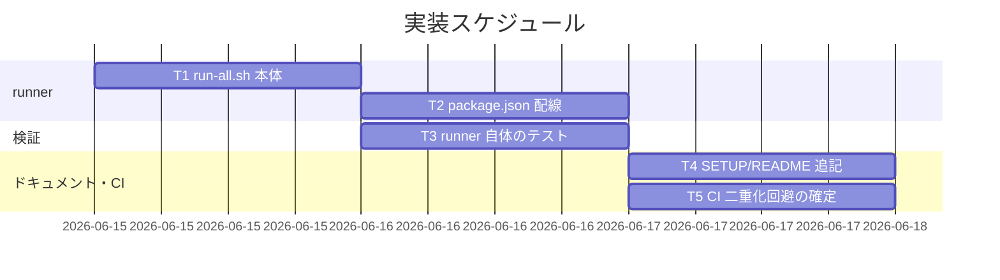

# 実装計画書: テスト実行基盤の整備（一括 runner と手順ドキュメント）

**プロジェクト名**: テスト実行基盤の整備（一括 runner と手順ドキュメント）  
**作成日**: 2026 年 06 月 15 日  
**最終更新**: 2026 年 06 月 15 日

> **重要**: **このドキュメントは常に更新**: 実装計画の変更、進捗状況の更新、バグの記録などがあった場合は、即座にこのドキュメントを更新してください。ドキュメントは「生きているドキュメント」として扱い、実装内容と常に同期させます。
> **必須項目**: 「必須」と明記した欄は空欄・抽象語のみで提出しないこと。テスト観点・BDD 仕様は具体ケースを 1 件以上記載すること。
>
> **用語**: [.agents/CONCEPTS.md §用語規約](../../../../../.agents/CONCEPTS.md#用語規約) を参照。

---

## 1. 実装概要

### 1.1 実装方針（必須）

既存 4 本のテストスクリプトを順に呼ぶ薄いラッパ `run-all.sh` を新設し（検証ロジックは再実装しない）、`npm test` に配線、手順ドキュメント（SETUP/README）と CI の二重化回避方針を整える。runner 自体の振る舞い（FAIL で非 0・SKIP 継続・個別実行維持）は擬似テストを tmp 隔離で実行して検証する。02\_設計の I/F 仕様（§5）に厳密に従う。

### 1.2 実装順序（必須: 1 件以上）

T1（runner 本体）→ T2（package.json 配線）→ T3（runner 自体のテスト）→ T4（ドキュメント）→ T5（CI 二重化回避の確定）。



---

## 2. タスク分解

**必須**: 各タスクには **「テスト観点」（2.x.3）** と **「単体テスト仕様（BDD）」（2.x.4）** を必ず記載すること。観点の定義は **02\_設計 §6** および **RULES のテスト戦略・[TEST_BDD_FORMAT.md](../../../../../.agents/TEST_BDD_FORMAT.md)** を参照。

### 2.1 タスク 1: 一括 runner `run-all.sh` の実装

#### 2.1.1 概要（必須）

既存 4 本を順に呼び、終了コードを 02\_設計 §5 の規約（0=PASS / 2=SKIP / その他=FAIL）で集約し、サマリ出力と全体終了コード（FAIL>0 で 1・それ以外で 0）を返す runner を `.agents/scripts/test/run-all.sh` に新設する。

#### 2.1.2 実装内容（必須: 1 件以上）

- `.agents/scripts/test/run-all.sh` を新規作成（`#!/usr/bin/env bash`、`set -uo pipefail`、実行権限付与）。
- テスト一覧を**順序付き配列 1 箇所**に列挙（テスト名・スクリプトパス・必須依存）。これが一覧の正本。
- 各要素について必須依存を `command -v` で事前確認。不足時は当該を実行せず `[SKIP] <name>: 必須依存 <tool> なし` を出力し継続。
- 依存ありの場合 `bash <script>` を `if`/`||` でラップ実行し終了コードを取得。`0`→PASS、`2`→SKIP、その他→FAIL（失敗名を配列に保持）。`set -e` 由来の即時終了を避ける。
- 末尾サマリ `合計=N PASS=p FAIL=f SKIP=s`（FAIL>0 のとき失敗名列挙）を出力。
- FAIL>0 なら `exit 1`、それ以外は `exit 0`。
- runner 自身は開発リポへ書き込まない（隔離は各スクリプト責務）。冒頭コメントにユースケース・使い方・前提・I/F（02 §5 参照）を記載。

#### 2.1.3 テスト観点（必須）

**参照**: 観点の定義は [02\_設計 §6](./02_設計.md) および [RULES のテスト戦略・TEST_BDD_FORMAT](../../../../../.agents/RULES.md#テスト戦略必須要件) を参照。以下には**本タスクの具体ケース**のみ記載する。

##### 単体（本タスクの具体ケース・必須 1 件以上）

- 正常系: 一覧の全 stub が exit 0 のとき、サマリに `FAIL=0` が出力され runner は exit 0 を返す。
- 異常系: 一覧中の 1 つが exit 1（FAIL）のとき、サマリに当該名が FAIL として現れ runner は exit 1 を返す（途中で止まらず後続も実行される）。
- 境界値: stub が exit 2（必須依存欠如）のとき SKIP に分類され、SKIP は FAIL に数えられず runner は exit 0 を返す。

##### 結合/API（本タスクの具体ケース・該当時は必須 1 件以上）

- 実際の 4 本を呼ぶ統合実行で、依存が揃った環境では FAIL=0・exit 0 となり、各テスト名が PASS として一覧表示される。

##### E2E/受け入れ（本タスクの具体ケース・未達時は理由記載）

- SC-1/SC-2/SC-3 に対応。実スクリプト 4 本を通した一括実行は T3 の統合シナリオで担保（runner 単体は stub で高速検証）。

##### バリデーション（該当する場合の具体ケース）

- 終了コード分類（0/2/その他）の境界が SKIP/PASS/FAIL に正しく対応すること。

#### 2.1.4 単体テスト仕様（BDD）（必須）

```gherkin
Feature: run-all.sh の終了コード集約
  Scenario: 1 件でも FAIL なら非 0 で終了
    Given 成功(exit 0)・失敗(exit 1)・SKIP(exit 2)を返す擬似テストを tmp 隔離で並べる
    When run-all.sh 相当のループでそれらを実行する
    Then サマリに FAIL=1 と失敗テスト名が表示され
    And runner の終了コードは 1（非 0）である
```

**テストコード例（必須: インラインコメントで Given/When/Then を明記）**

```bash
# Given: 成功/失敗/exit2 を返す stub を tmp に作り、テスト一覧をその stub に差し替える
# When : run-all.sh の集約ロジックを stub 群に対して実行する
# Then : FAIL>0 のとき exit 1、SKIP は FAIL に数えず、全成功(+SKIP のみ)では exit 0 を返す
```

#### 2.1.5 依存関係

- なし（最初に着手）。

#### 2.1.6 見積もり

- **工数**: 2h
- **優先度**: 高

### 2.2 タスク 2: package.json `test` スクリプト配線

#### 2.2.1 概要（必須）

`npm test` で runner を起動できるよう `scripts.test` を追加する（既存 `build:claude`・`bin` は不変）。

#### 2.2.2 実装内容（必須: 1 件以上）

- `package.json` の `scripts` に `"test": "bash .agents/scripts/test/run-all.sh"` を追加。
- 既存 `build:claude`・`bin.agents-md`・`files` を変更しない。

#### 2.2.3 テスト観点（必須）

##### 単体（本タスクの具体ケース・必須 1 件以上）

- `npm test` 実行時に runner が起動し、runner の終了コードが `npm` の終了コードへ伝播する（FAIL→非 0、成功→0）。

##### 結合/API（本タスクの具体ケース・該当時は必須 1 件以上）

- `package.json` の JSON が妥当（`node -e "require('./package.json')"` 相当でパース可能）で、`scripts.test` が存在する。

##### E2E/受け入れ（本タスクの具体ケース・未達時は理由記載）

- SC-1 の `npm test` 入口に対応。実 `npm test` 実行は依存が揃った環境で確認（CI/ローカル）。

##### バリデーション（該当する場合の具体ケース）

- 該当なし（設定追加のみ）。

#### 2.2.4 単体テスト仕様（BDD）（必須）

```gherkin
Feature: npm test 配線
  Scenario: npm test が runner を起動する
    Given package.json に scripts.test=bash .agents/scripts/test/run-all.sh がある
    When npm test を実行する
    Then run-all.sh が起動し、その終了コードが npm の終了コードに伝播する
```

```bash
# Given: package.json に scripts.test を配線した状態
# When : npm test を実行する
# Then : run-all.sh が起動し、runner の exit code が npm の exit code として返る
```

#### 2.2.5 依存関係

- T1（runner 本体）に依存。

#### 2.2.6 見積もり

- **工数**: 0.5h
- **優先度**: 高

### 2.3 タスク 3: runner 自体のテスト（失敗時非 0・SKIP 継続・個別実行維持）

#### 2.3.1 概要（必須）

runner の振る舞い（FAIL で非 0・SKIP で継続し非 0 にしない・必須依存欠如でクラッシュしない・個別実行が壊れない）を tmp 隔離の擬似テストと実 4 本の統合実行で検証する。

#### 2.3.2 実装内容（必須: 1 件以上）

- runner 検証スクリプト（例: `.agents/scripts/test/test-run-all.sh`）を新設、または runner にテスト容易性（テスト一覧を環境変数で差し替え可能にする等）を持たせ stub 検証する。**いずれの方式でも tmp 隔離**で行い本番 DB・開発リポを触らない。
- 擬似テスト stub（exit 0 / 1 / 2 を返す小スクリプト）を `mktemp -d` 配下に生成し、集約・終了コード・SKIP 表示・継続性を検証。
- 必須依存欠如シナリオ: PATH から依存を除いた環境（または依存欠如マーク）で SKIP 案内・非クラッシュ・残り継続を検証。
- 個別実行維持: 既存 4 本を直接 `bash <name>.sh` で起動でき、呼び出し方・終了コードが runner 導入前と変わらないことを回帰確認。
- 各テストは TEST_BDD_FORMAT に従い `ユースケース:`/`シナリオ:`/`# Given:`/`# When:`/`# Then:` を記載。

#### 2.3.3 テスト観点（必須）

##### 単体（本タスクの具体ケース・必須 1 件以上）

- stub が `0,0,0` → exit 0・FAIL=0。
- stub が `0,1,0` → exit 1・FAIL=1・失敗名表示・3 件すべて実行（継続性）。
- stub が `0,2,0` → exit 0・SKIP=1・FAIL=0（SKIP を失敗扱いしない／SC-6）。

##### 結合/API（本タスクの具体ケース・該当時は必須 1 件以上）

- 依存が揃った環境で実 4 本を runner で通し FAIL=0・exit 0。

##### E2E/受け入れ（本タスクの具体ケース・未達時は理由記載）

- SC-2（わざと失敗で非 0）・SC-3（全成功で 0）・SC-4（個別実行維持）・SC-6（任意依存欠如で SKIP 継続）に対応。

##### バリデーション（該当する場合の具体ケース）

- SKIP 出力が `[SKIP] <name>: ...` 形式であること。サマリが `合計/PASS/FAIL/SKIP` を含むこと。

#### 2.3.4 単体テスト仕様（BDD）（必須）

```gherkin
Feature: runner の SKIP 継続と非破壊
  Scenario: 必須依存が無いテストを SKIP し残りを実行する
    Given 必須依存(sqlite3)が無い擬似環境で run-all.sh を実行する
    When sqlite3 を要するテストの順番が来る
    Then 当該テストは [SKIP] として案内され
    And runner はクラッシュせず残りのテストを実行し
    And 開発リポの .workflow/workflow.db は変更されない
```

```bash
# Given: PATH から sqlite3 を除いた擬似環境と tmp 隔離の stub 一覧
# When : run-all.sh を実行する
# Then : 当該テストは SKIP 案内・runner 継続・exit は FAIL に依存（SKIP 単独なら 0）・本番 DB の mtime/行数が不変
```

#### 2.3.5 依存関係

- T1 に依存（T2 と並行可）。

#### 2.3.6 見積もり

- **工数**: 2h
- **優先度**: 高

### 2.4 タスク 4: 手順ドキュメント（SETUP.md / README）の追記

#### 2.4.1 概要（必須）

`.agents/SETUP.md` に「テスト実行」節を追加し、一括実行・個別実行・前提依存マトリクス・SKIP 規約を記載。README の動作確認から参照を張る。

#### 2.4.2 実装内容（必須: 1 件以上）

- SETUP.md: 一括（`npm test` / `bash .agents/scripts/test/run-all.sh`）・個別（各 `bash .agents/scripts/test/<name>.sh`）・依存マトリクス（bash/git/node/tar/sqlite3 とテストの対応）・SKIP/終了コード規約（02 §5）を記載。記載は実体と一致させる。
- README: 「動作確認」節からテスト実行手順（SETUP の該当節）への参照を追加。
- 配布物リーク検査に影響しないこと（追記は既存ファイルへの編集で新規配布物を生まない）。

#### 2.4.3 テスト観点（必須）

##### 単体（本タスクの具体ケース・必須 1 件以上）

- SETUP.md に一括・個別・依存マトリクス・SKIP 規約の 4 要素がすべて記載されている（grep で存在確認）。

##### 結合/API（本タスクの具体ケース・該当時は必須 1 件以上）

- 記載コマンド（runner パス・各スクリプトパス）が実体と一致する（パスが実在する）。

##### E2E/受け入れ（本タスクの具体ケース・未達時は理由記載）

- SC-5 に対応。verify-and-close の監査で実体一致を確認。

##### バリデーション（該当する場合の具体ケース）

- 該当なし（文書）。

#### 2.4.4 単体テスト仕様（BDD）（必須）

```gherkin
Feature: テスト手順のドキュメント化
  Scenario: SETUP に一括・個別・依存・SKIP が記載される
    Given SETUP.md にテスト実行節を追記した
    When 新規開発者が SETUP.md を読む
    Then 一括実行・個別実行・前提依存(bash/git/node/tar/sqlite3)・SKIP 規約が分かる
```

```bash
# Given: SETUP.md にテスト実行節を追記
# When : grep で 4 要素(一括/個別/依存/SKIP)と記載パスを照合する
# Then : 4 要素が存在し、記載されたスクリプトパスが実在する
```

#### 2.4.5 依存関係

- T1・T2 に依存（記載内容が runner の I/F・パスに整合する必要があるため）。

#### 2.4.6 見積もり

- **工数**: 1h
- **優先度**: 中

### 2.5 タスク 5: CI とのロジック二重化回避の確定（self-enforce.yml）

#### 2.5.1 概要（必須）

02\_設計 §3.3 の方針 A/B のいずれかを採否決定し、self-enforce.yml がテスト本体ロジックを二重実装しないことを確定（方針と整合のコメント／step を整える）。

#### 2.5.2 実装内容（必須: 1 件以上）

- 既定は方針 A（CI の現行 step を維持し、E2E は `e2e-install-uninstall.sh` を単一正本として runner と CI の双方が同じスクリプトを呼ぶ）。本 issue では新たなロジック重複を生まないことを確認し、必要なら CI コメントに「runner（run-all.sh）と CI はスクリプトを単一正本として呼ぶ」旨を明記。
- 方針 B を採る場合は、CI に `run-all.sh` を呼ぶ step を追加すると同時に既存 E2E step を runner に吸収し二重実行を避ける（採否を 03 のこの欄に記録）。
- いずれの場合も schema/pack/version/audit の各 step（テストスクリプトと別系統）は runner に取り込まない（重複しない）。

#### 2.5.3 テスト観点（必須）

##### 単体（本タスクの具体ケース・必須 1 件以上）

- self-enforce.yml に、同一テスト本体ロジックを runner と CI が**別実装で**持つ箇所が無い（CI は `bash <script>` を呼ぶだけ）ことをレビューで確認。

##### 結合/API（本タスクの具体ケース・該当時は必須 1 件以上）

- 方針 B 採用時: `run-all.sh` を呼ぶ step 追加後、E2E が二重実行されない（E2E step と runner step が同じ e2e を 2 回走らせない）こと。

##### E2E/受け入れ（本タスクの具体ケース・未達時は理由記載）

- CI が green になることは PR の self-enforce 実行で確認（ローカルでは yaml 構文チェックに留める）。

##### バリデーション（該当する場合の具体ケース）

- yaml がパース可能（構文妥当）。

#### 2.5.4 単体テスト仕様（BDD）（必須）

```gherkin
Feature: CI とのロジック二重化回避
  Scenario: CI と runner が同じスクリプトを単一正本として呼ぶ
    Given self-enforce.yml と run-all.sh が存在する
    When 両者のテスト呼び出しを確認する
    Then どちらも検証ロジックを再実装せず bash <script> を呼ぶだけで
    And 同一テスト本体の別実装が存在しない
```

```bash
# Given: self-enforce.yml と run-all.sh
# When : 両者がテスト本体を「呼ぶ」か「再実装する」かを確認する
# Then : いずれもスクリプトを呼ぶだけ（単一正本）であり、二重実装が無い
```

#### 2.5.5 依存関係

- T1 に依存。T3（runner 検証）と整合させる。

#### 2.5.6 見積もり

- **工数**: 1h
- **優先度**: 中

---

## テスト観点

runner 自体の 3 大観点を最優先で担保する: (1) **失敗時に非 0**（FAIL>0→exit 1）、(2) **SKIP で継続・非 0 にしない**（必須依存欠如→当該 SKIP・残り実行・SKIP は FAIL に数えない）、(3) **個別実行維持**（既存 4 本の呼び出し方・終了コード不変）。加えて npm test 配線・ドキュメント実体一致・CI 二重化回避を確認する。全検証は tmp 隔離で行い本番 DB・開発リポを破壊しない。

---

## 単体テスト

runner の集約ロジックは exit 0/1/2 を返す stub を tmp 隔離で並べて検証する（高速・決定的）。実 4 本を通す統合は依存が揃った環境で行い、SKIP 系統は依存を除いた擬似環境で確認する。各テストは TEST_BDD_FORMAT のインラインコメント規約に従う。

---

## BDD

各タスク §2.x.4 の Gherkin を正本とする。主要シナリオ: 全成功で exit 0／1 件 FAIL で exit 1・継続／exit2 を SKIP として非 0 にしない・継続／sqlite3 欠如環境で SKIP 案内・本番 DB 不変／個別実行が runner 導入前と不変。Given/When/Then は [TEST_BDD_FORMAT.md](../../../../../.agents/TEST_BDD_FORMAT.md) に従う。

---

## 3. 実装スケジュール

### 3.1 マイルストーン

| マイルストーン | 期日 | 成果物 |
| -------------- | ---- | ------ |
| runner 完成 | T1/T2 完了時 | `run-all.sh`・`npm test` 配線 |
| 検証完成 | T3 完了時 | runner 自体のテスト（PASS） |
| 文書・CI 整合 | T4/T5 完了時 | SETUP/README 追記・CI 二重化回避確定 |

### 3.2 実装フェーズ

#### フェーズ 1: runner と配線

- **タスク**: T1, T2

#### フェーズ 2: 検証・文書・CI

- **タスク**: T3, T4, T5

---

## 4. テスト計画

テスト観点・レベル・BDD 形式の定義は **02\_設計 §6** および **RULES のテスト戦略・TEST_BDD_FORMAT** を参照。各タスクの §2.x.3／§2.x.4 にタスク別の具体ケースと BDD を記載済み。

### 4.1 テストの優先順位

- クリティカル（runner の終了コード集約・SKIP 継続）は厚くテスト。
- 影響範囲が広い「個別実行維持」は回帰として必ず含める。

---

## 5. リスク管理

### 5.1 実装リスク

- **リスク**: `set -e`/`pipefail` で個別テストの非 0 終了により runner が途中終了し、後続が実行されず集約が壊れる。
  - **対策**: 個別呼び出しを `if`/`||` でラップし、終了コードを明示取得してから分類する。
- **リスク**: runner が隔離を経ずテストを呼び開発リポを破壊する。
  - **対策**: runner は隔離ロジックを持たず各スクリプトを呼ぶだけ。runner 自体は開発リポへ書き込まない。T3 で本番 DB の不変を検証。
- **リスク**: CI と runner で検証ロジックが二重化しズレる。
  - **対策**: 両者とも `bash <script>` を呼ぶだけ（単一正本）。T5 で確認。
- **リスク**: ドキュメント記載と実体（パス・依存）がズレる。
  - **対策**: SC-5・verify-and-close 監査で実体一致を確認。記載パスの実在を T4 で照合。

---

## 6. 参考資料

### プロジェクトドキュメント

- [`02_設計.md`](./02_設計.md) - 設計

### その他の参考資料

- `.agents/scripts/test/`（既存 4 本）、`.github/workflows/self-enforce.yml`、`package.json`、`.agents/SETUP.md`、`README.md`
- [.agents/TEST_BDD_FORMAT.md](../../../../../.agents/TEST_BDD_FORMAT.md)、[.agents/RULES.md](../../../../../.agents/RULES.md) §テスト戦略・§テスト隔離

---

## 7. 前のステップ

この実装計画書は、以下のドキュメントを基に作成されています：

- **前**: [`02_設計.md`](./02_設計.md) - 設計フェーズ

---

## 8. 次のステップ

この実装計画書の承認後、以下のいずれかのステップに進みます：

- **プロジェクトが 1 つの issue（タスク）である場合**: 実装フェーズ（execution）に直接進む。

**用語**: [.agents/CONCEPTS.md §用語規約](../../../../../.agents/CONCEPTS.md#用語規約) を参照。
