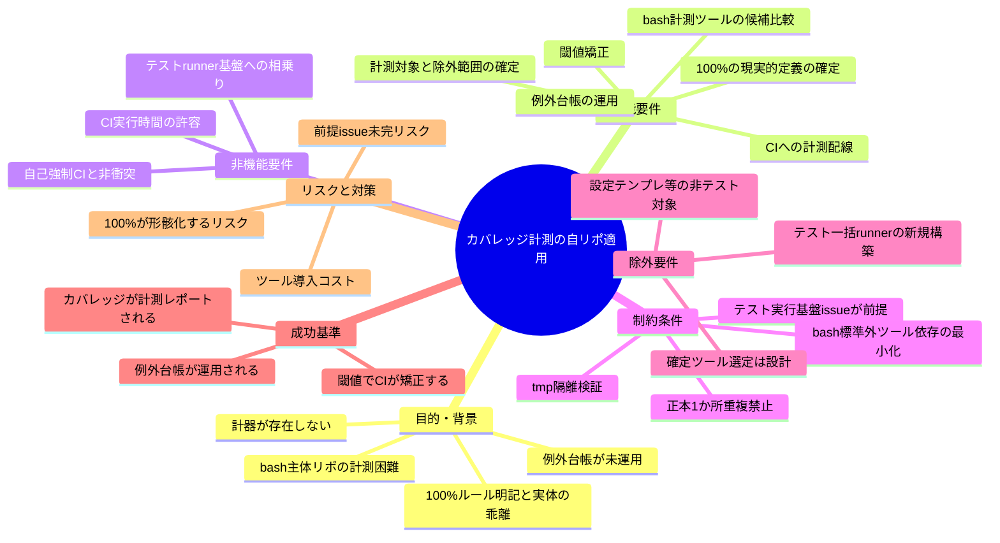
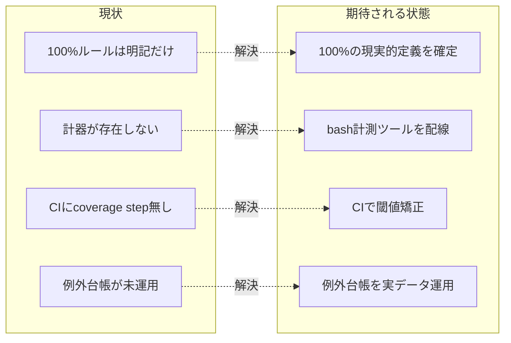

# 要求定義書: カバレッジ計測の自リポ適用（100%目標の実効化）

**プロジェクト名**: カバレッジ計測の自リポ適用（100%目標の実効化）
**作成日**: 2026 年 06 月 15 日
**最終更新**: 2026 年 06 月 15 日

> **重要**:
>
> - 要求定義書は、プロジェクトの全体像を把握するためのものです。詳細な技術仕様や実装方法は要件定義書以降で記載します。必要最低限の情報に収めることを心掛けてください。
> - **このドキュメントは常に更新**: 要求の変更や追加があった場合は、即座にこのドキュメントを更新してください。ドキュメントは「生きているドキュメント」として扱い、実装内容と常に同期させます。
> - **必須項目**: 以下の「必須」と明記した項目は空欄・抽象語のみ（例: 「{説明}」のまま）で提出しないこと。判定可能な形（目的は1文・成功基準は○/×で判定できる記載等）で記入すること。
>
> **用語**: [.agents/CONCEPTS.md §用語規約](../../../../../.agents/CONCEPTS.md#用語規約) を参照。

---

## 要求定義の全体像

**注意**:

- 上記の「プロジェクト名」は例です。実際のプロジェクト名に置き換えてください。
- マインドマップは全体像を把握するためのものです。主要なセクション名程度に留め、詳細は記載しないでください。

---

## 1. 目的・背景

### 1.1 目的（必須）

本リポに実カバレッジ計測を CI 配線し、100% 目標を閾値で実効化する。

### 1.2 背景

- **現状の課題**:
  - `.agents/COVERAGE_AND_EXCEPTIONS.md`（[file:line で確認](../../../../../.agents/COVERAGE_AND_EXCEPTIONS.md)）は **「デフォルト 100%」「CI の閾値（例: `--fail-under=100`）は下げない」「不足はテスト追加か例外登録の二択」**（同 §1, L13-16）を**配布物の正本**として宣言している。`.agents/RULES.md`（L29-31, §テスト戦略）も BDD 単体テスト・テストファースト・TEST_BDD_FORMAT 準拠を要求し、`.agents/workflow/PHASES.md`（§監査観点 L92-93）も「テストが含まれる場合はレビュー時に再実行」を要求する。
  - しかし**本リポ自身にはカバレッジ計測の仕組みが存在しない**。テストは `.agents/scripts/test/` 配下の **bash 結合テスト 4 本**（`e2e-install-uninstall.sh` / `test-audit.sh` / `test-pretooluse-hook.sh` / `test-write-workflow-log-prevhash.sh`）のみで、**計器（coverage instrument）が無い**。`.github/workflows/self-enforce.yml`（7 step）にも **coverage step が存在しない**（構文チェック・schema・差分ゼロ・npm pack・version 同期・install/uninstall E2E・audit のみ）。
  - 例外台帳（`docs/COVERAGE_EXCEPTIONS.md` または `.agents-project/COVERAGE_EXCEPTIONS.md`）も**実データが未運用**（コピー先ファイルが存在しない）。
  - 結果として、**フレームワークが採用先プロジェクトに課す 100% ルールを、フレームワーク自身（自リポ）には適用できていない**乖離が生じている（ドッグフーディングの破れ）。

- **必要性**:
  - 配布物が宣言するルールを自リポで満たせていないと、ルールの説得力・実効性が失われる（「医者の不養生」状態）。自リポで実際に動く計測・矯正・台帳運用の**実例**を持つことが、ルールの正本性を担保する。
  - 本リポの主要コードは **bash スクリプト**であり、`COVERAGE_AND_EXCEPTIONS.md` の言語別表（Python/Node/Go/PHP）には **bash の計測手段が無い**。bash 主体リポで現実的に計測する手段（kcov / bashcov 等）と「100% の現実的な定義・適用範囲」を確定する必要がある。

### 1.3 期待される効果（必須: 1 件以上）

- **効果 1**: 本リポの bash スクリプトに対し**実カバレッジが計測・レポートされる**ようになる（○/×: CI 実行時にカバレッジレポート成果物が生成されるか）。
- **効果 2**: カバレッジが既定閾値を下回ると **CI が矯正（fail）する**（○/×: 閾値未達のとき self-enforce 相当の CI ジョブが赤くなるか）。
- **効果 3**: 計測対象外とする箇所が**例外台帳で説明責任付きで管理される**（○/×: 例外台帳ファイルが実データで存在し、ツール上の除外と一致するか）。
- **効果 4**: 配布物の 100% ルール（COVERAGE_AND_EXCEPTIONS.md）が自リポで適用された**ドッグフーディングの実例**が成立する（○/×: 同ファイルの方針と自リポ CI の実装が整合していると 01/02 で対応付けられているか）。

**現状と期待される状態の比較**（必要に応じて）:

---

## 2. 機能要件

### 2.1 既存機能の維持（該当する場合）

- 既存の `self-enforce.yml`（7 step: 構文チェック・schema・差分ゼロ・npm pack・version 同期・install/uninstall E2E・audit non-blocking）の挙動を維持する。カバレッジ配線はこれらを壊さずに**追加**する。
- 既存の bash 結合テスト 4 本（`.agents/scripts/test/`）を維持する。これらをカバレッジ計測の駆動元として活用する。
- 配布物正本 `COVERAGE_AND_EXCEPTIONS.md` の方針（100% 目標・除外の二重化・例外台帳の列定義）を変更しない。本 issue は**自リポへの適用**であって正本方針の改変ではない。

### 2.2 新規機能要件

詳細な受け入れ基準・スコープは 01_要件定義.md に整理する。本 00 では**候補の比較と推奨**まで（確定は 02_設計）を扱う。

- **(a) bash カバレッジ計測手段の候補比較と推奨**
  - 候補を比較し、各々の利点・欠点・本リポ適合性を一覧化したうえで**推奨**を示す（確定は設計）。主な候補:
    - **kcov**: デバッグ情報ベースで bash を計測。バイナリ導入（apt 等）が必要だが**スクリプト無改変**で動き、cobertura/HTML レポートを出力できる。CI（ubuntu-latest）で apt 導入可能。
    - **bashcov（+ simplecov）**: Ruby 製。`bashcov -- <cmd>` で駆動。Ruby ランタイム依存が増えるが SimpleCov の閾値・除外機構を流用できる。
    - **bash 組み込み（`set -x` トレース / `BASH_XTRACEFD` ＋ `$LINENO` 集計）**: 追加ツール不要だが**自前集計の実装コストと精度の問題**が大きい。原則非推奨だが比較対象として記載。
  - **推奨（00 時点の暫定）**: ubuntu-latest で apt 導入でき、対象スクリプトを**無改変**で計測できる **kcov** を第一候補とする。Ruby 依存を許容できるなら bashcov も可。最終確定は 02_設計 で行う。
- **(b) 「100% の現実的な定義・適用範囲」の確定**
  - `COVERAGE_AND_EXCEPTIONS.md` §「100%」の推奨定義（採用 PJ が CI で宣言した自動テストジョブの結果を公式手順でマージし、マージ後レポートに `--fail-under=100` を掛ける）を**本リポに具体化**する。
  - **計測対象**: 本リポの**実行されるロジックを持つ bash スクリプト**（`.agents/scripts/*.sh` の本体、PreToolUse hook 等）。
  - **計測対象外（除外候補）**: テスト駆動の対象にならない**設定・テンプレート・生成物・データ**（例: `.workflow/templates/`、`.agents/ledger/schema.sql`、`.adapters/` 等の生成物、`*.md`/`*.json`/`*.yml` の非実行ファイル）。これらは「機械生成・到達不能・外部依存」のいずれかに整理して**例外台帳または計測ソース指定（source/omit）で除外**する。
  - **bash の行単位無視手段の確定**: COVERAGE_AND_EXCEPTIONS.md の言語別表に bash 行が無いため、採用ツールに応じた**bash 用の除外手段（ソース指定 / パターン / 後処理）**を 01/02 で具体化する（Go の「行単位無視が無い」制約と同種の整理）。
- **(c) CI へのカバレッジ計測配線**
  - `self-enforce.yml` に**カバレッジ計測 step を追加**する（またはテスト一括 runner 経由で計測する。下記前提を参照）。計測対象スクリプトを bash 結合テストで駆動し、レポートを生成する。
- **(d) 閾値による矯正**
  - マージ後レポートに対し `--fail-under`（既定は 100。**現実的な初期値の扱いは 01/02 で確定**）相当の閾値判定を行い、未達なら CI を fail させる。
- **(e) 例外台帳の運用**
  - `COVERAGE_AND_EXCEPTIONS.md` 第3章のテンプレート（必須列: ID/対象/カテゴリ/理由/代替保証/適用手段/承認/有効期限）を `.agents-project/COVERAGE_EXCEPTIONS.md`（本リポは自己拡張の消費者なので `.agents-project/` 側）にコピーし、**サンプル行を削除して実データを運用**する。ツール側の除外（source/omit/設定）と台帳を一致させる。

### 2.3 前提との関係（テスト実行基盤 issue への相乗り）

- 本 issue は、別 issue **「テスト実行基盤の整備（テスト一括 runner）」** に乗ることを前提に整理する。すなわち、bash 結合テストを**一括で駆動する runner** が用意される前提で、その runner 実行を**カバレッジ計測でラップ**する形を基本線とする。
- 前提 issue が未完の場合の代替（暫定的に self-enforce.yml で個別テストを計測駆動する）も 01 のシナリオで触れるが、**正式な配線は runner 相乗りを第一とする**。

---

## 3. 非機能要件

### 3.1 パフォーマンス

- カバレッジ計測の追加により CI 実行時間が過度に増えないこと（kcov 等の計測オーバーヘッドは許容範囲に収める。具体目標は 02 で設定）。

### 3.2 セキュリティ

- 計測ツールの導入は CI（ubuntu-latest）の apt / パッケージマネージャ経由に限定し、外部スクリプトの無検証実行を避ける。高リスク操作（外部書き込み等）は発生させない。

### 3.3 互換性

- 既存 self-enforce.yml の 7 step・既存テスト 4 本・配布物正本 COVERAGE_AND_EXCEPTIONS.md と衝突しないこと。
- 計測ツールが追加するファイル（レポート・中間生成物）は生成物として `.gitignore` 対象とし、「生成物の差分ゼロ検証」step（self-enforce.yml #3）を破らないこと。

### 3.4 保守性

- 計測・閾値・除外の定義を**正本1か所**に集約（CORE.md の重複禁止）。検証ロジックは CI とローカルで二重化せず、既存方針（`verify-npm-pack.sh` 等のようにスクリプトへ集約）に倣う。
- 例外台帳とツール除外を一致させ、片方だけの除外（A だけ・B だけ）を禁止（COVERAGE_AND_EXCEPTIONS.md §1）。

---

## 4. 制約条件

### 4.1 技術的制約

- **本リポの主要コードは bash** であり、COVERAGE_AND_EXCEPTIONS.md の言語別表（Python/Node/Go/PHP）に bash 計測手段が無い。bash 計測は標準外ツール（kcov/bashcov 等）に依存するため、**ツール依存の最小化と CI での導入可否**が制約になる。
- **`--fail-under=100`（デフォルト 100%）を下げない**のが配布物正本の方針。本 issue でも閾値を恒久的に下げることは避け、不足は**テスト追加**か**例外登録**の二択で扱う（COVERAGE_AND_EXCEPTIONS.md §1）。初期導入の現実的な扱い（段階導入の可否）は 01/02 で判断するが、**閾値を緩める運用を正当化しない**。
- **CORE.md「正本1か所・重複禁止」**を厳守する。閾値・除外定義・台帳を複数箇所に重複させない。

### 4.2 既存システムとの互換性

- 別 issue「テスト実行基盤の整備（テスト一括 runner）」を**前提**とし、その runner 実行をカバレッジでラップする形を基本とする（§2.3）。前提 issue の成果物 I/F に合わせる。
- 生成物（カバレッジレポート等）は `.gitignore` 済みとし、self-enforce.yml #3「生成物の差分ゼロ検証」と #4「npm pack リーク検査」を破らないこと（配布 tarball にレポートを漏らさない）。

### 4.3 移行期間・スケジュール

- 推奨着手順序: (1) テスト実行基盤 runner（前提・別 issue）→ (2) 本 issue: 計測ツール確定（02）→ (3) CI 配線＋閾値矯正→ (4) 例外台帳の実データ運用開始。

---

## 5. 除外要件

- **テスト一括 runner の新規構築**そのもの。これは別 issue「テスト実行基盤の整備」の責務であり、本 issue はその runner に**相乗り**するだけで、runner を作らない。
- **計測ツールの最終確定**は 02_設計 の責務。00/01 では候補比較と推奨にとどめる。
- **設定・テンプレート・生成物・非実行データ**（`.workflow/templates/`・`schema.sql`・`.adapters/` 生成物・`*.md`/`*.json`/`*.yml`）を 100% 計測の分母に含めること。これらは計測対象外（除外）とする。
- **配布物正本 `COVERAGE_AND_EXCEPTIONS.md` の方針改変**（言語別表の bash 追記は「自リポ適用の派生記載」として 01/02 で検討するが、100% 方針・例外二重化・台帳列定義といった根幹方針は変更しない）。
- **採用先プロジェクト向けの一般的な bash 計測ガイドの整備**（汎用ドキュメント化は本 issue 対象外。必要なら別 issue）。

---

## 6. 成功基準（必須: 1 件以上）

- **SC-1（計測）**: 本リポの bash スクリプトに対しカバレッジが**計測・レポート**され、CI 実行時にレポート成果物が生成される（○/×）。
- **SC-2（矯正）**: カバレッジが既定閾値を下回ると**CI が fail** する（閾値判定が配線され、未達で赤くなることをテストで確認）（○/×）。
- **SC-3（台帳）**: 例外台帳（`.agents-project/COVERAGE_EXCEPTIONS.md` 等）が **COVERAGE_AND_EXCEPTIONS.md 第3章の必須列**でサンプル行を削除した実データとして存在し、**ツール側除外と一致**している（○/×）。
- **SC-4（候補比較）**: bash カバレッジ計測手段の**候補比較（kcov / bashcov / 組み込みトレース等）と推奨**が 00/01 に判定可能な形で記載されている（○/×）。
- **SC-5（100% の定義）**: 「100% の現実的な定義・適用範囲（計測対象＝実行ロジックを持つ bash スクリプト／非テスト対象の除外）」が 00/01 に明記されている（○/×）。
- **SC-6（前提整合）**: テスト実行基盤 runner への相乗りを前提とした配線方針が 00/01 に明記され、前提 issue の I/F と整合する形で記載されている（○/×）。
- **SC-7（ドッグフーディング整合）**: 自リポ CI 実装が配布物正本 COVERAGE_AND_EXCEPTIONS.md の方針と整合していると 01/02 で対応付けられている（○/×）。

---

## 7. リスクと対策

### 7.1 技術的リスク

- **リスク**: bash 計測ツール（kcov 等）の CI 導入が不安定／オーバーヘッドが大きい。
  - **対策**: ubuntu-latest で apt 導入できる kcov を第一候補とし、02 で導入コスト・実行時間を実測して確定する。導入困難なら bashcov を代替候補とする。
- **リスク**: 100% が形骸化する（とりあえず広域 ignore で矯正が骨抜きになる）。
  - **対策**: COVERAGE_AND_EXCEPTIONS.md §1.1 の禁止パターンを遵守し、除外は**台帳＋ツール除外の二重化**でのみ認める。残り計測対象に 100% を強制する。
- **リスク**: 計測の中間生成物・レポートが配布 tarball に漏れる／追跡差分を生む。
  - **対策**: 生成物を `.gitignore` 化し、self-enforce.yml #3（差分ゼロ）・#4（npm pack リーク）で守られることを確認する。

### 7.2 スケジュールリスク

- **リスク**: 前提の「テスト実行基盤（runner）」issue が未完のまま本 issue を進めると、配線先 I/F が定まらず手戻りする。
  - **対策**: runner 相乗りを前提（§2.3・§4.2）とし、前提 issue の I/F 確定後に CI 配線を行う。暫定で個別テスト計測を行う場合も runner 移行を前提に最小実装にとどめる。

---

## 8. 参考資料

### プロジェクトドキュメント

- 既存プロジェクトの場合は、`00_システム理解.md` - システム理解を参照

### その他の参考資料

- 配布物正本: [`.agents/COVERAGE_AND_EXCEPTIONS.md`](../../../../../.agents/COVERAGE_AND_EXCEPTIONS.md)（§1 100% 方針・§1.1 禁止パターン・§2 例外認定基準・§3 例外台帳必須列・§4 言語別除外手段・§5 言語別ツール）
- [`.agents/RULES.md`](../../../../../.agents/RULES.md) §テスト戦略（L29-44）、[`.agents/workflow/PHASES.md`](../../../../../.agents/workflow/PHASES.md) §監査観点（L82-93）
- [`.github/workflows/self-enforce.yml`](../../../../../.github/workflows/self-enforce.yml)（7 step。coverage step が不在であることの根拠）
- 既存テスト: `.agents/scripts/test/`（`e2e-install-uninstall.sh` / `test-audit.sh` / `test-pretooluse-hook.sh` / `test-write-workflow-log-prevhash.sh`）
- 前提 issue: 別 issue「テスト実行基盤の整備（テスト一括 runner）」
- bash 計測候補: kcov（デバッグ情報ベース・スクリプト無改変）、bashcov + SimpleCov（Ruby 製）、bash 組み込みトレース集計（非推奨）

---

## 9. 次のステップ

この要求定義書の承認後、以下のドキュメントを作成します：

- **次**: [`01_要件定義.md`](./01_要件定義.md) - 要件定義フェーズ
