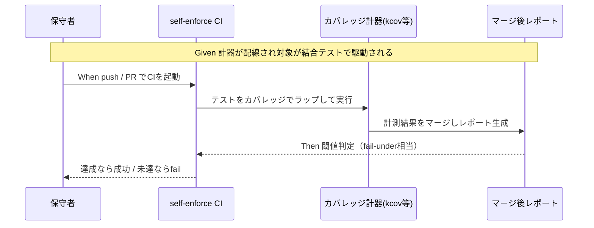

# 要件定義書: カバレッジ計測の自リポ適用（100%目標の実効化）

**プロジェクト名**: カバレッジ計測の自リポ適用（100%目標の実効化）
**作成日**: 2026 年 06 月 15 日
**最終更新**: 2026 年 06 月 15 日

> **重要**: **このドキュメントは常に更新**: 要件の変更や追加があった場合は、即座にこのドキュメントを更新してください。ドキュメントは「生きているドキュメント」として扱い、実装内容と常に同期させます。
>
> **用語**: [.agents/CONCEPTS.md §用語規約](../../../../../.agents/CONCEPTS.md#用語規約) を参照。

---

## 1. 概要

### 1.1 システム概要

本リポジトリ（AGENTS.md フレームワーク）は、採用先プロジェクトに対し「カバレッジ 100% を目標に CI で矯正する」運用（[`.agents/COVERAGE_AND_EXCEPTIONS.md`](../../../../../.agents/COVERAGE_AND_EXCEPTIONS.md) が正本）を課している。一方、本リポ自身（主要コードは bash スクリプト）には**実カバレッジ計測の仕組みが無く**、テストは bash 結合テスト 4 本のみ、`self-enforce.yml` に coverage step が無く、例外台帳も未運用である。本 issue は、bash 主体の本リポに現実的なカバレッジ計測（kcov / bashcov 等の候補比較）を CI 配線し、`--fail-under` 閾値で矯正し、例外を台帳で管理することで、**フレームワークが自らに課す 100% ルールを自リポに適用（ドッグフーディング）**する。00/01 では**計測手段の候補比較・推奨**と**「100% の現実的な定義・適用範囲」**を確定し、ツールの最終確定は 02_設計 に委ねる。本 issue は別 issue「テスト実行基盤の整備（テスト一括 runner）」に**相乗り**することを前提とする。

### 1.2 用語集

| 用語 | 説明 |
| ---- | ---- |
| カバレッジ計器（instrument） | テスト実行時に「どの行が実行されたか」を記録する仕組み。本リポには現状不在。 |
| kcov | デバッグ情報ベースで bash 等を計測するツール。スクリプト無改変で動き、cobertura/HTML を出力。 |
| bashcov | Ruby 製の bash カバレッジツール。SimpleCov の閾値・除外機構を流用できる。 |
| `--fail-under` | カバレッジ率が指定値未満なら CI を fail させる閾値オプション（coverage.py 等の用語。本リポでは同等の閾値判定を指す）。 |
| マージ後レポート | 複数テストジョブの計測結果を公式手順で統合した最終カバレッジレポート。閾値判定はこれに掛ける。 |
| 例外台帳（レジャー） | 計測対象から外す箇所を ID/対象/カテゴリ/理由/代替保証/適用手段/承認/有効期限の列で管理する表（COVERAGE_AND_EXCEPTIONS.md 第3章）。 |
| 計測対象 | 実行ロジックを持つ bash スクリプト（`.agents/scripts/*.sh` 本体・PreToolUse hook 等）。 |
| 計測対象外（除外） | テンプレ・schema・生成物・非実行データ（`.workflow/templates/`・`schema.sql`・`.adapters/`・`*.md`/`*.json`/`*.yml`）。 |
| テスト実行基盤 runner | bash 結合テストを一括駆動する別 issue の成果物。本 issue はこれをカバレッジでラップする。 |
| ドッグフーディング | フレームワークが自らに課すルールを自リポにも適用すること。 |

---

## 2. 機能要件

### 2.1 ユーザーストーリー

#### ストーリー 1: bash カバレッジ計測手段の候補比較と推奨

- **As a** 本リポの保守者
- **I want to** bash で現実的に動くカバレッジ計測手段（kcov / bashcov / 組み込みトレース）を比較し推奨を得たい
- **So that** ツール選定（02_設計）が一意に進められ、CI 導入可否・コストを見積もれる

**受け入れ基準**:

- kcov / bashcov / bash 組み込みトレースの**少なくとも 3 候補**について、利点・欠点・本リポ適合性（CI 導入可否・スクリプト改変要否・レポート形式）が一覧で記載されている。
- 暫定推奨（00 時点: kcov 第一候補）と、その理由（ubuntu-latest で apt 導入可・スクリプト無改変・cobertura/HTML 出力）が記載されている。
- 最終確定は 02_設計 に委ねる旨が明記されている。

#### ストーリー 2: 「100% の現実的な定義・適用範囲」の確定

- **As a** 本リポの保守者
- **I want to** 何を計測対象とし、何を非テスト対象として除外するかを確定したい
- **So that** 100% の分母が明確になり、形骸化（広域 ignore）を避けつつ実効的な閾値運用ができる

**受け入れ基準**:

- **計測対象**＝実行ロジックを持つ bash スクリプト（`.agents/scripts/*.sh` 本体・PreToolUse hook 等）と明記されている。
- **計測対象外**＝設定・テンプレート・生成物・非実行データ（`.workflow/templates/`・`.agents/ledger/schema.sql`・`.adapters/` 生成物・`*.md`/`*.json`/`*.yml`）と明記されている。
- 除外は COVERAGE_AND_EXCEPTIONS.md §2 の認定基準（機械生成・到達不能・本番非実行・外部依存＋代替テスト）のいずれに該当するかが整理されている。
- bash には行単位無視の公式手段が無い（Go と同種の制約）ため、採用ツールに応じた除外手段（ソース指定/パターン/後処理）を 02 で具体化する旨が明記されている。

#### ストーリー 3: CI へのカバレッジ計測の配線

- **As a** 本リポの保守者
- **I want to** テスト実行時にカバレッジを計測しレポートを生成する step を CI に持たせたい
- **So that** カバレッジが計測・可視化され、ドッグフーディングが成立する

**受け入れ基準**:

- `self-enforce.yml`（または相乗り先の runner 経由）でカバレッジが計測され、**レポート成果物が生成**される。
- 計測対象スクリプトが bash 結合テスト（既存 4 本）で駆動され、マージ後レポートが得られる。
- 計測生成物は `.gitignore` 対象で、self-enforce.yml #3「生成物の差分ゼロ検証」・#4「npm pack リーク検査」を破らない。

#### ストーリー 4: 閾値によるカバレッジ矯正

- **As a** 本リポの保守者
- **I want to** カバレッジがしきい値を下回ったら CI を fail させたい
- **So that** 不足が放置されず、テスト追加か例外登録のどちらかで矯正される

**受け入れ基準**:

- マージ後レポートに対し閾値判定（`--fail-under` 相当）が配線され、未達で CI が fail する。
- 閾値を恒久的に緩める運用を正当化していない（不足はテスト追加 or 例外登録の二択）。閾値の初期値・段階導入の可否は 02 で確定する。

#### ストーリー 5: 例外台帳の実データ運用

- **As a** 本リポの保守者
- **I want to** 計測対象外箇所を説明責任付きの台帳で管理したい
- **So that** 「A だけ・B だけ」の除外を防ぎ、除外の妥当性を後から監査できる

**受け入れ基準**:

- `.agents-project/COVERAGE_EXCEPTIONS.md`（本リポは自己拡張の消費者なので `.agents-project/` 側）が、COVERAGE_AND_EXCEPTIONS.md 第3章の**必須列**（ID/対象/カテゴリ/理由/代替保証/適用手段/承認/有効期限）で存在する。
- サンプル行（SAMPLE-001）が削除され、実データ行が記載されている。
- **台帳とツール側の除外（source/omit/設定）が一致**している（二重化の両方が存在する）。

#### ストーリー 6: テスト実行基盤 runner への相乗り（前提整合）

- **As a** 本リポの保守者
- **I want to** カバレッジ配線を、別 issue で整備されるテスト一括 runner に乗せたい
- **So that** テスト駆動とカバレッジ計測を二重管理せず、runner 実行をラップする単一の入口にできる

**受け入れ基準**:

- 配線の基本線が「runner 実行をカバレッジでラップする」形であると明記されている。
- 前提 issue（テスト実行基盤）の I/F に整合する形で記載され、前提未完時の暫定（個別テスト計測）も明記されている。
- 本 issue は runner そのものを新規構築しない（除外要件）。

### 2.2 BDD ユースケース

#### ユースケース 1: カバレッジ計測と閾値矯正

CI 上でテストを駆動し、カバレッジを計測してマージ後レポートを得て、閾値で矯正する一連の流れ。

**シナリオ 1: 計測対象が完全にテストされている場合（閾値達成）**

```gherkin
Feature: カバレッジ計測と閾値矯正
  Scenario: 計測対象スクリプトが閾値を満たす
    Given カバレッジ計器が CI に配線されている
    And 計測対象の bash スクリプトが結合テストで完全に駆動される
    When CI でテストを実行しマージ後カバレッジレポートを生成する
    Then カバレッジ率は閾値（既定100%、除外後の計測対象に対して）を満たす
    And CI のカバレッジジョブは成功する
```

**処理フロー**（必要に応じて）:



**シナリオ 2: 計測対象に未テスト行があり閾値未達の場合（矯正＝fail）**

```gherkin
Feature: カバレッジ計測と閾値矯正
  Scenario: 計測対象に未テスト行がある
    Given カバレッジ計器が CI に配線されている
    And 計測対象の bash スクリプトに結合テストで実行されない行がある
    And その行は例外台帳にもツール除外にも登録されていない
    When CI でテストを実行しマージ後カバレッジレポートを生成する
    Then カバレッジ率は閾値を下回る
    And CI のカバレッジジョブは fail する
```

#### ユースケース 2: 例外の二重化登録

計測対象外を、ツール除外と例外台帳の両方で登録する。

**シナリオ 1: 正しく二重化された除外**

```gherkin
Feature: 例外の二重化登録
  Scenario: 非テスト対象を台帳とツールの双方で除外する
    Given 除外したい対象が COVERAGE_AND_EXCEPTIONS.md §2 の認定基準に該当する
    When ツール側除外（source/omit/設定）と例外台帳の両方に同一対象を登録する
    Then カバレッジの分母から当該対象が外れる
    And 例外台帳に ID・対象・カテゴリ・理由・代替保証・適用手段・承認が記載される
    And ツール除外と台帳の対象が一致する
```

**シナリオ 2: 片方だけの除外は不可（禁止パターン検知）**

```gherkin
Feature: 例外の二重化登録
  Scenario: 台帳なしのツール除外のみ
    Given ツール側だけで除外が設定され例外台帳に対応行が無い
    When 除外の妥当性をレビュー/監査で確認する
    Then COVERAGE_AND_EXCEPTIONS.md §1「A だけ・B だけは不可」に反するため不採用とする
    And テスト追加か台帳登録のいずれかで是正する
```

#### ユースケース 3: 計測手段の候補比較

bash 計測手段を比較し推奨を決める。

**シナリオ 1: 候補比較から推奨を導出**

```gherkin
Feature: 計測手段の候補比較
  Scenario: kcov/bashcov/組み込みトレースを比較する
    Given 本リポの主要コードが bash スクリプトである
    When kcov・bashcov・bash組み込みトレースの利点欠点と本リポ適合性を一覧化する
    Then ubuntu-latest で導入でき対象を無改変で計測できる kcov が第一候補として推奨される
    And 最終確定は 02_設計 に委ねる旨が記載される
```

### 2.3 ビジネスルール

- **閾値は緩めない**: `--fail-under=100`（既定）を恒久的に下げない。不足はテスト追加か例外登録の二択（COVERAGE_AND_EXCEPTIONS.md §1）。
- **除外は二重化必須**: ツール除外（A）と例外台帳（B）の両方が必要。片方だけは不可。
- **計測対象は実行ロジックのみ**: テンプレ・schema・生成物・非実行データ（md/json/yml）は分母に含めない。
- **正本1か所・重複禁止**: 閾値・除外・台帳の定義を複数箇所に重複させない（CORE.md）。
- **runner 相乗り優先**: カバレッジ配線はテスト一括 runner（別 issue）に相乗りする形を第一とし、runner を新規構築しない。
- **生成物は配布物に漏らさない**: レポート等は `.gitignore` 対象。npm pack リーク検査・差分ゼロ検証を破らない。

---

## 3. 非機能要件

### 3.1 パフォーマンス要件

- カバレッジ計測の追加による CI 実行時間の増加が許容範囲に収まること（具体目標値は 02 で設定。計測オーバーヘッドを実測する）。

### 3.2 セキュリティ要件

- 計測ツール導入は CI の正規パッケージマネージャ（apt 等）経由に限定する。外部スクリプトの無検証実行を行わない。
- 高リスク操作（外部サービスへの書き込み・大量削除等）を発生させない。

### 3.3 ユーザビリティ要件

- カバレッジレポートが HTML / cobertura 等の標準形式で生成され、未達箇所が特定しやすいこと。
- 閾値未達時の CI ログから、どのスクリプトのどの行が未到達かが判別できること。

### 3.4 可用性要件

- 計測 step の追加が既存 self-enforce.yml の 7 step を不安定化させないこと（計測 step が落ちても切り分けできる構成。ただし閾値未達の fail は仕様どおり）。

---

## 4. 外部インターフェース要件

### 4.1 API 要件

- 本 issue にネットワーク API はない。**内部 I/F** として、テスト実行基盤 runner（別 issue）の実行コマンド I/F に整合させる。runner 実行をカバレッジ計器でラップできるよう、runner は「単一コマンドで全 bash テストを駆動する」入口を提供する前提とする。

### 4.2 データ形式要件

- カバレッジレポート形式: cobertura XML / HTML 等（採用ツールに依存。kcov は両対応）。
- 例外台帳形式: Markdown 表（COVERAGE_AND_EXCEPTIONS.md 第3章の必須列）。
- 計測中間生成物・レポート出力先は `.gitignore` 対象パスとする。

---

## 5. 制約事項

- 本リポ主要コードは **bash**。COVERAGE_AND_EXCEPTIONS.md 言語別表に bash が無いため標準外ツール（kcov/bashcov）に依存する。CI 導入可否・依存最小化が制約。
- **テスト実行基盤 runner（別 issue）を前提**とする（§2.1 ストーリー 6・§4.1）。前提未完時は暫定で個別テスト計測を行うが runner 移行前提の最小実装にとどめる。
- **`--fail-under=100` を下げない**（COVERAGE_AND_EXCEPTIONS.md §1）。
- **CORE.md 正本1か所・重複禁止**を厳守。検証ロジックは CI とローカルで二重化しない（既存スクリプト集約方針に倣う）。
- 計測生成物は `.gitignore` 化し、self-enforce.yml #3（差分ゼロ）・#4（npm pack リーク）を破らない。
- ツール最終確定・閾値初期値・段階導入可否は **02_設計** の責務（00/01 では候補比較・推奨・定義まで）。

---

## 6. 参考資料

### プロジェクトドキュメント

- [`00_要求定義.md`](./00_要求定義.md) - 要求定義

### その他の参考資料

- 配布物正本: [`.agents/COVERAGE_AND_EXCEPTIONS.md`](../../../../../.agents/COVERAGE_AND_EXCEPTIONS.md)（§1 方針・§1.1 禁止パターン・§2 認定基準・§3 例外台帳必須列・§4 言語別除外・§5 言語別ツール）
- [`.agents/RULES.md`](../../../../../.agents/RULES.md) §テスト戦略、[`.agents/workflow/PHASES.md`](../../../../../.agents/workflow/PHASES.md) §監査観点
- [`.github/workflows/self-enforce.yml`](../../../../../.github/workflows/self-enforce.yml)（7 step・coverage 不在の根拠）
- 既存テスト: `.agents/scripts/test/`（4 本）
- 前提 issue: 別 issue「テスト実行基盤の整備（テスト一括 runner）」

---

## 7. 前のステップ

この要件定義書は、以下のドキュメントを基に作成されています：

- **前**: [`00_要求定義.md`](./00_要求定義.md) - 要求定義フェーズ

---

## 8. 次のステップ

この要件定義書の承認後、以下のドキュメントを作成します：

- **次**: [`02_設計.md`](./02_設計.md) - 設計フェーズ
