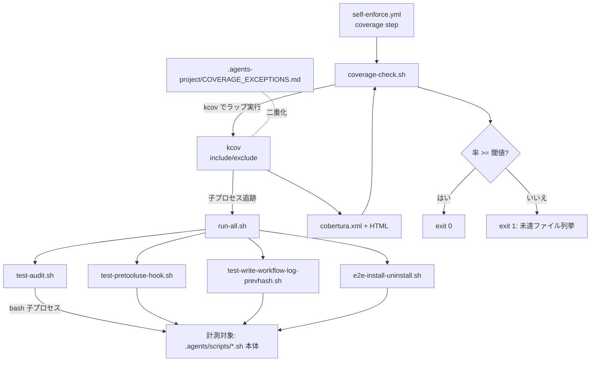
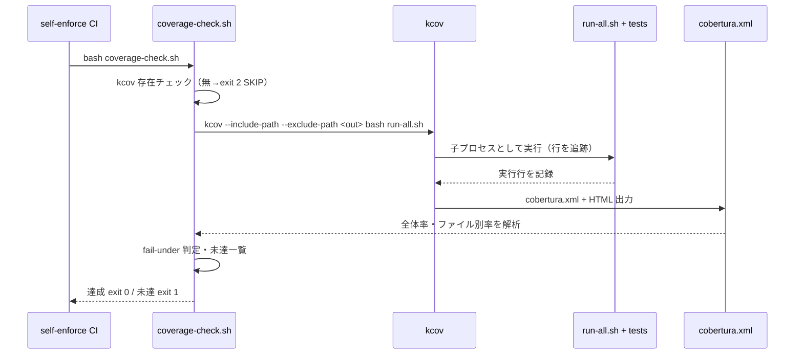

# 設計書: カバレッジ計測の自リポ適用（100%目標の実効化）

**プロジェクト名**: カバレッジ計測の自リポ適用（100%目標の実効化）
**作成日**: 2026 年 06 月 15 日
**最終更新**: 2026 年 06 月 15 日

> **重要**: **このドキュメントは常に更新**: 設計の変更や追加があった場合は、即座にこのドキュメントを更新してください。ドキュメントは「生きているドキュメント」として扱い、実装内容と常に同期させます。
>
> **用語**: [.agents/CONCEPTS.md §用語規約](../../../../../.agents/CONCEPTS.md#用語規約) を参照。

---

## 1. 設計概要

**必須**: 設計方針・原則は [.agents/spec/01\_設計原則.md](../../../../../.agents/spec/01_設計原則.md) を**先に参照**した上で、本プロジェクトに**適用するものを選び**記載すること。

### 1.1 設計方針

bash 主体の本リポに対し、**スクリプト無改変で計測できる kcov を確定**し、テスト一括 runner（別 issue [20260615_054806_テスト実行基盤の整備/02_設計.md §5](../20260615_054806_テスト実行基盤の整備/02_設計.md) の `run-all.sh`）の実行を kcov でラップして計測する。判定（fail-under 相当）は **cobertura レポートを後処理する単一スクリプト**に集約し、CI とローカルで二重化しない。除外は **kcov のパス指定（A）＋ 例外台帳（B）の二重化**で行い、閾値は緩めない（不足はテスト追加か例外登録の二択）。100% への到達が初期段階で困難な場合は、**閾値の初期値を下げるのではなく**、未到達行を「テスト追加」または「台帳付き除外」で解消する段階導入で進める。

### 1.2 設計原則（本プロジェクトで適用するもの）

- **UNIX哲学**: 計測は「runner を kcov でラップする」「cobertura を後処理して閾値判定する」の小さな部品の組み合わせに徹し、テスト駆動ロジック（runner・各テスト）を再実装しない。
- **単一責務**: 閾値判定スクリプト（`coverage-check.sh`）は「kcov 実行 → cobertura 解析 → fail-under 判定」のオーケストレーションのみを持ち、テスト本体・隔離ロジックは持たない（runner と各テストへ委譲）。
- **明確な境界**: 計測層（kcov ラップ＋判定）と、テスト駆動層（runner・各テスト）と、除外定義（kcov 引数＋例外台帳）の 3 境界を分ける。閾値・除外・対象の定義は**正本 1 か所**に集約する（CORE.md 重複禁止）。
- **AIフレンドリー設計**: 計測入口は `.agents/scripts/test/coverage-check.sh` の単一ファイル。計測対象・除外・閾値という意図が読めるデータ（変数・kcov 引数）に集約する。

> **AIフレンドリー設計**: [01\_設計原則 §AIフレンドリー設計](../../../../../.agents/spec/01_設計原則.md#aiフレンドリー設計)（小さなファイル・明確な責務・意図が分かる命名・深すぎないディレクトリ構造）に従い、計測スクリプトは `.agents/scripts/test/` 配下の単一ファイルとする。

---

## 2. アーキテクチャ設計

### 2.1 責務・境界・参照関係

#### 2.1.1 責務一覧

| コンポーネント | 責務（1 文） |
| -------------- | ------------ |
| `coverage-check.sh`（新規・`.agents/scripts/test/`） | テスト一括 runner を kcov でラップ実行し、cobertura レポートを生成して fail-under 閾値を判定し、未達なら非 0 で終了する計測オーケストレータ。 |
| `run-all.sh`（別 issue の前提成果物・無変更） | 全 bash テストを順に駆動する単一入口。本 issue は kcov でこれをラップするだけで変更しない。 |
| 既存 4 本のテストスクリプト（無変更） | 計測対象スクリプトを `bash <script>` の子プロセスとして実行し、計測対象の行を到達させる駆動元。 |
| kcov（外部ツール・CI で apt 導入） | ラップ実行中に子 bash プロセスの実行行を記録し、include/exclude パスで対象を絞り、cobertura XML / HTML を出力する計器。 |
| `.agents-project/COVERAGE_EXCEPTIONS.md`（新規・例外台帳） | 計測対象外箇所を必須列で管理し、kcov のパス除外（A）と対応づける人間可読の台帳（B）。 |
| `self-enforce.yml`（CI・step 追加） | kcov を apt 導入し `coverage-check.sh` を呼ぶ coverage step を 1 つ追加する CI 入口。判定ロジックは持たず scripts に委譲。 |
| `.gitignore`（追記） | kcov の中間生成物・レポート出力先を無視対象にし、差分ゼロ検証・npm pack リーク検査を破らない。 |

#### 2.1.2 境界

- **入力**: `coverage-check.sh` は引数なしで起動（`bash .agents/scripts/test/coverage-check.sh`）。リポジトリルートで実行する前提（runner・各テストと同じ）。閾値・include/exclude・出力先はスクリプト内の正本変数で定義し、引数で外から緩めない。
- **出力**: 標準出力に計測対象別カバレッジ率・全体率・判定結果（PASS/FAIL）と未達ファイル一覧。cobertura XML / HTML を `.gitignore` 済みパスへ出力。終了コードで閾値の達否を返す（§5 終了コード契約）。
- **他責務との境界**: テスト駆動（runner）・テスト本体（各スクリプト）・tmp 隔離は本 issue の範囲外（前提 issue と各スクリプトの責務）。本 issue は計測のラップ・除外・閾値判定・台帳運用・CI 配線のみ。テストケースの新規追加（100% 到達のためのテスト拡充）は段階導入の運用であり、設計上は「不足はテスト追加 or 台帳登録」の枠で扱う。runner 未完時の暫定（個別テスト直接ラップ）も §3.4 に規定。

#### 2.1.3 参照関係

- `self-enforce.yml`（coverage step）→ `coverage-check.sh` → kcov → `run-all.sh` → 各テストスクリプト → 計測対象 bash（`.agents/scripts/*.sh` 本体）。
- `coverage-check.sh` → cobertura XML（kcov 出力）を解析 → fail-under 判定。
- `coverage-check.sh`（kcov の `--exclude-path`）↔ `.agents-project/COVERAGE_EXCEPTIONS.md`（同一対象を二重化）。
- 依存の向きは CI → 計測スクリプト → kcov → runner → テスト → 対象、の一方向。循環なし。runner・各テストは計測スクリプトを参照しない（個別実行・既存 CI を維持するため）。

### 2.2 システムアーキテクチャ

**必須**: 設計判断は [.agents/spec/](../../../../../.agents/spec/)（[00_spec概要.md](../../../../../.agents/spec/00_spec概要.md)、[01\_設計原則.md](../../../../../.agents/spec/01_設計原則.md)、[06\_設計判断の優先順位.md](../../../../../.agents/spec/06_設計判断の優先順位.md)）を**先に**参照すること。

- **採用パターン**: デコレータ／ラッパ（計測ラップ）＋ パイプライン（実行→集約→判定）。計測スクリプトは runner の周りに kcov を被せ、出力を後処理判定へ流す薄いオーケストレータ。
- **根拠**: [01\_設計原則 §UNIX哲学・§単一責務](../../../../../.agents/spec/01_設計原則.md)。テスト駆動の単一正本を runner と各テストに保ち（二重化回避）、計測層は「ラップ＋判定」だけを担う。前提 issue §3.3 の「検証ロジックは各テストスクリプトに 1 本」の方針に整合する。

#### 2.2.1 CQRS（Command/Query 分離）

- 本 issue は開発リポの状態を変更しない（計測は読み取り＋ `.gitignore` 済み一時出力のみ）。CQRS は適用対象外。

#### 2.2.2 アーキテクチャ図（本プロジェクトの構成で記載）

### 2.3 コンポーネント構成

- **`coverage-check.sh`**（新規・`.agents/scripts/test/`）: 単一責務の計測オーケストレータ。(1) kcov の存在チェック（無ければ SKIP・exit 2）、(2) include/exclude パスと閾値の正本変数定義、(3) `kcov --include-path … --exclude-path … <outdir> bash run-all.sh` の実行、(4) cobertura XML の解析（全体率・ファイル別率）、(5) fail-under 判定と未達一覧出力、(6) 終了コード決定。テスト駆動・隔離ロジックは持たない。
- **kcov 設定（スクリプト内）**: `--include-path=.agents/scripts`（計測対象＝実行ロジックを持つ bash 本体）、`--exclude-path=.agents/scripts/test,.agents/scripts/lib/deploy-skills.sh`（テスト自身・別途台帳化する対象）。bash は行単位 ignore の公式手段が無いため、除外は**パス単位**（kcov の `--exclude-path` / `--exclude-pattern`）と**例外台帳**の二重化で行う（Go と同種の制約整理）。
- **`.agents-project/COVERAGE_EXCEPTIONS.md`**（新規）: COVERAGE_AND_EXCEPTIONS.md 第3章の必須列の表。SAMPLE 行を削除し、kcov の `--exclude-path` と一致する実データ行を持つ。
- **`self-enforce.yml`**（変更）: kcov 導入 step ＋ coverage step を追加（§3.3）。既存 7 step は不変。
- **`.gitignore`**（変更）: kcov 出力先（例 `/.coverage/`）を無視追加。

### 2.4 データフロー

`coverage-check.sh` は kcov を親プロセスとして起動し、kcov が `run-all.sh`→各テスト→対象 `bash` 子プロセスの実行行を ptrace で記録、cobertura XML に集約する。`coverage-check.sh` はその XML を読み取り（読み取りのみ）、閾値判定して終了コードを返す。開発リポの追跡ファイルへは書き込まない（出力は `.gitignore` 済みパス）。イベント発行なし。

---

## 3. 機能設計

### 3.1 機能 1: 計測手段の確定（kcov）と候補比較

#### 3.1.1 概要

bash カバレッジ計測手段を確定する。最終確定は **kcov**。候補比較と却下理由を以下に確定する。

#### 3.1.2 候補比較と確定（却下理由つき）

| 候補 | 利点 | 欠点 | 本リポ適合性 | 判定 |
| ---- | ---- | ---- | ------------ | ---- |
| **kcov** | スクリプト無改変・子プロセス追跡で `bash <script>` 起動の対象も計測・cobertura XML + HTML 出力・ubuntu-latest で apt 導入可 | バイナリ導入が必要・行単位 ignore が無く除外はパス単位 | 既存テストが `bash "$SCRIPT"` で対象を子プロセス起動する構造に**最適合**（kcov は子プロセスを追跡するため runner ラップ 1 回で全対象を捕捉） | **確定（採用）** |
| bashcov + SimpleCov | SimpleCov の閾値・除外・グルーピング機構を流用 | **Ruby ランタイム依存が増える**・bashcov は `set -x` トレース方式で**子プロセスの別 bash 実行を計測しにくい**（本リポは `bash <script>` 子プロセス駆動が主） | 子プロセス駆動主体の本リポと相性が悪く、依存も増える | 却下（依存増・子プロセス計測の弱さ） |
| bash 組み込みトレース（`BASH_XTRACEFD` + `$LINENO` 集計） | 追加ツール不要 | **自前集計の実装・精度・複数ファイル/子プロセス対応の実装コストが過大**・cobertura/HTML を自前生成する必要 | 保守コストが高く、正本 1 か所・薄い実装の方針に反する | 却下（実装コスト過大・標準形式非対応） |

- **確定**: **kcov**。ubuntu-latest で `apt-get install -y kcov` 導入、対象を無改変で計測、cobertura/HTML を出力でき、子プロセス追跡により本リポの `bash <script>` 駆動構造に最適合するため。

#### 3.1.3 入力・出力

- 入力: なし（CI が apt で kcov を導入し `coverage-check.sh` を呼ぶ）。
- 出力: cobertura XML（判定入力）＋ HTML（人間用レポート）＋ 判定結果。

#### 3.1.4 エラーハンドリング

- kcov 不在 → `coverage-check.sh` は SKIP として exit 2（runner I/F の「必須依存欠如」規約に合わせる）。ローカル任意実行で kcov 未導入でもクラッシュしない。CI では apt で必ず導入するため SKIP にならない。

### 3.2 機能 2: 「100% の現実的な定義・適用範囲」と除外の二重化

#### 3.2.1 概要

100% の分母（計測対象）と除外（対象外）を確定し、kcov パス除外（A）と例外台帳（B）で二重化する。

#### 3.2.2 100% の現実的な定義（確定）

- **「100%」の定義**: COVERAGE_AND_EXCEPTIONS.md の推奨定義（CI 宣言ジョブの結果を公式手順でマージし、マージ後レポートに fail-under を掛ける）を本リポに具体化し、**「kcov が計測する `.agents/scripts/` 配下の実行ロジック bash 本体のうち、台帳付きで除外したものを除いた全行が、テスト一括 runner の実行で到達される」状態**を 100% と定義する。
- **計測対象（分母）**: 実行ロジックを持つ bash 本体。
  - `.agents/scripts/*.sh`（`build-adapters.sh`・`setup.sh`・`sync-version.sh`・`verify-npm-pack.sh`・`write-workflow-log.sh`・`memo-prefix.sh`・`create-pr-review-issue-dir.sh`・`build-plugin-claude.sh`・`new-workflow-memo.sh`）
  - PreToolUse/PostToolUse hook 等、実行ロジックを持つ bash（生成・配備先ではなく正本側の本体）。
- **計測対象外（分母から除外）**: 以下を kcov のパス除外＋台帳で除外する。
  - **テスト自身**: `.agents/scripts/test/`（test-*.sh・e2e-*.sh・run-all.sh・coverage-check.sh）。テストのテストは循環で意味がない（認定基準: テスト駆動の対象外）。
  - **テンプレート・設定・スキーマ・生成物・非実行データ**: `.workflow/templates/`・`.agents/ledger/schema.sql`・`.adapters/` 生成物・`*.md` / `*.json` / `*.yml`（そもそも bash でないため kcov の計測対象に入らないが、台帳で「分母に含めない」明記をする）。
  - **計測困難・低 ROI の薄い bash**: 個別に台帳化する（例: `lib/deploy-skills.sh` 等、結合テストで間接的に駆動されない補助）。**広域 ignore は禁止**（COVERAGE_AND_EXCEPTIONS.md §1.1）。
- **bash の行単位 ignore が無い制約**: COVERAGE_AND_EXCEPTIONS.md 言語別表に bash 行が無いため、Go と同種の整理として **kcov の `--exclude-path` / `--exclude-pattern`（パス・パターン単位）** ＋ **必要なら cobertura 後処理での行除去** ＋ **例外台帳** で扱う。行単位の `pragma` 相当は使わない（公式手段が無い）。

#### 3.2.3 入力・出力

- 入力: 計測対象・除外の定義（`coverage-check.sh` の正本変数 ＋ 台帳）。
- 出力: kcov に渡る include/exclude 引数と、それに一致する台帳行。

#### 3.2.4 エラーハンドリング

- kcov 除外（A）と台帳（B）が**不一致**な場合は監査・レビューで指摘し是正（片方だけは不可・COVERAGE_AND_EXCEPTIONS.md §1）。一致検証は §6 の監査観点で行う（自動化する場合は後続 issue で台帳⇔引数の突き合わせスクリプト化を検討）。

### 3.3 機能 3: CI 配線・閾値矯正・段階導入

#### 3.3.1 概要

`self-enforce.yml` に kcov 導入 step と coverage step を追加し、fail-under 閾値で矯正する。閾値は緩めず段階導入する。

#### 3.3.2 CI 配線（既存 7 step を壊さず追加）

- **追加 step A（導入）**: `apt-get install -y kcov`（既存 `Install sqlite3` step に倣う）。
- **追加 step B（計測・矯正）**: `bash .agents/scripts/test/coverage-check.sh`。終了コードで CI の成否を決める（未達で fail）。
- **配置**: 既存 E2E step の後、audit step の前後どちらでも可。既存 7 step のロジックは不変（schema/pack/version/audit は別系統で重複しない）。
- **計測生成物の保護**: kcov 出力先（例 `/.coverage/`）を `.gitignore` に追加。step #3「生成物の差分ゼロ検証」と step #4「npm pack リーク検査」を破らないことを確認する（生成物が追跡・tarball に漏れない）。

#### 3.3.3 閾値の初期値と段階導入（確定）

- **正本方針**: `--fail-under` 相当の**最終目標は 100**（COVERAGE_AND_EXCEPTIONS.md §1。閾値を恒久的に下げない）。
- **段階導入の扱い（閾値を緩めない段階導入）**: 初期から計測対象全行に 100% を強制すると未到達行で常時 fail し導入が進まない懸念があるため、**閾値そのものは下げず**、未到達行を以下のいずれかで解消しながら 100% へ寄せる。
  1. **テスト追加**（到達させる）。
  2. **台帳付き除外**（kcov パス除外＋台帳に登録し分母から外す）。
- **初期導入時の現実解（推奨・03 で採否確定）**:
  - **方式 1（推奨・正本整合）**: 計測対象を「結合テストで確実に駆動される対象スクリプト」に**include を絞り**、その絞った分母に対して **fail-under=100** を最初から適用する。未駆動の対象は台帳で除外し、テスト追加で順次 include に戻す（分母を段階拡大、閾値は常に 100）。
  - **方式 2（過渡・要注記）**: どうしても初期に 100 が組めない場合のみ、**期限付き**で初期閾値（例 90）を設定し、台帳に「有効期限・引上げ計画」を明記して**段階引上げ**する。ただし COVERAGE_AND_EXCEPTIONS.md §1 の「閾値を下げない」に対する**過渡的逸脱**であることを台帳・PR に明記し、恒久化しない。**既定は方式 1**。
- **判定の単一正本**: 閾値値・include/exclude は `coverage-check.sh` の正本変数 1 か所のみに置く。CI 側・ローカル側で重複定義しない（CORE.md 重複禁止・既存 `verify-npm-pack.sh` 等の集約方針に倣う）。

#### 3.3.4 エラーハンドリング

- カバレッジ率 < 閾値 → 未達ファイル・率を出力し exit 1（CI fail）。
- cobertura 解析失敗（XML 不正・kcov 失敗）→ 診断出力し exit 1（計測自体の失敗を握りつぶさない）。

### 3.4 機能 4: 前提 runner への相乗りと暫定配線

#### 3.4.1 概要

カバレッジ配線は前提 issue の `run-all.sh` をラップする形を第一とする。前提未完時の暫定も規定する。

#### 3.4.2 配線方針

- **第一（runner 相乗り）**: `coverage-check.sh` が `kcov … bash .agents/scripts/test/run-all.sh` をラップ。runner I/F（[前提 issue §5](../20260615_054806_テスト実行基盤の整備/02_設計.md)：引数なし起動・終了コード 0/1・SKIP は exit 2）に整合させる。
  - runner の終了コードは kcov 配下でも保持されるが、計測の主目的は**カバレッジ率の判定**であり、runner の PASS/FAIL は前提 issue の E2E step が既に担保する。`coverage-check.sh` は率判定を主とし、runner 失敗時は計測結果が不完全になるため診断のうえ fail させる。
- **暫定（runner 未完時）**: `coverage-check.sh` 内のテスト一覧（runner と同順の配列）を持ち、`kcov … bash <各テスト>` を個別ラップして cobertura をマージ（`kcov --merge`）する最小実装にとどめ、runner 完成後に「runner を 1 回ラップ」へ一本化する。暫定でもテスト本体ロジックは再実装しない。

#### 3.4.3 エラーハンドリング

- 前提 runner 不在 → 暫定（個別ラップ）へフォールバック、またはテスト一覧不足を診断。runner 完成後は相乗り一本化。

### 3.5 機能 5: 例外台帳の実データ運用

#### 3.5.1 概要

`.agents-project/COVERAGE_EXCEPTIONS.md` を COVERAGE_AND_EXCEPTIONS.md 第3章の必須列で新設し、SAMPLE を削除して実データ運用する。

#### 3.5.2 台帳様式（確定）

- **配置**: `.agents-project/COVERAGE_EXCEPTIONS.md`（本リポは自己拡張の消費者なので `.agents-project/` 側）。
- **必須列**: ID / 対象 / カテゴリ（第2章 1〜4）/ 理由 / 代替保証 / 適用手段 / 承認 / 有効期限。
- **規約参照**: 列定義・認定基準の説明は配布物正本 COVERAGE_AND_EXCEPTIONS.md を参照し、台帳側で重複定義しない（DRY）。台帳は実データ行のみを持つ。
- **適用手段列**: kcov の `--exclude-path=<path>` / `--exclude-pattern=<pat>` を具体記載し、`coverage-check.sh` の除外引数と一致させる（二重化の A）。
- **初期実データ（例・03 で確定）**: `.agents/scripts/test/`（カテゴリ=テスト駆動対象外）、`.workflow/templates/`・`schema.sql`・`*.md`/`*.json`/`*.yml`（カテゴリ 1 機械生成/非実行データ）、結合テストで駆動されない薄い bash（カテゴリ 4 代替保証つき）。

#### 3.5.3 入力・出力

- 入力: 計測対象外の確定（§3.2）。
- 出力: 必須列を満たす台帳ファイル（SAMPLE 行削除済み）。

#### 3.5.4 エラーハンドリング

- 台帳行と kcov 除外の不一致・SAMPLE 残存は監査で FAIL 扱い（§6）。

---

## 4. データ設計

本 issue は永続データ・テーブルを持たない（計測はステートレス、出力は `.gitignore` 済み一時生成物）。該当なし。例外台帳は Markdown 表（永続データではなく設定ドキュメント）。

---

## 5. API 設計（計測スクリプトの I/F 仕様）

> 後続運用・CI が参照するため、`coverage-check.sh` の呼び出し方・終了コード規約・出力を正本として明記する。前提 issue [§5 runner I/F](../20260615_054806_テスト実行基盤の整備/02_設計.md) に相乗りする。

### 5.1 API 一覧

| エンドポイント（CLI） | 形式 | 説明 |
| --------------------- | ---- | ---- |
| `bash .agents/scripts/test/coverage-check.sh` | コマンド（引数なし） | runner を kcov でラップ計測し fail-under 判定する計測入口。 |
| `bash .agents/scripts/test/run-all.sh` | コマンド（引数なし・前提 issue） | 計測対象を駆動する被ラップ対象（本 issue は変更しない）。 |

### 5.2 API 詳細

#### API1: coverage-check.sh

- **呼び出し方**: `bash .agents/scripts/test/coverage-check.sh`（引数なし）。リポジトリルートで実行。CI の coverage step から呼ぶ。
- **正本変数（1 か所集約）**: 計測対象 `INCLUDE_PATHS`（既定 `.agents/scripts`）、除外 `EXCLUDE_PATHS`（既定 `.agents/scripts/test` ほか台帳一致分）、閾値 `FAIL_UNDER`（既定 100。方式 2 採用時のみ過渡値）、出力先 `COV_OUT`（`.gitignore` 済みパス）。
- **終了コード契約（規約・runner I/F と整合）**:

  | 終了コード | 意味 |
  | -- | ---- |
  | `0` | カバレッジ率 >= 閾値（達成）。計測・判定成功。 |
  | `1` | カバレッジ率 < 閾値（未達・矯正 fail）、または kcov 実行・cobertura 解析失敗。 |
  | `2` | kcov 不在（必須依存欠如・SKIP）。前提 runner I/F の `exit 2 = SKIP` 規約に合わせる。 |

- **出力（規約）**:
  - 標準出力に `全体カバレッジ率 = NN.N% (閾値 TT)` と、未達時は `[UNCOVERED] <file>: NN.N%` 形式でファイル別未達一覧。
  - cobertura XML（`$COV_OUT/cobertura.xml` 相当）＋ HTML レポートを `$COV_OUT` に生成。両者とも `.gitignore` 済み。
- **除外（二重化の A）**: kcov の `--include-path` / `--exclude-path` / `--exclude-pattern` で指定し、`.agents-project/COVERAGE_EXCEPTIONS.md`（B）と一致させる。
- **非破壊契約**: 開発リポの `.agents/` `.claude/` `.cursor/` `.workflow/` `workflow.db` を変更しない。kcov 出力は `.gitignore` 済みパスのみ。runner・各テストの tmp 隔離はそれぞれの責務（前提 issue・各スクリプト）。
- **エラー**: kcov 不在は SKIP（exit 2、CI では apt 導入のため発生しない）。率未達・計測失敗は exit 1。

---

## 6. テスト戦略

テスト戦略の**観点の定義**は [RULES.md のテスト戦略必須要件](../../../../../.agents/RULES.md#テスト戦略必須要件) を、**BDD 形式の定義**は [TEST_BDD_FORMAT.md](../../../../../.agents/TEST_BDD_FORMAT.md) を参照すること。本ドキュメントでは**対象ごとのテスト割当**のみ記載する。

### 6.1 対象ごとのテスト割り当て

| 対象 | 単体 | 結合/API | E2E | クリティカル観点 | バリデーション観点 | 未達理由/補足 |
| ---- | ---- | -------- | --- | ---------------- | ------------------ | ------------- |
| `coverage-check.sh`（閾値判定） | ○ | ○ | × | 率 < 閾値で exit 1／率 >= 閾値で exit 0／kcov 不在で exit 2 SKIP | 閾値境界（ちょうど閾値・閾値直下）・cobertura 解析の正否 | 擬似 cobertura XML を tmp で食わせ判定を検証（kcov 実行を伴わない判定単体） |
| `coverage-check.sh`（kcov ラップ実行） | × | ○ | × | runner を kcov でラップし cobertura が生成される | 出力先が `.gitignore` 済みパスである | kcov 導入環境（CI）または tmp で最小スクリプトをラップ検証。kcov 無環境は SKIP |
| 除外の二重化（kcov 引数 ↔ 台帳） | × | × | × | kcov 除外と台帳の対象が一致 | SAMPLE 行が削除され必須列が揃う | verify-and-close の監査で突き合わせ確認（自動突合は後続 issue 候補） |
| CI 配線（self-enforce.yml） | × | ○ | × | coverage step が kcov 導入後に呼ばれ未達で CI が fail | 既存 7 step を壊さない・生成物が差分ゼロ/pack リークを破らない | CI 実行で確認。ローカルは差分ゼロ・gitignore を tmp で確認 |
| 段階導入方針（閾値を下げない） | × | × | × | 閾値は最終 100・不足はテスト追加 or 台帳の二択 | 方式 2 採用時は期限付き・台帳明記 | ドキュメント整合の監査（COVERAGE_AND_EXCEPTIONS.md §1 と矛盾しない） |
| ドッグフーディング整合 | × | × | × | 自リポ CI が COVERAGE_AND_EXCEPTIONS.md 方針と整合 | - | 02/03 で正本方針と実装の対応付けを確認 |

### 6.2 監査・レビューでの確認（証跡）

証跡の確認観点は RULES §テスト戦略必須要件および workflow/PHASES.md の監査観点を参照。本設計書 §6.1 の割当表と 03\_実装計画のタスク別テスト観点・BDD が揃っていることを確認する。`coverage-check.sh` 自体のテスト（擬似 cobertura による判定・kcov 不在 SKIP・除外二重化一致）は tmp 隔離で実行し、本番 DB・開発リポ・追跡ファイルを破壊しないこと、kcov 出力が `.gitignore` 済みで差分ゼロ検証・npm pack リーク検査を破らないことを併せて確認する。01 の BDD（UC1 計測と閾値矯正・UC2 例外二重化・UC3 候補比較）と 03 のテスト観点が対応していることを確認する。

---

## 7. UI 設計

該当なし（CLI のみ。出力フォーマットは §5.2 の率・未達一覧・終了コードに規定。HTML レポートは kcov 標準出力）。

---

## 8. セキュリティ設計

### 8.1 認証・認可

該当なし。

### 8.2 データ保護

- 計測ツール導入は CI の正規パッケージマネージャ（`apt-get install kcov`）経由に限定し、外部スクリプトの無検証実行を行わない（00/01 §セキュリティ）。
- 破壊的になりうるテスト（e2e 等）は各スクリプトの tmp 隔離で実行され、`coverage-check.sh` はそれを kcov でラップ呼びするだけで隔離ロジックを再実装しない（[.agents-project/自己拡張ワークフロー.md](../../../../../.agents-project/自己拡張ワークフロー.md) §テストの tmp 隔離・[.agents/RULES.md](../../../../../.agents/RULES.md) §テスト隔離）。
- 高リスク操作（外部書き込み・大量削除）は発生させない。

---

## 9. 非機能要件への対応

### 9.1 パフォーマンス

- kcov の ptrace 計測は実行を数倍遅くしうるため、CI 実行時間の増加は coverage step を**既存 E2E と別 step**に分離して切り分け可能にする。runner 1 回ラップで全対象を捕捉するため重複実行は避ける。具体オーバーヘッドは導入後に CI ログで実測し、過大なら計測対象 include を必要十分に絞る（00 §3.1）。

### 9.2 可用性

- kcov 不在の最小環境（ローカル任意実行）では `coverage-check.sh` はクラッシュせず exit 2（SKIP）で案内する。CI では apt 導入で常に計測する。coverage step が落ちても既存 7 step と切り分けでき、閾値未達の fail は仕様どおり。

---

## 10. 参考資料

### プロジェクトドキュメント

- [`01_要件定義.md`](./01_要件定義.md) - 要件定義
- [`00_要求定義.md`](./00_要求定義.md) - 要求定義
- 前提 issue: [テスト実行基盤の整備 02_設計.md §5（runner I/F）](../20260615_054806_テスト実行基盤の整備/02_設計.md)

### その他の参考資料

- 配布物正本: [`.agents/COVERAGE_AND_EXCEPTIONS.md`](../../../../../.agents/COVERAGE_AND_EXCEPTIONS.md)（§1 方針・§1.1 禁止パターン・§2 認定基準・§3 台帳必須列・§4 言語別除外・§5 言語別ツール）
- [`.agents/RULES.md`](../../../../../.agents/RULES.md) §テスト戦略、[`.agents/workflow/PHASES.md`](../../../../../.agents/workflow/PHASES.md) §監査観点
- [`.github/workflows/self-enforce.yml`](../../../../../.github/workflows/self-enforce.yml)（既存 7 step・coverage 不在の根拠）
- 既存テスト: `.agents/scripts/test/`（4 本。`bash <script>` 子プロセス駆動構造＝kcov 子プロセス追跡に最適合）
- [.agents/spec/01\_設計原則.md](../../../../../.agents/spec/01_設計原則.md)（UNIX 哲学・単一責務・AI フレンドリー）

---

## 11. 前のステップ

この設計書は、以下のドキュメントを基に作成されています：

- **前**: [`01_要件定義.md`](./01_要件定義.md) - 要件定義フェーズ

---

## 12. 次のステップ

この設計書の承認後、以下のドキュメントを作成します：

- **次**: [`03_実装計画.md`](./03_実装計画.md) - 実装計画フェーズ
