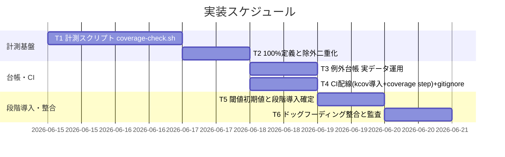
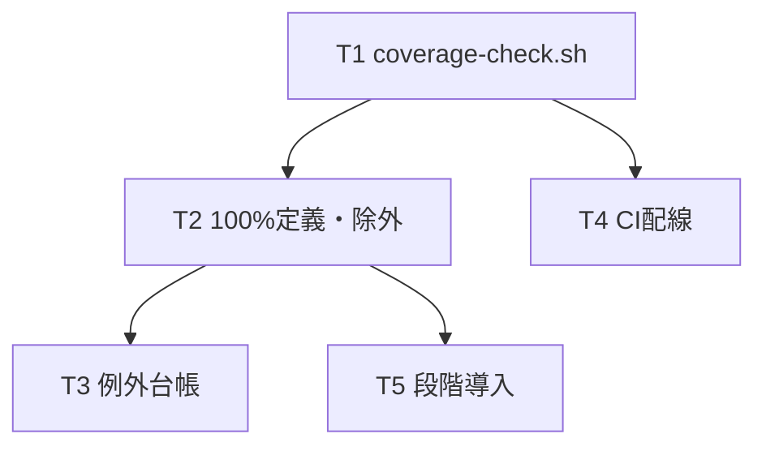

# 実装計画書: カバレッジ計測の自リポ適用（100%目標の実効化）

**プロジェクト名**: カバレッジ計測の自リポ適用（100%目標の実効化）
**作成日**: 2026 年 06 月 15 日
**最終更新**: 2026 年 06 月 15 日

> **重要**: **このドキュメントは常に更新**: 実装計画の変更、進捗状況の更新、バグの記録などがあった場合は、即座にこのドキュメントを更新してください。ドキュメントは「生きているドキュメント」として扱い、実装内容と常に同期させます。
> **必須項目**: 「必須」と明記した欄は空欄・抽象語のみで提出しないこと。テスト観点・BDD 仕様は具体ケースを 1 件以上記載すること。
>
> **用語**: [.agents/CONCEPTS.md §用語規約](../../../../../.agents/CONCEPTS.md#用語規約) を参照。

---

## 1. 実装概要

### 1.1 実装方針（必須）

[02_設計.md](./02_設計.md) に従い、計測手段を **kcov に確定**し、テスト一括 runner（前提 issue の `run-all.sh`）を kcov でラップ実行する単一スクリプト `coverage-check.sh` を新設、cobertura レポートを後処理して fail-under 判定する。除外は kcov パス指定（A）＋ 例外台帳 `.agents-project/COVERAGE_EXCEPTIONS.md`（B）の二重化で行い、閾値は緩めず段階導入（既定は分母を絞って fail-under=100、過渡的に方式 2）。CI に kcov 導入 step と coverage step を追加し、生成物は `.gitignore` 化して既存 7 step（差分ゼロ・pack リーク）を破らない。テスト駆動ロジックは再実装しない（前提 issue・各テストへ委譲）。

### 1.2 実装順序（必須: 1 件以上）



実装順序: T1 → T2 →（T3・T4 並行可）→ T5 → T6。T1（計測スクリプト）と T2（定義・除外）が他タスクの前提。

---

## 2. タスク分解

**用語**: [.agents/CONCEPTS.md §用語規約](../../../../../.agents/CONCEPTS.md#用語規約) を参照。

**必須**: 各タスクには **「テスト観点」（2.x.3）** と **「単体テスト仕様（BDD）」（2.x.4）** を必ず記載すること。テスト観点の定義は **02\_設計 §6** および **RULES のテスト戦略・[TEST_BDD_FORMAT.md](../../../../../.agents/TEST_BDD_FORMAT.md)** を参照し、本ドキュメントでは**タスクごとの具体ケース**のみ記載する。

### 2.1 タスク 1: 計測スクリプト coverage-check.sh の新設（kcov ラップ＋fail-under 判定）

#### 2.1.1 概要（必須）

runner を kcov でラップ計測し、cobertura を後処理して閾値判定する単一責務スクリプトを新設する。

#### 2.1.2 実装内容（必須: 1 件以上）

- `.agents/scripts/test/coverage-check.sh` を新設（`set -uo pipefail`・リポジトリルート実行前提）。
- 正本変数 `INCLUDE_PATHS` / `EXCLUDE_PATHS` / `FAIL_UNDER`（既定 100）/ `COV_OUT`（`.gitignore` 済みパス）を 1 か所に定義。
- kcov 存在チェック（無ければ `exit 2` SKIP・案内）。
- `kcov --include-path "$INCLUDE_PATHS" --exclude-path "$EXCLUDE_PATHS" "$COV_OUT" bash .agents/scripts/test/run-all.sh` を実行（runner 未完時は §3.4 暫定の個別ラップ＋`--merge` にフォールバック）。
- cobertura XML を解析し全体率・ファイル別率を算出、`FAIL_UNDER` 未達なら未達一覧を出して `exit 1`、達成で `exit 0`。

#### 2.1.3 テスト観点（必須）

**参照**: 観点の定義は [02\_設計 §6](./02_設計.md) および [RULES のテスト戦略・TEST_BDD_FORMAT](../../../../../.agents/RULES.md#テスト戦略必須要件) を参照。以下には**本タスクの具体ケース**のみ記載する。

##### 単体（本タスクの具体ケース・必須 1 件以上）

- 擬似 cobertura XML（全体率 100%）を食わせると `exit 0` を返す。
- 擬似 cobertura XML（全体率 80%・閾値 100）を食わせると `exit 1` を返し、未達ファイルを `[UNCOVERED]` 形式で出力する。
- 閾値ちょうど（率=閾値）のとき `exit 0`（境界値）。
- kcov を PATH から外した環境で実行すると `exit 2`（SKIP・必須依存欠如案内）でクラッシュしない。

##### 結合/API（本タスクの具体ケース・該当時は必須 1 件以上）

- tmp 隔離で最小 bash スクリプト（一部行のみ実行されるもの）を kcov でラップ実行し、cobertura が生成され率が期待どおり算出される（kcov 導入環境のみ。無ければ SKIP）。

##### E2E/受け入れ（本タスクの具体ケース・未達時は理由記載）

- 該当なし（E2E は CI 配線タスク T4 で確認。計測スクリプト単体は単体/結合で担保）。

##### バリデーション（該当する場合の具体ケース）

- cobertura XML が不正・空のとき診断を出して `exit 1`（計測失敗を握りつぶさない）。

#### 2.1.4 単体テスト仕様（BDD）（必須）

**BDD 形式のテストケース（高レベル仕様）**:

```gherkin
Feature: coverage-check.sh の閾値判定
  Scenario: 率が閾値を下回ると fail する
    Given fail-under 閾値が 100 に設定されている
    And 全体カバレッジ率 80% の cobertura レポートがある
    When coverage-check.sh が判定を行う
    Then 終了コードは 1 であり未達ファイルが出力される
  Scenario: kcov 不在で SKIP する
    Given PATH に kcov が存在しない
    When coverage-check.sh を実行する
    Then 終了コードは 2 でクラッシュせず案内を出す
```

**テストコード例（必須: インラインコメントで Given/When/Then を明記）**

```bash
# Given: 閾値 100、全体率 80% の擬似 cobertura XML を tmp に用意する
tmp="$(mktemp -d)"; printf '<coverage line-rate="0.80">...' > "$tmp/cobertura.xml"
# When: 判定ロジック（COV_OUT を tmp に向けた coverage-check.sh の解析部）を実行する
FAIL_UNDER=100 COV_OUT="$tmp" bash .agents/scripts/test/coverage-check.sh --judge-only; rc=$?
# Then: 終了コードは 1（未達 fail）であること
[ "$rc" -eq 1 ] && echo PASS || echo FAIL
rm -rf "$tmp"
```

#### 2.1.5 依存関係

- 前提 issue「テスト実行基盤の整備」の `run-all.sh`（未完時は暫定フォールバック）。



#### 2.1.6 見積もり

- **工数**: 6h
- **優先度**: 高

### 2.2 タスク 2: 「100% の現実的な定義」と除外の二重化の確定・反映

#### 2.2.1 概要（必須）

計測対象（実行ロジック bash 本体）と除外（テスト自身・テンプレ・設定・生成物・非実行データ・薄い bash）を確定し、kcov 引数と台帳に反映する。

#### 2.2.2 実装内容（必須: 1 件以上）

- `coverage-check.sh` の `INCLUDE_PATHS`=`.agents/scripts`、`EXCLUDE_PATHS`=`.agents/scripts/test` ＋台帳一致分を設定。
- 除外対象を COVERAGE_AND_EXCEPTIONS.md §2 の認定基準（1 機械生成/4 代替保証つき等）に分類。
- bash の行単位 ignore が無い制約を踏まえ、除外はパス/パターン単位＋台帳に限定（行 pragma を使わない）方針を明記。

#### 2.2.3 テスト観点（必須）

**参照**: 観点の定義は [02\_設計 §6](./02_設計.md) および [RULES のテスト戦略・TEST_BDD_FORMAT](../../../../../.agents/RULES.md#テスト戦略必須要件) を参照。

##### 単体（本タスクの具体ケース・必須 1 件以上）

- kcov の `--exclude-path` に渡したパス配下のスクリプトが cobertura レポートの分母に含まれない（除外が効く）。

##### 結合/API（本タスクの具体ケース・該当時は必須 1 件以上）

- `coverage-check.sh` の `EXCLUDE_PATHS` 値と `.agents-project/COVERAGE_EXCEPTIONS.md` の「適用手段」列のパスが一致する（二重化整合）。

##### E2E/受け入れ（本タスクの具体ケース・未達時は理由記載）

- 該当なし（CI 配線 T4 / 監査 T6 で確認）。

##### バリデーション（該当する場合の具体ケース）

- include に実行ロジック bash 以外（md/json/yml）が混入していない（分母が実行ロジックのみ）。

#### 2.2.4 単体テスト仕様（BDD）（必須）

```gherkin
Feature: 計測対象と除外の二重化
  Scenario: 除外パスが分母から外れる
    Given EXCLUDE_PATHS に .agents/scripts/test を指定する
    When kcov でラップ計測し cobertura を生成する
    Then test 配下のスクリプトはカバレッジの分母に含まれない
```

```bash
# Given: EXCLUDE_PATHS=.agents/scripts/test を設定して計測する
# When: 生成された cobertura.xml の filename 一覧を確認する
grep -o 'filename="[^"]*"' "$COV_OUT/cobertura.xml" | sort -u > /tmp/files.txt
# Then: test 配下のスクリプトが分母に含まれないこと
! grep -q '.agents/scripts/test/' /tmp/files.txt && echo PASS || echo FAIL
```

#### 2.2.5 依存関係

- T1（coverage-check.sh）。

#### 2.2.6 見積もり

- **工数**: 3h
- **優先度**: 高

### 2.3 タスク 3: 例外台帳 `.agents-project/COVERAGE_EXCEPTIONS.md` の実データ運用

#### 2.3.1 概要（必須）

COVERAGE_AND_EXCEPTIONS.md 第3章の必須列で台帳を新設し、SAMPLE を削除して実データ行を運用する。

#### 2.3.2 実装内容（必須: 1 件以上）

- `.agents-project/COVERAGE_EXCEPTIONS.md` を新設（必須列: ID/対象/カテゴリ/理由/代替保証/適用手段/承認/有効期限）。
- SAMPLE-001 を削除し、実データ行（`.agents/scripts/test/`・テンプレ/schema/生成物/非実行データ・薄い bash）を記載。
- 列定義・認定基準の説明は配布物正本を参照し台帳側で重複定義しない（DRY）。「適用手段」列に kcov の `--exclude-path`/`--exclude-pattern` を具体記載し T2 の引数と一致させる。

#### 2.3.3 テスト観点（必須）

**参照**: [02\_設計 §6](./02_設計.md)・[RULES](../../../../../.agents/RULES.md#テスト戦略必須要件) 参照。

##### 単体（本タスクの具体ケース・必須 1 件以上）

- 台帳に必須列 8 項目がすべて存在する。
- SAMPLE 行（SAMPLE-001）が残っていない。

##### 結合/API（本タスクの具体ケース・該当時は必須 1 件以上）

- 台帳「適用手段」列の各パスが `coverage-check.sh` の `EXCLUDE_PATHS` に存在する（B→A 一致）。

##### E2E/受け入れ（本タスクの具体ケース・未達時は理由記載）

- 該当なし（監査 T6 で運用整合を確認）。

##### バリデーション（該当する場合の具体ケース）

- 各行のカテゴリが COVERAGE_AND_EXCEPTIONS.md §2 の 1〜4 のいずれかである。

#### 2.3.4 単体テスト仕様（BDD）（必須）

```gherkin
Feature: 例外台帳の実データ運用
  Scenario: 台帳とツール除外が一致する
    Given 台帳の適用手段列に除外パスが記載されている
    When coverage-check.sh の EXCLUDE_PATHS と突き合わせる
    Then 両者の対象パスが一致し片方だけの除外が無い
```

```bash
# Given: 台帳から適用手段のパスを抽出する
# When: coverage-check.sh の EXCLUDE_PATHS と比較する
# Then: 台帳の各除外パスが EXCLUDE_PATHS に含まれること（二重化）
grep -oE '\.agents/[^ |]+' .agents-project/COVERAGE_EXCEPTIONS.md | while read -r p; do
  grep -q "$p" .agents/scripts/test/coverage-check.sh || echo "MISMATCH: $p"
done
```

#### 2.3.5 依存関係

- T2（除外の確定）。

#### 2.3.6 見積もり

- **工数**: 2h
- **優先度**: 中

### 2.4 タスク 4: CI 配線（kcov 導入 step ＋ coverage step）と `.gitignore`

#### 2.4.1 概要（必須）

`self-enforce.yml` に kcov 導入 step と coverage step を追加し、生成物を `.gitignore` 化して既存 7 step を破らない。

#### 2.4.2 実装内容（必須: 1 件以上）

- `self-enforce.yml` に `apt-get install -y kcov` step（`Install sqlite3` に倣う）を追加。
- `bash .agents/scripts/test/coverage-check.sh` を呼ぶ coverage step を追加（既存 E2E step の後）。終了コードで CI 成否を決める。
- kcov 出力先（例 `/.coverage/`）を `.gitignore` に追加。
- 既存 7 step は不変（schema/pack/version/audit は別系統で重複しない）。

#### 2.4.3 テスト観点（必須）

**参照**: [02\_設計 §6](./02_設計.md)・[RULES](../../../../../.agents/RULES.md#テスト戦略必須要件) 参照。

##### 単体（本タスクの具体ケース・必須 1 件以上）

- `self-enforce.yml` に kcov 導入 step と `coverage-check.sh` 呼び出し step が存在する（YAML 構文も妥当）。

##### 結合/API（本タスクの具体ケース・該当時は必須 1 件以上）

- CI 実行で coverage step が kcov 導入後に走り、率未達のとき CI が fail し、達成で成功する。

##### E2E/受け入れ（本タスクの具体ケース・未達時は理由記載）

- kcov 出力後に `git status --porcelain --untracked-files=no` が空（差分ゼロ検証を破らない）。`npm pack --dry-run` にレポートが含まれない（pack リーク検査を破らない）。

##### バリデーション（該当する場合の具体ケース）

- 既存 7 step の名前・順序・ロジックが変わっていない（追加のみ）。

#### 2.4.4 単体テスト仕様（BDD）（必須）

```gherkin
Feature: CI へのカバレッジ配線
  Scenario: 生成物が追跡差分を生まない
    Given coverage step が kcov 出力を .gitignore 済みパスに生成する
    When git status --porcelain --untracked-files=no を確認する
    Then 追跡ファイルに差分が無い
```

```bash
# Given: coverage-check.sh を実行し kcov 出力を .coverage/ に生成する
COV_OUT=.coverage bash .agents/scripts/test/coverage-check.sh || true
# When: 追跡ファイルの差分を確認する
changed="$(git status --porcelain --untracked-files=no)"
# Then: 差分が無いこと（生成物は .gitignore 済み）
[ -z "$changed" ] && echo PASS || { echo "FAIL: $changed"; }
```

#### 2.4.5 依存関係

- T1（coverage-check.sh）。T2（除外）。

#### 2.4.6 見積もり

- **工数**: 3h
- **優先度**: 高

### 2.5 タスク 5: 閾値の初期値と段階導入方針の確定（閾値を下げない）

#### 2.5.1 概要（必須）

最終閾値 100 を前提に、初期導入の段階方針（既定=分母を絞って fail-under=100／過渡=期限付き方式 2）を確定し正本変数・台帳に反映する。

#### 2.5.2 実装内容（必須: 1 件以上）

- `coverage-check.sh` の `FAIL_UNDER` 既定を 100 に設定。
- 既定は方式 1（include を駆動済み対象に絞り fail-under=100、未駆動は台帳除外しテスト追加で分母拡大）。
- 方式 2 を採る場合のみ、台帳に「有効期限・引上げ計画・過渡的逸脱の明記」を残す運用ルールを記載（恒久化しない）。

#### 2.5.3 テスト観点（必須）

**参照**: [02\_設計 §6](./02_設計.md)・[RULES](../../../../../.agents/RULES.md#テスト戦略必須要件) 参照。

##### 単体（本タスクの具体ケース・必須 1 件以上）

- `coverage-check.sh` の `FAIL_UNDER` 既定値が 100 である。

##### 結合/API（本タスクの具体ケース・該当時は必須 1 件以上）

- 該当なし（方針確定が主。判定動作は T1 でカバー）。

##### E2E/受け入れ（本タスクの具体ケース・未達時は理由記載）

- 該当なし。

##### バリデーション（該当する場合の具体ケース）

- 方式 2 採用時は台帳に有効期限が必ず入る（期限なしの過渡逸脱を禁止）。

#### 2.5.4 単体テスト仕様（BDD）（必須）

```gherkin
Feature: 閾値を下げない段階導入
  Scenario: 既定閾値が 100 である
    Given coverage-check.sh の正本変数を確認する
    When FAIL_UNDER の既定値を読む
    Then 値は 100 である
```

```bash
# Given/When: coverage-check.sh の FAIL_UNDER 既定値を抽出する
val="$(grep -oE 'FAIL_UNDER:?=?\"?[0-9]+' .agents/scripts/test/coverage-check.sh | grep -oE '[0-9]+' | head -1)"
# Then: 既定が 100 であること
[ "$val" = "100" ] && echo PASS || echo "FAIL: $val"
```

#### 2.5.5 依存関係

- T1・T2・T3。

#### 2.5.6 見積もり

- **工数**: 2h
- **優先度**: 中

### 2.6 タスク 6: ドッグフーディング整合の対応付けと監査

#### 2.6.1 概要（必須）

自リポ CI 実装が配布物正本 COVERAGE_AND_EXCEPTIONS.md の方針と整合していることを 02/03 で対応付け、後方互換と監査観点を確認する。

#### 2.6.2 実装内容（必須: 1 件以上）

- COVERAGE_AND_EXCEPTIONS.md の §1（100% 方針）・§1.1（禁止パターン）・§2（認定基準）・§3（必須列）と、自リポ実装（kcov 除外＋台帳・fail-under=100・coverage-check.sh）の対応表を 02/04 で示す。
- 後方互換: 既存 7 step・既存テスト 4 本・runner I/F・正本方針を変更していないことを確認。
- 配布物正本の根幹方針（100%・例外二重化・台帳列定義）を改変していないことを確認。

#### 2.6.3 テスト観点（必須）

**参照**: [02\_設計 §6](./02_設計.md)・[RULES](../../../../../.agents/RULES.md#テスト戦略必須要件) 参照。

##### 単体（本タスクの具体ケース・必須 1 件以上）

- COVERAGE_AND_EXCEPTIONS.md 本体に変更差分が無い（正本方針を改変していない）。

##### 結合/API（本タスクの具体ケース・該当時は必須 1 件以上）

- 既存 4 本のテストが従来どおり個別実行でき終了コードが不変（回帰）。

##### E2E/受け入れ（本タスクの具体ケース・未達時は理由記載）

- self-enforce CI 全体（既存 7 step ＋ 追加 2 step）が green / 仕様どおり fail する。

##### バリデーション（該当する場合の具体ケース）

- 二重化（kcov 除外 ↔ 台帳）に「片方だけ」の除外が存在しない。

#### 2.6.4 単体テスト仕様（BDD）（必須）

```gherkin
Feature: ドッグフーディング整合
  Scenario: 正本方針を改変していない
    Given COVERAGE_AND_EXCEPTIONS.md が配布物正本である
    When 本 issue の変更差分を確認する
    Then COVERAGE_AND_EXCEPTIONS.md 本体に差分が無い
```

```bash
# Given: 配布物正本ファイルを対象にする
# When: 本ブランチでの差分を確認する
diff_lines="$(git diff --name-only main -- .agents/COVERAGE_AND_EXCEPTIONS.md)"
# Then: 正本本体に差分が無いこと
[ -z "$diff_lines" ] && echo PASS || echo "FAIL: 正本が改変されている"
```

#### 2.6.5 依存関係

- T1〜T5。

#### 2.6.6 見積もり

- **工数**: 2h
- **優先度**: 中

---

## テスト観点

各タスクの §2.x.3 に具体ケースを記載した。全体観点の要約: (1) 計測スクリプトの閾値判定（率<閾値で fail・境界値・kcov 不在 SKIP・解析失敗 fail）、(2) 計測対象と除外の二重化（除外が分母から外れる・include は実行ロジックのみ・台帳⇔引数一致）、(3) CI 配線（kcov 導入後に coverage step・未達で CI fail・生成物が差分ゼロ/pack リークを破らない）、(4) 段階導入（既定閾値 100・閾値を下げない・方式 2 は期限付き）、(5) ドッグフーディング整合（正本無改変・既存 7 step と 4 本の後方互換）。01 の BDD（UC1 計測と閾値矯正・UC2 例外二重化・UC3 候補比較）と対応する。

---

## 単体テスト

`coverage-check.sh` の判定部は擬似 cobertura XML を tmp 隔離で食わせて単体検証する（kcov 実行を伴わない）。kcov ラップ部は kcov 導入環境（CI）または tmp の最小スクリプトで結合検証し、kcov 無環境では SKIP（exit 2）。除外の二重化・台帳必須列・CI 配線・正本無改変は監査（verify-and-close）で証跡化する。すべて tmp 隔離で本番 DB・開発リポ・追跡ファイルを破壊しない。

---

## BDD

各タスク §2.x.4 に Given/When/Then を記載（TEST_BDD_FORMAT 準拠・インラインコメント付き）。主要シナリオ: 率<閾値で fail（T1）／kcov 不在で SKIP（T1）／除外パスが分母から外れる（T2）／台帳とツール除外が一致（T3）／生成物が追跡差分を生まない（T4）／既定閾値 100（T5）／正本無改変（T6）。

---

## 3. 実装スケジュール

### 3.1 マイルストーン

| マイルストーン | 期日 | 成果物 |
| -------------- | ---- | ------ |
| 計測基盤完成 | T1・T2 完了時 | `coverage-check.sh`・include/exclude 確定 |
| 台帳・CI 完成 | T3・T4 完了時 | `.agents-project/COVERAGE_EXCEPTIONS.md`・self-enforce.yml coverage step・.gitignore |
| 段階導入・整合確定 | T5・T6 完了時 | fail-under=100 方針・正本整合対応表・後方互換確認 |

### 3.2 実装フェーズ

#### フェーズ 1: 計測基盤

- **タスク**: T1（coverage-check.sh）・T2（100%定義・除外二重化）

#### フェーズ 2: 台帳・CI

- **タスク**: T3（例外台帳）・T4（CI 配線・.gitignore）

#### フェーズ 3: 段階導入・整合

- **タスク**: T5（閾値・段階導入）・T6（ドッグフーディング整合・監査）

---

## 4. テスト計画

テスト観点・レベル・BDD 形式の定義は **02\_設計 §6** および **RULES のテスト戦略・TEST_BDD_FORMAT** を参照。本実装計画では各タスクの §2.x.3（テスト観点）に具体ケース、§2.x.4 に BDD 仕様を記載した。

### 4.1 テストの優先順位

- クリティカル: 閾値判定（T1）と CI 配線（T4）は厚くテストし、率未達で確実に fail することを確認する。
- 回帰: 既存 4 本のテストの個別実行・終了コード不変、既存 7 step の不変を必ず確認する。
- 隔離: すべて tmp 隔離で実行し、開発リポ・本番 DB・追跡ファイルを破壊しない。

---

## 5. リスク管理

### 5.1 実装リスク

- **リスク**: kcov の CI 導入が不安定／オーバーヘッドが大きい。
  - **対策**: coverage step を既存 E2E と別 step に分離し切り分け可能に。導入後に CI ログで実測し、過大なら include を必要十分に絞る。導入困難時の代替（bashcov）は 02 §3.1 に却下理由つきで整理済み（再検討時の参照点）。
- **リスク**: 前提 runner（別 issue）が未完で配線先 I/F が定まらない。
  - **対策**: 02 §3.4 の暫定（個別ラップ＋`--merge`）にフォールバックし、runner 完成後に「1 回ラップ」へ一本化（最小実装にとどめる）。
- **リスク**: 100% が広域 ignore で形骸化する。
  - **対策**: 除外は台帳＋kcov の二重化のみ、行 pragma は使わない（bash に公式手段なし）。閾値は下げず、不足はテスト追加 or 台帳の二択（COVERAGE_AND_EXCEPTIONS.md §1・§1.1）。
- **リスク**: 計測生成物が追跡差分・tarball に漏れる。
  - **対策**: `.gitignore` 化し、self-enforce.yml #3（差分ゼロ）・#4（pack リーク）で守られることを T4 で確認。

---

## 6. 参考資料

### プロジェクトドキュメント

- [`02_設計.md`](./02_設計.md) - 設計
- [`01_要件定義.md`](./01_要件定義.md) - 要件定義
- 前提 issue: [テスト実行基盤の整備 02_設計.md §5（runner I/F）](../20260615_054806_テスト実行基盤の整備/02_設計.md)

### その他の参考資料

- 配布物正本: [`.agents/COVERAGE_AND_EXCEPTIONS.md`](../../../../../.agents/COVERAGE_AND_EXCEPTIONS.md)
- [`.agents/RULES.md`](../../../../../.agents/RULES.md) §テスト戦略、[`.agents/TEST_BDD_FORMAT.md`](../../../../../.agents/TEST_BDD_FORMAT.md)
- [`.github/workflows/self-enforce.yml`](../../../../../.github/workflows/self-enforce.yml)（既存 7 step）
- 既存テスト: `.agents/scripts/test/`（4 本）

---

## 7. 前のステップ

この実装計画書は、以下のドキュメントを基に作成されています：

- **前**: [`02_設計.md`](./02_設計.md) - 設計フェーズ

---

## 8. 次のステップ

この実装計画書の承認後、以下のいずれかのステップに進みます：

- **プロジェクトを複数の issue（またはタスク）に分割する場合**: [`90_issues.md`](./90_issues.md) - Issue 作成フェーズ
- **プロジェクトが 1 つの issue（またはタスク）である場合**: 実装フェーズ（execution）に直接進む

本 issue はサブ issue 分割を行わない（単一 issue 内のタスク T1〜T6 で完結）。したがって 90_issues.md は作成しない。

**用語**: [.agents/CONCEPTS.md §用語規約](../../../../../.agents/CONCEPTS.md#用語規約) を参照。
