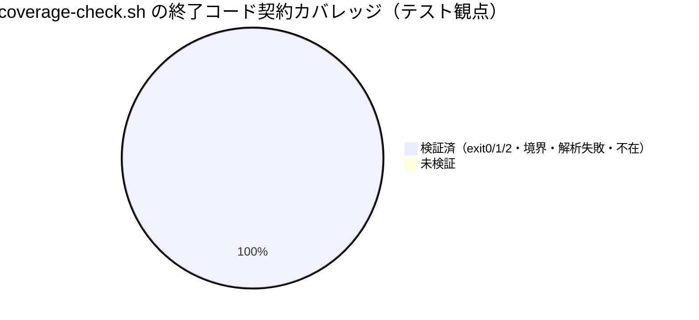

# レビュー書: カバレッジ計測の自リポ適用（100%目標の実効化）

**プロジェクト名**: カバレッジ計測の自リポ適用（100%目標の実効化）
**作成日**: 2026 年 06 月 15 日
**最終更新**: 2026 年 06 月 15 日

> **必須**: レビュー深度は **standard**（新規スクリプト 1 本＋台帳＋CI 配線＋テスト 2 本の中規模変更）。[`.agents/REVIEW_RULE.md`](../../../../../.agents/REVIEW_RULE.md) を参照。
>
> **用語**: [.agents/CONCEPTS.md §用語規約](../../../../../.agents/CONCEPTS.md#用語規約) を参照。

---

## 1. レビュー概要

### 1.1 レビュー目的（必須）

実装内容の確認 / 品質保証 / デプロイ前最終チェック。bash 主体の本リポに kcov カバレッジ計測を CI 配線し、`--fail-under=100` で実効化した実装が 00〜03 の受け入れ基準（SC-1〜SC-7）と配布物正本 COVERAGE_AND_EXCEPTIONS.md の方針に整合するかを検証する。

### 1.2 レビュー対象（必須）

- **実装範囲**: `coverage-check.sh`（kcov ラップ＋fail-under 判定の計測オーケストレータ）新設、例外台帳 `.agents-project/COVERAGE_EXCEPTIONS.md` 新設、`self-enforce.yml` への kcov 導入 step＋coverage step 追加、`.gitignore` への `/.coverage/` 追加、`package.json` の `test` script 追加、`test-coverage-check.sh`/`test-run-all.sh` 追加、`.agents/SETUP.md` 加筆。前提 issue の `run-all.sh` に相乗り。
- **レビュー期間**: 2026-06-15 ～ 2026-06-15
- **レビュー担当者**: verify-and-close サブエージェント（review-architecture / review-code / map-coverage）

---

## 2. 実装内容の確認

### 2.1 実装完了タスク（または Issue）

| タスク名 | 実装内容 | 実装日 | 担当者 | ステータス |
| -------- | -------- | ------ | ------ | ---------- |
| T1 coverage-check.sh | kcov ラップ＋cobertura 後処理＋fail-under 判定の単一スクリプト | 2026-06-15 | implement-feature | 完了 |
| T2 100%定義・除外二重化 | INCLUDE/EXCLUDE 正本変数＋パス単位除外（行 pragma 不使用） | 2026-06-15 | implement-feature | 完了 |
| T3 例外台帳 | `.agents-project/COVERAGE_EXCEPTIONS.md` 必須8列・SAMPLE削除・実データ3行 | 2026-06-15 | implement-feature | 完了 |
| T4 CI 配線・.gitignore | Install kcov step＋Coverage check step 追加、`/.coverage/` 無視 | 2026-06-15 | implement-feature | 完了 |
| T5 閾値・段階導入 | FAIL_UNDER 既定 100・方式1（分母を絞り 100 維持）確定 | 2026-06-15 | implement-feature | 完了 |
| T6 ドッグフーディング整合・監査 | 正本無改変・既存7step/4本後方互換確認 | 2026-06-15 | verify-and-close | 完了 |

### 2.2 実装内容の詳細

#### タスク 1: coverage-check.sh

- **実装内容**: `set -uo pipefail`。正本変数 `INCLUDE_PATHS`/`EXCLUDE_PATHS`/`FAIL_UNDER`(既定100)/`COV_OUT`(既定`.coverage`)/`RUNNER` を 1 か所に集約。`--judge-only`（kcov 非起動・cobertura 解析のみ＝単体テスト入口）と通常モード（kcov ラップ）を分離。率変換・閾値比較は `awk` の整数演算で `bc` 非依存。kcov 不在は `exit 2`(SKIP)・率未達/解析失敗は `exit 1`・達成は `exit 0`。
- **変更ファイル**: `.agents/scripts/test/coverage-check.sh`（新規）
- **実装方法**: runner を kcov でラップし子プロセス（`bash <script>`）を追跡。cobertura の `<coverage line-rate>` から全体率、`<class filename line-rate>` から未達ファイルを抽出。
- **確認事項**: kcov 出力がサブディレクトリに出る場合の `find ... cobertura.xml` 引き上げ処理あり（堅牢）。

#### タスク 3: 例外台帳

- **実装内容**: 必須8列（ID/対象/カテゴリ/理由/代替保証/適用手段/承認/有効期限）。実データ COV-001（テスト自身・カテゴリ1）/COV-002（deploy-skills.sh・カテゴリ4）/COV-003（非実行データ・カテゴリ1）。SAMPLE 行なし。列定義は正本参照で重複なし（DRY）。
- **変更ファイル**: `.agents-project/COVERAGE_EXCEPTIONS.md`（新規）
- **確認事項**: 「適用手段」列の `--exclude-path` パスが coverage-check.sh の `EXCLUDE_PATHS`(`.agents/scripts/test,.agents/scripts/lib/deploy-skills.sh`)と双方向一致（テストで自動検証）。

---

## 3. テスト結果の確認

### 3.1 単体テスト

#### テスト実行結果（必須: 数値で記載）

すべて **tmp 隔離**（`mktemp -d` ＋ `git archive HEAD` クリーンクローン＋working-tree 変更ファイルの反映）で実行。kcov はローカル不在のため kcov ラップ結合のみ SKIP（CI では apt 導入で実行）。

- **実行日**: 2026-06-15
- **テストファイル数**: 6（runner 経由）。うち本 issue 直接関連 2（test-coverage-check.sh / test-run-all.sh）
- **test-coverage-check.sh**: アサーション **PASS=32 / FAIL=0**（kcov ラップ結合 1 件のみ SKIP）
- **test-run-all.sh**: アサーション **PASS=20 / FAIL=0**
- **npm test（run-all.sh 全体）**: **合計=6 PASS=6 FAIL=0 SKIP=0**（クリーン逐次実行で安定再現）
- **coverage-check.sh 直接実行（kcov 不在）**: `exit 2`（SKIP・案内出力・非クラッシュ）を確認
- **失敗**: 0
- **スキップ**: kcov ラップ結合 1 件（kcov 無環境のため。CI で実行される設計どおり）

> **テスト中に観測した非決定事象（参考・本 issue の欠陥ではない）**: 同一 tmp ディレクトリで `npm test` を並行多重起動した 1 回のみ `test-write-workflow-log-prevhash` が transient FAIL したが、標準単独実行（PASS=16/16）およびクリーン逐次 `npm test`（合計=6 PASS=6）では再現せず。tmp クローンの `.workflow/workflow.db` が並行実行で生成された一過性の隔離アーティファクトであり、本 issue の成果物（coverage-check.sh・run-all.sh・台帳・CI）に起因しない。

#### テストカバレッジ

#### 失敗したテスト（該当する場合）

なし（FAIL=0）。

### 3.2 統合テスト

- `npm pack --dry-run`（verify-npm-pack.sh）: **合格**。配布ファイル172・禁止パターン（`.agents-project/`・`docs/maintainer`・`workflow.db`・`.adapters`・`.workflow` issue）なし・必須正本あり。`.agents-project/COVERAGE_EXCEPTIONS.md` は `.agents-project/` 配下のため tarball に**漏れない**ことを確認。
- 生成物リーク: `.coverage/cobertura.xml`/`index.html` を擬似生成 → `git check-ignore` で IGNORED 確認・`git status --porcelain --untracked-files=no` に差分なし・`npm pack` に含まれない。self-enforce #3（差分ゼロ）・#4（pack リーク）を**破らない**。
- self-enforce.yml: **YAML 妥当**（`python3 -c yaml.safe_load` で 12 steps パース成功）。既存検証 7 段が不変、新規 `Install kcov`・`Coverage check (coverage-check.sh)` の 2 step を追加。

### 3.3 E2E テスト

- install/uninstall・カプセル化 E2E（e2e-install-uninstall.sh）: **PASS=88 FAIL=0**（runner 経由）。

---

## 4. コードレビュー

### 4.1 コード品質

- **リント結果**: `bash -n` 構文チェック 4 スクリプトすべて OK / 0 エラー。
- **フォーマット**: 問題なし（TEST_BDD_FORMAT のシナリオ・Given/When/Then インラインコメントあり）。
- **型チェック**: 該当なし（bash）。

#### コードレビュー観点

| 観点 | 確認内容 | 結果 | コメント |
| ---- | -------- | ---- | -------- |
| 可読性 | 冒頭ユースケース・依存マトリクス・終了コード契約コメントが充実。正本変数は意図が読める命名 | OK | AI フレンドリー設計に合致 |
| 保守性 | 閾値・除外・対象を正本変数 1 か所に集約。CI とローカルで二重化なし | OK | CORE 重複禁止に合致 |
| パフォーマンス | 率算出は awk 整数演算（bc 非依存）。kcov は別 step で切り分け可能 | OK | 02 §9.1 と整合 |
| セキュリティ | kcov 導入は apt 経由のみ。破壊的操作・外部書込なし。出力は `.gitignore` 済み | OK | 02 §8 と整合 |

#### テスト観点（BDD インラインコメント）

- `test-coverage-check.sh`・`test-run-all.sh` ともに各テスト本文に `# シナリオ:` と `# Given/When/Then` を記載（TEST_BDD_FORMAT 準拠）。欠落なし。

### 4.2 指摘事項

#### 指摘 1: kcov ラップ結合パスはローカル未検証（SKIP）

- **重要度**: 低
- **指摘内容**: kcov がローカル不在のため、`coverage-check.sh` の kcov ラップ実経路（cobertura 生成・除外が分母から外れる）はローカルでは SKIP となり、CI でのみ実行される。実経路の最終確証は CI 初回実行に依存する。
- **対応状況**: 許容（設計どおり）
- **対応方法**: 制約（kcov 恒久インストール禁止）に従い SKIP を許容。kcov ラップロジックはコード審査で妥当性確認済み（子プロセス追跡・`--include-path`/`--exclude-path`・出力引き上げ）。`test_kcov_wrap_integration` が CI で実行される。初回 CI green を別途確認することを推奨。

#### 指摘 2: #20 document_id 紐付けの欠落を補完（修正済み）

- **重要度**: 中
- **指摘内容**: 監査時、01_要件定義.md の document_id（`e9e685c7-...`）が workflow_log に未記録（requirement-discovery が 00 のみ記録していた）。
- **対応状況**: 完了
- **対応方法**: 書記（write-workflow-log.sh）経由で entry_id `84d14be2` を補完記録。00/01/02/03 すべて rows=1 を確認。詳細は §9.3・§docs 更新 後段参照。

---

## 5. ドキュメントの確認

### 5.1 ドキュメント更新状況

| ドキュメント | 更新状況 | 確認者 | 確認日 |
| ------------ | -------- | ------ | ------ |
| [`00_要求定義.md`](./00_要求定義.md) | 更新済み | verify-and-close | 2026-06-15 |
| [`01_要件定義.md`](./01_要件定義.md) | 更新済み | verify-and-close | 2026-06-15 |
| [`02_設計.md`](./02_設計.md) | 更新済み | verify-and-close | 2026-06-15 |
| [`03_実装計画.md`](./03_実装計画.md) | 更新済み | verify-and-close | 2026-06-15 |

### 5.2 ドキュメントの整合性

- **実装と設計の整合性**: 整合している（02 §5 の I/F 仕様＝終了コード 0/1/2・正本変数・出力規約と実装が一致）。
- **要件と実装の整合性**: 整合している（SC-1〜SC-7 すべて充足。§map-coverage 参照）。
- **コメント**: SETUP.md にローカル一括テスト手順・依存マトリクスを加筆済み。

---

## docs 更新

- 要否: **不要**
- 対象: なし
- 理由: 本 issue は自リポ CI/テスト基盤の追加であり、採用先向けシステム仕様書（`docs/` 配下のユーザー向け仕様）に影響しない。配布物正本 COVERAGE_AND_EXCEPTIONS.md は無改変（SC-7）。SETUP.md（配布物）の加筆は実装成果物として済み。

---

## 9. 設計・境界の確認

### 9.1 設計の確認

- **設計原則の準拠**: UNIX 哲学（runner をラップ＋cobertura 後処理に徹し、テスト駆動を再実装しない）・単一責務（coverage-check.sh は「kcov 実行→解析→判定」のみ）・AI フレンドリー（単一ファイル・正本変数集約）に準拠。02 §1.2 と実装が一致。
- **ディレクトリ構成**: `.agents/scripts/test/` 配下に集約（既存テストと同階層）。台帳は `.agents-project/`（自己拡張消費者の名前空間・正しい）。
- **命名規則**: `coverage-check.sh`・`COVERAGE_EXCEPTIONS.md`・正本変数命名は一貫。

### 9.2 境界・依存の確認

- **責務の境界**: 計測層（coverage-check.sh）／テスト駆動層（run-all.sh・各テスト・無変更）／除外定義（kcov 引数＋台帳）の 3 境界が分離。02 §2.1.2 どおり。
- **依存関係**: CI → coverage-check.sh → kcov → run-all.sh → 各テスト → 対象、の一方向。循環なし。runner・各テストは coverage-check.sh を参照しない（個別実行・既存 CI 維持）。EXCLUDE 対象 `lib/deploy-skills.sh` の実在を確認。
- **指摘・推奨**: 二重化（kcov `--exclude-path` A ↔ 台帳「適用手段」B）はテストで双方向一致を自動検証。片方だけの除外なし（正本 §1 準拠）。

### 9.3 重要判断の根拠（evidence_source）

| 判断内容 | evidence_source | 備考 |
| -------- | --------------- | ---- |
| 終了コード契約（0/1/2・境界・解析失敗）が満たされる | test_output | test-coverage-check.sh PASS=32/FAIL=0（tmp 隔離実行） |
| kcov 不在で exit 2 SKIP・非クラッシュ | observed_runtime | coverage-check.sh 直接実行で exit 2 を観測 |
| 生成物が差分ゼロ・pack リークを破らない | observed_runtime | git check-ignore・npm pack --dry-run で確認 |
| 配布物正本 COVERAGE_AND_EXCEPTIONS.md 無改変（SC-7） | test_output | `git diff main` 空を確認 |
| self-enforce.yml の YAML 妥当・既存7step不変 | test_output | python3 yaml.safe_load で 12 steps パース・既存名/順序保持 |
| #20 紐付け補完が有効 | test_output | scribe 記録後 4 docs rows=1・scoped audit で #20 ERROR 0 |
| kcov ラップ実経路 | existing_code | ローカル kcov 不在のため SKIP。コード審査で妥当性確認（指摘1） |

### 敵対的観点リスト（REVIEW_DUAL_LENS §3）

1. **率=閾値の境界**で fail しないか → test_judge_boundary_equal（率90=閾値90で exit 0）で PASS。閾値直下（89.9%）は exit 1 で PASS。
2. **kcov 不在でクラッシュ**しないか → exit 2 SKIP・案内出力を観測。`set -uo pipefail` 下でも握りつぶさず終了コードで表現。
3. **cobertura 不正・空**を握りつぶさないか → 解析失敗で exit 1・診断（line-rate/不在）出力を確認（計測失敗の隠蔽なし）。
4. **片方だけの除外（A だけ・B だけ）**が混入しないか → 台帳⇔EXCLUDE_PATHS 双方向一致テスト（B→A・A→B）で PASS。
5. **生成物が tarball/追跡に漏れる**か → `.coverage/` gitignore・pack 不含を実測。漏れなし。
6. **閾値の恒久的引き下げ**で骨抜きにならないか → FAIL_UNDER 既定 100、台帳に方式2は未採用と明記。段階導入は分母を絞る方式1で閾値 100 を維持。
7. **配布物正本の改変**で自リポ都合をルールに混ぜないか → COVERAGE_AND_EXCEPTIONS.md は `git diff main` 空（無改変）。
8. **kcov ラップ実経路の未検証**（最大リスク） → ローカル SKIP。CI 初回 green の別途確認を推奨（指摘1・残存・低）。

### must-preserve リスト（REVIEW_DUAL_LENS §3）

1. self-enforce.yml の**既存検証 7 step**（構文・schema・差分ゼロ・pack・version・E2E・audit）の名前・順序・ロジック → 不変を確認（追加のみ）。
2. 既存テスト 4 本（test-audit / test-pretooluse-hook / test-write-workflow-log-prevhash / e2e-install-uninstall）の**個別実行可能性・終了コード** → 構文 OK・runner 経由 PASS で不変。
3. 前提 issue の `run-all.sh` I/F（引数なし・exit 0/1・exit2=SKIP） → coverage-check.sh は変更せずラップのみ。
4. 配布物正本 COVERAGE_AND_EXCEPTIONS.md の根幹方針（100%・例外二重化・台帳列定義） → 無改変。
5. 00/01/02/03 の frontmatter document_id → 不変（DB 記録のみ追加、本体未編集）。
6. 本番 `.workflow/workflow.db`・開発リポの追跡ファイル → 計測・テストは tmp 隔離。書記の 1 行 INSERT 以外の改変なし。

---

## 10. 課題と改善点

### 10.1 発見された課題

- **課題 1**: kcov ラップ実経路がローカル未検証（SKIP）。
  - **影響範囲**: 計測の実動作確証が CI 初回実行に依存。
  - **対応方法**: CI 初回 green を別途確認（push 後）。本レビューでは設計・コード審査で妥当性を担保。

### 10.2 改善提案

- **改善 1**: 台帳⇔EXCLUDE_PATHS の自動突合は test-coverage-check.sh で実現済みだが、将来 kcov の `--exclude-pattern` を使う場合のパターン一致検証は後続 issue 候補（02 §3.2.4 で言及済み）。

---

## 受け入れ基準（SC）の確認（map-coverage）

| 成功基準 | 検証方法 | 結果 |
| -------- | -------- | ---- |
| **SC-1 計測** | coverage-check.sh が kcov ラップで cobertura を生成。CI Coverage check step あり | OK（CI 配線済・kcov ラップ実装あり。ローカルは kcov 不在で SKIP） |
| **SC-2 矯正** | 率<閾値で exit 1。test_judge_under_fail / boundary_just_under で PASS。CI step が exit 伝播 | OK |
| **SC-3 台帳** | 必須8列・SAMPLE削除・実データ3行・kcov除外と双方向一致 | OK（test-coverage-check.sh で自動検証 PASS） |
| **SC-4 候補比較** | 00 §2.2(a)・01 ストーリー1・02 §3.1.2 に kcov/bashcov/組込トレースの比較と却下理由 | OK |
| **SC-5 100%定義** | 00/01/02 §3.2.2 に計測対象＝実行ロジック bash／除外＝非実行データを明記 | OK |
| **SC-6 前提整合** | 02 §3.4・run-all.sh I/F に相乗り。RUNNER 変数でラップ。runner 無変更 | OK |
| **SC-7 ドッグフーディング整合** | COVERAGE_AND_EXCEPTIONS.md 無改変（git diff main 空）。fail-under=100・二重化・台帳列が正本方針と対応 | OK |

**最終閾値 100・段階導入の妥当性評価**: 妥当。`FAIL_UNDER` 既定は 100（正本 §1「閾値を下げない」に整合）。段階導入は「閾値を下げる」のではなく**分母を絞る方式1**（駆動済み対象に include を限定し、未駆動は台帳付き除外＋テスト追加で順次 include 拡大）を既定とし、台帳にも方式2（期限付き過渡値）は未採用と明記。これにより「とりあえず広域 ignore で骨抜き」を回避しつつ初期導入の常時 fail を避ける設計で、正本の禁止パターン（§1.1）と矛盾しない。除外は kcov パス指定（A）＋台帳（B）の二重化のみ・行 pragma 不使用（bash に公式手段なし）で、片方だけの除外をテストで禁止している点も妥当。

---

## 12. レビュー結果

### 12.1 総合評価

- **実装品質**: 良好（単一責務・正本集約・終了コード契約が明確、テスト厚い）。
- **テスト品質**: 良好（境界値・解析失敗・SKIP・二重化整合・回帰を網羅。tmp 隔離徹底）。
- **ドキュメント品質**: 良好（00〜03 整合、SETUP 加筆、台帳 DRY）。
- **総合評価**: **承認（合格）**。残存指摘は kcov ラップ実経路の CI 初回確認のみ（低）。

### 12.2 承認状況

- **レビュー承認者**: verify-and-close サブエージェント
- **承認日**: 2026-06-15
- **承認コメント**: SC-1〜SC-7 充足・配布物正本無改変・既存7step/4本後方互換・#20 紐付け補完済み・生成物リークなしを確認。kcov ラップ実経路は CI 初回 green を別途確認のこと。

---

## 13. 参考資料

- [`00_要求定義.md`](./00_要求定義.md) / [`01_要件定義.md`](./01_要件定義.md) / [`02_設計.md`](./02_設計.md) / [`03_実装計画.md`](./03_実装計画.md)
- 配布物正本: [`.agents/COVERAGE_AND_EXCEPTIONS.md`](../../../../../.agents/COVERAGE_AND_EXCEPTIONS.md)
- 計測スクリプト: `.agents/scripts/test/coverage-check.sh` / 例外台帳: `.agents-project/COVERAGE_EXCEPTIONS.md`
- CI: [`.github/workflows/self-enforce.yml`](../../../../../.github/workflows/self-enforce.yml)

---

## 14. 前のステップ

- **前**: [`03_実装計画.md`](./03_実装計画.md) - 実装計画フェーズ
