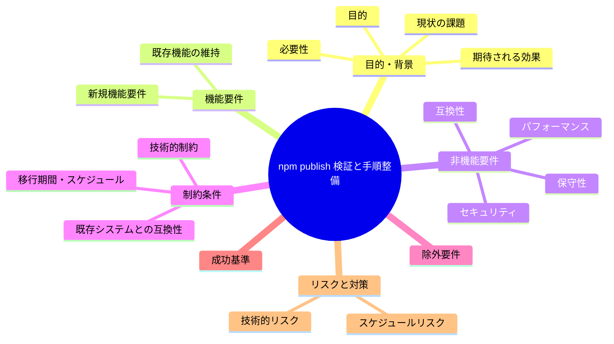
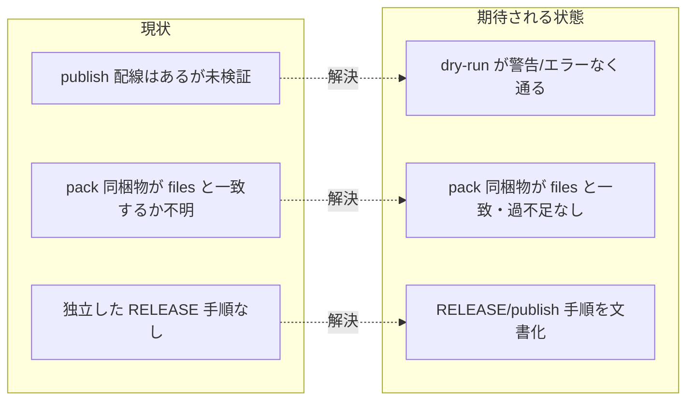

# 要求定義書: npm publish の実施可能性検証と手順整備

**プロジェクト名**: npm publish の実施可能性検証と手順整備
**作成日**: 2026 年 06 月 15 日
**最終更新**: 2026 年 06 月 15 日

> **重要**:
>
> - 要求定義書は、プロジェクトの全体像を把握するためのものです。詳細な技術仕様や実装方法は要件定義書以降で記載します。必要最低限の情報に収めることを心掛けてください。
> - **このドキュメントは常に更新**: 要求の変更や追加があった場合は、即座にこのドキュメントを更新してください。
> - **必須項目**: 「必須」項目は判定可能な形で記入すること。
>
> **用語**: [.agents/CONCEPTS.md §用語規約](../../../../../.agents/CONCEPTS.md#用語規約) を参照。

---

## 要求定義の全体像

**注意**:

- マインドマップは全体像の把握用。詳細は各節に記載する。

---

## 1. 目的・背景

### 1.1 目的（必須）

publish 配線の健全性を非破壊で検証し RELEASE 手順を文書化する。

### 1.2 背景

- **現状の課題**:
  - `package.json`（`@techbeansjp-free/agents-md`・`bin`・`files`・`publishConfig.access=public`）・`LICENSE`(MIT)・CLI（`bin/agents-md.js`）・E2E は揃い、「npm publish 配線」コミット（`59fe5cf` publish/marketplace 確定）も済んでいるが、**実際に publish できるか（`npm pack` / `npm publish --dry-run` の健全性）が一度も検証されていない**。
  - publish 関連の部品（`.agents/scripts/verify-npm-pack.sh`・`.agents/scripts/sync-version.sh`・`.github/workflows/release.yml`）は存在し、README に簡易なリリース手順（§リリース手順（メンテナ向け））もあるが、**独立した RELEASE / publish 手順ドキュメントが存在せず、手順が一度も実機検証されていない**。
  - その結果、`npx @techbeansjp-free/agents-md` が今正しく動作する保証がない（同梱漏れ・`bin` 実行権限・shebang・scoped public 設定の妥当性が未確認）。
  - `.npmignore` は存在せず、配布物の範囲は `package.json` の `files` のみで制御されている。`files` 定義と `npm pack` の実同梱物が一致するかは未検証。

- **必要性**:
  - 公開前に「pack 同梱物が `files` 定義と一致し過不足がない」「`publish --dry-run` が警告・エラーなく通る」ことを確認しないと、壊れたパッケージや機密漏れを公開するリスクがある。
  - 実 publish は外部書き込み・npm 認証を伴うため、検証と手順整備を先に完了させ、実 publish はユーザー承認のうえ別途実施できる状態にする必要がある。

### 1.3 期待される効果（必須: 1 件以上）

- **効果 1**: `npm pack` の同梱物が `package.json` の `files` 定義と一致し過不足がないことが客観的に判定できる（`verify-npm-pack.sh` 合格・出力で○/×判定可能）。
- **効果 2**: `npm publish --dry-run` が警告・エラーなく完了することが確認でき、実 publish 可能性が裏付けられる。
- **効果 3**: RELEASE / publish 手順がドキュメント化され、メンテナが手順に従って（ユーザー承認後に）実 publish を実施できる。

**現状と期待される状態の比較**:

---

## 2. 機能要件

### 2.1 既存機能の維持（該当する場合）

- 既存の `package.json` の `files`・`bin`・`publishConfig`、`verify-npm-pack.sh`・`sync-version.sh`・`release.yml`・README のリリース手順節は、本 issue で**破壊しない**。検証で問題が見つかった場合のみ最小限の修正を提案する（実施はレビュー後）。

### 2.2 新規機能要件

- `npm pack`（dry-run / 実 pack）の同梱物検証: `files` 定義との一致・過不足・禁止パターン非混入（`verify-npm-pack.sh` の活用）。
- `npm publish --dry-run` の健全性確認: 警告・エラーの有無、scoped public 設定の妥当性。
- `bin/agents-md.js` の実行権限・shebang の妥当性、CLI 起動可否（同梱物からの起動確認）。
- RELEASE / publish 手順のドキュメント化（実 publish はユーザー承認前提として記載に留める）。

---

## 3. 非機能要件

### 3.1 パフォーマンス

- 検証は短時間（ローカルで数分以内）に完了し、CI（`release.yml`）の既存検証ステップと矛盾しないこと。

### 3.2 セキュリティ

- 配布物に機密・リポ固有物（`.agents-project/`・`docs/maintainer/`・`workflow.db`・`.adapters/`・`.workflow/` の issue）が含まれないこと（`verify-npm-pack.sh` の禁止パターンと整合）。
- 実 publish は npm 認証情報を伴う外部書き込みであり、本 issue では**実施しない**（手順記載のみ）。

### 3.3 互換性

- `npx @techbeansjp-free/agents-md init` 等の利用者導線（README 記載）と整合すること。Node `>=20`（`engines`）前提を崩さないこと。

### 3.4 保守性

- 検証ロジックは既存の単一正本（`verify-npm-pack.sh`）を再利用し二重化しない。RELEASE 手順は README の既存節と矛盾せず、正本を 1 か所に保つ（重複記述を避ける）。

---

## 4. 制約条件

### 4.1 技術的制約

- 検証は `npm pack --dry-run` / `npm publish --dry-run` / `npm pack`（tarball 展開確認）に限定し、**実 publish（`npm publish` 本実行）は禁止**。
- 検証は一時ディレクトリ（`mktemp -d`）で隔離して行い、本リポの `.agents/` `.claude/` `.cursor/` `.workflow/` `workflow.db` を変更・破壊しない（[.agents-project/自己拡張ワークフロー.md §テストの tmp 隔離](../../../../../.agents-project/自己拡張ワークフロー.md)）。
- npm が無い環境では検証を成立させられないため、前提（npm >=7・node >=20）を明示する。

### 4.2 既存システムとの互換性

- `package.json` の `files`・`publishConfig`、`verify-npm-pack.sh`、`release.yml` の既存仕様と整合させ、矛盾する変更は加えない。

### 4.3 移行期間・スケジュール

- 単発の検証・文書化 issue。実 publish のスケジュールは本 issue の範囲外（ユーザー承認後に別途）。

---

## 5. 除外要件

- **実 publish の実施**（`npm publish` 本実行・npm 認証・`NPM_TOKEN` 設定・タグ push による CI publish 発火）は本 issue の対象外。手順記載に留める。
- marketplace 公開（`release/marketplace` ブランチ生成）の実機検証は対象外（publish 検証に集中）。
- バージョン番号の確定・bump（`0.1.0` からの変更）は対象外。

---

## 6. 成功基準（必須: 1 件以上）

- **SC-1**: `npm pack` の同梱物が `package.json` の `files` 定義と一致し、過不足がない（`verify-npm-pack.sh` が合格＝禁止パターン 0 件・必須物すべて存在）。○/×判定可。
- **SC-2**: `npm publish --dry-run` が警告・エラーなく完了する（出力に error/warn がない）。○/×判定可。
- **SC-3**: `bin/agents-md.js` が同梱され、実行権限・shebang が妥当で、同梱物から CLI（`help`/`version` 等）が起動できる。○/×判定可。
- **SC-4**: RELEASE / publish 手順がドキュメント化され、実 publish は「ユーザー承認前提」と明記される。○/×判定可。

---

## 7. リスクと対策

### 7.1 技術的リスク

- **リスク**: `files` 定義と実同梱物に齟齬があり、同梱漏れ・余剰混入が見つかる。
  - **対策**: `verify-npm-pack.sh` で機械判定し、齟齬は修正提案としてレビューに回す（本 issue では検証・記録を優先）。
- **リスク**: `bin/agents-md.js` の実行権限・shebang が tarball で失われ `npx` が動かない。
  - **対策**: `npm pack` で生成した tarball を展開し権限・shebang・起動を確認する。
- **リスク**: 検証中に誤って実 publish や本リポへの自己インストールを行い破壊する。
  - **対策**: 実 publish は禁止（dry-run / pack のみ）。検証は `mktemp -d` 隔離で行う。

### 7.2 スケジュールリスク

- **リスク**: npm 環境が未整備で dry-run が実行できない。
  - **対策**: 前提（npm/node 版）を明示し、不足時は doctor 相当の前提確認を先行させる。

---

## 8. 参考資料

### プロジェクトドキュメント

- [docs/maintainer/workflow/close/20260614_124435_配布とパッケージ構成の再設計/](../20260614_124435_配布とパッケージ構成の再設計/) - 配布・パッケージ構成の再設計（publish 配線の親 issue）
- `.agents/scripts/verify-npm-pack.sh` - pack 同梱物検証の単一正本
- `.agents/scripts/sync-version.sh` - version 同期（package.json／plugin.json）
- `.github/workflows/release.yml` - タグ push による publish/marketplace CI
- `README.md` §リリース手順（メンテナ向け） - 既存の簡易リリース手順

### その他の参考資料

- `package.json`（`files`・`bin`・`publishConfig`）、`LICENSE`（MIT）、`bin/agents-md.js`

---

## 9. 次のステップ

この要求定義書の承認後、以下のドキュメントを作成します：

- **次**: [`01_要件定義.md`](./01_要件定義.md) - 要件定義フェーズ
