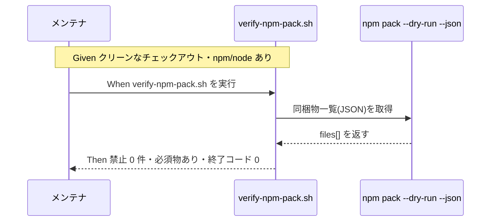
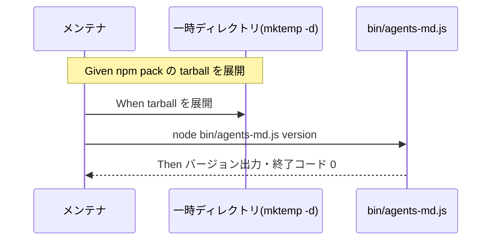

# 要件定義書: npm publish の実施可能性検証と手順整備

**プロジェクト名**: npm publish の実施可能性検証と手順整備
**作成日**: 2026 年 06 月 15 日
**最終更新**: 2026 年 06 月 15 日

> **重要**: **このドキュメントは常に更新**: 要件の変更や追加があった場合は、即座にこのドキュメントを更新してください。
>
> **用語**: [.agents/CONCEPTS.md §用語規約](../../../../../.agents/CONCEPTS.md#用語規約) を参照。

---

## 1. 概要

### 1.1 システム概要

`@techbeansjp-free/agents-md` を npm へ publish する前段として、**実 publish を行わずに**配布物の健全性を検証し、RELEASE / publish 手順をドキュメント化する。検証対象は `npm pack` の同梱物（`files` 定義との一致）、`npm publish --dry-run` の警告/エラー有無、`bin/agents-md.js` の実行権限・shebang・CLI 起動可否、scoped public 設定（`publishConfig.access=public`）の妥当性。検証ロジックは既存の単一正本 `.agents/scripts/verify-npm-pack.sh` を再利用する。実 publish はユーザー承認を前提とした手順記載に留める。

### 1.2 用語集

| 用語 | 説明 |
| -------- | ------ |
| dry-run | `--dry-run` フラグ付き実行。実際の公開（外部書き込み）を行わず、何が起きるかだけを検査するモード。 |
| pack 同梱物 | `npm pack` が tarball に含めるファイル群。`package.json` の `files` フィールドと既定包含物（README/LICENSE/package.json 等）で決まる。 |
| scoped public | scope 付きパッケージ（`@techbeansjp-free/...`）を公開公開する設定。既定は非公開のため `publishConfig.access=public` が必要。 |
| RELEASE 手順 | メンテナがリリース（version 同期→タグ push→CI publish）を行う文書化された手順。 |

---

## 2. 機能要件

### 2.1 ユーザーストーリー

#### ストーリー 1: pack 同梱物の検証

- **As a** パッケージのメンテナ
- **I want to** `npm pack` の同梱物が `package.json` の `files` 定義と一致し過不足がないことを確認したい
- **So that** 同梱漏れや機密・リポ固有物の混入がない状態で公開できる

**受け入れ基準**:

- `verify-npm-pack.sh` を実行し、禁止パターン（`.agents-project/`・`docs/maintainer/`・`workflow.db`・`.adapters/`・`.workflow/` の issue）が 0 件であること。
- 必須物（`.agents/`・`AGENTS.md`・`CLAUDE.md`・`bin/agents-md.js`・`README.md`・`package.json`・`.workflow/templates/`）がすべて同梱されること。
- 同梱物一覧が `package.json` の `files` 定義（`.agents/`・`AGENTS.md`・`CLAUDE.md`・`.workflow/templates/`・`bin/`・`README.md`）＋既定包含物の範囲と一致すること。

#### ストーリー 2: publish dry-run の健全性確認

- **As a** パッケージのメンテナ
- **I want to** `npm publish --dry-run` が警告・エラーなく完了することを確認したい
- **So that** 実 publish が成功する見込みを公開前に裏付けられる

**受け入れ基準**:

- `npm publish --dry-run` がエラーなく終了する（終了コード 0）。
- 出力に解決すべき警告（例: 不正な `files`・欠落フィールド）がない。
- scoped public 設定（`publishConfig.access=public`）が dry-run 上で有効に解釈される。

#### ストーリー 3: CLI 同梱・起動性の確認

- **As a** パッケージ利用者
- **I want to** `npx @techbeansjp-free/agents-md` が正しく起動すること
- **So that** 公開後に init/help/version 等のコマンドが動く

**受け入れ基準**:

- tarball に `bin/agents-md.js` が含まれ、shebang（`#!/usr/bin/env node`）が保持される。
- 実行権限が妥当である（`npm` の `bin` 解決で実行可能になる）。
- 同梱物を展開した環境で CLI（`help`/`version`）が起動し、想定どおり出力する。

#### ストーリー 4: RELEASE / publish 手順の文書化

- **As a** パッケージのメンテナ
- **I want to** 検証結果を踏まえた RELEASE / publish 手順を文書として参照したい
- **So that** ユーザー承認のうえ手順に従って実 publish を実施できる

**受け入れ基準**:

- RELEASE / publish 手順が文書化される（既存 README §リリース手順と矛盾せず、正本の重複を避ける）。
- 手順に「実 publish はユーザー承認前提」「`NPM_TOKEN` 等の認証前提」「本 issue では dry-run/pack のみ実施し実 publish は行わない」旨が明記される。

### 2.2 BDD ユースケース

#### ユースケース 1: pack 同梱物の検証

`verify-npm-pack.sh` で `npm pack --dry-run --json` の同梱物一覧を機械判定する。

**シナリオ 1: 同梱物が files 定義と一致する**

```gherkin
Feature: pack 同梱物の検証
  Scenario: 禁止パターンが無く必須物がすべて含まれる
    Given クリーンなリポジトリのチェックアウトと npm(>=7)/node(>=20)
    When bash .agents/scripts/verify-npm-pack.sh を実行する
    Then 終了コードが 0 である
    And 禁止パターン（.agents-project/ 等）が 0 件と報告される
    And 必須物（.agents/・AGENTS.md・CLAUDE.md・bin/agents-md.js・README.md・package.json・.workflow/templates/）がすべて含まれると報告される
```

**処理フロー**:



**シナリオ 2: 禁止パターンが混入していれば失敗する**

```gherkin
Feature: pack 同梱物の検証
  Scenario: リポ固有物が同梱されると検査が失敗する
    Given files 定義の不備で docs/maintainer 等が同梱される状態
    When bash .agents/scripts/verify-npm-pack.sh を実行する
    Then 終了コードが非ゼロである
    And LEAK として混入ファイルが報告される
```

#### ユースケース 2: publish dry-run の健全性確認

実公開せずに publish の警告/エラーを検査する。

**シナリオ 1: dry-run が警告・エラーなく通る**

```gherkin
Feature: publish dry-run
  Scenario: 警告・エラーなく dry-run が完了する
    Given リポジトリルートで npm 認証なし（dry-run のため不要）
    When npm publish --dry-run を実行する
    Then 終了コードが 0 である
    And 解決すべき警告・エラーが出力されない
    And publishConfig.access=public が反映された公開対象として表示される
```

#### ユースケース 3: CLI 同梱・起動性の確認

tarball を展開し CLI が動くことを隔離環境で確認する。

**シナリオ 1: 展開した CLI が起動する**

```gherkin
Feature: CLI 同梱・起動性
  Scenario: tarball を展開して help/version が動く
    Given npm pack で生成した tarball を mktemp -d 配下に展開した状態
    When 展開した bin/agents-md.js を node で help または version 実行する
    Then shebang と実行権限が保持されている
    And help/version が想定どおり出力され終了コードが 0 である
```

**処理フロー**:



#### ユースケース 4: RELEASE / publish 手順の文書化

検証結果を踏まえ手順を文書化する。

**シナリオ 1: 手順が文書化され実 publish はユーザー承認前提と明記される**

```gherkin
Feature: RELEASE 手順の文書化
  Scenario: 手順文書に実 publish の前提が明記される
    Given 検証（pack/dry-run/CLI）が完了している
    When RELEASE / publish 手順を文書化する
    Then version 同期→タグ push→CI publish の手順が記載される
    And 実 publish はユーザー承認前提・NPM_TOKEN 必須・本 issue では実施しない旨が明記される
    And 既存 README §リリース手順と矛盾しない
```

### 2.3 ビジネスルール

- 実 publish（`npm publish` 本実行）は本 issue では**行わない**。dry-run / pack のみ。
- 検証は `mktemp -d` で隔離し、本リポの管理物（`.agents/`・`.claude/`・`.cursor/`・`.workflow/`・`workflow.db`）を破壊しない。
- 検証ロジックは `verify-npm-pack.sh` の単一正本を再利用し二重化しない。

---

## 3. 非機能要件

### 3.1 パフォーマンス要件

- ローカル検証一式（pack・dry-run・CLI 起動）が数分以内に完了する。

### 3.2 セキュリティ要件

- 配布物に機密・リポ固有物が含まれない（`verify-npm-pack.sh` 禁止パターン 0 件）。
- 実 publish の認証情報（`NPM_TOKEN` 等）は本 issue で扱わない（手順記載のみ）。

### 3.3 ユーザビリティ要件

- 検証手順・RELEASE 手順が再現可能な形（実行コマンドと期待結果）で記述される。

### 3.4 可用性要件

- 検証は npm/node が利用可能な環境で再実行でき、CI（`release.yml`）の既存検証と整合する。

---

## 4. 外部インターフェース要件

### 4.1 API 要件

- npm CLI: `npm pack [--dry-run] [--json]`、`npm publish --dry-run`。npm >=7 を前提とする。
- Node ランタイム: `engines.node >=20`。

### 4.2 データ形式要件

- `npm pack --dry-run --json` の出力（`files[].path` を含む JSON）を `verify-npm-pack.sh` が解析する。

---

## 5. 制約事項

- **実 publish 禁止**（dry-run / pack のみ）。実 publish はユーザー承認前提の手順記載に留める。
- 検証は `mktemp -d` 隔離で実施し、自己インストール・本番ファイルへの実行を行わない（[.agents-project/自己拡張ワークフロー.md §テストの tmp 隔離](../../../../../.agents-project/自己拡張ワークフロー.md)）。
- 既存の `package.json` の `files`/`bin`/`publishConfig`・`verify-npm-pack.sh`・`release.yml`・README リリース手順節を破壊しない。修正が必要なら提案に留めレビュー後に実施する。
- `.npmignore` は存在せず配布範囲は `files` のみで制御される。必要性が判明した場合は提案に留める。

---

## 6. 参考資料

### プロジェクトドキュメント

- [`00_要求定義.md`](./00_要求定義.md) - 要求定義
- [docs/maintainer/workflow/close/20260614_124435_配布とパッケージ構成の再設計/](../20260614_124435_配布とパッケージ構成の再設計/) - publish 配線の親 issue
- `.agents/scripts/verify-npm-pack.sh`・`.agents/scripts/sync-version.sh`・`.github/workflows/release.yml`・`README.md` §リリース手順（メンテナ向け）

### その他の参考資料

- `package.json`（`files`・`bin`・`publishConfig`）、`LICENSE`（MIT）、`bin/agents-md.js`

---

## 7. 前のステップ

この要件定義書は、以下のドキュメントを基に作成されています：

- **前**: [`00_要求定義.md`](./00_要求定義.md) - 要求定義フェーズ

---

## 8. 次のステップ

この要件定義書の承認後、以下のドキュメントを作成します：

- **次**: [`02_設計.md`](./02_設計.md) - 設計フェーズ
