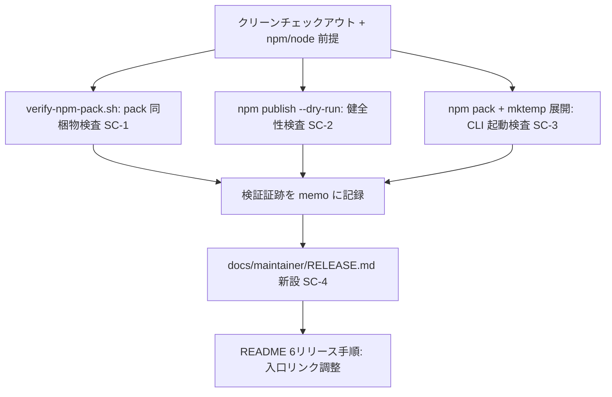
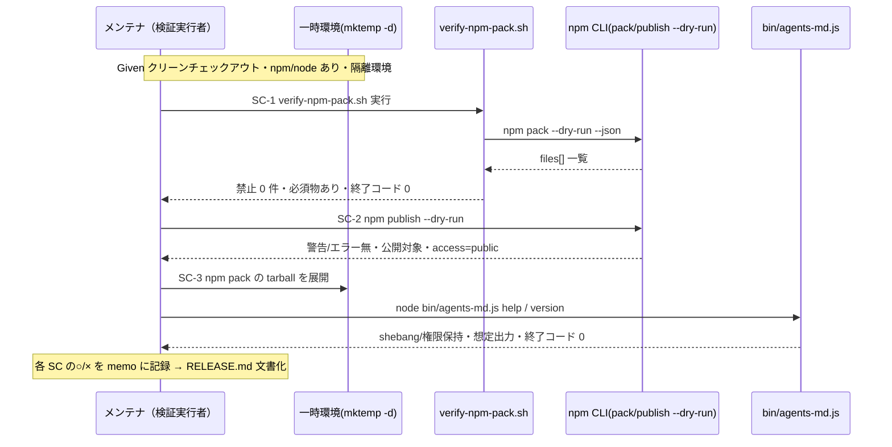
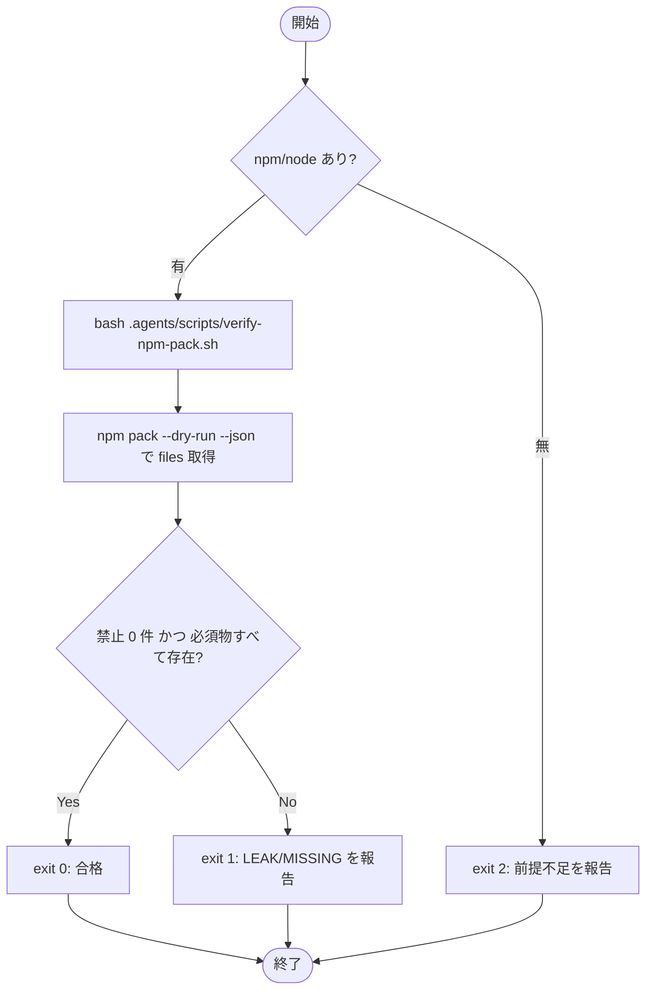

# 設計書: npm publish の実施可能性検証と手順整備

**プロジェクト名**: npm publish の実施可能性検証と手順整備
**作成日**: 2026 年 06 月 15 日
**最終更新**: 2026 年 06 月 15 日

> **重要**: **このドキュメントは常に更新**: 設計の変更や追加があった場合は、即座にこのドキュメントを更新してください。ドキュメントは「生きているドキュメント」として扱い、実装内容と常に同期させます。
>
> **用語**: [.agents/CONCEPTS.md §用語規約](../../../../../.agents/CONCEPTS.md#用語規約) を参照。

---

## 1. 設計概要

**必須**: 設計方針・原則は [.agents/spec/01\_設計原則.md](../../../../../.agents/spec/01_設計原則.md) を**先に参照**した上で、本プロジェクトに**適用するものを選び**記載した。

### 1.1 設計方針

実 publish を行わず（dry-run / pack のみ）に配布物の健全性を**既存の単一正本スクリプトで非破壊検証**し、検証結果を踏まえた RELEASE / publish 手順を**正本 1 か所**に文書化する。検証はすべて `mktemp -d` 隔離で行い、本リポの管理物を破壊しない。

### 1.2 設計原則（本プロジェクトで適用するもの）

[.agents/spec/06\_設計判断の優先順位.md](../../../../../.agents/spec/06_設計判断の優先順位.md)（1. 可読性 / 2. 単一責務 / 3. 仕様との整合性 / 5. 保守性）に沿う。

- **UNIX哲学**: 検証は「pack 同梱物検査」「dry-run 検査」「CLI 起動検査」を**小さな独立ステップ**に分け、それぞれが 1 つの判定だけを担う。組み合わせて RELEASE 手順の前提検証フローを構成する。
- **単一責務**: pack 同梱物の検査ロジックは既存の `verify-npm-pack.sh` **1 か所のみ**に置き二重化しない。version 整合は `sync-version.sh` 1 か所。本 issue で新規ロジックを増やさず、検証フロー（手順）の文書化に徹する。
- **明確な境界**: 「検証（read-only / dry-run）」と「実 publish（外部書き込み）」の境界を明示し、本 issue は前者のみを対象とする。RELEASE 手順文書では後者を「ユーザー承認前提」として明確に区切る。
- **AIフレンドリー設計**: RELEASE 手順は小さな手順節（前提→version 同期→pack 検査→dry-run→（承認後）publish）に分け、各ステップに実行コマンドと期待結果を併記する。

---

## 2. アーキテクチャ設計

### 2.1 責務・境界・参照関係

[.agents/spec/01\_設計原則.md §明確な境界・§単一責務](../../../../../.agents/spec/01_設計原則.md) に従い、本 issue が扱うコンポーネントの責務・境界・参照関係を明示する。

#### 2.1.1 責務一覧

| コンポーネント | 責務（1 文） |
| -------------------- | -------------------- |
| `verify-npm-pack.sh`（既存・再利用） | `npm pack --dry-run --json` の同梱物一覧を検査し、禁止パターン 0 件・必須物すべて存在を assert する（SC-1）。 |
| `npm publish --dry-run`（npm CLI・直接利用） | 実公開せず publish の警告/エラーと公開対象・access を検査する（SC-2）。 |
| pack tarball 展開＋CLI 起動確認（検証手順） | `npm pack` 生成 tarball を `mktemp -d` へ展開し、`bin/agents-md.js` の shebang・実行権限・`help`/`version` 起動を確認する（SC-3）。 |
| `docs/maintainer/RELEASE.md`（新設・正本） | メンテナ向け RELEASE / publish 手順の**詳細正本**。前提→version 同期→pack 検査→dry-run→（承認後）publish を記述する（SC-4）。 |
| README §リリース手順（既存・従属） | RELEASE.md への入口リンクと最小要約のみを保持し、詳細は重複させない。 |
| `sync-version.sh`（既存・参照） | package.json と plugin.json の version 整合を担保する（RELEASE 手順の前提ステップとして参照）。 |
| `release.yml`（既存・参照） | タグ push による CI publish/marketplace の正本。RELEASE 手順から参照し本 issue では変更しない。 |

#### 2.1.2 境界

- **入力**: クリーンなリポジトリのチェックアウト、npm（>=7）/ node（>=20）。
- **出力**: 検証証跡（pack 同梱物の○/×・dry-run の○/×・CLI 起動の○/×を memo に記録）、新設 `docs/maintainer/RELEASE.md`、README §リリース手順の入口リンク調整。
- **他責務との境界**: **実 publish（`npm publish` 本実行・`NPM_TOKEN` 設定・タグ push による CI publish 発火）は本 issue の範囲外**（手順記載のみ）。marketplace 公開の実機検証・version bump も範囲外（00 §5・01 §5）。検証ロジックの新規実装も範囲外（既存正本を再利用）。

#### 2.1.3 参照関係

- 検証手順 → `verify-npm-pack.sh` → `npm pack --dry-run --json`（同梱物一覧）。
- 検証手順 → `npm publish --dry-run`（npm CLI）。
- CLI 起動検証 → `npm pack`（tarball）→ `mktemp -d` 展開 → `node .../bin/agents-md.js help|version`。
- `docs/maintainer/RELEASE.md` → `sync-version.sh`・`verify-npm-pack.sh`・`release.yml`・README §リリース手順 を参照（正本を引用しロジックは再記述しない）。
- README §リリース手順 → `docs/maintainer/RELEASE.md`（詳細の正本へ委譲）。
- 循環参照なし。README は RELEASE.md を入口として参照し、RELEASE.md は既存スクリプト/CI を参照する一方向。

### 2.2 システムアーキテクチャ

**必須**: 設計判断は [.agents/spec/](../../../../../.agents/spec/)（[00_spec概要.md](../../../../../.agents/spec/00_spec概要.md)、[01\_設計原則.md](../../../../../.agents/spec/01_設計原則.md)、[06\_設計判断の優先順位.md](../../../../../.agents/spec/06_設計判断の優先順位.md)）を参照した。

- **採用パターン**: パイプライン型検証フロー（独立した read-only / dry-run 検査ステップを順に実行し、各ステップが単一の○/×判定を出す）。新規ランタイムコンポーネントは追加しない（既存スクリプト＋npm CLI＋ドキュメントの構成）。
- **根拠**: 06 の優先順位（単一責務・仕様との整合性・保守性）に従い、検証ロジックを増やさず既存正本を再利用する。可読性を最優先し、手順を小さなステップに分けて再現可能にする。

#### 2.2.1 CQRS（Command/Query 分離）

本 issue の検証はすべて **Query（状態を変えない読み取り/検査）** に限定する。

- **Query**: `npm pack --dry-run`、`npm publish --dry-run`、tarball 展開＋CLI `help`/`version`、version 整合 `--check`。
- **Command（範囲外）**: 実 publish（`npm publish`）・タグ push・`sync-version.sh --write` による plugin.json 書き換え。これらは RELEASE 手順に記載するのみで本 issue では実行しない。

#### 2.2.2 アーキテクチャ図（本プロジェクトの構成で記載）

### 2.3 コンポーネント構成

明確な境界（検証ステップ群 / ドキュメント正本 / 既存スクリプト・CI 参照）で構成し、各要素は単一責務を満たす。

- **検証ステップ群（read-only / dry-run）**: SC-1〜SC-3 を担う 3 つの独立ステップ。すべて `mktemp -d` 隔離で実行し本リポを破壊しない。新規コードは持たず既存正本と npm CLI を呼ぶだけ。
- **ドキュメント正本 `docs/maintainer/RELEASE.md`（新設）**: RELEASE / publish 手順の詳細正本（SC-4）。既存 `docs/maintainer/`（`adapters.md`・`IMPLEMENTATION_REVIEW.md`）と同じ名前空間に置き、保守者向け記録として git 追跡する。
- **README §リリース手順（既存・調整）**: 詳細を RELEASE.md に委譲し、入口リンク＋最小要約のみを保持。正本の重複を避ける（01 §2.1 ストーリー4 受け入れ基準）。

### 2.4 データフロー

イベント駆動は導入しない（単純な同期検証で十分。06 §原則）。検証は次の順で進む。

---

## 3. 機能設計

### 3.1 機能 1: pack 同梱物検証（SC-1）

#### 3.1.1 概要

`verify-npm-pack.sh` を実行し、配布物 tarball に禁止パターン（リポ固有物）が混入せず必須物がすべて含まれることを機械判定する。

#### 3.1.2 処理フロー

#### 3.1.3 入力・出力

- **入力**: リポジトリルートのチェックアウト。
- **出力**: `[OK]/[NG]` の標準出力＋終了コード（0=合格 / 1=違反 / 2=前提不足）。禁止＝`.agents-project/`・`docs/maintainer/`・`workflow.db`・`.adapters/`・`.workflow/`（templates 除く）。必須＝`.agents/`・`AGENTS.md`・`CLAUDE.md`・`bin/agents-md.js`・`README.md`・`package.json`・`.workflow/templates/`。

#### 3.1.4 エラーハンドリング

npm/node 不在は exit 2 で明示失敗（スキップしない）。違反検出時は LEAK/MISSING を列挙し exit 1。検証中は本リポを変更しない（pack は `--dry-run`）。

### 3.2 機能 2: publish dry-run 健全性検証（SC-2）

#### 3.2.1 概要

`npm publish --dry-run` を実 publish せずに実行し、警告・エラーの有無、公開対象、scoped public（`publishConfig.access=public`）の解釈を確認する。

#### 3.2.2 入力・出力

- **入力**: リポジトリルート（npm 認証は dry-run のため不要）。
- **出力**: 終了コード（期待 0）、公開予定 tarball 内容・サイズ・`access: public` 相当の表示。解決すべき警告（不正な files・欠落フィールド等）が無いこと。

#### 3.2.3 エラーハンドリング

非ゼロ終了・警告検出時は内容を記録し、修正は**提案に留めてレビューへ回す**（00 §2.1・01 §5：既存仕様を破壊しない）。

### 3.3 機能 3: CLI 同梱・起動性検証（SC-3）

#### 3.3.1 概要

`npm pack`（実 pack）で tarball を生成し `mktemp -d` 配下に展開、`bin/agents-md.js` の shebang・実行権限・`help`/`version` 起動を確認する。

#### 3.3.2 入力・出力

- **入力**: `npm pack` 生成 tarball、`mktemp -d` 隔離ディレクトリ。
- **出力**: tarball 内 `package/bin/agents-md.js` の存在・先頭行 `#!/usr/bin/env node`、`node .../bin/agents-md.js version`（version 文字列・終了コード 0）、`help`（usage 出力・終了コード 0）。

#### 3.3.3 エラーハンドリング

検証後は一時環境を `rm -rf` で片付ける。tarball・展開物は本リポ外（`mktemp -d`）に置き、`.agents/`・`.workflow/`・`workflow.db` を汚さない。

### 3.4 機能 4: RELEASE / publish 手順の文書化（SC-4）

#### 3.4.1 概要

検証結果を踏まえ、`docs/maintainer/RELEASE.md` を新設して RELEASE / publish 手順の詳細正本とする。README §リリース手順は入口リンク＋要約に整理する。

#### 3.4.2 入力・出力

- **入力**: SC-1〜SC-3 の検証証跡、既存 `sync-version.sh`・`verify-npm-pack.sh`・`release.yml`・README §リリース手順。
- **出力**: `docs/maintainer/RELEASE.md`（前提 → version 同期 → pack 検査 → dry-run → （ユーザー承認後）タグ push による CI publish の順、各ステップに実行コマンドと期待結果）。README §リリース手順から RELEASE.md への入口リンク。

#### 3.4.3 エラーハンドリング

既存 README 記述と矛盾しないこと。正本は RELEASE.md 1 か所に集約し、README には詳細を重複させない（保守性）。「実 publish はユーザー承認前提・`NPM_TOKEN` 必須・本 issue では実施しない」を明記する。

---

## 4. データ設計

本 issue は永続データモデル（DB テーブル等）を新設しない。**該当なし**（検証は read-only / dry-run、成果物はドキュメントと検証証跡 memo のみ）。

### 4.1 データ構造（参照のみ）

`npm pack --dry-run --json` の出力構造（`verify-npm-pack.sh` が解析する既存契約）。

| フィールド | 型 | 説明 |
| ---------- | ---- | ------ |
| `[0].files[].path` | string | tarball 同梱予定ファイルの相対パス。禁止/必須判定の対象。 |
| `[0].name` / `[0].version` | string | パッケージ名・版（参照確認用）。 |

---

## 5. API 設計

新規 HTTP API は持たない。検証で利用する外部 CLI 契約（npm CLI）を記載する。

### 5.1 API 一覧

| インターフェース | 形式 | 説明 |
| ------------------ | ---------- | ------ |
| `bash .agents/scripts/verify-npm-pack.sh` | CLI（既存正本） | pack 同梱物検査。exit 0/1/2。 |
| `npm pack --dry-run --json` | npm CLI | 同梱物一覧 JSON 取得（verify が内部利用）。 |
| `npm pack` | npm CLI | tarball 生成（CLI 起動検証用）。 |
| `npm publish --dry-run` | npm CLI | 実公開せず publish を検査。 |
| `bash .agents/scripts/sync-version.sh --check` | CLI（既存） | package.json/plugin.json version 整合検査（RELEASE 前提）。 |
| `node <pkg>/bin/agents-md.js help|version` | CLI | 同梱 CLI 起動確認。 |

### 5.2 API 詳細

#### verify-npm-pack.sh

- **入力**: なし（リポジトリルートで実行）。
- **出力**: `[OK]/[NG]` ログ。
- **終了コード**: 0=合格 / 1=禁止 or 必須欠落 / 2=npm・node 不在 or JSON 解析失敗。

#### npm publish --dry-run

- **入力**: リポジトリルート、`publishConfig.access=public`。
- **出力**: 公開予定内容・access 表示。
- **エラー**: 不正 files・欠落フィールド等の警告は記録し提案に回す。

---

## 6. テスト戦略

テスト戦略の**観点の定義**は [RULES.md のテスト戦略必須要件](../../../../../.agents/RULES.md#テスト戦略必須要件) を、**BDD 形式の定義**は [TEST_BDD_FORMAT.md](../../../../../.agents/TEST_BDD_FORMAT.md) を参照する。本 issue は**新規実装コードを増やさず既存正本の検証フローを確立する**性格のため、単体テストの中心は「検証スクリプトの判定が期待どおりか」「dry-run/CLI 起動の期待結果」であり、これらは検証実行そのものが受け入れ確認を兼ねる。

### 6.1 対象ごとのテスト割り当て

| 対象 | 単体 | 結合/API | E2E | クリティカル観点 | バリデーション観点 | 未達理由/補足 |
| --------------------------- | ----- | -------- | ----- | ---------------- | ------------------ | ------------- |
| pack 同梱物検査（SC-1） | ○ | ○ | × | 禁止パターン 0 件・必須物すべて存在（漏洩/欠落の検出） | 禁止混入時に exit 1・LEAK 報告 | E2E 不要（read-only 検査） |
| publish dry-run（SC-2） | × | ○ | × | exit 0・解決すべき警告/エラー無・access=public | 認証なしでも dry-run 成立 | 単体は npm CLI 側責務のため × |
| CLI 同梱・起動（SC-3） | ○ | ○ | ○ | shebang・実行権限保持・help/version 起動 exit 0 | 不正引数時の挙動は範囲外 | tarball 展開→起動は E2E 相当 |
| RELEASE.md 文書化（SC-4） | × | × | × | 実 publish=ユーザー承認前提・NPM_TOKEN 必須・本 issue 非実施の明記、README と非矛盾 | リンク先実在・手順順序の妥当性 | ドキュメント検査（レビューで確認） |

### 6.2 監査・レビューでの確認（証跡）

証跡の確認観点は RULES §テスト戦略必須要件および workflow/PHASES.md の監査観点に従う。本設計書 §6.1 の割当表と 03_実装計画のタスク別テスト観点・BDD が揃っていること、各 SC の○/×検証証跡が memo に記録されていること、RELEASE.md の必須記載（ユーザー承認前提等）が揃っていることを 04_review で確認する。

---

## 7. UI 設計

該当なし（CLI / ドキュメントのみ。GUI は持たない）。

---

## 8. セキュリティ設計

### 8.1 認証・認可

- 実 publish の npm 認証（`NPM_TOKEN`）は本 issue で扱わない。dry-run は認証不要。RELEASE.md には「認証は CI の `NPM_TOKEN` secret で行い、ローカルから実 publish しない」旨を記載する。

### 8.2 データ保護

- 配布物に機密・リポ固有物（`.agents-project/`・`docs/maintainer/`・`workflow.db`・`.adapters/`・`.workflow/` issue）が混入しないことを `verify-npm-pack.sh` の禁止パターンで担保する（SC-1）。
- 検証は `mktemp -d` 隔離で行い、本リポの管理物を破壊しない（[.agents-project/自己拡張ワークフロー.md §テストの tmp 隔離](../../../../../.agents-project/自己拡張ワークフロー.md)）。

---

## 9. 非機能要件への対応

### 9.1 パフォーマンス

- ローカル検証一式（pack・dry-run・CLI 起動）が数分以内に完了する（01 §3.1）。各ステップは独立し短時間。

### 9.2 可用性

- 検証は npm/node が利用可能な環境で再実行でき、CI（`release.yml`）の既存検証ステップ（version 同期・verify-npm-pack）と整合する（同じ正本スクリプトを呼ぶため二重化しない）。

---

## 10. 参考資料

### プロジェクトドキュメント

- [`01_要件定義.md`](./01_要件定義.md) - 要件定義
- [`00_要求定義.md`](./00_要求定義.md) - 要求定義
- `.agents/scripts/verify-npm-pack.sh`・`.agents/scripts/sync-version.sh`・`.github/workflows/release.yml`・`README.md` §リリース手順（メンテナ向け）

### その他の参考資料

- `package.json`（`files`・`bin`・`publishConfig`）、`LICENSE`（MIT）、`bin/agents-md.js`

---

## 11. 前のステップ

- **前**: [`01_要件定義.md`](./01_要件定義.md) - 要件定義フェーズ

---

## 12. 次のステップ

- **次**: [`03_実装計画.md`](./03_実装計画.md) - 実装計画フェーズ
</content>
</invoke>
