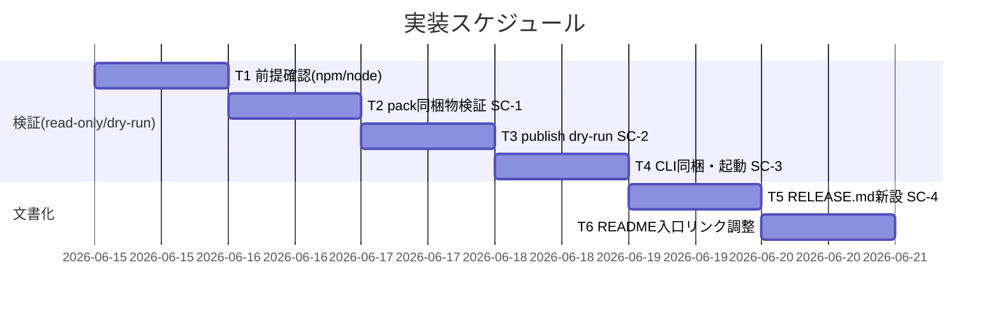

# 実装計画書: npm publish の実施可能性検証と手順整備

**プロジェクト名**: npm publish の実施可能性検証と手順整備
**作成日**: 2026 年 06 月 15 日
**最終更新**: 2026 年 06 月 15 日

> **重要**: **このドキュメントは常に更新**: 実装計画の変更、進捗状況の更新、バグの記録などがあった場合は、即座にこのドキュメントを更新してください。
> **必須項目**: 「必須」と明記した欄は空欄・抽象語のみで提出しないこと。テスト観点・BDD 仕様は具体ケースを 1 件以上記載すること。
>
> **用語**: [.agents/CONCEPTS.md §用語規約](../../../../../.agents/CONCEPTS.md#用語規約) を参照。

---

## 1. 実装概要

### 1.1 実装方針（必須）

新規ロジックを追加せず、既存単一正本（`verify-npm-pack.sh`・`sync-version.sh`）と npm CLI の dry-run を `mktemp -d` 隔離で実行して配布物健全性を検証し（SC-1〜SC-3）、結果を踏まえ `docs/maintainer/RELEASE.md` を新設して RELEASE / publish 手順の正本を整備する（SC-4）。**実 publish は禁止**（dry-run / pack のみ）。

### 1.2 実装順序（必須: 1 件以上）



実行順: T1 → T2 → T3 → T4 → T5 → T6。T2〜T4 は独立だが、証跡を踏まえて T5 を書くため検証を先行させる。

---

## 2. タスク分解

**用語**: [.agents/CONCEPTS.md §用語規約](../../../../../.agents/CONCEPTS.md#用語規約) を参照。

**必須**: 各タスクには **「テスト観点」（2.x.3）** と **「単体テスト仕様（BDD）」（2.x.4）** を記載する。観点の定義は **02\_設計 §6** および **RULES のテスト戦略・[TEST_BDD_FORMAT.md](../../../../../.agents/TEST_BDD_FORMAT.md)** を参照する。

### 2.1 タスク 1: 検証前提の確認と隔離環境準備（T1）

#### 2.1.1 概要（必須）

検証に必要な前提（npm >=7・node >=20）の存在を確認し、`mktemp -d` で隔離環境を準備する（本リポ非破壊）。

#### 2.1.2 実装内容（必須: 1 件以上）

- `command -v npm` / `command -v node` と版（`npm -v`・`node -v`）を確認し記録する。
- 検証作業用の `mktemp -d` を作成する（CLI 起動検証 T4 の展開先）。
- 前提不足時は検証を成立させず明示失敗とする旨を記録する。

#### 2.1.3 テスト観点（必須）

**参照**: 観点の定義は [02\_設計 §6](./02_設計.md) および [RULES のテスト戦略・TEST_BDD_FORMAT](../../../../../.agents/RULES.md#テスト戦略必須要件) を参照。

##### 単体（本タスクの具体ケース・必須 1 件以上）

- npm/node が存在するとき、版が表示され前提 OK と判定される。
- npm が不在のとき、検証を続行せず前提不足として記録される（`verify-npm-pack.sh` は exit 2）。

##### 結合/API（該当時は必須 1 件以上）

- 該当なし（前提確認のみ）。

##### E2E/受け入れ（未達時は理由記載）

- 該当なし（後続タスクの前段。受け入れは T2〜T4 で確認）。

##### バリデーション（該当する場合の具体ケース）

- node 版が >=20 でない場合に注意喚起する（`engines.node>=20`）。

#### 2.1.4 単体テスト仕様（BDD）（必須）

```gherkin
Feature: 検証前提の確認
  Scenario: npm/node が存在し版が前提を満たす
    Given 検証環境に npm(>=7) と node(>=20) がインストールされている
    When npm -v と node -v を確認する
    Then 両コマンドが版を出力し前提 OK と記録される
```

**テストコード例**

```bash
# Given: 検証環境に npm/node がある
# When: 版を確認する
npm -v && node -v
# Then: 終了コード 0（不在なら非ゼロで前提不足を記録）
```

#### 2.1.5 依存関係

- なし（最初のタスク）。

#### 2.1.6 見積もり

- **工数**: 0.5h
- **優先度**: 高

### 2.2 タスク 2: pack 同梱物検証（SC-1・T2）

#### 2.2.1 概要（必須）

`verify-npm-pack.sh` を実行し、禁止パターン 0 件・必須物すべて存在を機械判定する。

#### 2.2.2 実装内容（必須: 1 件以上）

- `bash .agents/scripts/verify-npm-pack.sh` を実行し、終了コードと `[OK]/[NG]` 出力を記録する。
- 同梱ファイル数・必須物の充足・禁止パターン 0 件を確認する。
- 齟齬があれば修正は**提案に留め**（`files` 定義見直し案）レビューへ回す（既存仕様を破壊しない）。

#### 2.2.3 テスト観点（必須）

**参照**: [02\_設計 §6](./02_設計.md)・[RULES](../../../../../.agents/RULES.md#テスト戦略必須要件)。

##### 単体（必須 1 件以上）

- クリーンなチェックアウトで実行すると、禁止 0 件・必須物すべてありで exit 0（合格）。
- （逆ケース・参考）禁止物が同梱される状態では exit 1・LEAK が報告される（スクリプト仕様の確認。実害なく確認可能なら参考検証）。

##### 結合/API（必須 1 件以上）

- `npm pack --dry-run --json` の `files[].path` を `verify-npm-pack.sh` が解析し、`.agents/`・`AGENTS.md`・`CLAUDE.md`・`bin/agents-md.js`・`README.md`・`package.json`・`.workflow/templates/` を必須として判定する。

##### E2E/受け入れ（未達時は理由記載）

- 該当なし（read-only 検査。受け入れは exit 0 と○判定で満たす）。

##### バリデーション（該当する場合）

- 禁止＝`.agents-project/`・`docs/maintainer/`・`workflow.db`・`.adapters/`・`.workflow/`（templates 除く）が 0 件。

#### 2.2.4 単体テスト仕様（BDD）（必須）

```gherkin
Feature: pack 同梱物の検証
  Scenario: 禁止パターンが無く必須物がすべて含まれる
    Given クリーンなリポジトリのチェックアウトと npm(>=7)/node(>=20)
    When bash .agents/scripts/verify-npm-pack.sh を実行する
    Then 終了コードが 0 である
    And 禁止パターン（.agents-project/ 等）が 0 件と報告される
    And 必須物（.agents/・AGENTS.md・CLAUDE.md・bin/agents-md.js・README.md・package.json・.workflow/templates/）がすべて含まれると報告される
```

**テストコード例**

```bash
# Given: クリーンチェックアウト + npm/node
# When: 検査スクリプトを実行
bash .agents/scripts/verify-npm-pack.sh; echo "exit=$?"
# Then: exit=0 / [OK] 禁止なし / [OK] 必須物あり が出力される
```

#### 2.2.5 依存関係

- T1（前提確認）。

#### 2.2.6 見積もり

- **工数**: 0.5h
- **優先度**: 高

### 2.3 タスク 3: publish dry-run 健全性検証（SC-2・T3）

#### 2.3.1 概要（必須）

`npm publish --dry-run` を実 publish せず実行し、警告/エラー無・公開対象・access=public を確認する。

#### 2.3.2 実装内容（必須: 1 件以上）

- リポジトリルートで `npm publish --dry-run` を実行し、終了コード・公開予定内容・access を記録する。
- 解決すべき警告（不正 files・欠落フィールド）の有無を確認する。
- 警告/エラーがあれば内容を記録し修正提案としてレビューへ回す（実 publish は行わない）。

#### 2.3.3 テスト観点（必須）

**参照**: [02\_設計 §6](./02_設計.md)・[RULES](../../../../../.agents/RULES.md#テスト戦略必須要件)。

##### 単体（必須 1 件以上）

- 単体相当は npm CLI 側責務のため該当なし（結合で確認）。

##### 結合/API（必須 1 件以上）

- `npm publish --dry-run` が終了コード 0 で完了し、`@techbeansjp-free/agents-md` が `access: public` の公開対象として表示される。
- 出力に解決すべき警告・エラーが含まれない。

##### E2E/受け入れ（未達時は理由記載）

- 該当なし（**実 publish 禁止**のため E2E の実公開は行わない。dry-run の○判定で受け入れ）。

##### バリデーション（該当する場合）

- npm 認証が無くても dry-run が成立すること（認証不要）。

#### 2.3.4 単体テスト仕様（BDD）（必須）

```gherkin
Feature: publish dry-run
  Scenario: 警告・エラーなく dry-run が完了する
    Given リポジトリルートで npm 認証なし（dry-run のため不要）
    When npm publish --dry-run を実行する
    Then 終了コードが 0 である
    And 解決すべき警告・エラーが出力されない
    And publishConfig.access=public が反映された公開対象として表示される
```

**テストコード例**

```bash
# Given: リポジトリルート（認証不要）
# When: dry-run publish
npm publish --dry-run; echo "exit=$?"
# Then: exit=0 / 警告・エラーなし / access=public の公開対象表示
```

#### 2.3.5 依存関係

- T1（前提確認）。T2 と独立だが順に実行する。

#### 2.3.6 見積もり

- **工数**: 0.5h
- **優先度**: 高

### 2.4 タスク 4: CLI 同梱・起動性検証（SC-3・T4）

#### 2.4.1 概要（必須）

`npm pack` の tarball を `mktemp -d` へ展開し、`bin/agents-md.js` の shebang・実行権限・`help`/`version` 起動を確認する。

#### 2.4.2 実装内容（必須: 1 件以上）

- `npm pack` で tarball を生成し（出力先は `mktemp -d`）、`tar -xzf` で展開する。
- 展開した `package/bin/agents-md.js` の先頭行 `#!/usr/bin/env node` を確認する。
- `node package/bin/agents-md.js version`・`... help` を実行し、出力と終了コード 0 を記録する。
- 検証後に一時環境を `rm -rf` で片付ける。

#### 2.4.3 テスト観点（必須）

**参照**: [02\_設計 §6](./02_設計.md)・[RULES](../../../../../.agents/RULES.md#テスト戦略必須要件)。

##### 単体（必須 1 件以上）

- 展開した `bin/agents-md.js` を `node` で `version` 実行すると、`package.json` の version 文字列を出力し exit 0。
- `help` 実行で usage（コマンド一覧）が出力され exit 0。

##### 結合/API（必須 1 件以上）

- tarball に `package/bin/agents-md.js` が含まれ、shebang `#!/usr/bin/env node` が保持される。

##### E2E/受け入れ（未達時は理由記載）

- `npm pack` 生成物を隔離環境へ展開して CLI を起動する一連が成立する（公開後の `npx` 相当の起動を擬似確認）。

##### バリデーション（該当する場合）

- 不明引数時の挙動確認は本 issue の範囲外（起動性の確認に限定）。

#### 2.4.4 単体テスト仕様（BDD）（必須）

```gherkin
Feature: CLI 同梱・起動性
  Scenario: tarball を展開して help/version が動く
    Given npm pack で生成した tarball を mktemp -d 配下に展開した状態
    When 展開した bin/agents-md.js を node で help または version 実行する
    Then shebang と実行権限が保持されている
    And help/version が想定どおり出力され終了コードが 0 である
```

**テストコード例**

```bash
# Given: mktemp -d に tarball を展開
tmp="$(mktemp -d)"; tar -xzf "$(npm pack --pack-destination "$tmp" | tail -n1 | tr -d '\r')" -C "$tmp"
head -n1 "$tmp/package/bin/agents-md.js"   # => #!/usr/bin/env node
# When: 同梱 CLI を起動
node "$tmp/package/bin/agents-md.js" version; echo "exit=$?"   # => version 文字列 / exit=0
# Then: version 出力・exit 0。後始末:
rm -rf "$tmp"
```

#### 2.4.5 依存関係

- T1（前提確認）。

#### 2.4.6 見積もり

- **工数**: 0.5h
- **優先度**: 高

### 2.5 タスク 5: RELEASE / publish 手順の文書化（SC-4・T5）

#### 2.5.1 概要（必須）

検証結果を踏まえ `docs/maintainer/RELEASE.md` を新設し、RELEASE / publish 手順の詳細正本を整備する。

#### 2.5.2 実装内容（必須: 1 件以上）

- `docs/maintainer/RELEASE.md` を新設し、次の順で手順を記述する: 前提（npm/node・`NPM_TOKEN` は CI secret）→ version 同期（`sync-version.sh --write`／`--check`）→ pack 同梱物検査（`verify-npm-pack.sh`）→ `npm publish --dry-run` → **（ユーザー承認後）** version 一致タグ push による CI publish（`release.yml`）。各ステップに実行コマンドと期待結果を併記する。
- 「**実 publish はユーザー承認前提**」「`NPM_TOKEN` 必須」「**本 issue では dry-run/pack のみ実施し実 publish は行わない**」を明記する。
- 既存スクリプト/CI のロジックは再記述せず参照に留める（正本の重複回避）。

#### 2.5.3 テスト観点（必須）

**参照**: [02\_設計 §6](./02_設計.md)・[RULES](../../../../../.agents/RULES.md#テスト戦略必須要件)。

##### 単体（必須 1 件以上）

- 文書検査: RELEASE.md に「ユーザー承認前提」「`NPM_TOKEN` 必須」「本 issue では実 publish 非実施」の 3 文言が含まれる。
- 手順順序が 前提→version 同期→pack 検査→dry-run→（承認後）publish の順で記述されている。

##### 結合/API（該当時は必須 1 件以上）

- RELEASE.md 内の参照リンク（`sync-version.sh`・`verify-npm-pack.sh`・`release.yml`・README §リリース手順）が実在する。

##### E2E/受け入れ（未達時は理由記載）

- 該当なし（ドキュメント。実 publish は範囲外のため E2E 実行しない）。

##### バリデーション（該当する場合）

- README §リリース手順と矛盾しない（重複・齟齬なし）。

#### 2.5.4 単体テスト仕様（BDD）（必須）

```gherkin
Feature: RELEASE 手順の文書化
  Scenario: 手順文書に実 publish の前提が明記される
    Given 検証（pack/dry-run/CLI）が完了している
    When docs/maintainer/RELEASE.md を作成する
    Then version 同期→タグ push→CI publish の手順が記載される
    And 実 publish はユーザー承認前提・NPM_TOKEN 必須・本 issue では実施しない旨が明記される
    And 既存 README §リリース手順と矛盾しない
```

**テストコード例**

```bash
# Given/When: RELEASE.md 作成後
# Then: 必須文言の存在を grep で確認
grep -q "ユーザー承認" docs/maintainer/RELEASE.md
grep -q "NPM_TOKEN"   docs/maintainer/RELEASE.md
```

#### 2.5.5 依存関係

- T2・T3・T4（検証証跡を踏まえて記述）。

#### 2.5.6 見積もり

- **工数**: 1.5h
- **優先度**: 高

### 2.6 タスク 6: README §リリース手順の入口リンク調整（SC-4 補・T6）

#### 2.6.1 概要（必須）

README §リリース手順から `docs/maintainer/RELEASE.md` への入口リンクを追加し、詳細の重複を避ける。

#### 2.6.2 実装内容（必須: 1 件以上）

- README §リリース手順（メンテナ向け）に「詳細は [docs/maintainer/RELEASE.md] を参照」の入口リンクを追加する。
- 既存の要約記述は残しつつ、詳細手順は RELEASE.md を正本とする旨を 1 文で示す。

#### 2.6.3 テスト観点（必須）

**参照**: [02\_設計 §6](./02_設計.md)・[RULES](../../../../../.agents/RULES.md#テスト戦略必須要件)。

##### 単体（必須 1 件以上）

- README §リリース手順に `docs/maintainer/RELEASE.md` への相対リンクが含まれる。

##### 結合/API（該当時は必須 1 件以上）

- 追加したリンク先（`docs/maintainer/RELEASE.md`）が実在する。

##### E2E/受け入れ（未達時は理由記載）

- 該当なし（ドキュメント）。

##### バリデーション（該当する場合）

- 既存手順の意味を変えない（破壊しない）。

#### 2.6.4 単体テスト仕様（BDD）（必須）

```gherkin
Feature: README 入口リンク
  Scenario: README から RELEASE.md へ辿れる
    Given docs/maintainer/RELEASE.md が存在する
    When README.md §リリース手順を更新する
    Then RELEASE.md への相対リンクが README に含まれる
    And リンク先が実在する
```

**テストコード例**

```bash
# Given/When: README 更新後
# Then: リンク存在とリンク先実在を確認
grep -q "docs/maintainer/RELEASE.md" README.md && test -f docs/maintainer/RELEASE.md
```

#### 2.6.5 依存関係

- T5（RELEASE.md 新設）。

#### 2.6.6 見積もり

- **工数**: 0.5h
- **優先度**: 中

---

## テスト観点

各タスク §2.x.3 に具体ケースを記載した。要約: SC-1=pack 同梱物の禁止 0 件・必須物充足（exit 0）、SC-2=dry-run の警告/エラー無・access=public・exit 0、SC-3=tarball 展開後の shebang/権限保持・help/version 起動 exit 0、SC-4=RELEASE.md の必須文言（ユーザー承認前提・NPM_TOKEN・本 issue 非実施）と README 非矛盾・リンク実在。すべて read-only / dry-run で本リポ非破壊。

---

## 単体テスト

新規プロダクションコードは追加しないため、単体テストは「検証スクリプトの判定結果」と「同梱 CLI の起動結果」を検証実行で確認する形を取る（§2.2.4・§2.4.4）。各 SC の○/×は検証ログを memo に記録する。

---

## BDD

各タスク §2.x.4 の Gherkin が BDD シナリオの一覧。Given/When/Then は [TEST_BDD_FORMAT.md](../../../../../.agents/TEST_BDD_FORMAT.md) に従う。01_要件定義 §2.2 のユースケース 1〜4 と本書 T2〜T5 が 1:1 対応する。

---

## 3. 実装スケジュール

### 3.1 マイルストーン

| マイルストーン | 期日 | 成果物 |
| ------------------ | ------ | -------- |
| 検証完了（SC-1〜3） | T4 完了時 | 各 SC の○/×検証証跡（memo） |
| 文書化完了（SC-4） | T6 完了時 | `docs/maintainer/RELEASE.md`・README 入口リンク |

### 3.2 実装フェーズ

#### フェーズ 1: 検証（read-only / dry-run）

- **タスク**: T1・T2・T3・T4。すべて `mktemp -d` 隔離。

#### フェーズ 2: 文書化

- **タスク**: T5・T6。

---

## 4. テスト計画

テスト観点・レベル・BDD 形式の定義は **02\_設計 §6** および **RULES のテスト戦略・TEST_BDD_FORMAT** を参照。本実装計画では各タスク §2.x.3 に具体ケース、§2.x.4 に BDD を記載した。

### 4.1 テストの優先順位

- SC-1（同梱物リーク検査）と SC-3（CLI 起動）は公開後の利用者影響が直結するため重点的に確認する。
- SC-2（dry-run）は警告も漏れなく記録する。

---

## 5. リスク管理

### 5.1 実装リスク

- **リスク**: `files` 定義と実同梱物に齟齬があり同梱漏れ/余剰が見つかる。
  - **対策**: `verify-npm-pack.sh` で機械判定し、修正は提案に留めレビューへ回す（本 issue では検証・記録を優先）。
- **リスク**: tarball で `bin/agents-md.js` の shebang/権限が失われ `npx` が動かない。
  - **対策**: `npm pack` 生成 tarball を展開し権限・shebang・起動を確認する（T4）。
- **リスク**: 誤って実 publish / 自己インストールで破壊する。
  - **対策**: 実 publish 禁止（dry-run/pack のみ）。検証は `mktemp -d` 隔離で実施し後始末する。
- **リスク**: npm 環境未整備で dry-run できない。
  - **対策**: T1 で前提（npm/node 版）を確認し、不足時は前提不足として明示記録する。

---

## 6. 参考資料

### プロジェクトドキュメント

- [`02_設計.md`](./02_設計.md) - 設計
- [`01_要件定義.md`](./01_要件定義.md) - 要件定義
- `.agents/scripts/verify-npm-pack.sh`・`.agents/scripts/sync-version.sh`・`.github/workflows/release.yml`・`README.md` §リリース手順

### その他の参考資料

- `package.json`（`files`・`bin`・`publishConfig`）、`LICENSE`（MIT）、`bin/agents-md.js`

---

## 7. 前のステップ

- **前**: [`02_設計.md`](./02_設計.md) - 設計フェーズ

---

## 8. 次のステップ

- **プロジェクトが 1 つの issue である場合**: 実装フェーズ（execution）に直接進む。本 issue はサブ issue に分割しない（単一 issue のため 90_issues.md は作成しない）。

**用語**: [.agents/CONCEPTS.md §用語規約](../../../../../.agents/CONCEPTS.md#用語規約) を参照。
</content>
