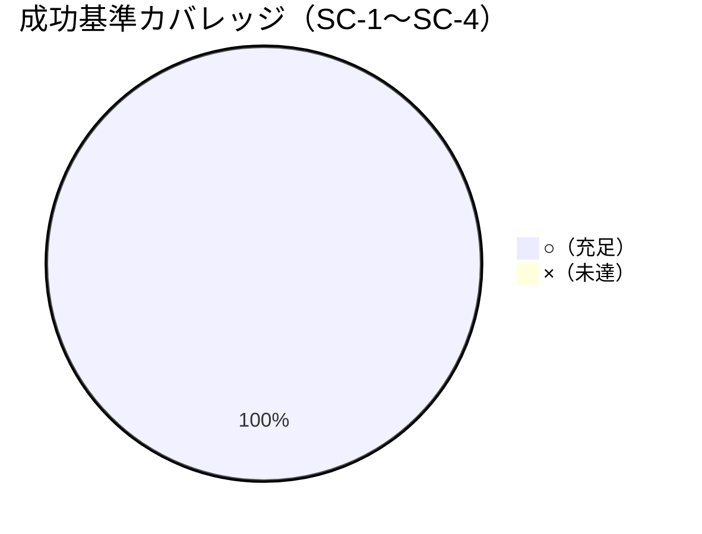

# レビュー書: npm publish の実施可能性検証と手順整備

**プロジェクト名**: npm publish の実施可能性検証と手順整備
**作成日**: 2026 年 06 月 15 日
**最終更新**: 2026 年 06 月 15 日

> **重要**: **このドキュメントは常に更新**: レビューで発見した問題点や改善提案、対応内容などがあった場合は、即座にこのドキュメントを更新してください。
>
> **用語**: [.agents/CONCEPTS.md §用語規約](../../../../../.agents/CONCEPTS.md#用語規約) を参照。
>
> **必須**: レビュー実施時は [`.agents/REVIEW_RULE.md`](../../../../../.agents/REVIEW_RULE.md) を参照。本 issue はドキュメント＋既存正本スクリプトの検証中心で変更規模が小さいため、レビュー深度は **standard**。

---

## 1. レビュー概要

### 1.1 レビュー目的（必須）

実装内容（配布物健全性の非破壊検証と RELEASE 手順整備）の確認・品質保証・実 publish 前の最終チェック（実 publish は本 issue 非実施）。

### 1.2 レビュー対象（必須）

- **実装範囲**: `docs/maintainer/RELEASE.md` の新設（RELEASE/publish 手順の正本）、`README.md` §リリース手順の入口リンク調整、および既存単一正本（`verify-npm-pack.sh`・`sync-version.sh`）と npm CLI dry-run による SC-1〜SC-3 の検証実行。新規プロダクションコードは追加していない。
- **レビュー期間**: 2026-06-15 ～ 2026-06-15
- **レビュー担当者**: verify-and-close サブエージェント（auditor 相当）

---

## 2. 実装内容の確認

### 2.1 実装完了タスク（または Issue）

| タスク名 | 実装内容 | 実装日 | 担当者 | ステータス（必須） |
| -------- | -------- | ------ | ------ | ------------------ |
| T1 前提確認 | npm/node 版確認（npm 10.8.2 / node v20.19.5）、検証は `mktemp -d` 隔離 | 2026-06-15 | worker | 完了 |
| T2 pack 同梱物検証（SC-1） | `verify-npm-pack.sh` 実行＝禁止 0 件・必須物すべて存在 | 2026-06-15 | worker | 完了 |
| T3 publish dry-run（SC-2） | `npm publish --dry-run` 実行＝exit 0・public access | 2026-06-15 | worker | 完了 |
| T4 CLI 同梱・起動（SC-3） | tarball を `mktemp -d` 展開し shebang/権限保持・version/help 起動 exit 0 | 2026-06-15 | worker | 完了 |
| T5 RELEASE.md 新設（SC-4） | `docs/maintainer/RELEASE.md` を正本として新設 | 2026-06-15 | worker | 完了 |
| T6 README 入口リンク調整（SC-4 補） | README §リリース手順に RELEASE.md 入口リンクを追加（詳細は重複させない） | 2026-06-15 | worker | 完了 |

### 2.2 実装内容の詳細

#### タスク 5: RELEASE.md 新設（SC-4）

- **実装内容**: 前提 → version 同期 → pack 同梱物検査 → `npm publish --dry-run` →（ユーザー承認後）タグ push による CI publish の順で、各ステップに実行コマンドと期待結果を併記。冒頭に「実 publish はユーザー承認前提」「`NPM_TOKEN` 必須・CI 上でのみ publish」「検証フェーズでは実 publish を行わない」を明記。
- **変更ファイル**: `docs/maintainer/RELEASE.md`（新設）。
- **実装方法**: 既存スクリプト/CI（`sync-version.sh`・`verify-npm-pack.sh`・`release.yml`）のロジックは再記述せず参照に留め、正本を 1 か所に集約。
- **確認事項**: README との非重複・非矛盾、リンク実在。下記 §5 で確認済み。

#### タスク 6: README 入口リンク調整（SC-4 補）

- **実装内容**: README §リリース手順に「詳細手順の正本は docs/maintainer/RELEASE.md」の入口リンク（2 箇所）を追加。要約のみ残し詳細を重複させない。
- **変更ファイル**: `README.md`。

---

## 3. テスト結果の確認

> 本 issue は新規プロダクションコードを増やさず、検証実行（read-only / dry-run）そのものが受け入れ確認を兼ねる。実行はすべて本リポ非破壊で再実行した。

### 3.1 検証実行結果（受け入れ確認・必須）

- **実行日**: 2026-06-15
- **環境**: npm 10.8.2 / node v20.19.5（前提 npm>=7・node>=20 を満たす）
- **検証項目数**: 4（SC-1〜SC-4）
- **成功**: 4
- **失敗**: 0
- **スキップ**: 0

| SC | 検証方法（実行コマンド） | 結果 | 判定 |
| -- | ------------------------ | ---- | ---- |
| SC-1 | `bash .agents/scripts/verify-npm-pack.sh` | exit 0。配布ファイル数 172。`[OK] 禁止パターン … 含まれていません` / `[OK] 必須の正本配布物 … すべて含まれています` | ○ |
| SC-2 | `npm publish --dry-run` | exit 0。末尾 `… with tag latest and public access (dry-run)`。解決すべき警告なし（`This command requires you to be logged in …（dry-run）` は dry-run 定型表示） | ○ |
| SC-3 | `npm pack --pack-destination $tmp` → `tar -xzf` → `node package/bin/agents-md.js version/help`（`mktemp -d` 隔離・後始末済み） | shebang `#!/usr/bin/env node` 保持・権限 `-rwxr-xr-x`・`version`=`0.1.0` exit 0・`help`=usage exit 0 | ○ |
| SC-4 | RELEASE.md 必須文言 grep＋リンク実在チェック | 「ユーザー承認」2・「NPM_TOKEN」4・「実 publish を行わない」1・README→RELEASE.md リンク 2、全リンク実在 | ○ |

補助確認: `bash .agents/scripts/sync-version.sh --check` → exit 0（`package.json` 0.1.0 ⇔ `plugin.json` 0.1.0 一致）。

#### テストカバレッジ

### 3.2 統合テスト

`npm pack --dry-run --json` → `verify-npm-pack.sh` のパス解析（結合）、tarball 展開 → CLI 起動（E2E 相当）が成立。いずれも本リポ非破壊（dry-run / `mktemp -d` 隔離）。

### 3.3 E2E テスト

公開後の `npx @techbeansjp-free/agents-md` 相当を tarball 展開＋node 起動で擬似確認し成立（SC-3）。実 publish は禁止のため実公開 E2E は行わない（設計どおり）。

---

## 4. コードレビュー

### 4.1 コード品質

#### コードスタイル

- **リント結果**: 対象なし（新規プロダクションコードなし。シェル/ドキュメントのみ）。
- **フォーマット**: 問題なし。
- **型チェック**: 対象なし。

#### コードレビュー観点

| 観点 | 確認内容（必須） | 結果（必須） | コメント |
| ---- | ---------------- | ------------ | -------- |
| 可読性 | RELEASE.md が小さな手順節に分割され各ステップにコマンドと期待結果を併記しているか | OK | 番号付き節＋表で再現可能 |
| 保守性 | 検証ロジックを `verify-npm-pack.sh`/`sync-version.sh` 1 か所に保ち二重化していないか | OK | RELEASE.md は参照のみ。新規ロジックなし |
| パフォーマンス | 検証一式が数分以内に完了するか | OK | 各ステップ独立・短時間 |
| セキュリティ | 配布物に機密・リポ固有物が混入しないか・実 publish を行っていないか | OK | SC-1 で禁止 0 件確認。dry-run/pack のみ |

### 4.2 指摘事項

#### 指摘 1: 検証コミットが未実施（working tree のまま）

- **重要度**: 低
- **指摘内容**: `RELEASE.md`（untracked）・`README.md`/`package.json`（modified）は本セッション時点で未コミット。クローズアウトの commit ステップ（1 サブ issue=1 論理コミット／feature ブランチ／push はユーザー明示時のみ）は本 issue を束ねる親フローのコミット時に実施する想定。
- **対応状況**: 対応中（コミットはオーケストレータ/親フローに委ねる。push は禁止）。
- **対応方法**: 本レビュー承認後、feature ブランチ上で 1 論理コミットにまとめる。push はユーザー明示時のみ。

---

## 5. ドキュメントの確認

### 5.1 ドキュメント更新状況

| ドキュメント | 更新状況 | 確認者 | 確認日 |
| ------------ | -------- | ------ | ------ |
| [`00_要求定義.md`](./00_要求定義.md) | 更新済み | verify-and-close | 2026-06-15 |
| [`01_要件定義.md`](./01_要件定義.md) | 更新済み | verify-and-close | 2026-06-15 |
| [`02_設計.md`](./02_設計.md) | 更新済み | verify-and-close | 2026-06-15 |
| [`03_実装計画.md`](./03_実装計画.md) | 更新済み | verify-and-close | 2026-06-15 |

### 5.2 ドキュメントの整合性

- **実装と設計の整合性**: 整合している（02 §3 の SC-1〜SC-4 と実装・検証が 1:1 対応）。
- **要件と実装の整合性**: 整合している（01 §2.2 ユースケース 1〜4 ＝ 03 T2〜T5 ＝ RELEASE.md 手順）。
- **コメント**: RELEASE.md は README §リリース手順と非矛盾。詳細は RELEASE.md 1 か所に集約され重複なし。

---

## 6. パフォーマンス確認

### 6.1 パフォーマンステスト結果

検証一式（pack・dry-run・CLI 起動・version check）はローカルで数分以内に完了（01 §3.1 充足）。

### 6.2 ボトルネックの確認

なし。

---

## 7. セキュリティ確認

### 7.1 セキュリティチェック

| 項目 | 確認内容 | 結果 | コメント |
| ---- | -------- | ---- | -------- |
| 認証・認可 | 実 publish の `NPM_TOKEN` を本 issue で扱わない・dry-run は認証不要 | OK | RELEASE.md に CI secret 前提を明記 |
| データ保護 | 配布物に機密・リポ固有物（`.agents-project/`・`docs/maintainer/`・`workflow.db`・`.adapters/`・`.workflow/` issue）が混入しない | OK | SC-1 で禁止パターン 0 件 |
| 入力検証 | 検証は `mktemp -d` 隔離で本リポ管理物を破壊しない | OK | tarball 展開は tmp、後始末済み |

---

## 8. デプロイ準備

### 8.1 デプロイチェックリスト

- [x] すべての検証（SC-1〜SC-4）が通過している
- [x] レビューが完了している（本書）
- [x] ドキュメントが更新されている（RELEASE.md・README）
- [ ] マイグレーションスクリプト（該当なし）
- [x] 環境変数の前提が確認されている（`NPM_TOKEN` は CI secret・本 issue 非実施）
- [ ] バックアップ計画（該当なし・read-only 検証）

### 8.2 デプロイ計画

- **デプロイ予定日**: 未定（実 publish はユーザー承認後に別途）。
- **デプロイ方法**: `vX.Y.Z` タグ push による CI（`release.yml`）publish。**本 issue では実施しない**。
- **ロールバック計画**: 実 publish 前のため対象外。

---

## docs 更新

- 要否: 不要
- 対象: なし
- 理由: 本 issue の成果（RELEASE.md・README 入口リンク・検証証跡）はメンテナ向け配布手順であり `docs/maintainer/` 配下に収まる。システム仕様書（`docs/` の利用者向け仕様）の振る舞いには影響しないため。

---

## 9. 設計・境界の確認

**注意**: review-architecture の結果をここに記載。

### 9.1 設計の確認

- **設計原則の準拠**: [.agents/spec/06_設計判断の優先順位.md](../../../../../.agents/spec/06_設計判断の優先順位.md)（可読性・単一責務・仕様との整合性・保守性）に準拠。UNIX 哲学どおり検証を小さな独立ステップ（pack/dry-run/CLI）に分割。
- **ディレクトリ構成**: RELEASE.md を既存 `docs/maintainer/`（`adapters.md` 等と同名前空間）に配置＝02 §2.3 準拠。
- **命名規則**: `RELEASE.md`（大文字・慣例的）で問題なし。

### 9.2 境界・依存の確認

- **責務の境界**: 「検証（read-only/dry-run）」と「実 publish（外部書き込み）」の境界を RELEASE.md 冒頭で明示。本 issue は前者のみ。
- **依存関係**: README → RELEASE.md → 既存スクリプト/CI の一方向参照。循環なし（02 §2.1.3 と一致）。検証ロジックの二重化なし。
- **指摘・推奨**: `files` 定義と実同梱物の齟齬は検出されず（SC-1）。`.npmignore` 不在のままで配布範囲は `files` のみで制御＝設計どおり。修正提案は不要。

### 9.3 重要判断の根拠（evidence_source）

| 判断内容 | evidence_source | 備考 |
| -------- | --------------- | ---- |
| SC-1 同梱物が files と一致・リーク 0 | test_output | `verify-npm-pack.sh` exit 0・配布 172 ファイル |
| SC-2 dry-run 健全・public access | test_output | `npm publish --dry-run` exit 0・`public access (dry-run)` |
| SC-3 CLI 起動・shebang/権限保持 | observed_runtime | tarball 展開後 `node … version/help` exit 0・`-rwxr-xr-x` |
| SC-4 RELEASE.md 必須文言・README 非矛盾・リンク実在 | existing_code | grep＋リンク実在チェック（全 OK） |
| 境界（検証 vs 実 publish）の妥当性 | external_spec | 00 §4・01 §5・02 §2.1.2（実 publish 範囲外） |

---

## 10. 課題と改善点

### 10.1 発見された課題

- **課題 1**: 検証成果（RELEASE.md・README・package.json 差分）が未コミット。
  - **影響範囲**: 記録の確定（git 追跡）。
  - **対応方法**: 親フローのコミットステップで feature ブランチに 1 論理コミット。push はユーザー明示時のみ。

### 10.2 改善提案

- **改善 1**: 将来 version bump 時に RELEASE.md §5 のタグ例（`v0.1.0`）を実 version に追従させる運用メモを残すとよい。
  - **効果**: タグ/version 三者一致の取り違え防止。

---

## 11. システム仕様書の更新

### 11.1 システム仕様書の確認結果

- **実装した機能**: RELEASE/publish 手順の文書化（メンテナ向け）。利用者向けシステム機能の追加はなし。
- **実装した API**: なし（既存 npm CLI / 既存スクリプトの参照のみ）。

### 11.2 システム仕様書の更新状況

更新不要（理由は §docs 更新に記載）。

---

## 12. レビュー結果

### 12.1 総合評価

- **実装品質**: 良好（新規ロジックを増やさず既存正本を再利用、手順は再現可能）。
- **テスト品質**: 良好（SC-1〜SC-4 すべて○・本リポ非破壊で再実行確認）。
- **ドキュメント品質**: 良好（正本 1 か所・README 非矛盾・リンク実在）。
- **総合評価**: 合格（SC-1〜SC-4 充足）。実 publish は本 issue 非実施・ユーザー承認前提として手順化済み。

### 12.2 承認状況

- **レビュー承認者**: verify-and-close サブエージェント
- **承認日**: 2026-06-15
- **承認コメント**: SC-1〜SC-4 を実機再検証し全充足。実 publish は禁止（dry-run/pack のみ実施）を遵守。クローズ可。残課題は未コミットのみ（親フローで対応・push 禁止）。

---

## 13. 参考資料

- [`00_要求定義.md`](./00_要求定義.md) / [`01_要件定義.md`](./01_要件定義.md) / [`02_設計.md`](./02_設計.md) / [`03_実装計画.md`](./03_実装計画.md)
- [`docs/maintainer/RELEASE.md`](../../../RELEASE.md)・`README.md` §リリース手順
- `.agents/scripts/verify-npm-pack.sh`・`.agents/scripts/sync-version.sh`・`.github/workflows/release.yml`

---

## 14. 前のステップ

- **前**: [`03_実装計画.md`](./03_実装計画.md) - 実装計画フェーズ

---

## 15. 次のステップ

- 外部設定（実 publish）はユーザー承認後に別途。本 issue はレビュー合格によりクローズ可（実 publish は範囲外）。
