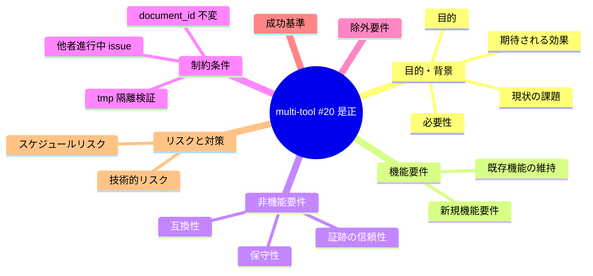
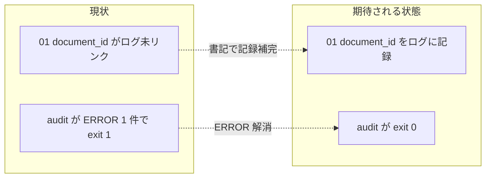

# 要求定義書: 進行中 issue multi-tool 対応の #20 document_id 未リンク是正

**プロジェクト名**: multi-tool 対応 #20 document_id 未リンク是正
**作成日**: 2026 年 06 月 15 日
**最終更新**: 2026 年 06 月 15 日

> **重要**:
>
> - 要求定義書は、プロジェクトの全体像を把握するためのものです。詳細な技術仕様や実装方法は要件定義書以降で記載します。必要最低限の情報に収めることを心掛けてください。
> - **このドキュメントは常に更新**: 要求の変更や追加があった場合は、即座にこのドキュメントを更新してください。
> - **必須項目**: 「必須」と明記した項目は空欄・抽象語のみで提出しないこと。判定可能な形で記入すること。
>
> **用語**: [.agents/CONCEPTS.md §用語規約](../../../../../.agents/CONCEPTS.md#用語規約) を参照。

---

## 要求定義の全体像

**注意**:

- 上記はマインドマップであり、主要なセクション名程度に留めています。

---

## 1. 目的・背景

### 1.1 目的（必須）

DB 込みリポ全体 audit を exit 0 にする（残存 #20 ERROR を解消）。

### 1.2 背景

- **現状の課題**:
  - DB 込みリポ全体 audit（`.agents/enforcement/ci/audit.sh .`）が唯一 1 件の ERROR を出す。発火は #20（document_id 紐付け）であり、対象は進行中 issue `docs/maintainer/workflow/20260614_173500_multi-tool対応/01_要件定義.md`（document_id=`981cab50-c0c9-4988-bbdd-f2b25f701f75`）。
  - 切り分け結果（事実）: 当該 issue の 00（document_id=`80bf0cd1-3864-4452-b0c6-8bba74d1dd8a`）は workflow_log に `requirement-discovery` エントリ（entry_id=`c9ba2362-...`）として記録済みだが、**01 の document_id は workflow_log にエントリが 1 件も無い**。`write-workflow-log.sh` は 1 INSERT につき DOCUMENT_ID/DOCUMENT_PATH を 1 組のみ記録するため、00 を記録した書記実行では 01 の document_id が記録されず、未リンクのまま残った。
  - したがって #20 の発火原因は「**ログに 01 の document_id 行が無い（書記での記録漏れ）**」であり、**frontmatter の付与漏れではない**（01 frontmatter には document_id が正規 UUID で付与済み）。

- **必要性**:
  - 本セッションの 4 issue 範囲外として申し送られた既存課題であり、audit を CI ゲートとして信頼するには exit 0 を回復させる必要がある。
  - **document_id は付与済みであり、CORE / requirement-discovery / RULES §document_id 不変 により変更・上書きは禁止**。是正は frontmatter の改変ではなく、当該 issue の正規ワークフロー（書記による workflow_log への記録補完）で行うべき。

### 1.3 期待される効果（必須: 1 件以上）

- **効果 1**: DB 込みリポ全体 audit が exit 0（ERROR 0 件）になる（○/× で判定可能）。
- **効果 2**: multi-tool 対応 issue の 00/01 の document_id がいずれも workflow_log に紐付き、証跡の網羅性が回復する（○/× で判定可能）。
- **効果 3**: 他成果物の証跡本文・frontmatter を不要に改変しない（diff で確認可能）。

**現状と期待される状態の比較**:

---

## 2. 機能要件

### 2.1 既存機能の維持（該当する場合）

- 既存の workflow_log エントリ（00 の記録・他 issue の記録）はそのまま維持する。
- audit.sh の #20 判定ロジックは変更しない（是正は記録側で行う前提。audit 側スコープ変更を採るかは設計で確定）。

### 2.2 新規機能要件

- 進行中 issue `20260614_173500_multi-tool対応` の 01（document_id=`981cab50-...`）を指す workflow_log エントリを、当該 issue の正規ワークフロー（write-workflow-log）で 1 件追加し、#20 を充足させる。

---

## 3. 非機能要件

### 3.1 パフォーマンス

- 影響なし（1 行 INSERT のみ）。

### 3.2 セキュリティ

- 特になし。DB への書き込みは書記（AGENT_ROLE=scribe）経路のみ。

### 3.3 互換性

- 既存スキーマ（document_id / document_path / issue_path カラム）で動作すること。他 issue の audit 結果を悪化させないこと。

### 3.4 保守性

- 是正方法は「他成果物の document_id がログ未リンクのまま残る」再発を抑止できる方針が望ましい（恒久対策の要否は設計で判断）。

---

## 4. 制約条件

### 4.1 技術的制約

- **document_id 不変**: 01 の frontmatter document_id（`981cab50-...`）は付与済みのため変更・上書き禁止（CORE / requirement-discovery / RULES §document_id 不変、audit #20+）。
- **chain 順序厳守・テンプレ必須セクション厳守**。00 に issue_id を発行する。
- **検証は tmp 隔離**（`mktemp -d` 等。本リポの DB・成果物を破壊しない）。本リポ実 DB への記録は書記フェーズで行い、検証とは分離する。

### 4.2 既存システムとの互換性

- 対象は**他者作業の進行中 issue**である。最小限の是正に留め、当該 issue の成果物本文（00/01 の中身）は改変しない。

### 4.3 移行期間・スケジュール

- 単発の是正。スケジュール制約なし。

---

## 5. 除外要件

- multi-tool 対応 issue 自体の要件・設計・実装の進行は本 issue の対象外（document_id 紐付けの是正のみ）。
- audit.sh の #20 ロジックの仕様変更（スコープ縮小等）は、原則として採らない。比較検討のうえ非推奨であることを 01/02 で明示する。

---

## 6. 成功基準（必須: 1 件以上）

- DB 込みリポ全体 audit（`bash .agents/enforcement/ci/audit.sh .`）が exit 0（ERROR/FAIL 0 件）。
- workflow_log に document_id=`981cab50-c0c9-4988-bbdd-f2b25f701f75` を持つエントリが 1 件以上存在する。
- multi-tool 対応 issue の 00/01 の frontmatter document_id が改変されていない（diff 0）。
- 他 issue の成果物本文・証跡が不要に改変されていない。

---

## 7. リスクと対策

### 7.1 技術的リスク

- **リスク**: 是正のために 01 の frontmatter document_id を誤って付け替える（不変規約違反・audit #20+ 発火）。
  - **対策**: frontmatter は一切触らず、書記による workflow_log への記録補完のみで是正する。
- **リスク**: 進行中 issue に対する正規 command 種別の選択を誤り、後続の因果・親検査（#16/#17 等）に抵触する。
  - **対策**: 当該 issue は要求・要件フェーズであり `requirement-discovery` 相当の記録が妥当。記録 command 種別は設計で確定する。

### 7.2 スケジュールリスク

- **リスク**: 他者の進行中 issue を巻き込む変更で進行を阻害する。
  - **対策**: 成果物本文は不変。document_id を指すログ 1 行の追加に限定する。

---

## 8. 参考資料

### プロジェクトドキュメント

- `.agents/enforcement/ci/audit.sh`（#20 / #20+ の実装）
- `.agents/scripts/write-workflow-log.sh`（DOCUMENT_ID / DOCUMENT_PATH の記録仕様）
- `docs/maintainer/workflow/20260614_173500_multi-tool対応/`（対象の進行中 issue）

### その他の参考資料

- `.agents/skills/logging/write-workflow-log/`（書記の手順）

---

## 9. 次のステップ

この要求定義書の承認後、以下のドキュメントを作成します：

- **次**: [`01_要件定義.md`](./01_要件定義.md) - 要件定義フェーズ
