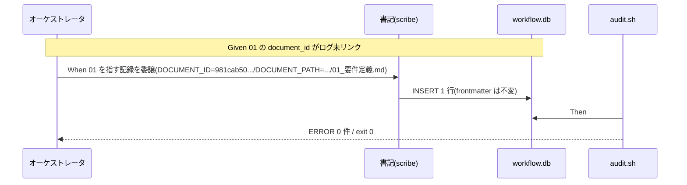

# 要件定義書: 進行中 issue multi-tool 対応の #20 document_id 未リンク是正

**プロジェクト名**: multi-tool 対応 #20 document_id 未リンク是正
**作成日**: 2026 年 06 月 15 日
**最終更新**: 2026 年 06 月 15 日

> **重要**: **このドキュメントは常に更新**: 要件の変更や追加があった場合は、即座にこのドキュメントを更新してください。
>
> **用語**: [.agents/CONCEPTS.md §用語規約](../../../../../.agents/CONCEPTS.md#用語規約) を参照。

---

## 1. 概要

### 1.1 システム概要

DB 込みリポ全体 audit に残る唯一の ERROR（#20 document_id 未リンク）を解消する是正 issue。対象は進行中の他者 issue `20260614_173500_multi-tool対応` の `01_要件定義.md`。audit #20 は「frontmatter に document_id を持つ成果ドキュメントについて、workflow_log にその document_id を持つ行が 1 件以上あること」を要求する。当該 01 は document_id を持つが workflow_log に対応行が無いため発火している。

### 1.2 用語集

| 用語 | 説明 |
| ---- | ---- |
| #20 | audit.sh の document_id 紐付けチェック。frontmatter の document_id が workflow_log に存在しなければ ERROR。 |
| #20+ | document_id 不変チェック。同一 document_path に過去記録された document_id と現在値が異なれば ERROR。 |
| 書記（scribe） | workflow_log への記録を行う唯一のロール（`AGENT_ROLE=scribe` で `write-workflow-log.sh` を実行）。 |
| 対象 01 | `docs/maintainer/workflow/20260614_173500_multi-tool対応/01_要件定義.md`（document_id=`981cab50-c0c9-4988-bbdd-f2b25f701f75`）。 |

---

## 2. 機能要件

### 2.1 ユーザーストーリー

#### ストーリー 1: audit を exit 0 に戻す

- **As a** リポジトリ保守者
- **I want to** DB 込みリポ全体 audit を ERROR 0 件にする
- **So that** audit を CI ゲートとして信頼でき、他作業の合否判定が阻害されない

**受け入れ基準**:

- `bash .agents/enforcement/ci/audit.sh .` が exit 0（ERROR/FAIL 0 件）。
- 解消されるのは #20（対象 01）であり、他チェックを新たに失敗させない。

#### ストーリー 2: 規約に沿った最小是正

- **As a** 保守者
- **I want to** 付与済みの document_id を変更せず、書記での記録補完だけで是正する
- **So that** document_id 不変規約（#20+）を破らず、他者の進行中 issue の本文も改変しない

**受け入れ基準**:

- 対象 01 / 00 の frontmatter document_id が改変されていない（diff 0）。
- multi-tool 対応 issue の 00/01 本文が改変されていない。
- workflow_log に document_id=`981cab50-...` を持つ行が 1 件以上追加される。

### 2.2 BDD ユースケース

#### ユースケース 1: #20 発火原因の切り分けと是正方針の選択

#20 が「ログに document_id 行が無い」ことに起因するのか、「frontmatter 付与漏れ」なのか、「audit 側スコープ」なのかを切り分け、推奨方針を採る。

**シナリオ 1: 切り分け（事実確認）**

```gherkin
Feature: #20 発火原因の切り分け
  Scenario: 対象 01 の document_id がログに無いことを確認する
    Given 対象 01 の frontmatter に document_id 981cab50-... が正規 UUID で付与済みである
    And workflow_log に document_id=981cab50-... を持つ行が 0 件である
    And 対象 00 の document_id 80bf0cd1-... は requirement-discovery エントリとして記録済みである
    When audit #20 を実行する
    Then ERROR は対象 01 に対してのみ発火する
    And 発火原因は「書記での記録漏れ（ログに 01 の document_id 行が無い）」であって frontmatter 付与漏れではないと判定される
```

**シナリオ 2: 是正方針の比較と推奨**

```gherkin
Feature: 是正方針の比較
  Scenario: 3 方針を比較し書記での記録補完を推奨する
    Given 方針A=書記による workflow_log への記録補完
    And 方針B=frontmatter への document_id 付与/付け替え
    And 方針C=audit #20 のスコープ縮小（対象 01 を除外）
    When 各方針を document_id 不変規約・最小是正・恒久性で評価する
    Then 方針B は付与済みのため不変規約違反となり却下される
    And 方針C は証跡網羅性を損ない非推奨である
    And 方針A（当該 issue の正規ワークフローで書記が 01 の document_id を記録）が推奨される
```

**処理フロー**:



#### ユースケース 2: 検証の tmp 隔離

実 DB への記録前後の検証は本番ファイルを壊さずに行う。

**シナリオ 1: 隔離検証**

```gherkin
Feature: tmp 隔離検証
  Scenario: 本番 DB を破壊せず audit 効果を確認する
    Given mktemp -d で隔離環境を用意する
    When 隔離環境または読み取り専用で audit と記録手順を検証する
    Then 本リポの .workflow/workflow.db と成果物を変更・破壊しない
```

### 2.3 ビジネスルール

- document_id は付与済みなら変更・上書き禁止（CORE / requirement-discovery / RULES §document_id 不変）。
- workflow_log への記録は書記のみが行う（`AGENT_ROLE=scribe`）。
- 是正は対象 01 を指すログ 1 行の追加に限定し、他成果物・他 issue 記録を改変しない。
- 記録 command 種別は当該 issue のフェーズに整合させる（要件フェーズのため `requirement-discovery` 相当。確定は設計）。

---

## 3. 非機能要件

### 3.1 パフォーマンス要件

- 1 行 INSERT のみ。性能影響なし。

### 3.2 セキュリティ要件

- DB 書き込みは書記経路（`write-workflow-log.sh`）に限定。任意 SQL を直接実行しない。

### 3.3 ユーザビリティ要件

- 是正後、audit の出力が「Audit passed.」となり原因が明快であること。

### 3.4 可用性要件

- 既存スキーマ（document_id / document_path / issue_path）で動作し、他環境でも再現可能であること。

---

## 4. 外部インターフェース要件

### 4.1 API 要件

- `write-workflow-log.sh` の環境変数インターフェース（DOCUMENT_ID, DOCUMENT_PATH, ISSUE_PATH, command, summary, dod_met, ts_utc 等）を用いる。新規 API は追加しない。

### 4.2 データ形式要件

- DOCUMENT_ID は対象 01 の既存値 `981cab50-c0c9-4988-bbdd-f2b25f701f75` をそのまま用いる。
- DOCUMENT_PATH はプロジェクトルート相対 `docs/maintainer/workflow/20260614_173500_multi-tool対応/01_要件定義.md`。

---

## 5. 制約事項

- chain 順序厳守・テンプレ必須セクション厳守。00 に issue_id 発行済み。
- 検証は tmp 隔離（本リポの DB・成果物を破壊しない）。
- 対象は他者進行中 issue であり、最小限の是正に留める。frontmatter・本文は不変。
- 完了後に書記（write-workflow-log）で本是正 issue 自体の証跡を記録する。

---

## 6. 参考資料

### プロジェクトドキュメント

- [`00_要求定義.md`](./00_要求定義.md) - 要求定義
- `.agents/enforcement/ci/audit.sh`（#20 / #20+）
- `.agents/scripts/write-workflow-log.sh`（記録仕様）
- `docs/maintainer/workflow/20260614_173500_multi-tool対応/01_要件定義.md`（対象）

### その他の参考資料

- `.agents/skills/logging/write-workflow-log/`（書記手順）

---

## 7. 前のステップ

この要件定義書は、以下のドキュメントを基に作成されています：

- **前**: [`00_要求定義.md`](./00_要求定義.md) - 要求定義フェーズ

---

## 8. 次のステップ

この要件定義書の承認後、以下のドキュメントを作成します：

- **次**: [`02_設計.md`](./02_設計.md) - 設計フェーズ（記録 command 種別の確定・是正手順の確定・恒久対策要否の判断）
