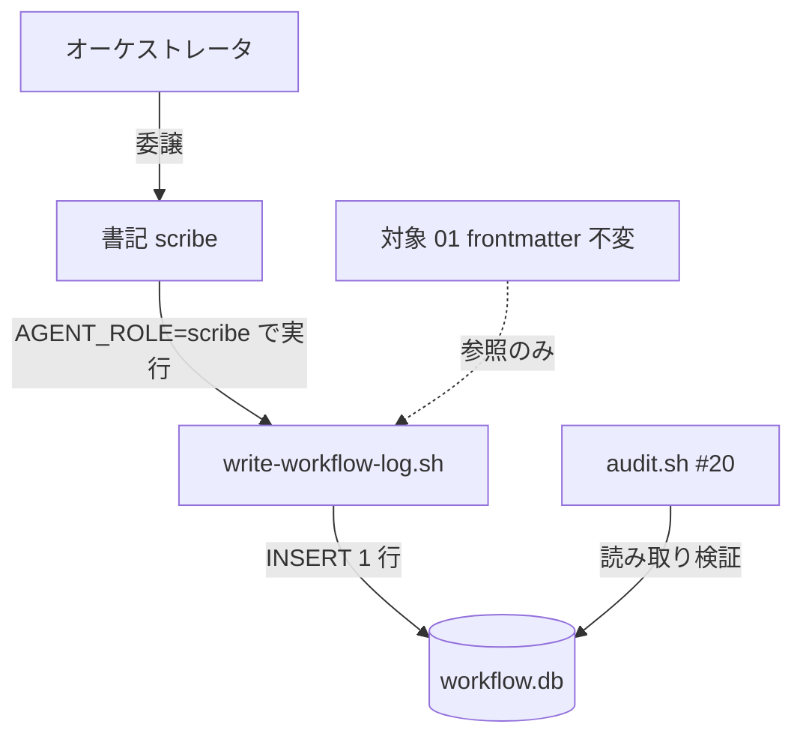
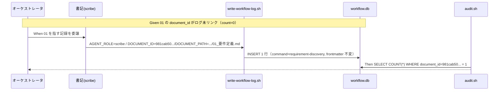
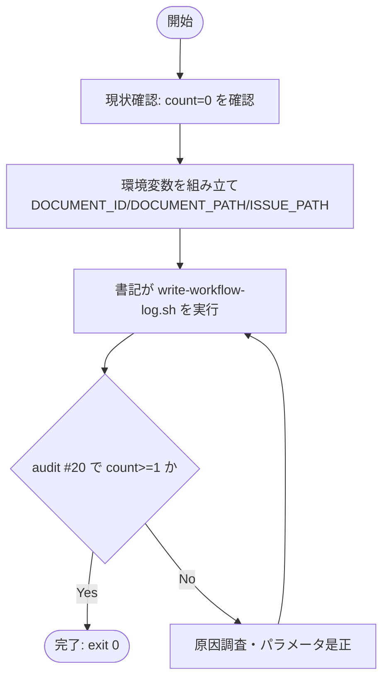

# 設計書: 進行中 issue multi-tool 対応の #20 document_id 未リンク是正

**プロジェクト名**: multi-tool 対応 #20 document_id 未リンク是正
**作成日**: 2026 年 06 月 15 日
**最終更新**: 2026 年 06 月 15 日

> **重要**: **このドキュメントは常に更新**: 設計の変更や追加があった場合は、即座にこのドキュメントを更新してください。ドキュメントは「生きているドキュメント」として扱い、実装内容と常に同期させます。
>
> **用語**: [.agents/CONCEPTS.md §用語規約](../../../../../.agents/CONCEPTS.md#用語規約) を参照。

---

## 1. 設計概要

**必須**: 設計方針・原則は [.agents/spec/01\_設計原則.md](../../../../../.agents/spec/01_設計原則.md) を**先に参照**した上で、本プロジェクトに**適用するものを選び**記載した。

### 1.1 設計方針

付与済み document_id を一切改変せず、当該 issue の正規ワークフロー（書記 = `write-workflow-log.sh`）で対象 01 を指す workflow_log エントリを **1 件だけ**追加し、audit #20 を解消する。新規スクリプト・新規 API は追加しない。

### 1.2 設計原則（本プロジェクトで適用するもの）

- **UNIX哲学**: 既存の書記ラッパー（1 回 1 行 INSERT）を**そのまま組み合わせて**使う。新規ツールを足さず、最小の操作で目的を達成する。
- **単一責務**: 記録は書記（scribe）のみが行う。is 是正側で frontmatter・本文・audit ロジックに責務を広げない。
- **明確な境界**: 「記録（workflow_log への INSERT）」と「成果物本文（frontmatter 含む）」を分離する。是正は記録側に限定し、成果物境界の内側（他者進行中 issue）には踏み込まない。

---

## 2. アーキテクチャ設計

### 2.1 責務・境界・参照関係

#### 2.1.1 責務一覧

| コンポーネント | 責務（1 文） |
| -------------- | ------------ |
| オーケストレータ | 是正フェーズを判定し、書記へ 1 件の記録を委譲する。 |
| 書記（scribe） | `write-workflow-log.sh` を `AGENT_ROLE=scribe` で実行し、対象 01 を指す 1 行を INSERT する唯一のロール。 |
| `write-workflow-log.sh` | 環境変数 DOCUMENT_ID / DOCUMENT_PATH / ISSUE_PATH 等を受け、workflow.db に 1 行 INSERT する（document_id 不変チェック・UUID 形式検証込み）。 |
| `audit.sh #20` | frontmatter の document_id が workflow_log に 1 件以上あるか検証する（**本 issue では変更しない**）。 |
| 対象 01（`981cab50-...`） | 是正の参照対象。frontmatter・本文ともに**不変**。 |

#### 2.1.2 境界

- **入力**: 対象 01 の既存 document_id（`981cab50-c0c9-4988-bbdd-f2b25f701f75`）と、そのプロジェクトルート相対パス（`docs/maintainer/workflow/20260614_173500_multi-tool対応/01_要件定義.md`）。
- **出力**: workflow_log に追加される 1 行（`command=requirement-discovery`、`document_id=981cab50-...`、`document_path=...01_要件定義.md`）。
- **他責務との境界**: 対象 issue（他者の進行中 issue）の成果物本文・frontmatter は範囲外（不変）。audit.sh の #20 判定ロジック改変も範囲外。他 3 件の進行中 issue（後述 §3.2）の 01 未リンクも**本 issue の範囲外**。

#### 2.1.3 参照関係

- オーケストレータ → 書記 → `write-workflow-log.sh` → workflow.db（INSERT）
- `audit.sh #20` → workflow.db（読み取り検証）
- 循環参照なし。記録（書記経路）と検証（audit）は一方向で、書き込みは書記のみ。

### 2.2 システムアーキテクチャ

**必須**: 設計判断は [.agents/spec/](../../../../../.agents/spec/)（[00_spec概要.md](../../../../../.agents/spec/00_spec概要.md)、[01\_設計原則.md](../../../../../.agents/spec/01_設計原則.md)、[06\_設計判断の優先順位.md](../../../../../.agents/spec/06_設計判断の優先順位.md)）を参照した。

- **採用パターン**: 既存パイプライン（書記ラッパー）の再利用による最小是正。
- **根拠**: spec の UNIX 哲学・単一責務に従い、新規コンポーネントを足さず既存の単一書き込み経路（書記）に集約する。他者の進行中成果物に副作用を出さない（最小是正）。

#### 2.2.1 CQRS（Command/Query 分離）

- **Command（状態変更）**: 書記による workflow_log への 1 行 INSERT。本 issue 唯一の状態変更。
- **Query（状態取得）**: `audit.sh #20` による document_id 紐付けの検証（読み取りのみ）。

#### 2.2.2 アーキテクチャ図

### 2.3 コンポーネント構成

明確な境界に従い、(1) 記録経路（書記 + ラッパー + DB）と (2) 検証経路（audit）と (3) 成果物（対象 01）を分離する。本 issue が触れるのは (1) の 1 行追加のみ。(2)(3) は不変。

### 2.4 データフロー

本 issue は「対象 01 の document_id がログに記録された」という事実を 1 行として残す。発行イベント相当は **WorkflowLogEntryRecorded**（要件フェーズの記録が 1 件追加された、という起きた事実）。

---

## 3. 機能設計

### 3.1 機能 1: 対象 01 を指す workflow_log の記録補完

#### 3.1.1 概要

書記が `write-workflow-log.sh` を 1 回実行し、対象 01（`981cab50-...`）を `command=requirement-discovery` として記録する。

#### 3.1.2 処理フロー

#### 3.1.3 入力・出力

- **入力（記録パラメータ）**:
  - `AGENT_ROLE=scribe`
  - `command` = `requirement-discovery`（対象 01 は要件フェーズ成果物のため整合）
  - `summary` = 6 文字以上の要約（例: 「multi-tool 対応 01 要件定義の document_id をログへ記録補完（#20 是正）」）
  - `dod_met` = `1`
  - `ts_utc` = `date -u +%Y-%m-%dT%H:%M:%SZ` の実行値
  - `issue_path` = `docs/maintainer/workflow/20260614_173500_multi-tool対応`
  - `DOCUMENT_ID` = `981cab50-c0c9-4988-bbdd-f2b25f701f75`（**既存値そのまま**）
  - `DOCUMENT_PATH` = `docs/maintainer/workflow/20260614_173500_multi-tool対応/01_要件定義.md`
  - **PARENT_ENTRY_ID は付与しない**（requirement-discovery は親必須ではなく、#16/#17 は verify-and-close のみに適用されるため付与不要・付与すると誤った因果を作る）。
- **出力**: workflow_log に 1 行追加。frontmatter・本文の変更なし。

#### 3.1.4 エラーハンドリング

- `DOCUMENT_ID` 空 → ラッパーが exit 1（必須チェック）。既存 UUID を必ず渡す。
- `command` 不正 → ラッパーが拒否。許可リスト内の `requirement-discovery` を使う。
- document_id 不変違反（#20+）: 同一 `document_path` に別 id が既記録なら拒否。対象 01 のパスは未記録（count=0）のため衝突しない。

### 3.2 機能 2: 恒久対策の要否判断（本 issue ではスコープ外＝別 issue 申し送り）

#### 3.2.1 構造的問題（事実）

audit 全体実行の結果、#20 ERROR は**対象 01（multi-tool）を含む計 4 件**であった。いずれも各 issue の `01_要件定義.md` で、frontmatter に document_id を持つが workflow_log に未リンク。各 issue とも **00 は記録済み・01 は未記録**で症状が一致する。

| issue | 00 ログ | 01 ログ | 01 document_id |
| ----- | ------- | ------- | -------------- |
| 20260614_173500_multi-tool対応（本 issue 対象） | 1 | 0 | `981cab50-...` |
| 20260615_054810_カバレッジ計測の自リポ適用 | 1 | 0 | `e9e685c7-...` |
| 20260615_054806_テスト実行基盤の整備 | 1 | 0 | `cb996fb4-...` |
| 20260615_054821_npm-publish検証と手順整備 | 1 | 0 | `3ce4377f-...` |

**根本原因**: `requirement-discovery` command は 00 と 01 の 2 成果物を生むが、`write-workflow-log.sh` は 1 実行で DOCUMENT_ID/DOCUMENT_PATH を 1 組しか記録しない。00 を記録した書記実行で 01 が記録されず、同型の未リンクが横並びで発生した。

#### 3.2.2 方針比較（恒久対策）

| 方針 | 内容 | 評価 |
| ---- | ---- | ---- |
| (a) 運用 | 複数成果物を生む command では**成果物ごとに書記を呼ぶ**運用を明文化（skill/command の制約に追記）。 | スクリプト不変で互換性最大。ただし呼び忘れに依存し再発余地が残る。検証は書記呼び出し回数のみ。 |
| (b) 拡張 | `write-workflow-log.sh` を**複数 document 記録対応**（例: 1 実行で追加成果物の document を別行 INSERT、または DOCUMENT_ID/PATH を複数受理）に拡張。 | 再発を構造的に抑止。ただしスキーマ/ハッシュ連結/不変チェックの整合・既存 3 issue への遡及記録・後方互換テストが必要で**影響範囲が広い**。 |

#### 3.2.3 確定（本 issue の判断）

- **本 issue のスコープは方針A（書記での 1 件記録補完）による multi-tool 01 の是正に限定する**（00/01 の定義どおり）。恒久対策（(a)/(b) のいずれを採るか、および他 3 issue の遡及記録）は**本 issue の範囲外とし、別 issue へ申し送る**。
  - **理由**: (1) 他 3 件は本 issue の 00/01 が対象としない別の進行中 issue であり、「他者進行中 issue は最小限の是正に留める」制約に従うと本 issue で巻き込むべきでない。(2) 方針(b) は write-workflow-log.sh のスキーマ/ハッシュ整合・遡及記録・後方互換まで設計範囲が広がり、単発是正 issue の責務を超える。
- **別 issue 申し送り内容（推奨）**: 「`requirement-discovery` 等の複数成果物 command で 01（および追加成果物）の document_id が未リンクになる構造を恒久対策する」。第一候補は**方針(a)（運用明文化＝低コスト・高互換）**、必要に応じ方針(b) を検討。対象には現存する他 3 issue の 01 未リンク解消（同じ書記 1 件記録）も含める。

#### 3.2.4 注意

audit #20 のスコープ縮小（対象除外）は採らない（00/01 で非推奨と明示済み）。証跡網羅性を損なうため。

---

## 4. データ設計

### 4.1 データモデル

既存スキーマ（`.agents/ledger/schema.sql` の `workflow_log`）をそのまま使用。新規テーブル・カラム追加なし。本 issue は 1 行を追加するのみ。

#### テーブル一覧

| テーブル名 | 説明 | 主キー |
| ---------- | ---- | ------ |
| workflow_log | 各 command 実行の証跡 1 行を保持する台帳 | entry_id |

#### テーブル詳細（本 issue で使用する主要カラム）

##### workflow_log（抜粋）

| カラム名 | 型 | NULL | デフォルト | 説明 | 備考 |
| -------- | -- | ---- | ---------- | ---- | ---- |
| entry_id | TEXT | NO | - | ログ 1 行の UUID | PK・ラッパーが自動生成 |
| command | TEXT | NO | - | 実行 command | `requirement-discovery` を使用 |
| document_id | TEXT | YES | NULL | 成果物 frontmatter の document_id | `981cab50-...` |
| document_path | TEXT | YES | NULL | 成果物のルート相対パス | 対象 01 のパス |
| issue_path | TEXT | YES | NULL | issue ディレクトリ | 対象 issue ディレクトリ |
| summary | TEXT | NO | - | 実施内容要約（>5 文字） | 是正内容 |
| dod_met | INTEGER | NO | - | 完了判定（0/1） | 1 |

### 4.2 データ構造

追加する 1 行は `command=requirement-discovery`、`document_id=981cab50-...`、`document_path=docs/maintainer/workflow/20260614_173500_multi-tool対応/01_要件定義.md`。`entry_hash`/`prev_hash` はラッパーが自動算出・連結する。

---

## 5. API 設計

### 5.1 API 一覧

| エンドポイント | メソッド | 説明 |
| -------------- | -------- | ---- |
| `write-workflow-log.sh`（CLI / 環境変数 I/F） | 実行 | workflow.db へ 1 行 INSERT する書記専用ラッパー |

### 5.2 API 詳細

#### API1: write-workflow-log.sh（記録）

- **エンドポイント**: `.agents/scripts/write-workflow-log.sh`
- **メソッド**: シェル実行（`AGENT_ROLE=scribe` 必須）
- **リクエスト**: 位置引数 `command summary dod_met ts_utc [issue_path] [changed_files]`＋環境変数 `DOCUMENT_ID` / `DOCUMENT_PATH`
- **レスポンス**: exit 0（成功・1 行 INSERT）
- **エラー**: `AGENT_ROLE!=scribe`、`DOCUMENT_ID` 空、command 不正、UUID 形式不正、document_id 不変違反 → exit 1

---

## 6. テスト戦略

テスト戦略の**観点の定義**は [RULES.md のテスト戦略必須要件](../../../../../.agents/RULES.md#テスト戦略必須要件) を、**BDD 形式の定義**は [TEST_BDD_FORMAT.md](../../../../../.agents/TEST_BDD_FORMAT.md) を参照する。本ドキュメントでは**対象ごとのテスト割当**のみ記載する。

### 6.1 対象ごとのテスト割り当て

| 対象 | 単体 | 結合/API | E2E | クリティカル観点 | バリデーション観点 | 未達理由/補足 |
| ---- | ---- | -------- | --- | ---------------- | ------------------ | ------------- |
| 記録補完（書記 1 行 INSERT） | × | ○ | ○ | 記録後に対象 01 の document_id が count>=1 になる | DOCUMENT_ID は既存値、frontmatter diff 0 | 単体は対象外（既存ラッパーを利用するのみ） |
| audit #20（DB 込みリポ全体 audit） | × | ○ | ○ | 記録後 #20 ERROR 0 件・exit 0 | 対象 01 のみ対象、他チェック非悪化 | 結合 = tmp 隔離での検証、E2E = 本リポ実行 |
| document_id 不変（#20+） | × | ○ | - | 同一 path に別 id を記録しない | 既存値と一致 | DB 非破壊 |

> 検証は **tmp 隔離**（`mktemp -d` ＋本リポ DB をコピーした隔離 DB、または読み取り専用）で行い、本リポの `.workflow/workflow.db` と成果物を破壊しないこと。本リポ実 DB への記録は書記フェーズ（verify-and-close 相当の記録）でのみ行う。

### 6.2 監査・レビューでの確認（証跡）

§6.1 の割当と 03_実装計画のタスク別テスト観点・BDD が揃っていることを確認する。記録後に `bash .agents/enforcement/ci/audit.sh .` の #20 が対象 01 について ERROR を出さず exit 0（他 3 issue 由来の #20 を除く本 issue 対象の解消）であることを証跡化する。

> **注**: 他 3 issue の 01 未リンク（§3.2）は別 issue 申し送りのため、本 issue 完了時点で audit 全体が exit 0 になるとは限らない。**本 issue の合否は「対象 01（`981cab50-...`）の #20 ERROR が消えること」で判定**し、他 3 件の残存は本 issue の失敗としない（00/01 の成功基準は対象 01 の解消＋全体 exit 0 を理想とするが、後者は別 issue 完了に依存する旨を 04 レビューで明記する）。

---

## 7. UI 設計

該当なし（CLI / バッチ処理のみ）。

---

## 8. セキュリティ設計

### 8.1 認証・認可

workflow.db への書き込みは `AGENT_ROLE=scribe` の書記経路のみ。任意 SQL の直接実行は行わない。

### 8.2 データ保護

検証は tmp 隔離で行い、本番 DB・成果物を破壊しない。記録は 1 行 INSERT に限定。

---

## 9. 非機能要件への対応

### 9.1 パフォーマンス

1 行 INSERT のみ。性能影響なし。

### 9.2 可用性

既存スキーマ（document_id / document_path / issue_path）で動作し、他環境でも再現可能。

---

## 10. 参考資料

### プロジェクトドキュメント

- [`01_要件定義.md`](./01_要件定義.md) - 要件定義
- [`.agents/enforcement/ci/audit.sh`](../../../../../.agents/enforcement/ci/audit.sh)（#20 / #20+）
- [`.agents/scripts/write-workflow-log.sh`](../../../../../.agents/scripts/write-workflow-log.sh)（記録仕様）
- `docs/maintainer/workflow/20260614_173500_multi-tool対応/01_要件定義.md`（対象）

### その他の参考資料

- [`.agents/skills/logging/write-workflow-log/`](../../../../../.agents/skills/logging/write-workflow-log/)（書記手順）

---

## 11. 前のステップ

この設計書は、以下のドキュメントを基に作成されています：

- **前**: [`01_要件定義.md`](./01_要件定義.md) - 要件定義フェーズ

---

## 12. 次のステップ

この設計書の承認後、以下のドキュメントを作成します：

- **次**: [`03_実装計画.md`](./03_実装計画.md) - 実装計画フェーズ
