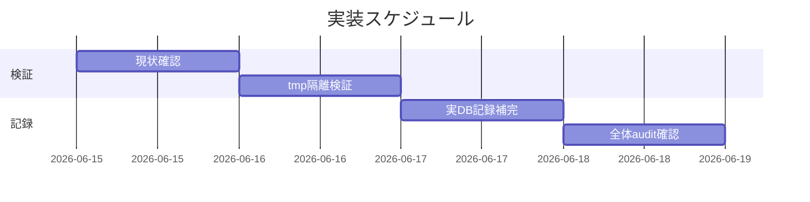

# 実装計画書: 進行中 issue multi-tool 対応の #20 document_id 未リンク是正

**プロジェクト名**: multi-tool 対応 #20 document_id 未リンク是正
**作成日**: 2026 年 06 月 15 日
**最終更新**: 2026 年 06 月 15 日

> **重要**: **このドキュメントは常に更新**: 実装計画の変更、進捗状況の更新、バグの記録などがあった場合は、即座にこのドキュメントを更新してください。
> **必須項目**: 「必須」と明記した欄は空欄・抽象語のみで提出しないこと。テスト観点・BDD 仕様は具体ケースを 1 件以上記載すること。
>
> **用語**: [.agents/CONCEPTS.md §用語規約](../../../../../.agents/CONCEPTS.md#用語規約) を参照。

---

## 1. 実装概要

### 1.1 実装方針（必須）

付与済み document_id を改変せず、書記（`write-workflow-log.sh`、`AGENT_ROLE=scribe`）で対象 01 を指す 1 行を追加して audit #20 を解消する。検証は tmp 隔離で行い、本リポ実 DB への記録は書記フェーズでのみ実施する。恒久対策は別 issue へ申し送る（02 §3.2）。

### 1.2 実装順序（必須: 1 件以上）

1. タスク 1: 現状の事実確認（対象 01 の document_id が count=0 であること）
2. タスク 2: tmp 隔離での記録手順検証（隔離 DB に対し書記実行 → 隔離 audit で #20 解消を確認）
3. タスク 3: 本リポ実 DB への記録補完（書記が 1 行 INSERT）
4. タスク 4: DB 込みリポ全体 audit で対象 01 の #20 解消を確認（恒久対策の別 issue 申し送りを記録）



---

## 2. タスク分解

**必須**: 各タスクには **「テスト観点」（2.x.3）** と **「単体テスト仕様（BDD）」（2.x.4）** を必ず記載する。

### 2.1 タスク 1: 現状の事実確認

#### 2.1.1 概要（必須）

是正前に「対象 01 の document_id がログに 0 件」であることを確認し、frontmatter 付与漏れではなく記録漏れであることを固定する。

#### 2.1.2 実装内容（必須: 1 件以上）

- 対象 01 frontmatter の document_id が `981cab50-c0c9-4988-bbdd-f2b25f701f75`（正規 UUID）であることを確認。
- `SELECT COUNT(*) FROM workflow_log WHERE document_id='981cab50-...'` が 0 であることを確認。
- 対象 00 の document_id（`80bf0cd1-...`）は `requirement-discovery` で記録済みであることを確認（症状の対比）。

#### 2.1.3 テスト観点（必須）

**参照**: 観点の定義は [02\_設計 §6](./02_設計.md) および [RULES のテスト戦略・TEST_BDD_FORMAT](../../../../../.agents/RULES.md#テスト戦略必須要件) を参照。

##### 単体（本タスクの具体ケース・必須 1 件以上）

- 対象 01 の document_id を抽出すると `981cab50-...` を返す（読み取りのみ）。

##### 結合/API（本タスクの具体ケース・該当時は必須 1 件以上）

- `COUNT(*) WHERE document_id='981cab50-...'` が記録前は 0 を返す。

##### E2E/受け入れ（本タスクの具体ケース・未達時は理由記載）

- `audit.sh .` 実行時、対象 01 が #20 ERROR として列挙される（記録前の基準状態）。

##### バリデーション（該当する場合の具体ケース）

- 該当なし（読み取り確認のみ）。

#### 2.1.4 単体テスト仕様（BDD）（必須）

```gherkin
Feature: 是正前の事実確認
  Scenario: 対象 01 の document_id がログ未リンクである
    Given 対象 01 の frontmatter に document_id 981cab50-... が付与済み
    When workflow_log を document_id=981cab50-... で集計する
    Then 件数は 0 である
    And audit #20 は対象 01 を ERROR として列挙する
```

**テストコード例（必須: インラインコメントで Given/When/Then を明記）**

```bash
# Given: 対象 01 に document_id 981cab50-... が付与済み
doc_id=$(sed -n 's/^document_id: *"\(.*\)"/\1/p' "docs/maintainer/workflow/20260614_173500_multi-tool対応/01_要件定義.md" | head -1)
# When: workflow_log を集計する
cnt=$(sqlite3 .workflow/workflow.db "SELECT COUNT(*) FROM workflow_log WHERE document_id='$doc_id';")
# Then: 記録前は 0 件
test "$cnt" = "0"
```

#### 2.1.5 依存関係

- なし（先頭タスク）。

#### 2.1.6 見積もり

- **工数**: 0.2h　**優先度**: 高

### 2.2 タスク 2: tmp 隔離での記録手順検証

#### 2.2.1 概要（必須）

本リポ DB を破壊せず、隔離 DB に対して書記実行 → 隔離 audit で「対象 01 の #20 が解消する」ことを確認する。

#### 2.2.2 実装内容（必須: 1 件以上）

- `mktemp -d` で隔離ディレクトリを作成し、`git archive HEAD | tar -x` でクリーンなツリーを再現（または本リポの `.workflow/workflow.db` を隔離先へ**コピー**して隔離 DB を用意）。
- 隔離環境で `AGENT_ROLE=scribe write-workflow-log.sh requirement-discovery "<summary>" 1 "<ts>" <issue_path>` を `DOCUMENT_ID`/`DOCUMENT_PATH` 付きで実行。
- 隔離環境で `audit.sh <隔離ルート>` を実行し、対象 01 の #20 ERROR が消えることを確認。
- 検証後に隔離環境を `rm -rf` で片付け、本リポの `.workflow/`・`workflow.db`・成果物が不変であることを確認。

#### 2.2.3 テスト観点（必須）

**参照**: [02\_設計 §6](./02_設計.md) / [RULES](../../../../../.agents/RULES.md#テスト戦略必須要件)。

##### 単体（本タスクの具体ケース・必須 1 件以上）

- 隔離 DB に対する書記実行が exit 0 で 1 行追加する。

##### 結合/API（本タスクの具体ケース・該当時は必須 1 件以上）

- 隔離 audit #20 が、記録後に対象 01 を ERROR 列挙しない。

##### E2E/受け入れ（本タスクの具体ケース・未達時は理由記載）

- 隔離環境片付け後、本リポ `git status` に `.workflow/`・`workflow.db`・他成果物の変更が現れない（DB 非破壊）。

##### バリデーション（該当する場合の具体ケース）

- `AGENT_ROLE` 未設定で実行すると exit 1（書記ガード）。

#### 2.2.4 単体テスト仕様（BDD）（必須）

```gherkin
Feature: tmp 隔離での記録手順検証
  Scenario: 隔離 DB で対象 01 を記録すると #20 が解消する
    Given mktemp -d で隔離ツリーと隔離 workflow.db を用意した
    When 書記が DOCUMENT_ID=981cab50-.../DOCUMENT_PATH=.../01_要件定義.md で記録する
    Then 隔離 DB の対象 01 件数が 1 になる
    And 隔離 audit #20 は対象 01 を ERROR 列挙しない
    And 本リポの workflow.db と成果物は不変である
```

**テストコード例（必須: インラインコメントで Given/When/Then を明記）**

```bash
# Given: 隔離ツリーと隔離 DB を用意
tmp=$(mktemp -d); git archive HEAD | tar -x -C "$tmp"
cp .workflow/workflow.db "$tmp/.workflow/workflow.db" 2>/dev/null || true
# When: 隔離 DB に対し書記が 1 行記録（ラッパーは固定パス .workflow/workflow.db を使う）
( cd "$tmp" && AGENT_ROLE=scribe .agents/scripts/write-workflow-log.sh \
    requirement-discovery "multi-tool 01 document_id 記録補完(#20是正)" 1 "$(date -u +%Y-%m-%dT%H:%M:%SZ)" \
    "docs/maintainer/workflow/20260614_173500_multi-tool対応" )  # DOCUMENT_ID/PATH は環境変数で付与
# Then: 隔離 audit で対象 01 の #20 が消える / 本リポ DB は不変
( cd "$tmp" && DOCUMENT_ID=981cab50-c0c9-4988-bbdd-f2b25f701f75 \
  DOCUMENT_PATH=docs/maintainer/workflow/20260614_173500_multi-tool対応/01_要件定義.md \
  bash .agents/enforcement/ci/audit.sh . ) ; rm -rf "$tmp"
```

> 注: 上記は手順の骨子。実装時は `DOCUMENT_ID`/`DOCUMENT_PATH` を書記実行の環境変数として正しく前置すること（コード例の改行の都合で簡略表記）。

#### 2.2.5 依存関係

- タスク 1 完了後。

#### 2.2.6 見積もり

- **工数**: 0.5h　**優先度**: 高

### 2.3 タスク 3: 本リポ実 DB への記録補完（書記フェーズ）

#### 2.3.1 概要（必須）

書記が本リポの `write-workflow-log.sh` を 1 回実行し、対象 01 を指す 1 行を追加する（frontmatter 不変）。

#### 2.3.2 実装内容（必須: 1 件以上）

- `AGENT_ROLE=scribe` で `command=requirement-discovery`、`summary`（6 文字超）、`dod_met=1`、`ts_utc=$(date -u +%Y-%m-%dT%H:%M:%SZ)`、`issue_path=docs/maintainer/workflow/20260614_173500_multi-tool対応`、`DOCUMENT_ID=981cab50-...`、`DOCUMENT_PATH=docs/maintainer/workflow/20260614_173500_multi-tool対応/01_要件定義.md` で 1 回実行。
- **PARENT_ENTRY_ID は付与しない**（requirement-discovery は親不要・#16/#17 非対象）。
- 対象 01・00 の frontmatter と本文を**一切編集しない**。

#### 2.3.3 テスト観点（必須）

##### 単体（本タスクの具体ケース・必須 1 件以上）

- 実行後 `COUNT(*) WHERE document_id='981cab50-...'` が 1 を返す。

##### 結合/API（本タスクの具体ケース・該当時は必須 1 件以上）

- 追加行の `command='requirement-discovery'`・`document_path` が対象 01 のパスに一致する。

##### E2E/受け入れ（本タスクの具体ケース・未達時は理由記載）

- `git diff` で対象 issue の 00/01 に変更が無い（frontmatter diff 0・本文 diff 0）。

##### バリデーション（該当する場合の具体ケース）

- `DOCUMENT_ID` を空で渡すと exit 1（誤って付与漏れさせない）。

#### 2.3.4 単体テスト仕様（BDD）（必須）

```gherkin
Feature: 本リポ実 DB への記録補完
  Scenario: 書記が対象 01 を 1 行記録する
    Given 本リポ workflow.db に対象 01 の document_id 行が無い
    When 書記が requirement-discovery として DOCUMENT_ID/PATH 付きで 1 回実行する
    Then workflow_log に document_id=981cab50-... の行が 1 件以上できる
    And 対象 issue の 00/01 の frontmatter・本文は変更されない
```

**テストコード例（必須: インラインコメントで Given/When/Then を明記）**

```bash
# Given: 記録前は 0 件
sqlite3 .workflow/workflow.db "SELECT COUNT(*) FROM workflow_log WHERE document_id='981cab50-c0c9-4988-bbdd-f2b25f701f75';"  # 0
# When: 書記が 1 行記録（本則経路）
AGENT_ROLE=scribe \
DOCUMENT_ID=981cab50-c0c9-4988-bbdd-f2b25f701f75 \
DOCUMENT_PATH=docs/maintainer/workflow/20260614_173500_multi-tool対応/01_要件定義.md \
.agents/scripts/write-workflow-log.sh requirement-discovery \
  "multi-tool 対応 01 要件定義の document_id をログへ記録補完(#20是正)" 1 \
  "$(date -u +%Y-%m-%dT%H:%M:%SZ)" "docs/maintainer/workflow/20260614_173500_multi-tool対応"
# Then: 1 件以上 / 成果物 diff 0
sqlite3 .workflow/workflow.db "SELECT COUNT(*) FROM workflow_log WHERE document_id='981cab50-c0c9-4988-bbdd-f2b25f701f75';"  # >=1
git diff --quiet -- "docs/maintainer/workflow/20260614_173500_multi-tool対応/" && echo "成果物 diff 0"
```

#### 2.3.5 依存関係

- タスク 2 で手順検証後。

#### 2.3.6 見積もり

- **工数**: 0.2h　**優先度**: 高

### 2.4 タスク 4: 全体 audit 確認と恒久対策の申し送り

#### 2.4.1 概要（必須）

記録後に DB 込みリポ全体 audit を実行し、対象 01（`981cab50-...`）の #20 ERROR が解消したことを確認する。恒久対策の別 issue 申し送りを 04_review / 証跡へ明記する。

#### 2.4.2 実装内容（必須: 1 件以上）

- `bash .agents/enforcement/ci/audit.sh .` を実行し、出力から対象 01 の #20 ERROR が消えていることを確認。
- 他 3 issue（`e9e685c7-...`/`cb996fb4-...`/`3ce4377f-...`）の 01 未リンクは**本 issue 対象外**である旨と、恒久対策（02 §3.2.3：第一候補=方針(a) 運用明文化）を別 issue 申し送りとして記録。
- DB が破壊されていない（既存行が減っていない）ことを確認。

#### 2.4.3 テスト観点（必須）

##### 単体（本タスクの具体ケース・必須 1 件以上）

- audit 出力に対象 01（`981cab50-...`）を含む #20 ERROR 行が現れない。

##### 結合/API（本タスクの具体ケース・該当時は必須 1 件以上）

- 既存 workflow_log 行数が記録前 +1 以上で、減少していない（DB 非破壊）。

##### E2E/受け入れ（本タスクの具体ケース・未達時は理由記載）

- 本 issue の合否は「対象 01 の #20 解消」で判定する。全体 exit 0 は他 3 issue の別 issue 完了に依存するため、未完なら理由を 04 に明記（未達理由を記載可）。

##### バリデーション（該当する場合の具体ケース）

- 該当なし。

#### 2.4.4 単体テスト仕様（BDD）（必須）

```gherkin
Feature: 全体 audit 確認
  Scenario: 対象 01 の #20 が解消する
    Given 書記が対象 01 を記録済みである
    When bash .agents/enforcement/ci/audit.sh . を実行する
    Then 出力に document_id=981cab50-... を含む #20 ERROR が無い
    And 既存の workflow_log 行は減っていない
```

**テストコード例（必須: インラインコメントで Given/When/Then を明記）**

```bash
# Given: 記録済み（タスク3完了）
# When: 全体 audit を実行
out=$(bash .agents/enforcement/ci/audit.sh . 2>&1 || true)
# Then: 対象 01 の #20 ERROR が無い
echo "$out" | grep -q "981cab50-c0c9-4988-bbdd-f2b25f701f75" && { echo "NG: 対象 01 がまだ #20"; exit 1; } || echo "OK: 対象 01 解消"
```

#### 2.4.5 依存関係

- タスク 3 完了後。

#### 2.4.6 見積もり

- **工数**: 0.3h　**優先度**: 高

---

## テスト観点

- 記録前後で対象 01 の document_id 集計が 0 → 1 へ変化する（結合）。
- 全体 audit で対象 01 の #20 ERROR が消える（E2E、本 issue の合否基準）。
- 対象 issue の 00/01 frontmatter・本文の diff 0（バリデーション・不変規約）。
- tmp 隔離検証で本リポ DB・成果物が不変（DB 非破壊）。
- 各タスクの §2.x.3 に具体ケースを記載済み。

---

## 単体テスト

- 既存ラッパーの再利用のため新規ユニットコードは追加しない。検証は集計クエリ・audit 出力・git diff で行う。各タスク §2.x.4 に BDD 仕様を記載。

---

## BDD

- タスク 1〜4 の各 §2.x.4 に Given/When/Then を記載（TEST_BDD_FORMAT 準拠）。

---

## 3. 実装スケジュール

### 3.1 マイルストーン

| マイルストーン | 期日 | 成果物 |
| -------------- | ---- | ------ |
| 隔離検証完了 | 2026-06-15 | 隔離環境での #20 解消ログ |
| 実 DB 記録完了 | 2026-06-15 | workflow_log への 1 行追加 |
| 全体 audit 確認 | 2026-06-15 | 対象 01 #20 解消の確認・申し送り記録 |

### 3.2 実装フェーズ

#### フェーズ 1: 検証

- **期間**: 当日　**タスク**: タスク 1・2

#### フェーズ 2: 記録・確認

- **期間**: 当日　**タスク**: タスク 3・4

---

## 4. テスト計画

### 4.1 テストの優先順位

- クリティカル: 対象 01 の #20 解消（E2E）と frontmatter 不変（バリデーション）を必ず検証。
- DB 非破壊は tmp 隔離検証と記録後の行数確認で回帰防止。

---

## 5. リスク管理

### 5.1 実装リスク

- **リスク**: 是正のため frontmatter document_id を誤って付け替える（不変規約違反・#20+ 発火）。
  - **対策**: frontmatter は一切触らず、既存値 `981cab50-...` をそのまま `DOCUMENT_ID` に渡す。
- **リスク**: 本リポ実 DB へ検証段階で誤書き込みする。
  - **対策**: 検証は tmp 隔離で行い、実 DB への記録は書記フェーズの 1 回のみ。
- **リスク**: 他 3 issue を本 issue で巻き込み「他者進行中 issue 最小是正」制約に反する。
  - **対策**: 本 issue は対象 01 のみ記録。恒久対策と他 3 件は別 issue 申し送り（02 §3.2.3）。

---

## 6. 参考資料

### プロジェクトドキュメント

- [`02_設計.md`](./02_設計.md) - 設計
- [`.agents/scripts/write-workflow-log.sh`](../../../../../.agents/scripts/write-workflow-log.sh)
- [`.agents/enforcement/ci/audit.sh`](../../../../../.agents/enforcement/ci/audit.sh)

### その他の参考資料

- [`.agents/skills/logging/write-workflow-log/`](../../../../../.agents/skills/logging/write-workflow-log/)

---

## 7. 前のステップ

この実装計画書は、以下のドキュメントを基に作成されています：

- **前**: [`02_設計.md`](./02_設計.md) - 設計フェーズ

---

## 8. 次のステップ

この実装計画書の承認後、以下に進みます：

- **プロジェクトが 1 つの issue（タスク）である場合**: 実装フェーズ（execution）に直接進む（本 issue はサブ issue 分割なし）。

**用語**: [.agents/CONCEPTS.md §用語規約](../../../../../.agents/CONCEPTS.md#用語規約) を参照。
