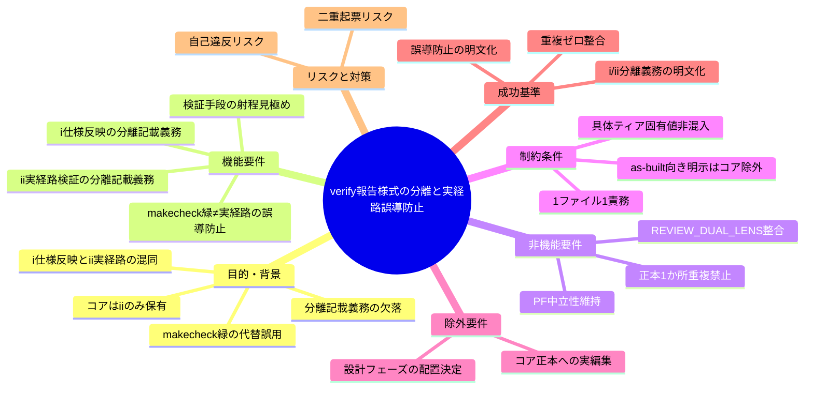
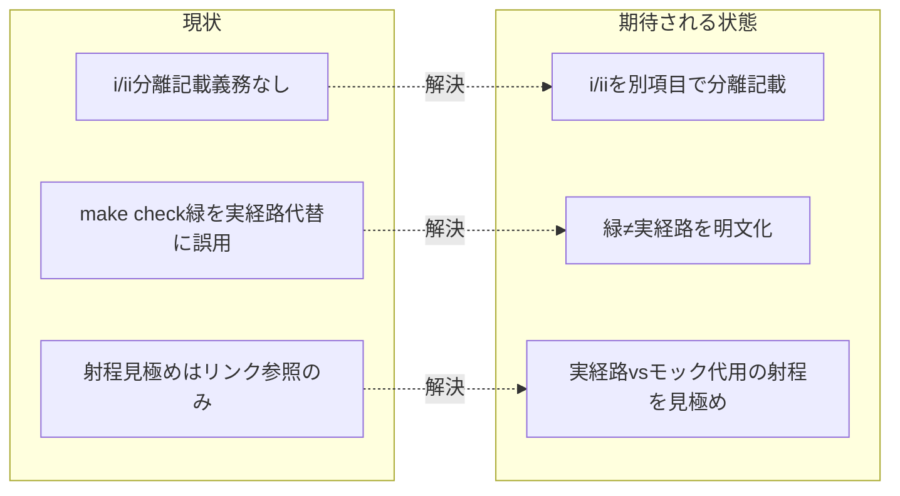

# 要求定義書: verify 報告様式の分離と実経路誤導防止

**プロジェクト名**: verify 報告様式の分離と実経路誤導防止
**作成日**: 2026 年 06 月 15 日
**最終更新**: 2026 年 06 月 15 日

> **重要**:
>
> - 要求定義書は、プロジェクトの全体像を把握するためのものです。詳細な技術仕様や実装方法は要件定義書以降で記載します。必要最低限の情報に収めることを心掛けてください。
> - **このドキュメントは常に更新**: 要求の変更や追加があった場合は、即座にこのドキュメントを更新してください。ドキュメントは「生きているドキュメント」として扱い、実装内容と常に同期させます。
> - **必須項目**: 以下の「必須」と明記した項目は空欄・抽象語のみ（例: 「{説明}」のまま）で提出しないこと。判定可能な形（目的は1文・成功基準は○/×で判定できる記載等）で記入すること。
>
> **用語**: [.agents/CONCEPTS.md §用語規約](../../../../../../../.agents/CONCEPTS.md#用語規約) を参照。

---

## 要求定義の全体像

**注意**:

- 上記の「プロジェクト名」は実際のサブ issue 名に置き換えています。
- マインドマップは全体像を把握するためのものです。主要なセクション名程度に留め、詳細は記載していません。

---

## 1. 目的・背景

### 1.1 目的（必須）

verify 証跡で (i) 仕様反映と (ii) 実経路検証の分離記載義務と緑≠実経路の誤導防止をコア化する。

### 1.2 背景

- **現状の課題**:
  - 元 system-graph ポリシー（`IMPLEMENTATION_CLOSEOUT_POLICY.md` 2節 step5・5節、`REVIEW_DUAL_LENS_POLICY.md` 2.1節）は、verify-and-close / 04_review において **(i) システム仕様書本体への反映（不要／反映済み）** と **(ii) production・実 I/O 経路の実行検証（実行済み／未実行／該当なし）** を**それぞれ独立項目として分離記載**し、両者を混同・合算しないこと（誤導防止）を要求していた。
  - 同ポリシーは **make check 緑を (ii) の代替として報告してはならない**（単体テスト・FakeDriver は実経路の正しさを保証しない）とし、実 I/O が主題の feature は実経路結合テストを verify 要件に含め、無ければ (ii)=未実行 として follow-up 起票することを求めていた。
  - **コアの現状**（grep 確認済み）: `.agents/commands/implement-feature.md`（§verify-実経路検証, 94-96 行付近）と `.agents/commands/verify-and-close.md`（96 行付近）は **(ii) 実経路検証は持つ**が、(i)/(ii) を「別項目として分離記載する義務」と「make check 緑 ≠ 実経路の誤導防止」が**欠落**している。`.agents/` 全体に対し `分離記載｜別項目｜make check 緑｜誤導` は **0 ヒット**で、この汎用原理が未昇格であることを確認した。
  - `.agents/REVIEW_DUAL_LENS.md §3 証跡要求` は敵対的観点リスト・must-preserve リストの両立を要求するが、「実経路 vs モック代用の射程を見極める」観点はリンク参照（§5）に留まり、verify 証跡の (i)/(ii) 分離記載義務とは直結していない。

- **必要性**:
  - verify 証跡で (i) と (ii) が混同・合算されると、「make check が緑＝実経路も検証済み」と読み手を誤導し、実 I/O 経路の検証漏れが「検証済み」に偽装される。退行・本番事故の温床になる。
  - この誤導防止は特定 PF・特定システムに依存しない**汎用原理**であり、コア（`.agents/`）の品質ゲートとして昇格させる必要がある。

#### 1.2.x 既出確認（二重起票防止）の結論

- 親 issue（`docs/maintainer/workflow/20260615_055806_コア取り込み漏れ補完/`、issue_id: 434c7b86-4222-45e7-a0ef-1ae455f15313）の 90_issues.md 確定起票順序表で、本サブは**順 2・🟠** として登録済み。先祖（親 00）・兄弟（S1 取りこぼし／S3 モデル選定／S4 must-preserve ラウンド継承／S5 構造是正）・close 済み調査 issue（`docs/maintainer/workflow/close/20260614_162712_コア取り込み候補調査/`＝取り込み調査で別物）を走査し、**本主題（verify (i)/(ii) 分離記載義務と緑≠実経路の誤導防止）と重複する既出 issue は無い**ことを確認した。よって新規起票する。

### 1.3 期待される効果（必須: 1 件以上）

- **効果 1**: verify 証跡で (i) 仕様反映と (ii) 実経路検証を別項目として分離記載する義務がコアに明文化される（○/×: コアの該当箇所に「(i) と (ii) を別項目として分離記載する」義務が記載されているか）。
- **効果 2**: テスト緑（make check 等）を実経路検証 (ii) の代替にしないこと、検証手段の射程（実経路 vs モック代用）を見極めることがコアに明文化される（○/×: コアの該当箇所に「make check 緑 ≠ 実経路検証」の誤導防止が記載されているか）。
- **効果 3**: 既存の verify(ii)・REVIEW_DUAL_LENS との重複を作らずリンクで整合する（○/×: 同一定義が 2 か所に重複していないか）。

**現状と期待される状態の比較**（必要に応じて）:

---

## 2. 機能要件

### 2.1 既存機能の維持（該当する場合）

- 既存の verify(ii) 実経路検証（`implement-feature.md §verify-実経路検証`、`verify-and-close.md` のクローズアウト確認）を維持する。
- `REVIEW_DUAL_LENS.md §3 証跡要求`（敵対的観点リスト・must-preserve リストの両立）を破壊せず整合させる。
- コアの PF 中立性、1 ファイル 1 責務・重複禁止、既存正本へのリンク委譲を維持する。

### 2.2 新規機能要件

- **(i)/(ii) 分離記載義務のコア昇格**: verify 証跡では「(i) 仕様反映の有無（不要／反映済み）」と「(ii) 実経路検証の結果（実行済み／未実行／該当なし）」を**別項目として分離記載**し、両者を混同・合算しないことをコアに明文化する。
- **緑 ≠ 実経路の誤導防止のコア昇格**: テスト緑（make check 等の単体・モック代用）を (ii) 実経路検証の代替として報告しないこと、検証手段の射程（実経路 vs モック代用）を見極めることをコアに明文化する。実 I/O が主題の対象で実経路検証手段が無い場合は (ii)=未実行 とし follow-up を起票する（取りこぼし防止と整合）。
- **重複なしのリンク整合**: 上記は既存の verify(ii)・`REVIEW_DUAL_LENS.md` の正本へリンク委譲し、定義を 2 か所に重複させない。具体配置（`implement-feature.md §verify-実経路検証` 拡張か `REVIEW_DUAL_LENS.md §3` 整合か）は**設計フェーズ**で決定する。

### 2.3 本 issue の境界

- 本 issue は**要求・要件まで**を作成する（00・01）。コア正本への実際の編集・具体配置決定は後続フェーズ（02 設計以降）で扱う。
- 親の 90_issues.md は本 issue では編集しない（別サブが一括更新する）。

---

## 3. 非機能要件

### 3.1 パフォーマンス

- コアへの追記は抽象原則の最小集合に留め、verify 工程の手数・コンテキストを肥大化させない。

### 3.2 セキュリティ

- 高リスク操作は伴わない。本 issue は要求・要件文書のみを作成する。

### 3.3 互換性

- コアの PF 中立性を壊さない。具体ティア・モデル名・固有値はコアに置かない。
- `as-built 仕様同期の向き明示` は system-graph 固有色が強いためコア除外とし、(i) は「仕様反映の有無を分離して明記する」という汎用形に留める。

### 3.4 保守性

- 補完内容は「コア汎用の抽象ルール（`.agents/`）」と「`.agents-project/` 固有の具体運用」に分離する。
- 既存正本（verify(ii)・REVIEW_DUAL_LENS）へはリンク委譲し、定義を重複させない（1 ファイル 1 責務）。

---

## 4. 制約条件

### 4.1 技術的制約

- **PF 中立**: 具体ティア表・モデル名・固有値・特定システムの実装詳細はコアに置かない。
- **1 ファイル 1 責務・重複禁止**: 既存正本へはリンク委譲する。
- **コア除外**: `as-built 仕様同期の向き明示`（system-graph 固有）はコアに昇格しない。(i) は汎用形「仕様反映の有無を分離記載」に留める。

### 4.2 既存システムとの互換性

- 取り込み済みコア正本（`implement-feature.md §クローズアウト・§verify-実経路検証`、`verify-and-close.md`、`REVIEW_DUAL_LENS.md`）を破壊せず、欠落分（分離記載義務・誤導防止）の追記・整合にとどめる。
- 関連背景として close 済み `docs/maintainer/workflow/close/20260614_162712_コア取り込み候補調査/` を参照してよい（取り込み調査側であり本件＝取り込み後の漏れ補完とは別物）。

### 4.3 移行期間・スケジュール

- 親 90_issues.md の確定起票順序で本サブは順 2。follow-up 起票（(ii)=未実行 時）は、順 1「取りこぼし防止と既出確認のコア昇格」（S1, issue_id: de775cbb-02e9-4b22-88bd-16b8fb15b8dc）で**昇格予定の no-drop/follow-up 起票のコア原理**へ委譲・整合させる。S1 のコア原理はまだ `.agents/` に存在しないため、本サブの設計・実装は S1 の昇格を前提とせず、follow-up 起票の**定義は本サブで重複させず S1 を正本として参照する**にとどめる（順序依存の明示）。

---

## 5. 除外要件

- **具体配置の決定**（`implement-feature.md` 拡張か `REVIEW_DUAL_LENS.md §3` 整合か）。設計フェーズ（02）で扱う。
- **コア正本への実際の編集**（差分適用）。本 issue は要求・要件まで。
- **`as-built 仕様同期の向き明示`のコア化**（system-graph 固有のため除外）。
- **親 90_issues.md の編集**（別サブが一括更新）。

---

## 6. 成功基準（必須: 1 件以上）

- コアに「verify 証跡では (i) 仕様反映と (ii) 実経路検証を別項目として分離記載する」義務が明文化される（○/×）。
- コアに「テスト緑（make check 等）を実経路検証の代替にしない／検証手段の射程（実経路 vs モック代用）を見極める」誤導防止が明文化される（○/×）。
- 既存の verify(ii)・REVIEW_DUAL_LENS との重複を作らずリンク整合する（○/×: 同一定義の 2 か所重複が無いか）。
- (ii)=未実行 のとき follow-up 起票（取りこぼし防止と整合）が要件に含まれる（○/×）。
- 本 issue は 00・01 のみを作成し、親 90_issues.md を編集しない（○/×）。

---

## 7. リスクと対策

### 7.1 技術的リスク

- **リスク**: (i)/(ii) 分離義務・誤導防止を既存 verify(ii) や REVIEW_DUAL_LENS と重複して書き、正本 1 か所原則に自己違反する。
  - **対策**: 既存正本へリンク委譲し、追記は欠落要素（分離記載義務・緑≠実経路）に限定する。具体配置は設計で一意に決める。
- **リスク**: system-graph 固有の `as-built 向き明示` をコアに持ち込み PF 中立性を壊す。
  - **対策**: (i) は汎用形「仕様反映の有無を分離記載」に留め、向き明示はコア除外とすることを 00/01 に明記する。

### 7.2 スケジュールリスク

- **リスク**: (ii)=未実行 時の follow-up 起票が S1（取りこぼし防止）と整合せず、取りこぼしが発生する。
  - **対策**: 本サブの要件で follow-up 起票を S1（順 1, de775cbb-02e9-4b22-88bd-16b8fb15b8dc）の**昇格予定**コア原理へ委譲・整合させ、二重定義しない。S1 が未昇格でも本サブの主題（(i)/(ii) 分離記載義務・緑≠実経路）は独立して成立し、follow-up 起票は S1 を正本として参照するだけにとどめる（forward-reference の明示。本サブで no-drop 原理を先取り定義しない）。

---

## 8. 参考資料

### プロジェクトドキュメント

- 親 issue: [`../../00_要求定義.md`](../../00_要求定義.md)（コア取り込み漏れ補完、issue_id: 434c7b86-4222-45e7-a0ef-1ae455f15313）
- 親 [`../../90_issues.md`](../../90_issues.md)（確定起票順序表・本サブは順 2・🟠）

### その他の参考資料

- コア該当箇所: [`implement-feature.md §verify-実経路検証`](../../../../../../../.agents/commands/implement-feature.md)、[`verify-and-close.md §クローズアウト`](../../../../../../../.agents/commands/verify-and-close.md)、[`REVIEW_DUAL_LENS.md §3 証跡要求`](../../../../../../../.agents/REVIEW_DUAL_LENS.md)
- 設計原則: [`spec/01_設計原則.md`](../../../../../../../.agents/spec/01_設計原則.md)、[`spec/06_設計判断の優先順位.md`](../../../../../../../.agents/spec/06_設計判断の優先順位.md)
- 関連背景（別物・取り込み調査側）: `docs/maintainer/workflow/close/20260614_162712_コア取り込み候補調査/`

---

## 9. 次のステップ

この要求定義書の承認後、以下のドキュメントを作成します：

- **次**: [`01_要件定義.md`](./01_要件定義.md) - 要件定義フェーズ
