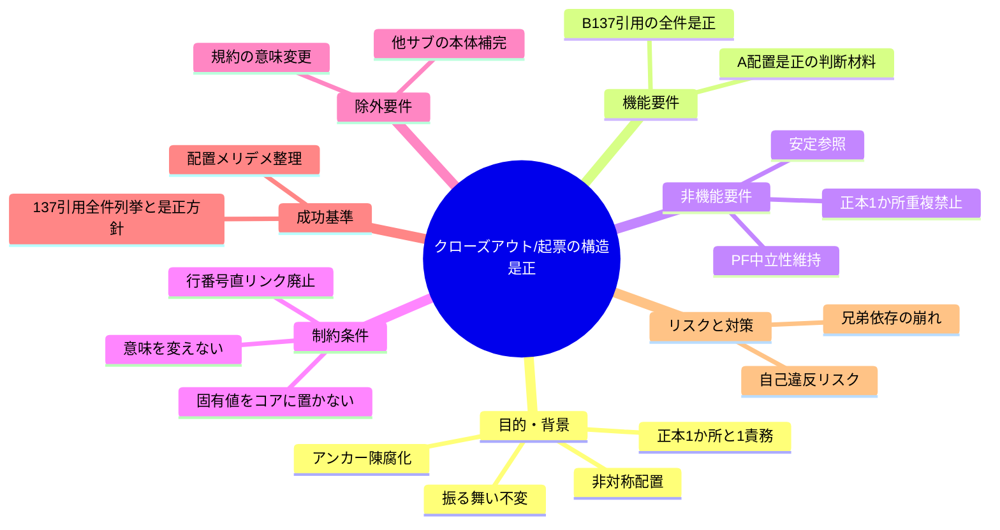
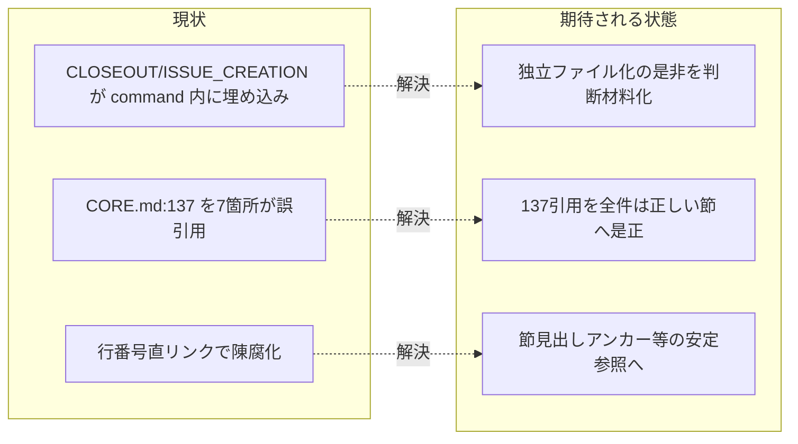

# 要求定義書: クローズアウトと issue 起票の構造是正

**プロジェクト名**: クローズアウトと issue 起票の構造是正（親「コア取り込み漏れ補完」S5）
**作成日**: 2026 年 06 月 15 日
**最終更新**: 2026 年 06 月 15 日

> **重要**:
>
> - 要求定義書は、プロジェクトの全体像を把握するためのものです。詳細な技術仕様や実装方法は要件定義書以降で記載します。必要最低限の情報に収めることを心掛けてください。
> - **このドキュメントは常に更新**: 要求の変更や追加があった場合は、即座にこのドキュメントを更新してください。ドキュメントは「生きているドキュメント」として扱い、実装内容と常に同期させます。
> - **必須項目**: 以下の「必須」と明記した項目は空欄・抽象語のみ（例: 「{説明}」のまま）で提出しないこと。判定可能な形（目的は1文・成功基準は○/×で判定できる記載等）で記入すること。
>
> **用語**: [.agents/CONCEPTS.md §用語規約](../../../../../../../.agents/CONCEPTS.md#用語規約) を参照。

---

## 要求定義の全体像

**注意**:

- 上記の「プロジェクト名」は例です。実際のプロジェクト名に置き換えてください。
- マインドマップは全体像を把握するためのものです。主要なセクション名程度に留め、詳細は記載しないでください。

---

## 1. 目的・背景

### 1.1 目的（必須）

コア構造の非対称配置と陳腐化アンカーを、意味を変えず是正可能にする。

### 1.2 背景

- **現状の課題**:
  - **(A) 非対称配置**: MODEL_SELECTION_POLICY と REVIEW_DUAL_LENS_POLICY は独立コアファイル（[.agents/MODEL_SELECTION.md](../../../../../../../.agents/MODEL_SELECTION.md) / [.agents/REVIEW_DUAL_LENS.md](../../../../../../../.agents/REVIEW_DUAL_LENS.md)）化されている。一方、IMPLEMENTATION_CLOSEOUT_POLICY と ISSUE_CREATION_CONTEXT_POLICY は [.agents/commands/implement-feature.md](../../../../../../../.agents/commands/implement-feature.md) 内の節（`## クローズアウト（欠落工程の補完）`・`### issue 起票時のコンテキスト効率（ISSUE_CREATION）`）として埋め込まれている。`.agents/*.md` には他にも独立コアファイル（CODE_COMMENT_RULES.md・COVERAGE_AND_EXCEPTIONS.md 等）があり、原則の置き場として独立ファイル化は前例がある。特に ISSUE_CREATION は本来 requirement-discovery / design フェーズの話であり、実装 command（implement-feature）への同居は収まりが悪い。
  - **(B) stale アンカー**: コアの複数箇所が PF 中立性・抽象/具体分離・正本 1 か所の根拠として「**CORE.md:137**」を引用しているが、実際の [CORE.md:137](../../../../../../../.agents/boot/CORE.md) は「**完了したトップレベル issue は close/ ディレクトリへ移動する**」（§完了 issue の close 分離）の宣言であり、PF 中立性でも正本 1 か所でもない。**行番号アンカーが陳腐化**している。

- **必要性**:
  - コア構造の参照健全性（どの節がどの原則の正本か、参照が正しい行を指しているか）を回復しないと、原則の根拠が誤った行を指し示し、読み手を誤誘導し続ける。
  - 是正は構造・参照の健全化であり、各ポリシーの**振る舞い・規約の意味は変えない**（must-preserve）。

#### 1.2.x 確認済み事実（grep 結果）

- `grep -rEn 'CORE\.md:[0-9]+' .agents/` の結果、`CORE.md:137` の引用は **7 箇所 / 5 ファイル**（grep ヒット行は 6 行だが CODE_COMMENT_RULES.md は同一ファイル内に 3 箇所＝7/13/60 行）に存在する。すべて以下のいずれかの意味で引用しているが、実際の 137 行はそのどちらでもない（= **全件陳腐化**）。詳細な全件表は 01 §2.3。
  - 引用が意図する意味 (a) **PF 中立性 / 抽象-具体分離**: `.agents/MODEL_SELECTION.md:7`。正しい参照先は **CORE.md §ルールの優先順位（128-131 行）**「.agents-project/ が最優先」。
  - 引用が意図する意味 (b) **正本 1 か所・重複禁止 / 1 ファイル 1 責務**: `.agents/REVIEW_DUAL_LENS.md:7`、`.agents/CODE_COMMENT_RULES.md:7,13,60`、`.agents/commands/verify-and-close.md:88`、`.agents/commands/implement-feature.md:74`。正しい参照先は **CORE.md §境界（145-146 行）**「実行契約の正本は本ファイル 1 か所のみ。重複記載をしてはならない。1 ファイル 1 責務」。
- 実際の `CORE.md:137`（[CORE.md L135-139](../../../../../../../.agents/boot/CORE.md) §完了 issue の close 分離）= 「完了したトップレベル issue は `close/` ディレクトリへ移動する」。
- 独立コアファイルの前例: `.agents/` 直下に CODE_COMMENT_RULES.md・COVERAGE_AND_EXCEPTIONS.md・MODEL_SELECTION.md・REVIEW_DUAL_LENS.md 等の単一責務コア文書が並ぶ。CLOSEOUT/ISSUE_CREATION のみが command ファイル内節として非対称に埋め込まれている。

#### 1.2.y 既出確認（二重起票防止）の結論

- close 済み `docs/maintainer/workflow/close/20260614_162712_コア取り込み候補調査/` は「取り込み調査」であり、本件「取り込み後の構造・参照是正」とは別物。
- 兄弟サブ issue（S1 取りこぼし／S2 verify 分離／S3 モデル選定／S4 二観点 must-preserve）はいずれも各ポリシーの**内容補完**であり、本 S5 は**配置・参照の構造是正（メタ）**で主題が重複しない。
- 結論: 既出なし。本 S5 を新規起票する（紐付けではなく新規が妥当）。

### 1.3 期待される効果（必須: 1 件以上）

- **効果 1**: CLOSEOUT/ISSUE_CREATION を独立コアファイル化するか現状維持かの**判断材料**（メリット／デメリット／1 ファイル 1 責務・PF 中立との整合）が整理され、後続フェーズが一意に決定できる（○/×: メリット・デメリットの両方が列挙され、判断基準が明記されているか）。
- **効果 2**: `CORE.md:137` 引用 7 箇所（5 ファイル）がすべて洗い出され、安定参照（節見出しアンカー等）への是正方針が確定する（○/×: 7 箇所すべてが列挙され、各々の正しい参照先が割り当てられているか）。
- **効果 3**: 是正がコア構造・参照健全性の改善に限定され、振る舞い・規約の意味を変えないことが明文化される（○/×: must-preserve が記載されているか）。

**現状と期待される状態の比較**（必要に応じて）:

---

## 2. 機能要件

### 2.1 既存機能の維持（該当する場合）

- 既存コア正本（MODEL_SELECTION.md / REVIEW_DUAL_LENS.md / implement-feature.md §クローズアウト・§issue 起票時のコンテキスト効率 / CODE_COMMENT_RULES.md / verify-and-close.md）の**規約の意味・振る舞い**を維持する。是正は配置・参照の構造のみ。
- PF 中立性、正本 1 か所・重複禁止、1 ファイル 1 責務、リンク委譲の原則を維持する。

### 2.2 新規機能要件

- **(A) 配置是正の判断材料**: CLOSEOUT/ISSUE_CREATION を独立コアファイル化（例: `CONTEXT_EFFICIENCY.md` 等）するか現状維持かを論点化し、メリット・デメリット・1 ファイル 1 責務・PF 中立との整合を整理する。ISSUE_CREATION のフェーズ帰属（requirement-discovery/design 寄り）も論点に含める。
- **(B) アンカー是正**: `CORE.md:137` 引用 7 箇所（5 ファイル）を全件、意図する意味に応じて安定参照（CORE.md §ルールの優先順位／§境界 等の節見出しアンカー）へ是正する方針を定める。行番号直リンクを廃止する。

### 2.3 本サブ issue の境界

- 本サブ issue が作成するのは **00_要求定義.md と 01_要件定義.md のみ**。02 設計以降・コアへの実差分適用は後続フェーズで扱う。
- 親の `90_issues.md` は編集しない。

---

## 3. 非機能要件

### 3.1 パフォーマンス

- 構造是正のみであり、コンテキスト効率を悪化させない。むしろ ISSUE_CREATION の帰属整理は起票時の参照を軽くしうる。

### 3.2 セキュリティ

- 高リスク操作は伴わない。

### 3.3 互換性

- コアの PF 中立性・後方互換を壊さない。既存リンク（節見出しアンカー）が解決可能であることを保つ。

### 3.4 保守性

- 行番号直リンクは陳腐化しやすい。安定参照（節見出しアンカー）へ移すことで以後の行ずれに強くする。
- 1 ファイル 1 責務・重複禁止を遵守し、定義を 2 か所に置かない。

---

## 4. 制約条件

### 4.1 技術的制約

- **意味不変（must-preserve）**: 各ポリシーの規約の意味・振る舞いを変えない。是正は構造・参照のみ。
- **PF 中立**: 具体値（モデル名・ティア表・ブランチ名・CI コマンド等）をコアに置かない方針を維持する。
- **行番号直リンク廃止**: `CORE.md:137` のような行番号アンカーをやめ、節見出しアンカー等の安定参照に統一する。

### 4.2 既存システムとの互換性

- 既存コア正本を破壊せず、配置の是非検討と参照の付け替えにとどめる。

### 4.3 移行期間・スケジュール

- 親「コア取り込み漏れ補完」の 90_issues.md の起票順では本 S5 が最後（⚪ 低）。S1・S3 の独立ファイル化判断と関連しうるため、それらと整合をとってから配置決定するのが望ましい（依存は 01 に明記）。

---

## 5. 除外要件

- 兄弟サブ issue（S1〜S4）の内容補完そのもの。
- 規約の意味・振る舞いの変更。
- 02 設計以降の成果物・コアへの実差分適用（後続フェーズ）。
- 親 `90_issues.md` の編集。

---

## 6. 成功基準（必須: 1 件以上）

- (A) CLOSEOUT/ISSUE_CREATION の独立コアファイル化 vs 現状維持の判断材料（メリット／デメリット／1 ファイル 1 責務・PF 中立との整合）が 01 に整理されている（○/×）。
- (B) `CORE.md:137` 引用 7 箇所がすべて洗い出され（5 ファイル）、各々の安定参照への是正方針が 01 に要件化されている（○/×）。
- 是正が振る舞い・規約の意味を変えない（must-preserve）ことが 01 に明記されている（○/×）。
- 兄弟サブ issue（特に S1・S3）の独立ファイル化判断との依存関係が 01 に明記されている（○/×）。
- 00 はテンプレート全セクション（マインドマップ含む）に準拠している（○/×）。

---

## 7. リスクと対策

### 7.1 技術的リスク

- **リスク**: アンカー是正の付け替え自体が再び行番号に依存し、再陳腐化する。
  - **対策**: 行番号直リンクを廃止し、節見出しアンカー（§ルールの優先順位／§境界）等の安定参照へ統一する方針を要件化する。
- **リスク**: 独立ファイル化が他サブの判断（S1 取りこぼし・S3 モデル選定の集約）と衝突し、配置が二転三転する。
  - **対策**: 依存関係を 01 に明記し、配置決定は兄弟サブの独立ファイル化方針と整合させる。

### 7.2 スケジュールリスク

- **リスク**: 本 S5 を先行させると、後続兄弟サブが追加する節の参照が宙に浮く。
  - **対策**: 90_issues.md の起票順（S5 が最後）に従い、兄弟の補完が固まった後に配置・参照是正を確定する。

---

## 8. 参考資料

### プロジェクトドキュメント

- 親 issue: [`../../00_要求定義.md`](../../00_要求定義.md)（issue_id: 434c7b86-4222-45e7-a0ef-1ae455f15313）

### その他の参考資料

- 是正対象コア: [.agents/MODEL_SELECTION.md](../../../../../../../.agents/MODEL_SELECTION.md)、[.agents/REVIEW_DUAL_LENS.md](../../../../../../../.agents/REVIEW_DUAL_LENS.md)、[.agents/CODE_COMMENT_RULES.md](../../../../../../../.agents/CODE_COMMENT_RULES.md)、[.agents/commands/implement-feature.md](../../../../../../../.agents/commands/implement-feature.md)、[.agents/commands/verify-and-close.md](../../../../../../../.agents/commands/verify-and-close.md)
- 正しい参照先: [.agents/boot/CORE.md](../../../../../../../.agents/boot/CORE.md)（§ルールの優先順位＝128-131 行、§境界＝145-146 行、§完了 issue の close 分離＝135-139 行）
- 設計原則: [.agents/spec/01_設計原則.md](../../../../../../../.agents/spec/01_設計原則.md)、[.agents/spec/02_ディレクトリ構造方針.md](../../../../../../../.agents/spec/02_ディレクトリ構造方針.md)、[.agents/spec/06_設計判断の優先順位.md](../../../../../../../.agents/spec/06_設計判断の優先順位.md)

---

## 9. 次のステップ

この要求定義書の承認後、以下のドキュメントを作成します：

- **次**: [`01_要件定義.md`](./01_要件定義.md) - 要件定義フェーズ
