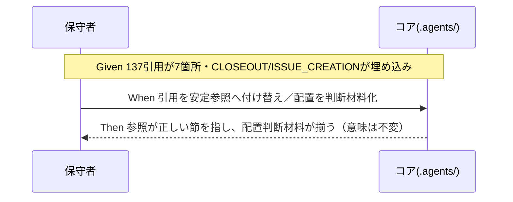

# 要件定義書: クローズアウトと issue 起票の構造是正

**プロジェクト名**: クローズアウトと issue 起票の構造是正（親「コア取り込み漏れ補完」S5）
**作成日**: 2026 年 06 月 15 日
**最終更新**: 2026 年 06 月 15 日

> **重要**: **このドキュメントは常に更新**: 要件の変更や追加があった場合は、即座にこのドキュメントを更新してください。ドキュメントは「生きているドキュメント」として扱い、実装内容と常に同期させます。
>
> **用語**: [.agents/CONCEPTS.md §用語規約](../../../../../../../.agents/CONCEPTS.md#用語規約) を参照。

---

## 参照元

- **親 issue**: [`../../00_要求定義.md`](../../00_要求定義.md)（親 issue_id: `434c7b86-4222-45e7-a0ef-1ae455f15313`、親パス: `docs/maintainer/workflow/20260615_055806_コア取り込み漏れ補完/`）
- **本サブ issue**: `90_issues/クローズアウトとissue起票の構造是正/`（issue_id: `10b7821c-d49d-427c-b39c-03339eef1c76`）
- 本サブ issue の 00: [`./00_要求定義.md`](./00_要求定義.md)

---

## 1. 概要

### 1.1 システム概要

本 issue は、コア（`.agents/`）の**構造・参照の健全性是正**を要件化する。対象は (A) ポリシー配置の非対称（CLOSEOUT/ISSUE_CREATION が implement-feature.md に埋め込まれている）と、(B) 陳腐化した `CORE.md:137` アンカーである。**いずれも振る舞い・規約の意味を変えない構造是正（メタ）**であり、兄弟サブ issue（S1〜S4 の内容補完）とは主題が異なる。

### 1.2 用語集

| 用語 | 説明 |
| -------- | ------ |
| 非対称配置 | 同格の汎用ポリシーのうち一部は独立コアファイル、一部は command 内の節として埋め込まれている状態。 |
| stale アンカー | 引用先が示す行番号が、参照したい内容を指さなくなった陳腐化リンク（例: `CORE.md:137`）。 |
| 安定参照 | 行ずれに強い参照様式（節見出しアンカー `#見出し`、相対パス＋§名 等）。行番号直リンクの対義。 |
| must-preserve | 壊してはならない不変条件（[REVIEW_DUAL_LENS.md](../../../../../../../.agents/REVIEW_DUAL_LENS.md) §2.2）。本件では規約の意味・振る舞い。 |
| PF 中立性 | コアにプラットフォーム固有値を置かず `.agents-project/` を最優先とする原則（CORE.md §ルールの優先順位）。 |

---

## 2. 機能要件

### 2.1 ユーザーストーリー

#### ストーリー 1: 配置是正の判断材料（A）

- **As a** コアの保守者
- **I want to** CLOSEOUT/ISSUE_CREATION を独立コアファイル化するか現状維持かの判断材料（メリット／デメリット／整合）を整理してほしい
- **So that** 後続の設計フェーズが配置を一意に決定でき、非対称が解消される

**受け入れ基準**:

- 独立コアファイル化（例: `CONTEXT_EFFICIENCY.md`、あるいは CLOSEOUT/ISSUE_CREATION 別ファイル等）と現状維持の**両方**について、メリット・デメリットが列挙されている。
- 各案が **1 ファイル 1 責務**（CORE.md §境界＝145-146 行）・**PF 中立性**（CORE.md §ルールの優先順位＝128-131 行）と整合するかが評価されている。
- ISSUE_CREATION が本来 requirement-discovery/design フェーズの原則であり、実装 command（implement-feature.md）同居の収まりの悪さが論点として明記されている。
- 既存の独立コアファイル前例（CODE_COMMENT_RULES.md・COVERAGE_AND_EXCEPTIONS.md・MODEL_SELECTION.md・REVIEW_DUAL_LENS.md）と並べた一貫性評価がある。

#### ストーリー 2: stale アンカーの全件是正（B）

- **As a** コアを読むエージェント／保守者
- **I want to** `CORE.md:137` 引用を全件、安定参照へ是正する方針を要件化してほしい
- **So that** 原則の根拠が正しい節を指し、行ずれで再陳腐化しない

**受け入れ基準**:

- `grep -rEn 'CORE\.md:[0-9]+' .agents/` で洗い出した `CORE.md:137` 引用 **7 箇所（5 ファイル。grep ヒット 6 行＋同一ファイル内 3 箇所の内訳）**がすべて列挙されている（下表 §2.3）。
- 各箇所について、引用が意図する意味（PF 中立性 / 正本 1 か所）に応じた**正しい安定参照先**が割り当てられている。
- 行番号直リンク（`CORE.md:NNN`）を廃止し、**節見出しアンカー等の安定参照**に統一する方針が明記されている。
- 実際の `CORE.md:137`（§完了 issue の close 分離＝「close/ へ移動」）は是正後どの引用にも誤って紐付かないことが確認されている。

#### ストーリー 3: 意味不変の保証（A・B 共通）

- **As a** コアの利用者
- **I want to** 是正が規約の意味・振る舞いを変えないことを保証してほしい
- **So that** 既存ワークフロー・enforcement・利用者の依存が退行しない

**受け入れ基準**:

- 是正対象（配置・参照）と非対象（規約の意味・振る舞い・enforcement の判定条件）が分離して列挙されている（must-preserve リスト）。
- ファイル分割を行う場合でも、各ポリシーの規約文言の**意味**が保持されることが明記されている。

### 2.2 BDD ユースケース

#### ユースケース 1: stale アンカーの是正

**シナリオ 1: 137 引用を安定参照へ付け替える**

```gherkin
Feature: stale アンカー CORE.md:137 の是正
  Scenario: PF 中立性を意図する引用を是正する
    Given .agents/MODEL_SELECTION.md:7 が PF 中立性の根拠として「CORE.md:137」を引用している
    And 実際の CORE.md:137 は「完了 issue の close 分離」である
    When PF 中立性の正しい節（CORE.md §ルールの優先順位＝128-131 行）の安定参照へ付け替える
    Then 引用は「.agents-project/ が最優先」を指し、行番号直リンクは残らない

  Scenario: 正本1か所を意図する引用を是正する
    Given REVIEW_DUAL_LENS.md:7・CODE_COMMENT_RULES.md:7,13,60・verify-and-close.md:88・implement-feature.md:74 が「正本1か所・重複禁止」の根拠として「CORE.md:137」を引用している
    When 正本1か所の正しい節（CORE.md §境界＝145-146 行）の安定参照へ付け替える
    Then 各引用は「実行契約の正本は本ファイル1か所のみ／1ファイル1責務」を指す
```

#### ユースケース 2: 配置是正の判断

**シナリオ 1: 独立ファイル化の是非を判断材料化する**

```gherkin
Feature: CLOSEOUT/ISSUE_CREATION の配置是正
  Scenario: 独立コアファイル化と現状維持を比較する
    Given CLOSEOUT は implement-feature.md の「## クローズアウト（欠落工程の補完）」節
    And ISSUE_CREATION は implement-feature.md の「### issue 起票時のコンテキスト効率（ISSUE_CREATION）」節
    And MODEL_SELECTION/REVIEW_DUAL_LENS は独立コアファイル化済み
    When 独立ファイル化（例 CONTEXT_EFFICIENCY.md）と現状維持のメリット・デメリットを整理する
    Then 1ファイル1責務・PF中立性・フェーズ帰属との整合を踏まえた判断材料が得られる
    And 是正は規約の意味を変えない（must-preserve）
```

**処理フロー**（必要に応じて）:



### 2.3 ビジネスルール

- **`CORE.md:137` 引用の全件リスト（is-正対象）**:

| # | ファイル:行 | 引用の意図する意味 | 正しい安定参照先 |
|---|-------------|--------------------|------------------|
| 1 | `.agents/MODEL_SELECTION.md:7` | PF 中立性 / 抽象-具体分離 | CORE.md §ルールの優先順位（128-131 行）「.agents-project/ が最優先」 |
| 2 | `.agents/REVIEW_DUAL_LENS.md:7` | 正本 1 か所・直交追加で既存骨格を改変しない | CORE.md §境界（145-146 行）「正本は本ファイル1か所／1ファイル1責務」 |
| 3 | `.agents/CODE_COMMENT_RULES.md:7` | 正本 1 か所（配線は索引のみ） | CORE.md §境界（145-146 行） |
| 4 | `.agents/CODE_COMMENT_RULES.md:13` | 正本 1 か所の原則 | CORE.md §境界（145-146 行） |
| 5 | `.agents/CODE_COMMENT_RULES.md:60` | 正本 1 か所・重複禁止（参照欄） | CORE.md §境界（145-146 行） |
| 6 | `.agents/commands/verify-and-close.md:88` | 既存正本へリンク委譲・重複禁止 | CORE.md §境界（145-146 行） |
| 7 | `.agents/commands/implement-feature.md:74` | 既存正本へリンク委譲・重複禁止 | CORE.md §境界（145-146 行） |

  > 注: `grep -rn 'CORE.md:137' .agents/` のヒットは 6 行だが、CODE_COMMENT_RULES.md は同一ファイル内に 3 箇所（7/13/60 行）あるため、引用箇所の総数は **7 箇所 / 5 ファイル**（`grep -rno` 実測でも 7）。00（§1.2.x・§6 ほか）も同じく **7 箇所 / 5 ファイル**と記載しており、本表と一致する。設計フェーズはこの 7 箇所すべてを是正対象とする。

- **意味不変ルール**: 上記の付け替えは参照先のみを変え、各引用文の規約上の意味（PF 中立性・正本 1 か所）は保持する。
- **行番号直リンク廃止ルール**: 是正後は `CORE.md:NNN` 形式を新規に使わず、`CORE.md §<節名>` または `CORE.md#<アンカー>` の安定参照を用いる。
- **配置判断ルール**: (A) の配置決定は本 issue では「判断材料の提示」までとし、実際のファイル分割是非の確定は設計フェーズで行う。

### 2.4 依存関係（兄弟サブ issue との関係・必須）

- **S1（取りこぼし防止と既出確認のコア昇格・🔴）**: S1 が no-drop+dedup をどこに置くか（独立ファイル化するか）によって、コア直下の独立ファイル群の一貫性が変わる。S5 の (A) 配置判断は S1 の配置方針と整合させる必要がある。
- **S3（モデル選定の裁量禁止と形骸化防止・🟡）**: 00 親 issue は S3 で `.agents/COVERAGE_AND_EXCEPTIONS.md` への集約を検討するとしている。集約 = 独立ファイルの統廃合であり、S5 の独立ファイル化是非の判断と方向性を揃える必要がある。
- **起票順**: 親 90_issues.md では S5 が最後（⚪ 低）。S1〜S4 の補完が固まってから (A) 配置・(B) 参照を確定するのが安全（兄弟が追加する節の参照が宙に浮くのを避ける）。
- **S2（verify 報告様式・🟠）/ S4（must-preserve ラウンド継承・🟡）**: 直接の配置依存は薄いが、S4 は REVIEW_DUAL_LENS.md（独立ファイル）を更新するため、S5 の参照付け替え（同ファイル:7 の 137 引用）と編集が競合しうる。編集順の整合に留意する。

---

## 3. 非機能要件

### 3.1 パフォーマンス要件

- 構造是正のみでコンテキスト効率を悪化させない。ISSUE_CREATION のフェーズ帰属整理は起票時の参照を軽くしうる。

### 3.2 セキュリティ要件

- 高リスク操作（大量削除・外部書き込み）を伴わない。

### 3.3 ユーザビリティ要件

- 安定参照により、エージェントが原則の正本を一意に辿れる。

### 3.4 可用性要件

- 是正後、参照リンク（節見出しアンカー）が解決可能で未解決 0 件であること。

---

## 4. 外部インターフェース要件

### 4.1 API 要件

- 該当なし（ドキュメント構造の是正のため）。

### 4.2 データ形式要件

- 是正後の参照様式は `CORE.md §<節名>`（相対パス＋§名）または `#<見出しアンカー>` を用い、`CORE.md:NNN` 行番号直リンクを新規に使わない。

---

## 5. 制約事項

- **意味不変（must-preserve）**: 規約の意味・振る舞い・enforcement の判定条件を変えない。
- **PF 中立**: 具体値（モデル名・ティア表・ブランチ名・CI コマンド等）をコアに置かない。
- **1 ファイル 1 責務・重複禁止**: 配置を変える場合も定義を 2 か所に置かない（CORE.md §境界）。
- **行番号直リンク廃止**: `CORE.md:NNN` を安定参照へ統一する。
- **本サブ issue の境界**: 作成するのは 00/01 のみ。02 以降・コアへの実差分適用は後続フェーズ。親 `90_issues.md` は編集しない。

---

## 6. 参考資料

### プロジェクトドキュメント

- [`00_要求定義.md`](./00_要求定義.md) - 本サブ issue の要求定義
- [`../../00_要求定義.md`](../../00_要求定義.md) - 親 issue 要求定義
- [`../../90_issues.md`](../../90_issues.md) - 親の確定起票順序表（本サブは編集しない・参照のみ）

### その他の参考資料

- 是正対象: [.agents/MODEL_SELECTION.md](../../../../../../../.agents/MODEL_SELECTION.md)、[.agents/REVIEW_DUAL_LENS.md](../../../../../../../.agents/REVIEW_DUAL_LENS.md)、[.agents/CODE_COMMENT_RULES.md](../../../../../../../.agents/CODE_COMMENT_RULES.md)、[.agents/commands/implement-feature.md](../../../../../../../.agents/commands/implement-feature.md)、[.agents/commands/verify-and-close.md](../../../../../../../.agents/commands/verify-and-close.md)
- 正しい参照先: [.agents/boot/CORE.md](../../../../../../../.agents/boot/CORE.md)（§ルールの優先順位＝128-131 行、§境界＝145-146 行、§完了 issue の close 分離＝135-139 行）
- 設計原則: [.agents/spec/01_設計原則.md](../../../../../../../.agents/spec/01_設計原則.md)、[.agents/spec/06_設計判断の優先順位.md](../../../../../../../.agents/spec/06_設計判断の優先順位.md)

---

## 7. 前のステップ

この要件定義書は、以下のドキュメントを基に作成されています：

- **前**: [`00_要求定義.md`](./00_要求定義.md) - 要求定義フェーズ

---

## 8. 次のステップ

この要件定義書の承認後、以下のドキュメントを作成します：

- **次**: [`02_設計.md`](./02_設計.md) - 設計フェーズ（CLOSEOUT/ISSUE_CREATION 配置の確定とアンカー是正の差分設計）
