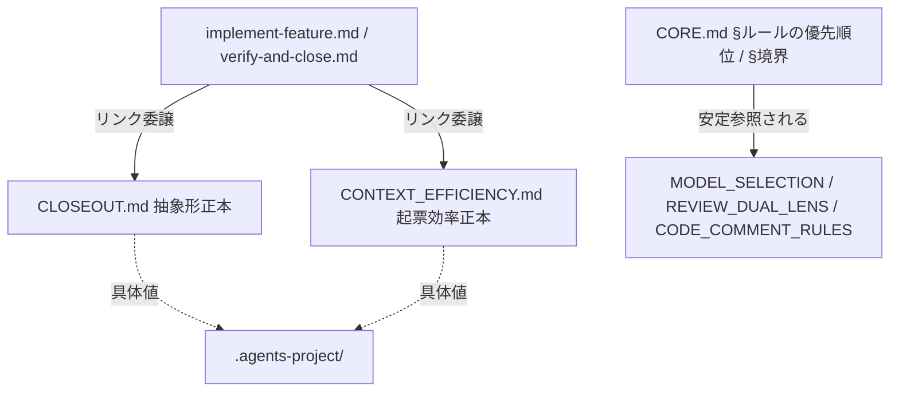
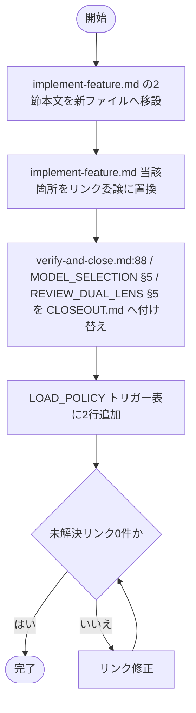

# 設計書: クローズアウトと issue 起票の構造是正

**プロジェクト名**: クローズアウトと issue 起票の構造是正（親「コア取り込み漏れ補完」S5）
**作成日**: 2026 年 06 月 15 日
**最終更新**: 2026 年 06 月 15 日

> **重要**: **このドキュメントは常に更新**: 設計の変更や追加があった場合は、即座にこのドキュメントを更新してください。ドキュメントは「生きているドキュメント」として扱い、実装内容と常に同期させます。
>
> **用語**: [.agents/CONCEPTS.md §用語規約](../../../../../../../.agents/CONCEPTS.md#用語規約) を参照。

---

## 参照元

- **親 issue**: [`../../00_要求定義.md`](../../00_要求定義.md)（親 issue_id: `434c7b86-4222-45e7-a0ef-1ae455f15313`）
- **本サブ issue**: `90_issues/クローズアウトとissue起票の構造是正/`（issue_id: `10b7821c-d49d-427c-b39c-03339eef1c76`）
- 本サブ issue の 00/01: [`./00_要求定義.md`](./00_要求定義.md) / [`./01_要件定義.md`](./01_要件定義.md)

---

## 1. 設計概要

**必須**: 設計方針・原則は [.agents/spec/01_設計原則.md](../../../../../../../.agents/spec/01_設計原則.md) を先に参照した上で、本プロジェクトに適用するものを選び記載する。

### 1.1 設計方針

コア（`.agents/`）の**構造・参照の健全化（メタ）**を、各ポリシーの**振る舞い・規約の意味・enforcement 判定条件を変えずに**確定する。本設計の主産物は (A) CLOSEOUT/ISSUE_CREATION の配置（独立コアファイル化）の**確定判断**と、(B) `CORE.md:137` 陳腐化アンカー 7 箇所（5 ファイル）の安定参照への**置換方針**である。実差分のコア編集は後続の実装フェーズで行い、本フェーズは判断・計画までを成果物とする。

### 1.2 設計原則（本プロジェクトで適用するもの）

- **単一責務（1 ファイル 1 責務）**: 本是正の中核原則。CLOSEOUT/ISSUE_CREATION を implement-feature.md（実装 command）から切り出し、1 ファイル 1 責務へ寄せる。CORE.md §境界（「実行契約の正本は本ファイル 1 か所のみ／1 ファイル 1 責務」）に従う。
- **明確な境界**: コア原則（独立ファイル）と command（skill chain 定義のみ）の境界を明確化する。command ファイルに原則本文を埋め込まない。
- **AIフレンドリー設計**: 小さなファイル・明確な責務・意図が分かる命名・安定参照（行ずれに強い節アンカー）でエージェントが正本を一意に辿れるようにする。[01_設計原則 §AIフレンドリー設計](../../../../../../../.agents/spec/01_設計原則.md#aiフレンドリー設計) を適用。
- **UNIX哲学**: 小さく作る／1 つのことをうまくやる／組み合わせ可能（独立ファイル＋リンク委譲）を適用。

> **設計判断の優先順位**（[06_設計判断の優先順位.md](../../../../../../../.agents/spec/06_設計判断の優先順位.md)）: 本件は「可読性 > 単一責務 > 仕様との整合性」を上位に置く。再陳腐化しにくい安定参照（可読性・保守性）と 1 ファイル 1 責務を優先する。

---

## 2. アーキテクチャ設計

本件は「ドキュメント構造のアーキテクチャ」を扱う。以下の「コンポーネント」はコアの**ファイル／節**を指す。

### 2.1 責務・境界・参照関係

#### 2.1.1 責務一覧（是正後）

| コンポーネント | 責務（1 文） |
| -------------- | -------------- |
| `.agents/CLOSEOUT.md`（新規・(A) で確定） | implement-feature 完了検知で起動する不変クローズアウトの**欠落工程（抽象形）**の正本を持つ。 |
| `.agents/CONTEXT_EFFICIENCY.md`（新規・(A) で確定） | 大規模一括起票時のコンテキスト効率（ISSUE_CREATION）の汎用原理の正本を持つ。 |
| `.agents/commands/implement-feature.md` | 実装 command の skill chain 定義のみに戻す。CLOSEOUT/ISSUE_CREATION は新ファイルへリンク委譲する。 |
| `.agents/commands/verify-and-close.md` | クローズアウトの欠落工程確認時、抽象形正本を `CLOSEOUT.md` へリンク委譲する（現状は implement-feature.md を指す）。 |
| `.agents/boot/CORE.md` | PF 中立性（§ルールの優先順位）・正本 1 か所/1 責務（§境界）の正本。**本是正で内容は不変**、参照される側。 |
| `.agents/MODEL_SELECTION.md` / `REVIEW_DUAL_LENS.md` / `CODE_COMMENT_RULES.md` | (B) で `CORE.md:137` 引用を安定参照へ付け替える対象（意味は不変）。加えて MODEL_SELECTION.md:38（§クローズアウト）・REVIEW_DUAL_LENS.md:44（§verify-実経路検証）は (A) で CLOSEOUT.md へ参照付け替えする対象でもある。 |
| `.agents/DOCS_RULES.md` | (C) で行番号直リンク禁止＋節アンカー使用の再陳腐化防止規約を 1 行追記する対象（ドキュメント間参照規約の責務）。 |
| `CLAUDE.md`（リポジトリルート） | ISSUE_CREATION 参照（現 implement-feature.md §issue 起票時のコンテキスト効率を指す）を (A) で `CONTEXT_EFFICIENCY.md` へ付け替える対象。配布物正本側であり編集対象に含む。 |

#### 2.1.2 境界

- **入力**: 既存コア群（CORE.md・MODEL_SELECTION.md・REVIEW_DUAL_LENS.md・CODE_COMMENT_RULES.md・implement-feature.md・verify-and-close.md・LOAD_POLICY.md・DOCS_RULES.md）・ルートの CLAUDE.md と 01 の要件（配置判断材料・137 引用全件表）。
- **出力**: (A) 配置の確定判断と新ファイル設計、(B) 7 箇所の安定参照置換方針、それらを実装フェーズに渡す 03 のタスク分解。
- **他責務との境界（範囲外）**:
  - 各ポリシーの**規約の意味・振る舞い・enforcement 判定条件**の変更（must-preserve）。
  - 兄弟サブ issue（S1〜S4）の**内容補完そのもの**。本 S5 は配置・参照の構造のみ。
  - **コアへの実差分の適用**は実装フェーズ。本 02/03 は判断・計画まで。
  - 親 `90_issues.md` の編集。

#### 2.1.3 参照関係（是正後の依存の向き）

- `implement-feature.md` →（リンク委譲）→ `CLOSEOUT.md` / `CONTEXT_EFFICIENCY.md`
- `verify-and-close.md` →（リンク委譲）→ `CLOSEOUT.md`（抽象形の正本）
- `MODEL_SELECTION.md`（:38）/ `REVIEW_DUAL_LENS.md`（:44）→（参照付け替え）→ `CLOSEOUT.md`（セクション／`#verify-実経路検証` サブアンカー）
- `CLAUDE.md` →（参照付け替え）→ `CONTEXT_EFFICIENCY.md`
- `MODEL_SELECTION.md` / `REVIEW_DUAL_LENS.md` / `CODE_COMMENT_RULES.md` →（安定参照）→ `CORE.md §ルールの優先順位` または `CORE.md §境界`
- `LOAD_POLICY.md`（トリガー表）→ 新規 2 ファイルへの行を追加（後述 2.3）。
- 循環参照を持たない（原則は CORE/独立ファイルに集約し、command は委譲のみ）。

### 2.2 システムアーキテクチャ

**必須**: 設計判断は [.agents/spec/](../../../../../../../.agents/spec/) を先に参照した。

- **採用パターン**: **正本集約＋リンク委譲（single-source-of-truth + reference delegation）**。原則の本文は独立コアファイル 1 か所に置き、利用箇所（command・他コア）はリンクで委譲する。
- **根拠**: [06_設計判断の優先順位](../../../../../../../.agents/spec/06_設計判断の優先順位.md)（可読性・単一責務）と CORE.md §境界（正本 1 か所・1 ファイル 1 責務）に基づく。既存の独立コアファイル（CODE_COMMENT_RULES.md・COVERAGE_AND_EXCEPTIONS.md・MODEL_SELECTION.md・REVIEW_DUAL_LENS.md）と対称化する。

#### 2.2.1 （A）配置の確定判断 — 独立コアファイル化を採用する

**判断: CLOSEOUT と ISSUE_CREATION を、それぞれ独立コアファイル `.agents/CLOSEOUT.md`・`.agents/CONTEXT_EFFICIENCY.md` に切り出す（現状の implement-feature.md 内埋め込みを廃止）。** define-boundaries で整理した判断材料（メリット／デメリット）を以下に確定する。

**メリット（独立ファイル化）**:

| 観点 | 内容 |
|------|------|
| 対称性 | MODEL_SELECTION/REVIEW_DUAL_LENS と同格の汎用ポリシーであり、独立ファイル化で配置の非対称が解消される。 |
| 1 ファイル 1 責務 | CORE.md §境界の原則をコア構造自身が満たす。command ファイル（skill chain 定義のみが責務）に原則本文が同居する責務混在を解消する。 |
| 参照健全性（command 間依存の解消） | 現状 `verify-and-close.md:88` は CLOSEOUT 抽象形の正本として `implement-feature.md §クローズアウト` を指す。これは **command が別 command を正本参照する**不健全な向きである。`CLOSEOUT.md`（コア原則）へ寄せると、2 command がともにコア原則を参照する健全な向きになる。 |
| フェーズ帰属 | ISSUE_CREATION は本来 requirement-discovery/design フェーズの原理であり、実装 command（implement-feature）同居は収まりが悪い。独立ファイル化でフェーズ非依存のコア原則として中立化する。 |
| 保守性 | LOAD_POLICY のトリガー表に明示行を持てる（「クローズアウト実施時」「issue 起票時」）。原則の発見性が上がる。 |

**デメリット（独立ファイル化）と対策**:

| デメリット | 対策 |
|------------|------|
| ファイル数が増える（`.agents/` 直下に 2 ファイル追加） | 既に同様の単一責務コアが並ぶ前例があり、対称性のメリットが上回る。命名で意図を明確化。 |
| LOAD_POLICY のトリガー表・CORE 参照配線・既存リンクの付け替えが必要 | 03 のタスクで網羅（トリガー行追加・implement/verify の委譲先付け替え・MODEL_SELECTION.md:38/REVIEW_DUAL_LENS.md:44 の §参照リンク付け替え）。配線は索引のみで原則本文は重複させない。 |

**現状維持（埋め込み）案との比較**: 現状維持は「ファイルを増やさない」点のみ優位だが、非対称・command 間正本参照・フェーズ帰属の収まりの悪さが残り、上位優先順位（可読性・単一責務）に反する。**よって採用しない。**

**新ファイル名案（確定）**:

- `.agents/CLOSEOUT.md` — 責務: クローズアウトの欠落工程（commit／別セッション引継ぎ／clear 境界／fresh サブ分割／verify-実経路検証）の**抽象形**正本。具体値（ブランチ名・CI コマンド・トレーラ等）は `.agents-project/` に委ねる（PF 中立性を保持）。
- `.agents/CONTEXT_EFFICIENCY.md` — 責務: ISSUE_CREATION（大規模一括起票時のコンテキスト効率）の汎用原理の正本。具体数値・タグ運用は混入させず `.agents-project/` に委ねる。

> **代替案の記録**: CLOSEOUT と ISSUE_CREATION を 1 ファイルに束ねる案も検討したが、両者は責務が異なる（前者＝実装完了後のクローズアウト工程、後者＝起票フェーズのコンテキスト効率）ため、1 ファイル 1 責務に反する。**2 ファイルに分離する**。

#### 2.2.2 （A の波及）S1・S3 の昇格先指針 — この構造判断にどう従うか

本判断（独立ファイル化を採用）により、後続サブの昇格先を以下に**明示的に指針化**する（実適用は各サブの設計フェーズだが、配置の一貫性のため S5 が指針を確定する）。

- **S1（取りこぼし防止と既出確認のコア昇格・🔴）**: no-drop（取りこぼし 0）＋ dedup（既出確認・二重起票防止）は、起票フェーズ横断の汎用原理であり ISSUE_CREATION（コンテキスト効率）と同じ「起票の質」レイヤに属する。**昇格先指針: 独立化方針に従い、`CONTEXT_EFFICIENCY.md` へ no-drop/dedup を併置する（同一責務レイヤ＝起票の健全性）か、近接が薄ければ独立ファイル `ISSUE_HYGIENE.md` 等を新設する。** いずれにせよ implement-feature.md 内節への追記は避ける（本 S5 の方針と整合）。S1 設計フェーズはこの 2 択から選ぶ。
- **S3（モデル選定の裁量禁止と形骸化防止・🟡）**: モデル選定の裁量禁止・根拠（対応表該当行）明記は MODEL_SELECTION.md（独立コア）の原則に属する。**昇格先指針: 既存独立コア `MODEL_SELECTION.md` に節として追記する（独立ファイルの統廃合＝新規 COVERAGE_AND_EXCEPTIONS.md への移設は行わない）。** 親 00 が触れる「COVERAGE_AND_EXCEPTIONS.md への集約」案は、本 S5 の「同格原則は独立ファイルで対称配置」方針と矛盾するため、S3 では MODEL_SELECTION.md への内容追記を第一候補とする（COVERAGE_AND_EXCEPTIONS.md は例外運用台帳の責務であり、モデル選定原則の正本ではない）。
- **整合原則**: 「同格の汎用原則は独立コアファイルに対称配置し、command ファイルに原則本文を埋め込まない」を S1〜S3 共通の昇格規約とする。
- **加法保存の前提（S2/S4 との非破壊整合）**: S5 は CLOSEOUT.md の**骨格を新設**するが、S2（verify (i)/(ii) 分離記載義務を §verify-実経路検証 に追記）・S4（must-preserve ラウンド継承を §fresh サブ分割 領域に追記）が同領域に加えた本文は、S5 の移設で**加法的に保存**する（S5 は規約の意味を増減しない＝メタ性 must-preserve）。よって編集順は原則 **S2/S4 → S5** とし、移設時に兄弟サブの追記本文を取りこぼさず CLOSEOUT.md へ運ぶ。順序が逆転した場合、S2/S4 は新設後の CLOSEOUT.md を編集対象に切り替える（実装順は 03 §1.1 注記）。

#### 2.2.3 （B）CORE.md:137 陳腐化アンカー是正方針 — 安定参照への置換

`grep -rn 'CORE.md:137' .agents/` を本フェーズで再実行し、**7 箇所 / 5 ファイル**（grep ヒット 6 行＋ CODE_COMMENT_RULES.md 同一ファイル内 3 箇所＝7/13/60。`grep -rno` 実測でも 7）を 01 §2.3 表と一致確認した。是正方針を以下に確定する。

**置換規約**:

- **行番号直リンク `CORE.md:137`（および `CORE.md:NNN` 全般）を廃止**し、**節見出しアンカー**＝`CORE.md §<節名>`（相対パス＋§名表記、または `CORE.md#<見出しアンカー>`）の安定参照に統一する。
- **意味の 2 系統を正しく割り当てる**（01 §2.3 表に従う）:
  - **(a) PF 中立性 / 抽象-具体分離**: → `CORE.md §ルールの優先順位`（「.agents-project/ が最優先」）。対象: `MODEL_SELECTION.md:7`。
  - **(b) 正本 1 か所・重複禁止 / 1 ファイル 1 責務**: → `CORE.md §境界`（「実行契約の正本は本ファイル 1 か所のみ／1 ファイル 1 責務」）。対象: `REVIEW_DUAL_LENS.md:7`・`CODE_COMMENT_RULES.md:7,13,60`・`verify-and-close.md:88`・`implement-feature.md:74`。

**置換表（実装フェーズの正本・7 箇所）**:

| # | ファイル:行 | 現状の引用 | 是正後（安定参照） |
|---|-------------|------------|--------------------|
| 1 | `MODEL_SELECTION.md:7` | `（PF 中立性・CORE.md:137）` | `（PF 中立性・CORE.md §ルールの優先順位）` |
| 2 | `REVIEW_DUAL_LENS.md:7` | `…既存骨格を改変しない（CORE.md:137）。` | `…既存骨格を改変しない（CORE.md §境界）。` |
| 3 | `CODE_COMMENT_RULES.md:7` | `配線は索引のみ（CORE.md:137）。` | `配線は索引のみ（CORE.md §境界）。` |
| 4 | `CODE_COMMENT_RULES.md:13` | `…正本1か所（CORE.md:137）の原則を…` | `…正本1か所（CORE.md §境界）の原則を…` |
| 5 | `CODE_COMMENT_RULES.md:60` | `- CORE.md:137（正本1か所・重複禁止）` | `- CORE.md §境界（正本1か所・重複禁止）` |
| 6 | `verify-and-close.md:88` | `…リンクで委譲する（CORE.md:137）。` | `…リンクで委譲する（CORE.md §境界）。` |
| 7 | `implement-feature.md:74` | `…リンクで委譲する（CORE.md:137）。` | `…リンクで委譲する（CORE.md §境界）。` |

> **誤紐付け防止の確認**: 実際の `CORE.md:137`（§完了 issue の close 分離＝「close/ へ移動」）は是正後どの引用にも紐付かない。置換は §ルールの優先順位（128-131 行）／§境界（145-146 行）のいずれかのみを指す。

**将来の再陳腐化防止（規約化）**:

- **規約**: コア／command／spec 文書内で `CORE.md:NNN` 等の**行番号直リンクを新規に使用しない**。原則・規約を指すときは節見出しアンカー（`§<節名>` または `#<アンカー>`）を用いる。本規約の記載先は **CODE_COMMENT_RULES.md の隣接領域ではなく、ドキュメント参照規約として DOCS_RULES.md**（システム仕様書／ドキュメント規約）に 1 行追記するのが責務上適切（CODE_COMMENT_RULES.md は「コード中コメント」が責務であり、ドキュメント間参照はスコープ外のため）。
- **enforcement（検出）の論点化**: 既存 audit には行番号アンカー検出は無い（`grep -rn 'CORE.md:[0-9]' .agents/enforcement/` で確認、ヒットなし）。`grep -rEn '\b[A-Za-z_]+\.md:[0-9]+' .agents/` 相当の検出を enforcement に追加する案を **03 の論点タスク**として残す（本 S5 では検出実装まで踏み込まず、規約化＋論点提示にとどめる。検出実装は別 issue 候補）。

### 2.3 コンポーネント構成（是正の配線）

是正後のコア配線（実装フェーズで適用）:

- **新規 2 ファイル**: `.agents/CLOSEOUT.md`・`.agents/CONTEXT_EFFICIENCY.md`（frontmatter に document_id 付与。原則本文は implement-feature.md の現節文言を**意味不変で移設**）。`CLOSEOUT.md` には §クローズアウト配下のサブ見出し（commit ステップ／別セッション引継ぎ／clear 境界／fresh サブ分割／**verify-実経路検証**）を**そのまま保持**し、被リンクのサブアンカー `#verify-実経路検証` が CLOSEOUT.md 内で解決可能な状態を維持する。
- **implement-feature.md**: §クローズアウト・§issue 起票時のコンテキスト効率の本文を新ファイルへ移し、当該箇所はリンク委譲（索引）に置換。
- **移設に伴う内部リンクの追従**: §クローズアウト本文内の back-reference（現 `implement-feature.md:96` の `REVIEW_DUAL_LENS.md#3-証跡要求` 参照）は CLOSEOUT.md へ移動するため、移動後の相対パスから当該アンカーが解決するよう相対リンクを補正する（CLOSEOUT.md は `.agents/` 直下のため `REVIEW_DUAL_LENS.md#3-証跡要求` で解決。implement-feature.md は `commands/` 配下＝1 階層深いため、移設で相対深度が変わる点に注意）。
- **verify-and-close.md:88**: 抽象形正本リンクを `implement-feature.md §クローズアウト` から `CLOSEOUT.md` へ付け替え（かつ §境界アンカーへ）。
- **MODEL_SELECTION.md:38**: `implement-feature.md#クローズアウト欠落工程の補完` を指す §5 参照を、CLOSEOUT.md の**セクションアンカー**（`CLOSEOUT.md` または `CLOSEOUT.md#<対応見出し>`）へ付け替える。
- **REVIEW_DUAL_LENS.md:44**: `implement-feature.md#verify-実経路検証` を指す §5 参照を、CLOSEOUT.md の**サブアンカー** `CLOSEOUT.md#verify-実経路検証` へ付け替える（セクションアンカーではなく当該サブ見出しを指す点に注意。移設後も同名サブ見出しが残るため解決可能）。
- **LOAD_POLICY.md トリガー表**: 「クローズアウト実施時 → CLOSEOUT.md」「大規模 issue 起票時 → CONTEXT_EFFICIENCY.md」の 2 行を追加（トリガー正本は LOAD_POLICY 1 か所のため）。
- **CORE 参照配線**: CORE.md 本体は不変。被参照側として §ルールの優先順位／§境界アンカーが解決可能であることを検証。

### 2.4 データフロー

該当の「データ」はリンク解決フローである。是正後、エージェントが原則の正本を辿る経路:

---

## 3. 機能設計

### 3.1 機能 1: （A）独立コアファイル化と配線付け替え

#### 3.1.1 概要

CLOSEOUT/ISSUE_CREATION を `CLOSEOUT.md`・`CONTEXT_EFFICIENCY.md` に切り出し、implement-feature.md／verify-and-close.md／LOAD_POLICY.md／MODEL_SELECTION.md／REVIEW_DUAL_LENS.md の参照を付け替える。**規約の意味は不変。**

#### 3.1.2 処理フロー

#### 3.1.3 入力・出力

- **入力**: implement-feature.md の §クローズアウト／§issue 起票時のコンテキスト効率の現文言。
- **出力**: 新ファイル 2 つ＋付け替え済み参照群（未解決リンク 0 件）。

#### 3.1.4 エラーハンドリング

- 付け替え漏れ（旧リンクが残る）を検出するため、実装後に `grep -rn 'implement-feature.md §クローズアウト\|#クローズアウト' .agents/` と未解決リンク検証スクリプトを必須化する（03 §テスト観点）。

### 3.2 機能 2: （B）CORE.md:137 全件の安定参照置換

#### 3.2.1 概要

7 箇所（5 ファイル）の `CORE.md:137` を §2.2.3 置換表どおり §ルールの優先順位／§境界へ付け替え、行番号直リンクをゼロにする。

#### 3.2.2 入力・出力

- **入力**: 01 §2.3 表＋本 02 §2.2.3 置換表。
- **出力**: `grep -rEn 'CORE\.md:[0-9]+' .agents/` が **0 件**になった状態。意味（PF 中立性／正本 1 か所）は各引用文で保持。

#### 3.2.3 エラーハンドリング

- 置換後に `CORE.md §ルールの優先順位` / `CORE.md §境界` のアンカーが CORE.md 内に実在することを検証（見出し文言と一致）。

---

## 4. データ設計

該当なし（ドキュメント構造の是正のため、DB スキーマ変更なし）。是正後の参照様式は `CORE.md §<節名>`（相対パス＋§名）または `#<見出しアンカー>` を用い、`CORE.md:NNN` 行番号直リンクを新規に使わない。

---

## 5. API 設計

該当なし（外部 API は伴わない）。本件の「インターフェース」は**ドキュメント間の参照契約**であり、§2.2.3 置換規約と §2.3 配線がそれを定義する。

---

## 6. テスト戦略

テスト戦略の観点定義は [RULES.md のテスト戦略必須要件](../../../../../../../.agents/RULES.md#テスト戦略必須要件)、BDD 形式は [TEST_BDD_FORMAT.md](../../../../../../../.agents/TEST_BDD_FORMAT.md) を参照。本件は文書構造是正のため、テストは**検証スクリプト（grep / リンク解決チェック）と査読**で代替する。

### 6.1 対象ごとのテスト割り当て

| 対象 | 単体 | 結合/API | E2E | クリティカル観点 | バリデーション観点 | 未達理由/補足 |
| ---- | ---- | -------- | --- | ---------------- | ------------------ | ------------- |
| (B) 137 引用置換 | ○ | × | × | `grep -rEn 'CORE\.md:[0-9]+' .agents/` が 0 件 | 各引用の意味（PF 中立性/正本1か所）保持 | grep で機械検証可 |
| (A) 独立ファイル化＋配線 | ○ | × | × | 未解決リンク 0 件・旧リンク残存 0 件 | 原則本文の意味不変（査読） | リンク解決スクリプトで検証 |
| 再陳腐化防止規約 | ○ | × | × | DOCS_RULES.md に行番号直リンク禁止規約が 1 件追記 | enforcement 検出は論点として 03 に記録 | 検出実装は別 issue 候補 |

### 6.2 監査・レビューでの確認（証跡）

- 本 02 §6.1 の割当と 03 の各タスク BDD（grep 期待値・リンク解決期待値）が揃っていることを確認。
- must-preserve（規約の意味・振る舞い・enforcement 判定条件の不変）が REVIEW_DUAL_LENS の二観点で確認されること（実装フェーズのレビュー）。

---

## 7. UI 設計

該当なし。

---

## 8. セキュリティ設計

該当なし（高リスク操作・外部書き込みを伴わない）。

---

## 9. 非機能要件への対応

### 9.1 パフォーマンス（コンテキスト効率）

- 独立ファイル化と安定参照は、起票時・クローズアウト時の参照を軽くしうる（必要なファイルのみ辿れる）。コンテキスト効率を悪化させない。

### 9.2 可用性（リンク健全性）

- 是正後、参照リンク（節見出しアンカー）が解決可能で未解決 0 件であること（03 §テスト観点で検証）。

---

## 10. 参考資料

### プロジェクトドキュメント

- [`01_要件定義.md`](./01_要件定義.md) - 要件定義
- [`00_要求定義.md`](./00_要求定義.md) - 要求定義

### その他の参考資料

- 是正対象: [.agents/MODEL_SELECTION.md](../../../../../../../.agents/MODEL_SELECTION.md)、[.agents/REVIEW_DUAL_LENS.md](../../../../../../../.agents/REVIEW_DUAL_LENS.md)、[.agents/CODE_COMMENT_RULES.md](../../../../../../../.agents/CODE_COMMENT_RULES.md)、[.agents/commands/implement-feature.md](../../../../../../../.agents/commands/implement-feature.md)、[.agents/commands/verify-and-close.md](../../../../../../../.agents/commands/verify-and-close.md)
- 正しい参照先: [.agents/boot/CORE.md](../../../../../../../.agents/boot/CORE.md)（§ルールの優先順位＝128-131 行、§境界＝145-146 行、§完了 issue の close 分離＝135-139 行）
- 配線対象: [.agents/boot/LOAD_POLICY.md](../../../../../../../.agents/boot/LOAD_POLICY.md)、[.agents/DOCS_RULES.md](../../../../../../../.agents/DOCS_RULES.md)
- 設計原則: [.agents/spec/01_設計原則.md](../../../../../../../.agents/spec/01_設計原則.md)、[.agents/spec/02_ディレクトリ構造方針.md](../../../../../../../.agents/spec/02_ディレクトリ構造方針.md)、[.agents/spec/06_設計判断の優先順位.md](../../../../../../../.agents/spec/06_設計判断の優先順位.md)

---

## 11. 前のステップ

- **前**: [`01_要件定義.md`](./01_要件定義.md) - 要件定義フェーズ

---

## 12. 次のステップ

- **次**: [`03_実装計画.md`](./03_実装計画.md) - 実装計画フェーズ
