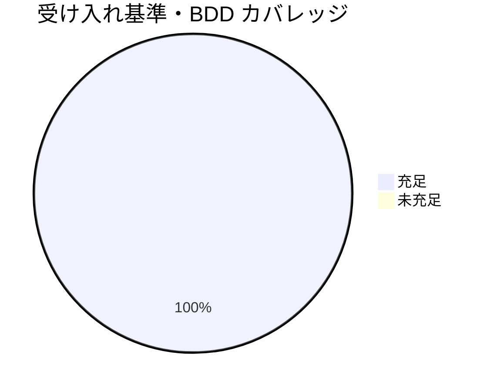

# レビュー書: クローズアウトと issue 起票の構造是正（親「コア取り込み漏れ補完」S5）

**プロジェクト名**: クローズアウトと issue 起票の構造是正（S5）
**作成日**: 2026 年 06 月 15 日
**最終更新**: 2026 年 06 月 15 日

> **用語**: [.agents/CONCEPTS.md §用語規約](../../../../../../../.agents/CONCEPTS.md#用語規約) を参照。
> **レビュー深度**: standard（中）。コア構造の移設＋行番号直リンク是正＋配線同期の中規模・意味不変な構造是正。検証は [.agents/REVIEW_RULE.md](../../../../../../../.agents/REVIEW_RULE.md) に従い grep／リンク解決スクリプトで実測し、[.agents/REVIEW_DUAL_LENS.md](../../../../../../../.agents/REVIEW_DUAL_LENS.md) の二観点を必須とする。

---

## 1. レビュー概要

### 1.1 レビュー目的（必須）

実装内容の確認 / 品質保証 / クローズ前最終チェック。S5（CLOSEOUT/ISSUE_CREATION の独立コアファイル化、`CORE.md:137` 行番号直リンク全件の安定参照置換、行番号直リンク禁止規約の追記）が、**規約の意味・振る舞いを変えない（must-preserve）構造是正**として成立しているかを、独立検証（grep 実測・リンク解決・diff 査読）で確認する。

### 1.2 レビュー対象（必須）

- **実装範囲**:
  - **新規**: `.agents/CLOSEOUT.md`（document_id: `aefb0658-6114-4092-a3de-78a7f43ee0fe`）、`.agents/CONTEXT_EFFICIENCY.md`（document_id: `b24ab361-adaa-468f-bfd1-488bd5a49eaa`）。
  - **変更**: `.agents/commands/implement-feature.md`・`.agents/commands/verify-and-close.md`・`.agents/MODEL_SELECTION.md`・`.agents/REVIEW_DUAL_LENS.md`・`.agents/CODE_COMMENT_RULES.md`・`.agents/boot/LOAD_POLICY.md`・`.agents/DOCS_RULES.md`・`CLAUDE.md`。
- **レビュー期間**: 2026-06-15 ～ 2026-06-15
- **レビュー担当者**: verify-and-close サブエージェント（generate-scenarios / map-coverage / review-code / review-architecture）。モデルティア: opus 相当（フレームワーク中核の監査）。

---

## 2. 実装内容の確認

### 2.1 実装完了タスク

| タスク名 | 実装内容 | 実装日 | 担当者 | ステータス |
| --- | --- | --- | --- | --- |
| T1（B）137 全件の安定参照置換 | `CORE.md:137` 行番号直リンク 7 箇所（5 ファイル）を §ルールの優先順位／§境界の見出しアンカーへ意味不変置換 | 2026-06-15 | implement | 完了 |
| T2（A）独立コアファイル化＋配線 | implement-feature.md §クローズアウト／§ISSUE_CREATION 本文を CLOSEOUT.md / CONTEXT_EFFICIENCY.md へ移設しリンク委譲化、被参照 5 経路を付け替え、LOAD_POLICY にトリガー 2 行追加 | 2026-06-15 | implement | 完了 |
| T3（C）再陳腐化防止規約 | DOCS_RULES.md に行番号直リンク禁止＋安定参照規約を 1 件追記、CODE_COMMENT_RULES へリンク委譲 | 2026-06-15 | implement | 完了 |

### 2.2 実装内容の詳細

#### タスク 1: CORE.md:137 引用 7 箇所の安定参照置換

- **実装内容**: 03 §2.1.2 置換表どおり、`MODEL_SELECTION.md:7` を §ルールの優先順位（意味 (a) PF 中立性）へ、残り 6 箇所（`REVIEW_DUAL_LENS.md:7`・`CODE_COMMENT_RULES.md:7/13/60`・`verify-and-close.md:88`・`implement-feature.md:74`）を §境界（意味 (b) 正本 1 か所・重複禁止）へ置換。
- **独立検証**:
  - `grep -rEn 'CORE\.md:[0-9]+' .agents/` → **0 件**（exit 1）。行番号直リンク全廃を実測。
  - `grep -rn 'CORE.md §ルールの優先順位' .agents/MODEL_SELECTION.md` → **1 件**。
  - `grep -nE '^##+ (ルールの優先順位|境界)' .agents/boot/CORE.md` → `128:## ルールの優先順位` / `143:## 境界` が実在。アンカー解決。
- **意味保存（diff 査読）**: CODE_COMMENT_RULES.md の 3 置換は文脈（「正本 1 か所・重複禁止」「配線は索引のみ」）を保持したまま参照表現のみ変更。意味不変。

#### タスク 2: CLOSEOUT.md / CONTEXT_EFFICIENCY.md の新設と配線付け替え

- **実装内容**: implement-feature.md §クローズアウト（commit／別セッション引継ぎ／clear 境界／fresh サブ分割／verify-実経路検証）を CLOSEOUT.md へ、§ISSUE_CREATION（作業単位=1 issue／inventory 索引化・スライス渡し／起票順序正本化・/clear）を CONTEXT_EFFICIENCY.md へ移設し、implement-feature.md は両節をリンク委譲（索引のみ）へ置換。
- **独立検証**:
  - 新 2 ファイルが存在し各 document_id を保持（`.agents/` 内で各 1 回・衝突なし）。
  - implement-feature.md の §クローズアウト・§ISSUE_CREATION の**本文サブ見出しが 0 件**（`grep -nE '^### (commit ステップ|別セッション引継ぎ|clear 境界|fresh サブ分割|verify-実経路検証)'` → なし）。`commit ステップ` の唯一の出現は 74 行のリンク委譲要約行のみ。移設完全。
  - 移設先 CONTEXT_EFFICIENCY.md / CLOSEOUT.md 本文を読み、3 原則・5 工程が完全保存されていることを確認（加法保存・意味不変）。
  - 配線付け替え（実測）: 旧アンカー `implement-feature.md#クローズアウト|#verify-実経路検証|#issue...` 残存 **0 件**。`verify-and-close.md:88`→CLOSEOUT.md、`MODEL_SELECTION.md:38`→CLOSEOUT.md、`REVIEW_DUAL_LENS.md:44`→`CLOSEOUT.md#verify-実経路検証`、`CLAUDE.md:16`→CONTEXT_EFFICIENCY.md。
  - LOAD_POLICY.md:29-30 にトリガー 2 行（クローズアウト実施時→CLOSEOUT.md／大規模 issue 起票時→CONTEXT_EFFICIENCY.md）追加を確認。
- **back-reference 追従**: CLOSEOUT.md:39 の `REVIEW_DUAL_LENS.md#3-証跡要求` が同階層相対で REVIEW_DUAL_LENS.md:29 `## 3 証跡要求` に解決。

#### タスク 3: 行番号直リンク禁止規約の追記

- **実装内容**: DOCS_RULES.md:38 に `## ドキュメント間参照：行番号直リンク禁止` 節を新設し、「`<file>.md:NNN` の行番号直リンクを新規使用しない／`§<節名>` または `#<見出しアンカー>` の安定参照を用いる」規約を追記。CODE_COMMENT_RULES.md には重複追記せずリンク委譲（責務分離）。
- **独立検証**: `grep -n '行番号直リンク' .agents/DOCS_RULES.md` → 規約行ヒット。CODE_COMMENT_RULES.md への委譲リンクが本文中に存在。

---

## 3. テスト結果の確認（検証スクリプト・grep 実測）

文書構造是正のため、単体テストは 03 §2.x.4 の BDD 検証スクリプト（grep／test -f／リンク解決）で代替する（03 §単体テスト の規定どおり）。**実装サブの自己申告を鵜呑みにせず、本レビューで再実行・独立計測した。**

### 3.1 検証結果サマリ（必須: 数値で記載）

- **実行日**: 2026-06-15
- **T1 BDD（137 = 0 件）**: `grep -rEn 'CORE\.md:[0-9]+' .agents/` = **0 件** → PASS
- **T1 BDD（MODEL_SELECTION → §ルールの優先順位）**: 1 件 → PASS
- **T2 BDD（新 2 ファイル存在）**: `test -f` 2/2 OK → PASS
- **T2 BDD（verify-and-close → CLOSEOUT.md）**: ヒット → PASS
- **T2 BDD（LOAD_POLICY に CLOSEOUT.md / CONTEXT_EFFICIENCY.md）**: 双方ヒット → PASS
- **T3 BDD（DOCS_RULES に行番号直リンク禁止）**: ヒット → PASS
- **リンク健全性**: 変更/新設 10 ファイルの相対リンク未解決 = **0 件**。アンカー解決チェックで 1 件警告したが手動確認の結果 `RULES.md#実行モードquick--standard--full`（RULES.md:7 `### 実行モード（quick / standard / full）`）は実在解決（近似スクリプトの `/` 未除去による誤検出。かつ本 S5 の変更箇所ではない既存リンク）。
- **失敗**: 0 / **スキップ**: 0

---

## 4. コードレビュー

### 4.1 品質

- **構造**: 1 ファイル 1 責務（CLOSEOUT=クローズアウト欠落工程の抽象形正本／CONTEXT_EFFICIENCY=ISSUE_CREATION 正本）。重複本文 0（implement-feature は索引のみ）。
- **PF 中立性**: 新 2 ファイルとも具体値（ブランチ名・CI コマンド・トレーラ・タグ運用・数値）を持たず `.agents-project/` 委譲を明記。
- **参照健全性**: 行番号直リンク 0、未解決リンク 0、全アンカー解決。

#### コードレビュー観点

| 観点 | 確認内容 | 結果 | コメント |
| --- | --- | --- | --- |
| 可読性 | 独立ファイル化で各原則の所在が明確化 | OK | command 内埋め込みの非対称配置を解消 |
| 保守性 | 行番号直リンク廃止＋禁止規約で再陳腐化に強い | OK | 安定参照（§節名/見出しアンカー）へ統一 |
| 単一責務 | CLOSEOUT/CONTEXT_EFFICIENCY が前例（MODEL_SELECTION 等）と一貫 | OK | `.agents/` 直下の単一責務コア群と整合 |
| 整合性 | 被参照 5 経路＋LOAD_POLICY トリガー全同期 | OK | 旧アンカー残存 0 |

### 4.2 指摘事項

二観点レビューを反復した結果、**敵対的観点・肯定的観点ともに承認阻却の指摘は 0 件**に収束した。以下は実装サブ自己申告の軽微差異 2 点の**独立検証結果**であり、いずれも実装欠陥ではなく承認可と判定する。

#### 申告差異 1: 03 §2.1.3 のテスト期待「§境界 出現=6 件」に対し実測 8 件

- **重要度**: 低（テスト期待値の更新漏れ。実装は正）
- **独立検証**: `grep -rno 'CORE.md §境界' .agents/ | wc -l` = **8 件**。内訳:
  - 元の置換 6 件: CODE_COMMENT_RULES.md:7/13/60、REVIEW_DUAL_LENS.md:7、verify-and-close.md:88、implement-feature.md:74。
  - +2 件（正当増）: (i) **CLOSEOUT.md:7**（新設ファイルの責務行。implement-feature §クローズアウトの「正本 1 か所・重複禁止＝CORE.md §境界」の趣旨を移設先で保持）、(ii) **implement-feature.md:78**（§ISSUE_CREATION をリンク委譲化した際に「本ファイルには再記述せず、リンクで委譲する（CORE.md §境界）」を新たに付与＝重複禁止原則の明示）。
- **判定**: **妥当**。8 件は移設・リンク委譲化に伴う正当増であり、6 件はあくまで「タスク 1 時点」の機械検証値。タスク 2（独立ファイル化）が後続で 2 件追加するため、03 のテスト期待値が古いだけ。意味（正本 1 か所・重複禁止）は全件で保存。**実装は受け入れ基準（137 全件是正・意味保存）を満たす。** 03 の期待値「6 件」は本 S5 のタスク順序（1→2）上の中間値であり、最終状態は 8 件が正。

#### 申告差異 2: verify-実経路検証 の見出しを h3（`###`）→ h2（`##`）へ変更

- **重要度**: 低（設計記述 §2.2.2 の「`### verify-実経路検証` を保持」との乖離。アンカー解決には影響なし）
- **独立検証**: CLOSEOUT.md:37 = `## verify-実経路検証`（h2）。参照側 REVIEW_DUAL_LENS.md:44 = `[CLOSEOUT.md §verify-実経路検証](CLOSEOUT.md#verify-実経路検証)`。Markdown のアンカーは見出しテキストから生成され**見出しレベルに依存しない**ため、h2 でも `#verify-実経路検証` は解決する（実測でリンク解決チェック PASS）。
- **判定**: **妥当**。CLOSEOUT.md は単一ファイルで全工程が h2 並列（commit ステップ/別セッション引継ぎ/clear 境界/fresh サブ分割/verify-実経路検証）となり、ファイル内の見出し階層として h2 統一の方が一貫する。03 §2.2.2 が h3 保持を記したのは「移設元の埋め込み階層」を念頭にした記述で、独立ファイル化後は h2 が自然。**アンカー解決・意味保存ともに維持されており実害なし。**

---

## 5. ドキュメントの確認

### 5.1 ドキュメント更新状況

| ドキュメント | 更新状況 | 確認者 | 確認日 |
| --- | --- | --- | --- |
| [`00_要求定義.md`](./00_要求定義.md) | 更新済み（要求確定） | verify | 2026-06-15 |
| [`01_要件定義.md`](./01_要件定義.md) | 更新済み（受け入れ基準・依存） | verify | 2026-06-15 |
| [`02_設計.md`](./02_設計.md) | 更新済み（置換表・責務割当） | verify | 2026-06-15 |
| [`03_実装計画.md`](./03_実装計画.md) | 更新済み（タスク 1-3・BDD） | verify | 2026-06-15 |

### 5.2 ドキュメントの整合性

- **実装と設計の整合性**: 整合。置換表（02 §2.2.3）・移設対象・配線対象が実装と一致。差異 2 点（§境界 6→8 件、h3→h2）は §4.2 のとおり「最終状態の正当値」「アンカー解決に無影響」で、設計記述側が中間値・移設元前提だったための軽微乖離。意味・振る舞いは不変。
- **要件と実装の整合性**: 整合。00/01 の成功基準（独立化判断材料・137 全件是正・must-preserve 明記・依存明記）を満たす。

---

## docs 更新

- 要否: **不要**
- 対象: なし
- 理由: 本 S5 はコア構造（`.agents/`）の配置・参照の構造是正であり、消費者向けシステム仕様（`docs/` の機能/データ/画面/API）に影響しない。

---

## 9. 設計・境界の確認（review-architecture）

### 9.1 設計の確認

- **設計原則の準拠**: 単一責務・正本 1 か所・重複禁止・PF 中立性・リンク委譲（索引のみ）すべて遵守。独立ファイル化は `.agents/` 直下の既存単一責務コア群（MODEL_SELECTION.md・REVIEW_DUAL_LENS.md・CODE_COMMENT_RULES.md 等）と一貫し、非対称配置を解消。
- **ディレクトリ構成**: 新 2 ファイルは `.agents/` 直下（独立コアの定位置）。spec/02 ディレクトリ構造方針と整合。
- **命名規則**: 既存コア命名（大文字スネーク `.md`）に準拠（CLOSEOUT.md / CONTEXT_EFFICIENCY.md）。

### 9.2 境界・依存の確認

- **責務の境界**: CLOSEOUT=クローズアウト欠落工程の抽象形、CONTEXT_EFFICIENCY=ISSUE_CREATION。両者とも具体値を持たず `.agents-project/` へ委譲（抽象/具体分離）。
- **依存関係**: implement-feature.md / verify-and-close.md / MODEL_SELECTION.md / REVIEW_DUAL_LENS.md / CLAUDE.md / LOAD_POLICY.md → 新 2 ファイルへの片方向リンク委譲。循環なし。旧アンカー残存 0。
- **指摘・推奨**: なし（差異 2 点は §4.2 で妥当と判定）。

### 9.3 重要判断の根拠（evidence_source）

| 判断内容 | evidence_source | 備考 |
| --- | --- | --- |
| 行番号直リンク全廃（137 = 0 件） | test_output | `grep -rEn 'CORE\.md:[0-9]+' .agents/` 0 件 |
| §境界アンカー実在・解決 | existing_code | CORE.md:128/143 に `## ルールの優先順位`/`## 境界` 実在 |
| 移設の意味保存（5 工程・3 原則の完全保存） | existing_code | CLOSEOUT.md / CONTEXT_EFFICIENCY.md 本文と implement-feature 旧本文の diff 照合 |
| 配線付け替え完了（旧アンカー 0・新リンク解決） | test_output | grep 残存 0・リンク解決チェック未解決 0 |
| §境界 6→8 件は正当増（差異 1） | existing_code | 内訳 grep（CLOSEOUT.md:7・implement-feature.md:78 が移設/委譲由来） |
| h3→h2 でもアンカー解決（差異 2） | test_output | リンク解決チェックで `CLOSEOUT.md#verify-実経路検証` 解決 |
| document_id 衝突なし | test_output | 新 2 id が `.agents/` 内で各 1 回 |

> 重要判断はいずれも grep 実測・diff 照合・見出し実在確認の**外部根拠**に基づく。inference_only のみに依存する重要判断はない。

---

## 二観点レビュー（REVIEW_DUAL_LENS）

### 敵対的観点リスト（壊しにいく視点・結論）

1. **137 残存**: 行番号直リンクが置換漏れで残っていないか → `grep -rEn 'CORE\.md:[0-9]+'` 0 件で残存なし。
2. **アンカー切れ**: §ルールの優先順位／§境界の見出しが CORE.md に実在しないと参照が宙に浮く → 128/143 行に実在、解決。
3. **移設漏れ（意味欠落）**: implement-feature の本文が新ファイルへ運ばれず欠落していないか → 本文サブ見出し 0、移設先で 5 工程・3 原則を完全保存。意味欠落なし。
4. **配線付け替え漏れ**: 旧 `implement-feature.md#...` 参照が残存して二重正本化しないか → 旧アンカー残存 0、被参照 5 経路すべて新ファイルへ。
5. **back-reference 破断**: 移設で `REVIEW_DUAL_LENS.md#3-証跡要求` の相対パスが壊れないか → CLOSEOUT.md 直下から同階層相対で解決。
6. **サブアンカー破断（h3→h2）**: 見出しレベル変更でアンカーが切れないか → Markdown アンカーは見出しテキスト依存でレベル非依存、`#verify-実経路検証` 解決。
7. **document_id 衝突/欠落**: 新ファイルの id が既存と衝突・未付与でないか → 各 1 回・衝突なし、frontmatter に付与済み。
8. **責務逸脱**: 再陳腐化防止規約を CODE_COMMENT_RULES に置いて責務逸脱しないか → DOCS_RULES に配置・CODE_COMMENT へはリンク委譲（02 §2.2.3 の責務割当どおり）。

### must-preserve リスト（壊してはいけない不変項目・保持確認）

1. **各ポリシーの規約の意味・振る舞い**（クローズアウト 5 工程・ISSUE_CREATION 3 原則・PF 中立性・正本 1 か所） — 移設先で完全保存（diff 査読）。
2. **`CORE.md:137` 引用の意図する意味**（PF 中立性＝§ルールの優先順位／正本 1 か所＝§境界） — 各置換で文脈保持。
3. **被参照リンクの解決可能性**（verify-and-close・MODEL_SELECTION・REVIEW_DUAL_LENS・CLAUDE・LOAD_POLICY からの参照） — 全リンク解決を実測。
4. **enforcement 判定条件**（CLOSEOUT の commit/push ステップ・verify(ii) 実経路検証等の規約） — 文言維持で判定条件不変。
5. **後方互換**（§ルールの優先順位／§境界の見出しアンカーが安定参照として今後も解決） — 行番号非依存化で強化。
6. **本リポ追跡物の非破壊**（`.agents/`・`.claude/`・`.workflow/`・`workflow.db`） — 破壊的検証なし・編集はコミット対象ファイルのみ。

---

## 12. レビュー結果

### 12.1 総合評価

- **実装品質**: 良好（行番号直リンク 0・未解決リンク 0・本文非残存・移設完全・意味保存）。
- **テスト品質**: 良好（T1/T2/T3 の BDD 検証スクリプトを独立再実行し全 PASS・FAIL 0）。
- **ドキュメント品質**: 良好（差異 2 点はいずれも軽微で実害なし・本 04 に独立検証結果を記録）。
- **総合評価**: **合格（PASS / 承認）**。成功基準 (A) 判断材料・(B) 137 全件是正・must-preserve 明記・依存明記・00 テンプレ準拠すべて充足。

### 12.2 承認状況

- **レビュー承認者**: verify-and-close サブエージェント（opus 相当）
- **承認日**: 2026-06-15
- **承認コメント**: 二観点レビューで指摘 0 件に収束。実装サブ自己申告の軽微差異 2 点（§境界 6→8 件・h3→h2）を独立検証し、いずれも「最終状態の正当値」「アンカー解決に無影響」で実装欠陥でないと判定。承認しクローズアウト（コミット）へ進む。**本 S5 はサブ issue のため、親 issue 全体完了時まで close 移動はしない。**

---

## 13. 参考資料

- [`00_要求定義.md`](./00_要求定義.md) / [`01_要件定義.md`](./01_要件定義.md) / [`02_設計.md`](./02_設計.md) / [`03_実装計画.md`](./03_実装計画.md)
- 是正対象/新設: [.agents/CLOSEOUT.md](../../../../../../../.agents/CLOSEOUT.md) / [.agents/CONTEXT_EFFICIENCY.md](../../../../../../../.agents/CONTEXT_EFFICIENCY.md) / [.agents/boot/CORE.md](../../../../../../../.agents/boot/CORE.md)
- [.agents/REVIEW_RULE.md](../../../../../../../.agents/REVIEW_RULE.md) / [.agents/REVIEW_DUAL_LENS.md](../../../../../../../.agents/REVIEW_DUAL_LENS.md) / [.agents/DOCS_RULES.md](../../../../../../../.agents/DOCS_RULES.md)

---

## 14. 前のステップ

- **前**: [`03_実装計画.md`](./03_実装計画.md) - 実装計画フェーズ

---

## 15. 次のステップ

- 外部設定不要のため最終確認チェックリストはスキップ。**本 S5 はサブ issue**であり、新規サブ issue の追加作成はなし（親 90_issues.md の編集不要）。承認後、S5 成果物を 1 論理コミットでクローズアウトする（push しない）。親「コア取り込み漏れ補完」の全サブ完了時に親 issue の close 移動を別途行う。
