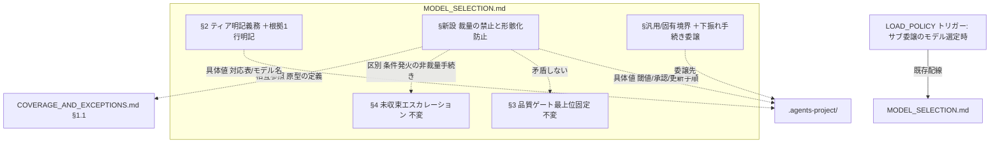
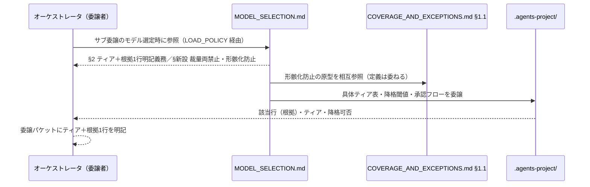
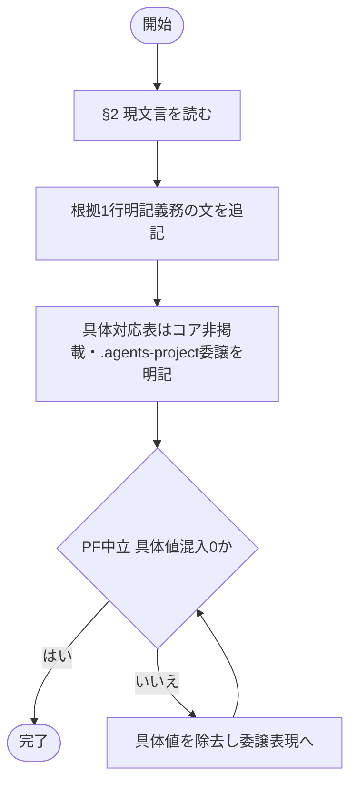
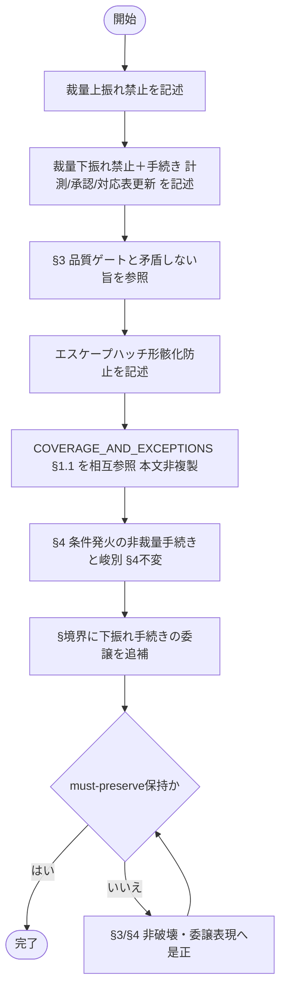

# 設計書: モデル選定の裁量禁止と形骸化防止

**プロジェクト名**: モデル選定の裁量禁止と形骸化防止（親「コア取り込み漏れ補完」S3）
**作成日**: 2026 年 06 月 15 日
**最終更新**: 2026 年 06 月 15 日

> **重要**: **このドキュメントは常に更新**: 設計の変更や追加があった場合は、即座にこのドキュメントを更新してください。ドキュメントは「生きているドキュメント」として扱い、実装内容と常に同期させます。
>
> **用語**: [.agents/CONCEPTS.md §用語規約](../../../../../../../.agents/CONCEPTS.md#用語規約) を参照。

---

## 参照元

- **親 issue**: [`../../00_要求定義.md`](../../00_要求定義.md)（親 issue_id: `434c7b86-4222-45e7-a0ef-1ae455f15313`）
- **本サブ issue**: `90_issues/モデル選定の裁量禁止と形骸化防止/`（issue_id: `de10a1af-500f-4161-b899-8ee79980902e`）
- 本サブ issue の 00/01: [`./00_要求定義.md`](./00_要求定義.md) / [`./01_要件定義.md`](./01_要件定義.md)
- **昇格先構造判断の上位確定（S5）**: [`../クローズアウトとissue起票の構造是正/02_設計.md`](../クローズアウトとissue起票の構造是正/02_設計.md) §2.2.2（「同格の汎用原則は独立コアファイルに対称配置／S3 は既存独立コア `MODEL_SELECTION.md` へ節追記し、COVERAGE_AND_EXCEPTIONS.md への移設は行わない」）。**本設計はこの S5 確定判断を前提とする。**
- **対象コア正本**: [`.agents/MODEL_SELECTION.md`](../../../../../../../.agents/MODEL_SELECTION.md)（§1〜§5・§汎用/固有境界）、[`.agents/COVERAGE_AND_EXCEPTIONS.md`](../../../../../../../.agents/COVERAGE_AND_EXCEPTIONS.md)（§1.1 禁止する回避パターン・§2 認定基準・§3 例外台帳）、[`.agents/boot/LOAD_POLICY.md`](../../../../../../../.agents/boot/LOAD_POLICY.md)（トリガー表）。

---

## 1. 設計概要

**必須**: 設計方針・原則は [.agents/spec/01_設計原則.md](../../../../../../../.agents/spec/01_設計原則.md) を先に参照した上で、本プロジェクトに適用するものを選び記載する。

### 1.1 設計方針

サブ委譲時のモデルティア選定について、**「裁量での上振れ・下振れの両禁止」「根拠（対応表の該当行）明記必須」「エスケープハッチ形骸化防止」という抽象統治原則のみ**を、既存独立コア `.agents/MODEL_SELECTION.md` の既存節を**壊さず直交追加**する形で昇格する。具体ティア対応表・モデル名・コスト実測・降格閾値は**コアに置かず** `.agents-project/` に委ねる現行の汎用/固有境界を維持する（PF 中立性）。同種の「例外形骸化防止」原理を持つ `COVERAGE_AND_EXCEPTIONS.md` とは**非重複・相互参照**で結び、二重定義を避ける。

### 1.2 設計原則（本プロジェクトで適用するもの）

- **単一責務（1 ファイル 1 責務）**: モデルティア選定原則の正本は `MODEL_SELECTION.md` の 1 ファイルに集約する。例外台帳の正本である `COVERAGE_AND_EXCEPTIONS.md` にモデル選定原則を移設・複製しない（責務の純度を守る）。CORE.md §境界（正本 1 か所・1 ファイル 1 責務）に従う。
- **明確な境界**: コア（抽象統治原則）と `.agents-project/`（具体ティア表・モデル名・降格閾値）の境界を明確化する。具体値をコアに混入させない。
- **AIフレンドリー設計**: 小さなファイル・意図が分かる節見出し・安定参照（§名アンカー）でエージェントが原則を一意に辿れるようにする。[01_設計原則 §AIフレンドリー設計](../../../../../../../.agents/spec/01_設計原則.md#aiフレンドリー設計) を適用。
- **UNIX哲学**: 小さく作る／1 つのことをうまくやる／組み合わせ可能（独立ファイル＋リンク委譲）を適用。

> **設計判断の優先順位**（[06_設計判断の優先順位.md](../../../../../../../.agents/spec/06_設計判断の優先順位.md)）: 本件は「可読性 > 単一責務 > 仕様との整合性」を上位に置く。**「再利用より責務の明確さ」**に従い、DRY のために例外台帳ファイルへ集約する案（01 §2.3 案 B）より、モデル選定責務の純度（案 A＝`MODEL_SELECTION.md` 拡張）を優先する。これは S5 §2.2.2 の構造判断とも一致する。

---

## 2. アーキテクチャ設計

本件は「ドキュメント構造のアーキテクチャ」を扱う。以下の「コンポーネント」はコアの**ファイル／節**を指す。

### 2.1 責務・境界・参照関係

#### 2.1.1 責務一覧（昇格後）

| コンポーネント | 責務（1 文） |
| -------------- | -------------- |
| `.agents/MODEL_SELECTION.md` §2（ティア明記義務・拡張） | ティアに加え**根拠（対応表の該当行）を 1 行明記**する義務をコア原則として持つ。 |
| `.agents/MODEL_SELECTION.md` §<新設>（裁量の禁止と形骸化防止） | **裁量上振れ禁止・裁量下振れ禁止（手続き条件付き）・エスケープハッチ形骸化防止**の抽象統治原則の正本を持つ。 |
| `.agents/MODEL_SELECTION.md` §3（品質ゲート最上位固定） | 既存どおり。**不変**。下振れ禁止原則は §3 と直交し矛盾しない（参照のみ）。 |
| `.agents/MODEL_SELECTION.md` §4（未収束エスカレーション） | 既存どおり。**不変・再設計しない**。「収束しない」条件発火の非裁量手続きであり、§新設の「裁量上位エスカレーションの常用化禁止」とは区別される（相互参照で峻別）。 |
| `.agents/COVERAGE_AND_EXCEPTIONS.md` §1.1・§2・§3 | 例外台帳（カバレッジ）の正本。**本件で内容は不変**。被参照側として「例外形骸化防止の汎用原型」を相互参照される。 |
| `.agents-project/`（採用先で定義） | 具体ティア対応表・モデル名・コスト実測・**下振れの計測閾値／承認フロー／対応表更新手順**。**コアに置かない。** |
| `.agents/boot/LOAD_POLICY.md` トリガー表 | 「サブ委譲のモデル選定時 → MODEL_SELECTION.md」の既存行で配線済み。**追加配線不要**（後述 2.3）。 |

#### 2.1.2 境界

- **入力**: 既存 `MODEL_SELECTION.md`（§1〜§5・§境界）、`COVERAGE_AND_EXCEPTIONS.md`（§1.1・§2・§3）、`LOAD_POLICY.md` トリガー表、01 の受け入れ基準・BDD、S5 §2.2.2 の昇格先確定判断。
- **出力**: `MODEL_SELECTION.md` への (a) §2 拡張、(b) 裁量禁止・形骸化防止の新設節、(c) §境界への具体値委譲行の追補、(d) `COVERAGE_AND_EXCEPTIONS.md` との相互参照リンク。およびそれらを実装フェーズへ渡す 03 のタスク分解。
- **他責務との境界（範囲外）**:
  - **具体ティア対応表・モデル名・コスト実測・降格閾値・承認フロー**の定義（`.agents-project/` の責務）。
  - `MODEL_SELECTION.md §3`（品質ゲート最上位）・`§4`（未収束エスカレーション）の**再設計**（00 §5 除外・must-preserve）。
  - `COVERAGE_AND_EXCEPTIONS.md` 本文の編集（カバレッジ例外の正本であり、本件は相互参照リンクの追加のみ／同ファイルへのモデル選定原則の移設はしない）。
  - **コアへの実差分の適用**は実装フェーズ。本 02/03 は判断・計画まで。
  - 親 `90_issues.md` の編集。

#### 2.1.3 参照関係（昇格後の依存の向き）

- `MODEL_SELECTION.md §<裁量の禁止と形骸化防止>` →（相互参照・概念の出自）→ `COVERAGE_AND_EXCEPTIONS.md §1.1 禁止する回避パターン`（「例外条項が形骸化する／台帳と根拠を要求する」汎用原型）。
- `MODEL_SELECTION.md §<裁量の禁止と形骸化防止>` →（区別の明示）→ `MODEL_SELECTION.md §4 未収束エスカレーション`（条件発火の非裁量手続きであり、裁量上位エスカレーションの常用化とは別物）。
- `MODEL_SELECTION.md §2`・`§<新設>` →（具体値の委譲）→ `.agents-project/`（対応表・モデル名・降格閾値・承認フロー）。
- `LOAD_POLICY.md`（トリガー表）→ `MODEL_SELECTION.md`（既存行で配線済み）。
- 循環参照を持たない（モデル選定原則は `MODEL_SELECTION.md` に集約、`COVERAGE_AND_EXCEPTIONS.md` は被参照のみで逆向きの依存を新設しない）。

### 2.2 システムアーキテクチャ

**必須**: 設計判断は [.agents/spec/](../../../../../../../.agents/spec/)（[00_spec概要.md](../../../../../../../.agents/spec/00_spec概要.md)・[01_設計原則.md](../../../../../../../.agents/spec/01_設計原則.md)・[06_設計判断の優先順位.md](../../../../../../../.agents/spec/06_設計判断の優先順位.md)）を先に参照した。

- **採用パターン**: **正本集約＋相互参照（single-source-of-truth + cross-reference）**。モデルティア選定原則の本文は `MODEL_SELECTION.md` 1 か所に置き、概念的に重なる例外形骸化防止の汎用原型は `COVERAGE_AND_EXCEPTIONS.md` を相互参照（リンク）で結び、本文を複製しない。
- **根拠**: [06_設計判断の優先順位](../../../../../../../.agents/spec/06_設計判断の優先順位.md)（可読性・単一責務・「再利用より責務の明確さ」）と CORE.md §境界（正本 1 か所・1 ファイル 1 責務）に基づく。既存の独立コアファイル群（CODE_COMMENT_RULES.md・COVERAGE_AND_EXCEPTIONS.md・MODEL_SELECTION.md・REVIEW_DUAL_LENS.md）の対称配置を維持する。

#### 2.2.1 昇格先の確定 — `MODEL_SELECTION.md` への節追記を採用する（案 A）

01 §2.3 は案 A（`MODEL_SELECTION.md` 拡張）と案 B（`COVERAGE_AND_EXCEPTIONS.md` へ集約）を論点として残し、最終決定を設計フェーズに委ねていた。**本設計は案 A を採用する。** これは S5 §2.2.2 が確定した「S3 は既存独立コア `MODEL_SELECTION.md` に節として追記する（COVERAGE_AND_EXCEPTIONS.md への移設は行わない＝対称配置維持）」と一致する。

**採否の根拠（案 A 採用・案 B 不採用）**:

| 観点 | 案 A: `MODEL_SELECTION.md` 拡張（採用） | 案 B: `COVERAGE_AND_EXCEPTIONS.md` へ集約（不採用） |
|------|-----------------------------------------|----------------------------------------------------|
| 責務の純度（最優先） | モデルティア選定の責務に閉じる。参照導線が短い（モデル選定時に 1 ファイルで完結）。 | 例外台帳（カバレッジ）の正本にモデルティアという別文脈を混ぜ、単一責務が薄まる。 |
| DRY（重複回避） | 「例外形骸化防止」の汎用原型と概念的に重なるが、**本文複製ではなく相互参照リンク**で DRY を担保する。 | 汎用原理を一箇所に集約でき DRY だが、責務純度とのトレードオフで劣後。 |
| 参照導線 | `LOAD_POLICY` トリガー「サブ委譲のモデル選定時 → MODEL_SELECTION.md」で 1 ホップ到達。 | モデル選定時に COVERAGE_AND_EXCEPTIONS.md（カバレッジ正本）を辿らせる導線は直感に反する。 |
| 構造の一貫性 | S5 §2.2.2 の「同格原則は独立ファイルに対称配置」方針と一致。 | S5 方針と矛盾する。 |

> **DRY と責務純度のトレードオフの解決**: 06 設計判断の優先順位「再利用より責務の明確さ」に従い、責務純度（案 A）を採る。重なる汎用原型の DRY は、案 A 内で `COVERAGE_AND_EXCEPTIONS.md §1.1` への**相互参照リンク 1 本**を張ることで担保し、原則本文の二重定義を避ける（07.1 リスク対策と一致）。

#### 2.2.2 `MODEL_SELECTION.md` への追記設計（どの節に何を足すか）

既存 §1（適用条件）・§3（品質ゲート最上位）・§4（未収束エスカレーション）・§5（参照）・§汎用/固有境界を**壊さず直交追加**する。具体は次のとおり。

**(a) §2 ティア明記義務の拡張（既存節への 1 文追記）**

- 現状: 「選定したティアを委譲パケットに明示する」止まり。
- 追記: 「ティアに加え、**根拠（対応表の該当行）を 1 行で明記**する。根拠の無いティア指定は不可。根拠の具体的な対応表（行の中身）はコアに置かず `.agents-project/` 参照とする。」
- 受け入れ基準対応: 01 ストーリー 3／BDD シナリオ 2。

**(b) §<新設>「裁量の禁止と形骸化防止」（§4 の後、§5 参照の前に新節を挿入）**

> **アンカー安定性（must-preserve）**: 新節は**番号を振らない見出し**（`## 裁量の禁止と形骸化防止`）として挿入し、**既存 §5 を「§5 参照」のまま据え置く（§6 等へ繰り下げない）**。理由は、`REVIEW_DUAL_LENS.md:45` が `MODEL_SELECTION.md#5-参照` をインバウンド参照しており、§5 を繰り下げるとこのアンカーが破断するため。実装時は当該インバウンドリンクの解決をリンク健全性チェック（03 T3/T4）で回帰確認する。

新節に以下 3 原則を抽象形で置く（具体閾値・手順は `.agents-project/` 委譲）:

1. **裁量上振れの禁止**: 「迷ったら上位」という裁量での上振れはしない。迷った場合も対応表の該当行に基づきティアを選び、その行を根拠として明記する（旧「迷ったら上位」条項がティア対応表を形骸化させた再発防止。経緯の一次参照は親 00 §1.2／本サブ 00 §1.2）。
2. **裁量下振れの禁止と手続き**: コスト都合での裁量的な下振れ（降格）はしない。下振れは **計測データ＋ユーザー承認＋対応表更新を経てのみ**許可される。具体閾値・承認フロー・更新手順は `.agents-project/`。**§3 品質ゲート最上位固定と矛盾しない**（コスト都合で品質ゲートを下げない）旨を 1 文で参照する。
3. **エスケープハッチ形骸化防止**: 例外経路（裁量上振れ・裁量下振れ・上位エスカレーションの常用化）が日常運用化して対応表・閾値を骨抜きにしないこと。この「例外条項が形骸化する／裁量を絞り根拠と手続きを要求する」汎用原型は `COVERAGE_AND_EXCEPTIONS.md §1.1 禁止する回避パターン`（台帳なしの除外・形骸化する矯正の禁止）と同根である旨を**相互参照リンクで明示し、本文を複製しない**。

**(c) §4 未収束エスカレーションとの峻別（新節内に区別の 1 文）**

- 新節 (3) に「`§4 未収束エスカレーション`は『収束しない』という**条件で発火する非裁量手続き**であり、本節が禁ずる『裁量での上位常用化』とは区別する。§4 は再設計しない」旨を明記し、§4 を破壊しないことを保証する（00 §5 除外・must-preserve）。

**(d) §汎用/固有境界の追補**

- 既存「`.agents-project/` で定義：具体ティア対応表・モデル名・期限・コスト実測・降格判断」に、**「下振れの計測閾値・承認フロー・対応表更新手順」**を明示的に列挙し、(b)-2 の具体がコアに混入しないことを境界として固定する。

**(e) §1 適用条件の流用（対象外環境の不発火）**

- 新節は §1 の対象外環境規定（ティア選択概念が無いランタイムでは発火しない）に従う旨を 1 文で参照する。新たな対象外規定は設けない（01 BDD シナリオ 4 対応）。

#### 2.2.3 `COVERAGE_AND_EXCEPTIONS.md` との非重複・相互参照の設計

- **方向**: `MODEL_SELECTION.md §<新設>` →（参照）→ `COVERAGE_AND_EXCEPTIONS.md §1.1`。**逆向きの参照（COVERAGE 側からモデル選定への参照）は新設しない**（COVERAGE はカバレッジ例外の正本であり、モデル選定の知識を持たせない＝責務純度維持）。
- **非重複の担保**: 「例外形骸化防止」の汎用原型の**定義本文**は `COVERAGE_AND_EXCEPTIONS.md §1.1`（禁止する回避パターン）に既存。`MODEL_SELECTION.md` 側はモデルティア文脈への**適用**（裁量上振れ・下振れ・上位常用化）を述べ、原型の定義は参照で委ねる。これにより 1 ファイル 1 責務・重複禁止（00 §3.4・07.1）を満たす。
- **アンカー安定性**: 参照は行番号直リンク（`...md:NNN`）を使わず、節見出しアンカー（`COVERAGE_AND_EXCEPTIONS.md §1.1 禁止する回避パターン` 等の §名表記）を用いる（S5 §2.2.3 の再陳腐化防止規約と整合）。

#### 2.2.4 アーキテクチャ図（昇格後の参照構成）

### 2.3 コンポーネント構成（昇格の配線）

昇格後のコア配線（実装フェーズで適用）:

- **`MODEL_SELECTION.md`**: §2 に根拠 1 行明記を追記、§4 と §5 の間に「裁量の禁止と形骸化防止」新節を**番号なし見出し**で挿入（**§5 は「§5 参照」のまま据え置き、繰り下げない**＝`#5-参照` アンカー保全。インバウンド `REVIEW_DUAL_LENS.md:45`）、§汎用/固有境界に下振れ手続きの委譲を追補、新節内に `COVERAGE_AND_EXCEPTIONS.md §1.1` への相互参照リンクを追加。**document_id（既存 `f2d7a163-...`）は不変更**（RULES：既存 id 書換禁止）。
- **`COVERAGE_AND_EXCEPTIONS.md`**: **本文編集なし**（被参照のみ）。※相互参照を双方向にしたい場合でも、責務純度のため逆参照は張らない（2.2.3）。
- **`LOAD_POLICY.md`**: トリガー「サブ委譲のモデル選定時 → MODEL_SELECTION.md」は**既存行で配線済み**。本件は MODEL_SELECTION.md 内追記であり、**新規トリガー行は不要**（配線確認のみ＝03 のタスクで grep 検証）。
- **`.agents-project/`**: 本リポは「パッケージ正本」であり、具体ティア表・降格閾値の実体は消費者ランタイムの `.agents-project/` 責務。本件はコア側の委譲明示までで、`.agents-project/` への具体値追加は範囲外。

### 2.4 データフロー

該当の「データ」はモデル選定時のリンク解決・原則参照フローである。昇格後、委譲者が原則を辿る経路:

---

## 3. 機能設計

### 3.1 機能 1: §2 ティア明記義務の拡張（根拠 1 行明記の必須化）

#### 3.1.1 概要

`MODEL_SELECTION.md §2` に「ティア＋根拠（対応表の該当行）を 1 行明記、根拠なきティア指定は不可」を追記する。具体対応表はコアに置かず `.agents-project/` 参照。

#### 3.1.2 処理フロー

#### 3.1.3 入力・出力

- **入力**: `MODEL_SELECTION.md §2` 現文言、01 ストーリー 3 受け入れ基準。
- **出力**: 根拠明記義務を含む §2（具体対応表の中身は不掲載）。

#### 3.1.4 エラーハンドリング

- 具体ティア名・モデル名・対応表の行内容がコアに混入していないことを `grep` と査読で検証（03 §テスト観点）。

### 3.2 機能 2: 「裁量の禁止と形骸化防止」新節の追加

#### 3.2.1 概要

§4 と §5 の間に新節を挿入し、裁量上振れ禁止・裁量下振れ禁止（手続き条件付き）・エスケープハッチ形骸化防止の 3 原則を抽象形で置く。§3 と矛盾せず、§4 を再設計しない。

#### 3.2.2 処理フロー

#### 3.2.3 入力・出力

- **入力**: `MODEL_SELECTION.md §3・§4・§境界`、`COVERAGE_AND_EXCEPTIONS.md §1.1`、01 ストーリー 1・2 受け入れ基準・BDD シナリオ 1・3。
- **出力**: 新節（3 原則・抽象形）＋ §境界追補＋相互参照リンク。

#### 3.2.4 エラーハンドリング

- §3・§4 の文言が不変であること、降格の具体閾値・承認フローがコアに混入していないこと、相互参照が本文複製でなくリンクであることを査読・grep で検証。

### 3.3 機能 3: LOAD_POLICY 配線確認（追加配線の要否判定）

#### 3.3.1 概要

「サブ委譲のモデル選定時 → MODEL_SELECTION.md」の既存トリガー行で配線が足りることを確認する。MODEL_SELECTION.md 内追記であるため新規トリガー行は不要。

#### 3.3.2 入力・出力

- **入力**: `LOAD_POLICY.md` トリガー表。
- **出力**: 配線充足の確認結果（不足があれば 03 にタスク追加。本設計の見立ては「追加不要」）。

#### 3.3.3 エラーハンドリング

- `grep -n 'MODEL_SELECTION' .agents/boot/LOAD_POLICY.md` で既存行の存在を確認。万一欠落していればトリガー行追加タスクを 03 に起こす。

---

## 4. データ設計

該当なし（ドキュメント構造の追記のため、DB スキーマ変更なし）。参照様式は節見出しアンカー（`MODEL_SELECTION.md §<節名>`・`COVERAGE_AND_EXCEPTIONS.md §1.1`）を用い、行番号直リンク（`...md:NNN`）を新規に使わない（S5 §2.2.3 規約と整合）。

---

## 5. API 設計

該当なし（外部 API は伴わない）。本件の「インターフェース」は**委譲パケットの記載契約**（ティア＋根拠の対応表該当行を 1 行で含める）と**ドキュメント間の参照契約**（§2.2.3 の相互参照規約）であり、具体表記は `.agents-project/` で具体化する。

---

## 6. テスト戦略

テスト戦略の観点定義は [RULES.md のテスト戦略必須要件](../../../../../../../.agents/RULES.md#テスト戦略必須要件)、BDD 形式は [TEST_BDD_FORMAT.md](../../../../../../../.agents/TEST_BDD_FORMAT.md) を参照。本件は文書追記のため、テストは**検証スクリプト（grep / リンク解決チェック）と査読**で代替する。

### 6.1 対象ごとのテスト割り当て

| 対象 | 単体 | 結合/API | E2E | クリティカル観点 | バリデーション観点 | 未達理由/補足 |
| ---- | ---- | -------- | --- | ---------------- | ------------------ | ------------- |
| §2 根拠明記の追記 | ○ | × | × | §2 に「ティア＋根拠1行明記・根拠なき指定不可」が明文化 | 具体対応表の行内容がコアに非掲載（PF 中立） | grep＋査読で検証 |
| 裁量上振れ禁止（新節） | ○ | × | × | 「迷ったら上位はしない／対応表該当行で選び根拠明記」が明文化 | 旧「迷ったら上位」誘発文がコアに無い | 査読＋grep |
| 裁量下振れ禁止＋手続き（新節） | ○ | × | × | 「裁量下振れ禁止／下振れは計測＋承認＋対応表更新を経てのみ」が明文化 | 具体閾値・承認フローがコアに非掲載・§3 と矛盾しない | 査読 |
| エスケープハッチ形骸化防止＋相互参照 | ○ | × | × | 形骸化防止意図が明文化／COVERAGE §1.1 を相互参照 | 本文を複製していない（リンクのみ）／逆参照を新設しない | リンク解決＋査読 |
| §4 峻別・非破壊 | ○ | × | × | §4 文言不変／新節に「条件発火の非裁量手続きと区別」が明記 | §3・§4 の意味不変（must-preserve） | diff＋査読 |
| §5 アンカー保全 | ○ | × | × | 新節は番号なし見出し／`## 5 参照` の番号不変 | `REVIEW_DUAL_LENS.md:45` の `#5-参照` インバウンド未破断（must-preserve） | grep＋リンク解決 |
| PF 中立性 | ○ | × | × | 具体ティア表・モデル名・コスト実測・降格閾値がコアに混入 0 | `.agents-project/` 委譲が境界に明示 | grep＋査読 |
| LOAD_POLICY 配線 | ○ | × | × | 「モデル選定時 → MODEL_SELECTION.md」既存行が存在 | 追加配線の要否が判定済 | grep |

### 6.2 監査・レビューでの確認（証跡）

- 本 02 §6.1 の割当と 03 の各タスク BDD（明文化期待・grep 期待値・リンク解決期待値）が揃っていることを確認。
- must-preserve（PF 中立・`.agents-project/` 委譲・COVERAGE との非重複・§3/§4 非破壊・**§5 アンカー保全＝`#5-参照` を破断させない**）が REVIEW_DUAL_LENS の二観点で確認されること（実装フェーズのレビュー）。

---

## 7. UI 設計

該当なし。

---

## 8. セキュリティ設計

該当なし（高リスク操作・外部書き込みを伴わない。コア文書への追記のみ）。

---

## 9. 非機能要件への対応

### 9.1 パフォーマンス（コンテキスト効率）

- 追記は `MODEL_SELECTION.md` 1 ファイルに収まり、モデル選定時に 1 ホップで参照できる（LOAD_POLICY 既存配線）。具体値は `.agents-project/` へ 1 ホップで辿れる（01 §3.3）。コンテキスト効率を悪化させない。

### 9.2 可用性（リンク健全性・互換性）

- 相互参照（`COVERAGE_AND_EXCEPTIONS.md §1.1`）が解決可能で未解決 0 件であること（03 §テスト観点で検証）。
- 対象外環境（ティア選択概念が無いランタイム）では §1 規定により新節も発火しない（マルチ PF 中立性維持）。

---

## 10. 参考資料

### プロジェクトドキュメント

- [`00_要求定義.md`](./00_要求定義.md) - 要求定義
- [`01_要件定義.md`](./01_要件定義.md) - 要件定義
- [`../クローズアウトとissue起票の構造是正/02_設計.md`](../クローズアウトとissue起票の構造是正/02_設計.md) §2.2.2 - S3 昇格先の上位確定判断

### その他の参考資料

- 昇格先（編集対象）: [.agents/MODEL_SELECTION.md](../../../../../../../.agents/MODEL_SELECTION.md)（§2 拡張・新節挿入・§境界追補）
- 相互参照先（非編集）: [.agents/COVERAGE_AND_EXCEPTIONS.md](../../../../../../../.agents/COVERAGE_AND_EXCEPTIONS.md) §1.1
- 配線確認: [.agents/boot/LOAD_POLICY.md](../../../../../../../.agents/boot/LOAD_POLICY.md)、[.agents/boot/CORE.md](../../../../../../../.agents/boot/CORE.md)（§ルールの優先順位・§境界）
- 設計原則: [.agents/spec/01_設計原則.md](../../../../../../../.agents/spec/01_設計原則.md)、[.agents/spec/06_設計判断の優先順位.md](../../../../../../../.agents/spec/06_設計判断の優先順位.md)

---

## 11. 前のステップ

この設計書は、以下のドキュメントを基に作成されています：

- **前**: [`01_要件定義.md`](./01_要件定義.md) - 要件定義フェーズ

---

## 12. 次のステップ

この設計書の承認後、以下のドキュメントを作成します：

- **次**: [`03_実装計画.md`](./03_実装計画.md) - 実装計画フェーズ
