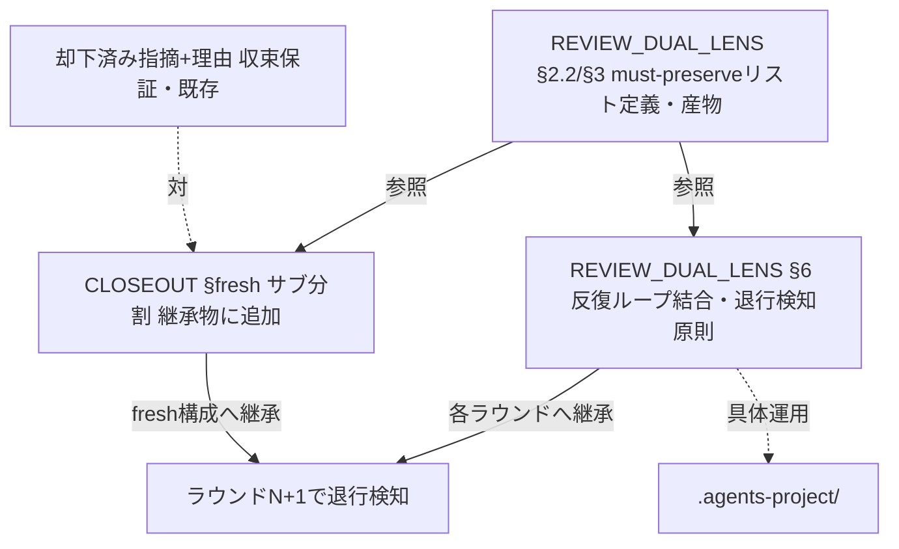
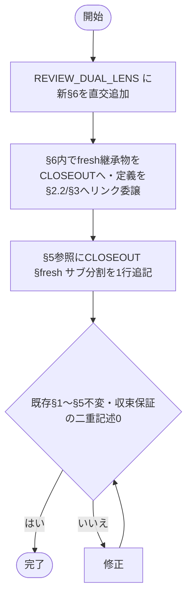
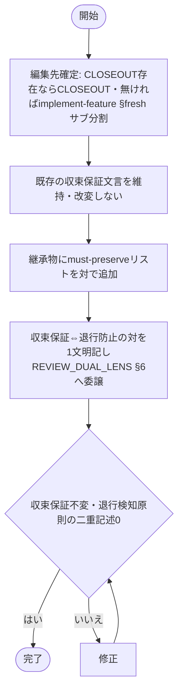

# 設計書: 二観点 must-preserve のラウンド継承

**プロジェクト名**: 二観点 must-preserve のラウンド継承（親「コア取り込み漏れ補完」S4）
**作成日**: 2026 年 06 月 15 日
**最終更新**: 2026 年 06 月 15 日

> **重要**: **このドキュメントは常に更新**: 設計の変更や追加があった場合は、即座にこのドキュメントを更新してください。ドキュメントは「生きているドキュメント」として扱い、実装内容と常に同期させます。
>
> **用語**: [.agents/CONCEPTS.md §用語規約](../../../../../../../.agents/CONCEPTS.md#用語規約) を参照。

---

## 参照元

- **親 issue**: [`../../00_要求定義.md`](../../00_要求定義.md)（親 issue_id: `434c7b86-4222-45e7-a0ef-1ae455f15313`）
- **本サブ issue**（S4）: `90_issues/二観点mustpreserveのラウンド継承/`（issue_id: `ec64c606-7007-417a-a59e-3d221c81b8fb`）
- 本サブ issue の 00/01: [`./00_要求定義.md`](./00_要求定義.md) / [`./01_要件定義.md`](./01_要件定義.md)
- **コア該当正本**: [`.agents/REVIEW_DUAL_LENS.md`](../../../../../../../.agents/REVIEW_DUAL_LENS.md)、[`.agents/commands/implement-feature.md §fresh サブ分割`](../../../../../../../.agents/commands/implement-feature.md)
- **S5 構造判断（前提・従う）**: [`../クローズアウトとissue起票の構造是正/02_設計.md`](../クローズアウトとissue起票の構造是正/02_設計.md)（§2.2.1 で `.agents/CLOSEOUT.md` 新設＝fresh サブ分割節の移設を確定。issue_id: `10b7821c-d49d-427c-b39c-03339eef1c76`）

---

## 1. 設計概要

**必須**: 設計方針・原則は [.agents/spec/01_設計原則.md](../../../../../../../.agents/spec/01_設計原則.md) を先に参照した上で、本プロジェクトに適用するものを選び記載する。

### 1.1 設計方針

二観点レビューの肯定的観点が生む **must-preserve リスト（壊してはならない不変条件）** を、指摘 0 まで反復するレビュー・ラウンドおよび fresh reviewer／fresh サブ分割をまたいで**継承**し、各ラウンドで退行を検知する原則をコアへ昇格する。**既存正本（[REVIEW_DUAL_LENS.md §1〜§5](../../../../../../../.agents/REVIEW_DUAL_LENS.md)・fresh サブ分割の収束保証）を改変せず**、収束保証（却下済み指摘＋理由の継承）と**対**になる退行防止側（must-preserve のラウンド継承）のみを**節単位で加法的に直交追加**する。本フェーズの成果物は昇格先 2 か所の確定判断と編集設計（02）・タスク分解（03）であり、コアへの実差分は実装フェーズで行う。

### 1.2 設計原則（本プロジェクトで適用するもの）

- **単一責務（1 ファイル 1 責務）**: 退行防止（must-preserve 継承）と収束保証（却下済み指摘＋理由継承）を**対**で扱うが、それぞれの責務正本は 1 か所に保ち、同一内容を二重定義しない。リンクで委譲する（[CORE.md §境界](../../../../../../../.agents/boot/CORE.md#境界)）。
- **明確な境界**: 反復ループ・fresh 構成という「プロセスの場」（REVIEW_DUAL_LENS／CLOSEOUT）と、継承される「不変条件リスト」（REVIEW_DUAL_LENS §2.2/§3 の産物）の境界を明確化する。原則本文の重複埋め込みをしない。
- **AIフレンドリー設計**: 小さな加法的節・意図が分かる節名・節見出しアンカーの安定参照で、収束保証⇔退行防止の対をエージェントが一意に辿れるようにする（[01_設計原則 §AIフレンドリー設計](../../../../../../../.agents/spec/01_設計原則.md#aiフレンドリー設計)）。
- **UNIX哲学**: 小さく作る／既存と組み合わせ可能（直交追加＋リンク委譲）を適用する。

> **設計判断の優先順位**（[06_設計判断の優先順位.md](../../../../../../../.agents/spec/06_設計判断の優先順位.md)）: 本件は「可読性 > 単一責務 > 仕様との整合性」を上位に置く。収束保証⇔退行防止が一対として読める可読性と、二重定義しない単一責務を優先する。

---

## 2. アーキテクチャ設計

本件は「ドキュメント構造のアーキテクチャ」を扱う。以下の「コンポーネント」はコアの**ファイル／節**を指す。

### 2.1 責務・境界・参照関係

#### 2.1.1 責務一覧（昇格後）

| コンポーネント | 責務（1 文） |
| -------------- | -------------- |
| `.agents/REVIEW_DUAL_LENS.md`（既存・節追加） | 二観点と両リスト証跡の正本に、**反復ループ結合節**（must-preserve リストを各レビュー・ラウンドへ継承して退行を検知する原則）を直交追加する。 |
| `.agents/CLOSEOUT.md`（S5 で新設・fresh サブ分割節を保有）の **fresh サブ分割節** | fresh reviewer／fresh サブ構成時の継承物に、既存の「却下済み指摘＋理由（収束保証）」と**対**で **must-preserve リスト（退行防止）** を加える。 |
| `.agents/commands/implement-feature.md §fresh サブ分割` | S5 で本文が `CLOSEOUT.md` へ移設されリンク委譲（索引）になる予定。**S5 未完了時の暫定昇格先**でもある（後述 2.2.3 の帰属確定で吸収）。 |

#### 2.1.2 境界

- **入力**: 既存コア（REVIEW_DUAL_LENS.md §1〜§5、implement-feature.md §fresh サブ分割、S5 が新設する CLOSEOUT.md の fresh サブ分割節）と、01 の要件（must-preserve のラウンド継承・fresh 継承物への追加・結合の明示）。
- **出力**: (a) REVIEW_DUAL_LENS.md への反復ループ結合節の追加設計、(b) CLOSEOUT.md fresh サブ分割節の継承物拡張設計、両者を実装フェーズに渡す 03 のタスク分解。
- **他責務との境界（範囲外）**:
  - **収束保証（却下済み指摘＋理由の継承）の再定義・再記述**（既存正本を維持。must-preserve）。
  - **二観点そのものの再定義**（REVIEW_DUAL_LENS §2/§3 を改変しない）。
  - **コアへの実差分の適用**は実装フェーズ。本 02/03 は判断・編集設計・計画まで。
  - **S5 の独立ファイル化判断そのもの**（本 S4 は S5 の確定構造に従い、CLOSEOUT.md 新設の是非は判断しない）。
  - 親 `90_issues.md` の編集。

#### 2.1.3 参照関係（昇格後の依存の向き）

- `REVIEW_DUAL_LENS.md`（反復ループ結合節）→（リンク委譲）→ `CLOSEOUT.md §fresh サブ分割`（継承物の正本）および `RULES.md §実行モード`（深さ・反復の流用元、§4 既存）。
- `CLOSEOUT.md §fresh サブ分割`（継承物に must-preserve を追加）→（リンク委譲）→ `REVIEW_DUAL_LENS.md §2.2/§3`（must-preserve リストの定義・産物の正本）。
- **対の関係**: 収束保証（却下済み指摘＋理由＝既存正本、CLOSEOUT.md §fresh サブ分割）⇔ 退行防止（must-preserve 継承＝本 issue 追加、同節に対で併記＋REVIEW_DUAL_LENS への結合）。
- 循環参照を持たない（must-preserve リストの定義は REVIEW_DUAL_LENS §2.2/§3 の 1 か所、継承の場は CLOSEOUT／REVIEW_DUAL_LENS の各 1 節がそれを参照するのみ。原則本文を双方に重複させない）。

### 2.2 システムアーキテクチャ

**必須**: 設計判断は [.agents/spec/](../../../../../../../.agents/spec/) を先に参照した。

- **採用パターン**: **正本集約＋リンク委譲（single-source-of-truth + reference delegation）／直交追加（既存節を改変せず節単位で加法）**。must-preserve リストの定義は REVIEW_DUAL_LENS §2.2/§3 の 1 か所に保ち、「継承」という新挙動だけを 2 つの場（反復ループ＝REVIEW_DUAL_LENS、fresh 構成＝CLOSEOUT）に節として加える。
- **根拠**: [06_設計判断の優先順位](../../../../../../../.agents/spec/06_設計判断の優先順位.md)（可読性・単一責務）と [CORE.md §境界](../../../../../../../.agents/boot/CORE.md#境界)（正本 1 か所・1 ファイル 1 責務）。S5 が既存独立コア（CODE_COMMENT_RULES.md・MODEL_SELECTION.md・REVIEW_DUAL_LENS.md）と対称化する方針を採るため、本 S4 もその対称構造（独立コアファイルの節）に昇格先を合わせる。

#### 2.2.1 （a）昇格先 1 — REVIEW_DUAL_LENS.md への反復ループ結合節の追加

**判断: REVIEW_DUAL_LENS.md に新節「§6 反復ループへの must-preserve 継承（退行検知）」を直交追加する（既存 §1〜§5・§汎用/固有境界は不変）。**

- **追加位置**: 既存 §4「深さ」（quick/standard/full の流用）と §5「参照」の間、または §5 の後に新 §6 として加える。**§4 が「指摘 0 まで反復」ループ概念を `RULES.md §実行モード` 流用と述べるのみで、ループと must-preserve の結合が暗黙**である穴（01 §1.2・00 §1.2）を、この新節が明示で埋める。
- **記述内容（抽象・PF 中立）**:
  - レビューを**指摘 0 まで反復**する各ラウンドへ、§2.2/§3 の **must-preserve リスト（不変条件）を継承**する。
  - 各ラウンドで、修正が継承した不変条件を壊していないか（退行）を確認し、退行があれば要修正として検知する（§2.1 敵対的観点の「不確実なら要修正に倒す」と整合）。
  - fresh reviewer／fresh サブ構成での継承物としての扱いは **fresh サブ分割節**へリンク委譲する（本節では「ラウンド継承」という抽象原則のみを置き、fresh 構成の継承物列挙は重複させない）。委譲リンク先は §2.2.3 の帰属確定（節単位）に従い、CLOSEOUT.md 実在時は [CLOSEOUT.md §fresh サブ分割](../../../../../../../.agents/CLOSEOUT.md)、S5 未着地時は暫定で [implement-feature.md §fresh サブ分割](../../../../../../../.agents/commands/implement-feature.md#fresh-サブ分割) を指し、未解決リンクを生まない（S5 完了時に CLOSEOUT.md へ付け替え）。
- **重複回避**: 収束保証（却下済み指摘＋理由）はここに**書かない**。本節は退行防止（must-preserve 継承）の原則正本であり、fresh 構成での具体的な継承物の束ねは CLOSEOUT.md 側に置く。

> **代替案の記録**: REVIEW_DUAL_LENS に書かず implement-feature/CLOSEOUT のみに集約する案も検討したが、must-preserve の**定義と産物は REVIEW_DUAL_LENS の責務**であり、「ラウンドをまたいで継承する」原則は二観点の目的（§1 churn/退行防止）の直接の延長である。二観点の正本に結合節を置くのが責務上適切（暗黙の結合を明示化する 01 ストーリー 3 の要求にも合致）。**よって REVIEW_DUAL_LENS への結合節追加を採用する。**

#### 2.2.2 （b）昇格先 2 — CLOSEOUT.md §fresh サブ分割の継承物拡張

**判断: CLOSEOUT.md §fresh サブ分割（S5 で implement-feature.md §fresh サブ分割本文を移設して新設）の継承物に、既存の「却下済み指摘＋理由（収束保証）」と対で「must-preserve リスト（退行防止）」を加える。**

- **既存（収束保証・改変しない）**: 「分割しても収束を保証するため、**却下済みの指摘とその理由**を後続サブへ継承し、同じ指摘の蒸し返し・無限反復を防ぐ」（implement-feature.md:92 現文言、S5 で CLOSEOUT.md へ意味不変移設）。
- **追加（退行防止・対で併記）**: 「収束保証に**加えて**、退行を防ぐため **must-preserve リスト（不変条件）も後続サブへ継承**する。文脈をリセットしても収束保証と退行防止の両方が維持される。」
- **明示する対構造**: 本節に「**収束保証（却下済み指摘＋理由）⇔ 退行防止（must-preserve）の対**」を 1 文で明記し、退行防止側の原則正本は [REVIEW_DUAL_LENS.md §6 反復ループへの must-preserve 継承](../../../../../../../.agents/REVIEW_DUAL_LENS.md)、must-preserve の定義は [REVIEW_DUAL_LENS.md §2.2/§3](../../../../../../../.agents/REVIEW_DUAL_LENS.md) へリンク委譲する（fresh 構成側には「継承物に加える」事実のみを置き、退行検知の原則本文・must-preserve 定義は重複させない）。

#### 2.2.3 帰属の確定（S4 の昇格先を 2 か所に確定）

| 観点 | 昇格先 | 置く内容 | 重複回避 |
|------|--------|----------|----------|
| 退行防止の**原則**（ラウンド継承で退行検知） | `REVIEW_DUAL_LENS.md` 新 §6 | must-preserve を各ラウンドへ継承し退行検知する抽象原則 | 収束保証は書かない／fresh 継承物列挙は CLOSEOUT へ委譲 |
| fresh 構成での**継承物**への追加 | `CLOSEOUT.md §fresh サブ分割` | 継承物に must-preserve を対で追加（収束保証は既存維持） | 退行検知の原則・must-preserve 定義は REVIEW_DUAL_LENS へ委譲 |

- **S5 依存と暫定運用**: CLOSEOUT.md は **S5 が新設**する。S5 未完了の段階で本 S4 を実装する場合、(b) の編集先は暫定的に `implement-feature.md §fresh サブ分割`（現本文）となり、S5 完了時に CLOSEOUT.md へ同節ごと移設される（S4 の追加文言も一緒に移動する）。**どちらの順序でも昇格内容は同一**（継承物に must-preserve を対で追加）であり、帰属は「fresh サブ分割節」という**節単位**で固定する（ファイル名は S5 の進捗に従う）。実装フェーズで S5 の完了状態を確認し、編集先ファイルを確定する（03 §2.2 に手順化）。
- **CLOSEOUT.md は共有ファイル（衝突回避）**: CLOSEOUT.md は S1/S2 も触れうる共有ファイルである。本 S4 の編集は **§fresh サブ分割の 1 節内への加法的な行追加のみ**に限定し、他節（commit／別セッション引継ぎ／clear 境界／verify-実経路検証）には触れない。これにより S1/S2 の編集と**節単位で衝突を回避**する。

### 2.3 コンポーネント構成（昇格の配線）

昇格後のコア配線（実装フェーズで適用）:

- **REVIEW_DUAL_LENS.md**: 新 §6「反復ループへの must-preserve 継承（退行検知）」を §5 参照の前後に直交追加。§5 参照に「fresh サブ分割節」への 1 行を追記（結合の発見性）。**§5 追記リンクおよび §6 の委譲リンク先は §2.2.3 の節単位帰属に従い実在ファイルを指す**（CLOSEOUT.md 実在時 CLOSEOUT.md、S5 未着地時 implement-feature.md §fresh サブ分割。未解決リンクを生まず、S5 完了時に付け替え）。frontmatter document_id は不変。**S5 との §5 共編集**: S5 は REVIEW_DUAL_LENS.md:44 の既存 §5 行（`#verify-実経路検証` 参照）を CLOSEOUT.md へ付け替える（S5 02 §2.3）。S4 は §5 へ**別の 1 行を加法追加**するのみで既存行を改変しないため、両者は同一節内の異なる行を編集し論理的衝突はない（適用順非依存。後着地側が `git diff` で既存行不変＝直交を確認）。
- **CLOSEOUT.md §fresh サブ分割**（S5 新設）: 継承物に must-preserve リストを対で追加し、退行検知原則を REVIEW_DUAL_LENS §6 へリンク委譲。S5 未完了時は implement-feature.md §fresh サブ分割が暫定編集先。
- **重複しない正本配置**: must-preserve **定義**＝REVIEW_DUAL_LENS §2.2/§3（1 か所）／退行検知**原則**＝REVIEW_DUAL_LENS §6（1 か所）／fresh 構成での**継承物列挙**＝CLOSEOUT §fresh サブ分割（1 か所）。収束保証＝CLOSEOUT §fresh サブ分割（既存・1 か所）。

### 2.4 データフロー

該当の「データ」は must-preserve リストの継承フローである。昇格後、レビュアー／オーケストレーターが不変条件を継承して退行検知する経路:

---

## 3. 機能設計

### 3.1 機能 1: （a）REVIEW_DUAL_LENS.md への反復ループ結合節の追加

#### 3.1.1 概要

REVIEW_DUAL_LENS.md に新 §6 を直交追加し、must-preserve を各レビュー・ラウンドへ継承して退行を検知する原則を明文化する。既存 §1〜§5 と汎用/固有境界は改変しない。

#### 3.1.2 処理フロー

#### 3.1.3 入力・出力

- **入力**: REVIEW_DUAL_LENS.md の現 §2.2/§3/§4/§5、01 のストーリー 1・3。
- **出力**: 新 §6 を持つ REVIEW_DUAL_LENS.md（既存節不変・収束保証の文言を含まない）。

#### 3.1.4 エラーハンドリング

- 二重記述検出: 実装後に `grep -n '却下済み' .agents/REVIEW_DUAL_LENS.md` が 0 件（収束保証は書かない）であることを確認。新 §6 のリンク（fresh サブ分割節＝実在ファイル[CLOSEOUT.md または S5 未着地時 implement-feature.md]・§2.2/§3）が解決可能であることを検証（委譲先の確定は §2.2.3 の節単位帰属に従う）。

### 3.2 機能 2: （b）CLOSEOUT.md §fresh サブ分割の継承物拡張

#### 3.2.1 概要

fresh サブ分割節の継承物に、収束保証（却下済み指摘＋理由）と対で must-preserve リスト（退行防止）を加える。退行検知の原則本文・must-preserve 定義は REVIEW_DUAL_LENS へリンク委譲する。

#### 3.2.2 処理フロー

#### 3.2.3 入力・出力

- **入力**: CLOSEOUT.md §fresh サブ分割（または S5 未完時 implement-feature.md:92 現文言）、01 のストーリー 2。
- **出力**: 継承物に must-preserve を対で持つ §fresh サブ分割（収束保証文言は不変）。

#### 3.2.4 エラーハンドリング

- 退行検知原則の二重記述検出: fresh 節内に「退行検知の原則本文」「must-preserve の定義」を書かず、リンク委譲に留めていることを査読＋ `grep` で確認。収束保証文言（却下済み指摘＋理由）が改変されていないことを diff で確認。

---

## 4. データ設計

該当なし（ドキュメント構造への加法的追加のため、DB スキーマ変更なし）。継承される「データ」は must-preserve リストであり、その定義・形式は [REVIEW_DUAL_LENS.md §2.2/§3](../../../../../../../.agents/REVIEW_DUAL_LENS.md)（不変条件＝契約・後方互換・既存テストの前提・利用者依存の振る舞い）の正本に従う（本 issue で再定義しない）。

---

## 5. API 設計

該当なし（外部 API は伴わない）。本件の「インターフェース」は**ドキュメント間の参照契約（収束保証⇔退行防止の対と、定義／継承の場の分離）**であり、§2.2・§2.3 がそれを定義する。

---

## 6. テスト戦略

テスト戦略の観点定義は [RULES.md のテスト戦略必須要件](../../../../../../../.agents/RULES.md#テスト戦略必須要件)、BDD 形式は [TEST_BDD_FORMAT.md](../../../../../../../.agents/TEST_BDD_FORMAT.md) を参照。本件は文書構造への加法的追加のため、テストは**検証スクリプト（grep / リンク解決チェック）と査読**で代替する。

### 6.1 対象ごとのテスト割り当て

| 対象 | 単体 | 結合/API | E2E | クリティカル観点 | バリデーション観点 | 未達理由/補足 |
| ---- | ---- | -------- | --- | ---------------- | ------------------ | ------------- |
| (a) REVIEW_DUAL_LENS §6 追加 | ○ | × | × | must-preserve のラウンド継承＝退行検知原則がコアに 1 か所明文化 | 既存 §1〜§5・汎用/固有境界が不変・収束保証文言を含まない | grep＋diff＋査読で検証 |
| (b) CLOSEOUT §fresh サブ分割の継承物拡張 | ○ | × | × | 継承物に must-preserve が収束保証と対で追加 | 収束保証（却下済み指摘＋理由）文言が不変・退行検知原則/定義の二重記述 0 | grep＋diff で検証 |
| 結合の明示（暗黙でない） | ○ | × | × | 二観点と反復ループ/fresh 継承がリンクで結合・未解決リンク 0 | 同一内容の二重記述なし（定義/原則/継承物の正本が各 1 か所） | リンク解決スクリプト＋査読 |

### 6.2 監査・レビューでの確認（証跡）

- 本 02 §6.1 の割当と 03 の各タスク BDD（grep 期待値・リンク解決期待値）が揃っていることを確認。
- must-preserve（[01 §2.3](./01_要件定義.md) のビジネスルール＝収束保証⇔退行防止を対で扱う構図・既存正本を改変せず直交追加・1 ファイル 1 責務・PF 中立）が REVIEW_DUAL_LENS の二観点（敵対的＋肯定的）で確認されること（実装フェーズのレビュー）。

---

## 7. UI 設計

該当なし。

---

## 8. セキュリティ設計

該当なし（高リスク操作・外部書き込みを伴わない）。

---

## 9. 非機能要件への対応

### 9.1 パフォーマンス（コンテキスト効率）

- 加法は 2 節（REVIEW_DUAL_LENS §6・CLOSEOUT §fresh サブ分割への数行）に限定し、定義はリンク委譲する。コンテキスト効率を悪化させない最小記述とする（[01 §3.1](./01_要件定義.md)）。

### 9.2 可用性（リンク健全性）

- 昇格後、新節のリンク（fresh サブ分割節＝実在ファイル[CLOSEOUT.md または S5 未着地時 implement-feature.md §fresh サブ分割]・REVIEW_DUAL_LENS §6・§2.2/§3）が解決可能で未解決 0 件であること（03 §テスト観点で検証。委譲先の実在確定は §2.2.3 の節単位帰属に従い、S5 順序に依らず未解決を生まない）。

### 9.3 互換性（PF 中立性）

- 具体ティア・CI コマンド・固有値はコアに置かず、fresh 構成の具体運用・深さ閾値は `.agents-project/` に委ねる（[REVIEW_DUAL_LENS.md §汎用/固有境界](../../../../../../../.agents/REVIEW_DUAL_LENS.md)）。

---

## 10. 参考資料

### プロジェクトドキュメント

- [`01_要件定義.md`](./01_要件定義.md) - 要件定義
- [`00_要求定義.md`](./00_要求定義.md) - 要求定義
- 親: [`../../00_要求定義.md`](../../00_要求定義.md)

### その他の参考資料

- 昇格対象: [.agents/REVIEW_DUAL_LENS.md](../../../../../../../.agents/REVIEW_DUAL_LENS.md)、[.agents/commands/implement-feature.md §fresh サブ分割](../../../../../../../.agents/commands/implement-feature.md)
- S5 構造判断（CLOSEOUT.md 新設・fresh サブ分割節の移設）: [`../クローズアウトとissue起票の構造是正/02_設計.md`](../クローズアウトとissue起票の構造是正/02_設計.md)
- 正本・境界: [.agents/boot/CORE.md §境界](../../../../../../../.agents/boot/CORE.md#境界)、[.agents/RULES.md §実行モード](../../../../../../../.agents/RULES.md)
- 設計原則: [.agents/spec/01_設計原則.md](../../../../../../../.agents/spec/01_設計原則.md)、[.agents/spec/06_設計判断の優先順位.md](../../../../../../../.agents/spec/06_設計判断の優先順位.md)

---

## 11. 前のステップ

- **前**: [`01_要件定義.md`](./01_要件定義.md) - 要件定義フェーズ

---

## 12. 次のステップ

- **次**: [`03_実装計画.md`](./03_実装計画.md) - 実装計画フェーズ
