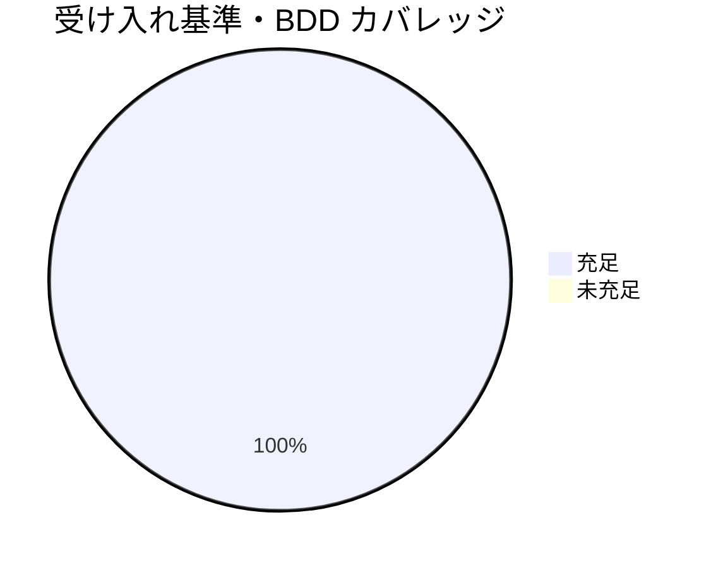

# レビュー書: 二観点 must-preserve のラウンド継承（親「コア取り込み漏れ補完」S4）

**プロジェクト名**: 二観点 must-preserve のラウンド継承（S4）
**作成日**: 2026 年 06 月 15 日
**最終更新**: 2026 年 06 月 15 日

> **用語**: [.agents/CONCEPTS.md §用語規約](../../../../../../../.agents/CONCEPTS.md#用語規約) を参照。
> **レビュー深度**: standard（中）。コア 2 ファイルへの節単位・加法的（13 行・削除 0）な直交追加。検証は [.agents/REVIEW_RULE.md](../../../../../../../.agents/REVIEW_RULE.md) に従い grep／git diff／リンク解決スクリプトで実測し、[.agents/REVIEW_DUAL_LENS.md](../../../../../../../.agents/REVIEW_DUAL_LENS.md) の二観点（敵対的＋肯定的＝must-preserve）を必須とする。本 issue 自体が must-preserve のラウンド継承を主題とするため、特に厳密に監査した。

---

## 1. レビュー概要

### 1.1 レビュー目的（必須）

実装内容の確認 / 品質保証 / クローズ前最終チェック。S4（must-preserve のラウンド継承＝退行防止側を、REVIEW_DUAL_LENS.md 新 §6 と CLOSEOUT.md §fresh サブ分割の 2 か所へ節単位で加法直交追加）が、**既存正本の意味・振る舞いを変えない（must-preserve）構造追加**として成立し、収束保証⇔退行防止の対が重複なくリンク整合しているかを、独立検証（grep 実測・git diff・リンク/アンカー解決）で確認する。

### 1.2 レビュー対象（必須）

- **実装範囲（変更 2 ファイル・追加のみ）**:
  - **変更**: `.agents/REVIEW_DUAL_LENS.md`（document_id: `c8b4e2a7-1f63-49d5-8e0a-3b9c7d260f54`）— 新 §6「反復ループへの must-preserve 継承（退行検知）」を §5 参照と §汎用/固有境界 の間に直交追加。§5 参照 末尾に CLOSEOUT §fresh サブ分割 への 1 行を加法追記。
  - **変更**: `.agents/CLOSEOUT.md`（document_id: `aefb0658-6114-4092-a3de-78a7f43ee0fe`）— §fresh サブ分割 に must-preserve 継承＋「収束保証⇔退行防止の対」を 2 行加法追加。
- **レビュー期間**: 2026-06-15 ～ 2026-06-15
- **レビュー担当者**: verify-and-close サブエージェント（generate-scenarios / map-coverage / review-code / review-architecture）。モデルティア: opus 相当（フレームワーク中核の監査）。

---

## 2. 実装内容の確認

### 2.1 実装完了タスク

| タスク名 | 実装内容 | 実装日 | 担当者 | ステータス |
| --- | --- | --- | --- | --- |
| T1 REVIEW_DUAL_LENS §6 追加 | 反復ループへの must-preserve 継承（退行検知）原則を新 §6 として直交追加。§5 参照に fresh サブ分割への 1 行追記 | 2026-06-15 | implement | 完了 |
| T2 CLOSEOUT §fresh サブ分割 継承物拡張 | 収束保証と対で must-preserve 継承（退行防止）を加法追加。退行検知原則本文は §6、定義は §3 証跡要求 へリンク委譲 | 2026-06-15 | implement | 完了 |
| T3 結合の明示・未解決リンク/二重記述ゼロ検証 | §6 ⇔ §fresh サブ分割 の相互リンク解決・正本各 1 か所を検証 | 2026-06-15 | implement | 完了 |

### 2.2 実装内容の詳細

#### タスク 1: REVIEW_DUAL_LENS.md 新 §6 の直交追加

- **実装内容**: 02 §2.2.1／03 §2.1 どおり、新 §6「反復ループへの must-preserve 継承（退行検知）」を §5 参照（41 行〜）と §汎用/固有境界（旧 50 行→新 61 行）の間に追加。(1) 指摘 0 まで反復する各ラウンド（深さ §4）へ §2.2/§3 の must-preserve リストを継承、(2) 各ラウンドで退行を確認し不確実なら §2.1 に従い要修正に倒す、(3) fresh 構成の継承物の扱いは CLOSEOUT §fresh サブ分割 へリンク委譲（定義・産物は §2.2/§3 の正本に従い再定義しない）。§5 参照 末尾に CLOSEOUT §fresh サブ分割 への 1 行を加法追記。
- **独立検証**:
  - `git diff --unified=3 .agents/REVIEW_DUAL_LENS.md` → 追加 11 行・削除 0 行。
  - 見出し HEAD vs 作業ツリー照合: `## 1 目的（churn/退行防止）`〜`## 5 参照`・`## 汎用/固有境界` の見出しテキストが**完全一致**（§1 目的 アンカー `#1-目的churn退行防止` 維持）。新 §6 が §5 と §汎用/固有境界 の間（51 行）に挿入されたのみ。
  - frontmatter `document_id: c8b4e2a7-...` 不変。
  - `grep -c '却下済み' .agents/REVIEW_DUAL_LENS.md` → **0 件**（収束保証文言を §6 に書いていない）。

#### タスク 2: CLOSEOUT.md §fresh サブ分割 の継承物拡張

- **実装内容**: 02 §2.2.2／03 §2.2 どおり、`test -f .agents/CLOSEOUT.md` で S5 完了（CLOSEOUT.md 実在）を確認のうえ、§fresh サブ分割 へ 2 行を加法追加。既存の収束保証文言（却下済み指摘＋理由）は**不改変**。追加分: 「収束保証に加えて must-preserve リストも後続サブへ継承」「収束保証（却下済み指摘＋理由）⇔ 退行防止（must-preserve）の対」を明記し、退行検知の原則本文は [REVIEW_DUAL_LENS.md §6](../../../../../../../.agents/REVIEW_DUAL_LENS.md#6-反復ループへの-must-preserve-継承退行検知)、must-preserve 定義は [§3 証跡要求](../../../../../../../.agents/REVIEW_DUAL_LENS.md#3-証跡要求) へリンク委譲（再記述なし）。
- **独立検証**:
  - `git diff --unified=0 .agents/CLOSEOUT.md` → 単一ハンク `@@ -33,0 +34,2 @@`（追加 2 行・削除 0）。**§fresh サブ分割 の 1 節内のみ**で、他節（commit ステップ／別セッション引継ぎ／clear 境界／verify-実経路検証／取りこぼし0と既出確認）に差分なし（共有ファイル衝突回避）。
  - 既存収束保証 bullet を HEAD と byte 照合 → **完全一致**（不改変）。
  - must-preserve 定義（契約・後方互換・既存テストの前提・利用者依存）の文言は CLOSEOUT に**非出現**（リンク委譲のみ＝二重定義なし）。

#### タスク 3: 結合の明示・未解決リンク/二重記述ゼロ

- **独立検証**:
  - リンク解決: REVIEW_DUAL_LENS.md・CLOSEOUT.md の全 `.md` リンクで未解決ファイル **0 件**。
  - アンカー解決: REVIEW_DUAL_LENS §6 見出し（`## 6 反復ループへの must-preserve 継承（退行検知）`）・§3 証跡要求 見出し・CLOSEOUT §fresh サブ分割 見出し すべて実在。スラッグ照合: CLOSEOUT→`#6-反復ループへの-must-preserve-継承退行検知`／`#3-証跡要求`、REVIEW_DUAL_LENS→`#fresh-サブ分割` いずれも見出しから生成されるスラッグと一致。
  - S5 共編集の非干渉: §5 参照の既存 4 行（`#verify-実経路検証` 行を含む）は HEAD と byte 一致。S4 は§5 へ別の 1 行を加法したのみで論理衝突なし（適用順非依存）。

---

## 3. テスト結果の確認（検証スクリプト・grep 実測）

文書構造への加法的追加のため、単体テストは 03 §2.x.4 の BDD 検証スクリプト（grep／test -f／git diff／リンク解決）で代替する（03 §単体テスト の規定どおり）。**実装サブの自己申告を鵜呑みにせず、本レビューで再実行・独立計測した。**

### 3.1 検証結果サマリ（必須: 数値で記載）

- **実行日**: 2026-06-15
- **T1 BDD（§6 退行検知原則が明文化）**: `grep 'ラウンド'` & `grep 'must-preserve'` ヒット（§6 内） → PASS
- **T1 BDD（既存不変・追加のみ）**: `git diff --unified=0` 削除行 = **0 件** → PASS
- **T1 BDD（収束保証非混入）**: `grep -c '却下済み' REVIEW_DUAL_LENS.md` = **0 件** → PASS
- **T1 回帰（§1〜§5・汎用/固有境界 見出し不変）**: HEAD vs 作業ツリーの見出し照合一致（§1 目的 アンカー維持） → PASS
- **T2 BDD（対で併記）**: CLOSEOUT §fresh サブ分割 に `must-preserve` と `却下済み` が併存 → PASS
- **T2 BDD（収束保証不変・他節非改変）**: 単一ハンク `@@ -33,0 +34,2 @@`・既存 bullet byte 一致 → PASS
- **T2 BDD（定義非重複）**: must-preserve 定義文言が CLOSEOUT 非出現（リンク委譲のみ） → PASS
- **T3 リンク健全性**: 変更 2 ファイルの `.md` リンク未解決 = **0 件**、新規 3 アンカー（§6・§3 証跡要求・fresh サブ分割）すべて解決 → PASS
- **失敗**: 0 / **スキップ**: 0

### 3.2 受け入れ基準カバレッジ（01 ↔ 実装）

| 01 ストーリー | 受け入れ基準 | 検証方法 | 結果 | evidence_source |
| --- | --- | --- | --- | --- |
| S1 ラウンド継承で退行検知 | コアに「各ラウンドへ継承し退行検知」原則が明文化／収束保証を改変せず対で追加 | §6 本文の grep・収束保証文言の git diff 不変確認 | 充足 | test_output |
| S2 fresh reviewer 継承物 | 継承物に must-preserve が含まれる／収束保証と対で重複なく記述 | CLOSEOUT §fresh サブ分割 の must-preserve＋却下済み併存・定義非出現 | 充足 | test_output |
| S3 二観点と反復ループの結合明示 | 結合がリンクで結ばれ二重記述が無い | §6⇔§fresh サブ分割 の相互リンク解決・正本各 1 か所 grep | 充足 | test_output |

---

## 4. コードレビュー

### 4.1 品質

- **構造（1 ファイル 1 責務）**: 退行検知**原則**＝REVIEW_DUAL_LENS §6（1 か所・新設）／must-preserve **定義**＝REVIEW_DUAL_LENS §2.2/§3（1 か所・既存）／fresh 構成の**継承物列挙**＝CLOSEOUT §fresh サブ分割（1 か所）／**収束保証**＝CLOSEOUT §fresh サブ分割（1 か所・既存）。退行検知本文の重複なし。
- **PF 中立性**: 追加行に具体ティア・CI コマンド・`.sh`・platform 固有値を含まない（grep で 0 件）。具体運用は §汎用/固有境界 経由で `.agents-project/` へ委譲済み。
- **参照健全性**: 追加リンク・アンカーすべて解決、未解決 0。

#### コードレビュー観点

| 観点 | 確認内容 | 結果 | コメント |
| --- | --- | --- | --- |
| 可読性 | 収束保証⇔退行防止が一対として読める | OK | CLOSEOUT §fresh サブ分割 に「対構造」1 文で明示 |
| 保守性 | 定義/原則/継承物の正本が各 1 か所・リンク委譲 | OK | 二重定義 0・委譲先実在 |
| 単一責務 | 退行検知本文は §6 のみ、CLOSEOUT は事実＋委譲のみ | OK | CLOSEOUT に原則本文・定義の再記述なし |
| 整合性 | §6⇔§fresh サブ分割 の相互リンク・§2.2/§3・§3 証跡要求 解決 | OK | 旧 anchor 破断なし |

### 4.2 指摘事項

二観点レビューを反復した結果、**敵対的観点・肯定的観点ともに承認阻却の指摘は 0 件**に収束した（反復 1 ラウンドで収束。差し戻し指摘の発生なし）。実装は 02/03 設計と完全一致し、既存正本の改変・二重定義・未解決リンクのいずれも検出されなかった。

#### 観察（指摘ではない・記録のみ）

- **CLOSEOUT §fresh サブ分割 内の「退行検知」語の出現**: 1 件（§35）あるが、これは「退行防止側の原則本文（ラウンド継承で退行検知）は §6 に…委譲する／退行検知の原則本文・定義は再記述しない」という**委譲を述べる参照文**であり、原則本文の二重記述ではない。1 ファイル 1 責務（退行検知本文＝§6 のみ）に違反しないことを査読で確認。

---

## 5. ドキュメントの確認

### 5.1 ドキュメント更新状況

| ドキュメント | 更新状況 | 確認者 | 確認日 |
| --- | --- | --- | --- |
| [`00_要求定義.md`](./00_要求定義.md) | 更新済み（要求確定） | verify | 2026-06-15 |
| [`01_要件定義.md`](./01_要件定義.md) | 更新済み（受け入れ基準・BDD） | verify | 2026-06-15 |
| [`02_設計.md`](./02_設計.md) | 更新済み（昇格先 2 か所確定・責務割当） | verify | 2026-06-15 |
| [`03_実装計画.md`](./03_実装計画.md) | 更新済み（タスク 1-3・BDD） | verify | 2026-06-15 |

### 5.2 ドキュメントの整合性

- **実装と設計の整合性**: 整合。02 §2.2.3 の帰属確定（退行防止原則＝REVIEW_DUAL_LENS §6／継承物追加＝CLOSEOUT §fresh サブ分割）どおり。S5 完了済みのため委譲先は CLOSEOUT.md に確定（implement-feature.md 暫定先は不使用）。
- **要件と実装の整合性**: 整合。00/01 の成功基準（退行検知原則のコア明文化・収束保証と対で重複なし・結合の明示リンク）をすべて満たす。

## docs 更新

- 要否: **不要**
- 対象: なし
- 理由: 本 S4 はコア（`.agents/`）のプロセス規約への加法追加であり、消費者向けシステム仕様（`docs/` の機能/データ/画面/API）に影響しない。

---

## 9. 設計・境界の確認（review-architecture）

### 9.1 設計の確認

- **設計原則の準拠**: 単一責務・正本 1 か所・重複禁止・PF 中立性・リンク委譲・直交追加（既存節不改変）すべて遵守。新 §6 は §汎用/固有境界 の前という二観点正本内の論理位置に配置され、§1〜§5 の番号・アンカーを乱さない。
- **命名規則**: 既存 §番号体系（`## N 見出し`）に整合（`## 6 反復ループへの must-preserve 継承（退行検知）`）。

### 9.2 境界・依存の確認

- **責務の境界**: 「プロセスの場」（反復ループ＝REVIEW_DUAL_LENS §6／fresh 構成＝CLOSEOUT §fresh サブ分割）と「継承される不変条件リストの定義」（REVIEW_DUAL_LENS §2.2/§3）を分離。原則本文の重複埋め込みなし。
- **依存関係**: REVIEW_DUAL_LENS §6 →（委譲）→ CLOSEOUT §fresh サブ分割／CLOSEOUT §fresh サブ分割 →（委譲）→ REVIEW_DUAL_LENS §6・§3 証跡要求。相互参照だが各正本は 1 か所で、原則・定義を双方に重複させないため**循環的重複なし**（参照の双方向リンクのみ）。
- **指摘・推奨**: なし。

### 9.3 重要判断の根拠（evidence_source）

| 判断内容 | evidence_source | 備考 |
| --- | --- | --- |
| 追加のみ・既存不変（削除 0） | test_output | `git diff --unified=0` 削除行 0 |
| §1〜§5・汎用/固有境界 見出し不変（§1 目的 アンカー維持） | test_output | HEAD vs 作業ツリー見出し照合一致 |
| 収束保証文言の非混入（REVIEW_DUAL_LENS） | test_output | `grep -c '却下済み'` = 0 |
| 収束保証 bullet 不改変（CLOSEOUT） | existing_code | HEAD と byte 一致・単一ハンク `@@ -33,0 +34,2 @@` |
| 退行検知本文・定義の二重記述なし | existing_code | must-preserve 定義文言が CLOSEOUT 非出現・退行検知本文は §6 のみ |
| 委譲リンク/アンカー全解決 | test_output | `.md` リンク未解決 0・§6/§3 証跡要求/fresh サブ分割 アンカー実在 |
| PF 中立 | test_output | 追加行に tier/CI/`.sh` 等 0 件 |

> 重要判断はいずれも grep 実測・git diff・見出し実在/byte 照合の**外部根拠**に基づく。inference_only のみに依存する重要判断はない。

---

## 二観点レビュー（REVIEW_DUAL_LENS）

> 本 issue は must-preserve のラウンド継承を主題とするため、両リストを特に厳密に記載する（audit#27）。

### 敵対的観点リスト（壊しにいく視点・結論）

1. **既存節の破壊**: §6 挿入で §1〜§5 や §汎用/固有境界 が改変/移動して番号・アンカーが壊れないか → HEAD 照合で見出し完全一致・削除 0、§6 が間に挿入されたのみ。破壊なし。
2. **§1 目的 アンカー破断**: 二観点目的（churn/退行防止）への inbound 参照が宙に浮かないか → 見出し `## 1 目的（churn/退行防止）` 不変、CLOSEOUT:59 の `#1-目的churn退行防止` 参照が解決。
3. **収束保証の混入（責務逸脱）**: §6 に却下済み指摘＋理由を書いて収束保証と退行防止を混ぜていないか → `grep -c '却下済み'` = 0。混入なし。
4. **退行検知本文の二重記述**: CLOSEOUT に退行検知の原則本文/定義を再記述して二重正本化していないか → CLOSEOUT は「事実＋委譲」のみ、原則本文は §6・定義は §2.2/§3 へリンク委譲。二重記述なし。
5. **アンカー切れ（新リンク）**: §6→`#fresh-サブ分割`、CLOSEOUT→`#6-反復ループ…退行検知`/`#3-証跡要求` が実在見出しに解決するか → 3 アンカーすべて実在見出しと一致。
6. **共有ファイル衝突（CLOSEOUT/§5）**: S1/S2/S5 と CLOSEOUT・§5 を共有するが他節/既存行を壊さないか → CLOSEOUT は単一ハンクで §fresh サブ分割 1 節内のみ、REVIEW_DUAL_LENS §5 は既存 4 行 byte 一致＋1 行加法。論理衝突なし。
7. **PF 固有値の混入**: 追加にティア/CI 固有値が混じり中立性を破っていないか → grep 0 件。中立維持。
8. **document_id 改変**: 両ファイルの frontmatter document_id を改変していないか → 両 id 不変（diff に frontmatter 行なし）。

### must-preserve リスト（壊してはいけない不変項目・保持確認）

1. **既存の収束保証**（fresh サブ分割で却下済み指摘＋理由を継承し蒸し返し・無限反復を防ぐ） — CLOSEOUT で文言 byte 不変、対の片側として維持。
2. **二観点の必須化・両リスト証跡要求**（REVIEW_DUAL_LENS §2/§3） — 改変なし、§6 はそれを参照する直交追加。
3. **§1〜§5・§汎用/固有境界 の見出し・番号・アンカー**（特に §1 目的 churn/退行防止 へのinbound 参照） — 全件不変。
4. **must-preserve 定義の単一正本**（§2.2/§3 のみ） — CLOSEOUT/§6 は再定義せず委譲、単一性維持。
5. **frontmatter document_id**（両ファイル） — 不変。
6. **CLOSEOUT 他節の規約**（commit/別セッション引継ぎ/clear 境界/verify-実経路検証/取りこぼし0） — 差分なし、判定条件不変。
7. **本リポ追跡物の非破壊**（`.agents/`・`.claude/`・`.workflow/`・workflow.db） — 破壊的検証なし、編集はコミット対象 2 ファイル＋04_review のみ。

#### must-preserve ラウンド継承（本 issue 主題の自己適用・後続サブへの継承物）

本レビューが同定した上記 must-preserve リストは、fresh サブ／後続ラウンドへ継承すべき不変条件である。**却下指摘は 0 件**（収束保証として継承する却下理由なし）。退行防止側の継承物＝上記 must-preserve 7 項目を、もし本主題で再 fresh 化する場合に引き継ぐ。

---

## 12. レビュー結果

### 12.1 総合評価

- **実装品質**: 良好（削除 0・既存見出し不変・収束保証非混入・二重記述 0・追加 13 行のみ）。
- **テスト品質**: 良好（T1/T2/T3 の BDD 検証スクリプトを独立再実行し全 PASS・FAIL 0）。
- **ドキュメント品質**: 良好（00〜03 と実装が整合・本 04 に独立検証結果を記録）。
- **総合評価**: **合格（PASS / 承認）**。00/01 成功基準（退行検知原則のコア明文化・収束保証と対で重複なし・結合の明示リンク・PF 中立・1 ファイル 1 責務）すべて充足。

### 12.2 承認状況

- **レビュー承認者**: verify-and-close サブエージェント（opus 相当）
- **承認日**: 2026-06-15
- **承認コメント**: 二観点レビューで指摘 0 件に収束（反復 1 ラウンド・却下指摘 0）。実装サブ自己申告を独立検証し、既存節不改変・§6/§fresh/§1 目的 アンカー解決・PF 中立・退行検知本文の重複なしをすべて grep/git diff で実測確認。承認しクローズアウト（コミット）へ進む。**本 S4 はサブ issue のため、親 issue 全体完了時まで close 移動はしない。**

---

## 13. 参考資料

- [`00_要求定義.md`](./00_要求定義.md) / [`01_要件定義.md`](./01_要件定義.md) / [`02_設計.md`](./02_設計.md) / [`03_実装計画.md`](./03_実装計画.md)
- 昇格対象: [.agents/REVIEW_DUAL_LENS.md](../../../../../../../.agents/REVIEW_DUAL_LENS.md) / [.agents/CLOSEOUT.md](../../../../../../../.agents/CLOSEOUT.md)
- [.agents/REVIEW_RULE.md](../../../../../../../.agents/REVIEW_RULE.md) / [.agents/REVIEW_DUAL_LENS.md](../../../../../../../.agents/REVIEW_DUAL_LENS.md)

---

## 14. 前のステップ

- **前**: [`03_実装計画.md`](./03_実装計画.md) - 実装計画フェーズ

---

## 15. 次のステップ

- 外部設定不要のため最終確認チェックリストはスキップ。**本 S4 はサブ issue**であり、新規サブ issue の追加作成はなし（親 90_issues.md の編集不要）。承認後、S4 成果物を 1 論理コミットでクローズアウトする（push しない）。親「コア取り込み漏れ補完」の全サブ完了時に親 issue の close 移動を別途行う。
