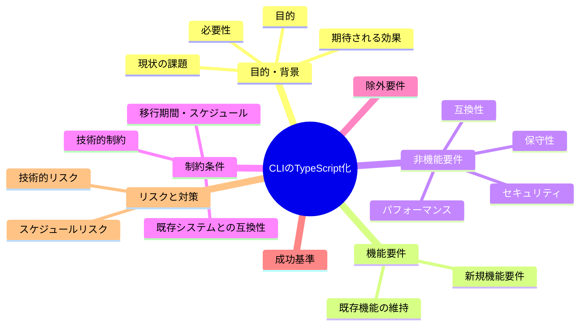
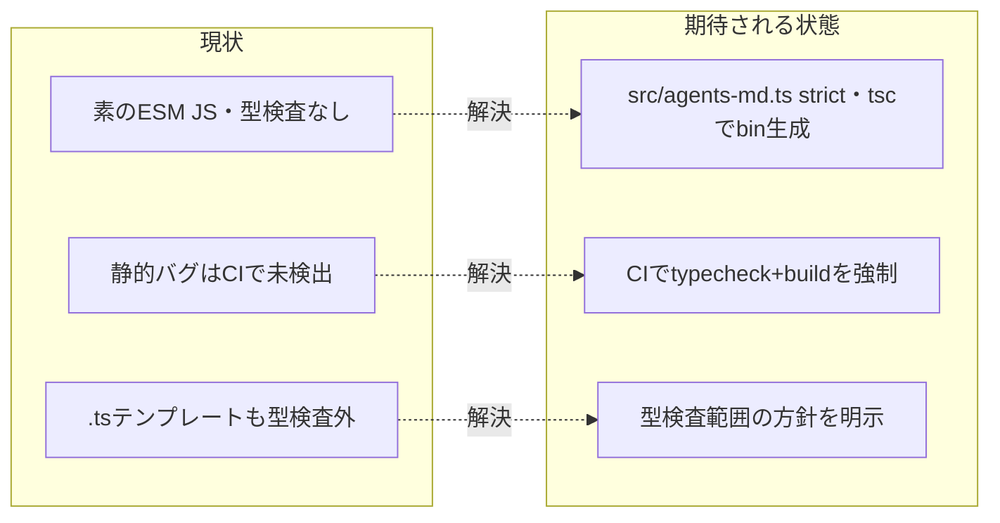

# 要求定義書: CLI（bin/agents-md.js）の TypeScript 化と型チェックの CI 配線

**プロジェクト名**: CLI の TypeScript 化と型チェックの CI 配線
**作成日**: 2026 年 06 月 15 日
**最終更新**: 2026 年 06 月 15 日

> **重要**:
>
> - 要求定義書は、プロジェクトの全体像を把握するためのものです。詳細な技術仕様や実装方法は要件定義書以降で記載します。必要最低限の情報に収めることを心掛けてください。
> - **このドキュメントは常に更新**: 要求の変更や追加があった場合は、即座にこのドキュメントを更新してください。ドキュメントは「生きているドキュメント」として扱い、実装内容と常に同期させます。
> - **必須項目**: 以下の「必須」と明記した項目は空欄・抽象語のみで提出しないこと。判定可能な形で記入すること。
>
> **用語**: [.agents/CONCEPTS.md §用語規約](../../../../../.agents/CONCEPTS.md#用語規約) を参照。

---

## 要求定義の全体像

**注意**:

- マインドマップは全体像を把握するためのものです。主要なセクション名程度に留め、詳細は記載しないでください。

---

## 1. 目的・背景

### 1.1 目的（必須）

CLI を TypeScript(strict) 化し型チェックを CI で fail させ静的バグを防ぐ。

### 1.2 背景

- **現状の課題**:
  - `bin/agents-md.js`（643 行）は素の ESM JavaScript で、型チェックの仕組みが皆無である（`tsconfig`/`jsconfig`/ESLint なし・`devDependencies` なし）。
  - そのため、タイポ・未定義参照・引数型の誤り・戻り値の取り違え等の静的バグを、コミット・配布前に検出できない。
  - テストは bash 結合テスト（`e2e-install-uninstall.sh` 等）主体で、CLI の外形挙動は検証されるが、**静的型エラーは捕捉対象外**である。
  - 既存の唯一の `.ts`（`.workflow/templates/github/scripts/audit-table.ts`）も型検査の対象外で、型安全性の網がリポジトリ全体で欠落している。

- **必要性**:
  - CLI は `init`/`uninstall`/`enforce`/`doctor` 等、採用先プロジェクトのファイルを配備・除去・改変する責務を持ち、型起因のバグが**利用者の資産破壊・配備失敗**に直結しうるため、静的な安全網が必要。
  - npm 配布パッケージとして、コンパイル・型検査を CI で強制し、回帰を機械的に防ぐ運用が必要。

- **確定済み方針（ユーザー選択）**: **TypeScript 完全移行（ビルド有り）**。`src/agents-md.ts` を正本とし、`tsc` でコンパイルして配布用 `bin/agents-md.js` を生成する。配布物にはコンパイル済み JS を同梱する。CI で `tsc` build＋typecheck を行い、`prepublishOnly`（または `prepack`）でビルドする。`typescript` を `devDependency` に追加する。

### 1.3 期待される効果（必須: 1 件以上）

- **効果 1**: タイポ・未定義参照・引数型誤り等の静的バグが `tsc --noEmit`（typecheck）で検出可能になる（型エラーがあれば CI が×になる、で判定可能）。
- **効果 2**: `npm test`/CI に typecheck と build が組み込まれ、型エラーや未ビルドの混入を機械的に阻止できる（型エラー注入時に CI が fail する、で判定可能）。
- **効果 3**: 移行後も配布物（`npm pack`）に生成済み `bin/agents-md.js` が含まれ、ソース/開発専用物のリークが無い（`npm pack --dry-run` で必須物あり・禁止物なし、で判定可能）。
- **効果 4**: E2E（install/uninstall）が移行後も全 PASS し、現行と挙動同一であることが担保される（`e2e-install-uninstall.sh` の FAIL=0、で判定可能）。

**現状と期待される状態の比較**:

---

## 2. 機能要件

### 2.1 既存機能の維持（該当する場合）

CLI の全サブコマンドの外形挙動を**現行と同一**に維持する。維持対象（機能一覧）:

- `init` / `upgrade`（`setup.sh` の実行）
- `uninstall`（配備物のみ除去・`--yes`/`--purge`・dry-run・安全策）
- `enforce on|off|status`（settings.json への配線着脱・ユーザー値非破壊・.bak 退避）
- `doctor`（前提・配備の健全性確認）
- `version` / `help`（既定）
- shebang（`#!/usr/bin/env node`）・実行権限・ESM 形式（`type: module`）の維持。

### 2.2 新規機能要件

- `src/agents-md.ts` を CLI ロジックの正本とし、TypeScript(strict) で型安全化する。
- `tsc` ビルドにより、現行と挙動同一の `bin/agents-md.js`（shebang・実行権限・ESM）を生成する。
- `npm` スクリプトに typecheck（`tsc --noEmit` 相当）と build を追加し、`npm test`/CI へ組み込む。
- `prepublishOnly`（または `prepack`）でビルドを実行し、配布物に生成済み bin が含まれるようにする。
- `typescript` を `devDependencies` に追加し、`tsconfig.json` を整備する。

---

## 3. 非機能要件

### 3.1 パフォーマンス

- ビルド・typecheck は開発・CI 時のローカル処理であり、CLI 実行時のランタイム性能には影響しない。CI 全体の所要時間増は許容範囲（数十秒オーダー）に収める。

### 3.2 セキュリティ

- 追加する依存は `typescript`（および必要なら `@types/node`）のビルド専用 devDependency に限定し、ランタイム依存を増やさない（CLI は引き続き Node 標準モジュールのみで動作する）。
- 配布物に開発専用物（`src/`・`tsconfig.json`・`node_modules` 等）がリークしないこと。

### 3.3 互換性

- Node `>=20`（`package.json` engines）と整合する `tsconfig` の `target`/`module`（ESM）設定とする。
- 生成 `bin/agents-md.js` は現行と同じ ESM・shebang・実行権限を保ち、`npx @techbeansjp-free/agents-md` 経由の起動互換を維持する。

### 3.4 保守性

- ロジックの正本を `src/agents-md.ts` の 1 か所に集約し、`bin/agents-md.js` は生成物として扱う（手編集しない旨を明示）。
- 既存の UNIX 哲学・単一責務・AI フレンドリー設計（小さなファイル・明確な責務）に沿う。CLI が「setup.sh を呼ぶ薄いラッパ」である責務は維持する。

---

## 4. 制約条件

### 4.1 技術的制約

- `tsc` によるビルドを採用する（ユーザー選択により確定。トランスパイラ選定の再検討は行わない）。
- ESM を維持する（`type: module`）。CommonJS への変更は行わない。
- 追加依存はビルド専用に限定する。

### 4.2 既存システムとの互換性

- 既存 CI（`self-enforce.yml`）の各検査（shell 構文・schema・差分ゼロ・npm pack リーク・version 同期・E2E・coverage・audit）を壊さないこと。特に **#3 生成物差分ゼロ検証**と **#4 npm pack リーク検査**に整合させる（`bin/agents-md.js` を追跡物とするか生成物（gitignore）とするかの方針が両検査に影響するため、要件で確定する）。
- `.gitignore` の方針（`node_modules`・ビルド成果物の扱い）と `files`（配布対象）を整合させる。
- lockfile 方針（`package-lock.json` の追加可否）と `engines` 整合を確定する。

### 4.3 移行期間・スケジュール

- 段階移行ではなく一括移行（`src/agents-md.ts` を正本化し `bin/` を生成物に切替）を 1 issue 内で完結させる。挙動同一を E2E で担保した上で切り替える。

---

## 5. 除外要件

- CLI の機能追加・サブコマンド仕様の変更（本 issue は型安全化と挙動同一の移行のみ。機能変更は対象外）。
- `setup.sh` 等の bash スクリプト群の TypeScript 化（CLI 配下の `.js` のみ対象）。
- ESLint/Prettier 等のリンタ・整形ツールの導入（型チェックが主目的。必要なら別 issue）。
- `.workflow/templates/github/scripts/audit-table.ts` の型検査を**本 issue に含めるかは論点**として 01 で扱い、推奨を示す（本 issue では「別 issue 推奨」を既定とする。理由は §7・01 参照）。

---

## 6. 成功基準（必須: 1 件以上）

- **SC-1**: CLI ロジックが `src/agents-md.ts`（strict）で型安全化され、`tsc` build で生成した `bin/agents-md.js` が shebang・実行権限・ESM を保つ（○/×）。
- **SC-2**: `npm run typecheck`（`tsc --noEmit` 相当）が PASS し、意図的に型エラーを注入すると fail する（○/×）。
- **SC-3**: `npm test`/CI に typecheck と build が組み込まれ、型エラーで CI が×になる（○/×）。
- **SC-4**: `npm pack --dry-run`（`verify-npm-pack.sh`）が合格し、配布物に生成済み `bin/agents-md.js` が含まれ、`src/`・`tsconfig.json` 等の開発専用物がリークしない（○/×）。
- **SC-5**: `e2e-install-uninstall.sh` の全シナリオが PASS（FAIL=0）で、移行前後で挙動同一（○/×）。
- **SC-6**: CI（`self-enforce.yml`）の **#3 生成物差分ゼロ**と既存全 step が green を維持する（○/×）。
- **SC-7**: `audit-table.ts` の型検査について、本 issue 範囲とするか別 issue かの推奨が 01 に明記される（○/×）。

---

## 7. リスクと対策

### 7.1 技術的リスク

- **リスク**: ビルド成果物 `bin/agents-md.js` を Git 追跡し続けると、CI #3「生成物差分ゼロ検証」と衝突しうる（ローカル build と commit のズレで差分が出て CI が赤くなる）。
  - **対策**: 02/03 で「bin を追跡物にする（コミット時 build を強制 or CI で build→差分ゼロ確認）」か「bin を gitignore して配布前 build（prepublishOnly/prepack）で同梱」かを設計判断する。`files` と `.gitignore` と CI 検査を 1 つの方針で整合させる。E2E は **clean clone（`git archive HEAD`）から `node bin/agents-md.js` を直接実行**するため、bin を gitignore する場合は E2E 前に build が要る点を考慮する。
- **リスク**: ESM・Node20 ターゲットの `tsc` 設定不備で、生成 JS が `import.meta.url`/`fileURLToPath` 等を壊し、CLI が起動しない。
  - **対策**: `tsconfig` を `module`/`moduleResolution`/`target` を ESM・Node20 互換に設定し、E2E（実 install）で起動を検証する。

### 7.2 スケジュールリスク

- **リスク**: 一括移行のため、挙動差分の混入に気づかず配布してしまう。
  - **対策**: 既存 E2E（14 シナリオ）を移行の受け入れ網として再利用し、移行後に全 PASS を確認してから切り替える。CI #3/#4/#6 を gate にする。

---

## 8. 参考資料

### プロジェクトドキュメント

- [`01_要件定義.md`](./01_要件定義.md) - 本 issue の要件定義
- [.agents/spec/01_設計原則.md](../../../../../.agents/spec/01_設計原則.md) - UNIX 哲学・単一責務・AI フレンドリー設計
- [.agents/spec/06_設計判断の優先順位.md](../../../../../.agents/spec/06_設計判断の優先順位.md) - 可読性・単一責務優先

### その他の参考資料

- `bin/agents-md.js`（643 行・移行対象の正本ロジック）
- `package.json`（`bin`/`files`/`engines`/`scripts`/`type: module`）
- `.github/workflows/self-enforce.yml`（CI 検査群。#3 差分ゼロ・#4 pack リーク・#6 E2E）
- `.gitignore`（生成物・ランタイムの無視方針）
- `.agents/scripts/test/run-all.sh`, `.agents/scripts/test/e2e-install-uninstall.sh`（移行の受け入れ網）
- `.agents/scripts/verify-npm-pack.sh`（配布物リーク検査）
- `.workflow/templates/github/scripts/audit-table.ts`（リポ内唯一の既存 `.ts`・現状型検査外）

---

## 9. 次のステップ

この要求定義書の承認後、以下のドキュメントを作成します：

- **次**: [`01_要件定義.md`](./01_要件定義.md) - 要件定義フェーズ
