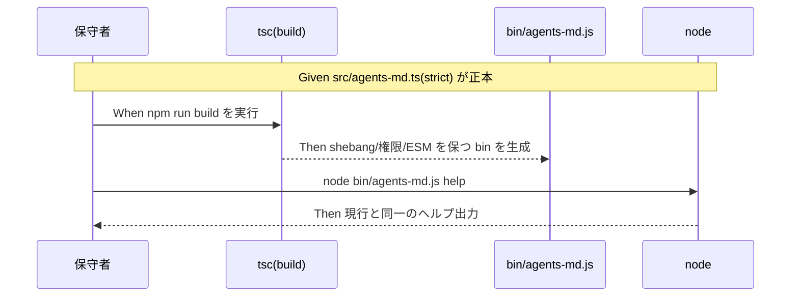
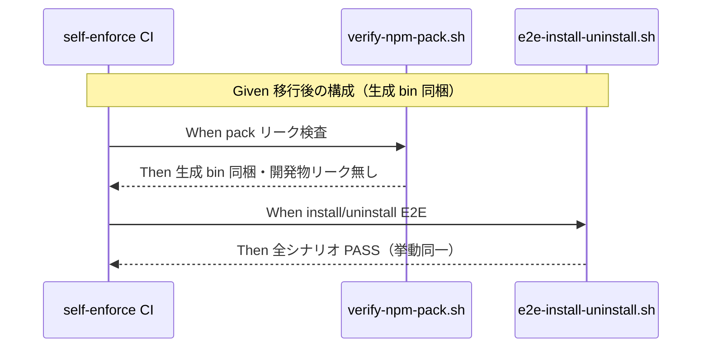

# 要件定義書: CLI（bin/agents-md.js）の TypeScript 化と型チェックの CI 配線

**プロジェクト名**: CLI の TypeScript 化と型チェックの CI 配線
**作成日**: 2026 年 06 月 15 日
**最終更新**: 2026 年 06 月 15 日

> **重要**: **このドキュメントは常に更新**: 要件の変更や追加があった場合は、即座にこのドキュメントを更新してください。ドキュメントは「生きているドキュメント」として扱い、実装内容と常に同期させます。
>
> **用語**: [.agents/CONCEPTS.md §用語規約](../../../../../.agents/CONCEPTS.md#用語規約) を参照。

---

## 1. 概要

### 1.1 システム概要

本パッケージ `@techbeansjp-free/agents-md` の npm 配布用 CLI（現 `bin/agents-md.js`）を、TypeScript(strict) で書いた `src/agents-md.ts` を正本とし、`tsc` でコンパイルして配布用 `bin/agents-md.js` を生成する構成へ一括移行する。CLI は「採用先プロジェクトへ `.agents/` 等を配備・除去・enforcement 配線する薄いラッパ」という責務を維持したまま、静的型検査の網をかける。typecheck（`tsc --noEmit` 相当）と build を `npm` スクリプトと CI（`self-enforce.yml`）に組み込み、型エラーで fail させる。配布物には生成済み JS を同梱し、開発専用物（`src/`・`tsconfig.json`・`node_modules`）はリークさせない。

### 1.2 用語集

| 用語 | 説明 |
| -------- | ------ |
| CLI | `bin/agents-md.js`。`init`/`upgrade`/`uninstall`/`enforce`/`doctor`/`version`/`help` を提供する配備 CLI。 |
| 正本ソース | `src/agents-md.ts`。移行後の CLI ロジックの単一正本（TypeScript・strict）。 |
| 生成 bin | `tsc` build で `src/agents-md.ts` から生成される `bin/agents-md.js`。配布物・実行エントリ。 |
| typecheck | `tsc --noEmit` 相当の型検査。型エラーがあれば非ゼロ終了し CI/test を fail させる。 |
| build | `tsc` による `src/` → `bin/` のコンパイル（shebang・実行権限・ESM を保つ）。 |
| 差分ゼロ検証 | CI #3。build 実行後、追跡ファイルに差分が出ないことの検証。bin の追跡方針に影響。 |
| pack リーク検査 | `verify-npm-pack.sh`（CI #4）。配布 tarball に禁止物が無く必須物がある検査。 |
| E2E | `e2e-install-uninstall.sh`。clean clone から実 install/uninstall を検証する受け入れ網。 |

---

## 2. 機能要件

### 2.1 ユーザーストーリー

#### ストーリー 1: CLI ロジックの型安全化

- **As a** パッケージ保守者
- **I want to** CLI ロジックを `src/agents-md.ts`（strict）で型安全に書き、`tsc` で現行と挙動同一の `bin/agents-md.js` を生成したい
- **So that** タイポ・未定義参照・引数型誤り等の静的バグをコンパイル時に検出でき、配備処理の事故を未然に防げる

**受け入れ基準**:

- `src/agents-md.ts` が CLI ロジックの正本であり、`tsconfig.json` の `strict: true` で型検査される。
- `tsc` build で生成される `bin/agents-md.js` は shebang（`#!/usr/bin/env node`）・実行権限・ESM 形式を保つ。
- 生成 bin を `node bin/agents-md.js help` 等で起動でき、全サブコマンドの外形挙動が現行と同一。

#### ストーリー 2: typecheck と build の CI/test 組み込み

- **As a** パッケージ保守者
- **I want to** `npm test`/CI に typecheck と build を組み込み、型エラーで fail させたい
- **So that** 型エラーや未ビルドの混入を機械的に阻止でき、配布前に必ず型検査が通ることを保証できる

**受け入れ基準**:

- `npm run typecheck`（`tsc --noEmit` 相当）と `npm run build`（または同等スクリプト）が `package.json` に定義される。
- `npm test`（`run-all.sh` 経路）か CI（`self-enforce.yml`）のいずれかで typecheck と build が実行される。
- 意図的に型エラーを注入すると CI/test が fail し、修正すると green に戻る。

#### ストーリー 3: 配布物の健全性（生成 bin 同梱・開発物リーク無し）

- **As a** パッケージ利用者
- **I want to** `npx @techbeansjp-free/agents-md` で従来どおり CLI を実行したい（ソースや開発専用物を受け取らずに）
- **So that** 余分な開発物なしで CLI が動き、`init`/`uninstall` 等が現行どおり機能する

**受け入れ基準**:

- `npm pack --dry-run`（`verify-npm-pack.sh`）が合格し、配布物に生成済み `bin/agents-md.js` が含まれる。
- 配布物に `src/`・`tsconfig.json`・`node_modules` 等の開発専用物が含まれない（リーク無し）。
- `prepublishOnly`（または `prepack`）で publish 前に build が走り、未ビルド配布が起きない。`npm publish --dry-run` が健全。

#### ストーリー 4: 既存 CI・E2E との整合（挙動同一の担保）

- **As a** パッケージ保守者
- **I want to** 移行後も既存 CI 検査と E2E が全て green を維持したい
- **So that** 移行が現行と挙動同一であることを機械的に担保でき、回帰なく切り替えられる

**受け入れ基準**:

- `e2e-install-uninstall.sh` の全シナリオが PASS（FAIL=0）。
- CI #3「生成物差分ゼロ検証」が green を維持する（bin の追跡方針と build タイミングが #3 と矛盾しない）。
- CI #4 pack リーク・#5 version 同期・#6 E2E・#6.5 coverage の各 step が green を維持する。
- `node_modules`/ビルド成果物の `.gitignore`、lockfile 方針、`engines`（`>=20`）が整合する。

#### ストーリー 5: 既存 .ts テンプレートの型検査範囲の明示

- **As a** パッケージ保守者
- **I want to** リポ内唯一の既存 `.ts`（`audit-table.ts`）の型検査を本 issue 範囲に含めるか別 issue かを明確にしたい
- **So that** 型安全網の対象境界が曖昧にならず、スコープが膨張しない

**受け入れ基準**:

- 本 issue は CLI（`src/agents-md.ts`）の型検査を範囲とし、`audit-table.ts` の型検査の扱い（本 issue/別 issue）の**推奨**が明記される。
- 推奨は **別 issue** とする（§2.3 ビジネスルール・本ストーリーの理由参照）。本 issue の `tsconfig` は CLI ソースを対象とし、テンプレート `.ts` を巻き込まない構成とする。

### 2.2 BDD ユースケース

#### ユースケース 1: CLI を TypeScript からビルドして実行する

CLI ロジックを `src/agents-md.ts` に置き、`tsc` で `bin/agents-md.js` を生成し、生成物を Node で実行する。

**シナリオ 1: build が現行と挙動同一の bin を生成する**

```gherkin
Feature: CLI の TypeScript ビルド
  Scenario: tsc build で実行可能な bin を生成する
    Given src/agents-md.ts（strict）が CLI ロジックの正本である
    When npm run build（tsc）を実行する
    Then bin/agents-md.js が生成され shebang・実行権限・ESM を保つ
    And node bin/agents-md.js help が現行と同じヘルプを出力する
```

**処理フロー**:



**シナリオ 2: 型エラーがあると typecheck/CI が fail する**

```gherkin
Feature: CLI の TypeScript ビルド
  Scenario: 型エラーで CI を fail させる
    Given src/agents-md.ts に意図的な型エラーを注入した
    When npm run typecheck（tsc --noEmit 相当）または CI を実行する
    Then 非ゼロ終了し CI/test が fail する
    And 型エラーを修正すると green に戻る
```

#### ユースケース 2: 配布と E2E の健全性を検証する

移行後の配布物・install/uninstall・既存 CI 検査が現行と同等に健全であることを検証する。

**シナリオ 1: 配布物に生成 bin が含まれ開発物が漏れない**

```gherkin
Feature: 配布物の健全性
  Scenario: npm pack に生成 bin が含まれ src がリークしない
    Given prepublishOnly/prepack で build される構成である
    When npm pack --dry-run（verify-npm-pack.sh）を実行する
    Then 配布物に bin/agents-md.js が含まれる
    And src/・tsconfig.json・node_modules がリークしない
```

**シナリオ 2: E2E が移行後も全 PASS する（挙動同一）**

```gherkin
Feature: 配布物の健全性
  Scenario: install/uninstall E2E が全 PASS する
    Given クリーン clone（git archive HEAD）から bin/agents-md.js が実行可能である
    When e2e-install-uninstall.sh を実行する
    Then 全シナリオが PASS（FAIL=0）する
    And CI #3 生成物差分ゼロ検証が green を維持する
```

**処理フロー**:



### 2.3 ビジネスルール

- ロジックの正本は `src/agents-md.ts` 1 か所のみとし、`bin/agents-md.js` は生成物として扱う（手編集禁止を明示する）。
- ESM を維持する（`type: module`）。CommonJS へは変更しない。
- 追加依存はビルド専用 devDependency（`typescript`、必要に応じ `@types/node`）に限定し、CLI のランタイム依存（Node 標準モジュールのみ）を増やさない。
- `tsconfig` の対象は CLI ソース（`src/`）に限定し、`.workflow/templates/github/scripts/audit-table.ts` を巻き込まない。
- **audit-table.ts の型検査は別 issue 推奨**。理由: (1) `audit-table.ts` は CLI ではなく**採用先 CI 用テンプレート**で実行系統（`npx tsx`・GitHub Actions）が異なり責務が別、(2) 巻き込むと本 issue の `tsconfig`/CI が CLI 以外の関心を抱えスコープが膨張、(3) 単一責務（本 issue は CLI 型安全化に集中）を保つため。CLI の `tsconfig` 確立後に同型の枠組みを横展開する別 issue とするのが拡張容易。
- bin の Git 追跡方針（追跡物 or gitignore + 配布前 build）は CI #3「生成物差分ゼロ検証」と `files`・`.gitignore` を 1 つの方針で整合させる（設計フェーズで確定。02 で判断）。

---

## 3. 非機能要件

### 3.1 パフォーマンス要件

- typecheck/build は開発・CI 時処理で、CLI 実行時ランタイム性能に影響しない。
- CI 全体の所要時間増は数十秒オーダーに収め、既存 step を著しく遅延させない。

### 3.2 セキュリティ要件

- 追加依存はビルド専用 devDependency に限定し、ランタイム依存・攻撃面を増やさない。
- 配布物に開発専用物（`src/`・`tsconfig.json`・`node_modules`・lockfile）がリークしない（`verify-npm-pack.sh` の禁止パターンと整合）。

### 3.3 ユーザビリティ要件

- 利用者の CLI 体験（`npx @techbeansjp-free/agents-md <command>` の出力・終了コード）は現行と同一を保つ。
- 保守者が `npm run build`/`npm run typecheck`/`npm test` で一貫して開発できる。

### 3.4 可用性要件

- 生成 bin は Node `>=20` で起動可能（`import.meta.url`/`fileURLToPath` 等が ESM・Node20 ターゲットで壊れない）。
- `prepublishOnly`/`prepack` により、未ビルド配布（壊れた bin の publish）が起きない。

---

## 4. 外部インターフェース要件

### 4.1 API 要件

- CLI のサブコマンド I/F（`init [dir]`/`upgrade [dir]`/`uninstall [dir] [--yes|-y] [--purge]`/`enforce <on|off|status> [dir]`/`doctor`/`version`/`help`）と終了コードは現行と同一を維持する。
- `package.json` の `bin`（`agents-md` → `bin/agents-md.js`）エントリは不変。
- `npm` スクリプト I/F: `build`（tsc）・`typecheck`（tsc --noEmit 相当）・`prepublishOnly`/`prepack`（build）を追加。`test` は typecheck/build を含む経路にする（または CI で別途実行）。

### 4.2 データ形式要件

- 生成 `bin/agents-md.js` は ESM・shebang 付き・実行権限ありの JavaScript。
- `tsconfig.json`（ESM・Node20 互換: `module`/`moduleResolution`/`target` を適切設定）。
- `settings.json`/`workflow.db` 等、CLI が扱う既存データ形式は不変。

---

## 5. 制約事項

- `tsc` ビルド・TypeScript 完全移行（ビルド有り）をユーザー選択として確定（再選定しない）。
- ESM 維持（CommonJS 化しない）。
- 一括移行を 1 issue で完結（段階移行しない）。挙動同一を E2E で担保のうえ切替。
- 既存 CI（`self-enforce.yml`）の全 step・既存 E2E（14 シナリオ）を壊さない。特に #3 差分ゼロ・#4 pack リークと整合させる。
- 対象外: CLI 機能変更、bash スクリプトの TS 化、ESLint/Prettier 導入、`audit-table.ts` の型検査（別 issue 推奨）。

---

## 6. 参考資料

### プロジェクトドキュメント

- [`00_要求定義.md`](./00_要求定義.md) - 要求定義

### その他の参考資料

- `bin/agents-md.js`（643 行・移行対象の正本ロジック）
- `package.json`（`bin`/`files`/`engines`/`scripts`/`type: module`）
- `.github/workflows/self-enforce.yml`（CI 検査群: #3 差分ゼロ・#4 pack リーク・#5 version・#6 E2E・#6.5 coverage）
- `.gitignore`（生成物・ランタイム無視方針）
- `.agents/scripts/test/run-all.sh`, `.agents/scripts/test/e2e-install-uninstall.sh`（受け入れ網）
- `.agents/scripts/verify-npm-pack.sh`（配布物リーク検査）
- `.workflow/templates/github/scripts/audit-table.ts`（既存唯一の `.ts`・現状型検査外。別 issue 推奨）
- [.agents/spec/01_設計原則.md](../../../../../.agents/spec/01_設計原則.md), [.agents/spec/06_設計判断の優先順位.md](../../../../../.agents/spec/06_設計判断の優先順位.md)

---

## 7. 前のステップ

この要件定義書は、以下のドキュメントを基に作成されています：

- **前**: [`00_要求定義.md`](./00_要求定義.md) - 要求定義フェーズ

---

## 8. 次のステップ

この要件定義書の承認後、以下のドキュメントを作成します：

- **次**: [`02_設計.md`](./02_設計.md) - 設計フェーズ
