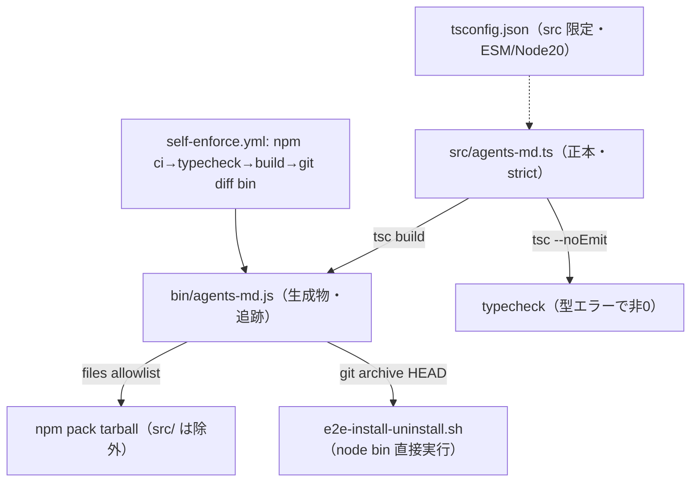
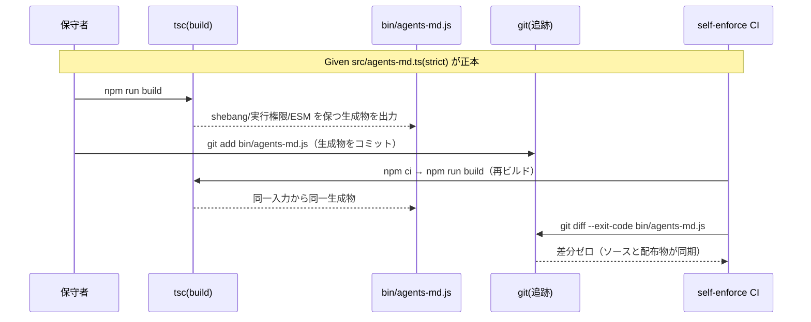
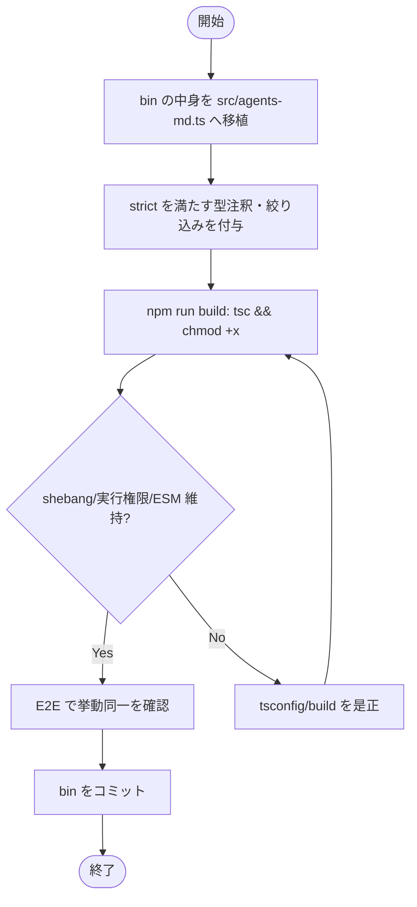

# 設計書: CLI（bin/agents-md.js）の TypeScript 化と型チェックの CI 配線

**プロジェクト名**: CLI の TypeScript 化と型チェックの CI 配線
**作成日**: 2026 年 06 月 15 日
**最終更新**: 2026 年 06 月 15 日

> **重要**: **このドキュメントは常に更新**: 設計の変更や追加があった場合は、即座にこのドキュメントを更新してください。ドキュメントは「生きているドキュメント」として扱い、実装内容と常に同期させます。
>
> **用語**: [.agents/CONCEPTS.md §用語規約](../../../../../.agents/CONCEPTS.md#用語規約) を参照。

---

## 1. 設計概要

**必須**: 設計方針・原則は [.agents/spec/01\_設計原則.md](../../../../../.agents/spec/01_設計原則.md) を**先に参照**した上で、本プロジェクトに**適用するものを選び**記載した。

### 1.1 設計方針

CLI ロジックの正本を `src/agents-md.ts`（TypeScript strict）1 ファイルに集約し、`tsc` で**現行と挙動同一の生成物** `bin/agents-md.js`（ESM・shebang・実行権限）を出力する。生成 `bin/agents-md.js` は **Git 追跡物（コミットする生成物）**として扱い、CI で「`tsc` 再ビルド → `bin/agents-md.js` の `git diff --exit-code` が差分ゼロ」を検証することで、ソース正本と配布物の同期を機械的に保証する。

### 1.2 設計原則（本プロジェクトで適用するもの）

- **UNIX哲学**: CLI は「`setup.sh` を呼ぶ薄いラッパ」という単一目的を維持する。型化はその目的を変えず、静的安全網だけを追加する（小さく作る・シンプルに保つ）。
- **単一責務**: ロジックの正本を `src/agents-md.ts` 1 か所に集約し、`bin/agents-md.js` は「生成物」という単一の役割に限定する（手編集禁止）。`tsconfig.json` は CLI ソースのみを対象とし、テンプレート `.ts`（`audit-table.ts`）を巻き込まない。
- **明確な境界**: 「正本ソース（`src/`・開発専用物）」と「配布物（生成 `bin/`・`.agents/`・テンプレート）」の境界を `files`（allowlist）・`.gitignore`・CI 検査で三位一体に定義する。
- **AIフレンドリー設計**: ソースを 1 ファイルに保ち（現行 643 行・分割は本 issue のスコープ外）、明確な責務・意図が分かる命名を維持する。深いディレクトリは作らない（`src/` 直下 1 ファイル）。

> 本 issue は機能追加・サブコマンド仕様変更を伴わない「型安全化と挙動同一の移行」であるため、CQRS・イベント駆動は適用しない（状態変更/取得の分離やイベント発行という関心が無い）。

---

## 2. アーキテクチャ設計

### 2.1 責務・境界・参照関係

#### 2.1.1 責務一覧

| コンポーネント | 責務（1 文） |
| -------------- | ------------ |
| `src/agents-md.ts` | CLI ロジックの**正本**。`init`/`upgrade`/`uninstall`/`enforce`/`doctor`/`version`/`help` の dispatch・setup.sh 呼び出し・配備物マニフェスト・enforce 配線を TypeScript(strict) で実装する。 |
| `bin/agents-md.js`（生成物） | `tsc` が `src/agents-md.ts` から出力する**実行エントリ**。shebang・実行権限・ESM を保つ。手編集しない Git 追跡物。 |
| `tsconfig.json` | `src/` を対象とした strict 型検査・ESM/Node20 互換の build 設定の**単一正本**。`audit-table.ts` を対象に含めない。 |
| `package.json scripts`（`typecheck`/`build`） | typecheck（`tsc --noEmit`）・build（`tsc`）の**実行 I/F**。publish 前 build は CI（`release.yml`）の `npm ci && npm run build` で担保（`prepack` は廃止＝§3.2.2 訂正）。 |
| `self-enforce.yml` の追加 step | CI で `npm ci` → typecheck → build → `bin` 差分ゼロを検証する**ゲート**（既存 step は不変）。 |
| `run-all.sh` の TESTS 配列（任意） | ローカル一括 runner に typecheck/build 差分検証を組み込むかの**配線点**（§3.3 で「CI に寄せる」を採用し runner は不変とする）。 |

#### 2.1.2 境界

- **入力**: 開発者/CI による `npm run typecheck`・`npm run build`・`npm test`・`git push`/PR。`src/agents-md.ts`（人が編集する唯一の正本）。
- **出力**: 生成 `bin/agents-md.js`（実行可能 ESM・追跡物）。typecheck/build の終了コード（型エラー時非ゼロ）。
- **他責務との境界（本 issue の範囲外）**:
  - `setup.sh` 等 bash スクリプト群の TS 化は範囲外（CLI の `.js` のみ対象）。
  - `audit-table.ts`（採用先 CI 用テンプレート・`npx tsx` 実行系統）の型検査は**別 issue 推奨**。本 issue の `tsconfig` は CLI ソースに限定し、巻き込まない（01 §2.3）。
  - ESLint/Prettier の導入は範囲外。
  - CLI 機能追加・サブコマンド仕様変更は範囲外（挙動同一の移行のみ）。

#### 2.1.3 参照関係

- 開発者/CI → `package.json scripts`（`typecheck`/`build`）→ `tsc`（`tsconfig.json` を読む）→ `src/agents-md.ts` を入力 → `bin/agents-md.js` を出力。
- E2E（`e2e-install-uninstall.sh`）→ クリーン clone（`git archive HEAD`）に含まれる `bin/agents-md.js` → `node bin/agents-md.js <cmd>` を直接実行。
- `verify-npm-pack.sh` → `package.json files`（allowlist）→ tarball に `bin/agents-md.js` を含み `src/`/`tsconfig.json` を含めない。
- 循環参照は無い（`src` → `bin` の一方向生成のみ）。`bin` から `src` への参照は存在しない（生成物は自己完結）。

### 2.2 システムアーキテクチャ

**必須**: 設計判断は [.agents/spec/](../../../../../.agents/spec/)（[00_spec概要.md](../../../../../.agents/spec/00_spec概要.md)、[01\_設計原則.md](../../../../../.agents/spec/01_設計原則.md)、[06\_設計判断の優先順位.md](../../../../../.agents/spec/06_設計判断の優先順位.md)）を参照した。

- **採用パターン**: **Source-to-dist compile（正本ソース → コミットする生成物）パイプライン**。
- **根拠**: spec 06（可読性・単一責務優先）と 01（明確な境界・単一責務）に基づく。E2E が clean clone から `bin` を直接実行する制約と、CI #3「生成物差分ゼロ」と整合させるため、生成物を追跡し「再ビルド差分ゼロ」で同期を保証する構成が最も単純で壊れにくい。

#### 2.2.1 CQRS（Command/Query 分離）

本 issue は状態変更/取得の分離という関心を持たない（ビルドパイプラインの整備のみ）。適用しない。

#### 2.2.2 アーキテクチャ図（本プロジェクトの構成で記載）



### 2.3 コンポーネント構成

**境界・単一責務**:

```
src/
  agents-md.ts        … CLI ロジックの正本（現 bin/agents-md.js の中身を移植・strict 化）
tsconfig.json         … src/ 限定・ESM/Node20 互換・outDir=bin・rootDir=src
bin/
  agents-md.js        … 生成物（追跡）。shebang・実行権限・ESM。手編集禁止
package.json          … scripts に typecheck/build（prepack は廃止＝§3.2.2 訂正）、devDependencies に typescript（+ @types/node）
```

- ロジックは現行どおり 1 ファイル（`src/agents-md.ts`）に集約する。現行が 643 行・単一責務（薄いラッパ）であり、ファイル分割は本 issue のスコープ外（挙動同一の移行に集中する）。
- `bin/agents-md.js` は生成物だが、E2E と CI #3 の制約から**追跡物**とする（§2.4・§9 の判断根拠を参照）。

### 2.4 データフロー

本 issue はイベント発行を伴わない。データフローは「ソース → コンパイル → 生成物 → 配布/実行/検証」の一方向パイプライン。



#### build 後の shebang・実行権限の保証フロー

`tsc` は出力 JS に shebang を**自動付与しない**。`src/agents-md.ts` の 1 行目に `#!/usr/bin/env node` を**そのまま残し**、TypeScript は行頭の `#!` を shebang として認識し出力 JS の先頭へ保持する（TypeScript 5 系の挙動）。実行権限（`chmod +x`）は `tsc` が**設定しない**ため、build スクリプトで `tsc && chmod +x bin/agents-md.js` の形で付与する。Git は実行権限ビット（100755）を追跡するため、`git diff` で権限差分も検出される。

---

## 3. 機能設計

### 3.1 機能 1: TypeScript ソース化とビルド

#### 3.1.1 概要

現 `bin/agents-md.js`（643 行）の中身を `src/agents-md.ts` へ移植し、strict 型検査を満たすよう型注釈・絞り込みを補い、`tsc` で挙動同一の `bin/agents-md.js` を生成する。

#### 3.1.2 処理フロー



#### 3.1.3 入力・出力

- **入力**: `src/agents-md.ts`、`tsconfig.json`。
- **出力**: `bin/agents-md.js`（ESM・shebang・実行権限 755）。

#### 3.1.4 エラーハンドリング

- 型エラー時は `tsc`/`tsc --noEmit` が非ゼロ終了し、build/typecheck/CI が fail する。
- ランタイム挙動（CLI のエラーメッセージ・終了コード）は現行ロジックをそのまま移植し変更しない。

#### tsconfig.json（確定設計）

```jsonc
{
  "compilerOptions": {
    "target": "ES2022",            // Node20 が完全サポート（top-level await 等は未使用）
    "module": "NodeNext",          // ESM 解決。package.json "type":"module" と整合
    "moduleResolution": "NodeNext",
    "lib": ["ES2022"],
    "strict": true,                // SC-1/SC-2 の中核
    "rootDir": "src",
    "outDir": "bin",               // src/agents-md.ts -> bin/agents-md.js
    "noEmitOnError": true,         // 型エラー時は壊れた bin を出さない
    "declaration": false,          // CLI なので .d.ts は不要
    "sourceMap": false,            // 配布物に .map を出さない（リーク防止）
    "esModuleInterop": true,
    "forceConsistentCasingInFileNames": true,
    "skipLibCheck": true,          // @types/node の型ノイズで落とさない
    "types": ["node"]              // node 標準モジュールの型
  },
  "include": ["src/**/*.ts"],      // audit-table.ts を巻き込まない
  "exclude": ["node_modules", "bin", ".workflow", ".adapters"]
}
```

- `import.meta.url`/`fileURLToPath` は `module: NodeNext` + ESM で正しく出力される（CommonJS 化しないため `import.meta` が壊れない）。リスク 7.1（ESM 設定不備で起動不能）への対策。
- `outDir: bin` は **bin 直下に `agents-md.js` のみ**を出力する（`rootDir: src` で 1 ファイルのため `bin/src/...` のような入れ子は生じない）。
- `@types/node` は `tsc` が `node:fs` 等の標準モジュール型を解決するために devDependency として追加する。

### 3.2 機能 2: npm スクリプトと CI 配線

#### 3.2.1 概要

`package.json` に typecheck/build を追加し（`prepack` は採用しない＝§3.2.2 訂正）、CI（`self-enforce.yml`）に typecheck → build → `bin` 差分ゼロ検証の step を**既存 step を変えずに**追加する。

#### 3.2.2 package.json scripts（確定）

```jsonc
"scripts": {
  "build:claude": "bash .agents/scripts/build-plugin-claude.sh",
  "build": "tsc && chmod +x bin/agents-md.js",
  "typecheck": "tsc --noEmit",
  "test": "bash .agents/scripts/test/run-all.sh"
}
```

- **`prepack` は採用しない（廃止）。** 当初案では `prepack: "npm run build"` を「未ビルド配布の最終保険」として置いていたが、これは誤前提に基づく欠陥であった（下記訂正）。生成 `bin/agents-md.js` は **git 追跡物**で常にコミット済みであり、`self-enforce.yml` step #2.5 と publish 前 CI（`release.yml`）の `npm ci && npm run build` → 差分ゼロ検証で src との同期を担保するため、`prepack` は不要かつ有害である。
  - **訂正（当初案 §3.2.2 の誤前提）**: 当初「`npm pack --dry-run` は `prepack` を実行しない（dry-run は lifecycle script を走らせない）」と記載したが、これは**実態と不一致**である。**npm 10（実測 10.8.2）では `npm pack --dry-run` が `prepack` を実行する**。そのため `prepack: "npm run build"` を置くと、E2E（`e2e-install-uninstall.sh`）が `git archive HEAD | tar -x` で作る **node_modules 無しのクリーン作業ツリー**で `verify-npm-pack.sh` を呼んだ際に `npm pack --dry-run` → `prepack` → `npm run build` → `tsc: not found` で **exit 127** となり、E2E シナリオ 7・`npm test` が FAIL する（04_review 指摘 1 / verify-and-close 検証ログ）。
  - **是正**: (A) `prepack` を廃止し、未ビルド配布防止は「追跡 bin の差分ゼロ + CI build（`self-enforce.yml` #2.5・`release.yml` npm-publish ジョブの `npm ci && npm run build`）」に委ねる。加えて (B) `verify-npm-pack.sh` の `npm pack --dry-run` に **`--ignore-scripts`** を付与し、pack 検査時に lifecycle script の副作用を一切起こさない（多重防御）。`--ignore-scripts` 下でも配布ファイル一覧（files=172）は正しく取得できることを実測で確認済み。
- `devDependencies` に `typescript`（`^5`）と `@types/node`（`^20`、engines に整合）を追加する。

#### 3.2.3 self-enforce.yml への step 追加（既存 step 不変）

既存 step（#1〜#7）は一切変更しない。**step #2.5（schema チェックと #3 の間）**として、typecheck と build 差分検証を追加する。配置理由: #3「生成物差分ゼロ（build-adapters）」より前に CLI の build 差分を確定させ、両者の責務（CLI ビルド vs アダプタ生成）を分離する。

```yaml
# 2.5) CLI TypeScript: 依存導入 → typecheck → build → bin 差分ゼロ
- name: CLI typecheck & build diff-zero (tsc)
  run: |
    set -e
    npm ci                         # devDependencies(typescript,@types/node) を導入（lockfile 前提）
    npm run typecheck              # 型エラーがあれば非0で fail（SC-2/SC-3）
    npm run build                  # src -> bin を再生成
    # 追跡物 bin に差分が出ない＝ソースとコミット済み bin が同期している（SC-6・CI#3 整合）
    if ! git diff --exit-code -- bin/agents-md.js; then
      echo "ERROR: bin/agents-md.js が src と同期していません。npm run build してコミットしてください。"
      exit 1
    fi
    echo "OK: bin/agents-md.js は src と差分ゼロ"
```

- `npm ci` には `package-lock.json` が必要なため、**lockfile をコミットする**（§9 判断・SC との整合）。`npm ci` が無理なら `npm install --no-save typescript @types/node` でも代替可能だが、再現性のため `npm ci` + lockfile を第一候補とする。
- 既存 #3 step は `build-adapters.sh` 実行後に `git status --porcelain --untracked-files=no` で**全追跡ファイル**の差分ゼロを見るため、本 step で `bin` が同期していれば #3 も green を維持する（`bin` は #3 でも対象。二重に守られる）。

#### 3.2.4 入力・出力

- **入力**: `package.json`・`tsconfig.json`・`src/agents-md.ts`・`package-lock.json`・CI 環境（node22）。
- **出力**: typecheck/build の結果（成否）、`bin` 差分ゼロ判定。

#### 3.2.5 エラーハンドリング

- 型エラー → typecheck step が非ゼロ → CI fail。
- build 後に `bin` 差分あり（commit 忘れ）→ diff step が非ゼロ → CI fail（修正＝`npm run build` してコミット）。

### 3.3 機能 3: 配布物・E2E・lockfile/gitignore の整合

#### 3.3.1 概要

`files`（allowlist）・`.gitignore`・`verify-npm-pack.sh` を 1 方針で整合させ、生成 bin 同梱・開発専用物（`src/`・`tsconfig.json`・`node_modules`・lockfile）非同梱を保証する。E2E は不変で全 PASS する。

#### 3.3.2 確定事項

- **`package.json files`**: 現状 `[".agents/", "AGENTS.md", "CLAUDE.md", ".workflow/templates/", "bin/", "README.md"]`。`files` は **allowlist** なので、`src/`・`tsconfig.json`・`package-lock.json`・`node_modules` は列挙しない限り tarball に入らない → **`files` は変更不要**。`bin/` は既に含まれる。
- **`.gitignore`**: `node_modules/` を追加で無視する（現状 `.gitignore` に `node_modules` 行が無い）。`src/`・`tsconfig.json`・`package-lock.json`・`bin/agents-md.js` は**追跡物なので無視しない**。
- **`verify-npm-pack.sh`**: 必須物に `bin/agents-md.js` を既に要求済み（変更不要）。禁止パターンに `src/`・`tsconfig.json`・`.map`・`package-lock.json` を**任意で追加**して二重防御してもよい（allowlist で既に防げるため必須ではない。02 では「追加を推奨（防御的）」とする）。
- **E2E（`e2e-install-uninstall.sh`）**: `git archive HEAD | tar -x` で clean tree を作り `node bin/agents-md.js` を直接実行する。bin が**追跡物**なら archive に含まれ、build 不要で E2E が走る → **E2E スクリプトは不変で全 PASS**（SC-5）。
  - もし bin を gitignore（生成物・非追跡）にすると、`git archive` に bin が含まれず E2E が即失敗するため、E2E 前に build を差し込む改修が必要になる。これを避けるのが「bin 追跡」採用の決定的理由（§9）。
- **lockfile**: `npm ci`（CI）で必要なため `package-lock.json` を**コミットする**。`files` に含めない（allowlist 外）ので配布物には漏れない。`engines.node >=20` と整合（lockfile の lockfileVersion は npm10 で生成）。
- **run-all.sh への組み込み**: typecheck/build 差分検証は **CI step に寄せ、`run-all.sh` の TESTS 配列は変更しない**（理由: run-all.sh は「bash テストスクリプトを呼ぶ薄い runner」であり、tsc は別系統。CI #2.5 で型ゲートを担保すれば十分。`npm test` に tsc を混ぜると runner の単一責務を崩す）。開発者は `npm run typecheck` を個別に実行する運用とする。

#### 3.3.3 エラーハンドリング

- 配布物に開発物が漏れた場合 → `verify-npm-pack.sh`（CI #4）が fail。
- `node_modules` を誤って追跡 → `.gitignore` で防止。万一漏れても `files` allowlist で配布物には入らない。

---

## 4. データ設計

本 issue は DB・テーブルの追加・変更を伴わない（CLI のビルド構成の整備）。`workflow.db`/`settings.json` 等 CLI が扱う既存データ形式は不変。データモデルの新規設計は無し。

---

## 5. API 設計

### 5.1 API 一覧（CLI サブコマンド I/F・npm スクリプト I/F）

| インターフェース | 種別 | 説明 |
| ---------------- | ---- | ---- |
| `agents-md init [dir]` 他全サブコマンド | CLI | 現行と**同一**の I/F・終了コードを維持（変更なし） |
| `npm run build` | script | `tsc && chmod +x bin/agents-md.js`（src → bin 生成） |
| `npm run typecheck` | script | `tsc --noEmit`（型エラーで非0） |
| publish 前 build（CI） | CI step | `release.yml` npm-publish ジョブの `npm ci && npm run build` → 差分ゼロ検証（`prepack` の代替。§3.2.2 訂正） |

### 5.2 API 詳細

#### CLI サブコマンド（不変）

- **I/F**: `init [dir]`/`upgrade [dir]`/`uninstall [dir] [--yes|-y] [--purge]`/`enforce <on|off|status> [dir]`/`doctor`/`version`/`help`。
- **終了コード**: `process.exit(main(process.argv))` の戻り値（現行ロジックそのまま）。
- **変更点**: ロジックは不変。型注釈の付与のみ（`main(argv: string[]): number`、各 helper の引数・戻り値型、`spawnSync` 結果の絞り込み、`JSON.parse` 結果の `unknown` ハンドリング等）。

#### build/typecheck（新規 script）

- **build**: 入力 `src/agents-md.ts` → 出力 `bin/agents-md.js`（ESM・shebang・755）。エラー: 型エラーで非0（`noEmitOnError`）。
- **typecheck**: `tsc --noEmit`。出力なし、成否のみ。エラー: 型エラーで非0。

---

## 6. テスト戦略

テスト戦略の**観点の定義**は [RULES.md のテスト戦略必須要件](../../../../../.agents/RULES.md#テスト戦略必須要件) を、**BDD 形式の定義**は [TEST_BDD_FORMAT.md](../../../../../.agents/TEST_BDD_FORMAT.md) を参照。本ドキュメントでは**対象ごとのテスト割当**のみ記載する。

### 6.1 対象ごとのテスト割り当て

| 対象 | 単体 | 結合/API | E2E | クリティカル観点 | バリデーション観点 | 未達理由/補足 |
| ---- | ---- | -------- | --- | ---------------- | ------------------ | ------------- |
| `src/agents-md.ts`（型安全性） | ○ | × | × | typecheck PASS／型エラー注入で fail（SC-2） | strict での null/undefined・引数型 | 単体＝`tsc --noEmit` の成否で担保 |
| `bin/agents-md.js`（生成物の挙動同一） | × | × | ○ | 全サブコマンドの外形挙動が現行と同一（SC-1/SC-5） | help/version/uninstall dry-run 等の出力 | E2E（14 シナリオ）で担保 |
| build パイプライン（shebang/権限/ESM） | × | ○ | ○ | build 後 bin が shebang・755・ESM を保つ（SC-1） | `node bin/... help` が起動 | E2E 起動＋手動/CI build で確認 |
| CI 型ゲート（typecheck/build 差分ゼロ） | × | ○ | × | 型エラーで CI fail・bin 差分で CI fail（SC-3/SC-6） | diff --exit-code | CI step #2.5 で担保 |
| 配布物（生成 bin 同梱・開発物リーク無し） | × | ○ | ○ | pack に bin 含・src/tsconfig 漏れ無し（SC-4） | `files` allowlist | `verify-npm-pack.sh`（既存）で担保 |

### 6.2 監査・レビューでの確認（証跡）

証跡の確認観点は RULES §テスト戦略必須要件および workflow/PHASES.md の監査観点を参照。本設計書 §6.1 の割当表と 03\_実装計画のタスク別テスト観点・BDD が揃っていることを確認する。受け入れの中核は既存 E2E（14 シナリオ）の FAIL=0 と、`tsc --noEmit` の成否、`git diff --exit-code bin/agents-md.js` の差分ゼロ。

---

## 7. UI 設計

CLI のため GUI 画面は無い。CLI の出力（help・doctor・uninstall dry-run・enforce status 等）は**現行と同一**を維持する（変更しない）。

---

## 8. セキュリティ設計

### 8.1 認証・認可

該当なし（ローカル配備 CLI・認証機構を持たない）。

### 8.2 データ保護

- 追加依存は `typescript`・`@types/node` の**ビルド専用 devDependency** に限定し、CLI のランタイム依存（Node 標準モジュールのみ）と攻撃面を増やさない。
- 配布物に開発専用物（`src/`・`tsconfig.json`・`node_modules`・`package-lock.json`・`.map`）をリークさせない（`files` allowlist ＋ `verify-npm-pack.sh`）。

---

## 9. 非機能要件への対応

### 9.1 パフォーマンス

- typecheck/build は開発・CI 時処理で、CLI ランタイム性能に影響しない。CI 増分は `npm ci` + `tsc`（1 ファイル）で数十秒オーダーに収まる。

### 9.2 可用性・互換性

- ESM 維持（`type: module`・`module: NodeNext`）で `import.meta.url`/`fileURLToPath` が Node20+ で正しく動く。未ビルド配布は「追跡 bin の差分ゼロ + CI build（`self-enforce.yml` #2.5・`release.yml` の `npm ci && npm run build`）」で防ぐ（`prepack` は廃止＝§3.2.2 訂正）。

### 9.3 重要設計判断: 生成 bin の Git 追跡（第一候補確定）と代替の却下理由

| 観点 | **採用: bin を Git 追跡（コミットする生成物）** | 代替: bin を gitignore ＋ prepublish build |
| ---- | ---------------------------------------------- | ------------------------------------------ |
| E2E（`git archive HEAD`） | archive に bin が含まれ、build 不要で `node bin` 実行可。**E2E 不変で PASS** | archive に bin が無く E2E が即失敗。**E2E 前に build 差し込みが必須**（改修増） |
| CI #3（差分ゼロ） | `git diff --exit-code bin` で「ソースと bin の同期」を直接検証。CI #3 と同方向 | bin が未追跡なので #3 の対象外。同期検証を別途設計する必要 |
| 配布物 | `files` の `bin/` で同梱。未ビルド配布防止は CI build（`npm ci && npm run build` → 差分ゼロ）に委ねる（`prepack` は廃止＝§3.2.2 訂正） | publish 時のみ build。pack dry-run 時に bin 不在のリスク |
| 欠点 | 生成物をコミットする運用負担（build 忘れ→CI が差分検出して気づける） | clean clone 直後に bin が無く `node bin` が動かない |

**却下理由（代替）**: 既存 E2E が `git archive HEAD | tar -x` から `node bin/agents-md.js` を直接実行する設計に強く依存しており、bin を非追跡にすると E2E・CI の複数箇所に build 差し込みが波及する。挙動同一の移行という本 issue の主旨（既存検査網を壊さない）に反するため、**bin を追跡物とし「再ビルド差分ゼロ」で同期保証する第一候補を確定**する。

### 9.4 `src/`・`tsconfig.json` を `files` に含めない方針（確定）

`files` は allowlist であり、開発専用物（`src/`・`tsconfig.json`・`package-lock.json`・`node_modules`）を列挙しなければ tarball に入らない。よって `files` は**現状のまま変更せず**、開発専用物を配布物に出さない方針を確定する。防御的に `verify-npm-pack.sh` の禁止パターンへ `src/`・`tsconfig.json`・`.map` を追加してもよい（任意・二重防御）。

---

## 10. 参考資料

### プロジェクトドキュメント

- [`01_要件定義.md`](./01_要件定義.md) - 要件定義
- [`00_要求定義.md`](./00_要求定義.md) - 要求定義

### その他の参考資料

- `bin/agents-md.js`（643 行・移行対象の正本ロジック）
- `package.json`（`bin`/`files`/`engines`/`scripts`/`type: module`）
- `.github/workflows/self-enforce.yml`（#3 差分ゼロ・#4 pack リーク・#6 E2E）
- `.agents/scripts/test/e2e-install-uninstall.sh`・`run-all.sh`・`verify-npm-pack.sh`
- [.agents/spec/01_設計原則.md](../../../../../.agents/spec/01_設計原則.md)・[06_設計判断の優先順位.md](../../../../../.agents/spec/06_設計判断の優先順位.md)

---

## 11. 前のステップ

この設計書は、以下のドキュメントを基に作成されています：

- **前**: [`01_要件定義.md`](./01_要件定義.md) - 要件定義フェーズ

---

## 12. 次のステップ

この設計書の承認後、以下のドキュメントを作成します：

- **次**: [`03_実装計画.md`](./03_実装計画.md) - 実装計画フェーズ
