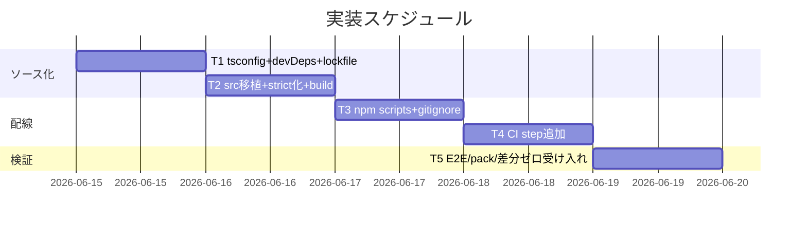

# 実装計画書: CLI（bin/agents-md.js）の TypeScript 化と型チェックの CI 配線

**プロジェクト名**: CLI の TypeScript 化と型チェックの CI 配線
**作成日**: 2026 年 06 月 15 日
**最終更新**: 2026 年 06 月 15 日

> **重要**: **このドキュメントは常に更新**: 実装計画の変更、進捗状況の更新、バグの記録などがあった場合は、即座にこのドキュメントを更新してください。ドキュメントは「生きているドキュメント」として扱い、実装内容と常に同期させます。
> **必須項目**: 「必須」と明記した欄は空欄・抽象語のみで提出しないこと。テスト観点・BDD 仕様は具体ケースを 1 件以上記載すること。
>
> **用語**: [.agents/CONCEPTS.md §用語規約](../../../../../.agents/CONCEPTS.md#用語規約) を参照。

---

## 1. 実装概要

### 1.1 実装方針（必須）

現 `bin/agents-md.js`（643 行）を `src/agents-md.ts`（strict）へ移植し、`tsc` で挙動同一の追跡物 `bin/agents-md.js` を生成する。`tsconfig`・npm scripts・lockfile・`.gitignore`・CI step を整備し、型エラーで CI を fail させ、既存 E2E（14 シナリオ）・pack リーク検査・CI #3 差分ゼロを green に保つ。挙動同一を E2E で担保した上で切り替える。

### 1.2 実装順序（必須: 1 件以上）



実行順: **T1（足場）→ T2（移植・build）→ T3（scripts/gitignore）→ T4（CI 配線）→ T5（受け入れ検証）**。T2 は T1（tsconfig・devDeps）に依存。T4 は T1〜T3 完了に依存。T5 は全タスク後の総合受け入れ。

---

## 2. タスク分解

**用語**: [.agents/CONCEPTS.md §用語規約](../../../../../.agents/CONCEPTS.md#用語規約) を参照。

**必須**: 各タスクには **「テスト観点」（2.x.3）** と **「単体テスト仕様（BDD）」（2.x.4）** を必ず記載する。

### 2.1 タスク 1: tsconfig・devDependencies・lockfile の足場整備

#### 2.1.1 概要（必須）

`tsconfig.json`（src 限定・ESM/Node20 互換・strict）と `devDependencies`（typescript・@types/node）・`package-lock.json` を整備し、TypeScript ビルドの足場を作る。

#### 2.1.2 実装内容（必須: 1 件以上）

- リポジトリルートに `tsconfig.json` を新規作成（02 §3.1 の確定設定: `target ES2022`/`module NodeNext`/`strict`/`rootDir src`/`outDir bin`/`noEmitOnError`/`include ["src/**/*.ts"]`/`exclude [node_modules,bin,.workflow,.adapters]`）。
- `package.json` の `devDependencies` に `"typescript": "^5"`・`"@types/node": "^20"` を追加。
- `npm install` を実行して `package-lock.json` を生成し、**コミット対象**に含める（`files` には含めない＝配布物には漏れない）。

#### 2.1.3 テスト観点（必須）

**参照**: 観点の定義は [02\_設計 §6](./02_設計.md) および [RULES のテスト戦略・TEST_BDD_FORMAT](../../../../../.agents/RULES.md#テスト戦略必須要件) を参照。

##### 単体（本タスクの具体ケース・必須 1 件以上）

- `npx tsc --showConfig` が `tsconfig.json` を解釈でき、`include` に `src/**/*.ts` のみが含まれ `audit-table.ts` が対象外であること。
- 異常系: `.workflow/templates/github/scripts/audit-table.ts` が `tsc` の対象ファイル一覧に含まれないこと（`tsc --listFiles` 相当で確認）。

##### 結合/API（本タスクの具体ケース・該当時は必須 1 件以上）

- `npm ci` がコミット済み `package-lock.json` から typescript・@types/node を再現導入できること（CI 前提）。

##### E2E/受け入れ（本タスクの具体ケース・未達時は理由記載）

- 該当なし（足場のみ。E2E は T5 で総合確認）。

##### バリデーション（該当する場合の具体ケース）

- `package-lock.json` の lockfileVersion が npm10 互換で、`engines.node >=20` と矛盾しないこと。

#### 2.1.4 単体テスト仕様（BDD）（必須）

```gherkin
Feature: tsconfig の対象限定
  Scenario: tsconfig が CLI ソースのみを対象とし audit-table.ts を巻き込まない
    Given tsconfig.json が include ["src/**/*.ts"] で定義されている
    When tsc --listFiles 相当でコンパイル対象を列挙する
    Then src/agents-md.ts が含まれる
    And audit-table.ts は対象ファイルに含まれない
```

```typescript
// Given: tsconfig.json が include ["src/**/*.ts"]・exclude で .workflow を除外している
// When: `npx tsc --noEmit --listFilesOnly` を実行しコンパイル対象を列挙する
// Then: 出力に src/agents-md.ts を含み、audit-table.ts を含まないこと
```

#### 2.1.5 依存関係

- なし（最初のタスク）。

#### 2.1.6 見積もり

- **工数**: 1h　**優先度**: 高

---

### 2.2 タスク 2: src/agents-md.ts への移植と strict 化・build

#### 2.2.1 概要（必須）

現 `bin/agents-md.js` のロジックを `src/agents-md.ts` へ移植し、strict を満たす型注釈・絞り込みを付与して、`npm run build` で挙動同一の `bin/agents-md.js` を生成する。

#### 2.2.2 実装内容（必須: 1 件以上）

- `src/agents-md.ts` を新規作成し、現 `bin/agents-md.js` の中身（1 行目 shebang `#!/usr/bin/env node` を含む）を移植する。
- strict 対応: `main(argv: string[]): number`、各 helper の引数・戻り値型、`spawnSync` 戻り値の `status: number | null` 絞り込み、`JSON.parse` の戻り値 `unknown` を介した安全アクセス、`readSettings`/`readEnforceTemplate` の戻り型を明示（`object | null` 等）、`process.exit(main(...))` の型整合。
- `package.json scripts.build` に `"tsc && chmod +x bin/agents-md.js"` を定義（T3 と一部重複するが build 自体はここで成立させる）。
- `npm run build` を実行し、生成 `bin/agents-md.js` が shebang・実行権限 755・ESM を保つことを確認してコミットする（**生成物を追跡**）。

#### 2.2.3 テスト観点（必須）

##### 単体（本タスクの具体ケース・必須 1 件以上）

- `npm run typecheck`（`tsc --noEmit`）が PASS する（型エラー 0）。
- 異常系: `src/agents-md.ts` に意図的な型エラー（例: `main` の戻り値に文字列を返す）を注入すると `tsc --noEmit` が非ゼロ終了する。

##### 結合/API（本タスクの具体ケース・該当時は必須 1 件以上）

- `npm run build` 後、`head -1 bin/agents-md.js` が `#!/usr/bin/env node` であり、`test -x bin/agents-md.js`（実行権限）が真であること。
- `node bin/agents-md.js help` が現行と同一のヘルプ文字列を出力すること（移行前の出力と diff ゼロ）。

##### E2E/受け入れ（本タスクの具体ケース・未達時は理由記載）

- E2E 総合は T5。本タスクでは `node bin/agents-md.js version`/`help`/`uninstall`（dry-run）の起動が現行と一致することを手動確認する。

##### バリデーション（該当する場合の具体ケース）

- 生成 `bin/agents-md.js` が ESM（`import`/`export` 構文・`require` 不使用）であり `import.meta.url` を保持していること。

#### 2.2.4 単体テスト仕様（BDD）（必須）

```gherkin
Feature: TypeScript build による bin 生成
  Scenario: build が現行と挙動同一の実行可能 bin を生成する
    Given src/agents-md.ts（strict）が CLI ロジックの正本である
    When npm run build（tsc && chmod +x）を実行する
    Then bin/agents-md.js が生成され shebang・実行権限・ESM を保つ
    And node bin/agents-md.js help が現行と同じヘルプを出力する

  Scenario: 型エラーで typecheck が fail する
    Given src/agents-md.ts に意図的な型エラーを注入した
    When npm run typecheck を実行する
    Then 非ゼロ終了する
    And 型エラーを修正すると 0 終了に戻る
```

```typescript
// Given: src/agents-md.ts(strict) を build 済みで bin/agents-md.js が存在する
// When: `node bin/agents-md.js help` を実行し stdout を取得する
// Then: 出力が移行前 bin の help 出力と一致する（shebang・実行権限 755 も維持）
//
// Given: src/agents-md.ts の main 戻り値型に反する値を一時的に書く
// When: `npx tsc --noEmit` を実行する
// Then: 終了コードが 0 以外（型エラー検出）。修正後は 0 に戻る
```

#### 2.2.5 依存関係

- T1（tsconfig・devDeps）に依存。

#### 2.2.6 見積もり

- **工数**: 3h　**優先度**: 高

---

### 2.3 タスク 3: npm scripts・.gitignore・files の整合

#### 2.3.1 概要（必須）

`package.json scripts` に typecheck/build/prepack を確定配線し、`.gitignore` に `node_modules` を追加、`files` allowlist を据え置き（変更不要の確認）、配布物の健全性を整える。

#### 2.3.2 実装内容（必須: 1 件以上）

- `package.json scripts` を 02 §3.2.2 のとおり確定: `build`(`tsc && chmod +x bin/agents-md.js`)・`typecheck`(`tsc --noEmit`)・`prepack`(`npm run build`)。`build:claude`・`test` は不変。
- `.gitignore` に `node_modules/` 行を追加（`src/`・`tsconfig.json`・`package-lock.json`・`bin/agents-md.js` は追跡継続のため無視しない）。
- `files` allowlist は変更不要であることを確認（`bin/` 含む・`src`/`tsconfig` 非列挙）。
- （任意・防御的）`verify-npm-pack.sh` の禁止パターンに `src/`・`tsconfig.json`・`.map` を追加。

#### 2.3.3 テスト観点（必須）

##### 単体（本タスクの具体ケース・必須 1 件以上）

- `git status --porcelain` に `node_modules/` が現れない（`.gitignore` 有効）。
- 異常系: `node_modules/` を誤って `git add -f` しても `files` allowlist 外のため pack に含まれない（後段 T5 の pack 検査で担保）。

##### 結合/API（本タスクの具体ケース・該当時は必須 1 件以上）

- `npm pack --dry-run --json` の files に `bin/agents-md.js` を含み、`src/`・`tsconfig.json`・`package-lock.json`・`node_modules` を含まない。

##### E2E/受け入れ（本タスクの具体ケース・未達時は理由記載）

- `verify-npm-pack.sh` が PASS（T5 で総合確認）。

##### バリデーション（該当する場合の具体ケース）

- `npm run prepack` が `npm run build` を呼び bin を再生成すること（lifecycle 名の妥当性）。

#### 2.3.4 単体テスト仕様（BDD）（必須）

```gherkin
Feature: 配布物の allowlist 整合
  Scenario: pack に生成 bin が含まれ開発専用物が漏れない
    Given files allowlist が bin/ を含み src/・tsconfig を含まない
    When npm pack --dry-run --json を実行する
    Then files に bin/agents-md.js が含まれる
    And files に src/・tsconfig.json・package-lock.json・node_modules が含まれない
```

```typescript
// Given: package.json の files が [".agents/","AGENTS.md","CLAUDE.md",".workflow/templates/","bin/","README.md"]
// When: `npm pack --dry-run --json` の出力 files を解析する
// Then: bin/agents-md.js を含み、src/・tsconfig.json・package-lock.json・node_modules を 1 件も含まない
```

#### 2.3.5 依存関係

- T2（build が成立していること）に依存。

#### 2.3.6 見積もり

- **工数**: 1h　**優先度**: 中

---

### 2.4 タスク 4: self-enforce.yml への CI step 追加（既存 step 不変）

#### 2.4.1 概要（必須）

CI に「`npm ci` → typecheck → build → `bin` 差分ゼロ」の step（#2.5）を追加し、型エラー・bin 未同期で CI を fail させる。既存 step #1〜#7 は一切変更しない。

#### 2.4.2 実装内容（必須: 1 件以上）

- `.github/workflows/self-enforce.yml` の schema step（#2）と #3 の間に、02 §3.2.3 の `CLI typecheck & build diff-zero (tsc)` step を追加する。
- step 内容: `npm ci` → `npm run typecheck` → `npm run build` → `git diff --exit-code -- bin/agents-md.js`。
- 既存の Setup Node（node22）を再利用し、新規 action は追加しない。

#### 2.4.3 テスト観点（必須）

##### 単体（本タスクの具体ケース・必須 1 件以上）

- 追加 step の YAML が妥当（`actionlint`/`yamllint` 相当、または `bash -n` 不可のため YAML パースで確認）。
- 異常系: 型エラーを含む src で step を実行すると `npm run typecheck` が非ゼロで step が fail する。

##### 結合/API（本タスクの具体ケース・該当時は必須 1 件以上）

- src を変更して build せずコミットした状態で step を回すと `git diff --exit-code bin/agents-md.js` が非ゼロで fail する（bin 未同期検出）。
- src と bin が同期していれば step が成功する（差分ゼロ）。

##### E2E/受け入れ（本タスクの具体ケース・未達時は理由記載）

- 既存 #3（build-adapters 差分ゼロ）・#4（pack リーク）・#6（E2E）・#6.5（coverage）が引き続き green であること（T5 で総合確認。CI 実走は PR で確認）。

##### バリデーション（該当する場合の具体ケース）

- `npm ci` が lockfile 不在で失敗しないこと（T1 で lockfile をコミット済みであることが前提）。

#### 2.4.4 単体テスト仕様（BDD）（必須）

```gherkin
Feature: CI 型ゲート
  Scenario: 型エラーで CI が fail する
    Given self-enforce.yml に typecheck step が追加されている
    And src/agents-md.ts に型エラーがある
    When CI step を実行する
    Then npm run typecheck が非ゼロ終了し step が fail する

  Scenario: bin 未同期で CI が fail する
    Given src を変更したが bin を再ビルド・コミットしていない
    When CI step の git diff --exit-code bin/agents-md.js を実行する
    Then 差分が検出され step が fail する
```

```bash
# Given: src/agents-md.ts に型エラーを注入したワークツリー
# When: `npm run typecheck` を実行する
# Then: 終了コード != 0（CI step がここで停止し fail する）
#
# Given: src を変更し build せずに bin が古いままのワークツリー
# When: `npm run build && git diff --exit-code -- bin/agents-md.js` を実行する
# Then: build で bin が更新され diff が出る → 差分検出で非ゼロ（未同期を検出）
```

#### 2.4.5 依存関係

- T1・T2・T3（scripts・lockfile・bin が揃っていること）に依存。

#### 2.4.6 見積もり

- **工数**: 1h　**優先度**: 高

---

### 2.5 タスク 5: 受け入れ検証（E2E 全 PASS・pack・差分ゼロ）

#### 2.5.1 概要（必須）

移行後の総合受け入れを tmp 隔離で実施し、E2E 14 シナリオ FAIL=0・`verify-npm-pack.sh` 合格・`bin` 差分ゼロ・既存 CI 全 step 維持を確認する。

#### 2.5.2 実装内容（必須: 1 件以上）

- `mktemp -d` ＋ `git archive HEAD | tar -x` でクリーン作業ツリーを作り、`bash .agents/scripts/test/e2e-install-uninstall.sh` を実行（FAIL=0 を確認）。
- `bash .agents/scripts/verify-npm-pack.sh` を実行（リーク無し・必須物あり）。
- `npm run build && git diff --exit-code -- bin/agents-md.js`（差分ゼロ）を確認。
- `npm run typecheck`（PASS）と型エラー注入→fail→修正→PASS の往復を確認（証跡として記録）。
- 検証は**本リポの追跡物を破壊せず** tmp 隔離で行い、終了後に `rm -rf` で片付ける（.agents-project §テストの tmp 隔離）。

#### 2.5.3 テスト観点（必須）

##### 単体（本タスクの具体ケース・必須 1 件以上）

- `npm run typecheck` が PASS（型エラー 0）。

##### 結合/API（本タスクの具体ケース・該当時は必須 1 件以上）

- `verify-npm-pack.sh` が exit 0（bin 同梱・src/tsconfig 非同梱）。
- `git diff --exit-code -- bin/agents-md.js` が exit 0（差分ゼロ）。

##### E2E/受け入れ（本タスクの具体ケース・未達時は理由記載）

- `e2e-install-uninstall.sh` の全 14 シナリオが PASS（FAIL=0）。clean clone から `node bin/agents-md.js` が起動し install/uninstall/enforce が現行と同一挙動。

##### バリデーション（該当する場合の具体ケース）

- 型エラーを注入した状態では typecheck が fail し、修正で PASS に戻る（往復確認）。

#### 2.5.4 単体テスト仕様（BDD）（必須）

```gherkin
Feature: 移行受け入れ
  Scenario: 移行後も E2E が全 PASS し配布が健全である
    Given bin/agents-md.js が src から build され追跡コミット済みである
    When e2e-install-uninstall.sh と verify-npm-pack.sh を実行する
    Then E2E が FAIL=0 で全 PASS する
    And pack 検査がリーク無し・必須物ありで合格する
    And npm run build 後の git diff --exit-code bin/agents-md.js が差分ゼロである
```

```bash
# Given: tmp 隔離した clean clone（git archive HEAD | tar -x）で bin が存在する
# When: bash .agents/scripts/test/e2e-install-uninstall.sh を実行する
# Then: 出力末尾が「全シナリオ pass」で FAIL=0、終了コード 0
#
# Given: 同 clean tree
# When: bash .agents/scripts/verify-npm-pack.sh を実行する
# Then: 終了コード 0（リーク無し・必須物あり）
```

#### 2.5.5 依存関係

- T1〜T4 すべてに依存（総合受け入れ）。

#### 2.5.6 見積もり

- **工数**: 2h　**優先度**: 高

---

## テスト観点

本実装計画全体のテスト観点の要約（各タスク §2.x.3 に具体ケースを記載）:

- **型安全性（単体）**: `tsc --noEmit` が PASS／型エラー注入で fail（SC-2）。`tsconfig` が CLI ソース限定で `audit-table.ts` を巻き込まない。
- **build 正当性（結合）**: 生成 bin が shebang・実行権限 755・ESM を保ち `node bin help` が現行同一（SC-1）。
- **CI ゲート（結合）**: 型エラー・bin 未同期で CI fail（SC-3/SC-6）。
- **配布健全性（結合/E2E）**: pack に bin 同梱・開発物リーク無し（SC-4）。
- **挙動同一（E2E）**: E2E 14 シナリオ FAIL=0（SC-5）。既存 CI #3/#4/#6/#6.5 維持（SC-6）。
- **スコープ明示**: `audit-table.ts` 別 issue 推奨を 01 に明記済み（SC-7）。

## 単体テスト

- 対象: `src/agents-md.ts` の型安全性（`tsc --noEmit` の成否で担保）。
- 方針: 機能ロジックは現行から不変のため、新規の単体テストコードは追加せず、型検査（静的単体）＋既存 E2E（動的結合/受け入れ）で担保する。型エラー注入→fail→修正→PASS の往復を証跡化する。

## BDD

各タスク §2.x.4 に Given/When/Then 形式で記載（TEST_BDD_FORMAT に準拠・`// Given:`/`// When:`/`// Then:` インラインコメント付き）。中核シナリオ: build による bin 生成・型エラーで typecheck fail・pack allowlist 整合・CI 型ゲート fail・E2E 全 PASS。

---

## 3. 実装スケジュール

### 3.1 マイルストーン

| マイルストーン | 期日 | 成果物 |
| -------------- | ---- | ------ |
| M1: 足場 | T1 完了 | `tsconfig.json`・devDeps・`package-lock.json` |
| M2: 移植・build | T2 完了 | `src/agents-md.ts`・生成 `bin/agents-md.js`（追跡） |
| M3: 配線 | T3/T4 完了 | scripts・`.gitignore`・CI step #2.5 |
| M4: 受け入れ | T5 完了 | E2E FAIL=0・pack 合格・差分ゼロ の証跡 |

### 3.2 実装フェーズ

#### フェーズ 1: ソース化（T1・T2）

- **タスク**: tsconfig/devDeps/lockfile、src 移植・strict 化・build。

#### フェーズ 2: 配線・受け入れ（T3・T4・T5）

- **タスク**: scripts/gitignore、CI step 追加、総合受け入れ検証。

---

## 4. テスト計画

テスト観点・レベル・BDD 形式の定義は **02\_設計 §6** および **RULES のテスト戦略・TEST_BDD_FORMAT** を参照。各タスク §2.x.3 に具体ケース、§2.x.4 に BDD を記載済み。

### 4.1 テストの優先順位

- クリティカル: 型エラー検出（typecheck fail）・bin 差分ゼロ・E2E 全 PASS は必ず確認する。
- 回帰: 既存 E2E 14 シナリオ・pack リーク検査・CI #3 を回帰網として全て通す。

---

## 5. リスク管理

### 5.1 実装リスク

- **リスク**: ESM/Node20 ターゲット設定不備で生成 JS の `import.meta.url`/`fileURLToPath` が壊れ CLI 起動不能。
  - **対策**: `module: NodeNext`・`type: module` 維持・CommonJS 化しない。T2/T5 の E2E 実起動で検証。
- **リスク**: 生成 bin のコミット忘れで CI #2.5 が差分検出して赤くなる。
  - **対策**: これは設計どおりの検出挙動。`npm run build` してコミットすれば green。`prepack` も保険として配線。
- **リスク**: `npm ci` 用 lockfile 不在で CI が失敗。
  - **対策**: T1 で `package-lock.json` を生成・コミット（`files` allowlist 外で配布物には漏れない）。
- **リスク**: shebang が生成 JS の先頭に残らない。
  - **対策**: `src` の 1 行目に `#!/usr/bin/env node` を置き TypeScript の shebang 保持を利用。`head -1 bin/agents-md.js` で検証（T2）。

---

## 6. 参考資料

### プロジェクトドキュメント

- [`02_設計.md`](./02_設計.md) - 設計
- [`01_要件定義.md`](./01_要件定義.md) - 要件定義

### その他の参考資料

- `bin/agents-md.js`・`package.json`・`.github/workflows/self-enforce.yml`
- `.agents/scripts/test/e2e-install-uninstall.sh`・`run-all.sh`・`verify-npm-pack.sh`・`.gitignore`

---

## 7. 前のステップ

この実装計画書は、以下のドキュメントを基に作成されています：

- **前**: [`02_設計.md`](./02_設計.md) - 設計フェーズ

---

## 8. 次のステップ

この実装計画書の承認後、以下のいずれかのステップに進みます：

- **プロジェクトが 1 つの issue（タスク群）である場合**: 実装フェーズ（execution）に直接進む（本 issue はサブ issue へ分割しない＝T1〜T5 を 1 issue 内で完結）。

**用語**: [.agents/CONCEPTS.md §用語規約](../../../../../.agents/CONCEPTS.md#用語規約) を参照。
