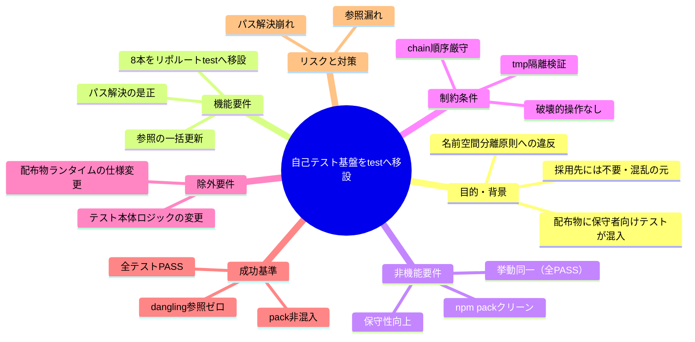
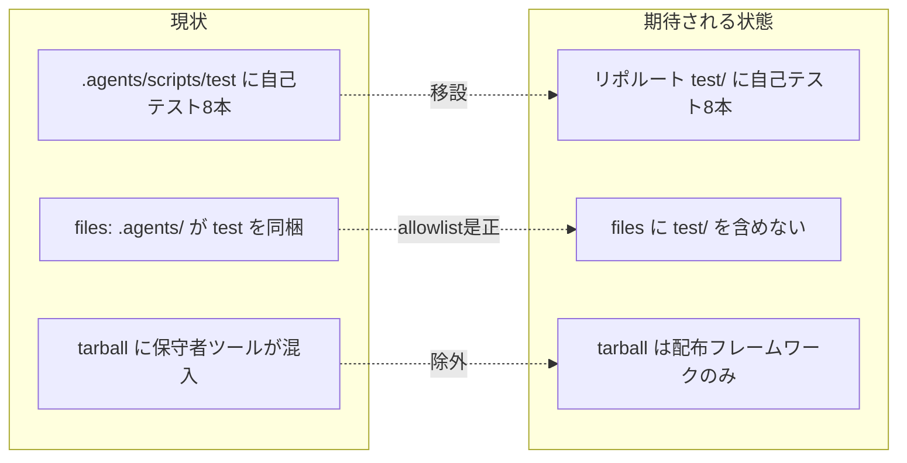

# 要求定義書: 自己テスト/カバレッジ基盤を配布物外（リポルート test/）へ移設

**プロジェクト名**: 自己テスト/カバレッジ基盤を配布物外（リポルート test/）へ移設
**作成日**: 2026 年 06 月 15 日
**最終更新**: 2026 年 06 月 15 日

> **重要**:
>
> - 要求定義書は、プロジェクトの全体像を把握するためのものです。詳細な技術仕様や実装方法は要件定義書以降で記載します。必要最低限の情報に収めることを心掛けてください。
> - **このドキュメントは常に更新**: 要求の変更や追加があった場合は、即座にこのドキュメントを更新してください。
>
> **用語**: [.agents/CONCEPTS.md §用語規約](../../../../../.agents/CONCEPTS.md#用語規約) を参照。

---

## 要求定義の全体像

**注意**:

- マインドマップは全体像を把握するためのもの。詳細は本文の各節を参照。

---

## 1. 目的・背景

### 1.1 目的（必須）

保守者向け自己テスト一式を配布物外の `test/` へ移し `.agents/` を配布専用に純化する。

### 1.2 背景

- **現状の課題**:
  - `.agents/scripts/test/` 配下の自己テスト/カバレッジ基盤8本が **npm 配布物 tarball（172 ファイル）に同梱**されている。`package.json` の `files: [".agents/"]` が `.agents/scripts/test/` を丸ごと取り込むため（例: `e2e-install-uninstall.sh` 40.8kB が消費者へ配布される）。
  - これらは本リポ自身（自己拡張・ドッグフーディング）を検証する**保守者向けツール**であり、パッケージを採用する消費者には不要・混乱の元。
  - プロジェクトの名前空間分離原則（**配布物 vs 自己拡張開発記録**: `.agents-project/自己拡張ワークフロー.md` §理由）に反する。`build-adapters.sh` はアダプタ生成時に `rm -rf "$out/.agents/scripts/test"` で除外しているが、**npm 配布物（files allowlist 経由）では除外されていない**という非対称が残っている。

- **必要性**:
  - 配布物には「フレームワーク（`.agents/`）」のみを含め、保守者専用ツールは配布から完全に切り離す必要がある。
  - 名前空間分離原則（配布物 / 自己拡張開発記録 / 消費者ランタイム生成物）に「保守者自己テスト（非配布）」の枠を追加し、一貫させる必要がある。

### 1.3 期待される効果（必須: 1 件以上）

- **効果 1**: `npm pack`（または `verify-npm-pack.sh`）の配布ファイル一覧に `test/` 配下の自己テストが **1 件も含まれない**（○/×で判定可能）。
- **効果 2**: `.agents/` が「配布フレームワーク専用」に純化され、配布物のファイル数・サイズが削減される（自己テスト8本ぶん減少を確認可能）。
- **効果 3**: `npm test`（→新パス）と各テストが**新パスから全 PASS**し、移設前後で挙動が同一であることが確認可能。

**現状と期待される状態の比較**:

---

## 2. 機能要件

### 2.1 既存機能の維持（該当する場合）

- 自己テスト8本（`run-all.sh` / `coverage-check.sh` / `e2e-install-uninstall.sh` / `test-audit.sh` / `test-pretooluse-hook.sh` / `test-run-all.sh` / `test-coverage-check.sh` / `test-write-workflow-log-prevhash.sh`）の**検証内容・合否判定ロジックは一切変更せず維持**する。
- `npm test`・CI（self-enforce.yml）からの一括実行・個別実行・カバレッジ計測の各経路を維持する。

### 2.2 新規機能要件

- 8本を `.agents/scripts/test/` から**リポジトリルート `test/`** へ移設する。
- `test/` を npm 配布物（`package.json` の `files`）に含めず、`npm pack` から除外する。
- 各テスト/runner/coverage スクリプトの**リポルート解決と被参照パス**を新配置に合わせて是正する。
- 各種参照（CI・package.json・README・SETUP・verify-npm-pack・COVERAGE 台帳・名前空間テーブル）を一括更新する。

---

## 3. 非機能要件

### 3.1 パフォーマンス

- 移設は挙動同一が前提。テスト実行時間・カバレッジ計測時間に有意な悪化を生じさせない。

### 3.2 セキュリティ

- 検証は一時ディレクトリ（`mktemp -d`）で隔離して行い、本リポの `.agents/` `.claude/` `.cursor/` `.workflow/` `workflow.db` を破壊しない（`.agents-project/自己拡張ワークフロー.md` §テストの tmp 隔離）。

### 3.3 互換性

- 消費者向けの配布契約（`.agents/` フレームワーク本体・`AGENTS.md` / `CLAUDE.md` / `bin/` / `README.md` / `.workflow/templates/`）は不変。消費者のランタイム挙動に影響しない。
- `npm test` のエントリポイント（`scripts.test`）はコマンドとして維持しつつ、参照先のみ新パスへ更新する。

### 3.4 保守性

- 名前空間分離原則に「保守者自己テスト（非配布）」を明示することで、今後のテスト追加時に配置先の判断が一意になる。

---

## 4. 制約条件

### 4.1 技術的制約

- 移設後、各スクリプトの `REPO_ROOT` 解決は新パス（`test/` は**リポルート直下＝1 階層**）で成立させる。現状の `$SCRIPT_DIR/../../..`（3 階層上）前提は `test/` では `$SCRIPT_DIR/..`（1 階層上）になる。**`git rev-parse --show-toplevel` 等の堅牢な解決へ是正**することを推奨する（相対 `../../..` 前提が残る箇所を是正）。
- カバレッジ計測の `INCLUDE_PATHS=.agents/scripts` は配布物本体を分母とする想定であり、`test/` を分母に含めない（自己テスト自身は分母外）。台帳 COV-001 の除外対象（旧 `.agents/scripts/test`）の表現を新パスに合わせて見直す。
- `build-adapters.sh` の `rm -rf "$out/.agents/scripts/test"` は移設後に対象が無くなるため、無害化または削除する（dangling 参照を残さない）。

### 4.2 既存システムとの互換性

- chain 順序厳守・テンプレート必須セクション厳守。00 に issue_id を発行済みとする。
- 名前空間分離原則（配布物 vs 自己拡張開発記録 vs 消費者ランタイム生成物）と整合させる。

### 4.3 移行期間・スケジュール

- 単一 issue として一括移設する。段階移行は想定しない（中間状態で参照が割れることを避けるため、移設と参照更新を同一 issue 内で完結させる）。

---

## 5. 除外要件

- 各テストの**検証内容・合否判定ロジック自体の変更**（挙動同一が前提）。
- 配布物（`.agents/` フレームワーク）の**消費者向け仕様の変更**。
- 新規テストの追加・既存テストの削除。
- カバレッジ閾値（`FAIL_UNDER=100`）の変更。

---

## 6. 成功基準（必須: 1 件以上）

- **SC-1**: `npm pack`（`verify-npm-pack.sh`）の配布ファイル一覧に `test/` 配下の自己テストが **0 件**（混入ゼロ）。
- **SC-2**: 8本すべてが**新パスから実行され全 PASS**（E2E 含む。挙動は移設前と同一）。`npm test`（→新パスの run-all）も PASS。
- **SC-3**: 旧パス `.agents/scripts/test/` への **dangling 参照が 0 件**（CI `self-enforce.yml`・`package.json`・`README.md`・`.agents/SETUP.md`・`verify-npm-pack.sh`・`COVERAGE_EXCEPTIONS.md`・`coverage-check.sh` の `RUNNER`/`EXCLUDE_PATHS`・`run-all.sh` の `TESTS` 配列・`build-adapters.sh`・各テスト内 `REPO_ROOT`/usage コメント を含む全参照を更新）。
- **SC-4**: `.agents-project/自己拡張ワークフロー.md` の名前空間テーブルに `test/`（保守者自己テスト・非配布）が追記されている。
- **SC-5**: 検証はすべて tmp 隔離で行い、本リポの追跡ファイルに不要な差分・破壊が無い。

---

## 7. リスクと対策

### 7.1 技術的リスク

- **リスク**: パス解決（`$SCRIPT_DIR/../../..`）が新配置で崩れ、テストが REPO_ROOT を誤認する。
  - **対策**: 移設対象 8 本＋coverage の REPO_ROOT 解決を新階層に合わせて是正（`git rev-parse --show-toplevel` への置換を優先）。tmp 隔離で実 PASS を確認してから確定する。
- **リスク**: 参照更新の漏れ（dangling 参照）により CI が赤化、または消費者へ混入が残る。
  - **対策**: `grep -rn "scripts/test"` 等で全参照を洗い出し、SC-3 の対象リストを網羅的に更新。`verify-npm-pack.sh` で混入ゼロを機械検査。

### 7.2 スケジュールリスク

- **リスク**: 移設と参照更新を分割すると中間状態で参照が割れる。
  - **対策**: 単一 issue 内で移設・参照更新・検証を完結させる（4.3）。

---

## 8. 参考資料

### プロジェクトドキュメント

- [.agents-project/自己拡張ワークフロー.md](../../../../../.agents-project/自己拡張ワークフロー.md)（名前空間分離・配布物 vs 開発記録・tmp 隔離）
- [.agents-project/COVERAGE_EXCEPTIONS.md](../../../../../.agents-project/COVERAGE_EXCEPTIONS.md)（COV-001 除外対象）
- 前提 issue: `docs/maintainer/workflow/20260615_054806_テスト実行基盤の整備/`（run-all.sh I/F）、`docs/maintainer/workflow/20260615_054810_カバレッジ計測の自リポ適用/`（coverage-check.sh）、`docs/maintainer/workflow/close/20260614_124435_配布とパッケージ構成の再設計/`（files allowlist・verify-npm-pack）

### その他の参考資料

- [package.json](../../../../../package.json)（`files`・`scripts.test`）
- [.github/workflows/self-enforce.yml](../../../../../.github/workflows/self-enforce.yml)
- [.agents/scripts/verify-npm-pack.sh](../../../../../.agents/scripts/verify-npm-pack.sh)
- [.agents/SETUP.md](../../../../../.agents/SETUP.md)、[README.md](../../../../../README.md)
- [.agents/spec/06_設計判断の優先順位.md](../../../../../.agents/spec/06_設計判断の優先順位.md)（可読性・単一責務・仕様整合）

---

## 9. 次のステップ

この要求定義書の承認後、以下のドキュメントを作成します：

- **次**: [`01_要件定義.md`](./01_要件定義.md) - 要件定義フェーズ
