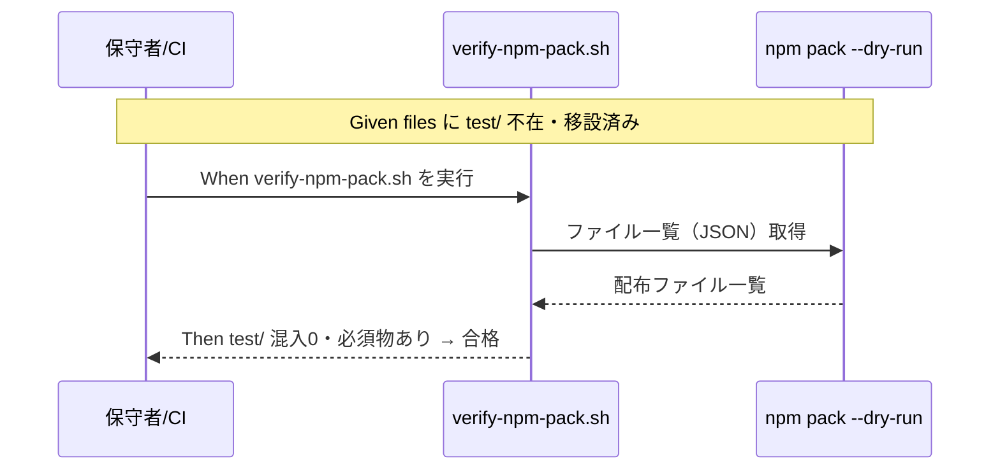

# 要件定義書: 自己テスト/カバレッジ基盤を配布物外（リポルート test/）へ移設

**プロジェクト名**: 自己テスト/カバレッジ基盤を配布物外（リポルート test/）へ移設
**作成日**: 2026 年 06 月 15 日
**最終更新**: 2026 年 06 月 15 日

> **重要**: **このドキュメントは常に更新**: 要件の変更や追加があった場合は、即座にこのドキュメントを更新してください。
>
> **用語**: [.agents/CONCEPTS.md §用語規約](../../../../../.agents/CONCEPTS.md#用語規約) を参照。

---

## 1. 概要

### 1.1 システム概要

本リポジトリは「パッケージの正本（配布物）」かつ「自己拡張する消費者（ドッグフーディング）」を兼ねる。現状、保守者専用の自己テスト/カバレッジ基盤 8 本が `.agents/scripts/test/` 配下にあり、`package.json` の `files: [".agents/"]` 経由で **npm 配布物に同梱**されてしまう。本件はこの 8 本をリポジトリルート `test/` へ移設し、配布物（`files`）から除外し、関連する全参照を新パスへ更新する。配布物（`.agents/`）は配布フレームワーク専用に純化する。挙動（各テストの検証内容・合否）は移設前後で同一を保つ。

### 1.2 用語集

| 用語 | 説明 |
| -------- | ------ |
| 配布物（パッケージ正本） | `npm pack` の tarball に含まれる消費者向けファイル群。`files` allowlist が正本。`.agents/`・`AGENTS.md`・`CLAUDE.md`・`bin/`・`README.md`・`.workflow/templates/`。 |
| 自己テスト基盤 | 本リポ自身を検証する保守者向けツール 8 本（runner / coverage / E2E / 各 test-*.sh）。 |
| 名前空間分離 | 配布物 / 自己拡張開発記録 / 消費者ランタイム生成物 を別パスに分け二重管理・配布汚染を防ぐ原則（`.agents-project/自己拡張ワークフロー.md`）。 |
| REPO_ROOT 解決 | スクリプトが自身の位置からリポジトリルートを算出する処理。現状 `$SCRIPT_DIR/../../..`（3 階層上）。移設後は階層が変わる。 |
| dangling 参照 | 移設後に存在しなくなる旧パス `.agents/scripts/test/...` を指したまま残る参照。 |

#### 移設対象 8 本

| # | スクリプト（旧パス `.agents/scripts/test/`） | 役割 | 移設先 |
|---|------|------|--------|
| 1 | `run-all.sh` | テスト一括 runner（`npm test` の実体） | `test/run-all.sh` |
| 2 | `coverage-check.sh` | kcov ラップ＋fail-under 判定 | `test/coverage-check.sh` |
| 3 | `e2e-install-uninstall.sh` | install/uninstall・カプセル化 E2E（40.8kB） | `test/e2e-install-uninstall.sh` |
| 4 | `test-audit.sh` | audit.sh の単体/結合テスト | `test/test-audit.sh` |
| 5 | `test-pretooluse-hook.sh` | PreToolUse フックのテスト | `test/test-pretooluse-hook.sh` |
| 6 | `test-run-all.sh` | runner 自体のテスト | `test/test-run-all.sh` |
| 7 | `test-coverage-check.sh` | coverage-check.sh のテスト | `test/test-coverage-check.sh` |
| 8 | `test-write-workflow-log-prevhash.sh` | prevhash 連鎖のテスト | `test/test-write-workflow-log-prevhash.sh` |

#### 主要な参照更新先（dangling 参照の解消対象）

| 参照元 | 現在の記述 | 更新内容 |
|--------|-----------|----------|
| `package.json` | `scripts.test = "bash .agents/scripts/test/run-all.sh"` | → `bash test/run-all.sh` |
| `package.json` | `files: [".agents/", ...]`（`test/` は含めない） | `test/` を**追加しない**（除外を維持）。混入ゼロを確認 |
| `.github/workflows/self-enforce.yml` | E2E step `bash .agents/scripts/test/e2e-install-uninstall.sh`、coverage step `bash .agents/scripts/test/coverage-check.sh`、コメント中の `run-all.sh` 等 | → `test/...` へ更新 |
| `.agents/scripts/verify-npm-pack.sh` | `forbidden`/`required` パターン（`test/` を禁止に含めるか検討。`.agents/scripts/test` 前提の記述は無いが、`test/` 混入を検知できること） | `test/` 配下混入を検知する禁止パターンを追加 |
| `.agents/scripts/coverage-check.sh`（移設後 `test/coverage-check.sh`） | `REPO_ROOT="$SCRIPT_DIR/../../.."`、`EXCLUDE_PATHS=.agents/scripts/test,...`、`RUNNER=$REPO_ROOT/.agents/scripts/test/run-all.sh`、`INCLUDE_PATHS=.agents/scripts` | REPO_ROOT 階層是正、`EXCLUDE_PATHS` から旧 `.agents/scripts/test` を除去（新 `test/` は INCLUDE 外のため不要）、`RUNNER` を `test/run-all.sh` へ |
| `run-all.sh`（移設後 `test/run-all.sh`） | `SCRIPT_DIR` 基準の `TESTS` 配列・usage コメント | パスは相対のため配列値は不変だが usage コメント `.agents/scripts/test/...` を `test/...` へ |
| 各 `test-*.sh` / `e2e-*.sh` | `REPO_ROOT="$SCRIPT_DIR/../../.."`、usage コメント `bash .agents/scripts/test/<name>.sh` | REPO_ROOT 階層是正（`$SCRIPT_DIR/..` または `git rev-parse --show-toplevel`）、usage コメント更新 |
| `.agents/SETUP.md` | §テスト節の `bash .agents/scripts/test/...`（複数行）、E2E 参照 | → `test/...` へ |
| `README.md` | `npm test # = bash .agents/scripts/test/run-all.sh` 等 | → `test/run-all.sh` |
| `build-adapters.sh` | `rm -rf "$out/.agents/scripts/test"` | 対象消失。除去または無害化（dangling を残さない） |
| `.agents-project/COVERAGE_EXCEPTIONS.md` | COV-001 の対象 `.agents/scripts/test/`・`適用手段` 列の `--exclude-path=.agents/scripts/test`、関連リンク | 新パス `test/` 前提に更新（INCLUDE 外なら除外行の扱いを見直し） |
| `.agents-project/自己拡張ワークフロー.md` | 名前空間テーブル（配布物 / 開発記録 / 生成物） | `test/`（保守者自己テスト・非配布・git 追跡）を**追記** |

---

## 2. 機能要件

### 2.1 ユーザーストーリー

#### ストーリー 1: 配布物から保守者テストを排除する

- **As a** パッケージを採用する消費者
- **I want to** `npm install` 時に保守者専用の自己テストが配布されないこと
- **So that** 自分のプロジェクトに不要・無関係なファイルが混入せず、混乱しない

**受け入れ基準**:

- `npm pack`（`verify-npm-pack.sh`）の配布ファイル一覧に `test/` 配下の自己テストが 0 件（SC-1）。
- 配布物には `.agents/` フレームワーク本体・`AGENTS.md`・`CLAUDE.md`・`bin/`・`README.md`・`.workflow/templates/` のみが含まれる（必須物は維持）。

#### ストーリー 2: 保守者が新パスから全テストを実行できる

- **As a** 本リポの保守者（自己拡張・ドッグフーディング）
- **I want to** 移設後も `npm test` と個別テストが新パスから動くこと
- **So that** 移設前と同じ手順・結果でローカル/CI 検証を続けられる

**受け入れ基準**:

- `npm test`（→`test/run-all.sh`）が全 PASS（挙動同一・SC-2）。
- 個別実行 `bash test/<name>.sh` が全 PASS。E2E・カバレッジ含む。
- CI `self-enforce.yml` の E2E step・coverage step が新パスで green。

#### ストーリー 3: 参照とパス解決が壊れない

- **As a** 本リポの保守者
- **I want to** 旧パスへの参照が 1 つも残らず、各スクリプトの REPO_ROOT 解決が新配置で成立すること
- **So that** dangling 参照や REPO_ROOT 誤認による潜在バグを残さない

**受け入れ基準**:

- `.agents/scripts/test/` への dangling 参照が 0 件（SC-3。grep で確認）。
- 各スクリプトの REPO_ROOT が新配置で正しく解決される（`git rev-parse --show-toplevel` 等への是正を含む）。
- 名前空間テーブルに `test/`（非配布）が追記される（SC-4）。

### 2.2 BDD ユースケース

#### ユースケース 1: npm 配布物に自己テストを含めない

**シナリオ 1: pack に test/ が混入しない**

```gherkin
Feature: 配布物から保守者自己テストを除外する
  Scenario: npm pack に test/ 配下が含まれない
    Given 自己テスト8本が リポルート test/ へ移設され、package.json の files に test/ が含まれない
    When verify-npm-pack.sh（npm pack --dry-run --json）を実行する
    Then 配布ファイル一覧に test/ 配下のパスが 1 件も含まれない
    And .agents/ / AGENTS.md / CLAUDE.md / bin/agents-md.js / README.md / package.json / .workflow/templates/ は引き続き含まれる
```

**処理フロー**:



#### ユースケース 2: 移設後も全テストが新パスで PASS する

**シナリオ 2: npm test が新パスで全 PASS**

```gherkin
Feature: 移設後の挙動同一性
  Scenario: npm test が新パスで全 PASS する
    Given 8本が test/ へ移設され、package.json scripts.test が bash test/run-all.sh を指す
    And 各スクリプトの REPO_ROOT 解決が新配置で成立する
    When tmp 隔離環境で npm test（= bash test/run-all.sh）を実行する
    Then 全テストが PASS（または依存欠如で SKIP）し FAIL=0 で exit 0 になる
    And E2E（install/uninstall）・カバレッジ計測も新パスで成立する
```

**シナリオ 3: 個別テストが新パスで動く**

```gherkin
Feature: 移設後の挙動同一性
  Scenario: 個別テストが新パスから REPO_ROOT を正しく解決する
    Given test/test-pretooluse-hook.sh が test/ 直下にある
    When tmp 隔離で bash test/test-pretooluse-hook.sh を実行する
    Then スクリプトが REPO_ROOT をリポジトリルートとして正しく解決し、テストが PASS する
```

#### ユースケース 3: dangling 参照ゼロと名前空間の更新

**シナリオ 4: 旧パス参照が残らない**

```gherkin
Feature: 参照の一括更新
  Scenario: .agents/scripts/test/ への dangling 参照が 0 件
    Given 移設と参照更新が同一 issue で完了している
    When grep -rn ".agents/scripts/test" をリポジトリ全体（close 済み開発記録を除く）に実行する
    Then 実コード/設定/ドキュメントの該当ヒットが 0 件（package.json・self-enforce.yml・README・SETUP・verify-npm-pack・coverage-check・run-all・build-adapters・COVERAGE_EXCEPTIONS を含む）
```

**シナリオ 5: 名前空間テーブルに test/ を追記**

```gherkin
Feature: 名前空間分離の一貫性
  Scenario: 自己拡張ワークフローに test/（非配布）を追記する
    Given .agents-project/自己拡張ワークフロー.md の役割分担テーブルがある
    When test/（保守者自己テスト・非配布・git 追跡）の行を追記する
    Then 配布物 / 開発記録 / 消費者生成物 / 保守者自己テスト の4分類が一覧で確認できる
```

**シナリオ 6: 検証は tmp 隔離で行い本リポを破壊しない**

```gherkin
Feature: 安全な検証
  Scenario: 検証で本リポの本番ファイルを破壊しない
    Given 検証対象は install/uninstall/E2E/カバレッジを含む
    When mktemp -d ＋ git archive HEAD で隔離環境を作って検証する
    Then 本リポの .agents/ .claude/ .cursor/ .workflow/ workflow.db に破壊的変更が発生しない
    And 検証後に一時環境を片付ける
```

### 2.3 ビジネスルール

- **配布物 vs 自己拡張開発記録 vs 消費者生成物 vs 保守者自己テスト** の名前空間分離を守る（自己テストは `test/`・非配布・git 追跡）。
- 検証ロジックの **single source of truth**（CI とローカルで二重化しない）を維持する。runner/coverage/E2E は「呼ぶだけ」のラッパ方針を崩さない。
- 検証は必ず tmp 隔離で行い、本リポの本番ファイルを破壊しない。
- カバレッジ閾値（`FAIL_UNDER=100`）は下げない。`test/`（自己テスト自身）は分母に含めない。

---

## 3. 非機能要件

### 3.1 パフォーマンス要件

- 移設はパス変更のみで、テスト・カバレッジの実行時間に有意な悪化を生じさせない。

### 3.2 セキュリティ要件

- 破壊的操作なし。install/uninstall/E2E/カバレッジ検証は `mktemp -d` ＋ `git archive HEAD | tar -x` の隔離環境で行う。

### 3.3 ユーザビリティ要件

- 保守者の実行手順は `npm test`・`bash test/<name>.sh` と簡潔さを維持する（深いパスへの後退をしない）。

### 3.4 可用性要件

- CI `self-enforce.yml` が移設後も green を維持する（構文チェック・schema・diff-zero・pack leak・version・E2E・coverage・audit の各 step）。

---

## 4. 外部インターフェース要件

### 4.1 API 要件

- `npm test` エントリポイント（`package.json` `scripts.test`）はコマンド名を維持し、参照先のみ `test/run-all.sh` へ更新する。
- `verify-npm-pack.sh` の禁止/必須パターン I/F に `test/` 配下混入の検知を追加する（必須物リストは不変）。

### 4.2 データ形式要件

- カバレッジ出力（cobertura XML / HTML、`.coverage/`）・workflow.db の形式は不変。

---

## 5. 制約事項

- chain 順序厳守・テンプレート必須セクション厳守。00 に issue_id 発行済み。完了後に必ず書記（write-workflow-log）。
- 移設対象 8 本の検証内容・合否ロジックは変更しない（挙動同一）。
- スクリプトのリポルート解決を新パスで成立させる（`git rev-parse --show-toplevel` への是正を推奨。相対 `../../..` 前提が残る箇所を是正）。
- 検証は tmp 隔離。破壊的操作なし。

---

## 6. 参考資料

### プロジェクトドキュメント

- [`00_要求定義.md`](./00_要求定義.md) - 要求定義
- [.agents-project/自己拡張ワークフロー.md](../../../../../.agents-project/自己拡張ワークフロー.md)（名前空間・tmp 隔離）
- [.agents-project/COVERAGE_EXCEPTIONS.md](../../../../../.agents-project/COVERAGE_EXCEPTIONS.md)（COV-001）

### その他の参考資料

- [package.json](../../../../../package.json)、[.github/workflows/self-enforce.yml](../../../../../.github/workflows/self-enforce.yml)
- [.agents/scripts/verify-npm-pack.sh](../../../../../.agents/scripts/verify-npm-pack.sh)、[.agents/scripts/build-adapters.sh](../../../../../.agents/scripts/build-adapters.sh)
- [.agents/SETUP.md](../../../../../.agents/SETUP.md)、[README.md](../../../../../README.md)
- 前提 issue: `docs/maintainer/workflow/20260615_054806_テスト実行基盤の整備/`、`docs/maintainer/workflow/20260615_054810_カバレッジ計測の自リポ適用/`

---

## 7. 前のステップ

この要件定義書は、以下のドキュメントを基に作成されています：

- **前**: [`00_要求定義.md`](./00_要求定義.md) - 要求定義フェーズ

---

## 8. 次のステップ

この要件定義書の承認後、以下のドキュメントを作成します：

- **次**: [`02_設計.md`](./02_設計.md) - 設計フェーズ
