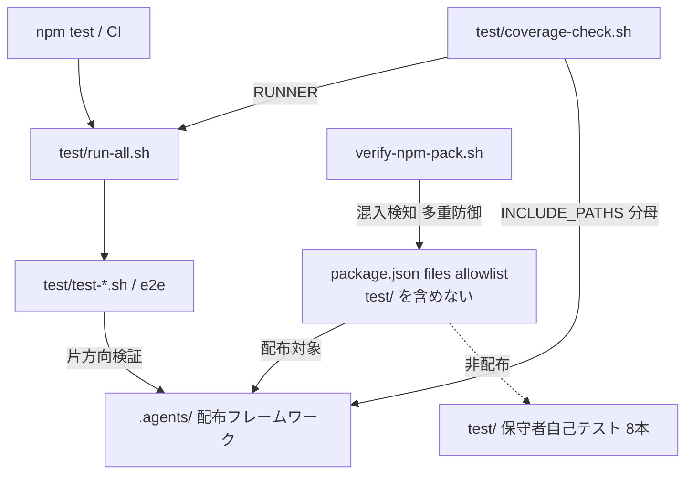
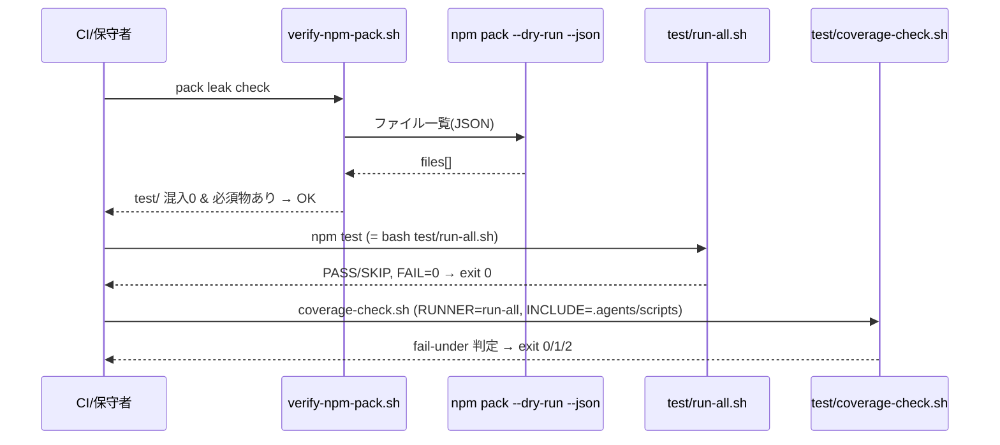
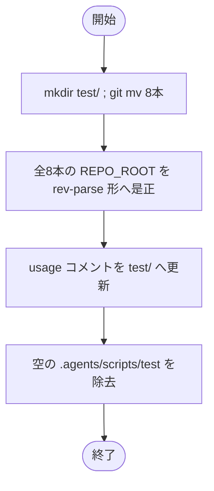

# 設計書: 自己テスト/カバレッジ基盤を配布物外（リポルート test/）へ移設

**プロジェクト名**: 自己テスト/カバレッジ基盤を配布物外（リポルート test/）へ移設
**作成日**: 2026 年 06 月 15 日
**最終更新**: 2026 年 06 月 15 日

> **重要**: **このドキュメントは常に更新**: 設計の変更や追加があった場合は、即座にこのドキュメントを更新してください。ドキュメントは「生きているドキュメント」として扱い、実装内容と常に同期させます。
>
> **用語**: [.agents/CONCEPTS.md §用語規約](../../../../../.agents/CONCEPTS.md#用語規約) を参照。

---

## 1. 設計概要

**必須**: 設計方針・原則は [.agents/spec/01\_設計原則.md](../../../../../.agents/spec/01_設計原則.md) を**先に参照**した上で適用するものを選び記載する。

### 1.1 設計方針

保守者向け自己テスト 8 本を配布物（`.agents/`）から物理的に切り離してリポルート `test/` へ移し、各スクリプトのリポルート解決を配置非依存（`git rev-parse --show-toplevel`）へ是正し、全参照を新パスへ同期する。**振る舞い（検証内容・合否ロジック）は不変**で「移設＋パス是正＋参照同期」のみを行う。

### 1.2 設計原則（本プロジェクトで適用するもの）

- **単一責務**: `.agents/` は「配布フレームワーク」、`test/` は「保守者自己テスト（非配布）」の単一責務に純化する。名前空間分離原則（配布物 / 自己拡張開発記録 / 消費者ランタイム生成物 / **保守者自己テスト**）の 4 分類目を明示する。
- **明確な境界**: 配布物境界（`package.json` `files` allowlist）と非配布物（`test/`）の境界を allowlist で機械的に保証し、`verify-npm-pack.sh` で多重防御する。
- **UNIX 哲学**: runner/coverage は「呼ぶだけ」のラッパに徹し、検証ロジックは各テスト本体の single source of truth に集約する方針を崩さない。
- **AIフレンドリー設計**: 浅いパス（`test/<name>.sh`、3 階層 → 1 階層）化で配置判断と参照が一意になる。[01\_設計原則 §AIフレンドリー設計](../../../../../.agents/spec/01_設計原則.md#aiフレンドリー設計)。

---

## 2. アーキテクチャ設計

### 2.1 責務・境界・参照関係

#### 2.1.1 責務一覧

| コンポーネント | 責務（1 文） |
| --- | --- |
| `test/`（新ディレクトリ） | 保守者自己テスト 8 本を保持する非配布の名前空間（git 追跡）。 |
| `test/run-all.sh` | 6 テストを順に呼び一括実行する runner（`npm test` の実体）。 |
| `test/coverage-check.sh` | kcov ラップ＋fail-under 判定。`INCLUDE_PATHS=.agents/scripts` を分母に計測する。 |
| `test/e2e-install-uninstall.sh` 他 6 本 | 各検証の single source of truth（本体ロジック不変）。 |
| `package.json` `files` | 配布物 allowlist。`test/` を含めない（＝非配布の正本）。 |
| `verify-npm-pack.sh` | pack ファイル一覧を検査し `test/` 混入と必須物欠落を検知（多重防御）。 |
| `build-adapters.sh` | アダプタ生成。移設後は `.agents/scripts/test` を rm する必要が消失。 |
| 参照群（CI/README/SETUP/台帳/名前空間） | 旧パスを新パスへ同期し dangling 参照を 0 にする。 |

#### 2.1.2 境界

- **入力**: 旧配置 `.agents/scripts/test/`（8 本）と、それを指す全参照。
- **出力**: 新配置 `test/`（8 本・パス是正済み）＋同期された全参照＋名前空間テーブルへの追記＋pack 混入検知。
- **他責務との境界**: テスト本体の検証ロジック・合否判定・カバレッジ閾値（`FAIL_UNDER=100`）・消費者向け配布契約（`.agents/`・`AGENTS.md`・`CLAUDE.md`・`bin/`・`README.md`・`.workflow/templates/`）は**本 issue の範囲外（不変）**。

#### 2.1.3 参照関係

呼び出し元 → 呼び出し先（移設後）:

- `npm test`（package.json）→ `test/run-all.sh` → `test/test-*.sh` / `test/e2e-install-uninstall.sh`（同一 dir・相対 `$SCRIPT_DIR/<name>.sh`）
- `self-enforce.yml`（CI）→ `test/e2e-install-uninstall.sh`・`test/coverage-check.sh`
- `test/coverage-check.sh` → `RUNNER=test/run-all.sh`（kcov ラップ対象）・`INCLUDE_PATHS=.agents/scripts`（分母）
- `test/test-run-all.sh` → `test/run-all.sh`（`$SCRIPT_DIR/run-all.sh`）
- `test/test-coverage-check.sh` → `test/coverage-check.sh`（A↔B 整合）＋ `.agents-project/COVERAGE_EXCEPTIONS.md`（台帳）
- 各 `test/*.sh` → `REPO_ROOT` 配下の被テスト対象（`.agents/enforcement/...`・`.agents/scripts/write-workflow-log.sh`・`bin/agents-md.js` 等）

循環参照なし。`test/`（非配布）→ `.agents/`（配布物）への片方向参照のみ（テストが配布物を検証する向き）。

### 2.2 システムアーキテクチャ

**必須**: 設計判断は [.agents/spec/06\_設計判断の優先順位.md](../../../../../.agents/spec/06_設計判断の優先順位.md)（可読性・単一責務・仕様整合）を参照。

- **採用パターン**: レイヤード名前空間分離（配布物層 / 非配布テスト層）＋ allowlist による配布境界の宣言的制御。
- **根拠**: spec 06 の「単一責務・仕様整合」優先。配布境界を `files` allowlist 1 か所に集約し、`verify-npm-pack.sh` を防御的検査として二重化する（CI とローカルで二重化しない＝検査ロジックは 1 本）。

#### 2.2.1 REPO_ROOT 解決の是正（中核設計判断）

現状は全スクリプトが `REPO_ROOT="$(cd "$SCRIPT_DIR/../../.." && pwd)"`（**3 階層上＝深さ依存**）。`test/` 直下では正しくは 1 階層上になるため、深さを書き換えるのではなく**配置非依存の堅牢解決へ統一**する。

```bash
# 採用（全 8 本で統一）。git 管理下では確実、フォールバックで非 git ツリーにも耐える。
# フォールバックは subshell で囲む（シェル演算子の優先順位対策。下記注記参照）。
REPO_ROOT="$(git -C "$SCRIPT_DIR" rev-parse --show-toplevel 2>/dev/null || (cd "$SCRIPT_DIR/.." && pwd))"
```

> **訂正（レビュー時・2026-06-15）**: 当初の式 `... || cd "$SCRIPT_DIR/.." && pwd` は **シェル演算子の優先順位バグ（二重パス）** を含む。`A || B && C` は `(A || B) && C` と解釈されるため、`rev-parse` が成功した場合でも末尾の `cd ... && pwd` が必ず実行され、`cd` がスクリプトのカレントディレクトリを動かす（git 成功時の意図しない副作用）。フォールバックを **subshell `( ... )` で囲む**ことで、(1) git 成功時はフォールバックを評価せず、(2) フォールバック時の `cd` を subshell に閉じ込めて呼び出し元の CWD を汚さない、の双方を満たす。**実装は subshell 版で確定**しており、本設計式をそれに一致させる（証跡: 全 8 本の REPO_ROOT が `|| (cd "$SCRIPT_DIR/.." && pwd)` 形で統一）。

- **理由**: `e2e-install-uninstall.sh`・`test-pretooluse-hook.sh`・`test-audit.sh` は `cd "$REPO_ROOT" && git archive HEAD` を用いるため git ツリー前提で `rev-parse` が確実。フォールバック `$SCRIPT_DIR/..`（1 階層上）は git 無し環境でも `test/` の新階層で正しくルートを返す。subshell 化により git 成功時に `cd` が走らないことを保証する。
- **`run-all.sh`**: `REPO_ROOT` を直接使わず `SCRIPT_DIR` 基準で各テストを相対呼び出しするため、`SCRIPT_DIR` の取得行のみ維持し階層是正の影響を受けない（`TESTS` 配列値＝ファイル名は不変）。

#### 2.2.2 アーキテクチャ図（本プロジェクトの構成）



### 2.3 コンポーネント構成

- **配布物層（`.agents/` ほか）**: 不変。`.agents/scripts/` から `test/` サブツリーのみ物理的に消える。
- **非配布テスト層（`test/`）**: 新規。8 本＋（移設後の）`coverage-check.sh` を保持。`SCRIPT_DIR` 相対の相互参照（run-all → 各 test、test-run-all → run-all、test-coverage-check → coverage-check）は同一 dir 内のため**相対参照値は不変**、変わるのは `REPO_ROOT` 解決と usage コメントのみ。
- **配布境界制御**: `files` allowlist（`test/` 不在を維持）＋ `verify-npm-pack.sh`（forbidden へ `test/` を追加）。

### 2.4 データフロー



---

## 3. 機能設計

### 3.1 機能 1: 8 本の物理移設とパス解決是正

#### 3.1.1 概要

`git mv .agents/scripts/test/*.sh test/` で 8 本を移設し、各スクリプトの `REPO_ROOT` 解決を §2.2.1 の統一形へ是正、usage コメントの旧パスを `test/...` へ更新する。

#### 3.1.2 処理フロー



#### 3.1.3 入力・出力

- **入力**: `.agents/scripts/test/` 8 本。
- **出力**: `test/` 8 本（パス是正・コメント更新済み）、空ディレクトリ除去。

#### 3.1.4 エラーハンドリング

- `git mv` で履歴を保持（リネーム追跡）。移設後 `bash -n` で 8 本の構文を確認。

### 3.2 機能 2: 配布除外の確実化（多重防御）

#### 3.2.1 概要

`files` allowlist は元々 `test/` を含まないため `test/` は配布されない。これを設計で明示し、`verify-npm-pack.sh` の `forbidden` に `test/` 配下混入の検知パターンを追加して多重防御する。

#### 3.2.2 入力・出力

- **入力**: `npm pack --dry-run --json` のファイル一覧。
- **出力**: `test/` 混入 0 の合否判定（混入時 exit 1）。

#### 3.2.3 設計（forbidden パターン追加）

```js
// verify-npm-pack.sh の forbidden 判定に追加（リポルート test/ 配下は非配布）
if (/^test\//.test(p)) return true;   // 保守者自己テスト（非配布。allowlist 外だが多重防御で明示検知）
```

`required` リスト（`.agents/`・`AGENTS.md`・`CLAUDE.md`・`bin/agents-md.js`・`README.md`・`package.json`・`.workflow/templates/`）は不変。

### 3.3 機能 3: 参照の一括同期と build-adapters 無害化

#### 3.3.1 概要

旧パス `.agents/scripts/test/` への全参照を新パスへ同期し、`build-adapters.sh` の `rm -rf .../.agents/scripts/test` を除去（対象消失による dangling 解消）、名前空間テーブルへ `test/` を追記する。

#### 3.3.2 build-adapters.sh の是正

現状 line 88: `rm -rf "$out/.agents/scripts/lib" "$out/.agents/scripts/test"`。移設後 `.agents/scripts/test` は存在しないため、当該トークンのみ除去し `lib` の除外は維持する（`rm -rf "$out/.agents/scripts/lib"`）。

#### 3.3.3 カバレッジ二重化（A↔B）整合の維持

`test/coverage-check.sh` の `EXCLUDE_PATHS` から `.agents/scripts/test` を除去する（新 `test/` は `INCLUDE_PATHS=.agents/scripts` の配下ではない＝分母外のため除外不要）。残るのは `.agents/scripts/lib/deploy-skills.sh`（COV-002）のみ。これに合わせ `COVERAGE_EXCEPTIONS.md` の COV-001 行の「適用手段」列から `--exclude-path=.agents/scripts/test` の token を除去し、COV-001 を「`test/`（INCLUDE 外につき分母に元々入らない）」旨へ更新する。

> **重要（A↔B 整合）**: `test/test-coverage-check.sh` の `test_ledger_exclude_consistency`（B→A）と `test_exclude_in_ledger`（A→B）は、台帳の `--exclude-path=<path>` と `EXCLUDE_PATHS` の双方向一致を検査する。COV-001 から `--exclude-path=.agents/scripts/test` を残したまま `EXCLUDE_PATHS` から外すと A→B 検査で FAIL する。**両方から同時に除去**して整合させること（テスト本体は不変・データ整合のみ）。

#### 3.3.4 参照同期マトリクス（dangling 解消の全対象）

| # | ファイル | 現記述 | 更新後 |
| --- | --- | --- | --- |
| 1 | `package.json` `scripts.test` | `bash .agents/scripts/test/run-all.sh` | `bash test/run-all.sh` |
| 2 | `package.json` `files` | `test/` 不在 | 変更なし（不在維持＝混入ゼロ） |
| 3 | `.github/workflows/self-enforce.yml` E2E step | `bash .agents/scripts/test/e2e-install-uninstall.sh` | `bash test/e2e-install-uninstall.sh` |
| 4 | 同 coverage step | `bash .agents/scripts/test/coverage-check.sh` | `bash test/coverage-check.sh` |
| 5 | 同 コメント（50/138/141） | `.agents/scripts/test/coverage-check.sh`・`run-all.sh`・`e2e-...` | `test/...` |
| 6 | `verify-npm-pack.sh` forbidden | （`test/` 検知なし） | `^test/` 検知を追加（§3.2.3） |
| 7 | `test/coverage-check.sh` REPO_ROOT | `$SCRIPT_DIR/../../..` | rev-parse 形（§2.2.1） |
| 8 | 同 EXCLUDE_PATHS | `.agents/scripts/test,.agents/scripts/lib/deploy-skills.sh` | `.agents/scripts/lib/deploy-skills.sh` |
| 9 | 同 RUNNER | `$REPO_ROOT/.agents/scripts/test/run-all.sh` | `$REPO_ROOT/test/run-all.sh` |
| 10 | 同 INCLUDE_PATHS | `.agents/scripts` | 変更なし（分母不変） |
| 11 | 同 usage コメント | `bash .agents/scripts/test/coverage-check.sh` | `bash test/coverage-check.sh` |
| 12 | `test/run-all.sh` usage（16/18） | `.agents/scripts/test/run-all.sh`・`<name>.sh` | `test/...` |
| 13 | 各 `test/test-*.sh`・`e2e-*.sh` REPO_ROOT | `$SCRIPT_DIR/../../..` | rev-parse 形 |
| 14 | 同 usage コメント | `bash .agents/scripts/test/<name>.sh` | `bash test/<name>.sh` |
| 15 | `.agents/SETUP.md`（143/181/187/192-209/表） | `.agents/scripts/test/...` 複数 | `test/...` |
| 16 | `README.md`（168/169） | `.agents/scripts/test/run-all.sh` | `test/run-all.sh` |
| 17 | `build-adapters.sh`（88） | `rm -rf ".../lib" ".../scripts/test"` | `rm -rf ".../lib"`（test token 除去） |
| 18 | `COVERAGE_EXCEPTIONS.md`（5/15/16/31 リンク） | `.agents/scripts/test/coverage-check.sh`・COV-001 対象・`--exclude-path=.agents/scripts/test` | `test/coverage-check.sh`・COV-001 を INCLUDE 外表現へ・exclude token 除去（§3.3.3） |
| 19 | `.agents-project/自己拡張ワークフロー.md` 名前空間テーブル | （`test/` 行なし） | `test/`＝保守者自己テスト・非配布・git 追跡 を追記（SC-4） |

> **対象範囲の注記**: `docs/maintainer/workflow/close/` 配下（完了済み開発記録）と本 issue（`20260615_105835_...`）配下の文章上の `.agents/scripts/test` 言及は**改変しない**（過去証跡の保全）。SC-3 の dangling 0 は「実コード・設定・現行ドキュメント」を対象とする。

---

## 4. データ設計

データモデル変更なし。カバレッジ出力（cobertura XML/HTML・`.coverage/`）・`workflow.db` の形式は不変。本 issue はファイル配置とパス参照の変更のみ。

---

## 5. API 設計

新規 API なし。既存 I/F は以下を維持し参照先のみ更新:

| I/F | メソッド/形 | 変更 |
| --- | --- | --- |
| `npm test` | `package.json scripts.test` | コマンド名維持・参照先 `test/run-all.sh` |
| `bash test/<name>.sh` | 個別実行 | パスのみ `test/` へ |
| `run-all.sh` 終了コード契約 | 0=全PASS/SKIP, 1=FAIL有 | 不変 |
| `coverage-check.sh` 終了コード | 0=達成 / 1=未達・解析失敗 / 2=kcov 不在 SKIP | 不変 |
| `verify-npm-pack.sh` | forbidden/required 判定 | forbidden に `^test/` 追加・required 不変 |

---

## 6. テスト戦略

テスト戦略の観点定義は [RULES.md テスト戦略必須要件](../../../../../.agents/RULES.md#テスト戦略必須要件)、BDD 形式は [TEST_BDD_FORMAT.md](../../../../../.agents/TEST_BDD_FORMAT.md) を参照。本設計では割当のみ記載する。

### 6.1 対象ごとのテスト割り当て

| 対象 | 単体 | 結合 | E2E | クリティカル観点 | バリデーション観点 | 未達理由/補足 |
| --- | --- | --- | --- | --- | --- | --- |
| 8 本の移設＋REPO_ROOT 是正 | ○ | ○ | ○ | 新パスで全 PASS＝挙動同一（SC-2） | REPO_ROOT がルートを正解 | 既存 8 本を新パスから実行して担保 |
| pack 配布除外 | × | ○ | ○ | `test/` 混入 0（SC-1） | forbidden `^test/` が機能 | `verify-npm-pack.sh` で機械検査 |
| 参照同期（dangling 0） | × | ○ | × | `grep -rn` 該当 0（SC-3） | 旧パス残存なし | grep スイープで検査 |
| カバレッジ A↔B 整合 | ○ | ○ | × | `test-coverage-check.sh` PASS | EXCLUDE_PATHS↔台帳一致 | 台帳と変数を同時除去 |
| build-adapters 無害化 | × | ○ | ○ | アダプタ生成 diff-zero | dangling rm 残存なし | CI diff-zero step で担保 |
| 名前空間追記（SC-4） | × | × | × | テーブルに `test/` 行存在 | 4 分類網羅 | 目視＋grep |
| tmp 隔離（SC-5） | × | × | ○ | 本リポ追跡物に破壊なし | `git status` 差分が想定内 | mktemp＋git archive |

### 6.2 監査・レビューでの確認（証跡）

§6.1 の割当と 03 のタスク別テスト観点・BDD が対応していることを確認する。01 の BDD（シナリオ 1〜6）と 03 のテスト観点を突き合わせる。検証は tmp 隔離（`mktemp -d`＋`git archive HEAD | tar -x`）で行い本リポを破壊しない。

---

## 7. UI 設計

該当なし（CLI/スクリプトのみ。画面なし）。

---

## 8. セキュリティ設計

### 8.1 認証・認可

該当なし。

### 8.2 データ保護

検証は `mktemp -d`＋`git archive HEAD | tar -x` の隔離環境で行い、本リポの `.agents/`・`.claude/`・`.cursor/`・`.workflow/`・`workflow.db` を破壊しない（[.agents-project/自己拡張ワークフロー.md §テストの tmp 隔離](../../../../../.agents-project/自己拡張ワークフロー.md)）。破壊的操作なし。

---

## 9. 非機能要件への対応

### 9.1 パフォーマンス

パス変更のみ。テスト・カバレッジ実行時間に有意な悪化なし。

### 9.2 可用性

CI `self-enforce.yml` の全 step（構文・schema・CLI build・diff-zero・pack leak・version・E2E・coverage・audit）が移設後も green を維持する。構文 step は `.agents/scripts/*.sh` を対象とするため、移設で `test/` 配下が対象外になるが、それらは `run-all.sh`/`coverage-check.sh` 経由で実行検証される（COV-001 既定方針と整合）。

---

## 10. 参考資料

### プロジェクトドキュメント

- [`01_要件定義.md`](./01_要件定義.md) - 要件定義
- [`00_要求定義.md`](./00_要求定義.md) - 要求定義
- [.agents-project/自己拡張ワークフロー.md](../../../../../.agents-project/自己拡張ワークフロー.md)（名前空間・tmp 隔離）
- [.agents-project/COVERAGE_EXCEPTIONS.md](../../../../../.agents-project/COVERAGE_EXCEPTIONS.md)（COV-001/002/003）

### その他の参考資料

- [package.json](../../../../../package.json)、[.github/workflows/self-enforce.yml](../../../../../.github/workflows/self-enforce.yml)
- [.agents/scripts/verify-npm-pack.sh](../../../../../.agents/scripts/verify-npm-pack.sh)、[.agents/scripts/build-adapters.sh](../../../../../.agents/scripts/build-adapters.sh)
- [.agents/spec/06\_設計判断の優先順位.md](../../../../../.agents/spec/06_設計判断の優先順位.md)

---

## 11. 前のステップ

- **前**: [`01_要件定義.md`](./01_要件定義.md) - 要件定義フェーズ

---

## 12. 次のステップ

- **次**: [`03_実装計画.md`](./03_実装計画.md) - 実装計画フェーズ
