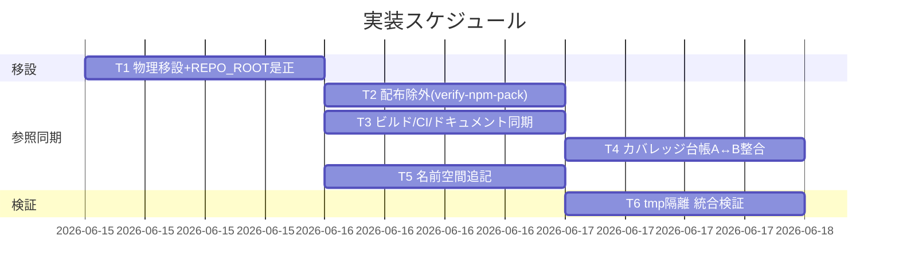

# 実装計画書: 自己テスト/カバレッジ基盤を配布物外（リポルート test/）へ移設

**プロジェクト名**: 自己テスト/カバレッジ基盤を配布物外（リポルート test/）へ移設
**作成日**: 2026 年 06 月 15 日
**最終更新**: 2026 年 06 月 15 日

> **重要**: **このドキュメントは常に更新**: 実装計画の変更・進捗・バグの記録があれば即座に更新してください。
>
> **用語**: [.agents/CONCEPTS.md §用語規約](../../../../../.agents/CONCEPTS.md#用語規約) を参照。

---

## 1. 実装概要

### 1.1 実装方針（必須）

`git mv` で 8 本を `test/` へ移し、REPO_ROOT 解決を `git rev-parse --show-toplevel`（fallback `$SCRIPT_DIR/..`）へ統一、全参照を新パスへ同期して dangling 0・pack 混入 0 を機械検証する。検証は tmp 隔離で行い振る舞い同一を確認する。

### 1.2 実装順序（必須）



実装順: **T1 → (T2・T3・T4・T5 並行) → T6**。

---

## 2. タスク分解

**必須**: 各タスクに「テスト観点」（2.x.3）と「BDD」（2.x.4）を記載する。観点定義は [02\_設計 §6](./02_設計.md) と [RULES テスト戦略](../../../../../.agents/RULES.md#テスト戦略必須要件)・[TEST_BDD_FORMAT](../../../../../.agents/TEST_BDD_FORMAT.md) を参照。

### 2.1 タスク 1: 8 本の物理移設と REPO_ROOT 解決の是正

#### 2.1.1 概要（必須）

`.agents/scripts/test/` の 8 本を `test/` へ git mv し、各スクリプトのリポルート解決を配置非依存へ是正する。

#### 2.1.2 実装内容（必須）

- `mkdir -p test/` ののち `git mv .agents/scripts/test/*.sh test/`（8 本）。空になった `.agents/scripts/test/` を除去。
- `coverage-check.sh`・`e2e-install-uninstall.sh`・`test-audit.sh`・`test-pretooluse-hook.sh`・`test-coverage-check.sh`・`test-write-workflow-log-prevhash.sh` の `REPO_ROOT="$(cd "$SCRIPT_DIR/../../.." && pwd)"` を `REPO_ROOT="$(git -C "$SCRIPT_DIR" rev-parse --show-toplevel 2>/dev/null || (cd "$SCRIPT_DIR/.." && pwd))"` へ統一（フォールバックは **subshell `( ... )` で囲む**）。コメント `# .agents/scripts/test -> repo root` を削除/更新。
  - **訂正（レビュー時・2026-06-15）**: 当初記載の `... || cd "$SCRIPT_DIR/.." && pwd`（subshell なし）は **シェル優先順位バグ（二重パス）**。`A || B && C` は `(A || B) && C` と解釈され、`rev-parse` 成功時も末尾 `cd ... && pwd` が走り CWD を動かす。フォールバックを subshell 化して是正する。**実装は subshell 版で確定済み**（全 8 本）であり、本実装計画式をそれに一致させる。
- `run-all.sh` は `SCRIPT_DIR` 取得のみ維持（`TESTS` 配列値＝ファイル名は不変、相互参照は同一 dir 相対）。`test-run-all.sh` の `RUNNER="$SCRIPT_DIR/run-all.sh"`・`test-coverage-check.sh` の `TARGET="$SCRIPT_DIR/coverage-check.sh"` は同一 dir のため不変。
- 全 8 本の usage コメント `bash .agents/scripts/test/<name>.sh` を `bash test/<name>.sh` へ。

#### 2.1.3 テスト観点（必須）

##### 単体（必須）

- `test/test-pretooluse-hook.sh` を `test/` 直下から実行すると `REPO_ROOT` がリポジトリルートに解決され PASS する（深さ依存除去の確認）。
- `bash -n test/*.sh` が 8 本すべて構文 OK。

##### 結合/API

- `test/run-all.sh` が 6 テストを順に呼び FAIL=0 で exit 0（相互参照の相対解決が新 dir で成立）。

##### E2E/受け入れ

- tmp 隔離（`git archive HEAD | tar -x`）で `bash test/run-all.sh` 全 PASS（E2E・coverage 含む）＝移設前と挙動同一（SC-2）。

##### バリデーション

- 該当なし。

#### 2.1.4 単体テスト仕様（BDD）（必須）

```gherkin
Feature: 移設後の REPO_ROOT 解決
  Scenario: test/ 直下からリポジトリルートを正しく解決する
    Given test/test-pretooluse-hook.sh が test/ 直下にある
    When tmp 隔離で bash test/test-pretooluse-hook.sh を実行する
    Then REPO_ROOT がリポジトリルートに解決され、テストが PASS する
```

```bash
# Given: 8本を test/ へ移設し REPO_ROOT を rev-parse 形へ是正済み
# When : tmp 隔離環境で run-all を実行
out="$(cd "$TMP" && bash test/run-all.sh 2>&1)"; rc=$?
# Then : FAIL=0 で exit 0（移設前と同一の合否）
[ "$rc" -eq 0 ] && grep -q 'FAIL: 0' <<<"$out"
```

#### 2.1.5 依存関係

- 先行: なし（最初に実施）。後続: T2〜T5 が本タスクの新配置に依存。

#### 2.1.6 見積もり

- **工数**: 2h / **優先度**: 高

### 2.2 タスク 2: 配布除外の確実化（verify-npm-pack 多重防御）

#### 2.2.1 概要（必須）

`files` allowlist が `test/` を含まない（＝非配布）ことを前提に、`verify-npm-pack.sh` の forbidden へ `^test/` 検知を追加し pack 混入を機械検査する。

#### 2.2.2 実装内容（必須）

- `verify-npm-pack.sh` の forbidden 判定に `if (/^test\//.test(p)) return true;` を追加。コメントで「保守者自己テスト（非配布）」を明示。
- `package.json` `files` は変更しない（`test/` 不在を維持）。

#### 2.2.3 テスト観点（必須）

##### 単体

- 該当なし（forbidden は node インライン判定）。

##### 結合/API

- `bash .agents/scripts/verify-npm-pack.sh` が配布一覧に `test/` 0 件・必須物あり → exit 0。

##### E2E/受け入れ

- `npm pack --dry-run --json` のファイル一覧に `test/` 配下が 1 件も無いことを確認（SC-1）。`.agents/`・`AGENTS.md`・`CLAUDE.md`・`bin/agents-md.js`・`README.md`・`package.json`・`.workflow/templates/` は含まれる。

##### バリデーション

- （回帰）`test/` を誤って `files` に加えた仮想ケースで forbidden が LEAK を検知し exit 1（防御が機能することの確認・本番では設定変更しない）。

#### 2.2.4 単体テスト仕様（BDD）（必須）

```gherkin
Feature: 配布物から保守者自己テストを除外する
  Scenario: npm pack に test/ 配下が含まれない
    Given 8本が test/ へ移設され files に test/ が含まれない
    When verify-npm-pack.sh を実行する
    Then 配布一覧に test/ 配下が 0 件、必須物は含まれ、exit 0 になる
```

```bash
# Given: 移設済み・files に test/ なし・forbidden に ^test/ 追加済み
# When : pack leak check を実行
out="$(bash .agents/scripts/verify-npm-pack.sh 2>&1)"; rc=$?
# Then : test/ 混入なしで合格
[ "$rc" -eq 0 ] && ! grep -q 'LEAK: test/' <<<"$out"
```

#### 2.2.5 依存関係

- 先行: T1。

#### 2.2.6 見積もり

- **工数**: 1h / **優先度**: 高

### 2.3 タスク 3: ビルド・CI・ドキュメントの参照同期

#### 2.3.1 概要（必須）

旧パスを指す `package.json`・`self-enforce.yml`・`build-adapters.sh`・`README.md`・`SETUP.md`・`coverage-check.sh` の参照を新パスへ同期し、build-adapters の dangling rm を無害化する。

#### 2.3.2 実装内容（必須）

- `package.json` `scripts.test`: `bash .agents/scripts/test/run-all.sh` → `bash test/run-all.sh`。
- `self-enforce.yml`: E2E step `bash test/e2e-install-uninstall.sh`、coverage step `bash test/coverage-check.sh`、関連コメント（50/138/141 行付近）を `test/...` へ。
- `build-adapters.sh` line 88: `rm -rf "$out/.agents/scripts/lib" "$out/.agents/scripts/test"` → `rm -rf "$out/.agents/scripts/lib"`（test token 除去）。
- `coverage-check.sh`(移設後 `test/coverage-check.sh`): `RUNNER` を `$REPO_ROOT/test/run-all.sh`、`INCLUDE_PATHS=.agents/scripts` 維持、usage コメント更新（`EXCLUDE_PATHS` は T4）。
- `README.md`(168/169)・`SETUP.md`(143/181/187/192-209 と表) の `.agents/scripts/test/...` を `test/...` へ。

#### 2.3.3 テスト観点（必須）

##### 単体

- 該当なし（参照文字列の置換）。

##### 結合/API

- `grep -rn ".agents/scripts/test" <現行コード・設定・ドキュメント>` がヒット 0（close/本 issue 配下の文章は除く）（SC-3）。
- `build-adapters.sh claude cursor` 実行後、追跡ファイル diff-zero（CI step #3 相当）。

##### E2E/受け入れ

- `self-enforce.yml` 構文（YAML 妥当）と各 step が新パスで成立する（ローカル相当検証）。

##### バリデーション

- 該当なし。

#### 2.3.4 単体テスト仕様（BDD）（必須）

```gherkin
Feature: 参照の一括更新
  Scenario: .agents/scripts/test/ への dangling 参照が 0 件
    Given 移設と参照更新が同一 issue で完了している
    When grep -rn ".agents/scripts/test" を現行コード/設定/ドキュメントに実行する
    Then 該当ヒットが 0 件になる
```

```bash
# Given: 全参照を test/ へ同期済み
# When : 旧パスを grep（close 済み開発記録・本 issue は除外）
hits="$(grep -rn '\.agents/scripts/test' --include='*.sh' --include='*.yml' \
  --include='*.md' --include='*.json' . | grep -vE 'workflow/close|20260615_105835')"
# Then : ヒット 0
[ -z "$hits" ]
```

#### 2.3.5 依存関係

- 先行: T1。

#### 2.3.6 見積もり

- **工数**: 2h / **優先度**: 高

### 2.4 タスク 4: カバレッジ台帳の A↔B 整合維持

#### 2.4.1 概要（必須）

`EXCLUDE_PATHS` から `.agents/scripts/test` を除去し、`COVERAGE_EXCEPTIONS.md` の COV-001 を同時に是正して `test-coverage-check.sh` の A↔B 双方向検査を PASS させる。

#### 2.4.2 実装内容（必須）

- `test/coverage-check.sh` `EXCLUDE_PATHS` 既定値: `.agents/scripts/test,.agents/scripts/lib/deploy-skills.sh` → `.agents/scripts/lib/deploy-skills.sh`。
- `COVERAGE_EXCEPTIONS.md`: COV-001 行の「適用手段」列から `--exclude-path=.agents/scripts/test` を除去し、COV-001 を「`test/`＝INCLUDE_PATHS 外につき分母に元々入らない」旨へ書き換え。リンク `.agents/scripts/test/coverage-check.sh`（5/31 行）を `test/coverage-check.sh` へ。COV-002（`deploy-skills.sh`）は不変。

#### 2.4.3 テスト観点（必須）

##### 単体

- 台帳の各 `--exclude-path=<p>` が `EXCLUDE_PATHS` に存在（B→A）。
- `EXCLUDE_PATHS` の各 `<p>` が台帳に記載（A→B）。残るのは `.agents/scripts/lib/deploy-skills.sh` のみで双方向一致。

##### 結合/API

- `bash test/test-coverage-check.sh` がユースケース4（除外二重化整合）含め全 PASS。

##### E2E/受け入れ

- `bash test/coverage-check.sh`（kcov あり環境）が fail-under 判定で exit 0、kcov 不在で exit 2（SKIP）。

##### バリデーション

- 該当なし。

#### 2.4.4 単体テスト仕様（BDD）（必須）

```gherkin
Feature: カバレッジ除外の二重化整合
  Scenario: EXCLUDE_PATHS と台帳が双方向一致する
    Given EXCLUDE_PATHS と台帳から .agents/scripts/test を同時に除去した
    When bash test/test-coverage-check.sh を実行する
    Then 台帳除外と EXCLUDE_PATHS が双方向一致し、整合テストが PASS する
```

```bash
# Given: EXCLUDE_PATHS と台帳から旧 test パスを同時除去済み
# When : coverage-check の自己テストを実行
out="$(cd "$TMP" && bash test/test-coverage-check.sh 2>&1)"; rc=$?
# Then : A↔B 整合含め全 PASS（exit 0）
[ "$rc" -eq 0 ]
```

#### 2.4.5 依存関係

- 先行: T1（coverage-check.sh の移設後パスに依存）、T2 と並行可。

#### 2.4.6 見積もり

- **工数**: 1.5h / **優先度**: 高

### 2.5 タスク 5: 名前空間テーブルへ test/ を追記

#### 2.5.1 概要（必須）

`.agents-project/自己拡張ワークフロー.md` の役割分担テーブルに `test/`（保守者自己テスト・非配布・git 追跡）の行を追記し 4 分類を網羅する。

#### 2.5.2 実装内容（必須）

- §理由（名前空間の役割分担）テーブルに `test/` | 保守者自己テスト（非配布） | 追跡する を追記（SC-4）。

#### 2.5.3 テスト観点（必須）

##### 単体

- テーブルに `test/` 行が存在し「非配布」「追跡する」が記載される（grep 確認）。

##### 結合/API

- 該当なし。

##### E2E/受け入れ

- 配布物 / 開発記録 / 消費者生成物 / 保守者自己テスト の 4 分類が一覧で確認できる。

##### バリデーション

- 該当なし。

#### 2.5.4 単体テスト仕様（BDD）（必須）

```gherkin
Feature: 名前空間分離の一貫性
  Scenario: 自己拡張ワークフローに test/（非配布）を追記する
    Given 役割分担テーブルがある
    When test/（保守者自己テスト・非配布・git 追跡）の行を追記する
    Then 4 分類が一覧で確認できる
```

```bash
# Given/When: 名前空間テーブルに test/ 行を追記済み
# Then: test/ と「非配布」が同一テーブルに存在
grep -qE '`?test/`?.*非配布' .agents-project/自己拡張ワークフロー.md
```

#### 2.5.5 依存関係

- 先行: なし（独立）。

#### 2.5.6 見積もり

- **工数**: 0.5h / **優先度**: 中

### 2.6 タスク 6: tmp 隔離での統合検証

#### 2.6.1 概要（必須）

`mktemp -d`＋`git archive HEAD | tar -x` の隔離環境で全テスト・pack・dangling・YAML を一括検証し、本リポ追跡物を破壊しないことを確認する。

#### 2.6.2 実装内容（必須）

- 隔離環境で `bash test/run-all.sh`（SC-2）、`bash .agents/scripts/verify-npm-pack.sh`（SC-1）、`grep` dangling 検査（SC-3）、YAML 妥当性確認、本リポ側 `git status` に想定外差分が無いこと（SC-5）。

#### 2.6.3 テスト観点（必須）

##### 単体

- 該当なし（統合）。

##### 結合/API

- SC-1〜SC-5 を一括検査し全合格。

##### E2E/受け入れ

- 隔離環境で install/uninstall E2E・coverage を含む全テストが PASS（または依存欠如で SKIP）し FAIL=0。

##### バリデーション

- 検証後に tmp を `rm -rf` で片付け、本リポの `.agents/`・`.claude/`・`.cursor/`・`.workflow/`・`workflow.db` に破壊なし。

#### 2.6.4 単体テスト仕様（BDD）（必須）

```gherkin
Feature: 安全な統合検証
  Scenario: 隔離環境で全検証を通し本リポを破壊しない
    Given install/uninstall/E2E/coverage を含む検証対象がある
    When mktemp -d ＋ git archive HEAD で隔離環境を作り全検証する
    Then SC-1〜SC-5 が合格し、本リポ追跡物に破壊的変更が無い
```

```bash
# Given: 隔離環境を作成
TMP="$(mktemp -d)"; git archive HEAD | tar -x -C "$TMP"
# When : 隔離内で統合検証
( cd "$TMP" && bash test/run-all.sh && bash .agents/scripts/verify-npm-pack.sh )
# Then : 本リポ追跡物に想定外差分なし → 片付け
git -C "$(git rev-parse --show-toplevel)" status --porcelain --untracked-files=no
rm -rf "$TMP"
```

#### 2.6.5 依存関係

- 先行: T1〜T5（全タスク完了後）。

#### 2.6.6 見積もり

- **工数**: 1.5h / **優先度**: 高

---

## テスト観点

- **SC-1**: `npm pack`（`verify-npm-pack.sh`）に `test/` 配下 0 件（T2/T6）。
- **SC-2**: 8 本＋`npm test` が新パスで全 PASS＝挙動同一（T1/T4/T6）。
- **SC-3**: `.agents/scripts/test/` への dangling 参照 0（T3、close/本 issue 除外）。
- **SC-4**: 名前空間テーブルに `test/` 追記（T5）。
- **SC-5**: tmp 隔離検証・本リポ破壊なし（T6）。
- **付随**: A↔B カバレッジ整合（T4）、`self-enforce.yml` YAML 妥当・後方互換（T3）。

---

## 単体テスト

移設対象 8 本の検証ロジックは不変のため新規単体テストは追加しない。既存テストを**新パスから再実行**して挙動同一を担保する（T1）。台帳整合は既存 `test/test-coverage-check.sh` のユースケース4 で担保（T4）。

---

## BDD

各タスク §2.x.4 の Gherkin を正とする。01_要件定義のシナリオ 1〜6 と対応:

| 01 シナリオ | 対応タスク |
| --- | --- |
| S1 pack に test/ が混入しない | T2 |
| S2 npm test が新パスで全 PASS | T1 |
| S3 個別テストが新パスで動く | T1 |
| S4 dangling 参照 0 件 | T3 |
| S5 名前空間に test/ 追記 | T5 |
| S6 tmp 隔離で破壊しない | T6 |

---

## 3. 実装スケジュール

### 3.1 マイルストーン

| マイルストーン | 期日 | 成果物 |
| --- | --- | --- |
| M1 移設完了 | T1 後 | `test/` 8 本・REPO_ROOT 是正 |
| M2 参照同期完了 | T2-T5 後 | dangling 0・pack 検知・台帳整合・名前空間追記 |
| M3 統合検証合格 | T6 後 | SC-1〜SC-5 合格証跡 |

### 3.2 実装フェーズ

#### フェーズ 1: 移設

- **タスク**: T1。

#### フェーズ 2: 参照同期

- **タスク**: T2・T3・T4・T5（並行）。

#### フェーズ 3: 検証

- **タスク**: T6。

---

## 4. テスト計画

### 4.1 テストの優先順位

- クリティカル: SC-1（配布混入）・SC-2（挙動同一）を厚く検証（T2/T6・T1/T6）。
- 回帰: `self-enforce.yml` 全 step・既存 8 本を新パスで再実行に含める。

---

## 5. リスク管理

### 5.1 実装リスク

- **リスク**: REPO_ROOT 解決が新配置で崩れる。
  - **対策**: rev-parse 統一＋fallback、tmp 隔離で実 PASS 確認（T1/T6）。
- **リスク**: 参照漏れによる dangling・CI 赤化。
  - **対策**: `grep -rn` 全洗い出し（§3.3.4 マトリクス 19 項）＋`verify-npm-pack.sh` 機械検査（T3/T2）。
- **リスク**: 台帳と EXCLUDE_PATHS の片側のみ除去で A↔B 検査 FAIL。
  - **対策**: T4 で両方を同時除去し `test-coverage-check.sh` で検証。

---

## 6. 参考資料

### プロジェクトドキュメント

- [`02_設計.md`](./02_設計.md) - 設計
- [`01_要件定義.md`](./01_要件定義.md) - 要件定義

### その他の参考資料

- [package.json](../../../../../package.json)、[.github/workflows/self-enforce.yml](../../../../../.github/workflows/self-enforce.yml)
- [.agents/scripts/verify-npm-pack.sh](../../../../../.agents/scripts/verify-npm-pack.sh)、[.agents/scripts/build-adapters.sh](../../../../../.agents/scripts/build-adapters.sh)
- [.agents-project/COVERAGE_EXCEPTIONS.md](../../../../../.agents-project/COVERAGE_EXCEPTIONS.md)

---

## 7. 前のステップ

- **前**: [`02_設計.md`](./02_設計.md) - 設計フェーズ

---

## 8. 次のステップ

- プロジェクトは 1 つの issue として完結する（サブ issue 分割なし）。承認後、実装フェーズ（execution）に直接進む。

**用語**: [.agents/CONCEPTS.md §用語規約](../../../../../.agents/CONCEPTS.md#用語規約) を参照。
