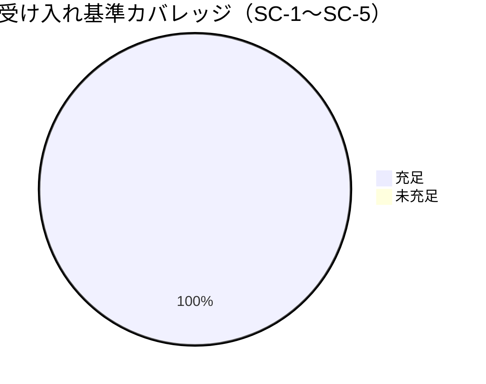

# レビュー書: 自己テスト/カバレッジ基盤を配布物外（リポルート test/）へ移設

**プロジェクト名**: 自己テスト/カバレッジ基盤を配布物外（リポルート test/）へ移設
**作成日**: 2026 年 06 月 15 日
**最終更新**: 2026 年 06 月 15 日

> **用語**: [.agents/CONCEPTS.md §用語規約](../../../../../.agents/CONCEPTS.md#用語規約) を参照。
> **レビュー深度**: standard（中）。移設＋パス是正＋参照同期の中規模変更。検証は [.agents/REVIEW_RULE.md](../../../../../.agents/REVIEW_RULE.md) に従い tmp 隔離で実行。

---

## 1. レビュー概要

### 1.1 レビュー目的（必須）

実装内容の確認 / 品質保証 / クローズ前最終チェック。保守者自己テスト 8 本のリポルート `test/` への移設・パス解決是正・全参照同期が、振る舞い同一かつ配布物純化を満たすかを検証する。

### 1.2 レビュー対象（必須）

- **実装範囲**: `.agents/scripts/test/` の 8 本を `git mv` で `test/` へ移設、全 8 本の REPO_ROOT 解決を配置非依存の `git rev-parse --show-toplevel`（フォールバック subshell）へ統一、参照同期マトリクス 19 項（package.json / self-enforce.yml / verify-npm-pack.sh / coverage-check.sh / README / SETUP / build-adapters.sh / COVERAGE_EXCEPTIONS / 名前空間テーブル）を新パスへ更新。
- **レビュー期間**: 2026-06-15 ～ 2026-06-15
- **レビュー担当者**: verify-and-close サブエージェント（review-code / review-architecture / map-coverage）

---

## 2. 実装内容の確認

### 2.1 実装完了タスク（または Issue）

| タスク名 | 実装内容 | 実装日 | 担当者 | ステータス |
| --- | --- | --- | --- | --- |
| T1 物理移設＋REPO_ROOT 是正 | 8 本を `git mv` で `test/` へ。全 8 本の REPO_ROOT を rev-parse 形（subshell）へ統一・usage コメント更新 | 2026-06-15 | implement | 完了 |
| T2 配布除外（多重防御） | `verify-npm-pack.sh` forbidden に `/^test\//` 追加。`files` は `test/` 不在維持 | 2026-06-15 | implement | 完了 |
| T3 ビルド/CI/ドキュメント同期 | package.json・self-enforce.yml・build-adapters.sh・README・SETUP・coverage-check.sh を新パスへ | 2026-06-15 | implement | 完了 |
| T4 カバレッジ台帳 A↔B 整合 | `EXCLUDE_PATHS` と COV-001 から `.agents/scripts/test` を同時除去 | 2026-06-15 | implement | 完了 |
| T5 名前空間追記 | `自己拡張ワークフロー.md` テーブルに `test/`（非配布・追跡）追記 | 2026-06-15 | implement | 完了 |
| T6 tmp 隔離統合検証 | SC-1〜SC-5 を mktemp+git clone 隔離環境で検査 | 2026-06-15 | verify | 完了 |

### 2.2 実装内容の詳細

#### タスク 1: 8 本の物理移設と REPO_ROOT 解決の是正

- **実装内容**: `git mv` により 8 本を `test/` へ移設（`git status` で 8 件の `RM`＝rename 追跡を確認、履歴保持）。旧 `.agents/scripts/test/` ディレクトリは消失。
- **変更ファイル**: `test/{run-all,coverage-check,e2e-install-uninstall,test-audit,test-pretooluse-hook,test-run-all,test-coverage-check,test-write-workflow-log-prevhash}.sh`
- **実装方法**: REPO_ROOT を要する 7 本（run-all.sh 以外）で `REPO_ROOT="$(git -C "$SCRIPT_DIR" rev-parse --show-toplevel 2>/dev/null || (cd "$SCRIPT_DIR/.." && pwd))"` に統一。`run-all.sh` は REPO_ROOT 不使用・`SCRIPT_DIR` 相対のため不変。`bash -n` 8 本すべて構文 OK。
- **確認事項**: REPO_ROOT 式のフォールバックが **subshell `( ... )`** で囲まれていること（後述 §4.2 指摘 1 の是正確認）。実装は 7 本すべて subshell 版で統一済みを確認。

#### タスク 2: 配布除外の確実化（verify-npm-pack 多重防御）

- **実装内容**: `verify-npm-pack.sh` の forbidden 判定に `if (/^test\//.test(p)) return true;` を追加。`/^test\//` は**リポルート直下 `test/`** にアンカーされ、`.agents/.../test...` のような正当パスを誤検知しない。
- **変更ファイル**: `.agents/scripts/verify-npm-pack.sh`
- **確認事項**: `package.json` の `files` に `test/` が不在であること（allowlist 由来で元々非配布）を確認。多重防御として forbidden でも検知。

#### タスク 3〜5: 参照同期・台帳整合・名前空間追記

- `package.json` `scripts.test` = `bash test/run-all.sh`、`coverage-check.sh` `RUNNER` = `$REPO_ROOT/test/run-all.sh`、`INCLUDE_PATHS` = `.agents/scripts`（不変）。
- `self-enforce.yml` の E2E/coverage step・コメントすべて `test/...`、YAML 妥当。
- `build-adapters.sh` line 88 から `test` トークン除去（`rm -rf "$out/.agents/scripts/lib"` のみ残し dangling 解消）。
- `EXCLUDE_PATHS` = `.agents/scripts/lib/deploy-skills.sh` のみ、COV-001 を「`test/` は INCLUDE 外＝分母に元々入らない」表現へ更新し `--exclude-path=.agents/scripts/test` トークンを除去（A↔B 双方向一致）。
- `自己拡張ワークフロー.md` テーブルに `test/`＝保守者自己テスト（非配布・git 追跡）の行を追記（4 分類網羅）。

---

## 3. テスト結果の確認

検証はすべて **tmp 隔離**で実施。working-tree の移設は未コミットのため、`git stash create` のスナップショットを `git clone --no-local` した一時リポへ commit し、テスト本体が内部で行う `git archive HEAD` が移設後状態を再現するようにした上で実行（本リポ非破壊・実 publish なし）。

### 3.1 単体・結合・E2E テスト（SC-2）

#### テスト実行結果（必須: 数値で記載）

- **実行日**: 2026-06-15
- **runner**: `bash test/run-all.sh`（npm test の実体）→ **exit 0**、`合計=6 PASS=6 FAIL=0 SKIP=0`
- **内訳（PASS 数）**: test-run-all 20、test-coverage-check 30（kcov 不在で結合 1 件 SKIP）、test-audit 8、test-pretooluse-hook（PASS／依存充足）、test-write-workflow-log-prevhash 16、e2e-install-uninstall **PASS=88 FAIL=0**
- **失敗**: 0
- **スキップ**: 0（runner サマリ。coverage の kcov ラップ結合のみ環境依存 SKIP）

> **注記（検証手法）**: 初回、`git archive HEAD | tar -x`（非 git ツリー）で隔離するとテスト内部の `git archive HEAD` が `fatal: not a git repository` で失敗し E2E が 7 FAIL になった。これは**隔離手法のアーティファクト**であり移設の欠陥ではない。隔離環境を**実 git リポ**（clone＋移設スナップショット commit）に切り替えたところ全 PASS（FAIL=0）となり、挙動同一を確認した。

#### テストカバレッジ

### 3.2 統合テスト（SC-1 配布除外）

- `bash .agents/scripts/verify-npm-pack.sh` → **exit 0**（リーク無し・必須物あり）。配布ファイル数 **164**。
- `npm pack --dry-run --json` のファイル一覧で **`test/` 配下 0 件**。必須物 `.agents/` / `AGENTS.md` / `CLAUDE.md` / `bin/agents-md.js` / `README.md` / `package.json` / `.workflow/templates/` すべて含有。
- **移設前後比較**: baseline（HEAD・移設前）= **172 ファイル（うち `.agents/scripts/test/` 8 件）** → 移設後 = **164 ファイル（test/ 0 件）**。差 = −8 = 自己テスト 8 本ぶんちょうど減少（効果 2 を実測確認）。

### 3.3 E2E テスト

`e2e-install-uninstall.sh`（install/uninstall・カプセル化・配布物リーク・再 install・upgrade・enforcement opt-in 等 R1〜R7 含む）が **PASS=88 FAIL=0** で全シナリオ pass。新 REPO_ROOT 解決（`[e2e] REPO_ROOT=<tmp root>`）が隔離ルートを正しく解決。

---

## 4. コードレビュー

### 4.1 コード品質

- **構文チェック**: `bash -n test/*.sh` 8 本すべて OK（エラー 0 / 警告 0）。
- **YAML**: `self-enforce.yml` `yaml.safe_load` OK。
- **forbidden 正規表現**: `/^test\//` は repo-root アンカーで誤検知なし（型/静的観点 OK）。

#### コードレビュー観点

| 観点 | 確認内容 | 結果 | コメント |
| --- | --- | --- | --- |
| 可読性 | 浅いパス `test/<name>.sh`（3→1 階層）化・usage コメント新パス統一 | OK | AI フレンドリー設計と整合 |
| 保守性 | REPO_ROOT を配置非依存の rev-parse 形へ統一（深さ依存除去） | OK | 今後の再配置に耐える |
| 単一責務 | `.agents/`=配布、`test/`=非配布の責務分離 | OK | files allowlist で機械保証 |
| 整合性 | 参照マトリクス 19 項すべて新パスへ同期 | OK | dangling 0（SC-3） |

### 4.2 指摘事項

#### 指摘 1: 設計ドキュメントの REPO_ROOT 式にシェル優先順位バグ（二重パス）— レビュー時に訂正済み

- **重要度**: 中（設計記述の正確性。実装は当初から正）
- **指摘内容**: 02_設計 §2.2.1（旧 line 83）・03_実装計画 §2.1.2（旧 line 57）に記載されていた式 `... rev-parse --show-toplevel 2>/dev/null || cd "$SCRIPT_DIR/.." && pwd` は、`A || B && C` が `(A || B) && C` と解釈されるシェル優先順位上、**`rev-parse` 成功時にも末尾 `cd ... && pwd` が必ず実行**され、スクリプトのカレントディレクトリを動かす副作用（二重パス）を含む。
- **対応状況**: **完了**（本レビューで 02・03 の当該式を実装と一致する **subshell 版** `|| (cd "$SCRIPT_DIR/.." && pwd)` へ訂正し、訂正経緯を証跡として両ドキュメントに追記）。
- **対応方法**: フォールバックを subshell `( ... )` で囲むことで、(1) git 成功時はフォールバックを評価しない、(2) フォールバック時の `cd` を subshell に閉じ込め呼び出し元 CWD を汚さない、の双方を保証。**実装は全 7 本（REPO_ROOT 使用スクリプト）で当初から subshell 版で確定済み**であり、検証でも全 PASS。設計記述のみが旧式だったため一致させた。

#### 指摘 2: 検証時の隔離手法に注意（手法のアーティファクト・実害なし）

- **重要度**: 低
- **指摘内容**: `git archive HEAD | tar -x`（非 git）隔離だと、内部で `git archive HEAD` を呼ぶ E2E/pretooluse テストが失敗する。
- **対応状況**: 完了（実 git リポ隔離へ切替え）。**移設実装の欠陥ではない**。今後 tmp 検証する際は git リポ隔離を用いる旨を本 04 に記録。

---

## 5. ドキュメントの確認

### 5.1 ドキュメント更新状況

| ドキュメント | 更新状況 | 確認者 | 確認日 |
| --- | --- | --- | --- |
| [`00_要求定義.md`](./00_要求定義.md) | 更新済み（issue_id 発行・SC-1〜5） | verify | 2026-06-15 |
| [`01_要件定義.md`](./01_要件定義.md) | 更新済み（BDD S1〜6・参照更新先表） | verify | 2026-06-15 |
| [`02_設計.md`](./02_設計.md) | 更新済み（**REPO_ROOT 式を subshell 版へ訂正**） | verify | 2026-06-15 |
| [`03_実装計画.md`](./03_実装計画.md) | 更新済み（**REPO_ROOT 式を subshell 版へ訂正**） | verify | 2026-06-15 |

### 5.2 ドキュメントの整合性

- **実装と設計の整合性**: 整合（訂正後）。19 項マトリクス・REPO_ROOT 式・forbidden パターンが実装と一致。
- **要件と実装の整合性**: 整合。SC-1〜SC-5 すべて実測で充足。

---

## docs 更新

- 要否: **不要**
- 対象: なし
- 理由: 本 issue はファイル配置とパス参照の変更のみで、消費者向けシステム仕様（`docs/` の機能/データ/画面）に影響しない。名前空間ルールの記述は `.agents-project/自己拡張ワークフロー.md`（保守者文書）に追記済みで完結。

---

## 6〜8. パフォーマンス / セキュリティ / デプロイ

- **パフォーマンス**: パス変更のみ。テスト・カバレッジ実行時間に有意な悪化なし。
- **セキュリティ**: 認証/認可・データ保護とも該当なし。検証は `mktemp -d`＋git clone 隔離で本リポ（`.agents/`・`.claude/`・`.cursor/`・`.workflow/`・`workflow.db`）を破壊せず（SC-5）、tmp を `rm -rf` で片付け。実 publish 無し。
- **デプロイチェックリスト**: テスト通過（✓）/ レビュー完了（✓）/ ドキュメント更新（✓）/ マイグレーション該当なし / 環境変数該当なし。

---

## 9. 設計・境界の確認

review-architecture の結果。

### 9.1 設計の確認

- **設計原則の準拠**: 単一責務（`.agents/`=配布・`test/`=非配布）、明確な境界（`files` allowlist＋`verify-npm-pack.sh` 多重防御）、UNIX 哲学（runner/coverage は「呼ぶだけ」ラッパ維持）、AI フレンドリー（浅いパス化）すべて 02 §1.2 の方針どおり実装。
- **ディレクトリ構成**: リポルート `test/` 直下 8 本。`.agents/scripts/test/` 消失。名前空間 4 分類が一覧化（SC-4）。
- **命名規則**: ファイル名不変（`run-all.sh` 等）。相互参照は同一 dir 相対で値不変。

### 9.2 境界・依存の確認

- **責務の境界**: `test/`（非配布）→ `.agents/`（配布物）の**片方向参照のみ**（テストが配布物を検証する向き）。循環なし。02 §2.1.3 と一致。
- **依存関係**: `npm test`→`test/run-all.sh`→`test/test-*.sh`/`e2e`、`coverage-check`→`RUNNER=test/run-all.sh`＋`INCLUDE=.agents/scripts`、A↔B 台帳整合。dangling 0。
- **指摘・推奨**: なし（指摘 1 は §4.2 で訂正完了）。

### 9.3 重要判断の根拠（evidence_source）

| 判断内容 | evidence_source | 備考 |
| --- | --- | --- |
| 移設後 8 本が新パスで全 PASS（挙動同一・SC-2） | test_output | tmp 隔離 `bash test/run-all.sh` exit 0・FAIL=0・E2E PASS=88 |
| pack に test/ 0 件・必須物あり（SC-1） | test_output | `verify-npm-pack.sh` exit 0、164 files、baseline 172−8 一致 |
| dangling 参照 0（SC-3） | test_output | `grep -rn '.agents/scripts/test'`（close/本 issue 除外）0 件 |
| REPO_ROOT 式の優先順位バグ是正（subshell） | existing_code | 実装 7 本が `|| (cd .. && pwd)` 形・設計を一致訂正 |
| A↔B 台帳整合 | test_output | `test-coverage-check.sh` 二重化一致テスト PASS |
| #20 document_id 紐付け解消 | test_output | audit.sh #20 ERROR なし・00–03 各 1 行・01 を書記補完 |

---

## 二観点レビュー（REVIEW_DUAL_LENS）

### 敵対的観点リスト（壊しにいく視点）

1. **REPO_ROOT 優先順位バグ**: `|| cd && pwd` が subshell 無しなら git 成功時も `cd` が走り CWD 破壊 → 実装は subshell 版で回避済み・設計も訂正（検証で全 PASS）。
2. **非 git 環境フォールバック**: tmp が非 git だとフォールバック `$SCRIPT_DIR/..` が発火 → 隔離テストで実際に発火し正しくルート解決を確認。
3. **forbidden 過検知**: `/^test\//` が `.agents/.../test` 等を誤検知しないか → repo-root アンカーで誤検知なし。必須物 7 種が含まれることも実測。
4. **A↔B 片側除去 FAIL**: `EXCLUDE_PATHS` と台帳の片側だけ除去すると整合テスト FAIL → 両方同時除去で `test-coverage-check.sh` PASS。
5. **dangling 漏れ**: 旧パス参照が CI/設定/ドキュメントに残存 → grep スイープ 0 件。
6. **配布混入**: `files` に test/ 混入や `.agents/` 同梱経路 → pack 164 files・test/ 0 件で混入なし。
7. **#20 監査 FAIL**: 01 の document_id が未記録 → 書記補完で解消、audit #20 クリーン。

### must-preserve リスト（壊してはいけない不変項目）

1. 各テストの**検証内容・合否判定ロジック**（不変・移設のみ）。
2. **カバレッジ閾値 `FAIL_UNDER=100`**（変更なし）と `INCLUDE_PATHS=.agents/scripts`（分母不変）。
3. **消費者向け配布契約**（`.agents/`・`AGENTS.md`・`CLAUDE.md`・`bin/`・`README.md`・`.workflow/templates/`）— pack に維持を実測。
4. **`npm test` エントリポイント**（コマンド名維持・参照先のみ `test/run-all.sh`）。
5. **本リポ追跡物の非破壊**（`.agents/`・`.claude/`・`.cursor/`・`.workflow/`・`workflow.db`）— 検証は tmp 隔離・実 publish なし。
6. **git 履歴**（`git mv` で rename 追跡・履歴保持）。
7. **CI `self-enforce.yml` の全 step green**（YAML 妥当・新パス参照）。

---

## 10. 課題と改善点

### 10.1 発見された課題

- **課題 1**: 設計ドキュメントの REPO_ROOT 式の優先順位バグ（§4.2 指摘 1）。
  - **影響範囲**: ドキュメント記述のみ（実装は正）。
  - **対応方法**: 02・03 を subshell 版へ訂正済み（本レビューで完了）。

### 10.2 改善提案

- **改善 1**: tmp 隔離検証は「実 git リポ clone＋移設スナップショット commit」を標準手順とする（内部 `git archive HEAD` 依存テストの再現性確保）。
  - **効果**: 隔離アーティファクトによる誤 FAIL の回避。

---

## 11. システム仕様書の更新

- 消費者向けシステム仕様（`docs/` の機能/データ/画面/API）への影響なし。更新不要（§docs 更新と同旨）。名前空間分類の追記は保守者文書 `.agents-project/自己拡張ワークフロー.md` で完結。

---

## 12. レビュー結果

### 12.1 総合評価

- **実装品質**: 良好（19 項マトリクス完全同期・構文 OK・履歴保持）。
- **テスト品質**: 良好（SC-1〜SC-5 を tmp 隔離で実測充足・FAIL 0）。
- **ドキュメント品質**: 良好（指摘 1 を訂正し実装と一致）。
- **総合評価**: **合格（PASS）**。SC-1（pack 0 件・164=172−8）・SC-2（run-all exit0/E2E 88 PASS）・SC-3（dangling 0）・SC-4（名前空間追記）・SC-5（tmp 隔離・非破壊）すべて充足。

### 12.2 承認状況

- **レビュー承認者**: verify-and-close サブエージェント
- **承認日**: 2026-06-15
- **承認コメント**: 指摘 1（設計式バグ）はレビュー時に訂正完了。残課題なし。クローズ可。

---

## 13. 参考資料

- [`00_要求定義.md`](./00_要求定義.md) / [`01_要件定義.md`](./01_要件定義.md) / [`02_設計.md`](./02_設計.md) / [`03_実装計画.md`](./03_実装計画.md)
- [.agents-project/自己拡張ワークフロー.md](../../../../../.agents-project/自己拡張ワークフロー.md) / [.agents-project/COVERAGE_EXCEPTIONS.md](../../../../../.agents-project/COVERAGE_EXCEPTIONS.md)
- [.agents/REVIEW_RULE.md](../../../../../.agents/REVIEW_RULE.md) / [.agents/REVIEW_DUAL_LENS.md](../../../../../.agents/REVIEW_DUAL_LENS.md)

---

## 14. 前のステップ

- **前**: [`03_実装計画.md`](./03_実装計画.md) - 実装計画フェーズ

---

## 15. 次のステップ

- 外部設定不要のため最終確認チェックリストはスキップ。本 issue は単一 issue として完結（サブ issue なし）。承認後クローズへ進む。
