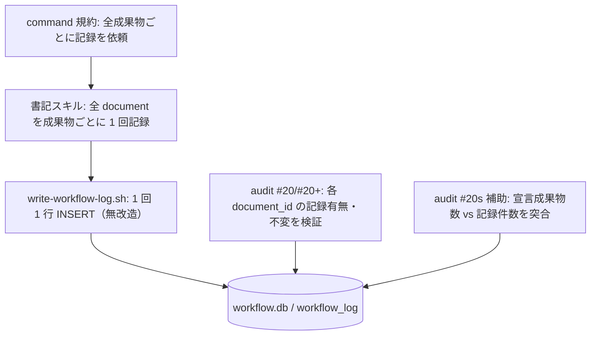
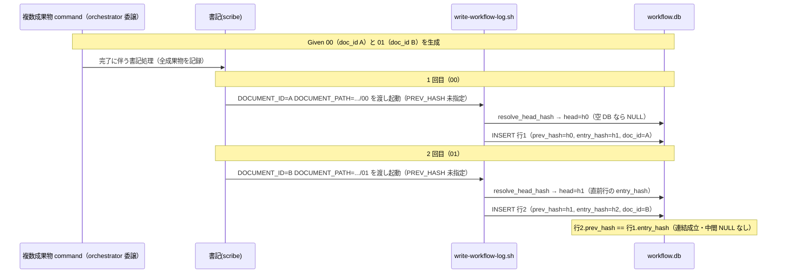
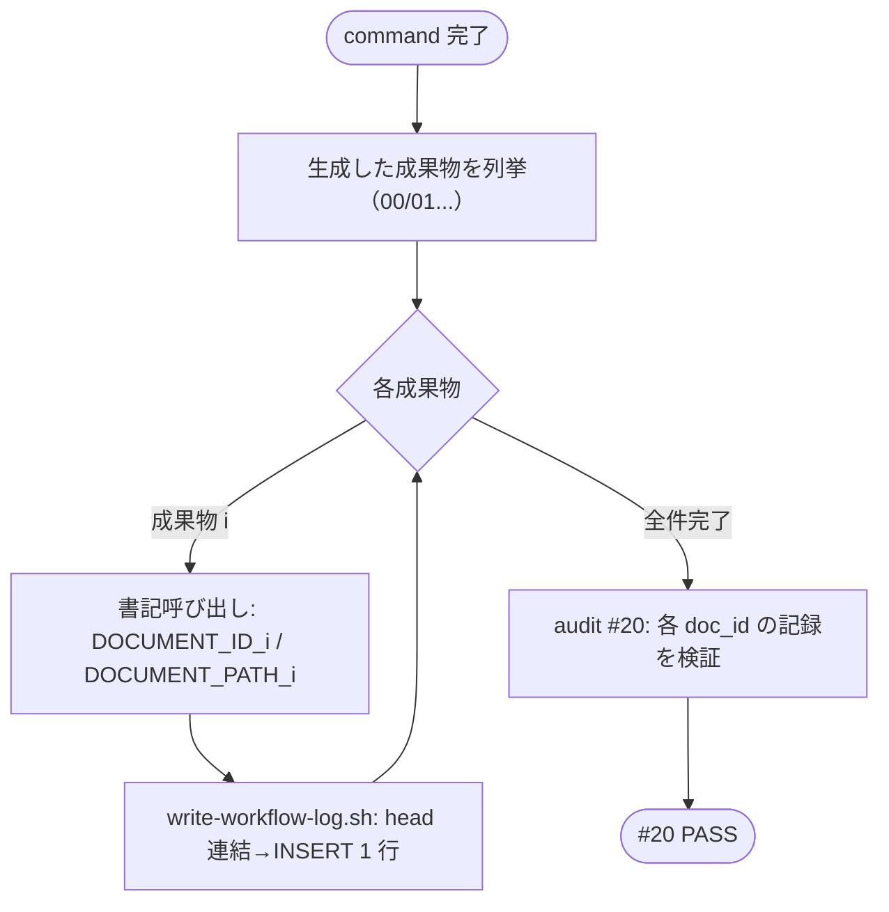

# 設計書: audit#20 の複数成果物 document_id 紐付け恒久対策

**プロジェクト名**: audit#20 の複数成果物 document_id 紐付け恒久対策
**作成日**: 2026 年 06 月 15 日
**最終更新**: 2026 年 06 月 15 日

> **重要**: **このドキュメントは常に更新**: 設計の変更や追加があった場合は、即座にこのドキュメントを更新してください。ドキュメントは「生きているドキュメント」として扱い、実装内容と常に同期させます。
>
> **用語**: [.agents/CONCEPTS.md §用語規約](../../../../../.agents/CONCEPTS.md#用語規約) を参照。

---

## 1. 設計概要

**前提**: 設計方針・原則は [.agents/spec/01_設計原則.md](../../../../../.agents/spec/01_設計原則.md) を参照のうえ、本 issue に適用するものを選んで記載する。

### 1.1 設計方針

1 command が生む全成果物（00/01 等）の document_id を、**書記スクリプトのシグネチャ・DB スキーマを一切変更せず**、**各成果物につき書記を 1 回（成果物数だけ）呼ぶことを command 規約・書記スキルで明文化する**ことで漏れなく記録する。手段の重心を「スクリプト改造」ではなく「呼び出し規約の明文化」に置く（後方互換最優先・SC5）。

### 1.2 設計原則（本プロジェクトで適用するもの）

- **UNIX哲学**: `write-workflow-log.sh` は「1 回 1 行 INSERT」という 1 つのことをうまくやる責務を維持する。複数件記録は「1 件記録の組み合わせ（呼び出しを並べる）」で表現し、スクリプトに複数 doc ループという別責務を持ち込まない。
- **単一責務**: 書記スクリプト＝1 行記録、command 規約＝「生成した成果物の数だけ記録を依頼する」宣言、書記スキル＝「全 document を記録する」手順、audit＝「記録の有無を検証する」を各層に分離する。
- **明確な境界**: 「監査要求（#20）」は緩めず維持し（除外要件）、本 issue は「記録側で全件を満たす」ことだけを担う。
- **AIフレンドリー設計**: 規約・スキルの文面を「単数（1 回呼ぶ）」から「全成果物分（成果物ごとに 1 回）」へ明示化し、素直な解釈で取りこぼしが起きないようにする（小さな差分・意図が分かる文言）。

---

## 2. アーキテクチャ設計

### 2.1 責務・境界・参照関係

#### 2.1.1 責務一覧

| コンポーネント | 責務（1 文） |
| -------------- | ------------ |
| `write-workflow-log.sh` | 1 回の呼び出しで **1 件**の workflow_log 行を INSERT し、prev_hash を直前 head に自動連結し、document_id 不変・scribe 限定を強制する（**本 issue では変更しない**）。 |
| 各 command ファイル（requirement-discovery / design-feature / verify-and-close） | 「その command が生む**全成果物それぞれ**について書記に記録を依頼する」ことを末尾の注意書きで規約として宣言する。 |
| 書記スキル（write-workflow-log SKILL.md / README.md） | 「複数成果物を生んだ場合は**生成した全 document を成果物ごとに 1 回ずつ**記録する」ことを手順として明文化する。 |
| audit.sh `check_document_id_linked`（#20/#20+） | frontmatter に document_id を持つ各成果物について、同 document_id の行が workflow_log に 1 件以上あること・document_id 不変を検証する（**ロジックは緩めない**）。 |
| audit.sh 補助監査（#20s・新設・任意） | issue ディレクトリ内で frontmatter に document_id を持つ**成果物数**と、当該成果物の document_id が記録された**件数（distinct）**を突合し、宣言と記録の乖離を早期に警告する（#20 本体は維持）。 |

#### 2.1.2 境界

- **入力**: 1 command が生成した成果物群（00/01 等。それぞれ frontmatter に document_id を持つ）と、その document_path（プロジェクトルート相対）。
- **出力**: 各成果物 1 行ずつの workflow_log 記録（prev_hash で連結された因果チェーン）。
- **他責務との境界**: document_id の採番タイミング・UUID 生成ルール（00 新規作成時等）は本 issue の範囲外（除外要件）。#20 判定ロジックの緩和も範囲外。`write-workflow-log.sh` の INSERT 1 行責務・スキーマも範囲外（変更しない）。

#### 2.1.3 参照関係

- command 規約（注意書き） → 書記スキル（write-workflow-log）を「成果物ごとに」呼ぶ。
- 書記スキル → `write-workflow-log.sh` を成果物の数だけ呼ぶ。
- `write-workflow-log.sh` → `ledger/schema.sql`（DB 作成）・`resolve_head_hash`（prev_hash 連結）を参照。
- audit.sh #20/#20s → workflow_log（read のみ）。
- 循環参照なし。一方向（規約 → スキル → スクリプト → DB、audit → DB read）。

### 2.2 システムアーキテクチャ

- **採用パターン**: レイヤード（規約層 / スキル層 / スクリプト層 / 監査層）＋「複数記録は単一記録の合成」（命令の合成で複数件を表現）。
- **根拠**: [01_設計原則](../../../../../.agents/spec/01_設計原則.md) の単一責務・明確な境界、[06_設計判断の優先順位](../../../../../.agents/spec/06_設計判断の優先順位.md) の後方互換最優先に従い、最小改造（スクリプト無改造）で SC を満たす。

#### 2.2.1 CQRS（Command/Query 分離）

- **Command（状態変更）**: `write-workflow-log.sh` の INSERT（書記のみ）。1 呼び出し 1 行。
- **Query（状態取得）**: `--print-head`（read 専用・scribe 不要）、audit.sh の `SELECT COUNT(*)`。本 issue は Query 側を変更しない。

#### 2.2.2 アーキテクチャ図

### 2.3 コンポーネント構成

本 issue の核は **ドキュメント（規約・スキル）の明文化**であり、スクリプトの構造は変えない。

- **規約層（command/*.md の末尾注意書き）**: 「完了後に書記に依頼して記録させること」を、複数成果物 command では「**生成した全成果物（例: 00 と 01）それぞれについて** DOCUMENT_ID/DOCUMENT_PATH を渡して書記に記録させること」へ具体化する。
- **スキル層（write-workflow-log SKILL.md / README.md）**: 手順に「**1 command で複数成果物を生んだ場合、生成した全 document を成果物ごとに 1 回ずつ記録する（取りこぼし禁止）**」を追記する。
- **スクリプト層（write-workflow-log.sh）**: 無改造。N 回呼び出しても prev_hash が自動連結されること（既存の `resolve_head_hash` による）を保証根拠とする。
- **監査層（audit.sh）**: #20/#20+ は不変。任意で #20s（宣言 vs 記録の突合）を追加し、規約逸脱を早期警告にする（#20 本体は維持）。

### 2.4 データフロー

複数成果物 command 完了時、書記は成果物ごとに `write-workflow-log.sh` を 1 回ずつ呼ぶ。各呼び出しは PREV_HASH 未指定（自動連結）で、直前 head の entry_hash を prev_hash に連結する。

**N=2（00+01）の prev_hash 連結シーケンス（実測検証済み）**:

**連結の順序・属性（必須）**:

- **順序**: 書記は成果物を**任意の決定的順序**（例: 00 → 01 → 02 → 03 → 04 の昇順）で記録する。各呼び出しの間に他の書き込みが割り込まない限り、各行の prev_hash は直前行の entry_hash に連結する。
- **flock の効果**: 各呼び出し内で `flock -x 200`（`${WF_DB}.lock`）を取得してから `resolve_head_hash` → INSERT を行うため、同一プロセス連続呼び出しでも race なく head が確定する。複数件記録は別プロセスの逐次呼び出しであり、各回が独立に flock を取り直すため、間に他書記が割り込んでも「割り込み行も含めて」連結は壊れない（head は常に最新行）。
- **属性**: 各行とも `actor_role=scribe`・`delegated_by_role=orchestrator`（ラッパー既定）。`parent_entry_id` は呼び出し側が必要に応じて渡す（verify-and-close では必須）。`changed_files_json` は implement-feature で必須。これらは N 回呼び出しでも各行に同様に付与され、#12–#19 監査を壊さない。

---

## 3. 機能設計

### 3.1 機能 1: 複数成果物の全件記録（手段の決定）

#### 3.1.1 概要

**手段(a)/(b)/(c) の決定: (b) を主・(c) を補強として採用し、(a) は不採用**。任意で audit 補助監査（#20s）を足す。

| 手段 | 内容 | 採否 | 根拠 |
| ---- | ---- | ---- | ---- |
| **(a)** | `write-workflow-log.sh` に複数 doc 記録モード（バッチ引数/環境変数）を追加 | **不採用** | 新引数・パース分岐・複数件ループの追加は後方互換リスク（SC5）と単一責務の毀損を招く。実測（§3.1.2）で「N 回の単発呼び出し」が prev_hash 連結・#20・#20+ を**既に**満たすため、スクリプト改造は不要。 |
| **(b)** | 各 command の書記 step を**成果物ごとに 1 回ずつ**呼ぶことを規約化 | **採用（主）** | 既存シグネチャ・スキーマを一切変えずに SC1–SC6 を満たせる。複数件＝単発の合成で、prev_hash 自動連結（`resolve_head_hash`）にそのまま乗る。 |
| **(c)** | 書記スキルに「生成した全 document を記録する」を明文化 | **採用（補強）** | (b) の規約が個々の command 注意書きに散らばるのを、書記スキル本体で一元的に「全件記録」原則として補強し、解釈ブレ（単数解釈）を機構的に潰す。 |
| **#20s** | audit に「宣言成果物数 vs 記録件数」の突合補助を追加 | **任意採用（推奨）** | #20 本体を維持しつつ、規約逸脱（取りこぼし）を CI で早期に警告できる。#20 と冗長だが「漏れの原因（何件中何件）」を可視化する保守性向上（SC4 の保守性）。03 で導入可否を最終判断。 |

#### 3.1.2 処理フロー（実測で裏付けた根拠）

`mktemp -d` ＋ `git archive HEAD | tar -x` の隔離環境で、requirement-discovery 相当（同 command・異 document_id/document_path で 2 回呼び出し）を実測した結果:

- 行1 prev_hash=NULL, entry_hash=h1（doc_id=A）／行2 prev_hash=h1, entry_hash=h2（doc_id=B）→ **CHAIN_OK**（行2.prev_hash == 行1.entry_hash・中間 NULL なし）。
- 両 document_id とも `SELECT COUNT(*) ≥ 1` → **#20 相当 PASS（取りこぼし 0）**。
- 同一 document_path に別 document_id を後追い記録 → **exit 1 で拒否**（#20+ 維持・SC4）。
- 既存単発呼び出し（implement-feature＋changed_files）→ **exit 0・挙動不変**（SC5）。
- `test/test-write-workflow-log-prevhash.sh` → **16/16 PASS・本番 DB 非破壊**（回帰なし・SC3）。

#### 3.1.3 入力・出力

- **入力**: 各成果物の DOCUMENT_ID（frontmatter の UUID）と DOCUMENT_PATH（ルート相対）、command 名、summary、ts_utc。
- **出力**: 成果物数ぶんの workflow_log 行（prev_hash 連結済み）。

#### 3.1.4 エラーハンドリング

- 途中の 1 件が失敗（exit≠0）したら、その時点で失敗が顕在化（書記スキル/command 側で非ゼロ終了を検知）し、どの DOCUMENT_ID/DOCUMENT_PATH かを stderr に出す（既存スクリプトの挙動）。
- 部分記録（例: 00 だけ成功・01 失敗）が残っても、audit#20 が「01 未記録」を FAIL として検出するため、取りこぼしは CI で機械検出される（安全側）。

### 3.2 機能 2: ランタイム共通の document_path 正規化（SC6）

#### 3.2.1 概要

document_path は**プロジェクトルート相対**で渡す。`.workflow/<issue>/00_要求定義.md` でも `docs/maintainer/workflow/<issue>/00_要求定義.md` でも、配置パスをそのまま相対で渡せば #20/#20+ と整合する。

#### 3.2.2 設計判断

- audit#20 側は `f_rel="${f#${PROJECT_ROOT}/}"`（ルート相対化）で document_path を構築し、書記が渡す DOCUMENT_PATH と突合する。よって**書記が渡す DOCUMENT_PATH も同じルート相対表記**（`./` や絶対パスにしない）に統一する規約を書記スキルに明記する。
- 配置パスのプレフィックス（`.workflow/` か `docs/maintainer/workflow/`）に依存する分岐は設けない（パス文字列をそのまま相対で扱うのみ）。これにより両ランタイムで分岐しない（SC6）。

---

## 4. データ設計

### 4.1 データモデル

`workflow_log`（[.agents/ledger/schema.sql](../../../../../.agents/ledger/schema.sql) が正本）。**本 issue でスキーマ変更は行わない**（SC5: 破壊的マイグレーション不要）。複数成果物 command では「同一 command・同一 issue だが document_id/document_path が異なる行」が成果物数ぶん並ぶ。

#### 関連カラム（既存・変更なし）

| カラム | 用途（本 issue 観点） |
| ------ | --------------------- |
| document_id | 成果物ごとの UUID。#20 がこの値の存在を検証。 |
| document_path | ルート相対パス。#20+ の不変チェックキー。 |
| prev_hash / entry_hash | 因果チェーン。N 件記録で各行が直前行に連結。 |
| actor_role / delegated_by_role | scribe / orchestrator。#12–#19 監査対象。各行同値。 |
| parent_entry_id | 親ログ連鎖。N 件でも各呼び出しで指定可。 |

### 4.2 データ構造

複数件記録後の workflow_log（N=2 例）:

| rowid | command | document_id | document_path | prev_hash | entry_hash |
| ----- | ------- | ----------- | ------------- | --------- | ---------- |
| k | requirement-discovery | A | .../00_要求定義.md | h0 | h1 |
| k+1 | requirement-discovery | B | .../01_要件定義.md | h1 | h2 |

---

## 5. API 設計

### 5.1 API 一覧

| インターフェース | 種別 | 変更 | 説明 |
| ---------------- | ---- | ---- | ---- |
| `write-workflow-log.sh command summary dod_met ts_utc [issue_path] [changed_files]` ＋ env `DOCUMENT_ID`/`DOCUMENT_PATH`/`ISSUE_ID`/`PARENT_ENTRY_ID` 等 | スクリプト | **変更なし** | 既存単発記録 API。成果物ごとに 1 回ずつ呼ぶ。 |
| `write-workflow-log.sh --print-head` | スクリプト | **変更なし** | head 取得（read・scribe 不要）。 |
| command 末尾「書記依頼」注意書き | 規約 | **文言を具体化** | 「全成果物それぞれについて記録を依頼」へ。 |
| 書記スキル手順 | スキル | **項目追記** | 「複数成果物は全 document を成果物ごとに 1 回記録」を追記。 |
| audit `check_document_id_linked`（#20/#20+） | 監査 | **ロジック不変** | 検証のみ。緩和しない。 |
| audit `#20s`（宣言 vs 記録突合） | 監査 | **任意追加** | #20 本体維持のうえ補助警告。03 で採否確定。 |

### 5.2 API 詳細

#### API1: 複数成果物記録（規約としての呼び出し契約）

- **契約**: 1 command が成果物 D1..Dn を生んだら、書記は i=1..n について `DOCUMENT_ID=Di.id DOCUMENT_PATH=Di.path（ルート相対）` で `write-workflow-log.sh` を **1 回ずつ** 呼ぶ。PREV_HASH は指定しない（自動連結に委ねる）。
- **入力**: 各成果物の document_id（UUID）・document_path（ルート相対）。
- **出力**: n 行の連結された workflow_log 記録。
- **契約違反の扱い**: DOCUMENT_ID 空 → exit 1（既存）。document_id 不正形式 → exit 1（既存）。同一 path 別 id → exit 1（#20+・既存）。取りこぼし（n より少ない記録）→ audit#20 が FAIL 検出。

---

## 6. テスト戦略

テスト戦略の観点定義は [RULES.md のテスト戦略必須要件](../../../../../.agents/RULES.md#テスト戦略必須要件)、BDD 形式は [TEST_BDD_FORMAT.md](../../../../../.agents/TEST_BDD_FORMAT.md) を参照。本書は割当のみ記載する。

### 6.1 対象ごとのテスト割り当て

| 対象 | 単体 | 結合/API | E2E | クリティカル観点 | バリデーション観点 | 未達理由/補足 |
| ---- | ---- | -------- | --- | ---------------- | ------------------ | ------------- |
| N 回連続記録の prev_hash 連結（SC1/SC3） | ○ | ○ | × | 行 i+1.prev_hash == 行 i.entry_hash・中間 NULL なし | document_id/path 異なる N 件 | tmp 隔離・新規回帰テストで担保 |
| 全 document_id が #20 PASS（SC1） | × | ○ | × | 各 doc_id で COUNT≥1・取りこぼし 0 | 一方未記録なら #20 FAIL | audit#20 を tmp DB で実行 |
| 単一成果物の回帰なし（SC2/SC5） | ○ | × | × | 既存単発シグネチャ・挙動不変 | implement-feature の changed_files 必須 | 既存 test-write-workflow-log-prevhash.sh 緑維持 |
| document_id 不変（SC4/#20+） | ○ | ○ | × | 同 path 別 id を exit 1 拒否 | 複数件経路でも単発同等 | tmp DB で拒否を確認 |
| ランタイム共通の document_path（SC6） | × | ○ | × | .workflow と docs/maintainer/workflow 双方で #20 PASS | ルート相対表記の統一 | 配置別 tmp で #20 実行 |
| 規約・スキル文言の整合（手段 b/c） | × | × | × | command 注意書き・スキル手順が「全件記録」を明示 | 単数解釈が残らない | ドキュメント照合（grep/目視） |
| #20s 補助監査（任意） | × | ○ | × | 宣言数 vs 記録件数の突合警告 | #20 本体を緩めない | 03 で採否確定後に追加 |

### 6.2 監査・レビューでの確認（証跡）

- 既存 `test/test-write-workflow-log-prevhash.sh` が緑のままであることを再実行で確認（回帰なし＝SC3/SC5）。
- 新規回帰テスト（03 で定義）が #20・#20+・#12–#19 相当を tmp 隔離で PASS させることを確認。
- §6.1 割当と 03 のタスク別テスト観点・BDD が揃っていることを確認。

---

## 7. UI 設計

該当なし（CLI/スクリプト・規約のみ。画面なし）。

---

## 8. セキュリティ設計

### 8.1 認証・認可

- workflow.db への書き込みは `AGENT_ROLE=scribe` のみ（既存ガード維持）。複数件記録でも各呼び出しが scribe ガードを通る。CHECK 制約 `actor_role='scribe'` も各行に適用される。

### 8.2 データ保護

- prev_hash/entry_hash の因果チェーン（改ざん検出）は N 件記録でも各行で維持。document_id 不変（#20+）で後追い改ざんを拒否。

---

## 9. 非機能要件への対応

### 9.1 パフォーマンス

- 1 issue あたりの記録回数は成果物数に比例（2–5 件程度）。各呼び出しは flock＋INSERT のみで CI 監査時間に有意な悪化を与えない。

### 9.2 可用性

- 途中失敗は exit≠0 で顕在化し、どの document_id/path かが stderr に出る。部分記録は audit#20 が FAIL 検出するため安全側に倒れる。

---

## 10. リスクと対策

| リスク | 対策 | 関連 SC |
| ------ | ---- | ------- |
| 複数 INSERT 間で prev_hash 連結が崩れる | 既存 `resolve_head_hash`＋flock により各呼び出しが最新 head を取得。実測で CHAIN_OK 確認済み。新規回帰テストで固定化。 | SC3 |
| 後方互換を崩す | スクリプト無改造（手段 b/c）。既存単発呼び出し・スキーマを一切変えない。既存テスト 16/16 緑を維持条件にする。 | SC5 |
| document_id 不変が複数件経路で緩む | 既存の同一 document_path 重複チェックが各呼び出しで効く。実測で別 id 拒否（exit 1）確認済み。 | SC4 |
| flock 競合（同時書記） | 各呼び出しが独立に `${WF_DB}.lock` を flock し、SQLITE_BUSY はリトライ（最大 5 回・100ms）。割り込み行も head に反映され連結は壊れない。 | SC3 |
| 規約の単数解釈が残る（取りこぼし再発） | command 注意書きを「全成果物それぞれ」へ具体化し、書記スキルに「全 document 記録」を明文化（手段 c）。任意で #20s 補助監査で機械検出。 | SC1 |
| 両ランタイムで document_path 表記が分岐 | ルート相対表記に統一する規約を書記スキルに明記。配置プレフィックス依存の分岐を設けない。 | SC6 |
| #20s 追加で #20 を緩めてしまう懸念 | #20 本体は不変。#20s はあくまで追加の警告（採否は 03 で判断）。 | 論点3 |

---

## 11. SC ↔ 設計要素 対応表

| SC | 内容 | 対応する設計要素 |
| -- | ---- | ---------------- |
| SC1 | 00+01 両 document_id が #20 PASS（取りこぼし 0） | §3.1 手段(b)＋(c)・成果物ごと 1 回記録。実測で両 doc_id COUNT≥1。 |
| SC2 | 単一成果物の回帰なし | §5.1 単発 API 無改造。既存テスト緑維持。 |
| SC3 | 因果チェーン #12–#19 を壊さない | §2.4 prev_hash 自動連結・各行 scribe/orchestrator。実測 CHAIN_OK・16/16 緑。 |
| SC4 | document_id 不変（#20+） | §8.2・§3.1.4 既存 path 重複チェック。実測で別 id 拒否。 |
| SC5 | 後方互換（シグネチャ・スキーマ） | §4 スキーマ無変更・§5 単発 API 無改造。 |
| SC6 | 両ランタイム共通 | §3.2 document_path ルート相対統一・分岐なし。 |

---

## 12. 変更ファイル一覧と変更意図

| ファイル | 変更意図 | 配布物? |
| -------- | -------- | ------- |
| [.agents/commands/requirement-discovery.md](../../../../../.agents/commands/requirement-discovery.md) | 末尾注意書きを「生成した全成果物（00 と 01）それぞれについて DOCUMENT_ID/DOCUMENT_PATH を渡して記録を依頼」へ具体化（手段 b）。 | 配布物（.agents 配下） |
| [.agents/commands/design-feature.md](../../../../../.agents/commands/design-feature.md) | 同上（02+03 を生む場合の全件記録を明示。本 issue が 02 のみ生む場合は 1 件で可だが、規約として全成果物を明示）。 | 配布物 |
| [.agents/commands/verify-and-close.md](../../../../../.agents/commands/verify-and-close.md) | step 5 で複数成果物に言及する場合の全件記録を明示（必要に応じ）。 | 配布物 |
| [.agents/skills/logging/write-workflow-log/SKILL.md](../../../../../.agents/skills/logging/write-workflow-log/SKILL.md) | 手順 2 に「複数成果物は全 document を成果物ごとに 1 回ずつ記録（取りこぼし禁止）・DOCUMENT_PATH はルート相対」を追記（手段 c・SC6）。 | 配布物 |
| [.agents/skills/logging/write-workflow-log/README.md](../../../../../.agents/skills/logging/write-workflow-log/README.md) | SKILL.md と同趣旨の明文化を反映。 | 配布物 |
| [.agents/scripts/write-workflow-log.sh](../../../../../.agents/scripts/write-workflow-log.sh) | **変更なし**（無改造が後方互換の担保。配布物＝消費者ランタイムにも配られる点に留意し改造を避ける）。 | 配布物 |
| [.agents/enforcement/ci/audit.sh](../../../../../.agents/enforcement/ci/audit.sh) | （任意）#20s 補助監査を追加。#20/#20+ 本体は不変。03 で採否確定。 | 配布物 |
| [.agents/enforcement/README.md](../../../../../.agents/enforcement/README.md) | （#20s を追加する場合のみ）失敗条件表に #20s を追記。 | 配布物 |
| `test/test-...（新規回帰テスト）` | 複数件記録の prev_hash 連結・#20・#20+ を tmp 隔離で検証する回帰テストを追加（**非配布**＝test/ 配下）。 | 非配布 |

**配布影響の注意**: `write-workflow-log.sh` は `.agents/scripts/` 配下＝**配布物**であり、消費者ランタイムにそのまま配られる。改造すると消費者側の互換性に波及するため、本設計では**無改造**を選び、改造リスクを規約・スキルの明文化（非破壊）に置き換える。

---

## 13. 実装順序の申し送り（03 へ）

1. **新規回帰テストを先に作成**（テストファースト）: 複数件記録の prev_hash 連結（CHAIN_OK・中間 NULL なし）・両 document_id の #20 PASS・同一 path 別 id の #20+ 拒否・ランタイム別 document_path での #20 PASS を tmp 隔離（`mktemp -d`＋`git archive HEAD|tar -x`）で検証。本番 `.workflow/workflow.db` 非破壊を自己検証に含める。
2. **書記スキルの明文化**（手段 c）: SKILL.md / README.md に「全 document を成果物ごとに 1 回記録・DOCUMENT_PATH はルート相対」を追記。
3. **command 注意書きの具体化**（手段 b）: requirement-discovery / design-feature / verify-and-close の末尾を「全成果物それぞれ記録」へ。
4. **（任意）audit #20s 追加**: 採否を 03 で確定。追加するなら #20 本体不変で補助警告として実装し、enforcement README に追記。
5. **既存テスト緑維持の確認**: `test/test-write-workflow-log-prevhash.sh` を再実行し 16/16・本番 DB 非破壊を確認（回帰なし）。

---

## 14. 参考資料

### プロジェクトドキュメント

- [`00_要求定義.md`](./00_要求定義.md) - 要求定義
- [`01_要件定義.md`](./01_要件定義.md) - 要件定義
- [.agents/scripts/write-workflow-log.sh](../../../../../.agents/scripts/write-workflow-log.sh) - 書記スクリプト（無改造対象）
- [.agents/skills/logging/write-workflow-log/SKILL.md](../../../../../.agents/skills/logging/write-workflow-log/SKILL.md) / [README.md](../../../../../.agents/skills/logging/write-workflow-log/README.md)
- [.agents/enforcement/ci/audit.sh](../../../../../.agents/enforcement/ci/audit.sh) / [README.md](../../../../../.agents/enforcement/README.md) - #20/#20+
- [.agents/ledger/schema.sql](../../../../../.agents/ledger/schema.sql) / [schema.md](../../../../../.agents/ledger/schema.md) - DB スキーマ正本
- [test/test-write-workflow-log-prevhash.sh](../../../../../test/test-write-workflow-log-prevhash.sh) - 既存回帰テスト（緑維持対象）

### その他の参考資料

- [.agents/spec/01_設計原則.md](../../../../../.agents/spec/01_設計原則.md) / [06_設計判断の優先順位.md](../../../../../.agents/spec/06_設計判断の優先順位.md)
- 並行 issue: `docs/maintainer/workflow/20260615_055806_コア取り込み漏れ補完/`（本 issue では触れない）

---

## 15. 前のステップ

この設計書は、以下のドキュメントを基に作成されています：

- **前**: [`01_要件定義.md`](./01_要件定義.md) - 要件定義フェーズ

---

## 16. 次のステップ

この設計書の承認後、以下のドキュメントを作成します：

- **次**: [`03_実装計画.md`](./03_実装計画.md) - 実装計画フェーズ
