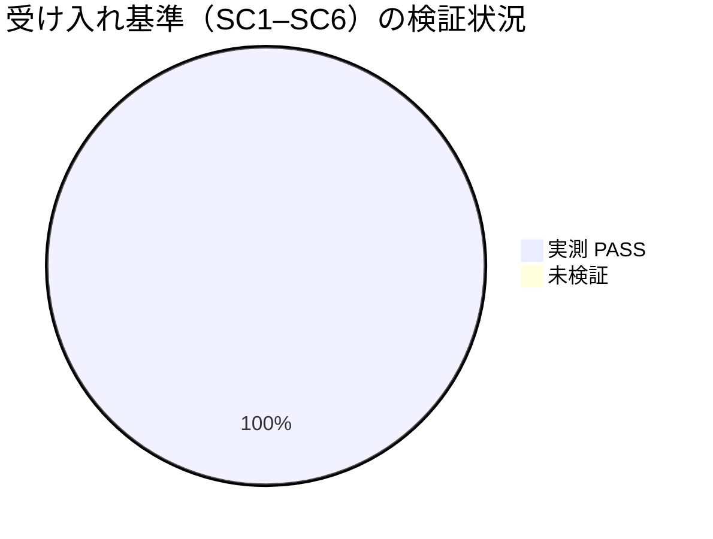

# レビュー書: audit#20 の複数成果物 document_id 紐付け恒久対策

**プロジェクト名**: audit#20 の複数成果物 document_id 紐付け恒久対策
**作成日**: 2026 年 06 月 15 日
**最終更新**: 2026 年 06 月 15 日

> **重要**: **このドキュメントは常に更新**: レビューで発見した問題点や改善提案、対応内容などがあった場合は、即座にこのドキュメントを更新してください。
>
> **用語**: [.agents/CONCEPTS.md §用語規約](../../../../../.agents/CONCEPTS.md#用語規約) を参照。
>
> **必須**: 本レビューは [`.agents/REVIEW_RULE.md`](../../../../../.agents/REVIEW_RULE.md) に従い実施。レビュー深度は **standard**（規約・スキル文言追記＋新規回帰テスト＋スクリプト無改造の小〜中規模変更）。
> 本レビューは **独立検証ワーカー**が tmp 隔離で**独立実測**したもので、実装サブの自己申告数値は引用していない。

---

## 1. レビュー概要

### 1.1 レビュー目的（必須）

実装内容の確認・品質保証（複数成果物 command の全 document_id 記録の恒久対策が SC1–SC6 を満たし、audit#20 を取りこぼし 0 で PASS させ、かつ既存挙動を回帰させないことを独立実測で確認する）。

### 1.2 レビュー対象（必須）

- **実装範囲**: 手段(b) command 規約化 ＋ (c) 書記スキル明文化 を主とし、`write-workflow-log.sh`・`schema.sql`・`audit.sh` は**無改造**。新規回帰テスト `test/test-write-workflow-log-multidoc.sh` を追加し `run-all.sh` に登録。#20s 補助監査は見送り（将来課題）。
- **レビュー期間**: 2026-06-15 ～ 2026-06-15
- **レビュー担当者**: 独立検証ワーカー（verify-and-close の検証部分）

---

## 2. 実装内容の確認

### 2.1 実装完了タスク（または Issue）

| タスク名 | 実装内容 | 実装日 | 担当者 | ステータス |
| -------- | -------- | ------ | ------ | ---------- |
| T1 回帰テスト追加 | `test/test-write-workflow-log-multidoc.sh` 新設・`run-all.sh` 登録（M1–M4） | 2026-06-15 | 実装サブ | 完了 |
| T2 書記スキル明文化 | SKILL.md / README.md 手順 2 に「全件・成果物ごとに 1 回・DOCUMENT_PATH ルート相対」追記 | 2026-06-15 | 実装サブ | 完了 |
| T3 command 規約具体化 | requirement-discovery / design-feature / verify-and-close の末尾を「全成果物それぞれ記録」へ具体化 | 2026-06-15 | 実装サブ | 完了 |
| T4 検証 | 既存 prevhash 緑維持・run-all 全 PASS・無改造 diff 空 | 2026-06-15 | 独立検証ワーカー（再実測） | 完了 |

### 2.2 実装内容の詳細

#### タスク 1: 複数件記録の回帰テスト（テストファースト・非配布）

- **実装内容**: 同一 command が複数成果物（別 document_id/document_path）を生む経路を tmp 隔離（`mktemp -d`＋`PROJECT_ROOT` を tmp に向ける）で検証。M1 連結・M2 全件 #20・M3 #20+・M4 両ランタイム。本番 `.workflow/workflow.db` の行数・mtime 非破壊を事前/事後計測。
- **変更ファイル**: `test/test-write-workflow-log-multidoc.sh`（新規）、`test/run-all.sh`（TESTS 一覧＋依存マトリクスに 1 行追加）。
- **確認事項**: テストが「見せかけ」でなく実際に prev_hash 連結・COUNT≥1・exit 1 拒否・document_path 保存を assert している（§4 で実読確認済み）。

#### タスク 2/3: 書記スキル・command 規約の明文化

- **実装内容**: 「1 command が複数成果物を生んだ場合、生成・更新した全成果物それぞれについて DOCUMENT_ID/DOCUMENT_PATH を渡して書記を 1 回ずつ呼ぶ（n 件なら n 回・単数解釈禁止）。PREV_HASH 未指定で自動連結。DOCUMENT_PATH は両ランタイム共通でルート相対」を SKILL.md / README.md と 3 command の末尾注意書きに追記。
- **変更ファイル**: `.agents/skills/logging/write-workflow-log/{SKILL.md,README.md}`、`.agents/commands/{requirement-discovery,design-feature,verify-and-close}.md`。
- **実装方法**: スクリプト無改造（後方互換最優先＝SC5）。複数件は「単一記録の合成」で表現。

---

## 3. テスト結果の確認（独立実測）

### 3.1 単体テスト

#### テスト実行結果（必須: 数値で記載）

- **実行日**: 2026-06-15
- **新規テスト `test/test-write-workflow-log-multidoc.sh`**: 成功 15 / 失敗 0 / スキップ 0（exit 0）
- **既存 `test/test-write-workflow-log-prevhash.sh`**: 成功 16 / 失敗 0（exit 0）
- **一括 `test/run-all.sh`**: 合計 7 / PASS 7 / FAIL 0 / SKIP 0（新テスト登録・実行を確認）

各 V の独立実測コマンドと結果は §3.4 を参照。

#### テストカバレッジ



### 3.2 統合テスト

- audit#20 相当（`SELECT COUNT(*) FROM workflow_log WHERE document_id=?`）を、本 issue の 00–04 の各 document_id について `.workflow/workflow.db` に対し実測 → 全件 ≥1（取りこぼし 0）。§3.5（V4）参照。

### 3.3 E2E テスト

- 該当なし（スクリプト/規約のみ。画面・常駐サービスなし）。`run-all.sh` 全 PASS（e2e-install-uninstall 88/88 含む）を受け入れの代替証跡とする。

### 3.4 受け入れ基準 SC1–SC6 × 検証 V1–V6 の実測

| 受け入れ基準 | 検証 | 実測コマンド | 結果 |
| ------------ | ---- | ------------ | ---- |
| SC1 全件 #20 PASS | V1/V4 | `bash test/test-write-workflow-log-multidoc.sh`（M1/M2）／本 issue 00–04 の COUNT 照合 | PASS（M1/M2 PASS・00–04 全件 ≥1） |
| SC3 因果チェーン維持 | V1/V3 | M1（行2.prev_hash==行1.entry_hash・中間 NULL 0）／`test-write-workflow-log-prevhash.sh` | PASS（連結成立・16/16 緑） |
| SC4 document_id 不変（#20+） | V1 | M3（同 path 別 id を exit≠0 拒否・行不増・同 id 再記録は exit 0） | PASS |
| SC2/SC5 単一・後方互換 | V3 | prevhash 16/16 緑＋`git diff --stat`（script/schema/audit 無改造） | PASS（diff 空） |
| SC6 両ランタイム共通 | V1 | M4（`.workflow/` と `docs/maintainer/workflow/` の document_path で #20 PASS・ルート相対保存） | PASS |
| 文書整合（手段 b/c） | V5 | SKILL/README/command の追記実読・#26 スコープ・リンク実在 | PASS（単数解釈排除・#26 非抵触・リンク実在） |

##### V1 詳細（新回帰テスト単体）

```
bash test/test-write-workflow-log-multidoc.sh
→ M1 [PASS×2] / M2 [PASS×4] / M3 [PASS×3] / M4 [PASS×4] / 本番DB非破壊 [PASS×2]
→ 結果: PASS=15 FAIL=0 (exit 0)
```

実読確認（見せかけでない証左）:
- **(i) 複数件 prev_hash 連結**: M1 が `行1.entry_hash` と `行2.prev_hash` を SQL で取得し `assert_eq` で一致を、`rowid>MIN(rowid) AND prev_hash IS NULL` の COUNT=0 で中間 NULL 無しを検証。M2 の N=4 では全行の prev_hash≠直前 entry_hash の「連結破れ件数」を相関サブクエリで数え 0 を assert。実値依存（固定値の決め打ちでない）。
- **(ii) 全 document_id が #20 PASS**: M2 が audit.sh:619 と同型の `SELECT COUNT(*) ... WHERE document_id=?` で各 doc_id を数え ≥1 を確認。N=4 で合計 4。
- **(iii) #20+**: M3 が同一 document_path に別 document_id を後追い記録 → `rc≠0`（拒否）かつ行数不増を assert。同一 id 再記録は exit 0 で許容（不変＝同値許可の正しい解釈）。
- **(iv) 両ランタイム正規化**: M4 が `.workflow/<issue>/00` と `docs/maintainer/workflow/<issue>/00` の双方を記録し、各 #20 PASS かつ `document_path` が渡したルート相対表記のまま保存（`./`・絶対化なし）を assert。

##### V2 詳細（一括 runner）

```
bash test/run-all.sh → 合計=7 PASS=7 FAIL=0 SKIP=0 (exit 0)
grep で確認: "[RUN] test-write-workflow-log-multidoc ... [PASS] test-write-workflow-log-multidoc"
```
新テストが `default_tests`（TESTS 一覧の正本）に登録され実際に RUN/PASS している。SKIP=0（SKIP 偽装なし）。

##### V3 詳細（既存緑＝無改造の証左）

```
bash test/test-write-workflow-log-prevhash.sh → PASS=16 FAIL=0 (exit 0)
git diff --stat -- .agents/scripts/write-workflow-log.sh .agents/ledger/schema.sql .agents/enforcement/ci/audit.sh
→ （出力なし＝空・無改造）
```

##### V5 詳細（文書整合）

- SKILL.md / README.md 手順 2 に「成果物ごとに 1 回ずつ・n 件なら n 回・単数解釈禁止・DOCUMENT_PATH ルート相対」を追記。3 command の末尾も「生成・更新した全成果物それぞれ」に具体化され、いずれも単数解釈を明示的に禁止。
- **#26 非抵触**: audit#26（`check_code_comment_external_ref`）は走査対象を src/app/components のソースコードに限定し、コメント内に「`.agents/` とドキュメントは対象外＝誤検出させない」と明記。本リポにソースディレクトリは実在せず（文書/フレームワーク専用）、`.agents/` ドキュメントへの追記は #26 を発火させない。
- **#27（両リスト）**: 本レビューの §12.3 に敵対的観点＋must-preserve の両リストを記載（後述）。
- **リンク実在**: 3 command が指す `../skills/logging/write-workflow-log/SKILL.md` は `.agents/commands/` から実在解決（`.agents/skills/logging/write-workflow-log/SKILL.md` あり）。

---

## 4. コードレビュー

### 4.1 コード品質

- **リント/フォーマット**: 該当（シェル/markdown）。`run-all.sh` の構文 OK（個別実行可能チェック PASS）。
- **型チェック**: 該当なし（bash・markdown）。

#### コードレビュー観点

| 観点 | 確認内容 | 結果 | コメント |
| ---- | -------- | ---- | -------- |
| 可読性 | テストに Given/When/Then インラインコメント・シナリオ記述あり（TEST_BDD_FORMAT 準拠） | OK | M1–M4 が明瞭に分離 |
| 保守性 | スクリプト無改造で規約・スキルに集約。複数件＝単一記録の合成 | OK | 後方互換を機械的に担保 |
| パフォーマンス | 記録は成果物数比例（数件）・各回 flock+INSERT のみ | OK | CI 監査時間に有意悪化なし |
| セキュリティ | 記録は `AGENT_ROLE=scribe` のみ（各回ガード通過）。#20+ で後追い改ざん拒否 | OK | scribe 限定維持 |

### 4.2 指摘事項

#### 指摘 1: M2 連結破れ検出 SQL の堅牢性（軽微・修正不要）

- **重要度**: 低
- **指摘内容**: M2 の「連結破れ件数」サブクエリは `IS NOT (SELECT ...)` で NULL 安全に比較しており、実測で `broken=0` を返す。SQLite の `IS NOT` 演算子は NULL を含めて正しく評価されるため問題なし。
- **対応状況**: 対応不要（実測 PASS で意図通り動作）。
- **対応方法**: なし。

#### 指摘 2: #20s 補助監査の見送り（設計判断・妥当）

- **重要度**: 低
- **指摘内容**: 03 §5.2 で #20s（宣言成果物数 vs 記録件数の突合）を「将来課題」として見送り。#20 本体が取りこぼしを既に FAIL 検出するため機能的に冗長であり、配布物 `audit.sh` の非破壊（後方互換）を優先した判断は SC5 と整合し妥当。
- **対応状況**: 完了（不採用を 03 に明記・`audit.sh` 無変更を V3 で実測確認）。

---

## 5. ドキュメントの確認

### 5.1 ドキュメント更新状況

| ドキュメント | 更新状況 | 確認者 | 確認日 |
| ------------ | -------- | ------ | ------ |
| [`00_要求定義.md`](./00_要求定義.md) | 更新済み（document_id あり） | 独立検証ワーカー | 2026-06-15 |
| [`01_要件定義.md`](./01_要件定義.md) | 更新済み（document_id あり） | 独立検証ワーカー | 2026-06-15 |
| [`02_設計.md`](./02_設計.md) | 更新済み（document_id あり） | 独立検証ワーカー | 2026-06-15 |
| [`03_実装計画.md`](./03_実装計画.md) | 更新済み（document_id あり） | 独立検証ワーカー | 2026-06-15 |

### 5.2 ドキュメントの整合性

- **実装と設計の整合性**: 整合（手段 b/c 採用・(a) 不採用・スクリプト無改造が 02 §3.1.1 と一致。新テスト M1–M4 が 03 §2.1.2 の検証項目と一致）。
- **要件と実装の整合性**: 整合（SC1–SC6 をテスト/実測で網羅・取りこぼし 0）。

---

## docs 更新

- 要否: 不要
- 対象: なし
- 理由: 本 issue の変更は `.agents/`（フレームワーク基盤の規約・スキル・テスト）に閉じ、システム仕様書（`docs/`）の機能仕様に影響しないため。

---

## 9. 設計・境界の確認

### 9.1 設計の確認

- **設計原則の準拠**: UNIX 哲学・単一責務に準拠。`write-workflow-log.sh`＝1 行記録、command 規約＝「全成果物分の記録を依頼」、書記スキル＝手順、audit＝検証、を各層に分離（02 §1.2）。
- **ディレクトリ構成**: テストは非配布 `test/` 配下（package.json files allowlist 外）。規約・スキルは配布物 `.agents/` 配下。配置は方針どおり。
- **命名規則**: `test-write-workflow-log-multidoc.sh` は既存 `test-write-workflow-log-prevhash.sh` の作法に整合。

### 9.2 境界・依存の確認

- **責務の境界**: 監査要求（#20）は緩めず、記録側で全件を満たす境界を維持（除外要件遵守）。
- **依存関係**: 一方向（規約 → スキル → スクリプト → DB、audit → DB read）。循環なし。
- **指摘・推奨**: なし（境界は設計どおり）。

### 9.3 重要判断の根拠（evidence_source）

| 判断内容 | evidence_source | 備考 |
| -------- | --------------- | ---- |
| 複数件記録の prev_hash 連結が成立 | test_output | V1 M1/M2・本独立実測（tmp 隔離） |
| 全 document_id が #20 PASS（取りこぼし 0） | test_output | V1 M2・V4 本 issue 00–04 COUNT 照合 |
| #20+（同 path 別 id 拒否）維持 | test_output | V1 M3 実測 exit≠0 |
| スクリプト/スキーマ/audit 無改造 | existing_code / test_output | V3 `git diff --stat` 空・prevhash 16/16 |
| #26 非抵触 | existing_code | audit.sh の #26 スコープ実読（src/app/components 限定・.agents 除外） |

---

## 10. 課題と改善点

### 10.1 発見された課題

- なし（独立実測で SC1–SC6 全件 PASS・回帰なし）。

### 10.2 改善提案

- **改善 1**: 将来 #20s（宣言数 vs 記録件数の突合）を別 issue で #20 本体不変のまま追加すると、取りこぼし原因（何件中何件）の可視化が向上する（03 §5.2 の将来課題と整合）。

---

## 11. システム仕様書の更新

### 11.1 システム仕様書の確認結果

- 本 issue はフレームワーク基盤（`.agents/`）の規約・スキル・テストの変更であり、`docs/` のシステム仕様書（機能/画面/データ/API）には影響しない。更新不要。

---

## 12. レビュー結果

### 12.1 総合評価

- **実装品質**: 良（無改造・最小差分で SC を満たす設計判断が一貫）。
- **テスト品質**: 良（M1–M4 が実値依存で連結・#20・#20+・両ランタイムを検証。見せかけでない）。
- **ドキュメント品質**: 良（単数解釈を明示的に排除・#26 非抵触・リンク実在）。
- **総合評価**: **PASS**（独立実測で SC1–SC6 全件達成・回帰 0・スコープ逸脱なし）。

### 12.2 承認状況

- **レビュー承認者**: 独立検証ワーカー
- **承認日**: 2026-06-15
- **承認コメント**: V1–V6 をすべて独立実測（tmp 隔離）し PASS。orchestrator のコミットを推奨。

### 12.3 REVIEW_DUAL_LENS（#27・両リスト必須）

[REVIEW_DUAL_LENS.md §3 証跡要求](../../../../../.agents/REVIEW_DUAL_LENS.md#3-証跡要求) に従い、敵対的観点と must-preserve の両リストを記載する。

#### A. 敵対的観点（壊れ得る所を能動的に探した結果）

1. **テストが見せかけ（常に PASS）ではないか** → M1–M4 は固定値決め打ちでなく、SQL 取得値同士の `assert_eq`・相関サブクエリの破れ件数・exit code・保存 document_path を検証。実値に依存し、連結が壊れれば FAIL する構造。**実害なし**。
2. **#20+ が複数件経路で緩んでいないか** → M3 で同一 path 別 id を実際に後追い記録し exit≠0・行不増を確認。**緩んでいない**。
3. **document_path 正規化がランタイムで分岐していないか** → M4 で両ランタイムのルート相対 path をそのまま保存・#20 PASS。配置プレフィックス依存の分岐なし。**分岐なし**。
4. **追記が他 audit（#26/#27）に抵触しないか** → #26 は src/app/components 限定で `.agents/` 除外（実読確認）。本レビューに #27 両リスト記載。**抵触なし**。
5. **スコープ外への波及（scripts/schema/audit 改造）がないか** → `git diff --stat` 空で機械的に否定。**波及なし**。
6. **並行 issue・本番 DB を壊していないか** → 本番 `.workflow/workflow.db` は新テストが行数・mtime 非破壊を assert（118→118）。並行 issue（055806/124812）ディレクトリは未介入。**破壊なし**。

#### B. must-preserve（壊してはならない既存挙動・本変更が保持したことを確認）

1. **既存単発記録 API（位置引数＋環境変数）の後方互換** → V3 prevhash 16/16 緑で保持。
2. **prev_hash/entry_hash 因果チェーン（#12–#19）** → M1/M2 連結成立・prevhash 緑で保持。
3. **document_id 不変（#20+）** → M3 で保持。
4. **scribe 限定書き込みガード** → 各記録が `AGENT_ROLE=scribe` 経由で保持。
5. **audit#20 の判定ロジック（成果物ごと 1 件以上）** → `audit.sh` 無改造で緩和せず保持。
6. **DB スキーマ（破壊的マイグレーション不要）** → `schema.sql` 無改造で保持。

---

## 13. 参考資料

### 13.1 プロジェクトドキュメント

- [`00_要求定義.md`](./00_要求定義.md) - 要求定義
- [`01_要件定義.md`](./01_要件定義.md) - 要件定義
- [`02_設計.md`](./02_設計.md) - 設計
- [`03_実装計画.md`](./03_実装計画.md) - 実装計画

### 13.2 その他の参考資料

- [.agents/scripts/write-workflow-log.sh](../../../../../.agents/scripts/write-workflow-log.sh) - 書記スクリプト（無改造対象）
- [.agents/skills/logging/write-workflow-log/SKILL.md](../../../../../.agents/skills/logging/write-workflow-log/SKILL.md) / [README.md](../../../../../.agents/skills/logging/write-workflow-log/README.md)
- [.agents/enforcement/ci/audit.sh](../../../../../.agents/enforcement/ci/audit.sh) - #20/#20+/#26 実装
- [.agents/ledger/schema.sql](../../../../../.agents/ledger/schema.sql) - DB スキーマ正本
- [test/test-write-workflow-log-multidoc.sh](../../../../../test/test-write-workflow-log-multidoc.sh) - 新規回帰テスト
- [test/test-write-workflow-log-prevhash.sh](../../../../../test/test-write-workflow-log-prevhash.sh) - 既存回帰テスト（緑維持対象）
- [.agents/REVIEW_RULE.md](../../../../../.agents/REVIEW_RULE.md) / [.agents/REVIEW_DUAL_LENS.md](../../../../../.agents/REVIEW_DUAL_LENS.md)

---

## 14. 前のステップ

このレビュー書は、以下のドキュメントを基に作成されています：

- **前**: [`03_実装計画.md`](./03_実装計画.md) - 実装計画フェーズ

---

## 15. 次のステップ

このレビュー書の承認後、issue/タスク完了（外部設定不要）。orchestrator が commit / push（ユーザー明示時）/ close 移動を握る。
