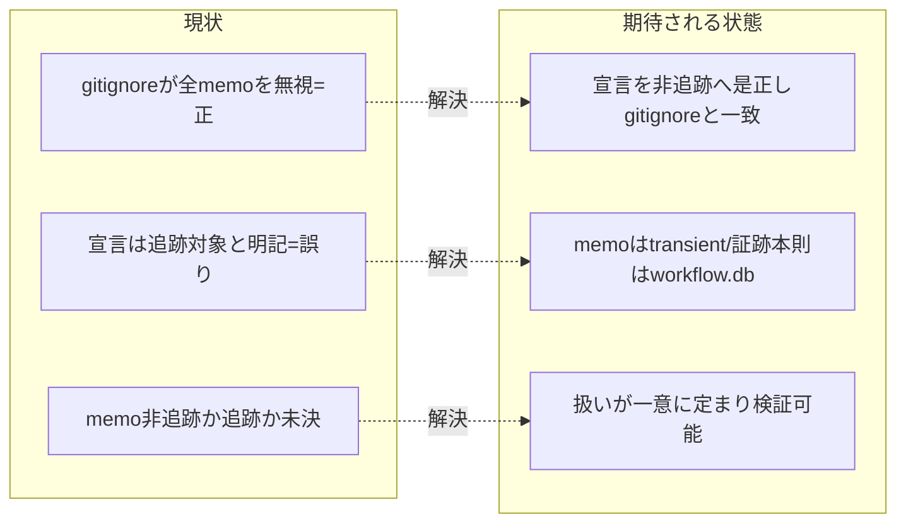

# 要求定義書: 自己拡張 memo の gitignore 矛盾是正

**プロジェクト名**: 自己拡張 memo の gitignore 矛盾是正
**作成日**: 2026 年 06 月 15 日
**最終更新**: 2026 年 06 月 15 日

> **重要**:
>
> - 要求定義書は、プロジェクトの全体像を把握するためのものです。詳細な技術仕様や実装方法は要件定義書以降で記載します。必要最低限の情報に収めることを心掛けてください。
> - **このドキュメントは常に更新**: 要求の変更や追加があった場合は、即座にこのドキュメントを更新してください。ドキュメントは「生きているドキュメント」として扱い、実装内容と常に同期させます。
> - **必須項目**: 以下の「必須」と明記した項目は空欄・抽象語のみ（例: 「{説明}」のまま）で提出しないこと。判定可能な形（目的は1文・成功基準は○/×で判定できる記載等）で記入すること。
>
> **用語**: [.agents/CONCEPTS.md §用語規約](../../../../../.agents/CONCEPTS.md#用語規約) を参照。

---

## 要求定義の全体像

```mermaid
mindmap
  root((memo gitignore 矛盾是正))
    目的・背景
      目的
      現状の課題
      必要性
      期待される効果
    機能要件
      宣言と挙動の一致
      memo非追跡(transient)の明文化
      証跡本則はworkflow.db
    非機能要件
      配布物を汚さない
      消費者ランタイムmemoは無視維持
    制約条件
      gitignore **/memo/* を正とする
      名前空間分離の維持
    除外要件
    成功基準
    リスクと対策
      技術的リスク
      回帰リスク
```

**注意**:

- マインドマップは全体像を把握するためのものです。主要なセクション名程度に留め、詳細は記載していません。

---

## 1. 目的・背景

### 1.1 目的（必須）

自己拡張 issue の memo の gitignore 矛盾を解消し、memo を**非追跡（transient）と明文化**することで宣言と挙動を一致させる。

> **確定方針**: memo は過渡的スクラッチであり正本ではないため **git 管理不要**。証跡の本則は `workflow.db` だが、それも消費者ランタイム生成物として gitignore 対象（runtime 状態）。したがって **git 追跡する成果物は issue ドキュメント（00〜04）のみ**で、memo も workflow.db も git 追跡外でよい。これを受け、是正は **(b) 採用＝宣言を非追跡へ是正**、**(a) 却下＝negate での追跡対象化** に一意化する（詳細は §2・§6）。

### 1.2 背景

- **現状の課題**:
  - ルート `.gitignore:44` の `**/memo/*` が**すべての** memo ディレクトリを無視している（=**こちらが正**）。
  - 一方 `.agents-project/自己拡張ワークフロー.md`（§memo の作成場所、26・29 行）は、自己拡張 issue の memo を `docs/maintainer/workflow/<issue>/memo/` に置き「**git 追跡対象**であり、issue 本体と同一名前空間に置く」と明記しており、両者が矛盾している（=**この宣言が誤りで、是正対象**）。
  - 実害: 直近コミット `7a9e1f8`（コア取り込み漏れ補完 issue 群の起票）で、親 issue `docs/maintainer/workflow/20260615_055806_コア取り込み漏れ補完/` 配下の review-docs memo 11 件が gitignore 除外され未追跡となっている（`git check-ignore -v` で `.gitignore:43` がヒット、`git ls-files` で空＝未追跡を確認済み）。ただし**これは是正方針（b）では「あるべき挙動」であり、二観点レビューの本則証跡は workflow.db に残るため取りこぼしではない**（§1.2 必要性で整理）。

- **必要性**:
  - 宣言（追跡対象）と挙動（無視）の矛盾が残ると、自己拡張 memo の追跡可否が一意に定まらず、再発時に誤った add / 二重管理を招く。確定方針（memo は非追跡が正）に宣言を合わせ、矛盾を恒久的に解消する必要がある。
  - 親「コア取り込み漏れ補完」で codify 中の **S1「取りこぼし防止と既出確認のコア昇格」原則との関係**: 一見「review-docs memo の未追跡＝取りこぼし」に見えるが、**レビュー実施の本則証跡は workflow.db（gitignore だが消費者ランタイム正本）に残る**ため、memo を非追跡にしても証跡は取りこぼされない。本件は「証跡は workflow.db に存在し、memo は過渡的スクラッチである」という設計を明文化することで S1 と整合させる。

### 1.3 期待される効果（必須: 1 件以上）

- **効果 1**: `.agents-project/` の宣言が「memo＝非追跡（transient）」へ是正され、`.gitignore` の `**/memo/*`（=正）と一致する（矛盾が解消され、追跡可否が一意に定まる。○/× で判定可能）。
- **効果 2**: 証跡の本則が `workflow.db`（gitignore 対象）である旨が明文化され、memo は正本ではなく過渡的スクラッチである位置づけが一意に定まる。git 追跡する成果物が issue ドキュメント（00〜04）のみであることが説明可能になる。
- **効果 3**: 消費者ランタイム（`.workflow/{issue}/memo/`）側の memo 無視は維持され、配布物（npm pack）を汚さない。

**現状と期待される状態の比較**:



---

## 2. 機能要件

### 2.1 既存機能の維持（該当する場合）

- 消費者ランタイム名前空間 `.workflow/{issue}/memo/` の memo は従来どおり gitignore で無視する（配布物に含めない）。本件の対象は `docs/maintainer/`（保守者名前空間）の memo のみ。
- 名前空間分離（`.agents-project/自己拡張ワークフロー.md` §理由）の役割分担を壊さない。

### 2.2 新規機能要件

- `.agents-project/自己拡張ワークフロー.md` §memo の「memo は **git 追跡対象**」という宣言を「**memo は非追跡（transient）**」へ是正し、ルート `.gitignore` の `**/memo/*`（=正）と一致させる（**(b) 採用**）。
- 是正に併せて、memo は過渡的スクラッチであり、レビューの本則証跡は `workflow.db`（gitignore 対象）に残る、という設計を `.agents-project/` に明文化する。
- negate パターン（`!docs/maintainer/.../memo/`）で memo を追跡対象化する案は **(a) 却下**（却下理由は §6・§7、および 01 を参照）。

---

## 3. 非機能要件

### 3.1 パフォーマンス

- 本件はビルド/実行時パフォーマンスに影響しない。

### 3.2 セキュリティ

- 特になし（git 追跡対象の変更のみ。秘匿情報を memo に含めない運用は既存ルールに従う）。

### 3.3 互換性

- 消費者ランタイム（`.workflow/`）側の memo 無視挙動を変更しないこと。`verify-npm-pack.sh` 等の pack リーク検査・self-enforce の差分ゼロ検証を破らないこと。

### 3.4 保守性

- 矛盾の単一情報源（gitignore パターン or `.agents-project/` 宣言）を明確化し、再発防止できること。

---

## 4. 制約条件

### 4.1 技術的制約

- `.gitignore` のパターン順序・有効性に注意する（後勝ち・否定パターン `!` の効き方、`**/memo/*` との前後関係）。
- 否定（negate）で再追跡するパターンは、親ディレクトリが無視されていると効かない場合がある点に留意。

### 4.2 既存システムとの互換性

- `.workflow/` 配下 memo は引き続き無視。`docs/maintainer/` 名前空間のみが本件の対象範囲。

### 4.3 移行期間・スケジュール

- 単発の是正。スケジュール制約なし。

---

## 5. 除外要件

- 消費者ランタイム（`.workflow/{issue}/memo/`）の memo 追跡化は対象外（従来どおり無視で正しい）。
- 既存の未追跡 memo を遡って add するかどうかの運用判断は、是正方針確定後の別作業（実装フェーズ）で扱う。本 00/01 では方針の決着までを範囲とする。

---

## 6. 成功基準（必須: 1 件以上）

- `.agents-project/自己拡張ワークフロー.md` の §memo が「memo＝非追跡（transient）」と明記され、`.gitignore` の `**/memo/*` と矛盾しない（「追跡対象」の文言が残らない。○/×）。**(b) 確定。**
- `.agents-project/` に「review-docs 等レビューの本則証跡は `workflow.db`（gitignore 対象）である／memo は過渡的スクラッチで正本ではない」旨が明文化される（○/×）。
- negate パターンで memo を追跡対象化する **(a) が却下**として記録され、却下理由（memo は正本でない・git 追跡は issue docs〔00〜04〕のみという設計に反する）が残る（○/×）。
- 自己拡張 issue の memo（`docs/maintainer/workflow/**/memo/*`）が `git check-ignore -v` で `.gitignore` の `**/memo/*` によって無視されることを検証できる（○/×）。
- 消費者ランタイム `.workflow/{issue}/memo/` の無視が維持されることを `git check-ignore` で確認できる（○/×）。

---

## 7. リスクと対策

### 7.1 技術的リスク

- **リスク**: (b) 採用により `.gitignore` は変更しないため negate の順序事故リスクは無いが、`.agents-project/` の宣言是正が不十分（旧「追跡対象」文言の取り残し）だと矛盾が再発する。
  - **対策**: 是正後に `.agents-project/自己拡張ワークフロー.md` 内に「追跡対象」と読める memo 関連の記述が残らないことを grep で確認し、`git check-ignore -v` で `**/memo/*` のヒットを併せて検証する。受け入れ基準に検証手順を含める。

### 7.2 設計判断リスク（(a) 却下の妥当性）

- **リスク**: memo 非追跡（b）により「証跡が失われる」と誤解されうる。
  - **対策**: 本則証跡が `workflow.db`（gitignore 対象だが消費者ランタイム正本）に残ること、git 追跡する成果物は issue ドキュメント（00〜04）のみであることを 00/01 に明文化し、S1「取りこぼし防止」と整合する旨を記録する。(a)（negate 追跡化）は「memo を正本扱いする」点でこの設計に反するため却下する。

---

## 8. 参考資料

### プロジェクトドキュメント

- [`.agents-project/自己拡張ワークフロー.md`](../../../../../.agents-project/自己拡張ワークフロー.md) - §memo の作成場所（26・29 行）/ §理由（名前空間の役割分担）
- ルート [`.gitignore`](../../../../../.gitignore) - 44 行 `**/memo/*`（コメント 42〜43 行）
- 親 issue: [`docs/maintainer/workflow/20260615_055806_コア取り込み漏れ補完/`](../20260615_055806_コア取り込み漏れ補完/) - S1「取りこぼし防止と既出確認のコア昇格」（issue_id 434c7b86-4222-45e7-a0ef-1ae455f15313）

### その他の参考資料

- コミット `7a9e1f8`（コア取り込み漏れ補完 issue 群を起票）— review-docs memo 11 件が未追跡となった対象。

### 既出確認の結論

- `grep -rl 'gitignore' docs/maintainer/workflow/` および memo/gitignore を含むディレクトリ名走査の結果、**memo/gitignore 追跡の矛盾を主題とする既存 issue は無い**（gitignore に言及する既存 issue は bin 生成物・配布構成・カバレッジ等の別主題）。親「コア取り込み漏れ補完」配下にも同主題 issue は無いため、**新規起票する**。

---

## 9. 次のステップ

この要求定義書の承認後、以下のドキュメントを作成します：

- **次**: [`01_要件定義.md`](./01_要件定義.md) - 要件定義フェーズ
