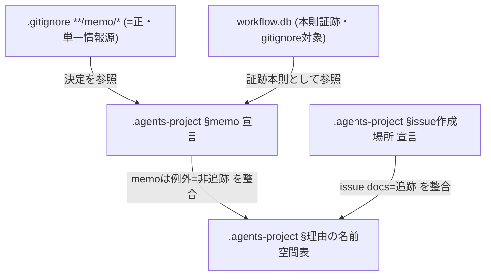
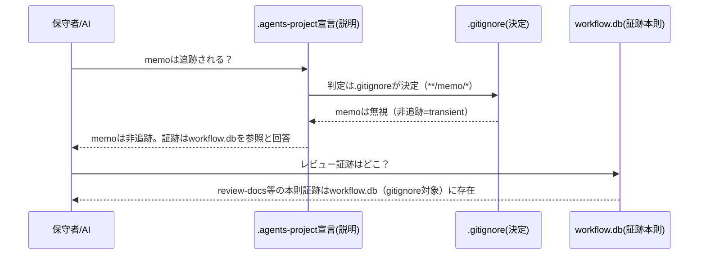

# 設計書: 自己拡張 memo の gitignore 矛盾是正

**プロジェクト名**: 自己拡張 memo の gitignore 矛盾是正
**作成日**: 2026 年 06 月 16 日
**最終更新**: 2026 年 06 月 16 日

> **重要**: **このドキュメントは常に更新**: 設計の変更や追加があった場合は、即座にこのドキュメントを更新してください。ドキュメントは「生きているドキュメント」として扱い、実装内容と常に同期させます。
>
> **用語**: [.agents/CONCEPTS.md §用語規約](../../../../../.agents/CONCEPTS.md#用語規約) を参照。

---

## 1. 設計概要

**必須**: 設計方針・原則は [.agents/spec/01\_設計原則.md](../../../../../.agents/spec/01_設計原則.md) を先に参照した上で、本プロジェクトに適用するものを選び記載すること。

### 1.1 設計方針

ルート `.gitignore` の `**/memo/*`（=正・実挙動）を**変更せず**、`.agents-project/自己拡張ワークフロー.md` 内の memo に関する「git 追跡対象」という**誤った宣言**を「**非追跡（transient）**」へ是正し、宣言と実挙動を一致させる（要件 (b) 採用）。是正対象は「ドキュメント宣言テキスト」のみであり、コード・スキーマ・API は変更しない。「memo は非追跡」という単一情報源を `.gitignore`（=正）に固定し、ドキュメント宣言はそれを記述・参照するだけにすることで矛盾の再発を防ぐ。

### 1.2 設計原則（本プロジェクトで適用するもの）

- **単一責務**: 「memo の追跡可否を決める単一情報源」は `.gitignore` の `**/memo/*` のみとする。`.agents-project/` のドキュメント宣言は「決定」せず「実挙動を説明・参照する」役割に限定する（宣言と挙動の二重定義を排除）。
- **明確な境界**: 「保守者名前空間の追跡対象（issue ドキュメント 00〜04）」と「memo（非追跡・transient）」の境界を文面上で明確に分離する。両者を `docs/maintainer/workflow/` という同一ディレクトリ配下に置くがゆえに生じやすい「ディレクトリ単位で一括追跡」という誤解を、文面で打ち消す。
- **AIフレンドリー設計**: 「memo は非追跡」「証跡本則は workflow.db」「git 追跡する成果物は issue docs（00〜04）のみ」という 3 点を、AI/保守者が読んで一意に解釈できる短い明文として記述する（[01\_設計原則 §AIフレンドリー設計](../../../../../.agents/spec/01_設計原則.md#aiフレンドリー設計)）。

> 適用しない原則（CQRS・イベント駆動）: 本件は状態遷移・イベント発行を伴わないドキュメント整合のため適用しない。

---

## 2. アーキテクチャ設計

### 2.1 責務・境界・参照関係

本件の「コンポーネント」は実行コードではなく、**追跡可否を規定する成果物（ファイル）群**である。各ファイルの責務・境界・参照の向きを定義する。

#### 2.1.1 責務一覧

| コンポーネント | 責務（1 文） |
| -------------------- | -------------------- |
| ルート `.gitignore`（`**/memo/*`、44 行） | 全 memo ディレクトリ配下を git 無視にする**唯一の決定者（単一情報源）**。本件で**変更しない**（=正。是正前は 43 行、機能3 のコメント追加で 44 行へシフト・内容は不変）。 |
| `.gitignore` の memo 注釈（42〜43 行・コメント） | `**/memo/*` の意図を説明する注釈。是正前は「必要に応じて個別に追跡する」という**追跡を示唆する誤解を含んで**いたため、文言整合の対象（コメントのみ・ルール行は不変）。 |
| `.agents-project/自己拡張ワークフロー.md` §memo の作成場所（22〜29 行） | 自己拡張 issue の memo の置き場所を規定する説明。**29 行の「git 追跡対象」宣言が誤りで是正対象**（→「非追跡（transient）」へ）。 |
| `.agents-project/自己拡張ワークフロー.md` §issue の作成場所（18 行） | issue 本体ドキュメント（00〜04）の置き場所と追跡方針を規定。**「git 追跡対象」は正しい**（issue docs を指す）。本件では変更しないが、memo と区別される旨を明確化する。 |
| `.agents-project/自己拡張ワークフロー.md` §理由（名前空間の表、66〜76 行） | 各パスの git 扱いを一覧化。`docs/maintainer/workflow/` 行が「追跡する」となっているが、これは **issue ドキュメントを指し memo は例外（非追跡）** である旨を明記する（行の追記・脚注）。 |
| `workflow.db`（`.workflow/workflow.db`） | レビュー（review-docs 等）の**本則証跡**。消費者ランタイム生成物として gitignore 対象。「証跡は memo ではなく workflow.db に残る」ことを宣言で参照する対象。**本件で変更しない**（参照されるのみ）。 |

#### 2.1.2 境界

- **入力**: 確定方針（memo＝非追跡・正本でない／git 追跡は issue docs 00〜04 のみ／証跡本則は workflow.db）。`.gitignore` の現状（`**/memo/*` が正）。`.agents-project/自己拡張ワークフロー.md` の現状テキスト。
- **出力**: 是正後の `.agents-project/自己拡張ワークフロー.md`（memo＝非追跡へ宣言是正・名前空間表の memo 例外明記・証跡本則 workflow.db 明文化）。任意で `.gitignore:42` コメントの文言整合。
- **他責務との境界（本件の範囲外）**:
  - **消費者ランタイム `.workflow/{issue}/memo/`**: 従来どおり無視。挙動変更しない。
  - **`.gitignore` のルール行（`**/memo/*`、`/.workflow/*` 等）**: 変更しない。`(a)` negate 追跡化は却下のため negate 行を追加しない。
  - **既存の未追跡 memo（コミット `7a9e1f8` の review-docs memo 11 件等）の遡及 add**: 範囲外（00 §5・01 で除外）。是正方針では「あるべき挙動（非追跡）」であり遡及 add は行わない。
  - **issue 本体ドキュメント（00〜04）の追跡方針**: 変更しない。追跡対象のまま。

#### 2.1.3 参照関係

- `.agents-project/自己拡張ワークフロー.md` §memo →（参照）→ ルート `.gitignore`（`**/memo/*`）: 「memo の追跡可否は `.gitignore` が決定する」という向きで参照する（宣言は決定しない）。
- `.agents-project/自己拡張ワークフロー.md` §memo →（参照）→ `workflow.db`: 「レビュー本則証跡は workflow.db に残る」と参照する。
- `.agents-project/自己拡張ワークフロー.md` §理由の表 →（参照）→ §issue 作成場所・§memo: 表の `docs/maintainer/workflow/` 行が「issue docs は追跡／memo は非追跡（例外）」の両者を指す旨を、上 2 セクションと整合させる。
- 循環参照なし（決定の流れは `.gitignore` → ドキュメント宣言 の一方向。ドキュメント宣言が `.gitignore` を上書きすることはない）。

### 2.2 システムアーキテクチャ

**必須**: 設計判断は [.agents/spec/](../../../../../.agents/spec/)（[00_spec概要.md](../../../../../.agents/spec/00_spec概要.md)、[01\_設計原則.md](../../../../../.agents/spec/01_設計原則.md)、[06\_設計判断の優先順位.md](../../../../../.agents/spec/06_設計判断の優先順位.md)）を先に参照すること。

- **採用パターン**: 単一情報源（Single Source of Truth）パターン。「memo の追跡可否」の決定権を `.gitignore` の `**/memo/*` 1 か所に固定し、ドキュメントは参照・説明に徹する。
- **根拠**: [06\_設計判断の優先順位](../../../../../.agents/spec/06_設計判断の優先順位.md) の「docs と実装の不整合を放置してはならない」「仕様との整合性」に従い、宣言（docs）と実挙動（`.gitignore`）の不一致を解消する。可読性・仕様整合性を実装効率より優先し、最小変更（ドキュメント文言の是正）で恒久解決する。

#### 2.2.1 CQRS（Command/Query 分離）

本件は状態変更を伴わないため CQRS は適用しない（該当なし）。

#### 2.2.2 アーキテクチャ図（本プロジェクトの構成で記載）



### 2.3 コンポーネント構成

本件は新規モジュールを追加しない。既存の 3 つの「説明箇所」（§memo・§issue 作成場所・§理由の表）と `.gitignore` 注釈の 4 点を、単一情報源（`.gitignore`）に整合させる**文言是正**で構成する。明確な境界として「決定する場所（`.gitignore`）」と「説明する場所（`.agents-project/`）」を分離し、後者が前者を上書きしない単一責務を保つ。

### 2.4 データフロー

本件にイベント発行はない（イベント駆動は不適用）。追跡可否の「判定フロー」を以下に示す。判定の起点は常に `.gitignore` であり、ドキュメント宣言はその結果を説明するに過ぎない。



---

## 3. 機能設計

### 3.1 機能 1: §memo 宣言の「非追跡（transient）」是正

#### 3.1.1 概要

`.agents-project/自己拡張ワークフロー.md` §memo（22〜29 行）の **29 行「これらは git 追跡対象であり、issue 本体と同一名前空間に置く。」** を、memo が**非追跡（transient）**であり置き場所のみ issue 本体と同一名前空間である旨へ是正する。併せて「memo は過渡的スクラッチで正本ではない／レビューの本則証跡は workflow.db に残る」旨を明文化する。

#### 3.1.2 処理フロー

```mermaid
flowchart TD
    Start([是正開始]) --> Locate[29行『git追跡対象』記述を特定]
    Locate --> Fix[『非追跡(transient)・置き場所のみ同一名前空間』へ書換]
    Fix --> AddDB[本則証跡=workflow.db / memoは正本でない を明文化]
    AddDB --> Grep{memo関連で『追跡対象』と読める残存があるか}
    Grep -->|なし| Done([是正完了])
    Grep -->|あり| Locate
```

#### 3.1.3 入力・出力

- **入力**: §memo の現行テキスト（22〜29 行）。確定方針（memo＝非追跡・証跡本則 workflow.db）。
- **出力**: memo を「非追跡（transient）」と明記した §memo。`workflow.db` 本則証跡の明文。

#### 3.1.4 エラーハンドリング

- 旧「追跡対象」文言が memo 文脈に残ると矛盾再発。実装フェーズで grep 検証（§6・03）により残存ゼロを保証する。

### 3.2 機能 2: §理由の名前空間表における memo 例外の明記

#### 3.2.1 概要

§理由の表（66〜76 行）で `docs/maintainer/workflow/` 行が「追跡する」となっているのは **issue 本体ドキュメント（00〜04）を指す**ものであり、**memo はその例外（非追跡）** である。この区別を、表行の文言追記または表直下の脚注で明示し、「ディレクトリ単位で一括追跡」という誤解を残さない。

#### 3.2.2 処理フロー

```mermaid
flowchart TD
    S([開始]) --> T[名前空間表の docs/maintainer/workflow/ 行を特定]
    T --> A["役割欄に『issue docs(00〜04)を指す。memoは例外=非追跡』を追記 or 脚注付与"]
    A --> X[§issue作成場所(追跡=正) / §memo(非追跡) と相互整合を確認]
    X --> E([完了])
```

#### 3.2.3 入力・出力

- **入力**: §理由の表（特に `docs/maintainer/workflow/` 行）と §issue 作成場所・§memo の是正結果。
- **出力**: memo 例外を明記した表（または脚注）。issue docs＝追跡／memo＝非追跡 が一意に読める状態。

#### 3.2.4 エラーハンドリング

- §issue 作成場所（18 行「git 追跡対象」＝issue docs を指す・正）は**変更しない**。memo の宣言是正と取り違えて issue docs まで「非追跡」と書かないよう、対象行を 29 行（memo）に限定する。

### 3.3 機能 3: `.gitignore:42` 注釈の文言整合（任意・本件範囲内の軽微是正）

#### 3.3.1 概要

`.gitignore:42` のコメント「memoは基本的にGit管理外。必要に応じて個別に追跡する（例: …01_背景と目的.md）」は、**memo を「必要に応じて追跡」と示唆する第 3 の矛盾点**である（しかも例として挙がる `01_背景と目的.md` は memo ではない）。確定方針（memo は非追跡で一意）と整合させるため、コメントを「memo は非追跡（transient）。証跡本則は workflow.db」へ整える。**ルール行 `**/memo/*`（是正後 44 行・是正前 43 行）は変更しない。**

#### 3.3.2 処理フロー

```mermaid
flowchart TD
    A([開始]) --> B[42行コメントの『必要に応じて個別に追跡』を特定]
    B --> C[『memoは非追跡(transient)。証跡本則はworkflow.db』へ整える]
    C --> D{ルール行 **/memo/* に変更を加えていないか}
    D -->|変更なし| E([完了])
    D -->|変更あり| F[ルール行を元に戻す/中止]
```

#### 3.3.3 入力・出力

- **入力**: `.gitignore` のコメント・`**/memo/*` ルール行（是正後 42〜44 行）。
- **出力**: コメントのみ整合した `.gitignore`。`git check-ignore` の挙動は不変。

#### 3.3.4 エラーハンドリング

- ルール行を誤って書き換えると挙動が変わる。実装フェーズで `git check-ignore -v` 前後比較により挙動不変を保証する。

> 注: 本機能 3 は「矛盾の単一情報源化」（00 §6・3.4 保守性）に資するため**本件範囲内**とするが、最小限ならば §memo・§理由の是正（機能 1・2）だけでも 00/01 の成功基準は満たす。実装フェーズで機能 3 を含めるか否かはレビューで最終判断してよい（含める方が再発防止上は望ましい）。

---

## 4. データ設計

本件はデータモデル・テーブルを持たない（ドキュメント文言とgitignore パターンの整合のみ）。該当なし。

---

## 5. API 設計

本件は外部公開 API・関数・イベントを追加しない。代わりに、本件が満たすべき**契約（インターフェース）**を「検証可能な観測契約」として定義する。これらは実装の入出力契約に相当し、03 の検証仕様と 1:1 で対応する。

### 5.1 契約一覧（観測契約）

| 契約 ID | 観測手段 | 期待結果 |
| --- | --- | --- |
| C1: memo 非追跡 | `git check-ignore -v docs/maintainer/workflow/<issue>/memo/<file>.md` | `.gitignore:44:**/memo/*` でヒット（無視）。 |
| C2: issue docs 追跡維持 | `git check-ignore -v docs/maintainer/workflow/<issue>/02_設計.md` | ヒットなし（＝追跡対象のまま）。 |
| C3: 消費者ランタイム memo 無視維持 | `git check-ignore -v .workflow/<issue>/memo/<file>.md` | `.gitignore:12:/.workflow/*`（または `**/memo/*`）でヒット（無視）。 |
| C4: 宣言の残存ゼロ | `.agents-project/自己拡張ワークフロー.md` を grep | memo 文脈で「git 追跡対象」と読める文言が 0 件。 |
| C5: issue docs 宣言の非破壊 | §issue 作成場所（18 行）・§理由表の issue docs 行を確認 | 「追跡（する）」が保持され、memo 例外が明記されている。 |
| C6: gitignore ルール行不変 | `git diff .gitignore` のルール行差分 | `**/memo/*`・`/.workflow/*` 等のルール行に差分なし（変更はコメントのみ）。 |

### 5.2 契約詳細

- **C1〜C3（挙動契約）**: `.gitignore` を変更しない（または注釈のみ変更）ため、是正前後で挙動は不変。本件はこれら挙動が「方針どおりである」ことを文書宣言と一致させるのが目的。
- **C4〜C5（文面契約）**: 是正の本体。memo 宣言の「非追跡」化と、issue docs 追跡の保持・memo 例外明記を両立させる。
- **C6（非破壊契約）**: `(a)` negate 却下の帰結として、`.gitignore` のルール行に追跡化のための変更を加えないことを保証する。

---

## 6. テスト戦略

テスト戦略の観点定義は [RULES.md のテスト戦略必須要件](../../../../../.agents/RULES.md#テスト戦略必須要件) を、BDD 形式の定義は [TEST_BDD_FORMAT.md](../../../../../.agents/TEST_BDD_FORMAT.md) を参照すること。

**本件の性質**: 実行コード・自動テスト対象（関数/エンドポイント）は存在しない。検証は **`git check-ignore -v` による挙動確認**と **`grep` による文面確認**の手動受け入れ確認で行う。したがって単体/結合/E2E の自動テストは「該当なし」とし、代わりに**受け入れ確認手順（手動）**を担保とする。この方針は 03 §2 の各タスク・受け入れ手順と対応する。

### 6.1 対象ごとのテスト割り当て

| 対象 | 単体 | 結合/API | E2E | クリティカル観点 | バリデーション観点 | 未達理由/補足 |
| --- | --- | --- | --- | --- | --- | --- |
| §memo 宣言是正（機能1） | × | × | × | memo が非追跡と一意に読め C1 と一致 | memo 文脈の「追跡対象」残存ゼロ（C4） | 自動テスト対象なし。手動 grep + check-ignore で受け入れ確認 |
| §理由表 memo 例外明記（機能2） | × | × | × | issue docs=追跡／memo=例外 が読める（C5） | issue docs 行を非追跡化していない | 同上（手動文面確認） |
| `.gitignore:42` 注釈整合（機能3・任意） | × | × | × | ルール行不変で挙動不変（C6） | コメント以外に diff が無い | 同上。`git diff` で範囲確認 |
| 挙動の不変（C1〜C3） | × | ○(手動) | × | check-ignore のヒット元が方針どおり | `.workflow/` 側無視維持 | `git check-ignore -v` の出力で確認 |

### 6.2 監査・レビューでの確認（証跡）

本設計 §5 の契約一覧（C1〜C6）と、03 §2 の各タスクの受け入れ手順・BDD が 1:1 で揃っていることを確認する。01 の BDD（シナリオ1＝C1/C4、シナリオ2＝C3、却下シナリオ＝C6/(a)却下記録）と 03 の検証観点が対応していることを監査で確認する。自動テストが無いことの妥当性（ドキュメント＋gitignore 整合のため）を 04_review で記録する。

---

## 7. UI 設計

該当なし（UI を持たない）。

---

## 8. セキュリティ設計

### 8.1 認証・認可

該当なし。

### 8.2 データ保護

- memo を非追跡（transient）に確定することで、秘匿情報を含みうる過渡的スクラッチが配布物（npm pack）・git 履歴へ混入しない既存ガードを維持する（00 §3.2・3.3）。新たな秘匿情報経路を作らない。

---

## 9. 非機能要件への対応

### 9.1 パフォーマンス

ビルド/実行時パフォーマンスに影響しない（00 §3.1）。

### 9.2 可用性

該当なし（git 設定・ドキュメント整合のみ）。

### 9.3 互換性・保守性

- 消費者ランタイム（`.workflow/`）の memo 無視を不変に保つ（C3）。`verify-npm-pack.sh` のリーク検査・self-enforce 差分ゼロ検証を破らない（`.gitignore` ルール行不変・C6）。
- 「memo の追跡可否」の単一情報源を `.gitignore` に固定し、ドキュメントは参照に徹することで、宣言と挙動の二重管理を排し再発を防止する（00 §3.4）。

---

## 10. 設計判断の記録

### 10.1 (b) 採用 / (a) 却下

- **(b) 採用（宣言を非追跡へ是正）**: `.gitignore`（=正）を変えず宣言を実挙動へ合わせる。変更が小さく gitignore パターン事故リスクがない。確定方針（memo は正本でない）と一致。
- **(a) 却下（negate で追跡対象化）**: `!docs/maintainer/.../memo/` 等で memo を追跡対象に戻す案は**却下**。
  - **却下理由**: ① memo を正本扱いすることになり「memo は正本でない／git 追跡する成果物は issue docs（00〜04）のみ」という確定方針に反する。② negate はパターン順序・親ディレクトリ無視（`docs/maintainer/workflow/` 自体は無視対象でないが `**/memo/*` が後勝ちで効く）との相互作用で事故リスクを負う。③ レビュー本則証跡は workflow.db に残るため、memo 追跡は証跡保全の必要条件ではない。
  - この却下は本書 §5 C6（gitignore ルール行不変）として観測契約化し、03 の検証で担保する。

### 10.2 名前空間の表と memo 例外の整合方針（重要判断）

§理由の名前空間表で `docs/maintainer/workflow/` が「追跡する」となっているのは **issue 本体ドキュメント（00〜04）を指す**ものであり、**memo はその例外（非追跡）** である。この区別を表行の役割欄追記または脚注で明示する（機能2）。これにより:

- §issue 作成場所（追跡＝正・issue docs を指す）は保持（変更しない）。
- §memo（非追跡＝transient へ是正）と表が矛盾しない。
- 「`docs/maintainer/workflow/` 配下なら何でも追跡」という誤読を文面で打ち消す。

すなわち本件の是正は「memo 文脈の宣言のみ」を対象とし、issue docs の追跡宣言には一切手を入れない、という境界を 02 で確定する。

---

## 11. 参考資料

### プロジェクトドキュメント

- [`00_要求定義.md`](./00_要求定義.md) - 要求定義
- [`01_要件定義.md`](./01_要件定義.md) - 要件定義
- [`.agents-project/自己拡張ワークフロー.md`](../../../../../.agents-project/自己拡張ワークフロー.md) - 是正対象（§memo・§issue 作成場所・§理由の表）
- ルート [`.gitignore`](../../../../../.gitignore) - 42〜44 行（注釈 42〜43 行・ルール行 `**/memo/*` 44 行）

### その他の参考資料

- [.agents/spec/06\_設計判断の優先順位.md](../../../../../.agents/spec/06_設計判断の優先順位.md) - 「docs と実装の不整合を放置してはならない」
- 親 issue「コア取り込み漏れ補完」 S1「取りこぼし防止」（issue_id 434c7b86-4222-45e7-a0ef-1ae455f15313）

---

## 12. 前のステップ

この設計書は、以下のドキュメントを基に作成されています：

- **前**: [`01_要件定義.md`](./01_要件定義.md) - 要件定義フェーズ

---

## 13. 次のステップ

この設計書の承認後、以下のドキュメントを作成します：

- **次**: [`03_実装計画.md`](./03_実装計画.md) - 実装計画フェーズ
