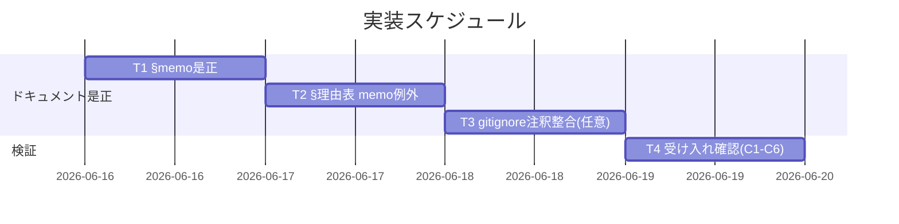
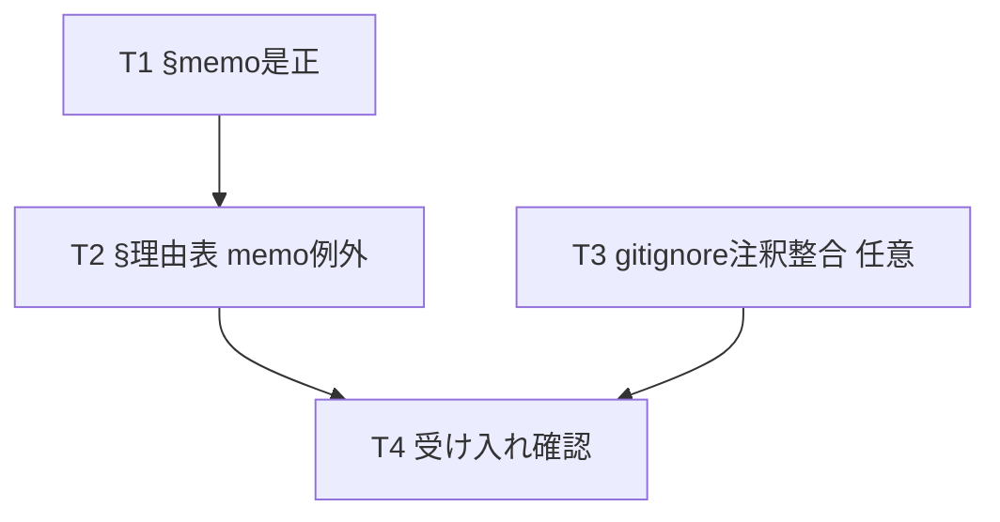
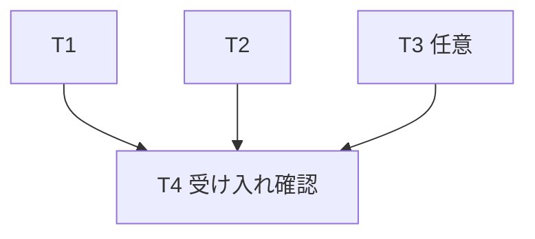

# 実装計画書: 自己拡張 memo の gitignore 矛盾是正

**プロジェクト名**: 自己拡張 memo の gitignore 矛盾是正
**作成日**: 2026 年 06 月 16 日
**最終更新**: 2026 年 06 月 16 日

> **重要**: **このドキュメントは常に更新**: 実装計画の変更、進捗状況の更新、バグの記録などがあった場合は、即座にこのドキュメントを更新してください。ドキュメントは「生きているドキュメント」として扱い、実装内容と常に同期させます。
> **必須項目**: 「必須」と明記した欄は空欄・抽象語のみで提出しないこと。テスト観点・BDD 仕様は具体ケースを 1 件以上記載すること。
>
> **用語**: [.agents/CONCEPTS.md §用語規約](../../../../../.agents/CONCEPTS.md#用語規約) を参照。

---

## 1. 実装概要

### 1.1 実装方針（必須）

ルート `.gitignore` の `**/memo/*`（=正・実挙動）を**変更せず**、`.agents-project/自己拡張ワークフロー.md` の memo 関連宣言を「非追跡（transient）」へ是正し、宣言と実挙動を一致させる（02 §1.1・(b) 採用）。実装の中心は**ドキュメント文言の編集**であり、**自動テストは存在しない**。検証は `git check-ignore -v`（挙動）と `grep`/`git diff`（文面）による**手動受け入れ確認**で行う。

### 1.2 実装順序（必須: 1 件以上）

1. **T1**: §memo 宣言を「非追跡（transient）」へ是正＋証跡本則 workflow.db 明文化（02 機能1）。
2. **T2**: §理由の名前空間表で memo 例外（issue docs=追跡／memo=非追跡）を明記（02 機能2）。
3. **T3（任意）**: `.gitignore:42` 注釈の文言整合（ルール行は不変）（02 機能3）。
4. **T4**: 受け入れ確認（C1〜C6 を `check-ignore`/`grep`/`git diff` で検証）。



---

## 2. タスク分解

**必須**: 各タスクには「テスト観点」（2.x.3）と「単体テスト仕様（BDD）」（2.x.4）を記載する。本件は自動テスト対象が無いため、BDD は **`git check-ignore`/`grep`/`git diff` を When/Then とする受け入れ確認**として記述する（観点定義は 02 §6・[RULES のテスト戦略](../../../../../.agents/RULES.md#テスト戦略必須要件)・[TEST_BDD_FORMAT](../../../../../.agents/TEST_BDD_FORMAT.md)）。

### 2.1 タスク 1: §memo 宣言の「非追跡（transient）」是正

#### 2.1.1 概要（必須）

`.agents-project/自己拡張ワークフロー.md` §memo（29 行「git 追跡対象」）を「非追跡（transient）」へ是正し、本則証跡が workflow.db である旨を明文化する（02 機能1・対応: 01 シナリオ1）。

#### 2.1.2 実装内容（必須: 1 件以上）

- 29 行「これらは **git 追跡対象**であり、issue 本体と同一名前空間に置く。」を、「これらは **非追跡（transient）**であり（ルート `.gitignore` の `**/memo/*` で無視される）、置き場所のみ issue 本体と同一名前空間に置く。」相当へ是正する。
- §memo に「memo は過渡的スクラッチで正本ではない。レビュー（review-docs 等）の本則証跡は `workflow.db`（消費者ランタイム生成物・gitignore 対象）に残る。git 追跡する成果物は issue ドキュメント（00〜04）のみ」を明文化する。
- memo 文脈で「git 追跡対象」と読める文言が他に残らないか §memo 全体を確認する。

#### 2.1.3 テスト観点（必須）

**参照**: 観点定義は [02\_設計 §6](./02_設計.md)・[RULES のテスト戦略・TEST_BDD_FORMAT](../../../../../.agents/RULES.md#テスト戦略必須要件)。本タスクの具体ケースのみ記載。

##### 単体（本タスクの具体ケース・必須 1 件以上）

- 是正後、`git check-ignore -v docs/maintainer/workflow/20260615_124812_自己拡張memoのgitignore矛盾是正/memo/x.md` が `.gitignore:44:**/memo/*` でヒットする（C1）。
- 是正後、`.agents-project/自己拡張ワークフロー.md` の §memo に memo 文脈の「git 追跡対象」が 0 件（C4）。

##### 結合/API（本タスクの具体ケース・該当時は必須 1 件以上）

- 該当なし（API 契約は 02 §5 の観測契約 C1/C4 で代替。上記単体ケースが兼ねる）。

##### E2E/受け入れ（本タスクの具体ケース・未達時は理由記載）

- E2E 自動テストは該当なし（実行コード無し）。受け入れは T4 の手動確認手順で担保。

##### バリデーション（該当する場合の具体ケース）

- 該当なし（入力バリデーションを持たない）。

#### 2.1.4 単体テスト仕様（BDD）（必須）

**BDD 形式のテストケース（高レベル仕様）** — 01 ユースケース1・シナリオ1 に対応:

```gherkin
Feature: 自己拡張memoのgitignore矛盾是正
  Scenario: .agents-project宣言をmemo非追跡へ是正する
    Given .agents-project/自己拡張ワークフロー.md の§memoが「git追跡対象」と宣言している
    When §memo宣言を「非追跡(transient)」へ是正し、本則証跡=workflow.dbを明文化する
    Then §memoにmemo文脈の「git追跡対象」文言が残らない（grepで0件）
    And `git check-ignore -v docs/maintainer/workflow/<issue>/memo/<file>.md` が `.gitignore:44:**/memo/*` でヒットする
```

**検証コマンド例（Given/When/Then をインラインコメントで明記）**

```bash
# Given: §memoが「git追跡対象」と宣言している（是正前）
grep -n 'git 追跡対象' .agents-project/自己拡張ワークフロー.md   # 29行がヒット（是正前）

# When: §memo宣言を「非追跡(transient)」へ是正する（ドキュメント編集・実装フェーズで実施）

# Then: memo文脈で「追跡対象」と読める残存が0件
grep -nE 'memo.*(git 追跡対象|追跡対象)' .agents-project/自己拡張ワークフロー.md   # 0件であること
# Then: memo が **/memo/* で無視される（非追跡）
git check-ignore -v docs/maintainer/workflow/20260615_124812_自己拡張memoのgitignore矛盾是正/memo/x.md
#   => .gitignore:44:**/memo/* ... でヒットすること
```

#### 2.1.5 依存関係

- 先行なし（最初のタスク）。T2 は本タスクの是正結果（memo＝非追跡）に整合させる。



#### 2.1.6 見積もり

- **工数**: 0.5h
- **優先度**: 高

### 2.2 タスク 2: §理由の名前空間表における memo 例外の明記

#### 2.2.1 概要（必須）

§理由の表（66〜76 行）の `docs/maintainer/workflow/` 行が「追跡する」となっているのは issue 本体ドキュメント（00〜04）を指し、memo は例外（非追跡）である旨を明記する（02 機能2・§10.2・対応: 01 シナリオ1/ストーリー2）。

#### 2.2.2 実装内容（必須: 1 件以上）

- 表の `docs/maintainer/workflow/` 行の役割欄に「issue 本体ドキュメント（00〜04）を指す。**memo は例外（非追跡・`**/memo/*` で無視）**」を追記、または表直下に同旨の脚注を付す。
- §issue 作成場所（18 行「git 追跡対象」＝issue docs を指す・正）は**変更しない**ことを確認する。
- §issue 作成場所・§memo・§理由の表の三者が「issue docs=追跡／memo=非追跡」で相互に矛盾しないことを確認する。

#### 2.2.3 テスト観点（必須）

**参照**: [02\_設計 §6](./02_設計.md)・[RULES のテスト戦略](../../../../../.agents/RULES.md#テスト戦略必須要件)。

##### 単体（本タスクの具体ケース・必須 1 件以上）

- 是正後、§理由の表（または脚注）に「memo は例外（非追跡）」相当の文言が存在する（C5）。
- §issue 作成場所（18 行）の issue docs 追跡宣言が保持され「追跡」が消えていない（C5・C2 と整合）。
- `git check-ignore -v docs/maintainer/workflow/<issue>/02_設計.md` がヒットしない（issue docs は追跡対象のまま・C2）。

##### 結合/API（本タスクの具体ケース・該当時は必須 1 件以上）

- 該当なし（観測契約 C2/C5 が兼ねる）。

##### E2E/受け入れ（本タスクの具体ケース・未達時は理由記載）

- 自動テスト該当なし（文面確認のため）。T4 の手動確認で担保。

##### バリデーション（該当する場合の具体ケース）

- 該当なし。

#### 2.2.4 単体テスト仕様（BDD）（必須）

**BDD 形式のテストケース（高レベル仕様）** — 01 ストーリー2／処理フロー（memo 例外）に対応:

```gherkin
Feature: 自己拡張memoのgitignore矛盾是正
  Scenario: 名前空間表でmemo例外（issue docs=追跡 / memo=非追跡）を明記する
    Given §理由の表でdocs/maintainer/workflow/が「追跡する」となっている
    And この「追跡する」はissue docs(00〜04)を指し、memoは例外である
    When 表行または脚注に「memoは例外(非追跡)」を明記する
    Then §issue作成場所のissue docs追跡宣言は保持される
    And `git check-ignore -v docs/maintainer/workflow/<issue>/02_設計.md` はヒットしない（issue docsは追跡）
    And `git check-ignore -v docs/maintainer/workflow/<issue>/memo/<file>.md` はヒットする（memoは非追跡）
```

**検証コマンド例（Given/When/Then をインラインコメントで明記）**

```bash
# Given: 表の docs/maintainer/workflow/ 行が「追跡する」である
grep -n 'docs/maintainer/workflow/' .agents-project/自己拡張ワークフロー.md

# When: memo例外を表行/脚注に明記する（ドキュメント編集・実装フェーズで実施）

# Then: issue docsは追跡（check-ignoreでヒットしない）
git check-ignore -v docs/maintainer/workflow/20260615_124812_自己拡張memoのgitignore矛盾是正/02_設計.md || echo "TRACKED(=期待どおり)"
# Then: memoは非追跡（check-ignoreでヒットする）
git check-ignore -v docs/maintainer/workflow/20260615_124812_自己拡張memoのgitignore矛盾是正/memo/x.md
```

#### 2.2.5 依存関係

- T1（§memo 是正）に後続。memo＝非追跡へ整合させた上で表に例外を明記する。

#### 2.2.6 見積もり

- **工数**: 0.5h
- **優先度**: 高

### 2.3 タスク 3: `.gitignore:42` 注釈の文言整合（任意）

#### 2.3.1 概要（必須）

`.gitignore:42` の注釈「必要に応じて個別に追跡する」を「memo は非追跡（transient）。証跡本則は workflow.db」へ整え、第 3 の矛盾点を解消する（02 機能3）。**ルール行 `**/memo/*`（是正後 44 行・是正前 43 行）は変更しない。**

#### 2.3.2 実装内容（必須: 1 件以上）

- 42 行コメントを確定方針（memo は非追跡で一意）と整合させる文言へ書き換える。
- ルール行 `**/memo/*`（是正後 44 行）および他のルール行は変更しない。

#### 2.3.3 テスト観点（必須）

**参照**: [02\_設計 §6](./02_設計.md)。

##### 単体（本タスクの具体ケース・必須 1 件以上）

- 是正後、`git check-ignore -v` の C1〜C3 の出力（ヒット元の行・無視可否）が是正前と変わらない（C6・挙動不変）。
- `git diff .gitignore` の差分がコメント行のみで、ルール行に差分が無い（C6）。

##### 結合/API（本タスクの具体ケース・該当時は必須 1 件以上）

- 該当なし。

##### E2E/受け入れ（本タスクの具体ケース・未達時は理由記載）

- 自動テスト該当なし。T4 の手動確認（前後比較）で担保。

##### バリデーション（該当する場合の具体ケース）

- 該当なし。

#### 2.3.4 単体テスト仕様（BDD）（必須）

**BDD 形式のテストケース（高レベル仕様）**:

```gherkin
Feature: 自己拡張memoのgitignore矛盾是正
  Scenario: gitignore注釈を整合させても挙動を変えない
    Given .gitignore:42のコメントが「必要に応じて個別に追跡する」となっている
    When 42行コメントを「memoは非追跡(transient)。証跡本則はworkflow.db」へ整える
    Then `git diff .gitignore` の差分はコメント行のみでルール行に差分が無い
    And C1〜C3の `git check-ignore -v` 出力が是正前後で不変である
```

**検証コマンド例（Given/When/Then をインラインコメントで明記）**

```bash
# Given: 編集前のcheck-ignore挙動を記録
git check-ignore -v docs/maintainer/workflow/20260615_124812_自己拡張memoのgitignore矛盾是正/memo/x.md > /tmp/before.txt

# When: 42行コメントのみ書き換える（実装フェーズで実施）

# Then: ルール行に差分が無い（コメントのみ）
git diff .gitignore   # ルール行 **/memo/* に差分が無いことを目視確認（追加はコメント行のみ）
# Then: 挙動が不変
git check-ignore -v docs/maintainer/workflow/20260615_124812_自己拡張memoのgitignore矛盾是正/memo/x.md > /tmp/after.txt
diff /tmp/before.txt /tmp/after.txt   # 差分なし（挙動不変）であること
```

#### 2.3.5 依存関係

- T1・T2 と独立に実施可能（任意タスク）。T4 の前に完了させる。

#### 2.3.6 見積もり

- **工数**: 0.25h
- **優先度**: 中（任意。含めると再発防止が向上）

### 2.4 タスク 4: 受け入れ確認（C1〜C6・(a) 却下記録）

#### 2.4.1 概要（必須）

02 §5 の観測契約 C1〜C6 と 01 の全 BDD（シナリオ1/2・却下シナリオ）を、`git check-ignore -v`/`grep`/`git diff` で確認し、(a) 却下が記録されていることを確認する（対応: 01 ユースケース2・却下シナリオ）。

#### 2.4.2 実装内容（必須: 1 件以上）

- C1（memo 非追跡）・C2（issue docs 追跡）・C3（`.workflow/` memo 無視）を `git check-ignore -v` で確認。
- C4（memo 文脈「追跡対象」残存 0）・C5（issue docs 追跡保持＋memo 例外明記）を `grep` で確認。
- C6（`.gitignore` ルール行不変・negate 行を追加していない）を `git diff` で確認。
- (a) 却下とその理由が 00/01/02（§10.1）に記録されていることを確認（negate 行を追加していないこと＝C6 と整合）。

#### 2.4.3 テスト観点（必須）

**参照**: [02\_設計 §6](./02_設計.md)・[RULES のテスト戦略](../../../../../.agents/RULES.md#テスト戦略必須要件)。

##### 単体（本タスクの具体ケース・必須 1 件以上）

- C1〜C6 のすべてが期待結果（02 §5.1 の表）どおりである。
- `.gitignore` に `!`（negate）で memo を追跡対象化する行が**存在しない**（C6・(a) 却下の帰結）。

##### 結合/API（本タスクの具体ケース・該当時は必須 1 件以上）

- 該当なし（本件は単一リポ内の git 設定・ドキュメント整合のみ）。

##### E2E/受け入れ（本タスクの具体ケース・未達時は理由記載）

- **受け入れシナリオ（手動・自動テスト無しの代替）**: 下記 2.4.4 の検証コマンド一式が全て期待結果になること＝受け入れ合格条件とする。自動 E2E は実行コードが無いため該当なし。

##### バリデーション（該当する場合の具体ケース）

- 該当なし。

#### 2.4.4 単体テスト仕様（BDD）（必須）

**BDD 形式のテストケース（高レベル仕様）** — 01 ユースケース1 シナリオ2（`.workflow/` 無視維持）・ユースケース2 却下シナリオに対応:

```gherkin
Feature: 自己拡張memoのgitignore矛盾是正
  Scenario: 消費者ランタイムmemoの無視が維持される
    Given .gitignoreの `**/memo/*` および `/.workflow/*` を変更していない
    When `git check-ignore -v .workflow/<issue>/memo/<file>.md` を実行する
    Then 当該memoは無視される（/.workflow/* または **/memo/* 由来でヒット）

  Scenario: negateで保守者memoを追跡対象化する案を却下する
    Given negateパターン（!docs/maintainer/.../memo/）で追跡対象化する代替案がある
    When 確定方針（memoは正本でない・git追跡はissue docs 00〜04のみ）に照らす
    Then .gitignoreにmemo追跡化のnegate行を追加しない（C6）
    And 却下理由が00/01/02(§10.1)に記録されている
```

**検証コマンド例（Given/When/Then をインラインコメントで明記）**

```bash
# Given/When/Then: C3 消費者ランタイムmemoの無視維持
git check-ignore -v .workflow/sample/memo/x.md   # /.workflow/* または **/memo/* でヒットすること

# Then: C6 negate行が存在しない（(a)却下の帰結）
grep -nE '^!.*memo' .gitignore && echo "NG: negate行あり" || echo "OK: negate行なし"

# Then: (a)却下が記録されている
grep -n '却下' docs/maintainer/workflow/20260615_124812_自己拡張memoのgitignore矛盾是正/02_設計.md
```

#### 2.4.5 依存関係

- T1・T2・（T3）完了後に実施。



#### 2.4.6 見積もり

- **工数**: 0.5h
- **優先度**: 高

---

## テスト観点

本実装計画全体のテスト観点は「**文面整合**（memo＝非追跡の明記・issue docs 追跡の保持・memo 例外の明記・(a) 却下記録）」と「**挙動不変**（`git check-ignore` のヒット元・無視可否が方針どおりで、ルール行は不変）」の 2 系統である。自動テスト対象（関数/エンドポイント）は無く、`git check-ignore -v`/`grep`/`git diff` による手動受け入れ確認で全契約 C1〜C6 を担保する。各タスクの §2.x.3 に具体ケースを記載済み。

---

## 単体テスト

実行コードが無いため**コードの単体テストは存在しない**。代替として、各タスクの §2.x.4 の BDD（`check-ignore`/`grep`/`git diff` を When/Then とする受け入れ確認）を「単体相当」の最小検証単位とする。この方針の妥当性（ドキュメント＋gitignore 整合のため自動テスト不要）は 02 §6 に記載し、04_review で再確認する。

---

## BDD

- T1: 01 ユースケース1・シナリオ1（宣言を memo 非追跡へ是正）に対応（C1・C4）。
- T2: 01 ストーリー2・処理フロー（memo 例外・issue docs 追跡）に対応（C2・C5）。
- T3: gitignore 注釈整合（挙動不変・C6）。
- T4: 01 ユースケース1・シナリオ2（`.workflow/` 無視維持・C3）＋ユースケース2・却下シナリオ（(a) 却下・negate 不追加・C6）に対応。

Given/When/Then 形式は [TEST_BDD_FORMAT.md](../../../../../.agents/TEST_BDD_FORMAT.md) に従う。

---

## 3. 実装スケジュール

### 3.1 マイルストーン

| マイルストーン | 期日 | 成果物 |
| --- | --- | --- |
| 文言是正完了（T1・T2、任意 T3） | 実装フェーズ | 是正済 `.agents-project/自己拡張ワークフロー.md`（＋任意 `.gitignore` 注釈） |
| 受け入れ確認完了（T4） | 実装フェーズ | C1〜C6 の検証ログ（memo に記録）・04_review での合否 |

### 3.2 実装フェーズ

#### フェーズ 1: ドキュメント是正

- **期間**: 実装フェーズ（implement-feature）
- **タスク**: T1, T2, （T3）

#### フェーズ 2: 受け入れ確認

- **期間**: 実装フェーズ末／verify-and-close
- **タスク**: T4（C1〜C6 検証）

---

## 4. テスト計画

テスト観点・レベル・BDD 形式の定義は 02 §6・RULES のテスト戦略・TEST_BDD_FORMAT を参照。各タスクの §2.x.3 に具体ケース、§2.x.4 に BDD 仕様を記載済み。

### 4.1 テストの優先順位

- C1（memo 非追跡）・C4（宣言残存 0）・C6（ルール行不変）を最優先で確認（本件の中核契約）。
- C2（issue docs 追跡保持）・C3（`.workflow/` 無視維持）・C5（memo 例外明記）を回帰観点として必ず含める。

### 4.2 自動テストが無い場合の受け入れ確認手順（必須）

本件は実行コードを伴わないため自動テストを作らない。受け入れは以下の**手動手順を全て満たすこと**を合格条件とする（証跡は memo に記録し、verify-and-close 時に 04_review へ反映）:

1. `grep -nE 'memo.*(git 追跡対象|追跡対象)' .agents-project/自己拡張ワークフロー.md` が **0 件**（C4）。
2. §memo に「非追跡（transient）」「本則証跡＝workflow.db」「git 追跡は issue docs(00〜04)のみ」が明記（C4 文面）。
3. §理由の表（または脚注）に「memo は例外（非追跡）」が明記され、§issue 作成場所の issue docs 追跡宣言が保持（C5）。
4. `git check-ignore -v docs/maintainer/workflow/<issue>/memo/x.md` が `.gitignore:44:**/memo/*` でヒット（C1）。
5. `git check-ignore -v docs/maintainer/workflow/<issue>/02_設計.md` がヒットしない（C2）。
6. `git check-ignore -v .workflow/<issue>/memo/x.md` がヒット（C3）。
7. `grep -nE '^!.*memo' .gitignore` が **0 件**＝negate 追跡化を追加していない（C6・(a) 却下）。
8. （T3 実施時）`git diff .gitignore` の差分がコメント行のみ（C6）。

---

## 5. リスク管理

### 5.1 実装リスク

- **リスク**: §memo 是正時に旧「追跡対象」文言を取り残し矛盾再発（00 §7.1）。
  - **対策**: 受け入れ手順 1（grep 0 件）で残存ゼロを保証。
- **リスク**: 是正対象を取り違え、issue docs（§issue 作成場所 18 行）の追跡宣言まで「非追跡」と書き換える。
  - **対策**: 対象行を §memo（29 行）と §理由表の memo 例外に限定。受け入れ手順 3・5（C2/C5）で issue docs 追跡保持を確認。
- **リスク**: T3 でルール行を誤改変し挙動が変わる。
  - **対策**: 受け入れ手順 8（`git diff` コメントのみ）＋前後 `check-ignore` 比較（C6）で挙動不変を保証。

---

## 6. 参考資料

### プロジェクトドキュメント

- [`02_設計.md`](./02_設計.md) - 設計（§5 観測契約 C1〜C6・§10 設計判断）
- [`01_要件定義.md`](./01_要件定義.md) - 要件（BDD シナリオ）
- [`00_要求定義.md`](./00_要求定義.md) - 要求（成功基準）

### その他の参考資料

- ルート [`.gitignore`](../../../../../.gitignore) - 42〜44 行（コメント 42〜43 行・ルール行 `**/memo/*` 44 行）
- [`.agents-project/自己拡張ワークフロー.md`](../../../../../.agents-project/自己拡張ワークフロー.md) - 是正対象

---

## 7. 前のステップ

この実装計画書は、以下のドキュメントを基に作成されています：

- **前**: [`02_設計.md`](./02_設計.md) - 設計フェーズ

---

## 8. 次のステップ

この実装計画書の承認後、以下のいずれかのステップに進みます：

- 本プロジェクトは 1 つの issue であり、サブ issue 分割は不要（90_issues.md は作成しない）。実装フェーズ（implement-feature）に直接進む。

**用語**: [.agents/CONCEPTS.md §用語規約](../../../../../.agents/CONCEPTS.md#用語規約) を参照。
