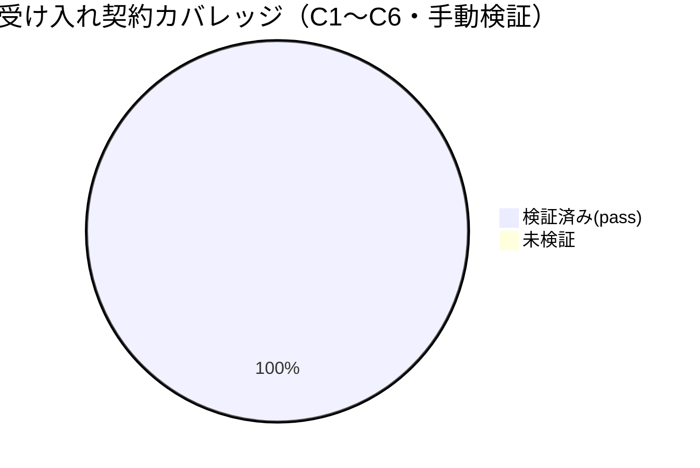

# レビュー書: 自己拡張 memo の gitignore 矛盾是正

**プロジェクト名**: 自己拡張 memo の gitignore 矛盾是正
**作成日**: 2026 年 06 月 16 日
**最終更新**: 2026 年 06 月 16 日

> **重要**: **このドキュメントは常に更新**: レビューで発見した問題点や改善提案、対応内容などがあった場合は、即座にこのドキュメントを更新してください。ドキュメントは「生きているドキュメント」として扱い、実装内容と常に同期させます。
>
> **用語**: [.agents/CONCEPTS.md §用語規約](../../../../../.agents/CONCEPTS.md#用語規約) を参照。
>
> **必須**: レビュー実施時は [`.agents/REVIEW_RULE.md`](../../../../../.agents/REVIEW_RULE.md) を参照。レビュー深度は本件の変更規模（ドキュメント文言の小規模是正・実行コード無し）に応じ **standard** を採用。二観点（[.agents/REVIEW_DUAL_LENS.md](../../../../../.agents/REVIEW_DUAL_LENS.md)）の敵対的観点リスト・must-preserve リストを §9.4 に併記する。

---

## 1. レビュー概要

### 1.1 レビュー目的（必須）

実装内容の確認・品質保証・受け入れ基準（00 §6・01 受け入れ基準）と観測契約 C1〜C6 の充足検証を行い、本 issue の close 可否を判定する（実装後の正式レビュー）。

### 1.2 レビュー対象（必須）

- **実装範囲**: `.agents-project/自己拡張ワークフロー.md` の memo 関連宣言を「非追跡（transient）」へ是正（T1）、§理由の名前空間表に memo 例外を明記（T2）、ルート `.gitignore:42` 注釈の文言整合（T3・任意・実施）、受け入れ確認 C1〜C6（T4）。`.gitignore` のルール行 `**/memo/*` は不変。
- **レビュー期間**: 2026-06-16 ～ 2026-06-16
- **レビュー担当者**: verify-and-close サブエージェント（fresh reviewer）

---

## 2. 実装内容の確認

### 2.1 実装完了タスク（または Issue）

| タスク名 | 実装内容 | 実装日 | 担当者 | ステータス（必須: 完了 または 要修正） |
| --- | --- | --- | --- | --- |
| T1 §memo 是正 | §memo（28〜30 行）の「git 追跡対象」を「非追跡（transient）」へ是正＋証跡本則 workflow.db・追跡対象は issue docs(00〜04)のみを明文化 | 2026-06-16 | implement-feature | 完了 |
| T2 §理由表 memo 例外 | 名前空間表 `docs/maintainer/workflow/` 行（73 行）に「memo は例外＝非追跡」追記＋77 行に誤読防止脚注 | 2026-06-16 | implement-feature | 完了 |
| T3 gitignore 注釈整合（任意） | `.gitignore` の memo コメントを「memo は非追跡（transient）。本則証跡は workflow.db」へ整合。ルール行 `**/memo/*` 不変 | 2026-06-16 | implement-feature | 完了 |
| T4 受け入れ確認 | C1〜C6 を `git check-ignore -v`/`grep`/`git diff` で検証 | 2026-06-16 | implement-feature / verify-and-close | 完了 |

### 2.2 実装内容の詳細

#### タスク 1: §memo 宣言の「非追跡（transient）」是正

- **実装内容**: `.agents-project/自己拡張ワークフロー.md` 29〜30 行で memo を「非追跡（transient）であり（ルート `.gitignore` の `**/memo/*` で無視される）、置き場所のみ issue 本体と同一名前空間」と是正。追跡可否の単一情報源はルート `.gitignore` であり本宣言は上書きしない旨、memo は過渡的スクラッチで正本でない旨、本則証跡は workflow.db に残る旨、git 追跡する成果物は issue ドキュメント（00〜04）のみである旨を明文化。
- **変更ファイル**: `.agents-project/自己拡張ワークフロー.md`
- **実装方法**: 宣言テキストの是正（決定権は `.gitignore` に固定、ドキュメントは参照に徹する単一情報源設計／02 §1.1・§2.1）。
- **確認事項（実測・本レビューで再検証）**: §memo に memo 文脈の「追跡対象」残存なし（C4・後述）。

#### タスク 2: §理由表 memo 例外の明記

- **実装内容**: 名前空間表 73 行の `docs/maintainer/workflow/` 行で「『追跡する』は issue 本体ドキュメント（00〜04）を指す」「`memo/` は例外＝非追跡」を明記し、77 行に誤読防止脚注を付与。§issue 作成場所（18 行「git 追跡対象」＝issue docs を指す・正）は変更せず保持。
- **変更ファイル**: `.agents-project/自己拡張ワークフロー.md`
- **実装方法**: 表行の役割欄追記＋脚注（02 §3.2・§10.2）。
- **確認事項（実測）**: 18 行の issue docs 追跡宣言が保持（C5・C2 と整合）。

#### タスク 3: `.gitignore:42` 注釈整合（任意・実施）

- **実装内容**: 旧コメント「memoは基本的にGit管理外。必要に応じて個別に追跡する（例: …01_背景と目的.md）」を「memo は非追跡（transient）。レビュー等の本則証跡は workflow.db に残る（git 追跡する成果物は issue ドキュメント 00〜04 のみ）」＋正本コメントへ整合。**ルール行 `**/memo/*` は不変**（コメント追加により行番号は 43→44 へシフトのみ）。
- **変更ファイル**: `.gitignore`
- **実装方法**: コメント行のみの編集。`git diff` でルール行に差分が無いことを確認（C6）。
- **確認事項（実測）**: diff はコメント差分（-1/+2）のみ・ルール行 `**/memo/*` 不変。

---

## 3. テスト結果の確認

### 3.1 単体テスト

#### テスト実行結果

- **実行日**: 2026-06-16
- **テストファイル数**: 0（実行コードを伴わないドキュメント整合のため自動テスト対象なし）
- **テストケース数**: 0（自動）／手動受け入れ確認 6 契約（C1〜C6）
- **成功**: N/A（自動）／手動 6/6 pass
- **失敗**: 0
- **スキップ**: N/A

> **自動テスト無しの妥当性（必須記載）**: 本件は実行コード・関数・エンドポイントを持たず、`.gitignore` パターンと `.agents-project/` のドキュメント文言の整合のみが対象である（02 §6・03 §4.2）。したがって単体/結合/E2E の**自動テストは「該当なし」**とし、**`git check-ignore -v` による挙動確認**と **`grep`/`git diff` による文面確認**の手動受け入れ確認（C1〜C6）で代替する。本レビューではその全契約を実コマンドで再実測した（§3.2）。

#### テストカバレッジ

### 3.2 受け入れ契約 C1〜C6 の再実測（手動・本レビューで再検証）

| 契約 | 観測コマンド（本レビューで実行） | 期待結果 | 実測結果 | 判定 |
| --- | --- | --- | --- | --- |
| C1: memo 非追跡 | `git check-ignore -v docs/maintainer/workflow/20260615_124812_.../memo/dummy.md` | `.gitignore:44:**/memo/*` でヒット | `.gitignore:44:**/memo/*` でヒット（exit=0） | **pass** |
| C2: issue docs 追跡維持 | `git check-ignore -v docs/maintainer/workflow/20260615_124812_.../02_設計.md` | ヒットなし（追跡対象） | 出力なし・exit=1（追跡対象） | **pass** |
| C3: 消費者ランタイム memo 無視維持 | `git check-ignore -v .workflow/x/memo/y.md` | `/.workflow/*` または `**/memo/*` でヒット | `.gitignore:12:/.workflow/*` でヒット（exit=0） | **pass** |
| C4: 宣言の残存ゼロ | `grep -nE 'memo.*追跡対象' .agents-project/自己拡張ワークフロー.md` / `grep -nE 'memo.*(git ?追跡対象\|追跡対象)' …` | memo 文脈で 0 件 | 両 grep とも 0 件（exit=1） | **pass** |
| C5: issue docs 宣言の非破壊＋memo 例外明記 | §issue 作成場所 18 行・§理由表 73 行・脚注 77 行を実測 | 18 行「git 追跡対象」保持／表・脚注に memo 例外明記 | 18 行保持・73 行「memo/ は例外＝非追跡」・77 行脚注あり | **pass** |
| C6: gitignore ルール行不変＋negate 不追加 | `git diff .gitignore` / `grep -nE '^!.*memo' .gitignore` | コメントのみ差分・ルール行不変・negate 0 | diff はコメント（-1/+2）のみ・`**/memo/*` 不変・negate 0 件 | **pass** |

**実測ログの要点**:
- C1: `git check-ignore -v` 出力＝`.gitignore:44:**/memo/*`（行番号 44 はドキュメント記載と一致）。
- C2: exit=1（無視されない＝追跡対象のまま）。
- C3: `.gitignore:12:/.workflow/*` がヒット（`.workflow/` 名前空間の無視維持）。
- C4: `memo.*追跡対象` も `memo.*(git ?追跡対象|追跡対象)` も 0 件。
- C6: `git diff .gitignore` はコメント 2 行（旧 1 行→新 2 行）のみ、ルール行 `**/memo/*` に差分なし。`grep -nE '^!.*memo'` 0 件。

### 3.3 統合テスト

該当なし（単一リポ内の git 設定・ドキュメント整合のみ。C2/C3 の check-ignore が回帰確認を兼ねる）。

### 3.4 E2E テスト

該当なし（実行コード・UI を持たない）。受け入れは §3.2 の手動契約確認で担保。

---

## 4. コードレビュー

### 4.1 コード品質

#### コードスタイル

- **リント結果**: N/A（ドキュメント・gitignore のみ。リント対象コードなし）
- **フォーマット**: 問題なし（既存 markdown / gitignore コメント形式に準拠）
- **型チェック**: N/A

#### コードレビュー観点

| 観点 | 確認内容（必須: 1 文） | 結果 | コメント |
| --- | --- | --- | --- |
| 可読性 | memo＝非追跡・証跡本則=workflow.db・追跡は issue docs のみの 3 点が一意に読めるか | OK | §memo 30 行・表脚注 77 行で明文化。誤読防止脚注あり。 |
| 保守性 | 「memo の追跡可否」の単一情報源を `.gitignore` に固定し二重管理を排したか | OK | ドキュメント宣言は「決定」せず「参照・説明」に限定（02 §2.1.1）。 |
| パフォーマンス | ビルド/実行時性能への影響 | OK | 影響なし（git 設定・ドキュメントのみ）。 |
| セキュリティ | 秘匿情報経路・配布物汚染の新規発生 | OK | memo 非追跡の確定で過渡的スクラッチの git/pack 混入ガードを維持（02 §8.2）。 |

### 4.2 指摘事項

#### 指摘 1: 実装 memo 末尾のツール痕跡混入（本 issue 範囲外・実害なし）

- **重要度**: 低
- **指摘内容**: 実装 memo `memo/20260616_031333_受け入れ確認ログ.md` 末尾に `</content></invoke>` のツール痕跡が混入している。
- **対応状況**: 対応不要（本レビューでは改変しない）
- **対応方法**: memo は gitignore 対象（`**/memo/*`）で**非追跡＝コミットされない**ため、配布物・git 履歴への混入は無く実害なし。review-docs memo でも MP3（歴史的記録の不改変）として保持判断済み。close 可否には影響しない。

> 上記以外の指摘は無し（review-docs ラウンド 2 で指摘 0 に収束済み。本レビュー（fresh reviewer）でも C1〜C6 再実測で退行なしを確認）。

---

## 5. ドキュメントの確認

### 5.1 ドキュメント更新状況

| ドキュメント | 更新状況 | 確認者 | 確認日 |
| --- | --- | --- | --- |
| [`00_要求定義.md`](./00_要求定義.md) | 更新済み（行番号参照 43→44 是正・document_id 不変） | verify-and-close | 2026-06-16 |
| [`01_要件定義.md`](./01_要件定義.md) | 更新済み（同上） | verify-and-close | 2026-06-16 |
| [`02_設計.md`](./02_設計.md) | 更新済み（同上） | verify-and-close | 2026-06-16 |
| [`03_実装計画.md`](./03_実装計画.md) | 更新済み（同上） | verify-and-close | 2026-06-16 |

### 5.2 ドキュメントの整合性

- **実装と設計の整合性**: 整合している（02 §5 の観測契約 C1〜C6 ↔ 03 §4.2 受け入れ手順 ↔ 実装 memo の検証結果 ↔ 本レビュー §3.2 再実測 が 1:1 で対応）。
- **要件と実装の整合性**: 整合している（01 ストーリー 1/2/3・BDD シナリオ ↔ C1/C3/C4/C5/C6 ↔ 実装）。
- **行番号参照の現状整合（本タスク必須確認）**: review-docs ラウンド 1 で `.gitignore` のルール行ヒット元が **43→44** にシフトした点を生きたドキュメント（00/01/02/03）の C1 期待値・参照行に反映済み。本レビューで `git check-ignore -v` 実測＝`.gitignore:44:**/memo/*` がドキュメント記載と一致することを確認。残る `43`/`42〜43` 表記は (i) `00:70` の歴史的コミット `7a9e1f8` の事実（`git show 7a9e1f8:.gitignore` で当時 43 行を裏取り済み・MP3 不改変）、(ii) コメント範囲「42〜43 行」（コメントは実際に 42〜43 行・ルール行は 44 行）であり、いずれも**正しい現状記述**である。
- **コメント**: 矛盾の単一情報源化が達成され、再発防止が成立。

---

## 6. パフォーマンス確認

### 6.1 パフォーマンステスト結果

該当なし（git 設定・ドキュメント整合。ビルド/実行時性能に影響しない／00 §3.1）。

### 6.2 ボトルネックの確認

該当なし。

---

## 7. セキュリティ確認

### 7.1 セキュリティチェック

| 項目 | 確認内容 | 結果 | コメント |
| --- | --- | --- | --- |
| 認証・認可 | 該当機能なし | OK | N/A |
| データ保護 | memo 非追跡確定で過渡的スクラッチの git/npm pack 混入を防ぐ既存ガードを維持 | OK | 新規秘匿情報経路を作らない（02 §8.2）。 |
| 入力検証 | 入力バリデーションを持つ機能なし | OK | N/A |

---

## 8. デプロイ準備

### 8.1 デプロイチェックリスト

- [x] すべての受け入れ契約（C1〜C6）が pass している
- [x] コードレビュー（文面・gitignore 整合）が完了している
- [x] ドキュメント（00〜03・`.agents-project/`・`.gitignore` コメント）が更新されている
- [ ] マイグレーションスクリプト（該当なし）
- [ ] 環境変数の設定（該当なし）
- [ ] バックアップ計画（該当なし）

### 8.2 デプロイ計画

- **デプロイ予定日**: 該当なし（リポジトリ内の整合のみ。リリース成果物なし）
- **デプロイ方法**: 該当なし
- **ロールバック計画**: 該当なし（`.gitignore` ルール行不変のため挙動の後退リスクなし。文面是正は git revert で復元可能）

---

## docs 更新

- 要否: 不要
- 対象: なし
- 理由: 本件はリポジトリ運用ルール（`.agents-project/`）と `.gitignore` の整合であり、システム仕様書（`docs/` の機能仕様・画面・データ・API）に影響しないため。

---

## 9. 設計・境界の確認

**注意**: review-architecture の結果をここに記載する。

### 9.1 設計の確認

- **設計原則の準拠**: 単一情報源（Single Source of Truth）パターンに準拠（02 §2.2）。「memo の追跡可否」の決定権を `.gitignore` の `**/memo/*` 1 か所に固定し、`.agents-project/` のドキュメントは参照・説明に徹する単一責務を保持（02 §1.2）。[06_設計判断の優先順位](../../../../../.agents/spec/06_設計判断の優先順位.md)「docs と実装の不整合を放置してはならない」に整合。
- **ディレクトリ構成**: 変更なし（既存名前空間 `docs/maintainer/` / `.workflow/` の役割分担を維持）。
- **命名規則**: 該当なし（新規ファイル・識別子を導入しない）。

### 9.2 境界・依存の確認

- **責務の境界**: 「決定する場所（`.gitignore`）」と「説明する場所（`.agents-project/`）」の境界が文面上で明確に分離されている（02 §2.1.2・§2.3）。issue docs（追跡）と memo（非追跡）の境界も §理由表脚注で明示。
- **依存関係**: 循環参照なし（決定の流れは `.gitignore` → ドキュメント宣言の一方向。ドキュメント宣言が `.gitignore` を上書きしないことを 29 行で明記）。
- **指摘・推奨**: なし。範囲外（消費者ランタイム `.workflow/` の無視・既存未追跡 memo の遡及 add・issue docs 追跡方針）には一切手を入れていないことを確認。

### 9.3 重要判断の根拠（evidence_source）

| 判断内容 | evidence_source | 備考（参照元） |
| --- | --- | --- |
| memo 非追跡（C1）／issue docs 追跡維持（C2）／`.workflow/` 無視維持（C3）／ルール行不変（C6） | `test_output`（`git check-ignore -v`・`git diff` の実測出力） | 本レビュー §3.2 で再実測。全 pass。 |
| 宣言残存ゼロ（C4）／issue docs 宣言保持＋memo 例外明記（C5） | `existing_code`（`.agents-project/自己拡張ワークフロー.md` の実テキストを `grep`/目視で確認） | 本レビュー §3.2・§5.2。 |
| (a) negate 追跡化の却下 | `human_decision`（確定方針＝memo は正本でない・git 追跡は issue docs(00〜04)のみ） | 00 §1.1・01 §5・02 §10.1 に却下理由を記録。negate 行 0 件で帰結を観測（C6）。 |
| 行番号シフト 43→44 の歴史的事実 | `external_spec`（`git show 7a9e1f8:.gitignore` で当時 43 行を裏取り） | §5.2・review-docs memo。MP3 として不改変。 |

> **inference_only への依存**: なし。close 判定に関わる重要判断はすべて実測（test_output）・実コード（existing_code）・確定方針（human_decision）・git 履歴（external_spec）で裏付けられている。

### 9.4 二観点レビュー（REVIEW_DUAL_LENS）

#### 敵対的観点リスト（反証・破壊を試みた観点と結論）

- A1: 行番号シフト（43→44）の取りこぼしで生きたドキュメントが古い `:43` を指したまま残らないか → §5.2 で再走査。C1 期待値・参照行は 44 に是正済み、残る 43/42〜43 は歴史的事実・コメント範囲で正。**問題なし**。
- A2: §memo 是正の際に issue docs（18 行「git 追跡対象」）まで誤って「非追跡」化していないか → C5 実測で 18 行保持を確認。**問題なし**。
- A3: `.gitignore` ルール行 `**/memo/*` を誤って改変し挙動が変わっていないか → `git diff` でコメントのみ差分・ルール行不変、C1〜C3 の check-ignore も方針どおり。**問題なし**。
- A4: negate（`!...memo`）行が紛れ込み (a) 却下に反していないか → `grep -nE '^!.*memo' .gitignore` 0 件。**問題なし**。
- A5: memo 文脈に「追跡対象」と読める文言が残り宣言と挙動が再矛盾しないか → C4 両 grep とも 0 件。**問題なし**。
- A6: 消費者ランタイム `.workflow/` の memo 無視が壊れていないか → C3 で `/.workflow/*` ヒット維持。**問題なし**。

#### must-preserve リスト（不変条件と保持の確認）

- MP1: `.gitignore` ルール行 `**/memo/*` 不変・negate 不追加 → **保持**（C6・A3/A4）。
- MP2: §issue 作成場所 18 行「git 追跡対象」（issue docs）・§理由表 issue docs「追跡する」・close 文脈（41 行）は正であり残す → **保持**（C5・A2）。
- MP3: 歴史的記録（00 §1.2 の commit `7a9e1f8` で `.gitignore:43` がヒットした事実、過去レビュー証跡 memo）は改変しない → **保持**（§5.2・指摘 1）。
- MP4: 消費者ランタイム `.workflow/{issue}/memo/` の無視維持 → **保持**（C3・A6）。
- MP5: 各成果物の frontmatter `document_id` は不変 → **保持**（00/01/02/03 の document_id は review-docs フェーズの行番号是正でも不変。本 04 は新規付与）。

> 両リストを記載済み（REVIEW_DUAL_LENS §3 充足）。退行検知の結論: 継承した MP1〜MP5 に退行なし。

---

## 10. 課題と改善点

### 10.1 発見された課題

- **課題 1**: 実装 memo 末尾のツール痕跡（§4.2 指摘 1）。
  - **影響範囲**: なし（memo は非追跡＝コミットされない）。
  - **対応方法**: 対応不要。close 可否に影響しない。

### 10.2 改善提案

- **改善 1**: 特になし（本件は最小変更で恒久解決済み。再発防止は単一情報源化により担保）。

---

## 11. システム仕様書の更新

### 11.1 システム仕様書の確認結果

#### 実装内容の確認

- **実装した機能**: ドキュメント宣言の是正・gitignore コメント整合（実行機能の追加なし）。
- **実装した画面 / データ構造 / API**: いずれも該当なし。

#### システム仕様書との整合性確認

- **システム概要 / 画面設計 / データ設計 / 機能設計**: いずれも本件の影響を受けない（運用ルールと gitignore の整合のみ）。

### 11.2 システム仕様書の更新状況

- 更新が不要な項目: 本件はシステム仕様書（`docs/` の機能仕様）に影響しないため更新不要。`docs/00_review/` への別途レビュー結果記載も本件では不要（リポジトリ運用ルールの整合に閉じるため）。

### 11.4 更新履歴の記録

該当なし（システム仕様書の更新なし）。

---

## 12. レビュー結果

### 12.1 総合評価

- **実装品質**: 良好（最小変更で確定方針を満たし、単一情報源化により再発防止）。
- **テスト品質**: 良好（自動テスト非該当の妥当性を明記し、C1〜C6 を実コマンドで再実測・全 pass）。
- **ドキュメント品質**: 良好（00〜03・`.agents-project/`・`.gitignore` コメントが整合。行番号参照も現状=44 に整合）。
- **総合評価**: **合格**。

### 12.2 承認状況

- **レビュー承認者**: verify-and-close サブエージェント（fresh reviewer）
- **承認日**: 2026-06-16
- **承認コメント**: 受け入れ基準（00 §6・01 各受け入れ基準）と観測契約 C1〜C6 をすべて実測で充足。二観点レビューの両リスト記載済み・退行なし。inference_only のみに依存する重要判断なし。

### 12.3 close 判定（本ステップでは物理移動は行わない）

- **判定: 完了（close 可）**。
- **根拠**:
  1. issue 直下に 04_review.md が存在し、受け入れ基準・契約 C1〜C6 の検証結果（実測）を記載（DoD 充足）。
  2. C1〜C6 全 pass（§3.2）。残課題なし（review-docs ラウンド 2 で指摘 0 収束済み・本レビューでも退行なし）。
  3. 00 §6 の全成功基準（memo＝非追跡の明記・workflow.db 本則証跡の明文化・(a) 却下記録・memo 非追跡の検証・`.workflow/` 無視維持）を満たす。
  4. 重要判断はすべて test_output / existing_code / human_decision / external_spec で裏付け（inference_only 依存なし）。
- **残課題**: なし（実装 memo のツール痕跡は非追跡 memo のため実害なし・close を妨げない）。
- **補足（移動は別途）**: close/ ディレクトリへの物理移動（`mv`）は本ステップでは行わない。実際の移動はメイン（orchestrator）が別途判断する。移動時は [.agents-project/自己拡張ワークフロー.md §close 移動時の相対リンク補正](../../../../../.agents-project/自己拡張ワークフロー.md) に従い、`](../../../../` → `](../../../../../` の補正と未解決リンク 0 件検証を行うこと（本 04 を含む全成果物が対象）。

---

## 13. 参考資料

### 13.1 プロジェクトドキュメント

- [`00_要求定義.md`](./00_要求定義.md) - 要求定義
- [`01_要件定義.md`](./01_要件定義.md) - 要件定義
- [`02_設計.md`](./02_設計.md) - 設計（§5 観測契約 C1〜C6・§10 設計判断）
- [`03_実装計画.md`](./03_実装計画.md) - 実装計画（§4.2 受け入れ確認手順）

### 13.2 その他の参考資料

- [`.agents-project/自己拡張ワークフロー.md`](../../../../../.agents-project/自己拡張ワークフロー.md) - 是正対象（§memo・§issue 作成場所・§理由表）
- ルート [`.gitignore`](../../../../../.gitignore) - 42〜44 行（コメント 42〜43 行・ルール行 `**/memo/*` 44 行）
- [.agents/REVIEW_DUAL_LENS.md](../../../../../.agents/REVIEW_DUAL_LENS.md) - 二観点レビュー
- 実装 memo: `memo/20260616_031333_受け入れ確認ログ.md`、review-docs memo: `memo/20260616_032016_review-docs.md`（いずれも非追跡）

---

## 14. 前のステップ

このレビュー書は、以下のドキュメントを基に作成されています：

- **前**: [`03_実装計画.md`](./03_実装計画.md) - 実装計画フェーズ

---

## 15. 次のステップ

このレビュー書の承認後、以下のステップに進みます：

- 外部設定は不要（コード実装を伴わないドキュメント整合のため 05_最終確認チェックリストはスキップ可）。**close 可**（物理移動はメインが別途判断）。
