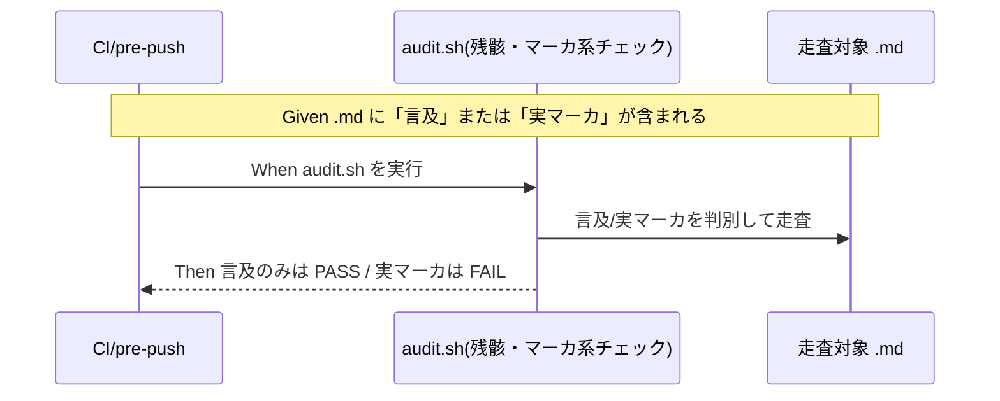

# 要件定義書: audit.sh 残骸・マーカ系チェックの散文誤検知（偽陽性）是正

**プロジェクト名**: audit.sh 残骸・マーカ系チェックの散文誤検知（偽陽性）是正
**作成日**: 2026 年 06 月 15 日
**最終更新**: 2026 年 06 月 15 日

> **重要**: **このドキュメントは常に更新**: 要件の変更や追加があった場合は、即座にこのドキュメントを更新してください。ドキュメントは「生きているドキュメント」として扱い、実装内容と常に同期させます。
>
> **用語**: [.agents/CONCEPTS.md §用語規約](../../../../../.agents/CONCEPTS.md#用語規約) を参照。

---

## 1. 概要

### 1.1 システム概要

`.agents/enforcement/ci/audit.sh` は CI／pre-push で証跡・CONTRACT 違反を検出する監査スクリプト。本件はそのうち**残骸・マーカ系チェック**（少なくとも #7「重要パスに TODO または FIXME が残存」）が、**散文・memo 本文中の語の言及**を実マーカと**部分一致で誤検知（偽陽性 FAIL）**する問題を是正する。真の検知力を弱めず、言及と実マーカ／実残骸を区別する。

### 1.2 用語集

| 用語 | 説明 |
| ---- | ---- |
| 実マーカ | 解決すべき未処理を示す実際のコード／文書マーカ（例: 行頭やコロン付きの `TODO:` `FIXME:` 形式）。本来検知すべき対象。 |
| 言及（mention） | チェック項目名・レビュー証跡・要件記述などで、マーカ語を**説明・記録**するために散文中に現れる文字列（例: 「TODO/FIXME 残骸チェック」「残骸タグ（… 等）0件」）。検知すべきでない対象。 |
| 残骸タグ | マーカ語そのものを語の部分一致で拾うチェックが対象とする「やり残しタグ」。本リポでは #7 の `TODO`/`FIXME` 系検知と同種。 |
| WORKFLOW_SCAN_DIRS | audit.sh が走査する workflow ディレクトリ群（本リポでは `docs/maintainer/workflow` を含む）。 |

---

## 2. 機能要件

### 2.1 ユーザーストーリー

#### ストーリー 1: 監査が散文の言及で誤って失敗しない

- **As a** 自己拡張 issue を進める保守者（および消費者ランタイムの利用者）
- **I want to** チェック項目名やレビュー証跡として残骸マーカ語を散文で書いても監査が FAIL しないこと
- **So that** 残骸そのものが無いのに偽陽性 FAIL でワークフローが止まらない

**受け入れ基準**:

- 実マーカを含まず言及のみを含む `.md` で、是正後の該当チェックは FAIL しない（SC1）。
- 既存の templates 除外・`/close/` 除外ガードは維持される。

#### ストーリー 2: 実マーカ／実残骸の検知力は維持される

- **As a** 監査の信頼性を保ちたい保守者
- **I want to** 偽陽性を消しても実マーカ／実残骸の検知が弱まらないこと
- **So that** 本来検知すべきやり残しが見逃されない

**受け入れ基準**:

- 実マーカ（行頭または行内のコロン付き等の実形）を含む `.md` で、是正後も従来どおり FAIL する（SC2）。
- 偽陰性（実マーカの見逃し）が新たに発生しないことを回帰テストで担保する（SC3）。

#### ストーリー 3: 二役（パッケージ正本／自己拡張）の双方で効く

- **As a** パッケージ保守者
- **I want to** 汎用消費者（`.workflow` のみ）と本リポ（`docs/maintainer/workflow` も）の双方で同一の是正が効くこと
- **So that** 後方互換を壊さず両ランタイムで偽陽性が解消される

**受け入れ基準**:

- WORKFLOW_SCAN_DIRS の解決仕様は変更しない。
- 本 issue 配下の 00/01 散文自体が該当チェックを FAIL させない（SC4）。

### 2.2 BDD ユースケース

#### ユースケース 1: 残骸・マーカ系チェックの言及/実マーカ判別

audit.sh の残骸・マーカ系チェックが、走査対象 `.md` に対して「言及のみ」と「実マーカ／実残骸」を判別する。

**シナリオ 1: 言及のみの散文は PASS**

```gherkin
Feature: 残骸・マーカ系チェックの偽陽性是正
  Scenario: チェック項目名・レビュー証跡としての言及のみを含む散文
    Given WORKFLOW_SCAN_DIRS 配下の .md に残骸マーカ語が「言及」としてのみ含まれる
      And その .md に実マーカ（解決すべき未処理を示す実形）は含まれない
    When audit.sh の残骸・マーカ系チェックを実行する
    Then 該当チェックは FAIL しない（偽陽性が出ない）
```

**シナリオ 2: 実マーカは従来どおり FAIL**

```gherkin
Feature: 残骸・マーカ系チェックの偽陽性是正
  Scenario: 解決すべき実マーカを含む散文
    Given WORKFLOW_SCAN_DIRS 配下の .md に実マーカ（行頭/コロン付き等の実形）が残存する
    When audit.sh の残骸・マーカ系チェックを実行する
    Then 該当チェックは従来どおり FAIL する（検知力を維持）
```

**処理フロー**:



#### ユースケース 2: 既存ガード・他チェックとの非干渉

是正は既存の除外ガード（templates・`/close/`）と他の失敗条件（#1〜#6, #8〜#29）に影響しない。

**シナリオ: 他チェックの挙動は不変**

```gherkin
Feature: 是正の非干渉
  Scenario: 残骸・マーカ系チェック以外の監査結果
    Given 既存の audit テスト（test/test-audit.sh）が定義されている
    When 是正後の audit.sh で全テストを実行する
    Then 残骸・マーカ系チェック以外の判定結果は是正前と変わらない
      And 全テストが PASS する
```

### 2.3 ビジネスルール

- 偽陽性を消すために検知力（実マーカ／実残骸の検知）を犠牲にしてはならない（偽陰性ゼロを優先）。
- 配布物の正本（`.agents/enforcement/ci/audit.sh`）のみを編集し、アダプタ生成物は build/setup の正規フローで再生成する（手で二重編集しない）。
- 検知パターンと除外条件は意図が明確に読めること（可読性優先）。

---

## 3. 非機能要件

### 3.1 パフォーマンス要件

- 検知ロジックの変更で audit.sh の実行時間が体感できるほど悪化しないこと（走査量を大きく増やさない）。

### 3.2 セキュリティ要件

- 外部アクセスを伴わない（ローカル／CI のファイル走査のみ）。

### 3.3 ユーザビリティ要件

- FAIL 時の出力（対象ファイルパス・ROLLBACK メッセージ）は既存の様式を踏襲し、何が実マーカとして検知されたかが分かること。

### 3.4 可用性要件

- macOS / Linux 双方の bash・grep（BSD/GNU）で動作すること（既存 audit.sh の方針に合わせる）。

---

## 4. 外部インターフェース要件

### 4.1 API 要件

- audit.sh の引数・環境変数インターフェース（PROJECT_ROOT, GIT_RANGE, WORKFLOW_DIR(S), WORKFLOW_SCAN_DIRS 等）は変更しない。

### 4.2 データ形式要件

- 走査対象は従来どおり `.md`。検知単位（行）・出力形式は既存を踏襲する。

---

## 5. 制約事項

- 本 issue は要求・要件 phase まで。検知パターン（アンカー／構文要件）の確定・除外条件の実装は後続フェーズ（02_設計・03_実装計画・実装）で行う。
- #7 以外の失敗条件の仕様変更は対象外（マーカ／残骸系のみ）。
- 既存ガード（templates 除外・`/close/` 除外）を撤去しない。

---

## 6. 参考資料

### プロジェクトドキュメント

- [`00_要求定義.md`](./00_要求定義.md) - 要求定義
- [`.agents/enforcement/ci/audit.sh`](../../../../../.agents/enforcement/ci/audit.sh) - 是正対象（#7 はおおよそ 296-317 行付近）
- [`.agents/enforcement/README.md`](../../../../../.agents/enforcement/README.md) - 失敗条件と差し戻しの正本

### その他の参考資料

- 親 issue「コア取り込み漏れ補完」全5サブ（S1〜S5）の verify-and-close 監査での偽陽性観測
- S1 でコア昇格した no-drop 原則

---

## 7. 前のステップ

この要件定義書は、以下のドキュメントを基に作成されています：

- **前**: [`00_要求定義.md`](./00_要求定義.md) - 要求定義フェーズ

---

## 8. 次のステップ

この要件定義書の承認後、以下のドキュメントを作成します：

- **次**: [`02_設計.md`](./02_設計.md) - 設計フェーズ
